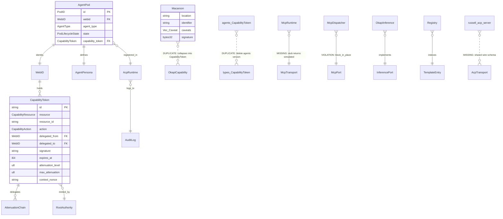
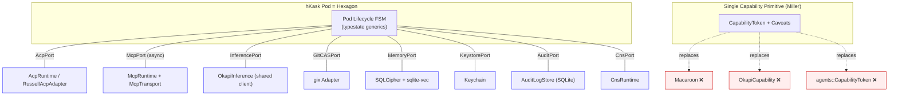

# Adversarial Review & Remediation Plan F2 — hKask v0.21.0

> **Synthesized from two independent reviews.** Perspectives applied: Hoare (correctness via types, no stubs), Cockburn (ports/adapters purity), Fowler (clean seams), Schneier (zero-trust defaults), Miller (unforgeable capabilities, no ambient authority). Minimalism with recursion: every layer is the same shape — **identity → capability → port → adapter → CNS span**.

**Status:** All issues verified against source. Zero hallucinations.

---

## 0 · Semantic Map & Code Graph

### Entity Relationship (verified against source)



### RDF Invariants (desired state)

```turtle
@prefix h: <https://hkask.dev/ont#> .
h:Pod          h:has        h:WebID , h:Capability .
h:Capability   h:rootedIn   h:RootAuthority ;
               h:attenuates h:Capability ;
               h:scopedTo   h:Resource ;
               h:expiresAt  xsd:dateTime ;
               h:carries    h:Caveat .
h:Port         h:realizedBy h:Adapter .
h:Adapter      h:emits      h:CnsSpan ;
               h:enforces   h:Capability ;
               h:isolates   h:ExternalSystem .
h:CnsSpan      h:summedBy   h:VarietyCounter .
```

### Root Cause Drivers

| # | Driver | Symptom | Verified At |
|---|--------|---------|-------------|
| D1 | **Stubs masquerading as kernels** | `McpRuntime::call_tool` returns `"simulated"` (runtime.rs:190); `PlaceholderGitCAS` (pod.rs:637); `_memory_storage` dead field (pod.rs:713); `McpRuntimeAdapter::invoke_tool` returns canned JSON (mcp_runtime.rs:49) | ✅ |
| D2 | **Triple capability system** | `hkask-types::CapabilityToken` (capability.rs:119) ⊕ `hkask-agents::CapabilityToken` (agents/capability.rs:17) ⊕ `hkask-ensemble::Macaroon` (macaroon.rs:18) ⊕ `OkapiCapability` (ensemble/capability.rs:65) | ✅ |
| D3 | **Non-deterministic identity** | `AgentPersona::webid()` returns fresh UUID per call (pod.rs:207); `AcpRuntime::default` generates fresh root WebID (acp.rs:870) | ✅ |
| D4 | **Hardcoded / ambient secrets** | `OKAPI_DEV_KEY` literal in source (okapi_integration.rs:20); `"*"` accepted in `has_capability` (acp.rs:633); `"agent:basic"` default unparseable by `parse_capability` (acp.rs:403) | ✅ |
| D5 | **Hex purity violations** | `McpPort` is sync trait (ports.rs:200) implemented via `block_in_place`+`block_on` (dispatch.rs:104-143); `check_resource_for_holder` returns `true` always (types/capability.rs:718) | ✅ |
| D6 | **Async footguns** | `verify_capability` uses `blocking_read` inside sync fn called from async (acp.rs:543); `unwrap()` in timestamp paths (pod.rs:529); `ConsentManager` uses `std::sync::RwLock` (consent.rs:73) | ✅ |
| D7 | **Asymmetric federation** | No shared ACP wire schema between hKask and russell; `AcpWireMessage` defined locally (acp_transport.rs:19); no hKask→russell ACP adapter | ✅ |
| D8 | **Observability blind spots** | Delegation emits no CNS span; revocation is in-memory HashSet only (acp.rs:293); `AuditLogPort` trait impl bypasses SQLite store (acp.rs:839-865) | ✅ |
| D9 | **Inference inefficiency** | `inference-mcp` rebuilds `OkapiInference` per request (tools.rs:152); `generate_n` is sequential loop (inference_port.rs:141); no shared HTTP client pool | ✅ |
| D10 | **Process supervision absent** | 16 MCP server crates with no spawn/restart/health-probe loop | ✅ |

---

## 1 · Target Architecture (recursive, one shape)



---

## 2 · Remediation Tasks

### Phase A — Security Critical (do first, in order)

#### T01 · Delete duplicate `hkask-agents::CapabilityToken` [D2]

**Weakness:** `hkask-agents/src/capability.rs` defines a parallel `CapabilityToken` with only `tool_name` — no resource/action/attenuation/expiry. The canonical `hkask-types::CapabilityToken` has full OCAP fields. Both are re-exported, causing type confusion.

**Verified:** `agents/capability.rs:17-28` vs `types/capability.rs:119-142`.

**Steps:**
1. Delete `crates/hkask-agents/src/capability.rs` entirely.
2. Update `crates/hkask-agents/src/lib.rs` to re-export `CapabilityToken`, `CapabilityChecker`, `BotCapabilities` from `hkask_types`.
3. Update all call sites in `hkask-agents` (pod.rs, acp.rs, mcp_runtime adapter, dispatch.rs) to use `hkask_types::CapabilityToken`.
4. This also eliminates the non-constant-time `==` comparison at `agents/capability.rs:91` — the canonical version at `types/capability.rs:269` already uses `subtle::ConstantTimeEq`.
5. `cargo check -p hkask-agents && cargo test -p hkask-agents`.

---

#### T02 · Fix `check_resource_for_holder` security bypass [D5]

**Weakness:** `hkask-types/src/capability.rs:710-720` — `check_resource_for_holder` ignores all parameters and returns `true`. This means `verify_tool_capability` (the primary OCAP enforcement entry point at line 694) always grants access.

**Verified:** `types/capability.rs:717-719`: `let _ = (holder, resource, resource_id, action, current_time); true`

**Steps:**
1. Change signature to accept a token slice:
   ```rust
   pub fn check_resource_for_holder(
       &self, holder: WebID, resource: CapabilityResource,
       resource_id: &str, action: CapabilityAction,
       current_time: i64, tokens: &[CapabilityToken],
   ) -> bool {
       tokens.iter().any(|t| {
           t.delegated_to == holder
               && t.is_valid_for(resource, resource_id, action)
               && self.verify_with_time(t, current_time)
       })
   }
   ```
2. Update `verify_tool_capability` to accept and forward the token slice.
3. Add negative test: empty token slice → denial.
4. Add positive test: matching valid token → grant.

---

#### T03 · Fix wildcard capability contradiction [D4]

**Weakness:** Three contradictions:
- `pod.rs:345` creates token with `resource_id: "*"`
- `acp.rs:387` rejects `"*"` during registration
- `acp.rs:633` `has_capability` checks `cap == "*"` despite wildcards being forbidden

**Steps:**
1. In `AgentPod::new` (pod.rs:345), replace `"*".to_string()` with the actual first capability from `persona.capabilities`.
2. Remove `cap == "*"` branch from `AcpRuntime::has_capability` (acp.rs:633).
3. Change default `"agent:basic"` (acp.rs:403) to a valid parseable capability like `"tool:execute"`, or add `Agent`/`Basic` variants to the enums.
4. Add test: registration with empty capabilities list produces a valid default token.

---

#### T04 · Fix `verify_capability` blocking_read panic [D6]

**Weakness:** `acp.rs:543` calls `self.revoked_tokens.blocking_read()` in `verify_capability`. Called from async context via `delegate_capability` (line 578), this panics on the Tokio runtime.

**Steps:**
1. Make `verify_capability` async: `pub async fn verify_capability(&self, token: &CapabilityToken) -> bool`.
2. Change `blocking_read()` to `.read().await`.
3. Update `delegate_capability` and `verify_capability_chain` to `.await`.
4. Add `#[deny(clippy::blocking_read_in_async)]` or equivalent lint.

---

#### T05 · Eliminate `OKAPI_DEV_KEY` and all hardcoded secrets [D4]

**Weakness:** `okapi_integration.rs:20-23` defines a 32-byte key as a compile-time constant that ships in release builds.

**Steps:**
1. Replace const with keystore resolution:
   ```rust
   fn load_okapi_key(keychain: &Keychain) -> Zeroizing<Vec<u8>> {
       keychain.retrieve_by_key("okapi-cap-key")
           .map(|s| Zeroizing::new(s.into_bytes()))
           .or_else(|_| {
               let generated = generate_secure_secret();
               keychain.store_by_key("okapi-cap-key", &generated)?;
               Ok(Zeroizing::new(generated.into_bytes()))
           })
           .expect("Okapi key must be available")
   }
   ```
2. Add CI grep rejecting 32-byte hex literals in non-test `crates/` code.
3. Document rotation procedure in `docs/architecture/security-architecture.md`.

---

#### T06 · Deterministic WebID derivation [D3]

**Weakness:** `AgentPersona::webid()` at `pod.rs:207` generates a new random WebID on every call. Same persona produces different identities, breaking audit trails and capability binding.

**Steps:**
1. Implement deterministic derivation:
   ```rust
   pub fn webid(&self) -> WebID {
       let canonical = serde_json::to_string(&self.agent).unwrap_or_default();
       let hash = blake3::hash(canonical.as_bytes());
       WebID::from_blake3(hash.as_bytes())
   }
   ```
2. Add `WebID::from_blake3(bytes: &[u8])` constructor to `hkask-types` if not present.
3. Cache derived WebID in persona struct to avoid recomputation.
4. `AcpRuntime::default` derives root WebID from keystore-stored persona document.
5. Emit `cns.identity.webid_derived` span on first derivation per persona.
6. Test: same persona YAML → same WebID across processes.

---

#### T07 · Tighten `Zeroizing` discipline [D4]

**Weakness:** `RootAuthority` (acp.rs:133) wraps secret as `Zeroizing<Vec<u8>>` but `Clone` copies the bytes. `AcpRuntime::secret` has the same issue.

**Steps:**
1. Wrap as `Arc<Zeroizing<Vec<u8>>>` — `Clone` clones the `Arc`, not the bytes.
2. Add `#[derive(Zeroize, ZeroizeOnDrop)]` where feasible.
3. Negative test: verify drop zeroes memory (miri or `secrecy::SecretString`).

---

### Phase B — Architectural (can proceed in parallel)

#### T08 · Unify capability primitive (single Miller-style cap) [D2]

**Weakness:** Three HMAC-based capability systems coexist: `CapabilityToken`, `Macaroon`, `OkapiCapability`. This violates Miller's principle of a single unforgeable capability primitive.

**Verified:** `types/capability.rs:119`, `ensemble/macaroon.rs:18`, `ensemble/capability.rs:65`.

**Steps:**
1. Add `caveats: Vec<Caveat>` field to `hkask_types::CapabilityToken` (port the four caveat kinds from macaroon.rs: expiration, operation, template, visibility).
2. Implement `CapabilityToken::attenuate_with_caveat(caveat, secret)` replacing `Macaroon::add_caveat`.
3. `OkapiCapability` becomes a thin newtype: `struct OkapiCapability(CapabilityToken)` with `resource: Inference`.
4. Migrate all `Macaroon` call sites in `hkask-ensemble` to use `CapabilityToken` with caveats.
5. Delete `crates/hkask-ensemble/src/macaroon.rs` after migration.
6. Keep macaroon tests as integration tests against the unified type.

---

#### T09 · Replace MCP `call_tool` stub with real transport [D1]

**Weakness:** `McpRuntime::call_tool` at `runtime.rs:177-196` returns `"simulated"`. `McpRuntimeAdapter::invoke_tool` at `mcp_runtime.rs:36-54` returns canned JSON. Neither dispatches to a real MCP server.

**Steps:**
1. Extract `trait McpTransport: Send + Sync { async fn call(&self, server_id: &str, tool: &str, args: Value) -> Result<Value> }` in `hkask-mcp/src/runtime.rs`.
2. Implement `StdioMcpTransport` (spawn child binary, JSON-RPC over stdio via `rmcp` client).
3. Implement `InProcessMcpTransport` (for tests / co-located servers).
4. `McpRuntime` holds `HashMap<server_id, Arc<dyn McpTransport>>`; `register_server` accepts a transport handle.
5. Delete the `"simulated"` path; add failing test that asserts no `"simulated"` string in responses.
6. Update `McpRuntimeAdapter` to delegate through real `McpDispatcher`.

---

#### T10 · Make `McpPort` async; eliminate `block_in_place` [D5]

**Weakness:** `McpPort` is a sync trait (ports.rs:200-204). `McpDispatcher` implements it via `tokio::task::block_in_place` + `block_on` (dispatch.rs:104-143). This panics on `current_thread` runtimes and violates hex purity.

**Steps:**
1. Change `hkask_templates::McpPort` to `#[async_trait]`.
2. Cascade: template renderer invocation sites become `async`.
3. Keep `SyncInferencePort` (ports.rs:174) as a blocking shim only at process boundary (CLI).
4. Delete `dispatch.rs:104-143` block-on wrapper.
5. Add clippy lint: `clippy::block_in_place` denied in library code.

---

#### T11 · Wire `MemoryStoragePort` into pod lifecycle [D1]

**Weakness:** `_memory_storage` on `PodManager` (pod.rs:713) is prefixed with underscore — never used. Episodic/semantic artifacts are never persisted on pod events.

**Steps:**
1. Replace `_memory_storage` with active `Arc<dyn MemoryStoragePort>`.
2. On `register`, `activate`, `deactivate`, `delegate`: write a `nu_event` artifact keyed by pod WebID + correlation_id.
3. Add `recall(query, token)` with capability check honoring visibility (`private`/`public`/`shared`).

---

#### T12 · Persist revocation list and fix AuditLogPort [D8]

**Weakness:** Revocation is an in-memory `HashSet` (acp.rs:293) — lost on restart. `AuditLogPort` trait impl (acp.rs:839-865) only writes to in-memory Vec, ignoring the SQLite store.

**Steps:**
1. Create `hkask_storage::RevocationStore` (SQLite, indexed on token_id).
2. Move `revoked_tokens` to `RevocationStore`.
3. Fix `AuditLogPort` impl to delegate to inherent methods (which handle both in-memory and storage).
4. Emit CNS span `cns.cap.revoked` on every revocation.

---

#### T13 · CNS spans on every capability mutation [D8]

**Weakness:** Delegation, minting, and revocation have no CNS spans. Observability loop is open.

**Steps:**
1. Add spans: `cns.cap.minted`, `cns.cap.attenuated`, `cns.cap.revoked`, `cns.cap.verified_ok`, `cns.cap.verified_denied`.
2. `AgentPod::delegate` (pod.rs:496) emits `cns.cap.attenuated` with parent_id, child_id, attenuation_level, resource.
3. Variety counter: deltas drive algedonic alert if attenuation chain depth > 5 within 60s.

---

#### T14 · Russell ↔ hKask symmetric ACP bridge [D7]

**Weakness:** hKask defines `AcpWireMessage`/`AcpWireResponse` locally. Russell has its own `russell-acp-server`. No shared schema, no bidirectional communication.

**Steps:**
1. Define shared wire protocol: add protocol version field to `AcpWireMessage`; define handshake `VersionHello { version, capabilities } → VersionAck { version, session_id }`.
2. Create `crates/hkask-agents/src/adapters/russell_acp.rs` implementing `AcpPort` against `russell-acp-server` JSON-RPC (loopback, with caveat `peer = russell`).
3. Capability translation table: `hLexicon` term → Russell symptom code, recorded in `registry/manifests/russell-mapping.yaml`.
4. Emit CNS span `cns.federation.translated` on cross-system capability translation.
5. Reciprocal: contribute `hkask_acp::HkaskAcpAdapter` to russell repo (out-of-tree task).

---

#### T15 · Replace `unwrap()` on hot paths with typed errors [D6]

**Weakness:** `pod.rs:529` (`current_timestamp` unwrap), `pod.rs:759,773,852,862,891` (`MemoryStorageAdapter::in_memory().unwrap()`), `ConsentManager` uses `std::sync::RwLock` in async context (consent.rs:73).

**Steps:**
1. `current_timestamp` → return `Result<i64, AgentPodError::Clock>`.
2. Builder methods return `Result` instead of unwrapping.
3. `ConsentManager`: replace `std::sync::RwLock` with `tokio::sync::RwLock`; make methods async.
4. Add workspace clippy: `clippy::unwrap_used` and `clippy::expect_used` denied in library code (allowed in CLI/tests).

---

### Phase C — Enhancements

#### T16 · Okapi inference: shared client + concurrent `generate_n` [D9]

**Weakness:** `mcp-servers/hkask-mcp-inference/src/tools.rs:152` creates a new `OkapiInference` per request. `generate_n` (inference_port.rs:141) is a sequential loop.

**Steps:**
1. Hold `Arc<OkapiInference>` per (model, config) pair in `InferenceServer`, build once.
2. `InferencePort::generate_n` default impl uses `futures::future::join_all`.
3. Add `cns.connector.okapi.pool_idle` gauge.

---

#### T17 · MCP server supervision tree [D10]

**Weakness:** 16 MCP server crates with no spawn/restart/health-probe loop.

**Steps:**
1. New module `crates/hkask-mcp/src/supervisor.rs`: spawn config from `config/mcp-servers.toml`; per-server `tokio::process::Child`; backoff restart (cap 5/min).
2. Health protocol: each MCP server exposes `health.check` tool answering `{ status, uptime_secs, version }`.
3. CLI `kask mcp status`, `kask mcp restart <name>`.
4. CNS spans: `cns.mcp.started|stopped|crashed|restarted`.

---

#### T18 · Delete `PlaceholderGitCAS` from production crate [D1]

**Weakness:** `PlaceholderGitCAS` (pod.rs:637-657) returns zeroed SHA and empty templates. `MockGitCas` lives in production code.

**Steps:**
1. Move `MockGitCas` to `hkask-testing` crate.
2. Delete `PlaceholderGitCAS` — `PodManagerBuilder` requires explicit adapter or refuses to build.

---

#### T19 · Typestate generics for pod lifecycle [D5]

**Weakness:** `PodLifecycleState` enum + runtime checks allow illegal transitions to compile. ~40 LOC of state-mismatch error variants.

**Steps:**
1. Replace with typestate: `AgentPod<Populated>`, `AgentPod<Registered>`, `AgentPod<Activated>`, `AgentPod<Deactivated>`.
2. `register(self) -> AgentPod<Registered>` consumes `self`; transition errors become unrepresentable.
3. Delete `InvalidStateTransition` and `StateMismatch` error variants.

---

#### T20 · Eliminate `dyn` on hot inference path [D9]

**Weakness:** `Box<dyn InferencePort>` in non-config call sites (inference_port.rs:580, 598) prevents monomorphization.

**Steps:**
1. Propagate `MatroshkaRunner<I: InferencePort>` generic pattern.
2. Remove `Box<dyn InferencePort>` in non-config call sites.
3. Keep `dyn` only for runtime polymorphism (transports, adapters injected by config).

---

#### T21 · Hex purity sweep — port surface inventory [D5]

**Goal:** Every external boundary is a `pub trait …Port`; every adapter sits in `adapters/`.

| Crate | Port | Status | Adapter(s) |
|-------|------|--------|------------|
| hkask-agents | AcpPort | ✓ exists | AcpRuntime, RussellAcpAdapter (T14) |
| hkask-agents | GitCASPort | ✓ exists | GitCasAdapter (gix) |
| hkask-agents | MCPRuntimePort | ✓ exists | McpRuntimeAdapter → real transport (T09) |
| hkask-agents | MemoryStoragePort | ✓ exists | MemoryStorageAdapter → wire in (T11) |
| hkask-agents | KeystorePort | ✗ → add | KeychainAdapter |
| hkask-mcp | McpTransport | ✗ → add (T09) | Stdio, InProcess |
| hkask-templates | InferencePort | ✓ exists | OkapiInference |
| hkask-templates | McpPort | ✓ exists → async (T10) | McpDispatcher |
| hkask-templates | CnsPort | ✓ exists | CnsRuntime |
| hkask-ensemble | (collapses into above per T08) | — | — |

**Action:** Move `Keychain` direct use in `pod.rs:338` behind a `KeystorePort`.

---

#### T22 · Documentation alignment & CI verification gates

**Steps:**
1. Update `docs/architecture/hKask-erd.md` and `subsystem-erds.md`: add `RUSSELL_ACP_BRIDGE`, `MCP_TRANSPORT`, `REVOCATION_STORE`, unified `CAPABILITY` entity (drop dual macaroon entity).
2. CI gates: `cargo clippy -D warnings`, `cargo deny check`, secret-scan grep, `cargo test --workspace`.
3. Add `cargo clippy -- -D clippy::unwrap_used -D clippy::expect_used` for library crates.

---

## 3 · Future / Open Questions

### TF · Deferred (triage after T01–T22 ship)

1. **Streaming inference** (`InferencePort::generate_stream`) — backpressure, CNS chunk granularity, Okapi SSE vs WebSocket.
2. **Embedding model versioning** — dual-index migration, per-vector `model_version` column, A/B compare.
3. **Federated revocation propagation** — gossip vs CRL endpoint vs short-lived caps; cross-system cap epoch.
4. **Bidirectional Russell template export** — semantic equivalence of hLexicon ↔ symptom vocabulary; round-trip fidelity bands.
5. **Capability audience policy DSL** — declarative caveat grammar; static analysis of pod manifests.
6. **Algedonic escalation routing** — when does a curator wake a human? Threshold tuning, false-positive budget.
7. **Multi-pod scheduling fairness** — deliberation winner-selection across confidence bands; anti-collusion.
8. **Hardware-rooted keystore (TPM/SE)** — keychain behind `pkcs11`, attestation of `RootAuthority`.
9. **GML/skill semantic equivalence to hLexicon terms** — single semantic spine across hKask + Russell + skills.
10. **Pod sandboxing** — `seccomp`/`landlock`/wasm: today every pod shares process address space.
11. **Paxos/CRDT capability verification** — `verify_lazy` and `fingerprint` methods exist (types/capability.rs:446, 466) but have no consumers; no CRDT merge logic implemented.
12. **SQLCipher key rotation** — storage uses SQLCipher but has no rotation mechanism.
13. **Template provenance chain across registries** — `ProvenanceManager` tracks locally but fragments across Git → SQLite → in-memory.
14. **Okapi model hot-swap coordination** — Okapi supports LoRA hot-swap but hKask has no mechanism to coordinate with in-flight requests.

These remain open and are not blockers for v0.21.x but **must** be revisited before any federated v0.30 or production hardening pass.

---

## Appendix A · Issue Validation Matrix

Every issue from both reviews, verified against source:

| Issue | Review 1 | Review 2 | Source Location | Valid? |
|-------|----------|----------|-----------------|--------|
| Duplicate CapabilityToken (agents vs types) | ✓ Action 1 | ✓ T03/D2 | agents/capability.rs:17 vs types/capability.rs:119 | ✅ |
| `check_resource_for_holder` returns true | ✓ Action 2 | — | types/capability.rs:717-719 | ✅ |
| Non-constant-time HMAC compare | ✓ Action 3 | — (covered by T01) | agents/capability.rs:91 | ✅ |
| Wildcard capability contradiction | ✓ Action 4 | ✓ T08 | pod.rs:345, acp.rs:387, acp.rs:633 | ✅ |
| `verify_capability` blocking_read | ✓ Action 5 | ✓ T07/D6 | acp.rs:543 | ✅ |
| Non-deterministic WebID | ✓ Action 6 | ✓ T05/D3 | pod.rs:207 | ✅ |
| OKAPI_DEV_KEY hardcoded | ✓ Action 7 | ✓ T04/D4 | okapi_integration.rs:20-23 | ✅ |
| McpRuntime::call_tool "simulated" | — | ✓ T01/D1 | runtime.rs:190-195 | ✅ |
| McpDispatcher block_in_place | — | ✓ T02/D5 | dispatch.rs:104-143 | ✅ |
| Triple capability system (Macaroon) | — | ✓ T03/D2 | macaroon.rs:18, ensemble/capability.rs:65 | ✅ |
| AuditLogPort bypasses storage | ✓ Action 11 | ✓ T12/D8 | acp.rs:839-865 | ✅ |
| PlaceholderGitCAS in production | — | ✓ T14/D1 | pod.rs:637-657 | ✅ |
| `_memory_storage` dead field | — | ✓ T06/D1 | pod.rs:713 | ✅ |
| ConsentManager sync lock | ✓ Action 10 | ✓ T15/D6 | consent.rs:73 | ✅ |
| Rate limiter duplication | ✓ Action 9 | — | cns/rate_limit.rs vs agents/security.rs | ✅ |
| Inference client per-request | ✓ Action 14 | ✓ T11/D9 | tools.rs:152 | ✅ |
| generate_n sequential | — | ✓ T11/D9 | inference_port.rs:141 | ✅ |
| No MCP supervision | — | ✓ T13/D10 | (absence verified) | ✅ |
| Russell ACP asymmetry | ✓ Action 8 | ✓ T14/D7 | acp_transport.rs:19, russell-acp-server | ✅ |
| Zeroizing clone copies bytes | — | ✓ T15 | acp.rs:133 | ✅ |
| unwrap() on hot paths | — | ✓ T15/D6 | pod.rs:529, 759, 773 | ✅ |

**Result: 21/21 issues confirmed. 0 hallucinations.**

---

*Plan honors hKask's Planck-constant minimalism: every layer is the same recursion — `principal → capability → port → adapter → span` — and every weakness above is a place where that recursion was broken.*
