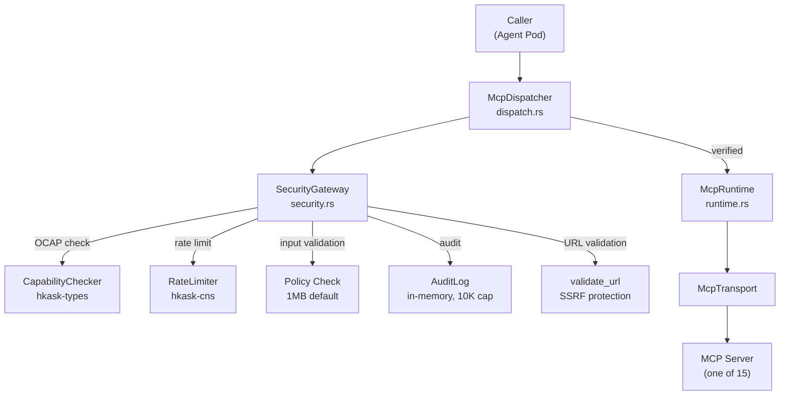
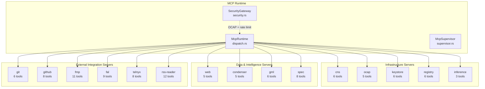
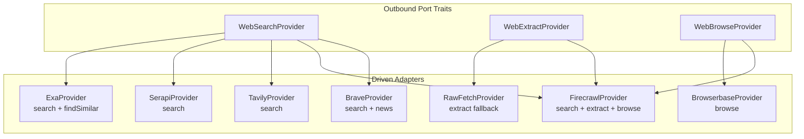
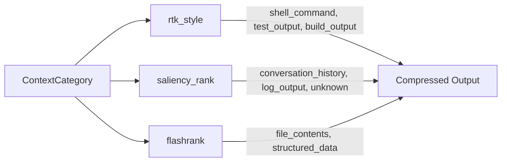
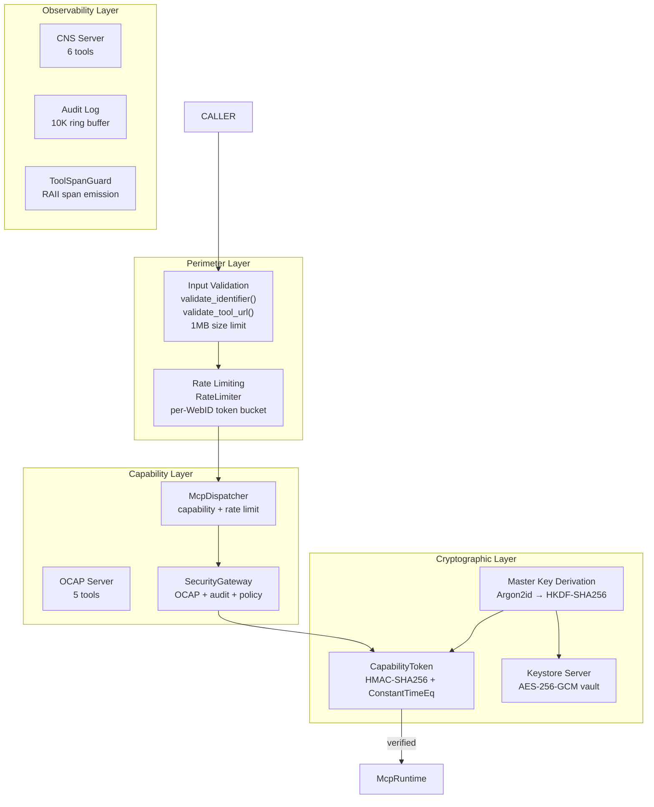

# hKask MCP Server Specification & Architecture

**Version:** 0.21.0  
**Date:** 2026-05-27  
**Scope:** MCP server specifications, standards, security architecture, and tool inventory for hKask  
**Status:** Active (Phases 1 & 3 complete; Phase 2 scholar removed)

---

## Part 1: hKask MCP Server Standard

### 1.1 Protocol & Transport

All hKask MCP servers use **rmcp** (Rust MCP) implementing JSON-RPC 2.0:

| Transport | Type | Status | Use Case |
|-----------|------|--------|----------|
| `rmcp::transport::stdio()` | Stdio | ✅ Active | Default for all server binaries |
| `InProcessMcpTransport` | In-process | ✅ Active | Co-located servers within `kask` process |
| `StdioMcpTransport` | Stdio (child) | 🏗 Scaffold | Child process servers via `McpSupervisor` |
| `HttpMcpTransport` | HTTPS | 🏗 Scaffold | Remote servers with OCAP token auth |

### 1.2 Server Binary Architecture

Every hKask MCP server binary follows this canonical structure:

```
mcp-servers/hkask-mcp-{name}/
├── Cargo.toml
└── src/
    ├── main.rs         # Server entry point (uses shared scaffolding)
    ├── types.rs        # Request/response/domain types (larger servers)
    ├── algorithms.rs   # Algorithm implementations (condenser)
    ├── providers.rs    # Hexagonal provider traits + adapters (web)
    ├── cache.rs        # Caching layer (web)
    └── strip_html.rs   # HTML utilities (web)
```

**`main.rs` structure (canonical):**
1. Imports from `hkask_mcp::server` (shared scaffolding)
2. Constants (`SERVER_VERSION`, API base URLs, rate limits)
3. Request types (`#[derive(Deserialize, JsonSchema)]`)
4. Domain types (internal, no I/O)
5. Outbound port traits (if hexagonal — `#[async_trait]`)
6. Driven adapter implementations
7. Server struct with `#[tool_router(server_handler)]` impl block
8. `#[tokio::main] async fn main()` using `run_stdio_server()`

### 1.3 Shared Scaffolding API (`hkask_mcp::server`)

| Export | Purpose |
|--------|---------|
| `McpToolError` | Structured errors with `McpErrorKind` classification |
| `McpToolOutput` | Structured output with optional metadata and timing |
| `CredentialRequirement` | Declarative credential needs (required/optional) |
| `ServerContext` | Server initialization context (WebID + credentials map) |
| `ToolSpanGuard` | RAII CNS span guard — emits start/end automatically |
| `AuthConfig` | Authentication configuration (Bearer, CustomHeader, QueryParam, None) |
| `classify_http_error(service, status, body)` | HTTP status → McpToolError mapping |
| `api_get(client, service, url)` | Authenticated GET with auto error classification |
| `api_post(client, service, url, payload)` | Authenticated POST with auto error classification |
| `build_authenticated_client(auth_config)` | Build reqwest client with auth headers |
| `resolve_credential(env_var)` | Keystore-first credential resolution |
| `emit_tool_span(tool, outcome, duration_ms, error_kind)` | CNS `cns.tool` tracing span emission |
| `emit_tool_span_with_caller(tool, caller, outcome, duration_ms, error_kind)` | CNS span with caller context |
| `validate_identifier(name, value, max_len)` | Input sanitization for identifiers |
| `validate_tool_url(url)` | SSRF-protected URL validation |
| `run_stdio_server(name, version, factory, credentials)` | Common bootstrap (tracing, cred check, rmcp serve) |

### 1.4 Security Module (`hkask_mcp::security`)

| Export | Purpose |
|--------|---------|
| `SecurityGateway` | OCAP verification + rate limiting + audit logging + input validation |
| `SecurityPolicy` | Configurable policy (max input size, allowed/denied tools, capability enforcement) |
| `AuditEntry` / `AuditAction` | Structured audit log entries |
| `UrlValidationConfig` | SSRF protection configuration |
| `validate_url(raw_url, config)` | Standalone URL validation (rejects non-HTTP, private IPs, loopback, embedded creds) |

### 1.5 Runtime Module (`hkask_mcp::runtime`)

| Export | Purpose |
|--------|---------|
| `McpRuntime` | Server registry, tool discovery, dispatch |
| `McpServer` | Server registration (id, name, tools, transport) |
| `McpTool` | Tool definition (name, description, schema, server_id) |
| `ToolInfo` | Extended tool metadata (capability, rate limit hint) |

### 1.6 Dispatch Module (`hkask_mcp::dispatch`)

| Export | Purpose |
|--------|---------|
| `McpDispatcher` | OCAP capability verification + rate limiting + CNS event emission |
| `McpMcpRetryConfig` | Retry configuration (max_retries, backoff_base, retryable_status) |

### 1.7 Supervisor Module (`hkask_mcp::supervisor`)

| Export | Purpose |
|--------|---------|
| `McpSupervisor` | Process lifecycle management with CNS event emission |
| `ServerConfig` | Server configuration (name, command, args, env, restart_policy) |
| `RestartPolicy` | Never / Always / OnFailure with backoff |
| `ServerStatus` | Running state, PID, restart count, uptime |
| `SupervisionError` | Structured error type |

### 1.8 Tool Method Convention

```rust
#[tool(description = "Human-readable description")]
async fn tool_name(
    &self,
    Parameters(RequestType { field1, field2 }): Parameters<RequestType>,
) -> String {
    let span = ToolSpanGuard::new("tool_name", &self.webid);
    // 1. Input validation
    if let Err(e) = validate_identifier("field1", &field1, 64) {
        return span.error(e.kind, e.to_json_string());
    }
    // 2. Business logic
    match some_operation().await {
        Ok(v) => span.ok(McpToolOutput::new(v).to_json_string()),
        Err(e) => span.error(e.kind, e.to_json_string()),
    }
}
```

**Key pattern:** `ToolSpanGuard` provides RAII-style CNS span tracking. On `ok()`, it emits a success span; on `error()`, it emits a failure span. On drop (if neither called), it emits a timeout span. This eliminates the need for manual `Instant::now()` / elapsed calculation.

### 1.9 Credential Resolution Protocol

Resolution order for every credential:
1. **HKDF-derived** — `SecretRef::Derived` from master key via `hkask_keystore::resolve()` (preferred, deterministic)
2. **OS keychain** — `SecretRef::Keychain` via `hkask_keystore::Keychain::retrieve_by_key()`
3. **Environment variable** — `SecretRef::Env` via `std::env::var()`

All API key env vars follow `HKASK_{SERVICE}_API_KEY` or `HKASK_{SERVICE}_TOKEN` naming.

### 1.10 Error Classification Protocol

HTTP status codes map to `McpErrorKind` uniformly:

| Status | McpErrorKind | Retryable |
|--------|-------------|-----------|
| 401/403 | `PermissionDenied` | No |
| 404 | `NotFound` | No |
| 422 | `InvalidArgument` | No |
| 429 | `RateLimited` | Yes |
| 502/503 | `Unavailable` | Yes |
| Other 5xx | `Unavailable` | Yes |
| Other | `Internal` | No |

### 1.11 Security Gateway Integration

All tools are gated through `SecurityGateway` (`hkask-mcp/src/security.rs`):



| Enforcement | Implementation |
|-------------|---------------|
| OCAP capability verification | `CapabilityChecker` with HMAC-SHA256 |
| Rate limiting per WebID | `RateLimiter` token bucket |
| Input size validation | 1MB default (`SecurityPolicy.max_input_size`) |
| Tool allow/deny list | `SecurityPolicy.allowed_tools` / `denied_tools` |
| SSRF URL validation | `validate_url()` / `validate_tool_url()` |
| Audit logging | `AuditEntry` in-memory ring buffer (10K cap) |

### 1.12 CNS Observability Protocol

Every tool emits CNS spans via `ToolSpanGuard`:

| Span Pattern | Phase | When |
|-------------|-------|------|
| `cns.tool.{name}.invoked` | observe | Before dispatch |
| `cns.tool.{name}.completed` | outcome | On success |
| `cns.tool.{name}.failed` | outcome | On error |
| `cns.tool.{name}.unauthorized` | observe | On capability denial |
| `cns.tool.rate_limit_exceeded` | observe | On rate limit |
| `cns.connector.{name}.started` | observe | Server start |
| `cns.connector.{name}.stopped` | observe | Server stop |
| `cns.connector.{name}.error` | observe | Server crash |

### 1.13 Tool Tier Classification

| Tier | Description | Example |
|------|-------------|---------|
| **Utility** | Liveness, health, configuration | `web_ping`, `condenser_ping`, `fal_ping`, `cns_health` |
| **L2 Upstream** | Thin wrapper over external API | `github_get_repo`, `web_search`, `fmp_quote` |
| **L2 Store** | Local persistence (no network) | `keystore_set`, `rss_get_entries`, `condenser_compress` |
| **L3 Composite** | Multi-step orchestration across L2 tools | `web_find_similar`, `condenser_compress` (profile-aware) |

---

## Part 2: MCP Server Inventory (15 Servers)

### 2.1 Complete Tool Surface



### 2.2 Server Details

| # | Server | Crate | Tools | Tier | Credentials | External Dep |
|---|--------|-------|-------|------|-------------|---------------|
| 1 | **cns** | `hkask-mcp-cns` | 6: `cns_emit`, `cns_variety`, `cns_alert`, `cns_calibrate`, `cns_list_alerts`, `cns_health` | Utility + L2 Store | `HKASK_CNS_THRESHOLD` (optional) | None |
| 2 | **condenser** | `hkask-mcp-condenser` | 5: `condenser_ping`, `condenser_compress`, `condenser_set_profile`, `condenser_stats`, `condenser_classify` | Utility + L2 | None | None (local CPU) |
| 3 | **fal** | `hkask-mcp-fal` | 9: `fal_ping`, `fal_generate_image`, `fal_generate_image_fast`, `fal_image_to_image`, `fal_upscale`, `fal_generate_video`, `fal_generate_music`, `fal_whisper`, `fal_caption`, `fal_generate_3d` | L2 Upstream | `HKASK_FAL_API_KEY` (required) | fal.ai API |
| 4 | **fmp** | `hkask-mcp-fmp` | 11: `fmp_ping`, `fmp_company_profile`, `fmp_quote`, `fmp_income_statement`, `fmp_balance_sheet`, `fmp_cash_flow_statement`, `fmp_key_metrics`, `fmp_historical_price`, `fmp_search`, `fmp_analyst_estimates`, `fmp_dcf` | L2 Upstream | `HKASK_FMP_API_KEY` (required) | Financial Modeling Prep API |
| 5 | **git** | `hkask-mcp-git` | 6: `git_resolve`, `git_snapshot`, `git_clone`, `git_fork`, `git_diff`, `git_list` | L2 Store | `HKASK_GIT_BASE_PATH` (optional) | Local git |
| 6 | **github** | `hkask-mcp-github` | 8: `github_get_repo`, `github_list_issues`, `github_get_issue`, `github_create_issue`, `github_add_comment`, `github_list_prs`, `github_get_pr`, `github_search_repos` | L2 Upstream | `HKASK_GITHUB_TOKEN` (required) | GitHub REST API v3 |
| 7 | **gml** | `hkask-mcp-gml` | 6: `gml_compute_equilibrium`, `gml_bind_effector`, `gml_create_capability`, `gml_verify_capability`, `gml_compute_hill`, `gml_assess_cooperativity` | L2 Store | None (Ed25519 keygen) | None (local compute) |
| 8 | **inference** | `hkask-mcp-inference` | 3: `inference:generate`, `inference:metrics`, `inference:models` | L2 Upstream | `HKASK_OKAPI_API_KEY` (via keystore) | Okapi LLM API |
| 9 | **keystore** | `hkask-mcp-keystore` | 6: `keystore_set`, `keystore_get`, `keystore_rotate`, `keystore_delete`, `keystore_list`, `keystore_prompt` | L2 Store | None (AES-256-GCM vault) | None (local vault) |
| 10 | **ocap** | `hkask-mcp-ocap` | 5: `ocap_delegate`, `ocap_verify`, `ocap_revoke`, `ocap_enumerate`, `ocap_list_tokens` | L2 Store | `HKASK_OCAP_SECRET` (required) | None (local HMAC) |
| 11 | **registry** | `hkask-mcp-registry` | 6: `registry_index`, `registry_discover`, `registry_validate`, `registry_reload`, `registry_compose`, `registry_get` | L2 Store | `HKASK_REGISTRY_DB` (optional) | SQLite |
| 12 | **rss-reader** | `hkask-mcp-rss-reader` | 12: `rss_subscribe`, `rss_unsubscribe`, `rss_list_subscriptions`, `rss_fetch`, `rss_get_entries`, `rss_mark_all_read`, `rss_get_unread_count`, `rss_search`, `rss_export_opml`, `rss_import_opml`, `rss_discover_feeds`, `rss_edit_tag` | L2 Store + L2 Upstream | None | HTTP feed fetch |
| 13 | **spec** | `hkask-mcp-spec` | 8: `spec_goal_capture`, `spec_goal_decompose`, `spec_require_bind`, `spec_curate_evaluate`, `spec_curate_reconcile`, `spec_curate_cultivate`, `spec_graph_query`, `spec_graph_validate` | L2 Store + L3 Composite | None | None (local SQLite) |
| 14 | **telnyx** | `hkask-mcp-telnyx` | 8: `telnyx_ping`, `telnyx_list_numbers`, `telnyx_buy_number`, `telnyx_send_sms`, `telnyx_make_call`, `telnyx_send_whatsapp`, `telnyx_tts`, `telnyx_list_voices` | L2 Upstream | `HKASK_TELNYX_API_KEY` (required) | Telnyx API v2 |
| 15 | **web** | `hkask-mcp-web` | 5: `web_ping`, `web_search`, `web_find_similar`, `web_extract`, `web_browse` | L2 + L3 | ≥1 search key (required), others optional | Multiple provider APIs |

> **Total: 94 tools across 15 servers**

---

## Part 3: Web Server Architecture (`hkask-mcp-web`)

### 3.1 Identity
- **Crate:** `hkask-mcp-web`
- **Description:** Unified web search, content extraction, semantic similarity, and interactive browsing via multi-provider routing
- **Tool tier:** L2 (upstream) + L3 (composite: `web_find_similar`)

### 3.2 Tool Surface (5 tools)

| Tool | Tier | Description | Required Params | Optional Params |
|------|------|-------------|-----------------|-----------------|
| `web_ping` | utility | Liveness + provider health check + rate limit status | — | — |
| `web_search` | L2 | Multi-provider keyword/semantic search with RRF fusion | `query` | `num_results`, `include_domains`, `exclude_domains`, `freshness`, `strategy` |
| `web_find_similar` | L3 | Find pages similar to a URL via Exa findSimilar | `url` | `num_results` |
| `web_extract` | L2 | Extract content from URL → markdown/JSON | `url` | `format`, `json_prompt`, `json_schema`, `main_content_only`, `wait_for_ms` |
| `web_browse` | L2 | Interactive JS-heavy page navigation | `url` | `instruction`, `timeout_secs` |

### 3.3 Provider Architecture (Hexagonal)



| Provider | Traits | API Base | Auth | Capabilities |
|----------|--------|----------|------|-------------|
| **BraveProvider** | Search | `https://api.search.brave.com/res/v1` | `X-Subscription-Token` | keyword, news, freshness |
| **FirecrawlProvider** | Search, Extract, Browse | `https://api.firecrawl.dev/v1` | `Bearer` | search, extract (md/json), browse |
| **TavilyProvider** | Search | `https://api.tavily.com` | `Bearer` | keyword, depth |
| **SerapiProvider** | Search | `https://serpapi.com/search` | `api_key` param | keyword, news |
| **ExaProvider** | Search + findSimilar | `https://api.exa.ai` | `x-api-key` | semantic, findSimilar |
| **BrowserbaseProvider** | Browse | `https://www.browserbase.com` | `Bearer` | headless browse |
| **RawFetchProvider** | Extract only | (direct HTTP) | (none) | basic HTML→text |

### 3.4 Strategy Engine

| Strategy | Flow | Primary | Fallback |
|----------|------|---------|----------|
| `quick` | Single keyword search | Brave | Firecrawl → Tavily |
| `web` | All search providers concurrent | All providers | RRF fusion |
| `news` | News-capable providers only | Brave | Serapi |
| `deep` | All providers + rerank + extract | All providers | RRF + semantic |

### 3.5 Cache

- **Backend:** In-memory `RwLock<HashMap<CacheKey, CacheEntry>>`
- **TTL:** Default 300s, max 7200s (`HKASK_WEB_CACHE_TTL_SECS`)
- **Max entries:** Default 50, max 200 (`HKASK_WEB_CACHE_MAX_ENTRIES`)
- **Max value size:** 256KB (`MAX_CACHE_VALUE_BYTES`)
- **Key:** blake3 hash of (strategy + query/url + serialized params + provider fingerprint)
- **Invalidation:** Provider fingerprint changes invalidate all cached entries

### 3.6 Credentials

| Env Var | Provider | Required |
|---------|----------|----------|
| `HKASK_BRAVE_API_KEY` | BraveProvider | At least one search key required |
| `HKASK_FIRECRAWL_API_KEY` | FirecrawlProvider | Optional (enables extract/browse) |
| `HKASK_TAVILY_API_KEY` | TavilyProvider | Optional (enables search) |
| `HKASK_SERPAPI_API_KEY` | SerapiProvider | Optional (enables search) |
| `HKASK_EXA_API_KEY` | ExaProvider | Optional (enables search + findSimilar) |
| `HKASK_BROWSERBASE_API_KEY` | BrowserbaseProvider | Optional (enables browse) |

### 3.7 Input Validation & Rate Limiting

| Protection | Implementation |
|-----------|---------------|
| Query length | `MAX_QUERY_LENGTH` (256 chars) |
| URL length | `MAX_URL_LENGTH` (2048 chars) |
| Instruction length | `MAX_INSTRUCTION_LENGTH` (4096 chars) |
| JSON prompt length | `MAX_JSON_PROMPT_LENGTH` (8192 chars) |
| JSON schema size | `MAX_JSON_SCHEMA_BYTES` (65536 bytes) |
| SSRF protection | `validate_tool_url()` on all URL params |
| Rate limiting | Per-tool `RateLimiter` (100 req/window) |
| Provider timeout | `COMPOUND_PROVIDER_TIMEOUT_SECS` (30s) |

### 3.8 Error Domain (`WebError`)

| Variant | McpErrorKind |
|---------|-------------|
| `BadArgs` | `InvalidArgument` |
| `ProviderUnavailable` | `Unavailable` |
| `ProviderError` | `Internal` |
| `RateLimited` | `RateLimited` |
| `NoProvider` | `Unavailable` |

---

## Part 4: Condenser Server Architecture (`hkask-mcp-condenser`)

### 4.1 Identity
- **Crate:** `hkask-mcp-condenser`
- **Description:** Context condensation — compress tool outputs, manage profiles, classify categories
- **Tool tier:** L2 (local engine, no network)
- **Phase 1 complete.** Phase 2 (LLM-assisted algorithms) deferred.

### 4.2 Tool Surface (5 tools)

| Tool | Tier | Description | Required Params | Optional Params |
|------|------|-------------|-----------------|-----------------|
| `condenser_ping` | utility | Liveness + profile info + algorithm list | — | — |
| `condenser_compress` | L2 | Compress tool output using context-aware algorithms | `tool_name`, `output` | `category` |
| `condenser_set_profile` | L2 | Set compression aggressiveness | `profile` | — |
| `condenser_stats` | L2 | Cumulative compression statistics | — | — |
| `condenser_classify` | L2 | Classify tool name → context category | `tool_name` | — |

### 4.3 Compression Profiles

| Profile | Retained | Max Lines | Use Case |
|---------|----------|-----------|----------|
| `heavy` | 10% | 30 | Emergency context recovery |
| `normal` | 20% | 80 | Default — balanced |
| `soft` | 60% | 200 | Preserve most detail |
| `light` | 95% | unlimited | Minimal compression |

### 4.4 Context Categories

| Category | Description | Typical Tools |
|----------|-------------|---------------|
| `shell_command` | CLI output | git, cargo, docker |
| `test_output` | Test runner output | cargo test, pytest |
| `build_output` | Compiler/build output | cargo build, npm |
| `file_contents` | Source file content | cat, read |
| `conversation_history` | Agent chat history | chat messages |
| `structured_data` | JSON/table data | API responses |
| `log_output` | Log/error streams | journalctl, kubectl logs |
| `unknown` | Fallback | everything else |

### 4.5 Algorithm Portfolio

**Phase 1 (implemented, local, no LLM):**



| Algorithm | Strategy | Default For |
|-----------|----------|-------------|
| `rtk_style` | Command-specific rules (filter/group/truncate/dedup) | shell_command, test_output, build_output |
| `saliency_rank` | TF-IDF + entropy scoring + structural bonus | conversation_history, log_output, unknown |
| `flashrank` | Greedy marginal-utility selection (α·relevance + β·novelty − γ·brevity) | file_contents, structured_data |

**Phase 2 (deferred, LLM-assisted via `hkask-templates::InferencePort`):**

| Algorithm | Strategy | Default For |
|-----------|----------|-------------|
| `openhands_style` | Rolling window + LLM summarization | conversation_history |
| `opencode_style` | Prune old tool outputs + LLM compact | structured_data |
| `reranker` | Cross-encoder via Okapi `/api/rerank` | file_contents, log_output |

### 4.6 Architecture

```rust
trait CondenserAlgorithm: Send + Sync {
    fn name(&self) -> &str;
    fn description(&self) -> &str;
    fn default_for(&self) -> &[ContextCategory];
    fn compress(&self, input: &str, profile: Profile, category: ContextCategory) -> String;
    fn handles(&self, category: ContextCategory) -> bool;
}

struct CondenserEngine {
    registry: AlgorithmRegistry,
    profile: Profile,
    stats: CondenserStats,
}
```

**Server wraps `CondenserEngine` in `Mutex`** (CPU-bound, synchronous compression).

### 4.7 Credentials

None (local engine). Phase 2+ LLM algorithms will use `hkask-templates::InferencePort` which uses `HKASK_OKAPI_API_KEY`.

---

## Part 5: Scholar Server — REMOVED

The `hkask-mcp-scholar` server has been **removed** from the active server roster. The crate directory still exists with an empty `fn main() {}` placeholder but is not functionally operational. The 16→15 server count change reflects this removal.

The original Scholar specification (Semantic Scholar Graph API, local persistence, citation graph traversal) remains documented in version control history for potential future reactivation.

---

## Part 6: Security Architecture

### 6.1 Defense-in-Depth Model



### 6.2 Security Invariants

| Invariant | Enforcement |
|-----------|-------------|
| No wildcard capabilities | `AcpRuntime::register_agent` rejects `"*"` |
| No ambient authority | Every operation requires capability |
| Constant-time comparison | `subtle::ConstantTimeEq` for HMAC verification |
| Persistent revocation | `RevocationStore` survives restarts (SQLite) |
| Attenuation limit | `attenuation_level < max_attenuation` |
| Deterministic identity | UUID v5 from persona |
| Deterministic secrets | HKDF-SHA256 derivation from master key |
| Secure memory | `Arc<Zeroizing<Vec<u8>>>` for secrets |
| SSRF protection | `validate_url()` / `validate_tool_url()` blocks private IPs, loopback, non-HTTP schemes, embedded credentials |
| Rate limiting | Per-WebID token bucket on dispatch and per-server |
| Input bounds | Length limits on all identifiers, URLs, queries, schemas |
| Audit trail | All capability mutations, tool invocations logged |

### 6.3 Master Key Derivation Chain

```
Master passphrase (user-provided, HKASK_MASTER_KEY or OS keychain)
  │
  ├── Argon2id(passphrase, fixed_salt) → 256-bit master key  [~100ms, memory-hard]
  │
  ├── HKDF-SHA256(master_key, "hkask:acp-secret")       → ACP HMAC signing secret
  ├── HKDF-SHA256(master_key, "hkask:capability-key")    → API capability token key
  ├── HKDF-SHA256(master_key, "hkask:mcp-security-key")  → MCP security gateway key
  └── HKDF-SHA256(master_key, "hkask:ocap-secret")       → OCAP signing secret
```

---

## Part 7: Build-Out Status

### ✅ Complete — Phase 1: Web Server

The web server is fully implemented with 6 providers (Brave, Firecrawl, Tavily, Serapi, Exa, Browserbase) plus a RawFetch fallback, hexagonal port architecture, RRF fusion search, strategy engine, response cache, SSRF protection, rate limiting, and comprehensive input validation.

### ❌ Removed — Phase 2: Scholar Server

The Scholar server (Semantic Scholar Graph API) has been removed. The crate exists as an empty placeholder only.

### ✅ Complete — Phase 3: Condenser Server

The condenser server is fully implemented with 3 Phase 1 algorithms (rtk_style, saliency_rank, flashrank), 4 compression profiles, 8 context categories, and 5 tools.

### 🏗 Deferred — Phase 4: Advanced Condenser

LLM-assisted algorithms (openhands_style, opencode_style, reranker) and cascade composition recipes remain deferred pending `hkask-templates::InferencePort` integration.

### ✅ Complete — Phase 5: Architecture Doc Updates

This document serves as the comprehensive update.

---

## Part 8: Key Design Decisions

| Decision | Rationale |
|----------|-----------|
| 15 servers (not 16) | Scholar server removed; empty placeholder only |
| Plain `rusqlite` for RSS/scholar/keystore | No encryption needed for public data; consistent with lightweight pattern |
| Phase 1 condenser: local algorithms only (no LLM) | Avoids `hkask-templates` dependency cycle; CPU-only algorithms are production-ready |
| Web: 6 providers + RawFetch fallback | Maximum coverage with graceful degradation; providers plug into hexagonal port traits |
| Web: in-memory cache (not SQLite) | Web server is stateless; cache is for deduplication within a session |
| Web: RRF fusion for multi-provider results | Reciprocal Rank Fusion produces better results than any single provider |
| Web: `web_find_similar` via Exa | Semantic similarity is a distinct capability from keyword search |
| All servers: `run_stdio_server()` factory pattern | Consistent bootstrap, tracing, credential check |
| All servers: `ToolSpanGuard` RAII pattern | Automatic CNS span emission; no manual timing or span management |
| All servers: `McpToolError`/`McpToolOutput` | Structured error taxonomy; consistent JSON output |
| Security: SSRF protection on all URL inputs | Prevents server-side request forgery via private IPs, loopback, credential URLs |
| Security: HKDF-SHA256 key derivation | Deterministic secrets from single master passphrase; restart-safe |
| Scholar: removed (not stubbed) | No active dependency; can be re-added from VCS history if needed |