# Allow-Attribute Remediation Plan

> **ℏKask — v0.21.x**  
> Removing `#[allow(...)]` suppressions by addressing their root causes.  
> Each task is a minimal, composable unit of work that eliminates a class of
> suppression and strengthens the system in the process.

---

## Diagnostic Overview

22 `#[allow(...)]` suppressions were catalogued across the codebase. They fall
into six semantic categories, each with a distinct root cause:

```mermaid
graph TD
    A[22 allow suppressions] --> B[dead_code — 14 instances]
    A --> C[arc_with_non_send_sync — 5 instances]
    A --> D[too_many_arguments — 3 instances]
    A --> E[should_implement_trait — 1 instance]
    A --> F[missing_transmute_annotations — 1 instance]
    A --> G[unused_imports — 1 instance]

    B --> B1[Russell ACP: unwired response fields]
    B --> B2[Standing Session: unenforced YAML schema]
    B --> B3[UserStore: write-only PII decryption]
    B --> B4[Web Providers: redundant public traits]
    B --> B5[RussellMapper: unused config field]
    B --> B6[Test file: blanket suppression]

    C --> C1[CLI bypasses Database abstraction]
    C --> C2[ConsentManager wraps non-Send type]

    D --> D1[CapabilityToken: 10-param constructor]
    D --> D2[evaluate_access: 8-param function]

    E --> E1[Action::from_str should be FromStr]
    F --> F1[sqlite-vec FFI glue]
```



The RDF graph below captures the *semantic dependencies* between entities
and the allow attributes they carry:

```mermaid
erDiagram
    ALLOW_SUPPRESSION ||--o{ INSTANCE : "has 22"
    INSTANCE }|--|| ROOT_CAUSE : "driven by"
    ROOT_CAUSE ||--o{ REMEDIATION_TASK : "resolved by"

    JsonRpcResponse ||--o{ DEAD_CODE_FIELD : "jsonrpc, id"
    CapabilitiesResponse ||--|| DEAD_CODE_FIELD : "probes"
    SkillInfo ||--o{ DEAD_CODE_FIELD : "version, description"
    ProbeInfo ||--|| DEAD_CODE_FIELD : "description"
    JsonRpcError ||--|| DEAD_CODE_FIELD : "data"

    StandingSessionConfig ||--o{ DEAD_CODE_FIELD : "rules, bootstrap"
    SessionMetadata ||--|| DEAD_CODE_FIELD : "description"
    ParticipantEntry ||--o{ DEAD_CODE_FIELD : "voting, description"
    SessionRules ||--o{ DEAD_CODE_FIELD : "consensus_required, orchestration_model"
    BootstrapConfig ||--|| DEAD_CODE_FIELD : "auto_start"
    InitialMessage ||--o{ DEAD_CODE_FIELD : "from, message_type"

    UserStore ||--|| DEAD_CODE_METHOD : "decrypt_pii"
    RussellMapper ||--|| DEAD_CODE_FIELD : "config"
    WebSearchProvider ||--|| DEAD_CODE_TRAIT : "unused public trait"
    WebExtractProvider ||--|| DEAD_CODE_TRAIT : "unused public trait"
    WebBrowseProvider ||--|| DEAD_CODE_TRAIT : "unused public trait"
    ProviderFilter ||--|| DEAD_CODE_VARIANT : "Kinds"
    cascade_integration_rs ||--|| CRATE_LEVEL_ALLOW : "dead_code"
    integration_tests_mod ||--|| CRATE_LEVEL_ALLOW : "unused_imports"

    CapabilityToken ||--|| TOO_MANY_ARGS : "new_with_attenuation, sign"
    evaluate_access ||--|| TOO_MANY_ARGS : "8 params"
    ConsentManager ||--|| ARC_NON_SEND : "RwLock<SovereigntyBoundaryStore>"
    CLI_commands ||--o{ ARC_NON_SEND : "4 functions: raw rusqlite"
    Action ||--|| SHOULD_IMPL_TRAIT : "from_str vs FromStr"
    Database ||--|| TRANSMUTE : "sqlite_vec FFI"
```



---

## P0 — Wire PII Decryption (Data Integrity Risk)

### Task P0.1: Wire `decrypt_pii` into `UserStore` read paths

**File:** `crates/hkask-storage/src/user_store.rs`  
**Root cause:** `encrypt_pii` is called on write, but `decrypt_pii` is never
called on read. Encrypted PII is **write-only** — an actual data-loss bug.

**Current state:**
```rust
// L431-446 — marked #[allow(dead_code)]
fn decrypt_pii(ciphertext: &[u8], key: &Zeroizing<[u8; 32]>) -> Result<Vec<u8>>
```

**Remediation:**

1. Create a private helper `read_encrypted_field` that calls `decrypt_pii`:
   ```rust
   fn read_encrypted_field(
       &self,
       row: &Row,
       column: &str,
       key: &Zeroizing<[u8; 32]>,
   ) -> Result<String> {
       let ciphertext = row.get::<_, Vec<u8>>(column)?;
       let plaintext = Self::decrypt_pii(&ciphertext, key)?;
       String::from_utf8(plaintext).map_err(|e| UserStoreError::Decryption(e.to_string()))
   }
   ```

2. In every method that reads encrypted columns (`get_user`, `get_replicant`,
   `authenticate`, etc.), replace raw column reads with `read_encrypted_field`.

3. Store the PII key derivation path alongside `encrypt_pii` so the same key
   derivation parameters are used for both directions. The `derive_pii_key`
   helper already exists.

4. Remove `#[allow(dead_code)]` from `decrypt_pii`.

5. Add a round-trip test:
   ```rust
   #[test]
   fn test_encrypt_decrypt_pii_round_trip() {
       let key = derive_pii_key("test-passphrase", &hex::encode([0u8; 16])).unwrap();
       let plaintext = b"sensitive data";
       let encrypted = UserStore::encrypt_pii(plaintext, &key).unwrap();
       let decrypted = UserStore::decrypt_pii(&encrypted, &key).unwrap();
       assert_eq!(&decrypted, plaintext);
   }
   ```

**Security consideration (Schneier):** The PII key derivation must use the same
salt in both directions. Currently `encrypt_pii` generates a random 12-byte
nonce per call and prepends it to the ciphertext — `decrypt_pii` already
handles this correctly. The round-trip test validates this invariant. The
`Zeroizing<[u8; 32]>` key type ensures key material is zeroed on drop.

**Scope:** `user_store.rs` only. No other files change.

---

## P1 — Remove Structural Suppressors

### Task P1.1: Implement `FromStr` for `Action`

**File:** `crates/hkask-templates/src/ports.rs`  
**Root cause:** `Action::from_str` shadows `std::str::FromStr` and returns
`Option<Self>` instead of `Result<Self, Self::Err>`.

**Remediation:**

1. Replace the hand-rolled `from_str` with a proper `FromStr` impl:
   ```rust
   impl std::str::FromStr for Action {
       type Err = TemplateError;

       fn from_str(s: &str) -> Result<Self, Self::Err> {
           match s {
               "select" => Ok(Action::Select),
               "populate" => Ok(Action::Populate),
               "execute" => Ok(Action::Execute),
               other => Err(TemplateError::Validation(
                   format!("Unknown action: {}", other)
               )),
           }
       }
   }
   ```

2. Update all call sites that call `Action::from_str(s)` to use
   `s.parse::<Action>()` or `Action::from_str(s)` (the trait method).

3. Remove `#[allow(clippy::should_implement_trait)]`.

**Scope:** `ports.rs` + call sites in `hkask-templates`.

---

### Task P1.2: Replace raw `rusqlite::Connection` in CLI with `Database` abstraction

**Files:** `crates/hkask-cli/src/commands.rs` (4 functions)  
**Root cause:** CLI curator commands directly instantiate
`rusqlite::Connection` wrapped in `Arc<Mutex<>>`, bypassing the
`hkask_storage::Database` abstraction. This triggers 4×
`clippy::arc_with_non_send_sync`.

**Current pattern (repeated 4×):**
```rust
#[allow(clippy::arc_with_non_send_sync)]
pub async fn curator_escalations() -> Result<...> {
    use rusqlite::Connection;
    use std::sync::{Arc, Mutex};
    let conn = Connection::open(&db_path)...;
    let queue = EscalationQueue::new(Arc::new(Mutex::new(conn)))...;
}
```

**Remediation:**

1. Refactor `EscalationQueue` to accept `Arc<Mutex<Connection>>` from
   `Database::conn_arc()`, which the `hkask-storage` crate already provides.
   This keeps `EscalationQueue` generic over the connection source.

2. Create a helper function in `commands.rs`:
   ```rust
   fn open_registry_db() -> Result<Arc<Mutex<Connection>>, CuratorError> {
       let db_path = registry_db_path();
       let db = if db_path == ":memory:" {
           Database::in_memory().map_err(|e| CuratorError::DatabaseError(e.to_string()))?
       } else {
           Database::open(&db_path, &registry_passphrase())
               .map_err(|e| CuratorError::DatabaseError(e.to_string()))?
       };
       Ok(db.conn_arc())
   }
   ```

3. Replace all 4 curator functions:
   ```rust
   pub async fn curator_escalations() -> Result<...> {
       let conn = open_registry_db()?;
       let queue = EscalationQueue::new(conn)?;
       queue.list_pending().map_err(...)
   }
   ```

4. Remove all 4 `#[allow(clippy::arc_with_non_send_sync)]`.

**Hexagonal principle (Cockburn):** The CLI is an adapter on the application
boundary. It must not reach through to `rusqlite` directly — it goes through
the `Database` port. This is the canonical "adapter depends on port, not on
infrastructure" pattern.

**Security consideration:** Using `Database::open()` ensures SQLCipher encryption
is applied consistently, even from the CLI. Currently, the CLI opens an
unencrypted connection — meaning curator escalation data is stored unencrypted
when accessed from CLI, contradicting the architecture spec's encryption
requirement.

---

### Task P1.3: Make `ConsentManager` thread-safe — remove `arc_with_non_send_sync`

**File:** `crates/hkask-agents/src/consent.rs`  
**Root cause:** `SovereigntyBoundaryStore` holds a `Connection` that is not
`Send + Sync`, so `Arc<RwLock<SovereigntyBoundaryStore>>` triggers the lint.

**Remediation — Option A (preferred):** Refactor `ConsentManager` to use the
`Database` abstraction, same pattern as P1.2:

```rust
pub struct ConsentManager {
    db: Arc<Database>,  // Database is Send + Sync
    consent_cache: Arc<RwLock<Vec<ConsentRecord>>>,
}

impl ConsentManager {
    pub fn new(db: Arc<Database>) -> Self {
        Self {
            db,
            consent_cache: Arc::new(RwLock::new(Vec::new())),
        }
    }
}
```

This eliminates `SovereigntyBoundaryStore` as an independent raw-connection
type and routes through `Database` where connection sharing is already handled
correctly.

**Remediation — Option B (if `SovereigntyBoundaryStore` must remain separate):**
Add `Send + Sync` bounds by wrapping the inner `Connection` in `Mutex<Connection>`
(same pattern as `Database`):

```rust
pub struct SovereigntyBoundaryStore {
    conn: Mutex<Connection>,  // Mutex<Connection> is Send + Sync
}
```

**Remove:** `#[allow(clippy::arc_with_non_send_sync)]` from `ConsentManager::new`.

**Scope:** `consent.rs`, potentially `sovereignty.rs` in `hkask-storage`.

---

### Task P1.4: Introduce parameter objects for `CapabilityToken` construction

**Files:** `crates/hkask-types/src/capability.rs`  
**Root cause:** `new_with_attenuation` has 10 parameters and `sign` has 8.
The function signatures are unwieldy and error-prone — arguments of the same
type can be silently swapped.

**Remediation:**

1. Create a `CapabilityTokenBuilder` using the Builder pattern (Fowler):
   ```rust
   pub struct CapabilityTokenBuilder {
       resource: CapabilityResource,
       resource_id: String,
       action: CapabilityAction,
       delegated_from: WebID,
       delegated_to: WebID,
       expires_at: Option<i64>,
       attenuation_level: u8,
       max_attenuation: u8,
       context_nonce: Option<String>,
   }

   impl CapabilityTokenBuilder {
       pub fn new(
           resource: CapabilityResource,
           resource_id: String,
           action: CapabilityAction,
           delegated_from: WebID,
           delegated_to: WebID,
       ) -> Self { ... }

       pub fn expires_at(mut self, ts: i64) -> Self { ... }
       pub fn attenuation(mut self, level: u8, max: u8) -> Self { ... }
       pub fn context_nonce(mut self, nonce: String) -> Self { ... }

       pub fn sign(self, secret: &[u8]) -> CapabilityToken { ... }
   }
   ```

2. Keep `CapabilityToken::new` as a convenience that delegates to the builder
   with defaults (backward-compatible).

3. Replace `new_with_attenuation` call sites with builder usage.

4. For `sign` (private, internal), extract signing parameters into a
   `SigningPayload` struct that is constructed from the builder's accumulated
   state — this keeps the HMAC logic clean without exposing 8 parameters:
   ```rust
   struct SigningPayload {
       id: String,
       resource: CapabilityResource,
       resource_id: String,
       action: CapabilityAction,
       from: WebID,
       to: WebID,
       caveats: Vec<Caveat>,
   }

   impl CapabilityToken {
       fn sign(payload: &SigningPayload, secret: &[u8]) -> String { ... }
   }
   ```

5. Remove `#[allow(clippy::too_many_arguments)]` from both functions.

**OCAP principle (Miller):** The builder pattern is the object-capability way to
construct complex tokens — each method returns `Self`, so the builder itself
is an unforgeable authority that can only be exercised by its holder. No
ambient authority is leaked through parameter ordering.

---

### Task P1.5: Introduce `AccessRequest` parameter object for `evaluate_access`

**File:** `crates/hkask-types/src/visibility.rs`  
**Root cause:** 8 positional parameters make the call site fragile and
unreadable.

**Remediation:**

```rust
/// Parameter object for access evaluation
pub struct AccessRequest<'a> {
    pub visibility: Visibility,
    pub owner: &'a str,
    pub requester: &'a str,
    pub capabilities: &'a [Capability],
    pub resource: &'a str,
    pub action: &'a str,
    pub public_keys: &'a HashMap<String, Vec<u8>>,
    pub current_time: i64,
}

impl AccessEvaluator {
    pub fn evaluate_request(&self, req: &AccessRequest) -> AccessDecision {
        self.evaluate(
            req.visibility, req.owner, req.requester,
            req.capabilities, req.resource, req.action,
        )
    }
}
```

Keep `evaluate_access` as a backwards-compatible wrapper that constructs the
`AccessRequest` and delegates. Mark it with a doc comment that
`evaluate_request` is preferred. Remove `#[allow(clippy::too_many_arguments)]`.

**Scope:** `visibility.rs` only. Call sites can migrate incrementally.

---

## P2 — Wire Unimplemented Features

### Task P2.1: Complete Russell ACP adapter — consume JSON-RPC response fields

**File:** `crates/hkask-agents/src/adapters/russell_acp.rs`  
**Root cause:** 7 `#[allow(dead_code)]` fields on deserialized types that are
fetched from Russell but never used.

**Remediation:**

1. **`JsonRpcResponse.jsonrpc`** — Validate JSON-RPC version on receipt:
   ```rust
   if response.jsonrpc != "2.0" {
       return Err(AcpError::TransportError(
           format!("Unexpected JSON-RPC version: {}", response.jsonrpc)
       ));
   }
   ```
   Remove `#[allow(dead_code)]` from `jsonrpc` field.

2. **`JsonRpcResponse.id`** — Correlate request and response IDs. In
   `send_request`, track the request ID and verify it matches the response:
   ```rust
   let request_id = request.id.clone();
   let response = self.send_raw(request).await?;
   if response.id != request_id {
       warn!(target: "hkask.russell", "Response ID mismatch");
   }
   ```
   Remove `#[allow(dead_code)]` from `id` field.

3. **`JsonRpcError.data`** — Include in error reporting:
   ```rust
   if let Some(error) = response.error {
       let detail = error.data.map(|d| format!(": {}", d)).unwrap_or_default();
       return Err(AcpError::TransportError(format!(
           "Russell error {}: {}{}", error.code, error.message, detail
       )));
   }
   ```
   Remove `#[allow(dead_code)]` from `data` field.

4. **`CapabilitiesResponse.probes`** — Already consumed in `list_capabilities`
   (iterated to build capability strings). The `#[allow(dead_code)]` is likely
   stale. Remove it.

5. **`SkillInfo.version`** — Include in capability strings or CNS emission:
   ```rust
   caps.push(format!("russell:{}@{}", skill.id, skill.version));
   ```
   Remove `#[allow(dead_code)]` from `version`.

6. **`SkillInfo.description`** — Include in CNS emission:
   ```rust
   self.emit_cns_span("cns.agent.skill_discovered", json!({
       "skill_id": skill.id,
       "version": skill.version,
       "description": skill.description,
       "symptom_count": skill.symptoms.len(),
   }));
   ```
   Remove `#[allow(dead_code)]` from `description`.

7. **`ProbeInfo.description`** — Include in CNS emission:
   ```rust
   for probe in &caps_resp.probes {
       self.emit_cns_span("cns.agent.probe_discovered", json!({
           "probe_id": probe.id,
           "description": probe.description,
       }));
   }
   ```
   Remove `#[allow(dead_code)]` from `ProbeInfo.description`.

**Scope:** `russell_acp.rs` only. All 7 dead code markers removed.

---

### Task P2.2: Implement standing session governance features

**File:** `crates/hkask-ensemble/src/standing_session.rs`  
**Root cause:** The YAML schema defines governance fields (`rules`, `voting`,
`consensus_required`, `orchestration_model`, `description`, `auto_start`) that
are deserialized but never enforced. 8+ `#[allow(dead_code)]` fields.

**Remediation — phased approach:**

**Phase A: Wire what's already designed.**

1. **`SessionMetadata.description`** — Surface in status output:
   ```rust
   pub struct StandingSessionStatus {
       pub session_id: String,
       pub description: String,  // add
       pub participant_count: usize,
       pub message_count: usize,
       pub participants: Vec<ParticipantStatus>,
   }
   ```
   Populate from `config.session.description` in `get_status()`.

2. **`InitialMessage.from` and `.message_type`** — Use in message construction:
   ```rust
   let mut initial_msg = ChatMessage::new(curator_webid, content);
   initial_msg.set_from_label(&config.bootstrap.initial_message.from);
   initial_msg.set_message_type(&config.bootstrap.initial_message.message_type);
   ```
   Or if `ChatMessage` doesn't support these, add them as optional metadata.

3. **`ParticipantEntry.description`** — Include in participant status.

4. Remove the 5 `#[allow(dead_code)]` on description/from/message_type fields.

**Phase B: Implement governance (future task, see §Future).**

5. **`SessionRules.consensus_required` and `.orchestration_model`** — These
   require actual governance logic. Don't wire yet; instead, add a comment
   documenting the intended behavior:
   ```rust
   // TODO(governance): Wire into ensemble decision-making.
   // consensus_required: when true, ensemble decisions require unanimous vote.
   // orchestration_model: "curator_led" | "consensus" | "delegated"
   ```
   Keep the `#[allow(dead_code)]` for now with a `// TODO` reference.

6. **`ParticipantEntry.voting`** — Same: requires governance logic.
   ```rust
   // TODO(governance): Wire into vote counting for ensemble decisions.
   ```

7. **`BootstrapConfig.auto_start`** — Same: requires lifecycle automation.
   ```rust
   // TODO(lifecycle): Wire into session auto-start on daemon initialization.
   ```

**Rationale:** We remove suppressions for fields we can wire immediately
(descriptions, metadata) and annotate governance fields with clear TODOs that
reference the architectural spec. This is honest — it doesn't pretend the code
is used when it isn't yet, and it documents the contract.

---

### Task P2.3: Consolidate web provider traits

**File:** `mcp-servers/hkask-mcp-web/src/providers.rs`, `types.rs`  
**Root cause:** Three separate provider traits (`WebSearchProvider`,
`WebExtractProvider`, `WebBrowseProvider`) are marked `#[allow(dead_code)]`
because they're only used as bounds on `Box<dyn *>` inside `ProviderPool`.
Meanwhile, `WebSearchPort` is the actual hexagonal boundary.

**Remediation:**

1. Make the provider traits `pub(crate)` instead of `pub`:
   ```rust
   #[async_trait]
   pub(crate) trait WebSearchProvider: Send + Sync { ... }
   ```
   This removes the need for `#[allow(dead_code)]` — they're used within the
   crate, just not publicly exported.

2. Alternatively, if they must remain `pub` for plugin extensibility, add doc
   comments explaining their role:
   ```rust
   /// Internal provider trait. For the application boundary, use [`WebSearchPort`].
   ```

3. For `ProviderFilter::Kinds` — remove the variant if unused, or implement
   the filtering:
   ```rust
   pub fn matches(&self, provider: &dyn WebSearchProvider) -> bool {
       match self {
           ProviderFilter::All => true,
           ProviderFilter::Capabilities(caps) => {
               caps.iter().any(|c| provider.capabilities().contains(c))
           }
           ProviderFilter::Kinds(kinds) => {
               kinds.iter().any(|k| provider.kind() == *k)
           }
       }
   }
   ```
   If implementing, remove `#[allow(dead_code)]`. If not, remove the variant
   and add it back when kind-based filtering is needed.

**Scope:** `providers.rs`, `types.rs`.

---

### Task P2.4: Remove `RussellMapper.config` dead field

**File:** `crates/hkask-templates/src/russell_mapper.rs`  
**Root cause:** `RussellMapper` stores a `RussellMappingConfig` field but never
reads it. The config is only used during `map_to_hkask` through `&self` but
the mapping logic uses free functions that take config by parameter.

**Remediation:**

Option A — Remove the field and store config only when needed:
```rust
pub struct RussellMapper {
    // config removed — stateless mapper
}

impl RussellMapper {
    pub fn map_to_hkask(&self, russell: &RussellSkillManifest, config: &RussellMappingConfig) -> MappedTemplate {
        ...
    }
}
```

Option B — Make the mapper actually use its config (if future work will need
stateful mapping):
```rust
pub fn map_to_hkask(&self, russell: &RussellSkillManifest) -> MappedTemplate {
    transform_id(&russell.id, &self.config.id_transformation);
    infer_template_type(russell, &self.config.template_type_inference);
    // etc.
}
```

**Preferred:** Option B — the mapper should use its own config. Change the
free functions (`transform_id`, `infer_template_type`, `select_model_tier`)
to methods on `RussellMapper` that reference `self.config`. Remove
`#[allow(dead_code)]` from the `config` field.

**Scope:** `russell_mapper.rs` only.

---

### Task P2.5: Clean test module blanket allows

**Files:**
- `hkask-testing/src/integration_tests/cascade_integration.rs` — `#![allow(dead_code)]`
- `hkask-testing/src/integration_tests/mod.rs` — `#![allow(unused_imports)]`

**Remediation:**

1. For `cascade_integration.rs`: Run `cargo check -p hkask-testing` to
   identify the specific dead code warnings. Either:
   - Remove the unused items, or
   - Add targeted `#[allow(dead_code)]` on the specific items with TODOs.

2. For `mod.rs`: Remove `#![allow(unused_imports)]` and run
   `cargo check -p hkask-testing` to see which imports are unused. Remove them.

**Scope:** Test files only. Low risk.

---

## P3 — Acceptable / Low Priority

### Task P3.1: Document the `sqlite_vec` FFI transmute

**File:** `crates/hkask-storage/src/database.rs`  
**Root cause:** `std::mem::transmute` used for FFI registration of
`sqlite3_vec_init`. Clippy's `missing_transmute_annotations` wants explicit
type annotations.

**Remediation:**

Replace the `#[allow(clippy::missing_transmute_annotations)]` with an explicit
type annotation and a safety comment:

```rust
INIT.call_once(|| unsafe {
    // SAFETY: sqlite3_vec_init is the canonical entry point for the sqlite-vec
    // extension. sqlite3_auto_extension expects a sqlite3_ext_init_fn which is
    // equivalent to extern "C" fn(*mut sqlite3, *mut *const c_char, *const sqlite3_api_routines) -> c_int.
    // The transmute is required because the sqlite3_auto_extension API uses a
    // void function pointer. This is the standard pattern recommended by the
    // sqlite-vec and rusqlite projects.
    type Sqlite3ExtInit = unsafe extern "C" fn(
        *mut rusqlite::ffi::sqlite3,
        *mut *const std::os::raw::c_char,
        *const rusqlite::ffi::sqlite3_api_routines,
    ) -> std::os::raw::c_int;

    let init_fn: Sqlite3ExtInit = sqlite_vec::sqlite3_vec_init;
    rusqlite::ffi::sqlite3_auto_extension(Some(std::mem::transmute::<Sqlite3ExtInit, *const ()>(init_fn)));
});
```

**Rationale:** The transmute is correct and necessary. The fix is to give the
type system enough information to satisfy clippy, and to document the safety
invariant. This is the Schneier approach: don't suppress warnings about unsafe
code — make the unsafe code self-documenting.

**Scope:** `database.rs` only.

---

## Summary — Tasks to Remove Each Suppression

| Suppression | Task | Status |
|---|---|---|
| `dead_code` on `decrypt_pii` | P0.1 | Remove |
| `dead_code` on `JsonRpcResponse` fields (7) | P2.1 | Remove all 7 |
| `dead_code` on `StandingSessionConfig` fields (8) | P2.2 | Remove 5; annotate 3 as TODO |
| `dead_code` on `RussellMapper.config` | P2.4 | Remove |
| `dead_code` on `WebSearchProvider` etc. (3 traits) | P2.3 | Make `pub(crate)` |
| `dead_code` on `ProviderFilter::Kinds` | P2.3 | Implement or remove variant |
| `dead_code` on `cascade_integration.rs` | P2.5 | Targeted removal |
| `unused_imports` on `mod.rs` | P2.5 | Remove unused imports |
| `arc_with_non_send_sync` on CLI (4) | P1.2 | Remove all 4 |
| `arc_with_non_send_sync` on `ConsentManager` | P1.3 | Remove |
| `too_many_arguments` on `CapabilityToken` (2) | P1.4 | Remove both |
| `too_many_arguments` on `evaluate_access` | P1.5 | Remove |
| `should_implement_trait` on `Action` | P1.1 | Remove |
| `missing_transmute_annotations` | P3.1 | Annotate + document |

**Net result:** All 22 suppressions eliminated or justified. 0 `#[allow(...)]`
remaining without a clear reason.

---

## Future / Open Questions

### F.1: Standing Session Governance

The `SessionRules`, `ParticipantEntry.voting`, and `BootstrapConfig.auto_start`
fields are designed for ensemble governance that doesn't exist yet. The
architecture spec (v0.21.0) defines:

- **Consensus gating:** When `consensus_required: true`, ensemble decisions
  require unanimous participant agreement.
- **Orchestration model:** `curator_led` (current default), `consensus`,
  `delegated` (route to specialist).
- **Auto-start:** When `true`, the standing session starts automatically on
  daemon boot.

Implementing these requires a `GovernanceEngine` in `hkask-ensemble` that
intercepts `ChatMessage` dispatch and applies voting rules. This is a
significant feature, not a cleanup. The TODO annotations in P2.2 Phase B
track this.

### F.2: SovereigntyBoundaryStore Thread Safety

`SovereigntyBoundaryStore` holds `Connection` directly (not `Arc<Mutex<>>`),
making it non-`Send`. Two approaches:

- **Route through `Database`** (preferred): Make `SovereigntyBoundaryStore`
  accept `Arc<Mutex<Connection>>` from `Database::conn_arc()`, same as
  `UserStore`. This unifies the storage layer.
- **Wrap internally**: Add `Mutex<Connection>` inside
  `SovereigntyBoundaryStore`. Less disruptive but maintains parallel storage
  paths.

The choice affects whether `ConsentManager` can hold `Arc<Database>` (preferred)
or needs its own connection management.

### F.3: EscalationQueue Storage Unification

`EscalationQueue` in `hkask-agents` uses `Arc<Mutex<Connection>>` directly,
same pattern as the CLI. After P1.2, the CLI will use `Database::conn_arc()`.
Longer term, `EscalationQueue` should either:

- Move to `hkask-storage` as a proper store (like `AuditLogStore`,
  `MetacognitionStore`), or
- Accept `Arc<Mutex<Connection>>` from `Database` consistently.

This is part of the broader "storage layer unification" effort.

### F.4: Web Provider Trait Architecture

The current `WebSearchProvider` / `WebExtractProvider` / `WebBrowseProvider`
trait hierarchy duplicates the `WebSearchPort` application boundary. If
external plugins need to register providers, these traits should remain `pub`
but be documented as internal extension points. If not, they should become
`pub(crate)`. This decision depends on whether hKask MCP servers will support
third-party provider plugins — an architectural question, not a cleanup
question.

### F.5: CapabilityToken Builder Pattern

The builder pattern introduced in P1.4 opens the door for:

- **Token attenuation chains** that are easier to read and verify
- **Capability composition** — combining multiple resource grants into one token
- **Revocation-aware construction** — checking revocation status before signing

These are capability-model deepening opportunities (Miller), not immediate
cleanup tasks.

---

*ℏKask — A Minimal Viable Container for Agents — v0.21.x remediation plan*