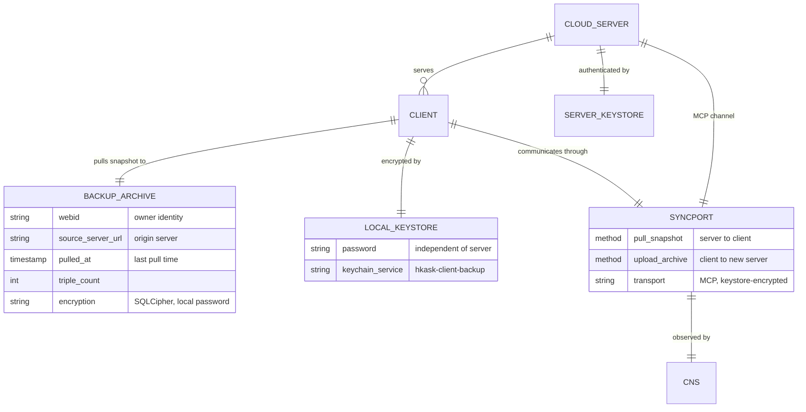

# hKask Deployment & Client Backup Plan

**Purpose:** Define the two-node deployment model (cloud server + local client), the install process for each, the client-to-server registration protocol, the backup-as-portable-sovereignty-archive model, and the server migration procedure.

**Status:** Planning phase. Converged design after multi-perspective review. No implementation has begun.

---

## 1. Architecture Overview

### 1.1 Two Nodes, One Binary

hKask ships as a single binary (`kask`) with two compile-time feature profiles:

```
┌──────────────────────────────────────┐
│ kask binary (single codebase)        │
│                                      │
│  ┌────────────┐    ┌──────────────┐  │
│  │  server    │    │   client     │  │
│  │  (full)    │    │  (subset)    │  │
│  └─────┬──────┘    └──────┬───────┘  │
│        │                  │          │
│  Cargo features:    Cargo features:  │
│  "server"           "client"         │
└──────────────────────────────────────┘
```

| Profile | Includes | Excludes | Role |
|---------|----------|----------|------|
| `server` | All crates: MCP server, inference, condenser, conduit, storage, CNS, keystore, services | — | Authoritative data store. Runs replicants, MCP servers, inference. Multi-tenant. |
| `client` | CLI, storage (SQLCipher for local backup), keystore, CNS, services (ChatService for REPL) | MCP server, inference, condenser, conduit | Backup terminal + REPL. Connects to a server. Pulls snapshots for portability. Uploads for migration. |

The client is not a "thin server." It is a **terminal + backup target**. It never runs agent pods, never serves MCP tools, never does inference. It talks to the server for everything except local backup management.

### 1.2 Reference Copy Model

There is always exactly one reference copy. CRDT provides fault tolerance, not conflict resolution.

| Scenario | Reference Copy | Direction | CRDT Role |
|----------|---------------|-----------|-----------|
| Normal operation | Cloud server | Server → Client (pull snapshot) | Idempotent merge makes interruption safe |
| Server migration | Client archive | Client → New server (upload archive) | Idempotent merge makes interruption safe |

### 1.3 Mermaid Deployment Topology



---

## 2. Install Process

### 2.1 Server Install

```bash
# Build with server features
cargo build --release --bin kask --features server

# Install
cp target/release/kask /usr/local/bin/kask-server

# Initialize
kask init --profile server
# Prompts for:
#   - Server master passphrase (Argon2id → HKDF key derivation)
#   - Admin WebID creation
#   - Data directory (default: /var/lib/hkask/)
```

**What this creates:**
- `~/.config/hkask/` — server config, keystore version file
- `/var/lib/hkask/` — SQLCipher database (all user data), git backup repository
- OS keychain entry: `hkask-master` (master passphrase)

**What this enables:**
- Multi-tenant: multiple WebIDs can register and use the server
- All MCP servers start (conduit, condenser, inference, etc.)
- Git-based operational backup (already implemented: `hkask-services/src/backup/`)
- CNS runtime with full span coverage

### 2.2 Client Install

```bash
# Build with client features
cargo build --release --bin kask --features client

# Install
cp target/release/kask /usr/local/bin/kask-client

# Initialize
kask client init --server https://my-server.hkask.example
# Prompts for:
#   - Local backup password (independent of server passphrase)
#   - WebID (must match identity on server)
#   - Backup scope (All | PrivateOnly)
#   - Backup frequency (Manual | Daily | Weekly)
```

**What this creates:**
- `~/.config/hkask-client/` — client config, backup policy
- `~/.local/share/hkask/backup.db` — SQLCipher-encrypted backup archive
- OS keychain entries:
  - `hkask-client-backup` (local backup password)
  - `hkask-client-session` (server session key, received during registration)

**What this does NOT create:**
- No local MCP servers
- No local inference engine
- No local condenser
- No local conduit/Matrix transport
- No local agent pods

### 2.3 Feature Gating (Cargo)

```toml
# workspace Cargo.toml

[features]
default = []
server = [
    "hkask-mcp",
    "hkask-inference",
    "hkask-condenser",
    "hkask-conduit",
]
client = []

# Crate-level gates:
# hkask-mcp/src/lib.rs:
#   #[cfg(feature = "server")]
#   pub fn start_mcp_servers(...) { ... }
#
# hkask-inference/src/lib.rs:
#   #[cfg(feature = "server")]
#   pub struct InferenceEngine { ... }
```

No runtime branching. The client binary simply does not compile the gated modules. A `CapabilityGate` enum mirrors the features for informational purposes (displayed in `kask status`).

---

## 3. Registration — Linking Client to Server

### 3.1 Protocol

```
Client                                    Server
  │                                         │
  │── RegisterRequest ────────────────────>│
  │   { webid, device_key_pub,              │
  │     install_profile: "client",          │
  │     key_version }                       │
  │                                         │
  │                     Verify WebID via    │
  │                     Keychain signature  │
  │                     Store consent:      │
  │                       { client_id,      │
  │                         scope: BackupPull,│
  │                         expires }       │
  │                     Derive session_key =│
  │                       HKDF(master,      │
  │                       "syncport",       │
  │                       key_version)      │
  │                                         │
  │<── RegisterResponse ───────────────────│
  │   { capability_token,                   │
  │     session_key_version,                │
  │     server_public_key }                 │
  │                                         │
  │  Store session_key in OS keychain       │
  │  (service: "hkask-client-session")      │
  │                                         │
  │── pull_snapshot(capability_token) ────>│  (subsequent calls)
  │<── Vec<Triple> ────────────────────────│  (session-encrypted)
```

### 3.2 Consent Scopes

| Scope | Purpose | Duration | Issued On |
|-------|---------|----------|-----------|
| `BackupPull` | Client can pull snapshots from this server | Persistent (until revoked) | `kask client init` |
| `BackupRestore` | Client can upload an archive for migration | One-time, auto-expires after import | `kask backup upload` |

Both scopes reuse the existing `ConsentStore` and `StoredConsentRecord` infrastructure. No new auth system.

### 3.3 Session Key

The session key is a symmetric key derived from the server's master passphrase with context `"syncport"` and the current key version. Both sides derive it independently from the same master key + version. The client receives the version during registration and derives the key locally, storing it in the OS keychain.

Key rotation follows the existing `master_key` pattern: increment `key_version`, old-version keys remain derivable for decrypting in-flight messages tagged with their version. The `EncryptionService` (AES-256-GCM, already in `hkask-keystore`) encrypts all MCP payloads on the sync channel.

---

## 4. Backup Model — Portable Sovereignty Archive

### 4.1 What the Backup Is

The backup archive is a **single SQLCipher-encrypted SQLite file** containing:

1. The user's full live triple set (post-pruning, post-consolidation) — a snapshot of the server's current state
2. A `backup_meta` table describing the archive itself

The archive is **not** a live replica, a sync target, or a cold-storage redundancy layer. It is the **P1 data portability artifact** — the user walks away from one hKask server, uploads the archive to another, and resumes.

### 4.2 Archive Schema

```sql
-- Carried inside the encrypted SQLCipher database
CREATE TABLE backup_meta (
    webid TEXT NOT NULL,              -- owner identity
    source_server_url TEXT NOT NULL,  -- origin server
    pulled_at TEXT NOT NULL,          -- ISO 8601 timestamp
    triple_count INTEGER NOT NULL,    -- triples in this snapshot
    schema_version INTEGER NOT NULL DEFAULT 1
);

-- Reuses existing TripleStore schema:
-- triples(entity, attribute, value, owner_webid, valid_from, valid_to, ...)
```

### 4.3 Backup Policy (Client Config)

```rust
pub struct BackupPolicy {
    pub scope: BackupScope,         // All | PrivateOnly
    pub frequency: BackupFrequency, // Manual | Daily | Weekly
    pub last_pull: Option<DateTime<Utc>>,
    pub size_alert_mb: u64,         // default: 500
}

pub enum BackupScope { All, PrivateOnly }
pub enum BackupFrequency { Manual, Daily, Weekly }
```

Configured via:
- `kask config set backup.scope private-only`
- `kask config set backup.frequency daily`
- `kask config set backup.size-alert-mb 1000`

Highest frequency is **daily** because the server already runs git-based operational backup at finer granularity. The client backup is for portability, not operational continuity.

### 4.4 Pull Cycle

```
Schedule fires (daily / weekly / manual)
  │
  ▼
SyncPort::pull_snapshot(owner=webid)
  │  ─── MCP channel, server-keystore-encrypted ───
  │  Server verifies BackupPull consent
  │  Server: SELECT * FROM triples
  │          WHERE owner_webid = ? AND tombstone = false
  ▼
Vec<Triple> arrives (streaming, if MCP supports it)
  │
  ▼
BEGIN TRANSACTION
  DELETE FROM triples;              -- replace previous snapshot
  FOR EACH triple: INSERT OR REPLACE INTO triples ...;
  UPDATE backup_meta SET pulled_at = now(), triple_count = ?;
COMMIT
  │
  ▼
Update policy.last_pull
Emit CnsSpan::BackupPull { triple_count, bytes_received, duration_ms, retry_count }
```

**Why full snapshot, not incremental:**
- The server's memory pipeline already prunes, forgets, and condenses. The snapshot size is bounded by the server's working set.
- No vector clocks. No state tracking on either side. One `SELECT` with `WHERE tombstone = false`.
- The archive holds exactly one snapshot — the most recent. Each pull replaces it.

### 4.5 Fault Tolerance — CRDT via Idempotent Upsert

The merge operation is `INSERT OR REPLACE` by `TripleID`. This is associative, commutative, and idempotent — the three CRDT properties — without any CRDT library.

**Interrupted pull at 73%:**
1. Received triples are merged (upserted) within the transaction
2. Transaction commits — partial data is consistent
3. Retry re-pulls all triples from server
4. 73% are no-ops (already present), 27% fill in
5. Converged

**Interrupted upload:** Same pattern, reversed direction. Idempotent merge on the receiving server.

No progress tracking. No resume-from-offset protocol. No chunking. The CRDT merge IS the fault tolerance.

---

## 5. Server Migration

### 5.1 Flow

```
User has: backup archive from old server

kask backup upload --server https://new-server.hkask.example
  │
  ▼
Client authenticates to new server (RegisterRequest, scope: BackupRestore)
  │
  ▼
New server opens archive, checks schema_version, verifies webid match
  │
  ▼
For each replicant entity in the archive:
  │
  ├── Name collision with existing replicant on new server?
  │     YES → auto-rename: "ada" → "ada-migrated-20260617"
  │     NO  → import as-is
  │
  ▼
All triples upserted into new server's TripleStore
  │
  ▼
New server returns MigrationReceipt { triple_count, renamed_replicants: [...] }
  │
  ▼
User sees: "Archive imported. X triples. 
  Renamed replicants: ada → ada-migrated-20260617
  Run `kask replicate merge --from ada-migrated-20260617 --into ada` to reconcile."
```

### 5.2 Replicant Operations

| Command | What It Does |
|---------|-------------|
| `kask replicate rename <from> <to>` | Rename a replicant entity |
| `kask replicate merge --from <source> --into <target>` | Upsert all triples from source entity into target entity. Source is unchanged. |
| `kask replicate delete <name>` | Remove a replicant and all its triples |

**Merge semantics:**
- For each triple owned by the source replicant: `INSERT OR REPLACE` with entity = target entity name
- Source triples preserved until the user explicitly deletes the source replicant
- Idempotent — running merge twice produces the same result
- CNS span: `ReplicantMerge { source, target, triple_count, duration_ms }`

### 5.3 No Server-to-Server Protocol

Servers never communicate with each other. Migration is always user-mediated: the user pulls an archive from the old server (using their client), then uploads it to the new server. This avoids:

- Server-to-server trust relationships
- Cross-server authentication
- Data transfer protocols between untrusted parties
- Coordination of replicant state across servers

The archive file is the bridge. P1: the user controls the transfer.

### 5.4 Archive Verification After Migration

After uploading, the `MigrationReceipt` contains `triple_count`. The user (or the client automatically) compares this to the archive's `backup_meta.triple_count`. If counts match, migration converged. If not, retry the upload — CRDT idempotence means it's safe to re-run.

```
$ kask backup upload --server https://new-server.hkask.example
Uploading... 1,247 triples
Verifying... Archive: 1,247 triples. Server: 1,247 triples. ✓ Converged.
Renamed: ada → ada-migrated-20260617
```

---

## 6. Encryption Model

### 6.1 Two Layers, Two Keys

| Layer | Key | Derived From | Stored In | Purpose |
|-------|-----|-------------|-----------|---------|
| Transport | Session key | Server master passphrase → HKDF("syncport", version) | Client OS keychain (`hkask-client-session`) | Encrypt MCP payloads in flight |
| Storage | Local password | User-chosen, independent of server | Client OS keychain (`hkask-client-backup`) | Encrypt backup archive at rest (SQLCipher) |

### 6.2 Why Independent Keys

| Scenario | Transport Key Compromised | Storage Key Compromised |
|----------|--------------------------|------------------------|
| Server breach | Session key exposed → in-flight data compromised | Local password unaffected → archive at rest remains secure |
| Laptop stolen | Session key in keychain → attacker can pull new data (until consent revoked) | Attacker still needs local password to open the SQLCipher archive |
| Both breached | Full exposure | Full exposure (unavoidable) |

### 6.3 Key Rotation

Key rotation follows the existing `hkask-keystore::master_key` pattern:

- Increment `key_version` in `~/.config/hkask/version`
- `derive_sub_key_with_version(passphrase, old_version, "syncport")` still works for decrypting messages tagged with the old version
- New messages use the new version
- Zero new crypto code — reuses `EncryptionService` (AES-256-GCM) and `derive_sub_key_with_version`

---

## 7. CNS Observability

### 7.1 Spans

| Span | Emitted By | Tracks | Alert |
|------|-----------|--------|-------|
| `BackupPull` | BackupScheduler (client) | `triple_count`, `bytes_received`, `duration_ms`, `retry_count` | High `retry_count` → network instability |
| `BackupUpload` | Migration flow (client) | `triple_count`, `bytes_sent`, `duration_ms`, `retry_count` | High `retry_count` → network instability |
| `BackupStaleness` | BackupScheduler (client) | `seconds_since_last_pull` | > 2× configured frequency → "Backup is N days old" |
| `BackupStorage` | BackupScheduler (client) | `db_size_bytes`, `triple_count` | > `size_alert_mb` → "Archive is X MB. Server memory pipeline may need attention." |
| `ReplicantMerge` | Replicant merge flow | `source`, `target`, `triple_count`, `duration_ms` | Informational only |

### 7.2 Algedonic Alerts

All alerts are **user-facing** (client-side). The server does not monitor client backup health — that's the user's responsibility (P1).

| Alert | Condition | Message |
|-------|-----------|---------|
| Backup staleness | `seconds_since_last_pull > 2 × frequency_interval` | "Backup is 5 days old. Run `kask backup now` to update your portable archive." |
| Archive size | `db_size_bytes > size_alert_mb` | "Backup archive is 650 MB. The server's memory pipeline may need attention, or consider pruning old replicants." |

---

## 8. CLI Command Surface

```
kask client init --server <url>
    Initialize client, set backup password, register with server.

kask config set backup.scope <all|private-only>
kask config set backup.frequency <manual|daily|weekly>
kask config set backup.size-alert-mb <mb>
    Configure backup policy.

kask backup now
    Pull snapshot immediately, outside schedule.

kask backup status
    Show: last pull timestamp, triple count, archive size, staleness.

kask backup export [--path <path>]
    Copy archive file to external storage (USB, cloud drive, etc.).

kask backup upload --server <url>
    Upload archive to new server for migration. Registers with BackupRestore scope.

kask replicate rename <from> <to>
kask replicate merge --from <source> --into <target>
kask replicate delete <name>
    Manage replicants after migration.
```

---

## 9. Type & Trait Summary

### 9.1 New Types

| Type | Crate | Fields / Variants |
|------|-------|-------------------|
| `BackupPolicy` | `hkask-backup` | `scope: BackupScope`, `frequency: BackupFrequency`, `last_pull: Option<DateTime<Utc>>`, `size_alert_mb: u64` |
| `BackupScope` | `hkask-backup` | `All`, `PrivateOnly` |
| `BackupFrequency` | `hkask-backup` | `Manual`, `Daily`, `Weekly` |
| `BackupArchive` | `hkask-backup` | Wraps `Database` (SQLCipher) — methods: `open`, `replace_with_snapshot`, `stream_triples`, `metadata` |
| `MigrationReceipt` | `hkask-backup` | `triple_count: u64`, `renamed_replicants: Vec<(String, String)>` |
| `MergeReceipt` | `hkask-backup` | `triple_count: u64`, `source: String`, `target: String` |
| `RegisterRequest` | `hkask-backup` | `webid: WebID`, `device_key_pub: PublicKey`, `install_profile: InstallProfile`, `key_version: u32` |
| `RegisterResponse` | `hkask-backup` | `capability_token: String`, `session_key_version: u32`, `server_public_key: PublicKey` |
| `InstallProfile` | `hkask-backup` | `Server`, `Client` |

### 9.2 SyncPort Trait

```rust
/// REQ: syncport-001
/// pre:  client is registered with server (consent record exists)
/// pre:  MCP channel encryption uses server-derived session key
/// inv:  transport encryption is independent of local backup encryption
#[async_trait]
pub trait SyncPort: Send + Sync {
    /// Pull the current live triple snapshot from the server.
    /// The server's memory pipeline has already pruned/consolidated.
    /// If interrupted, retry — merge is idempotent.
    async fn pull_snapshot(
        &self,
        owner: &WebID,
    ) -> Result<Vec<Triple>, SyncError>;

    /// Upload the backup archive to a new server for migration.
    /// If interrupted, retry — merge is idempotent.
    /// Auto-renames replicants on name collision.
    async fn upload_archive(
        &self,
        archive: &BackupArchive,
        target_server: &Url,
    ) -> Result<MigrationReceipt, SyncError>;
}
```

### 9.3 Consent Scopes (Extensions to ConsentStore)

```rust
// Added to existing ConsentScope enum or constants:
pub const CONSENT_SCOPE_BACKUP_PULL: &str = "BackupPull";
pub const CONSENT_SCOPE_BACKUP_RESTORE: &str = "BackupRestore";
```

### 9.4 CNS Span Additions

```rust
// Added to existing CnsSpan enum:
CnsSpan::BackupPull,      // { triple_count, bytes, duration, retries }
CnsSpan::BackupUpload,    // { triple_count, bytes, duration, retries }
CnsSpan::BackupStaleness, // { seconds_since_last_pull }
CnsSpan::BackupStorage,   // { db_size_bytes, triple_count }
CnsSpan::ReplicantMerge,  // { source, target, triple_count, duration }
```

---

## 10. Existing Infrastructure Reused

| Infrastructure | Used For | Crate |
|---------------|----------|-------|
| `TripleStore` + `Triple` | Server-side query (pull), local storage (archive), upload merge | `hkask-storage` |
| `Database::open_impl` | SQLCipher-encrypted backup archive | `hkask-storage` |
| `EncryptionService` (AES-256-GCM) | Transport encryption on MCP channel | `hkask-keystore` |
| `derive_sub_key_with_version` | Session key derivation with rotation | `hkask-keystore` |
| `Keychain` | OS keychain for local password + session key | `hkask-keystore` |
| `Ed25519SpecSigner` | Capability token signing | `hkask-keystore` |
| `ConsentStore` + `StoredConsentRecord` | `BackupPull` and `BackupRestore` scopes | `hkask-storage` |
| MCP transport | Pull and upload channel | `hkask-mcp` |
| `CnsSpan` + `AlgedonicManager` + `SetPoints` | Backup health observability | `hkask-cns`, `hkask-types` |
| `hkask-memory` (consolidation, salience, condensation) | Server-side pruning — bounds snapshot size | `hkask-memory` |
| Git backup (`BackupService`) | Server-side operational backup (complementary, not replaced) | `hkask-services` |
| `FlowDef` / `ManifestExecutor` | Deployment manifest (future: TBD if needed) | `hkask-templates` |
| Cargo features | Compile-time server vs client | `Cargo.toml` (workspace) |

---

## 11. What Is NOT Being Built

Explicit exclusions — these were considered and rejected during design review:

- **No gRPC.** MCP is the transport. Encryption is via keystore, not TLS.
- **No bidirectional CRDT.** Pull-only from server to client. Upload-only from client to new server.
- **No incremental sync.** Full snapshot each pull. Server pruning bounds size.
- **No client-to-client sync.** Each client pulls independently from the server.
- **No server-to-server protocol.** Migration is user-mediated via archive file.
- **No conflict resolution UI.** CRDT upsert is idempotent. Replicant merge is user-initiated, not automated diffing.
- **No "fat client" with local replicants.** Client is a terminal + backup target. No agent pods, no inference, no MCP servers.
- **No capability router or runtime feature detection.** Features are compile-time. The client binary simply lacks the gated crates.
- **No backup pruning code.** The server's memory pipeline handles pruning. The archive mirrors the pruned state.
- **No artifact replication (LORA, research files).** Out of scope for this plan. Backup covers triples only.

---

## 12. Success Criteria

Verifiable end-to-end:

```
1. [Build]   cargo build --features server && cargo build --features client
             → both binaries compile without undefined symbols

2. [Init]    kask init --profile server
             kask client init --server <url>
             → both complete without error, consent records created

3. [Pull]    kask backup now
             → archive contains triples, backup_meta updated
             → CnsSpan::BackupPull emitted

4. [Export]  kask backup export --path /tmp/hkask-backup.db
             → file is valid SQLCipher database
             → opens only with local backup password

5. [Migrate] kask backup upload --server <new_url>
             → MigrationReceipt.triple_count matches archive count
             → replicants renamed on collision

6. [Merge]   kask replicate merge --from ada-migrated-xxx --into ada
             → triples merged, source unchanged
             → CnsSpan::ReplicantMerge emitted

7. [Fault]   Interrupt pull at ~50%, retry
             → converged, triple count correct
             → no duplicates, no corruption

8. [Stale]   Wait >2× frequency, check alert
             → CnsSpan::BackupStaleness alert emitted
```

---

## 13. Open Questions (Deferred to CNS Data)

| # | Question | Why Deferred | How Answered |
|---|----------|-------------|--------------|
| Q1 | Does snapshot size stabilize under server memory pruning? | Needs weeks of CNS data | `BackupStorage.db_size_bytes` trend over time |
| Q2 | Is full-snapshot retry bandwidth waste significant? | Depends on network reliability | `BackupPull.retry_count` — if retries are rare, waste is negligible |
| Q3 | What is the typical archive size for an active user? | Determines upload UX and whether streaming is needed | `BackupPull.bytes_received` |
| Q4 | Should `backup upload` verify convergence automatically? | `MigrationReceipt` provides the data; unclear if auto-verification helps or clutters | User feedback on migration UX |

---

## 14. Implementation Sequence (Recommended)

| Phase | Tasks | Depends On |
|-------|-------|-----------|
| **Phase 1 — Types & Traits** | Define `BackupPolicy`, `BackupScope`, `BackupFrequency`, `SyncPort` trait, `BackupArchive`, `MigrationReceipt`, `RegisterRequest`/`Response`, CNS span variants | — |
| **Phase 2 — Server-Side** | MCP tools: `pull_snapshot`, `upload_archive`. Replicant rename + merge tools. Consent scope registration. | Phase 1 |
| **Phase 3 — Client-Side** | `BackupScheduler`, CLI commands (`init`, `config`, `backup now`, `status`, `export`, `upload`, `replicate`), CNS span emission | Phase 2 |
| **Phase 4 — Integration** | End-to-end test: init → pull → export → upload to second server → merge → verify | Phase 3 |
| **Phase 5 — Harden** | Interruption testing, retry loop, staleness alert tuning, archive size threshold calibration | Phase 4 |
