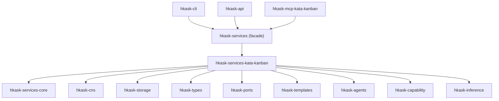

# Kata-Kanban Merge Plan

**Status:** Reviewed (essentialist + grill-me + improve-codebase-architecture) | **Version:** v0.31.0 | **Date:** 2026-06-29
**Source:** Adversarial architectural review finding #5 — kata/kanban code duplication and CNS feedback loop gap

---

## Problem Statement

`hkask-services-kata` and `hkask-services-kanban` are two separate crates with overlapping responsibility that the architecture doc itself describes as integrated:

> "kata cycles execute as kanban tasks" — Architecture Master §Kata
> PDCA → Kanban State Mapping: Plan→Backlog, Do→InProgress, Check→Review, Act→Done

Yet:
1. **Code duplication:** `kanban_impl/kata.rs` duplicates kata prompt generation inline instead of calling `KataEngine`
2. **No Cargo dependency:** `hkask-services-kanban` never imports `hkask-services-kata`
3. **CNS feedback loop gap:** Kata work done through kanban emits `cns.tool.kanban` spans, not `cns.kata` spans — the CNS cannot observe kata activity through kanban
4. **Conant-Ashby violation:** The regulator's model of kata activity diverges from reality

---

## Design Principle

> **Kata is the process. Kanban is the tool/board/framework for applying the kata process to work.**

This is the unifying design principle. A single crate `hkask-services-kata-kanban` owns both the process engine AND the board mechanics, with clear internal module boundaries.

**Backward compatibility:** None required DURING the merge — old crates are deleted, new crate takes their place, the `hkask-services` facade absorbs all path changes. AFTER the merge, all 16 public items become permanent Hyrum's-Law semver contracts. See [api-design §Hyrum's Law](https://rust-lang.github.io/api-guidelines/) — every `pub` item creates dependents. Use `#[non_exhaustive]` on all public structs and enums to enable additive evolution without breaking changes (Step 3.4).

---

## Target Architecture

```
hkask-services-kata-kanban/
├── Cargo.toml
├── README.md
├── src/
│   ├── lib.rs                  # Unified public API
│   ├── kata/                   # Kata process engine (was hkask-services-kata)
│   │   ├── mod.rs
│   │   ├── coaching.rs         # 5-question Coaching Kata
│   │   ├── improvement.rs      # 4-step PDCA Improvement Kata
│   │   ├── starter.rs          # Starter Kata drills
│   │   ├── execution.rs        # Template-based step execution
│   │   ├── manifest.rs         # KataManifest loading
│   │   ├── state.rs            # KataState
│   │   ├── history.rs          # KataHistory, automaticity
│   │   ├── metrics.rs          # CNS variety counter integration
│   │   └── error.rs            # KataError
│   ├── kanban/                 # Kanban board mechanics (was hkask-services-kanban)
│   │   ├── mod.rs
│   │   ├── board.rs            # Board, ColumnDef, KanbanPhase
│   │   ├── task.rs             # Task, TaskSpec, TaskStatus, Priority, TaskFilter
│   │   ├── contract.rs         # TaskContract, ContractState, SpawnSpec, CapabilityPackage
│   │   ├── verification.rs     # Verification, VerificationCriterion, LLM-mediated verify
│   │   ├── gas.rs              # GasEntry, gas/rJoule tracking
│   │   ├── service.rs          # KanbanService (CRUD, assignment, move, de-jam)
│   │   ├── decompose.rs        # Task decomposition
│   │   ├── dejam.rs            # Unjam detection and fix
│   │   ├── spawn.rs            # Sub-replicant spawning
│   │   ├── comments.rs         # Task comment threading
│   │   ├── phases.rs           # Phase management
│   │   └── socratic.rs         # Socratic inquiry cycle
│   └── bridge.rs               # Kata↔Kanban integration executor (replaces kanban_impl/kata.rs)
└── tests/
    ├── kata_tests.rs
    ├── kanban_tests.rs
    └── integration_tests.rs    # PDCA→Kanban state mapping tests
    ```

    > **File split is suggested, not prescribed.** Apply the ~300-line threshold during Phase 3.2 structural refactor: split any file exceeding ~300 lines into focused modules. Smaller modules stay as-is unless they contain multiple independent concerns. The layout above is the target after splitting `kanban.rs` (~1445 lines).

    ### Public API (target: 16 items)

The deep-module threshold is ≤7. At 16 items, we exceed it by 9. Every item below carries an explicit caller-need justification. Items without direct caller construction needs are `pub(crate)` and accessed through `KanbanService` or `KataEngine` methods.

| # | Item | Source | Caller Need | Justification |
|---|------|--------|-------------|---------------|
| 1 | `KataEngine` | kata/ | MCP kata tools construct and configure this; CLI direct invocation | Process engine — irreplaceable |
| 2 | `KanbanService` | kanban/ | All surfaces: CLI (`kask kanban`), API, MCP server | Board service — irreplaceable |
| 3 | `Board` | kanban/ | Return type of `board_create`, `board_get`, `board_list`; MCP serializes board data | Callers need to read board metadata (id, name, owner, columns, phases) |
| 4 | `ColumnDef` | kanban/ | Public field of `Board.columns: Vec<ColumnDef>`; Rust visibility cascade — if Board is public, its field types must be public | Data type in public struct field |
| 5 | `Task` | kanban/ | Return type of `task_create`, `task_get`, `task_list`; MCP serializes task data | Callers need task state (status, assignee, criteria, verification, deliverables) |
| 6 | `TaskSpec` | kanban/ | Builder constructed by all surfaces before calling `KanbanService::task_create(spec)` | Builder pattern with 10 optional fields — cleaner as public type than a 10-parameter function |
| 7 | `TaskStatus` | kanban/ | Pattern-matched by callers for display and filtering; public field of `Task.status` | Enum in public struct field |
| 8 | `TaskFilter` | kanban/ | Constructed by MCP server and CLI to pass to `task_list(filter)` | Filter DSL — hiding it would require N methods for N filter combinations |
| 9 | `Priority` | kanban/ | Public field of `Task.priority` and `TaskSpec.priority`; callers set/read priority | Enum in public struct fields |
| 10 | `Verification` | kanban/ | Public field of `Task.verification: Option<Verification>`; callers read verification results | Data type in public struct field |
| 11 | `VerificationCriterion` | kanban/ | Public field of `Task.criteria: Vec<VerificationCriterion>`; callers construct criteria in TaskSpec | Data type in public struct field |
| 12 | `KataManifest` | kata/ | Loaded from YAML by callers before passing to `KataEngine` | Kata definition — callers need to load and inspect |
| 13 | `KataResult` | kata/ | Return type of all `KataEngine::run_*` methods and bridge execution methods | Completion output — callers read outcome, gas, steps |
| 14 | `KataError` | kata/ | Error propagation from kata operations (inference failures, template errors, gas exceeded) | Distinct error domain from KanbanError — conflating them creates a pass-through wrapper |
| 15 | `KanbanError` | kanban/ | Error propagation from kanban operations (invalid transitions, WIP limits, consent violations) | Distinct error domain from KataError |
| 16 | `SpawnSpec` | kanban/ | Constructed by MCP server and CLI for `KanbanService::spawn(spec)` | Sub-replicant spawning spec — caller-constructed |

**Dependency transmission note:** `DateTime<Utc>` from `chrono` appears in public struct fields (`Task.created_at`, `Board.created_at`, etc.). This makes `chrono` a transitive public dependency — any chrono semver break becomes this crate's semver break. Accepted for now (chrono is a de-facto Rust standard). Newtyping would be required if this crate were shipped outside hKask.

**Facade consumer note:** The `hkask-services` facade is the ONLY direct consumer of this crate's public API (besides the MCP server). `#[non_exhaustive]` on public types protects both the facade and the MCP server from accidental semver breaks. See Step 3.4.

**Types intentionally `pub(crate)`** (internal, accessed through service methods):

| Type | Why pub(crate) | Access Path |
|------|---------------|-------------|
| `TaskContract`, `ContractState`, `ContractVerification`, `ConditionResult` | OCAP contract internals — constructed by `CapabilityPackage::to_task_contract()` | `KanbanService::spawn()` or `CapabilityPackage::to_task_contract()` |
| `CapabilityPackage`, `ConsentProof` | Loaded from YAML by KanbanService, not caller-constructed directly | `KanbanService::load_capability_package()` |
| `GasEntry` | Internal tracking type — added via `task_add_gas`/`task_add_rjoules` | `KanbanService::task_add_gas()` |
| `Comment` | Added via service methods, not caller-constructed with raw IDs | `KanbanService::task_add_comment()` |
| `KanbanPhase` | Managed through `Board` construction; callers don't create phases independently | `Board::new()` builder |
| `UnjamItem`, `UnjamFix` | Returned by `KanbanService::unjam_detect()` but are informational types | Could be exposed if MCP needs them, but currently internal |

---

## Step-by-Step Implementation Plan

Each step is an atomic, independently testable unit. No step depends on a future step's completion for validation.

### Phase 1: Foundation (verbatim migration)

Copy source crates as-is into the merged crate. No refactoring, no cleanup, no deletion. Behavioral preservation is guaranteed by identity of copied code.

#### Step 1.1 — Create the merged crate skeleton
- `cargo new --lib crates/hkask-services-kata-kanban`
- Copy combined `Cargo.toml` merging dependencies from both source crates (union, no new deps)
- Set up the module tree as specified in target architecture
- **Verify:** `cargo check -p hkask-services-kata-kanban` compiles (empty lib)

#### Step 1.2 — Migrate kata module verbatim
- Copy all files from `hkask-services-kata/src/kata_impl/` → `hkask-services-kata-kanban/src/kata/`
- Create `kata/mod.rs` with submodule declarations matching the original `kata_impl.rs`
- Fix crate-internal paths (`crate::` instead of cross-crate `use hkask_services_kata::`)
- **Verify:** All existing kata tests pass (`cargo test -p hkask-services-kata-kanban -- kata`)

#### Step 1.3 — Migrate kanban module verbatim
- Copy `hkask-services-kanban/src/kanban.rs` → `hkask-services-kata-kanban/src/kanban/` (split into board.rs, task.rs, contract.rs, gas.rs as prescribed)
- Copy all submodule files from `hkask-services-kanban/src/kanban_impl/` → `hkask-services-kata-kanban/src/kanban/`
- Copy `hkask-services-kanban/src/socratic.rs` → `hkask-services-kata-kanban/src/kanban/socratic.rs`
- Fix crate-internal paths
- **Verify:** All existing kanban + socratic tests pass (`cargo test -p hkask-services-kata-kanban -- kanban`)

### Phase 2: Integration (eliminate duplication)

#### Step 2.1 — Create the bridge as executor
- Create `src/bridge.rs`
- Implement `KanbanKataBridge` that holds `Arc<KataEngine>` and executes full kata cycles on tasks:

```rust
use std::sync::Arc;

/// Executes kata cycles on kanban tasks. Not a prompt generator — a full
/// execution orchestrator that delegates to KataEngine for inference, CNS
/// span emission, gas tracking, and automaticity.
pub(crate) struct KanbanKataBridge {
    engine: Arc<KataEngine>,
}

impl KanbanKataBridge {
    /// Run a full 5-question Coaching Kata cycle on a task.
    ///
    /// Builds KataState from the task's title, description, criteria,
    /// comments, and deliverables. Delegates to KataEngine::run_coaching().
    /// Returns KataResult with CNS spans, gas tracking, and step experiences.
    pub async fn run_coaching_on_task(
        &self,
        task: &Task,
        manifest: &KataManifest,
    ) -> Result<KataResult, KataError>;

    /// Run a full 4-step PDCA Improvement Kata cycle on a task.
    ///
    /// Uses task description as the direction, task state + deliverables
    /// as the current condition. Delegates to KataEngine::run_improvement().
    pub async fn run_improvement_on_task(
        &self,
        task: &Task,
        manifest: &KataManifest,
    ) -> Result<KataResult, KataError>;

    /// Run a Starter Kata observation drill on a task sub-problem.
    pub async fn run_starter_on_task(
        &self,
        task: &Task,
        sub_problem: &str,
        manifest: &KataManifest,
    ) -> Result<KataResult, KataError>;
}
```

Each method:
1. Builds `KataState` from task context (title, description, criteria as target condition; status, comments, deliverables as current condition; assignee as learner_bot)
2. Calls the appropriate `KataEngine::run_*` method
3. Returns `KataResult` with full CNS spans (`cns.kata.*`), gas tracking, step experiences, and automaticity delta — all generated by the engine, not duplicated in the bridge

#### Step 2.2 — Wire bridge into KanbanService
- Add `Option<Arc<KanbanKataBridge>>` field to `KanbanService`
- Replace the three inline kata prompt methods (`task_coaching_prompt`, `task_improvement_prompt`, `task_practice_prompt`) with delegations to `bridge.run_coaching_on_task()` etc.
- Add `From<KataError> for KanbanError` to bridge the error boundary:
  ```rust
  impl From<KataError> for KanbanError {
      fn from(e: KataError) -> Self {
          KanbanError::Internal(format!("kata engine: {e}"))
      }
  }
  ```
- **Delete** `kanban/kanban_impl/kata.rs` (the old inline prompt generator)
- **Verify:** Kata activity through kanban now produces full CNS spans, gas tracking, and automaticity from the engine

#### Step 2.3 — CNS span routing unification
- Bridge execution methods emit `cns.kata.*` spans (via KataEngine, not inline)
- Kanban task lifecycle operations (create, move, assign, verify) continue emitting `cns.tool.kanban`
- **Verify:** `kata.practices.completed` CNS variety counter increments when kata cycles run through kanban tasks. When kata runs directly via `KataEngine`, the same counter increments. Both paths are observable.

### Phase 3: Cleanup (essentialist + structural refactor + surface reduction)

Single post-migration cleanup pass. All three operations (elimination, restructuring, surface reduction) happen in the merged crate where the full picture is visible.

#### Step 3.1 — Essentialist pass (G1/G2/G3)
- Run eliminative review on the merged crate:
  - **G1 (Exist):** Delete pass-through types, dead seams, single-use abstractions. Trace every public item to a caller need (see Public API table above).
  - **G2 (Surface):** Verify public API is exactly the 16 items in the table. Any additional public items must either be `pub(crate)` or carry a caller-need justification.
  - **G3 (Contract):** Trace every abstraction boundary. Delete ports that wrap single dependencies. The bridge is the only new abstraction — verify it passes (it adds adaptation + CNS emission, not a pass-through).
- **Regression safety net:** Before deleting any type or function, run `cargo test -- --list` to inventory tests that exercise it. If the underlying behavior lacks tests, add them before deleting the abstraction. Confirm `cargo test -p hkask-services-kata-kanban` passes after each deletion batch.

#### Step 3.2 — Structural refactor
- Split monoliths >300 lines into the target file layout:
  - `kanban.rs` (currently ~1445 lines) → `board.rs` + `task.rs` + `contract.rs` + `gas.rs`
  - Any kata module file >300 lines → split by concern
- Keep behavior unchanged; refactor only structure
- **Verify:** `cargo test -p hkask-services-kata-kanban` passes with zero regressions

#### Step 3.3 — Surface reduction
- Mark internal types as `pub(crate)` per the table above: `TaskContract`, `ContractState`, `ContractVerification`, `ConditionResult`, `CapabilityPackage`, `ConsentProof`, `GasEntry`, `Comment`, `KanbanPhase`, `UnjamItem`, `UnjamFix`
- Keep public: `ColumnDef`, `Priority`, `Verification`, `VerificationCriterion` (they appear in public struct fields — Rust visibility cascade)
- Verify no external caller breaks by confirming `cargo check -p hkask-services` (the facade) compiles
- **Errors stay separate:** `KataError` and `KanbanError` remain distinct types. They encode different domains (inference/templates/gas vs. boards/tasks/verification). Merging them into a `WorkflowError` would create a pass-through wrapper with no added behavior (P5 violation).

#### Step 3.4 — Apply `#[non_exhaustive]` to all public types (api-design §Hyrum's Law)
- Add `#[non_exhaustive]` to every public struct and enum in the merged crate:
  - Structs: `Board`, `ColumnDef`, `Task`, `TaskSpec`, `TaskFilter`, `Verification`, `VerificationCriterion`, `KataManifest`, `KataResult`, `SpawnSpec`
  - Enums: `TaskStatus`, `Priority`
- Rationale: After the merge, these 16 types are permanent semver contracts. `#[non_exhaustive]` enables adding fields/variants in future minor versions without breaking callers.
- For structs: consumers must use builders (`TaskSpec::builder()`, `Board::builder()`) or `..Default::default()` for construction
- For enums: consumers must include a wildcard `_` arm when matching
- **Verify:** `cargo check -p hkask-services-kata-kanban` and `cargo check -p hkask-services` compile; no struct literal construction outside the crate itself

### Phase 4: Facade and MCP server updates

#### Step 4.1 — Update hkask-services facade
- Replace `hkask-services-kata` + `hkask-services-kanban` dependencies with `hkask-services-kata-kanban`
- Update re-exports in `crates/hkask-services/src/lib.rs`
- **Verify:** `cargo test -p hkask-services` — `all_service_deps_are_reexported` test passes

#### Step 4.2 — MCP blast-radius inventory (pre-rename)
- **Before renaming anything**, inventory every reference to `kanban` MCP tools across the entire repository:

```bash
grep -rn "hkask-mcp-kanban\|kanban_mcp\|mcp.*kanban\|kanban.*mcp" \
    crates/ mcp-servers/ registry/ docs/ .agents/ \
    --include="*.rs" --include="*.yaml" --include="*.md" --include="*.j2"
```

- Produce an inventory file listing every file and line that references kanban MCP
- Categorize each reference: code import, tool definition, skill manifest, template .j2, documentation, AGENTS.md capability catalog
- This inventory drives every edit in Step 4.3 — no reference is missed

#### Step 4.3 — Rename and update MCP server
- Rename `mcp-servers/hkask-mcp-kanban/` → `mcp-servers/hkask-mcp-kata-kanban/`
- Update Cargo.toml: depend on `hkask-services-kata-kanban` instead of `hkask-services-kanban`
- Update tool definitions to expose kata tools alongside kanban tools:
  - `kanban_board_create`, `kanban_task_create`, `kanban_task_move`, `kanban_task_verify`, `kanban_unjam` (existing — keep names stable where possible)
  - `kata_coaching_start`, `kata_improvement_start`, `kata_starter_drill` (new — delegates to `bridge.run_coaching_on_task()` etc.)
- Apply every edit from the Step 4.2 inventory:
  - `registry/manifests/kanban-*.yaml` — update MCP server references
  - `registry/templates/**/*.j2` — update tool names if referenced
  - `AGENTS.md` — update MCP server name in capability catalog
  - `docs/architecture/hKask-architecture-master.md` — update Kanban and Kata sections
  - `docs/user-guides/kanban-user-guide.md` — update references
- **Verify:** All MCP tools respond correctly. `cargo test --workspace` passes.

### Phase 5: Cleanup

#### Step 5.1 — Remove old crates
- Delete `crates/hkask-services-kata/`
- Delete `crates/hkask-services-kanban/`
- Delete `mcp-servers/hkask-mcp-kanban/` (already renamed in 4.3)
- Remove from workspace `Cargo.toml` members list
- **Verify:** `cargo check --workspace` compiles

#### Step 5.2 — Update all import paths
- Global search for `hkask_services_kata` → `hkask_services_kata_kanban::kata`
- Global search for `hkask_services_kanban` → `hkask_services_kata_kanban::kanban`
- **Verify:** `cargo test --workspace` passes with zero regressions

---

## Dependency Graph After Merge



No new dependencies. The merged crate depends on the union of both source crates' dependencies.

---

## Risk Assessment

| Risk | Likelihood | Impact | Mitigation |
|------|-----------|--------|------------|
| Build breakage from path changes | Medium | Low | Each phase independently verifiable via `cargo check`/`cargo test` |
| MCP server tool signature drift | Low | Medium | Step 4.2 blast-radius inventory ensures no reference is missed; Step 4.3 includes explicit tool verification |
| Public API breakage for external consumers | Low | Low | Facade crate (`hkask-services`) re-exports buffer the change; only direct crate consumers affected. No backward compatibility requirement — internal refactoring. |
| Test coverage gaps from file moves | Low | Medium | All existing tests are migrated verbatim in Phase 1; no test logic changes |
| Essentialist deletion removes load-bearing code | Medium | Medium | Step 3.1 regression safety net: inventory tests before deletion; add tests for underlying behavior before deleting abstractions; `cargo test` confirms after each batch |
| MCP blast-radius misses a reference | Medium | Medium | Step 4.2 explicit grep inventory produces a complete file list; categorized by type (code, manifest, template, docs) |

---

## Success Criteria

1. `cargo test --workspace` passes with zero regressions
2. Zero `todo!()`, `unimplemented!()`, or `#[deprecated]` in the new crate
3. Public API is the 16 documented items — every item has a caller-need justification; all others are `pub(crate)`
4. CNS spans emit `cns.kata.*` for kata work through kanban tasks (via `KanbanKataBridge` → `KataEngine`)
5. `kata.practices.completed` counter increments regardless of entry point (direct `KataEngine` OR `bridge.run_*_on_task()`)
6. `kanban_impl/kata.rs` no longer exists — all kata logic delegates to `KataEngine` through the bridge
7. `KataError` and `KanbanError` remain separate types (no pass-through `WorkflowError`)
8. Architecture docs, READMEs, AGENTS.md, skill manifests, and template .j2 files all reference the unified crate
9. MCP blast-radius inventory (Step 4.2) confirms zero missed references

---

## Estimated Effort

| Phase | Steps | Estimated Time |
|-------|-------|---------------|
| Phase 1: Foundation | 1.1–1.3 | 2–3 hours |
| Phase 2: Integration | 2.1–2.3 | 3–4 hours |
| Phase 3: Cleanup | 3.1–3.3 | 2–4 hours |
| Phase 4: Facade + MCP | 4.1–4.3 | 3–4 hours |
| Phase 5: Cleanup | 5.1–5.2 | 1 hour |
| **Total** | | **11–16 hours** |

---

## Relationship to Architecture Principles

| Principle | How the merge satisfies it |
|-----------|---------------------------|
| **P5 (Essentialism)** | Eliminates code duplication; single crate earns its existence; no pass-through `WorkflowError` |
| **P5.4 (Dual-Axis)** | Kata = process axis (PKO), Kanban = state axis (DC+BIBO) — unified in one crate that answers both "how" and "what" |
| **P7 (Evolutionary)** | Merge emerges from observed duplication, not speculative design |
| **P9 (Homeostatic)** | Unified CNS span routing closes the feedback loop gap; both entry points emit `cns.kata.*` |
| **P5 (Deep-Module)** | Target 16 public items (from current 11+25=36) with documented caller-need justifications for every item above the ≤7 threshold |
