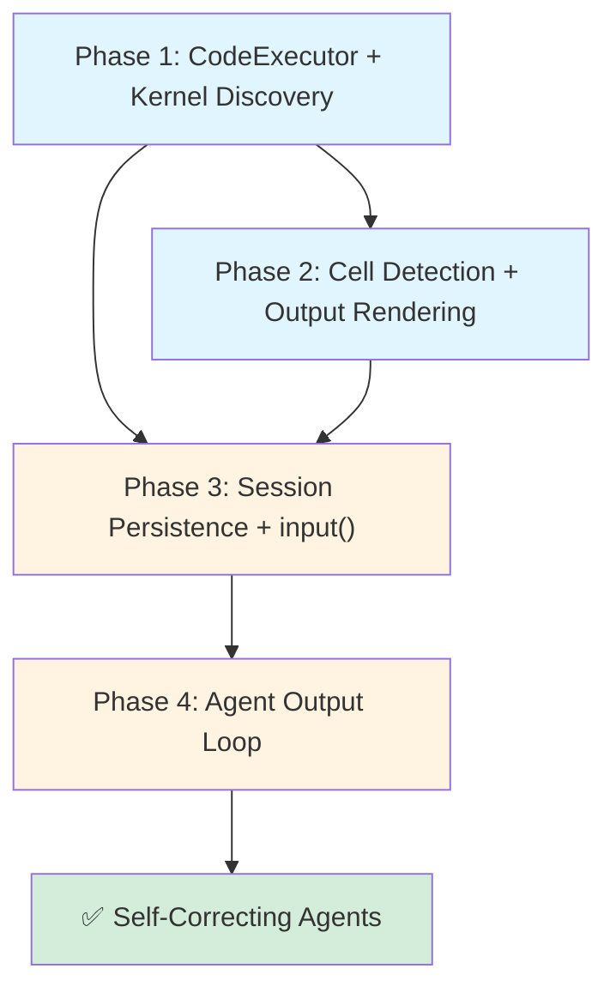

# REPL Code Execution Enhancement Plan

**Purpose:** Define a phased plan for adding structured code execution to the `kask chat` REPL, replacing ad-hoc PTY-based subprocess calls with Jupyter-kernel-backed execution modeled on Zed's `crates/repl/` architecture.

**Related:**
- [`../architecture/PRINCIPLES.md`](../architecture/PRINCIPLES.md) — P2 (Essential Tools), P5 (Deep Modules), P8 (Tested Seams), C8 (Test Depth)
- [`../architecture/hKask-architecture-master.md`](../architecture/hKask-architecture-master.md) — Crate map
- [`TODO.md`](TODO.md) — Existing P0-P2 backlog
- [`../specifications/test-program.md`](../specifications/test-program.md) — Test program requirements

**Source analysis:** Zed `crates/repl/` (`repl_editor.rs`, `session.rs`, `repl_store.rs`, `kernels/mod.rs`, `kernels/native_kernel.rs`, `outputs.rs`) — borrowed patterns documented below with rationale.

---

## 1. Motivation

The current `kask chat` REPL is inference-only: agents generate text but cannot execute code to verify their own outputs, explore data, or close the self-correction loop. Adding structured code execution enables:

1. **Self-correcting agents:** Agent writes code → runs it → sees error → rewrites → verifies. Core agent capability gap.
2. **Data exploration:** Agent loads data, runs analysis, and iterates based on results — all within a chat session.
3. **Language agnosticism:** Jupyter kernels exist for Python, Julia, Rust (evcxr), R, JavaScript, and dozens more. One implementation supports all.
4. **Zero parsing overhead:** Jupyter wire protocol gives structured stdout, stderr, error tracebacks, MIME-typed display data, and `input()` support — no ANSI regex parsing, no PTY state-machine guessing.

**Why now:** The REPL already has `rustyline` for input, `ReplState` for session management, `EnergyGuard` for gas governance, `InferenceLoop` for energy budgets, `GovernedTool` for OCAP authority, and CNS for observability. Code execution fits naturally into this infrastructure — it's a new tool category governed by the same membranes.

---

## 2. Borrowed Zed Patterns (With Rationale)

The following patterns are adapted from Zed's `crates/repl/` with explanation of why each is valuable for a headless terminal REPL. Full source analysis in [`../reference/zed-repl-analysis.md`](../reference/zed-repl-analysis.md) (to be created).

### 2.1 Jupyter Kernel Protocol as Execution Backend

**Pattern:** Use the [Jupyter messaging protocol](https://jupyter-client.readthedocs.io/en/stable/messaging.html) over ZMQ sockets instead of spawning raw subprocesses over PTY.

**How Zed does it:** `NativeRunningKernel` (in `kernels/native_kernel.rs`) spawns a kernel process, establishes 5 ZMQ connections (shell, iopub, control, stdin, heartbeat), and routes messages through three concurrent async tasks via `FuturesUnordered`.

**Why borrow:** A PTY forces you to parse ANSI escape codes, guess when execution finishes, separate stdout from stderr heuristically, and handle `input()` with fragile state machines. Jupyter gives you typed messages: `StreamContent(stdout)`, `StreamContent(stderr)`, `ErrorOutput(ename, evalue, traceback)`, `ExecuteResult(MimeBundle)`, `InputRequest(prompt, password)`, `Status(Idle|Busy|Dead)`. Every edge case becomes a simple match arm.

**What changes for hKask:** No GPUI dependency. The `kernel` module in `hkask-services` (or a new `hkask-kernel` crate) manages ZMQ connections directly via `runtimelib` + `zmq` crates. The REPL receives structured output events via a channel, no rendering framework needed.

### 2.2 Kernel Specification Discovery (Multi-Source, Lazy)

**Pattern:** `KernelSpecification` enum unifies kernels from multiple sources: `jupyter kernelspec list`, Python venv/conda/poetry/uv/pyenv environments (with `import ipykernel` check), `$JUPYTER_SERVER` remote, WSL distros, SSH remotes.

**How Zed does it:** `ReplStore::ensure_kernelspecs()` runs lazily on first use. `python_env_kernel_specifications()` scans project toolchains and checks each with `python -c "import ipykernel"`. `build_python_exec_shell_script()` generates a POSIX script that searches `venv/`, `.venv/`, `.env/`, `env/` directories before falling back to `$PATH`.

**Why borrow:** In a terminal REPL, "which Python do I use?" should be answered automatically. The user shouldn't need to configure kernel paths. The `build_python_exec_shell_script()` pattern is a pure function — directly reusable with no adaptation needed.

**What changes for hKask:** The multi-source enum stays. SSH/WSL remote variants may be deferred to v1.1. Python env discovery leverages hKask's existing `ServiceConfig` for toolchain paths.

### 2.3 Kernel Lifecycle State Machine

**Pattern:** `Kernel` enum models full lifecycle: `StartingKernel → RunningKernel(idle|busy) → ShuttingDown → Shutdown`, plus `ErroredLaunch` and `Restarting`. Within `RunningKernel`, Jupyter's `ExecutionState` tracks `Idle → Busy → Idle` per-execution.

**How Zed does it:** `Kernel` enum in `kernels/mod.rs` with `KernelStatus` derived via `From<&Kernel>`. Operations: `shutdown()` (sends `ShutdownRequest`, waits for graceful termination), `kill()` (force-kills process), `interrupt()` (sends `InterruptRequest` — Ctrl-C equivalent), `restart()` (shutdown + spawn new).

**Why borrow:** Without explicit lifecycle tracking, state is scattered across ad-hoc booleans (`is_running`, `is_busy`, `has_error`). The enum guarantees every state is handled. The REPL can display correct status (spinner while busy, red when dead) and CNS can emit typed ν-events per transition.

**What changes for hKask:** The `Kernel` enum is adopted directly. `kill()` uses `std::process::Child::kill()`. CNS spans are added: `cns.repl.kernel.{started,busy,idle,dead,errored,shutdown,restarted}`.

### 2.4 Code Cell Detection (`runnable_ranges()`)

**Pattern:** Given a buffer snapshot and cursor position, determine what to execute:
- **Markdown files:** Use tree-sitter injections to find fenced code blocks with supported languages
- **Jupytext markers:** Detect `# %%` (with any language's comment prefix) as cell separators
- **Normal files:** Find contiguous non-blank code block around/after cursor
- **Blank line skip:** If cursor is on a blank line, skip forward to next non-blank block
- **Trailing blank trim:** `cell_range()` trims trailing blank lines from the detected block

**How Zed does it:** `runnable_ranges()` dispatches to `markdown_code_blocks()`, `jupytext_cells()`, and `cell_range()`. All pure functions operating on `BufferSnapshot`.

**Why borrow:** This is the difference between "I have to select my code before running" and "press run anywhere in a code block and the right thing happens." The detection logic has zero I/O and is fully testable — it's entirely a function of (text, language, cursor).

**What changes for hKask:** The functions are ported to operate on `String` slices rather than `BufferSnapshot` (since the REPL has raw text, not a GPUI buffer). Tree-sitter for Markdown code block detection is optional in Phase 2; Jupytext markers work with simple regex matching of `{comment_prefix}%%`.

### 2.5 Output Rendering with MIME Ranking

**Pattern:** When a kernel returns a MIME bundle (one result containing `text/plain`, `text/html`, `application/json`, `image/png`, etc.), rank formats by display quality and pick the richest one the terminal can render.

**How Zed does it:** `rank_mime_type()` → `richest()` chain. Ranking: DataTable(7) > HTML(6) > JSON(5) > PNG(4) > JPEG(3) > Markdown(2) > Plain(1). Unsupported types → 0 (skipped). HTML is converted to Markdown when possible.

**Why borrow:** A terminal REPL ranks differently (Markdown > Plain > JSON, images saved to disk), but the *ranking pattern* is identical. You always show the best possible output for the display medium.

**What changes for hKask:** Ranking adapted for terminal:
| MIME Type | Terminal Behavior |
|---|---|
| `text/plain` | Print directly |
| `text/markdown` | Render with basic terminal formatting (bold via ANSI, code fences) |
| `application/json` | Pretty-print with optional syntax coloring |
| `text/html` | Strip tags, extract text (or convert to markdown via `html2text` crate) |
| `image/png`, `image/jpeg` | Save to `$XDG_DATA_HOME/hkask/kernel-output/`, print path. Optional: Kitty/iTerm2 inline image protocol |
| `DataTable` | Render as ASCII table via `comfy-table` or similar |

### 2.6 Stream Output Merging

**Pattern:** Consecutive `StreamContent(stdout)` messages from the kernel are appended to a single output block rather than creating separate output entries.

**How Zed does it:** `apply_terminal_text()` checks if the last output is `Output::Stream` and appends, rather than pushing a new entry.

**Why borrow:** Without merging, `for i in range(100): print(i)` creates 100 separate output entries — visually jarring and memory-inefficient. With merging, it's one contiguous terminal block. This is a pure optimization but dramatically improves the UX of any code that produces streaming output.

**What changes for hKask:** Directly reusable — the "last output is StreamContent → append to its buffer" logic is independent of rendering framework.

### 2.7 ClearOutput (Wait/Immediate) Protocol

**Pattern:** Jupyter's `ClearOutput` message has a `wait` flag. `wait: false` clears outputs immediately. `wait: true` inserts a marker that defers the clear until the next output arrives — preventing visual flicker.

**Why borrow:** Even in a terminal REPL, clearing output is useful for progress indicators and live-updating displays. The deferred clear avoids the "flash" where output disappears before new output appears.

**What changes for hKask:** Adopted directly. The `ClearOutputWaitMarker` pattern requires no GUI.

### 2.8 Execution View Keyed by `parent_message_id`

**Pattern:** Each execution gets an `ExecutionView` identified by the `msg_id` of the originating `ExecuteRequest`. Incoming messages (stream, display data, status changes, input requests) are routed to the correct view via `parent_header.msg_id`. Enables multiple concurrent executions without output interleaving.

**Why borrow:** In a REPL where agents may trigger multiple tool calls concurrently, output from different executions must remain grouped. Without parent-message routing, concurrent output becomes unreadable.

**What changes for hKask:** `ExecutionView` becomes a lightweight struct (no GPUI `Entity`). Status tracking and output arrays are maintained per-execution. Tool-augmented followup can map tool calls to execution views.

### 2.9 Input Request (`input()`) Support

**Pattern:** When the kernel sends `InputRequest`, the session stores the full Jupyter message (needed for correct reply routing via `msg_id`), presents the prompt, collects input, and sends `InputReply` via the `stdin` ZMQ socket. Password masking is supported via the `password` field. If the kernel goes idle before input is received, the pending input is discarded.

**Why borrow:** Without this, code blocks containing `input()` hang the kernel forever. With it, interactive code just works. The password masking support is a bonus for secure credential entry in scripts.

**What changes for hKask:** The REPL enters a sub-prompt (using existing `rustyline`) when `InputRequest` is received. The reply is sent via the kernel's `stdin_tx` channel. This integrates cleanly with the existing `rustyline` readline loop.

### 2.10 Three-Socket Concurrent Message Loop

**Pattern:** Three ZMQ sockets run concurrently via `FuturesUnordered`: `iopub` (broadcast: status, stream, display data), `shell` (request/reply: execute results, kernel info), `stdin` (input requests). The `KernelSession` trait routes messages, and failure of any task loop calls `kernel_errored()` to transition the kernel to an error state.

**Why borrow:** This is the correct concurrency model for the Jupyter protocol. Blocking on one socket while another has data causes deadlocks. Running all three concurrently with proper error propagation is table-stakes for correctness.

**What changes for hKask:** Adopted directly. `KernelSession` trait maps naturally to a service-layer interface. The three-task loop runs within a Tokio task spawned per kernel.

---

## 3. Implementation Phases

### Phase 1: `CodeExecutor` Service + Kernel Discovery (New Capability)

**Scope:** A new `hkask_services::code_execution::CodeExecutor` module that spawns Jupyter kernels, sends `ExecuteRequest`, and returns structured `ExecutionResult` (stdout, stderr, error, display data, status). Kernel auto-discovery for Python environments.

**Verify:** Kernel spawns, `1+1` returns `2`, `print("hello")` produces stream output, `1/0` produces structured error with traceback.

| Task | Deliverable | Effort |
|------|------------|--------|
| **P1.1** | Add `runtimelib` and `zmq` dependencies to `hkask-services` | Cargo.toml |
| **P1.2** | Implement `KernelSpecification` enum (`PythonEnv`, `Jupyter`, `JupyterServer`; defer `SshRemote`, `WslRemote` to v1.1) | `code_execution/kernel_spec.rs` |
| **P1.3** | Implement `build_python_exec_shell_script()` for venv discovery | `code_execution/python_env.rs` |
| **P1.4** | Implement `local_kernel_specifications()` — scans `jupyter kernelspec list` and Python toolchains | `code_execution/discovery.rs` |
| **P1.5** | Implement `NativeRunningKernel` — spawns kernel process, establishes ZMQ connections, starts 3-socket message loop | `code_execution/native_kernel.rs` |
| **P1.6** | Implement `Kernel` lifecycle enum (`StartingKernel`, `RunningKernel`, `ErroredLaunch`, `ShuttingDown`, `Shutdown`, `Restarting`) | `code_execution/kernel.rs` |
| **P1.7** | Implement `ExecutionResult` struct — type-safe output (stdout: `Vec<String>`, stderr: `Vec<String>`, error: `Option<KernelError>`, display_data: `Vec<MimeBundle>`, status: `ExecutionStatus`) | `code_execution/result.rs` |
| **P1.8** | Implement `CodeExecutor` service — `execute(&self, code: &str, kernel: &KernelSpec) -> Result<ExecutionResult>` | `code_execution/executor.rs` |
| **P1.9** | Write tests: kernel spawn/teardown, `1+1`, `print()`, `1/0` error, `input()` request/reply cycle | `code_execution/tests/` |
| **P1.10** | CNS spans: `cns.repl.kernel.{started,busy,idle,dead,errored}` | CNS span registration |
| **P1.11** | Energy budget integration: kernel execution time metered via `EnergyGuard` pattern | `code_execution/energy.rs` |

**New crate?** No — module within existing `hkask-services` (follows PRINCIPLES.md C4: no new crates for single-module features).

**Test depth target:** Deep tests per P8/C8 — kernel lifecycle transitions, message routing, error propagation, input/reply cycle.

---

### Phase 2: Cell Detection + Output Rendering (Smart Execution, Rich Display)

**Scope:** Detect what code to execute from cursor position; render kernel outputs with MIME-appropriate formatting.

**Verify:** Cursor anywhere in a code block executes the block; blank-line skip works; `# %%` markers split cells; stream output merges; `display(DataFrame)` produces formatted table.

| Task | Deliverable | Effort |
|------|------------|--------|
| **P2.1** | Port `runnable_ranges()` — `cell_range()`, `jupytext_cells()`, blank-line skip logic. Operate on `String` slices (not GPUI `BufferSnapshot`) | `code_execution/cell_detection.rs` |
| **P2.2** | Implement `OutputRenderer` with MIME ranking for terminal | `code_execution/renderer.rs` |
| **P2.3** | Implement stream merging — consecutive `StreamContent` appends to same output block | `code_execution/renderer.rs` (append logic) |
| **P2.4** | Implement `ClearOutput` protocol (wait/immediate) | `code_execution/executor.rs` (extend ExecutionResult) |
| **P2.5** | Wire `/run` slash command into `kask chat` REPL | `repl/commands.rs` |
| **P2.6** | Write tests: cell boundary detection, blank-line skip, Jupytext markers, MIME ranking order | `code_execution/tests/` |

**Test depth target:** Medium depth — cell detection is a pure function, deeply testable. Rendering tests verify MIME ranking and stream merging behavior.

---

### Phase 3: Session Persistence + `input()` Support (REPL Statefulness)

**Scope:** Kernel sessions survive across chat turns (variables, imports, and state persist). `input()` in code blocks triggers a REPL sub-prompt. Slash commands for kernel management.

**Verify:** `x = 5` in one turn, `print(x)` in the next outputs `5`. `input("Name: ")` pauses REPL, collects input, continues execution. `/kernel restart` resets kernel state. `/kernel switch python3.12` changes kernel.

| Task | Deliverable | Effort |
|------|------------|--------|
| **P3.1** | Store active `Kernel` session in `ReplState` (alongside existing `inference_loop` and `episodic_storage`) | `repl/mod.rs` |
| **P3.2** | Implement `InputRequest` handling: sub-prompt via `rustyline`, `InputReply` routing | `code_execution/executor.rs`, `repl/turn.rs` |
| **P3.3** | Implement slash commands: `/kernel status`, `/kernel restart`, `/kernel switch <name>`, `/kernel list` | `repl/commands.rs` |
| **P3.4** | Implement kernel shutdown on `/quit` (prevent orphaned processes) | `repl/mod.rs` |
| **P3.5** | CNS spans: `cns.repl.kernel.{restarted,shutdown}`, `cns.repl.input_request` | CNS span registration |
| **P3.6** | Write tests: cross-turn state persistence, `input()` cycle, kernel restart, graceful shutdown | Test suite |

**Test depth target:** Medium depth — lifecycle transitions, cross-turn state, input/reply cycle.

---

### Phase 4: Agent Output Loop (Self-Correcting Agents)

**Scope:** Code execution output becomes part of agent inference context. Errors are fed back so agents self-correct. Successful output is referenceable in subsequent prompts.

**Verify:** Agent: "write code that does X" → runs code → sees error → rewrites → runs again → succeeds. The full execution output (stdout, stderr, error) is in the agent's conversation context.

| Task | Deliverable | Effort |
|------|------------|--------|
| **P4.1** | Implement `ExecutionOutput` → conversation context adapter. Execution results are formatted and injected into the system prompt or user-turn context | `code_execution/context.rs` |
| **P4.2** | Register code execution as a `GovernedTool` — agents request execution through the same OCAP membrane as other MCP tools | `code_execution/tool.rs` |
| **P4.3** | Implement error-feedback loop: structured `KernelError` (ename, evalue, traceback) is formatted for agent comprehension | `code_execution/context.rs` |
| **P4.4** | CNS spans: `cns.repl.agent.execute`, `cns.repl.agent.correct` | CNS span registration |
| **P4.5** | Write tests: agent error-correction loop, OCAP gating, execution context injection | Test suite |

**Test depth target:** Medium depth — context injection, error formatting, OCAP gate enforcement.

---

## 4. Dependency Map



**Phase ordering rationale:**
- Phase 1 is the foundation — everything else depends on kernel spawning and execution.
- Phase 2 (cell detection, rendering) and Phase 3 (persistence, input) are parallelizable after Phase 1.
- Phase 3 is prerequisite for Phase 4 (agents need persistent kernel state + execution output in context).

---

## 5. Crate and File Layout

```
crates/hkask-services/src/code_execution/
├── mod.rs                  # Public API: CodeExecutor, ExecutionResult, KernelSpecification
├── kernel.rs               # Kernel lifecycle enum + state machine
├── kernel_spec.rs          # KernelSpecification enum + LocalKernelSpecification
├── discovery.rs            # local_kernel_specifications(), ensure_kernelspecs()
├── python_env.rs           # build_python_exec_shell_script(), python_env_kernel_specifications()
├── native_kernel.rs        # NativeRunningKernel — process spawn, ZMQ connection, peek_ports()
├── zmq_loop.rs             # start_kernel_tasks() — 3-socket concurrent message routing
├── executor.rs             # CodeExecutor::execute(), ExecutionView per message_id
├── result.rs               # ExecutionResult, Output enum (Stream, Plain, Error, etc.)
├── cell_detection.rs       # runnable_ranges(), cell_range(), jupytext_cells() (Phase 2)
├── renderer.rs             # OutputRenderer, MIME ranking, stream merging (Phase 2)
├── context.rs              # ExecutionOutput → conversation context adapter (Phase 4)
├── tool.rs                 # GovernedTool wrapper for agent-requested execution (Phase 4)
├── energy.rs               # EnergyGuard integration for kernel execution metering
└── tests/
    ├── kernel_tests.rs     # Spawn, execute, teardown, error, input
    ├── discovery_tests.rs  # Kernel spec parsing, Python env detection
    ├── cell_tests.rs       # Cell boundary, blank-line skip, Jupytext markers (Phase 2)
    ├── renderer_tests.rs   # MIME ranking, stream merging (Phase 2)
    ├── session_tests.rs    # Cross-turn persistence, input cycle, restart (Phase 3)
    └── agent_tests.rs      # Error-correction loop, OCAP gating, context injection (Phase 4)

crates/hkask-cli/src/repl/
├── commands.rs             # Slash commands: /run, /kernel status|restart|switch|list
├── mod.rs                  # ReplState: add active_kernel: Option<KernelSession>
└── turn.rs                 # Wire execution output into per-turn context
```

---

## 6. CNS Span Registry (New Spans)

| Span | Namespace | Trigger | Severity |
|------|-----------|---------|----------|
| Kernel spawned | `cns.repl.kernel.started` | Kernel process started successfully | Info |
| Kernel busy | `cns.repl.kernel.busy` | ExecutionState::Busy received | Debug |
| Kernel idle | `cns.repl.kernel.idle` | ExecutionState::Idle received | Debug |
| Kernel dead | `cns.repl.kernel.dead` | ExecutionState::Dead or process exit | Warning |
| Kernel error | `cns.repl.kernel.errored` | Launch failure or ZMQ connection failure | Error |
| Kernel restarted | `cns.repl.kernel.restarted` | /kernel restart or auto-restart | Info |
| Kernel shutdown | `cns.repl.kernel.shutdown` | Graceful shutdown completed | Info |
| Input requested | `cns.repl.input_request` | InputRequest received from kernel | Debug |
| Agent execute | `cns.repl.agent.execute` | Agent triggers code execution | Info |
| Agent correct | `cns.repl.agent.correct` | Agent self-corrects after execution error | Info |

---

## 7. Constraint Compliance

| Principle | How This Plan Complies |
|-----------|----------------------|
| **P1 (Headless)** | No visual UI. Output is terminal ANSI text. No Grafana, dashboards, or web rendering. |
| **P2 (Essential Tools)** | Code execution is a new tool capability, not a new MCP server — it extends the agent's reasoning loop. |
| **P5 (Deep Modules)** | `CodeExecutor` is a single service with a clear contract: `execute(code, kernel) → ExecutionResult`. The module is deep — callers never touch ZMQ or kernel lifecycle. |
| **P6 (No Stubs)** | Every function is fully implemented before moving to the next phase. No `todo!()` or `unimplemented!()`. |
| **P7 (No Dead Code)** | Kernel spec variants (`SshRemote`, `WslRemote`) deferred to v1.1 — no dead variants in the enum. |
| **P8 (Tested Seams)** | Every public function in `CodeExecutor` has a behavioral test: `// REQ: ...` tags from this plan. |
| **C4 (No New Crates)** | Code execution is a module in `hkask-services`, not a new crate. |
| **C8 (Test Depth)** | Kernel lifecycle (deep) → deep tests. Cell detection (pure functions) → deep tests. Rendering (shallow) → shallow tests. |

---

## 8. Risks and Mitigations

| Risk | Likelihood | Impact | Mitigation |
|------|-----------|--------|------------|
| ZMQ native library not available on target OS | Medium | High — blocks Phase 1 | Use `zmq` crate with `vendored` feature (bundles libzmq). Fallback: PTY-based execution with structured output parsing (degraded but functional). |
| Kernel process leaks on crash | Medium | Medium — resource waste | `Drop` impl on `NativeRunningKernel` calls `kill()`. CNS monitors for orphaned kernel processes. |
| `runtimelib` API incompatible with latest Jupyter protocol | Low | Low — fixable | Pin `runtimelib` version. Jupyter protocol is stable (v5.0+). |
| Long-running kernel execution exhausts energy budget | Medium | Low — handled | `EnergyGuard::try_reserve()` gates execution. Kernel is sent `InterruptRequest` on budget exhaustion. |

---

## 9. Success Criteria

| Criterion | Phase | Verification |
|-----------|-------|-------------|
| `CodeExecutor::execute("1+1")` returns `ExecutionResult { stdout: ["2"], .. }` | P1 | Test `test_execute_simple_expression` |
| `CodeExecutor::execute("1/0")` returns structured error with `ename: "ZeroDivisionError"` | P1 | Test `test_execute_division_by_zero` |
| Cursor on blank line after code block executes the next block, not empty space | P2 | Test `test_cell_detection_blank_line_skip` |
| `# %%` markers split code into cells that execute independently | P2 | Test `test_jupytext_cell_detection` |
| `for i in range(100): print(i)` produces one output block, not 100 | P2 | Test `test_stream_output_merging` |
| `x = 5` in turn 1, `print(x)` in turn 2 outputs `5` | P3 | Test `test_cross_turn_state_persistence` |
| `input("Name: ")` pauses REPL, collects input, continues execution | P3 | Test `test_input_request_reply_cycle` |
| Agent self-corrects: writes buggy code → sees error → rewrites → succeeds | P4 | Test `test_agent_error_correction_loop` |
| Kernel shutdown on `/quit` — zero orphaned processes | P3 | Test `test_kernel_graceful_shutdown` |

---

## 10. Open Questions

| ID | Question | Status |
|----|----------|--------|
| **OQ-REPL-1** | Should kernel sessions be shared across agents in ensemble mode, or per-agent? | Open — per-agent initially (simpler), shared may be needed for collaborative data exploration |
| **OQ-REPL-2** | Should `runtimelib` be vendored or used as a crate dependency? | Open — crate dependency preferred, vendored if API stability is a concern |
| **OQ-REPL-3** | Should image output use Kitty/iTerm2 inline protocol, or always save to disk? | Open — disk-only initially (headless constraint), kitty protocol can be feature-gated |
| **OQ-REPL-4** | Phase 4: should execution output be in system prompt or as a user-turn message? | Open — user-turn message preferred (cleaner separation, agents don't "hallucinate" execution results) |
