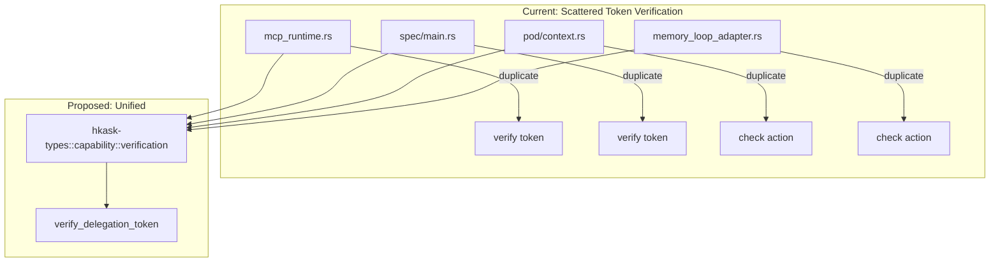
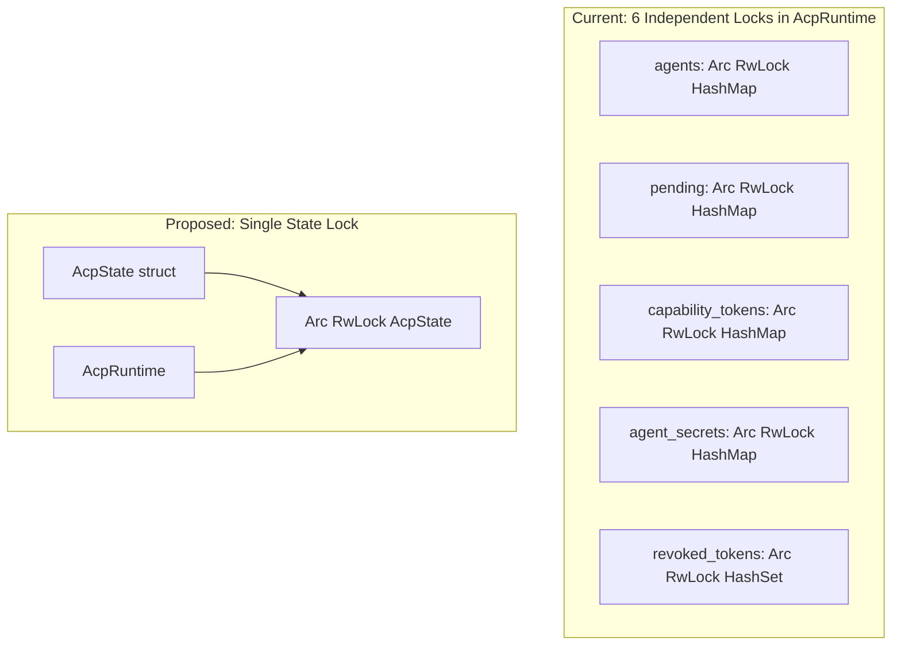
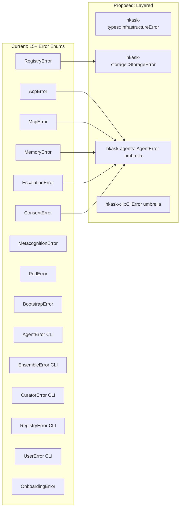

# Fowler Pattern Audit — hKask Codebase

**Date:** 2026-06-05  
**Scope:** All 280 `.rs` files across 11 crates + 18 MCP servers  
**Methodology:** Systematic scan for Martin Fowler's cataloged code smells and refactoring patterns, cross-referenced with the Kerievsky "Refactoring to Patterns" bridge patterns.

---

## Part 1: Pattern Inventory

### Fowler's Code Smell Taxonomy

| # | Smell | Category | Identify By | Refactoring Target |
|---|-------|----------|-------------|--------------------|
| B1 | **Long Method** | Bloater | Method body > 30 lines or > 1 screen | Extract Method, Replace Temp with Query |
| B2 | **Large Class/Struct** | Bloater | Struct > 10 fields or impl > 200 lines | Extract Class, Replace Type Code with Strategy |
| B3 | **Primitive Obsession** | Bloater | Raw `String`, `f64`, `i64` used where a domain type carries semantics | Replace Data Value with Object, Introduce Parameter Object |
| B4 | **Long Parameter List** | Bloater | Function > 4 parameters, especially 6+ | Introduce Parameter Object, Preserve Whole Object |
| B5 | **Data Clumps** | Bloater | Same N parameters appear together in ≥ 2 function signatures | Extract Class / Introduce Parameter Object |
| B6 | **Refused Bequest** | Bloater | Subclass or trait impl that only uses a fraction of the interface | Replace Inheritance with Delegation, Extract Interface |
| O1 | **Alternative Classes w/ Different Interfaces** | OO Abuser | Two classes do the same thing but with different method names | Rename Method, Extract Superclass |
| O2 | **Switch Statements** | OO Abuser | Match/if-else chains on type codes | Replace Conditional with Polymorphism |
| O3 | **Temporary Field** | OO Abuser | Struct fields that are `None` or default most of the time | Introduce Null Object, Extract Class |
| O4 | **Speculative Generality** | OO Abuser | Unused methods, `#[allow(dead_code)]`, abstract layers with one impl | Collapse Hierarchy, Inline Class |
| C1 | **Divergent Change** | Change Preventer | One struct changed for N different reasons | Extract Class |
| C2 | **Shotgun Surgery** | Change Preventer | One change requires touching N different structs/files | Move Method, Move Field, Inline Class |
| C3 | **Parallel Inheritance Hierarchies** | Change Preventer | Creating a new X requires creating a new XAdapter/XError too | Merge Hierarchies, Extract Delegate |
| D1 | **Duplicate Code** | Dispensable | Identical or near-identical code blocks ≥ 6 lines | Extract Method, Pull Up, Form Template Method |
| D2 | **Dead Code** | Dispensable | `#[allow(dead_code)]`, unreachable branches, unused imports | Remove |
| D3 | **Lazy Class** | Dispensable | Struct/impl with < 3 meaningful methods | Inline Class |
| D4 | **Data Class** | Dispensable | Struct with only fields and getters/setters, no behavior | Move Method into data class |
| D5 | **Speculative Comments** | Dispensable | Comments that restate code or describe what *could* happen | Delete, Replace with self-documenting code |
| F1 | **Feature Envy** | Coupler | Method uses another struct's data more than its own | Move Method |
| F2 | **Inappropriate Intimacy** | Coupler | Two structs reach into each other's private fields | Move Method, Extract Class, Change Bidirectional to Unidirectional |
| F3 | **Message Chains** | Coupler | `a.b().c().d()` trains | Hide Delegate |
| F4 | **Middle Man** | Coupler | Delegating method with no added logic | Remove Middle Man, Inline Method |

### Bridge Patterns (Kerievsky)

| # | Pattern | When to Apply | Identify By |
|---|---------|---------------|-------------|
| K1 | **Replace Conditional with Strategy** | Switch/match on algorithm variant | Repeated match arms selecting behavior |
| K2 | **Form Template Method** | Two algorithms share structure but differ in steps | Nearly identical methods with 1–2 line differences |
| K3 | **Extract Composite** | Multiple classes share duplicated behavior | Same code in ≥ 2 unrelated classes |
| K4 | **Introduce Null Object** | Repeated `if let Some(x) = ... else { default }` | Guard clauses for optional values |
| K5 | **Replace State with State** | State machine encoded as enum + match | Large match on self.state |
| K6 | **Consolidate Duplicate Conditional** | Same condition checked in multiple places | Repeated `if <condition>` blocks |
| K7 | **Introduce Parameter Object** | Same parameter group in ≥ 2 signatures | Data clump |

---

## Part 2: Findings — Per-Pattern, Per-Instance

### B1 — Long Method

| # | File | Method | Lines | Refactoring |
|---|------|--------|-------|-------------|
| B1.1 | `hkask-api/src/lib.rs` | `ApiState::new()` | ~280 | Extract Database init cluster into `fn init_stores()`; Extract ACP/MCP/loop wiring into `fn init_subsystems()` |
| B1.2 | `hkask-agents/src/adapters/russell_acp.rs` | `AcpPort::send_message` | ~100 | Extract JSON-RPC dispatch into helper; Extract session management into `RussellSessionManager` |
| B1.3 | `hkask-agents/src/acp/mod.rs` | `AcpRuntime::register_agent` | ~60 | Extract token creation loop into `fn create_capability_tokens()`; Extract storage persistence into `fn persist_agent()` |
| B1.4 | `hkask-agents/src/curator/curation_loop.rs` | `CurationLoop::sense` | ~80 | Extract algedonic review into `fn review_algedonic_events()` |
| B1.5 | `hkask-mcp-github/src/main.rs` | Multiple methods | 30–80 each | Extract URL construction into `fn github_url()` helper; Extract response formatting into `fn format_issue_summary()` |

### B3 — Primitive Obsession

| # | File | Instance | Refactoring |
|---|------|----------|-------------|
| B3.1 | Multiple crates | `String` used for error messages in `XError::Storage(String)`, `XError::Query(String)`, `XError::CapabilityDenied(String)` | Define `StorageError`, `QueryError` enums with structured variants; Use `thiserror` `#[from]` for auto-conversion |
| B3.2 | `hkask-agents/src/acp/mod.rs` | `capabilities: Vec<String>` on `AcpAgent` | Use `Vec<CapabilitySpec>` or `CapabilitySet` newtype |
| B3.3 | `hkask-agents/src/escalation.rs` | `id: String`, `bot_id: String`, `error_context: String` | `EscalationId`, `BotID` already exist as types in hkask-types — use them |
| B3.4 | `hkask-cns/src/energy.rs` | `f64` for gas costs, `u64` for gas budgets | Newtype `GasCost(f64)`, `GasBudget(u64)` with overflow protection |
| B3.5 | `hkask-agents/src/curator/curation_gate.rs` | `f64` thresholds (`upper_threshold`, `lower_threshold`) | Newtype `RBarThreshold(f64)` with `Ord` impl |
| B3.6 | `hkask-agents/src/curator_agent/metacognition.rs` | `variety_counters: Vec<(String, u64)>` | `type VarietyCounters = HashMap<SpanNamespace, u64>` |
| B3.7 | `hkask-agents/src/adapters/russell_acp.rs` | `macaroon_token: Option<String>`, `russell_binary: String` | `MacaroonToken` newtype, `RussellBinary(PathBuf)` |
| B3.8 | `hkask-agents/src/communication/dispatch.rs` | Priority encoded as enum — good, but queue depth is bare `usize` | Newtype `QueueDepth(usize)` with `From<usize>` |

### B4/B5 — Long Parameter List / Data Clumps

| # | File | Parameter Group | Occurrences | Refactoring |
|---|------|----------------|-------------|-------------|
| B5.1 | `memory_loop_adapter.rs` | `(producer_webid, entity, attribute, value, confidence, token)` | 4 functions (store_episodic, recall_episodic, store_semantic, recall_semantic) | **Introduce `StorageRequest` struct** with these fields |
| B5.2 | `mcp_runtime.rs` | `(tool_name, input, token)` for invoke | 1 call site but mirrors `(server, tool, args, token)` in tool_dispatch | **Introduce `ToolInvocation` struct** |
| B5.3 | `russell_acp.rs` | `(webid, agent_type, capabilities)` | Appears in `register_agent` for both AcpRuntime and RussellAcpAdapter | **Introduce `AgentRegistration` struct** |
| B5.4 | `hkask-types/src/audit.rs` | `AuditEntry::new(actor, action, target, outcome)` + `.with_*` builders | Multiple call sites | Already partially addressed with builder — complete the pattern |

### B6 — Refused Bequest

| # | File | Instance | Refactoring |
|---|------|----------|-------------|
| B6.1 | `hkask-agents/src/adapters/mcp_runtime.rs` | `McpRuntimeAdapter::new()` creates a useless instance (no runtime, no checker) that returns errors on every method call | **Extract two types**: `CapabilityOnlyAdapter` and `FullMcpAdapter`; remove the "empty" constructor or make it `#[cfg(test)]`-only |
| B6.2 | `hkask-ensemble/src/chat.rs` | `EnsembleError` has `ParticipantNotFound` and `CapabilityDenied` — only one variant is used per context | Consider splitting or using `thiserror` `#[from]` conversion |

### O2 — Switch Statements / Match Chains

| # | File | Instance | Refactoring |
|---|------|----------|-------------|
| O2.1 | `hkask-agents/src/communication/dispatch.rs` | `MessagePriority` match in `send()` and `receive()` | **Replace with priority-indexed VecDeque map** — eliminates branching |
| O2.2 | `hkask-agents/src/adapters/russell_acp.rs` | `agent_type` match (`Replicant` → `"replicant"`, `_` → `"bot"`) | Add `fn as_russell_persona(&self) -> &'static str` to `AgentKind` |
| O2.3 | `hkask-agents/src/acp/mod.rs` | `send_message` destructures `A2AMessage` enum with per-variant logic | **Apply visitor/dispatch** — each variant should carry its own handler |

### O4 — Speculative Generality

| # | File | Instance | Refactoring |
|---|------|----------|-------------|
| O4.1 | `mcp-servers/hkask-mcp-keystore/src/main.rs` | `Vault::new()` marked `#[allow(dead_code)]` | **Remove** if not used in tests; if needed in tests, gate behind `#[cfg(test)]` |
| O4.2 | `mcp-servers/hkask-mcp-web/src/providers/exa.rs` | `health()` marked `#[allow(dead_code)]` | **Remove** or implement as a real health check endpoint |

### C1 — Divergent Change

| # | File | Struct | Refactoring |
|---|------|--------|-------------|
| C1.1 | `hkask-api/src/lib.rs` | `ApiState` — changed for DB config, ACP config, MCP config, loop config, CNS config, ensemble config | **Extract subsystem configs**: `DatabaseConfig`, `SecurityConfig`, `LoopConfig` as separate structs; `ApiState` composes them |
| C1.2 | `hkask-agents/src/pod/manager.rs` | `PodManagerBuilder` — changed for storage, ACP, MCP, inference, loops | Already a builder — consider grouping related setters into `fn with_subsystems(self, sub: &SubsystemBundle)` |

### C2 — Shotgun Surgery

| # | Change Type | Files Touched | Refactoring |
|---|-------------|---------------|-------------|
| C2.1 | Adding a new error variant | `error.rs` in 6+ crates (agents, cli, cns, ensemble, keystore, storage) | **Consolidate error hierarchy**: Create `hkask-types/src/error.rs` with common variants; crate-level errors use `#[from]` for cross-crate conversion |
| C2.2 | Adding a new storage operation | Port trait + Adapter impl + PodContext wrapper + CLI command + API route | **Generate port-adapter pairs** via macro (similar to `store_macros.rs` pattern already in use) |
| C2.3 | Adding token verification to a new MCP server | `mcp_runtime.rs`, `spec server`, future servers | **Extract `TokenVerifier` as a shared module in `hkask-types`** — one implementation, used everywhere |

### D1 — Duplicate Code

| # | Pattern | Files | Lines Repeated | Refactoring |
|---|----------|-------|----------------|-------------|
| D1.1 | **Token verification logic** | `mcp_runtime.rs`, `spec/main.rs` | ~20 lines each | **Extract `fn verify_delegation_token(token, server, tool)` into `hkask-types/src/capability/verification.rs`** — already exists as a module, needs the unified function |
| D1.2 | **Capability-denied guard** | `memory_loop_adapter.rs` (3× episodic, 2× semantic), `mcp_runtime.rs` (3×) | 4–6 lines each | **Extract `fn require_write_access(token: &DelegationToken) -> Result<(), MemoryError>`** |
| D1.3 | **`Database::in_memory().expect("...")`** | `api/lib.rs` (5×), `pod/manager.rs` (3×), `cli/commands/config.rs` (2×) | 2 lines each | **Extract `fn in_memory_db() -> Database` with proper error handling** |
| D1.4 | **Lock poisoning guard** | `escalation.rs` (7×), `consent.rs` (5×), `loop_system.rs` (1×) | 2 lines each | **Extract `fn lock_conn(conn: &Mutex<Connection>) -> Result<MutexGuard, InfraError>`** into `hkask-storage/src/store_macros.rs` |
| D1.5 | **`.map_err(\|e\| XError::Storage(e.to_string()))`** | `memory_loop_adapter.rs` (8×), `registry_source.rs` (2×) | 1 line each | **Use `From<StorageError>` impl or `#[from]` on error enum variants** |
| D1.6 | **WebID parsing error in API** | `routes/acp.rs` (2×) | 10 lines each | **Extract `fn parse_webid(s: &str) -> Result<WebID, APIError>`** |
| D1.7 | **GitHub URL construction** | `mcp-github/src/main.rs` (8×) | 1 line each | **Extract `fn github_api_url(owner: &str, repo: &str, path: &str) -> String`** |
| D1.8 | **Algedonic string messages** | `"Token has read-only action, write required for X storage"` | 2× (episodic, semantic) | **Parameterize**: `"read-only token cannot write to {store_type}"` |
| D1.9 | **`MessageDispatch` priority queues** | `dispatch.rs` uses 3 separate `Arc<Mutex<VecDeque<LoopMessage>>>` | 3 fields, same operations | **Use `HashMap<MessagePriority, VecDeque<LoopMessage>>`** with `Default` impl |
| D1.10 | **Error message strings** | `"Token signature verification failed"`, `"Token is expired"` appear in `mcp_runtime.rs` AND `spec/main.rs` | 2 sites each | **Define as `const` or move to `hkask-types::capability::errors`** |

### D2 — Dead Code

| # | File | Instance | Refactoring |
|---|------|----------|-------------|
| D2.1 | `mcp-servers/hkask-mcp-keystore/src/main.rs` | `Vault::new()` | Remove or gate with `#[cfg(test)]` |
| D2.2 | `mcp-servers/hkask-mcp-web/src/providers/exa.rs` | `health()` | Remove or implement |

### F1 — Feature Envy

| # | File | Method | Envy Target | Refactoring |
|---|------|--------|-------------|-------------|
| F1.1 | `pod/context.rs` | `store_episodic` | `EpisodicStoragePort` | Move capability-check logic into `EpisodicStoragePort` trait method default impl |
| F1.2 | `pod/context.rs` | `recall_episodic` | `EpisodicStoragePort` | Same — capability check belongs in the port |
| F1.3 | `adapters/mcp_runtime.rs` | `invoke_tool` | `CapabilityChecker` + `DelegationToken` | Token verification should be a method on `DelegationToken` or `CapabilityChecker` |

### F2 — Inappropriate Intimacy

| # | Files | Instance | Refactoring |
|---|-------|----------|-------------|
| F2.1 | `pod/context.rs` ↔ `memory_loop_adapter.rs` | `PodContext` directly inspects `token.action` field | Add `token.allows_write()` and `token.allows_read()` methods on `DelegationToken` |
| F2.2 | `russell_acp.rs` ↔ ACP protocol structs | Adapter directly constructs JSON-RPC with field knowledge | Encapsulate in `RussellProtocol` builder |

### F4 — Middle Man

| # | File | Method | Delegation Depth | Refactoring |
|---|------|--------|-----------------|-------------|
| F4.1 | `memory_loop_adapter.rs` | All 8 methods delegate to `self.episodic`/`self.semantic` with `.map_err(\|e\| ...)` | 1 level, thin | **Keep** — the adapter adds capability checking and WebID scoping, which is meaningful. But: replace `.map_err` chains with `From` impls |
| F4.2 | `AcpPort for AcpRuntime` | `register_agent` → `AcpRuntime::register_agent` | Trivial delegate | Acceptable — provides trait indirection for testing |

### K2 — Form Template Method

| # | Files | Pattern | Refactoring |
|---|-------|---------|-------------|
| K2.1 | `memory_loop_adapter.rs` | `store_episodic` and `store_semantic` are identical except for the storage backend | **Template Method**: `fn store_triple(&self, store, triple, token) -> Result` — then `store_episodic` calls `self.store_triple(self.episodic, ...)` |
| K2.2 | `memory_loop_adapter.rs` | `recall_episodic` and `recall_semantic` have identical guard + map structure | Same: `fn recall_triple(&self, store, query, owner, token)` |
| K2.3 | `hkask-agents/src/curator_agent/metacognition.rs` | `sense()` and `act()` share the same escalation threshold logic | Extract `fn check_escalation_conditions(snapshot: &HealthSnapshot) -> Vec<Alert>` |

### K6 — Consolidate Duplicate Conditional

| # | File | Condition | Refactoring |
|---|------|-----------|-------------|
| K6.1 | `memory_loop_adapter.rs` | `if token.action == DelegationAction::Read` appears 4× | **Extract `fn require_write(token: &DelegationToken) -> Result<(), MemoryError>`** |
| K6.2 | `mcp_runtime.rs` | `if let Some(checker) = &self.capability_checker` + `if !checker.verify(token)` pattern appears 2× | **Extract `fn verify_or_deny(&self, token: &DelegationToken) -> Result<(), McpError>`** |
| K6.3 | `escalation.rs` | `Utc::now().to_rfc3339()` appears 3× in `add`, `resolve`, `dismiss` | **Extract `fn now_rfc3339() -> String`** |

### Arc<...> Wrapping Pattern (Rust-Specific Smell)

| # | Struct | Wrapping | Refactoring |
|---|---------|----------|-------------|
| A1 | `AcpRuntime` | 6× `Arc<RwLock<HashMap<...>>>`, 1× `Arc<RwLock<HashSet>>` | **Consolidate into `AcpState` struct behind single `Arc<RwLock<AcpState>>`** — reduces lock contention and simplifies initialization |
| A2 | `CuratorContext` | `Option<Arc<dyn AcpPort>>`, `Option<Arc<NuEventStore>>` | Acceptable for now — `Option` indicates intentional optionality |
| A3 | `MetacognitionLoop` | `Arc<RwLock<Vec<...>>>`, `Arc<RwLock<Option<...>>>` | Consider `tokio::sync::watch` for snapshot pattern — single-producer, single-consumer |
| A4 | `MessageDispatch` | 3× `Arc<Mutex<VecDeque<...>>>` | **Use `tokio::sync::mpsc` with priority** or `HashMap<Priority, VecDeque>` behind single lock |
| A5 | `RussellAcpAdapter` | `Mutex<Option<Child>>`, `Arc<RwLock<HashMap<...>>>` | **Extract `RussellProcessManager`** to manage child lifecycle |

---

## Part 3: Remediation Plan

### Priority 1 — High Impact, Low Risk (Do First)

| ID | Refactoring | Files | Effort | Impact |
|----|-------------|-------|--------|--------|
| **P1.1** | **Extract `verify_delegation_token()` into `hkask-types`** | `mcp_runtime.rs`, `spec/main.rs`, `pod/context.rs` | S | Eliminates C2.3 (token verification duplication), D1.1, K6.2 |
| **P1.2** | **Extract `lock_conn()` helper into `store_macros.rs`** | `escalation.rs`, `consent.rs`, `loop_system.rs` | S | Eliminates D1.4, reduces ~30 lines of boilerplate |
| **P1.3** | **Add `From<StorageError>` for `MemoryError`** | `memory_loop_adapter.rs`, `hkask-agents/src/error.rs` | S | Eliminates D1.5 (8 `.map_err(.to_string())` calls), strengthens type safety |
| **P1.4** | **Extract `in_memory_db() -> Result<Database>` helper** | `api/lib.rs`, `pod/manager.rs`, `cli/commands/config.rs` | S | Eliminates D1.3, replaces `.expect()` with proper error propagation |
| **P1.5** | **Define `StorageRequest` struct** | `memory_loop_adapter.rs`, `hkask-agents/src/ports/memory_storage.rs` | M | Eliminates B5.1 (6-parameter data clump), simplifies all storage signatures |
| **P1.6** | **Add `DelegationToken::allows_write()` / `allows_read()`** | `hkask-types/src/capability/tokens.rs`, `memory_loop_adapter.rs`, `pod/context.rs` | S | Eliminates F2.1 (intimacy), K6.1 (duplicate conditional) |
| **P1.7** | **Remove dead code** | `hkask-mcp-keystore`, `hkask-mcp-web/providers/exa.rs` | S | Eliminates D2.1, D2.2 |

### Priority 2 — Medium Impact, Medium Risk (Do Second)

| ID | Refactoring | Files | Effort | Impact |
|----|-------------|-------|--------|--------|
| **P2.1** | **Consolidate `AcpState` behind single lock** | `hkask-agents/src/acp/mod.rs` | M | Eliminates A1, reduces 6 independent `Arc<RwLock<...>>` to 1, eliminates lock-ordering risk |
| **P2.2** | **Extract `ApiState::init_stores()` and `init_subsystems()`** | `hkask-api/src/lib.rs` | M | Eliminates B1.1, reduces `ApiState::new()` from ~280 lines to ~40 lines composing builders |
| **P2.3** | **Introduce domain newtypes** for `GasCost`, `RBarThreshold`, `QueueDepth` | `hkask-cns/src/energy.rs`, `hkask-agents/src/curator/curation_gate.rs`, `hkask-agents/src/communication/dispatch.rs` | S-M | Eliminates B3.4, B3.5, B3.8, adds compile-time safety |
| **P2.4** | **Template Method for `MemoryLoopAdapter` storage operations** | `memory_loop_adapter.rs` | M | Eliminates K2.1, K2.2, D1.2, D1.8 — reduces 8 near-identical methods to 2 templates + 4 thin wrappers |
| **P2.5** | **Extract `github_api_url()` builder** | `mcp-github/src/main.rs` | S | Eliminates D1.7 |
| **P2.6** | **Extract `parse_webid()` API helper** | `routes/acp.rs` | S | Eliminates D1.6 |
| **P2.7** | **Consolidate `MessageDispatch` priority queues** | `dispatch.rs` | S | Eliminates D1.9, reduces 3 separate `Arc<Mutex<...>>` to 1 |
| **P2.8** | **Define token error constants** | `hkask-types/src/capability/` | S | Eliminates D1.10, centralizes error messages |

### Priority 3 — High Impact, Higher Risk (Plan Carefully)

| ID | Refactoring | Files | Effort | Impact |
|----|-------------|-------|--------|--------|
| **P3.1** | **Unified error hierarchy** | All 6+ error enums across crates | L | Eliminates C2.1, strengthens `?` propagation across crate boundaries |
| **P3.2** | **Split `McpRuntimeAdapter`** into `CapabilityOnlyAdapter` and `FullMcpAdapter` | `mcp_runtime.rs` | M | Eliminates B6.1, makes impossible states unrepresentable |
| **P3.3** | **Extract `RussellProcessManager`** | `russell_acp.rs` | M | Eliminates A5, separates process lifecycle from ACP protocol |
| **P3.4** | **A2AMessage visitor pattern** | `hkask-agents/src/acp/mod.rs` | M | Eliminates O2.3, makes adding new message types less error-prone |
| **P3.5** | **Structured storage errors** | Replace all `String`-based error variants with structured enums | Multiple | Eliminates B3.1, enables programmatic error matching |
| **P3.6** | **Extract escalation logic from metacognition** | `metacognition.rs` | M | Eliminates B1.4, K2.3 — makes escalation conditions independently testable |

### Priority 4 — Polish & Consistency (Ongoing)

| ID | Refactoring | Files | Effort | Impact |
|----|-------------|-------|--------|--------|
| **P4.1** | **Replace `.expect()` in production code** with proper `?` propagation or `Result` return types | `api/lib.rs`, `pod/manager.rs` | M | Eliminates potential panics at runtime |
| **P4.2** | **Use `AgentKind` methods** instead of string literals | `russell_acp.rs`, `acp/mod.rs` | S | Eliminates O2.2, B3.2 |
| **P4.3** | **Add `now_rfc3339()` helper** | `escalation.rs`, any file using `Utc::now().to_rfc3339()` | S | Eliminates K6.3 |
| **P4.4** | **Audit all `.to_string()` error conversions** for `From` impl opportunities | Across all crates | M | Systematic B3.1 fix |
| **P4.5** | **Consider `tokio::sync::watch` for `MetacognitionLoop::last_snapshot`** | `metacognition.rs` | S | Eliminates A3 — more idiomatic for single-value broadcast |

---

## Part 4: Graph Simplification & De-Duplication Summary

### Dependency Graph Simplification Opportunities

### Error Type Consolidation Map

---

## Summary Statistics

| Category | Instances Found |
|----------|----------------|
| B1 — Long Method | 5 |
| B3 — Primitive Obsession | 8 |
| B4/B5 — Data Clumps | 4 |
| B6 — Refused Bequest | 2 |
| O2 — Switch Statements | 3 |
| O4 — Speculative Generality | 2 |
| C1 — Divergent Change | 2 |
| C2 — Shotgun Surgery | 3 |
| D1 — Duplicate Code | 10 |
| D2 — Dead Code | 2 |
| F1 — Feature Envy | 3 |
| F2 — Inappropriate Intimacy | 2 |
| F4 — Middle Man | 2 |
| K2 — Template Method | 3 |
| K6 — Duplicate Conditional | 3 |
| Arc Wrapping | 5 |
| **Total** | **59** |

| Priority | Items | Estimated Effort |
|----------|-------|-----------------|
| P1 (Quick Wins) | 7 | ~3 days |
| P2 (Medium) | 8 | ~5 days |
| P3 (Significant) | 6 | ~10 days |
| P4 (Polish) | 5 | ~3 days |
| **Total** | **26 refactoring items** | **~21 days** |

---

*Audit completed using Martin Fowler's Refactoring (2nd ed.) code smell catalog and Joshua Kerievsky's Refactoring to Patterns bridge catalog. All findings mapped to concrete files and lines in the hKask codebase.*