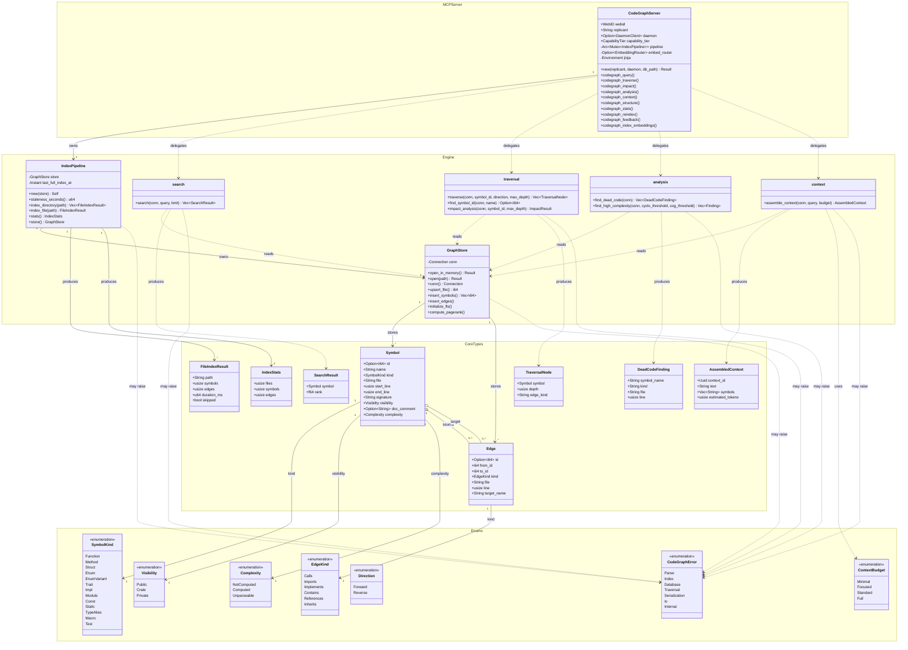
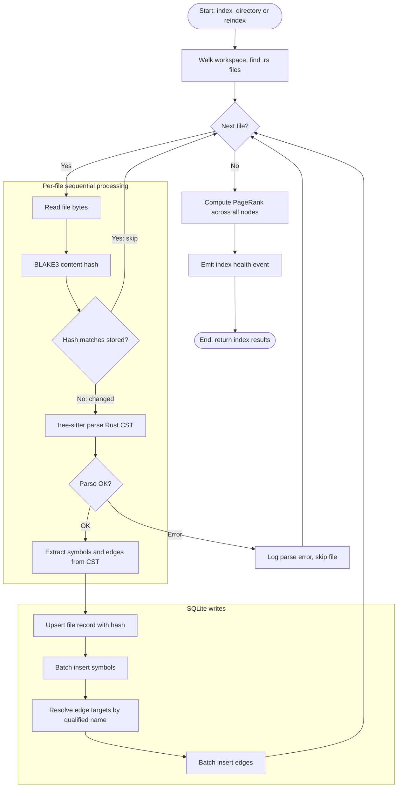
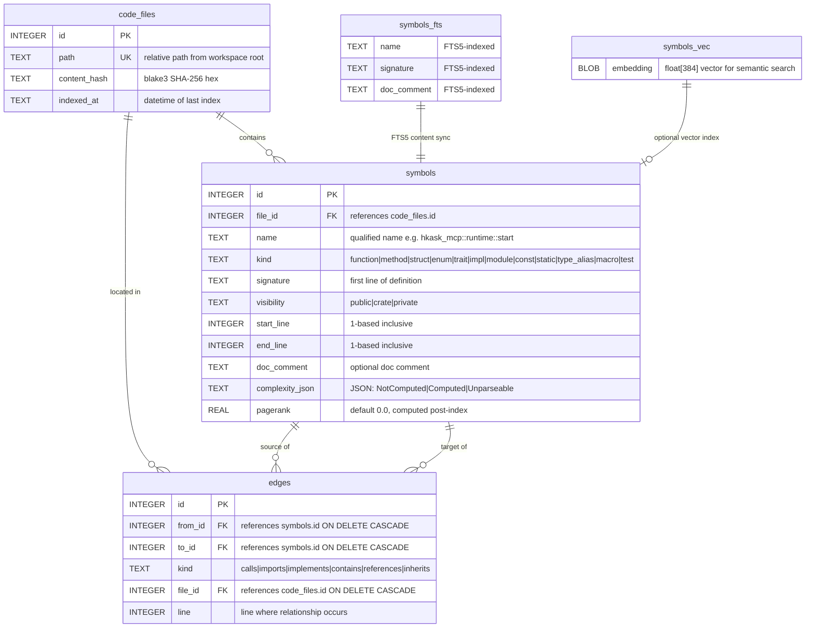
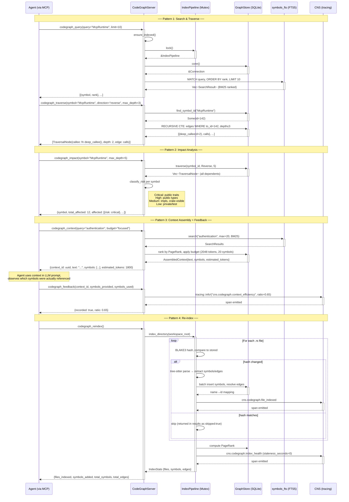
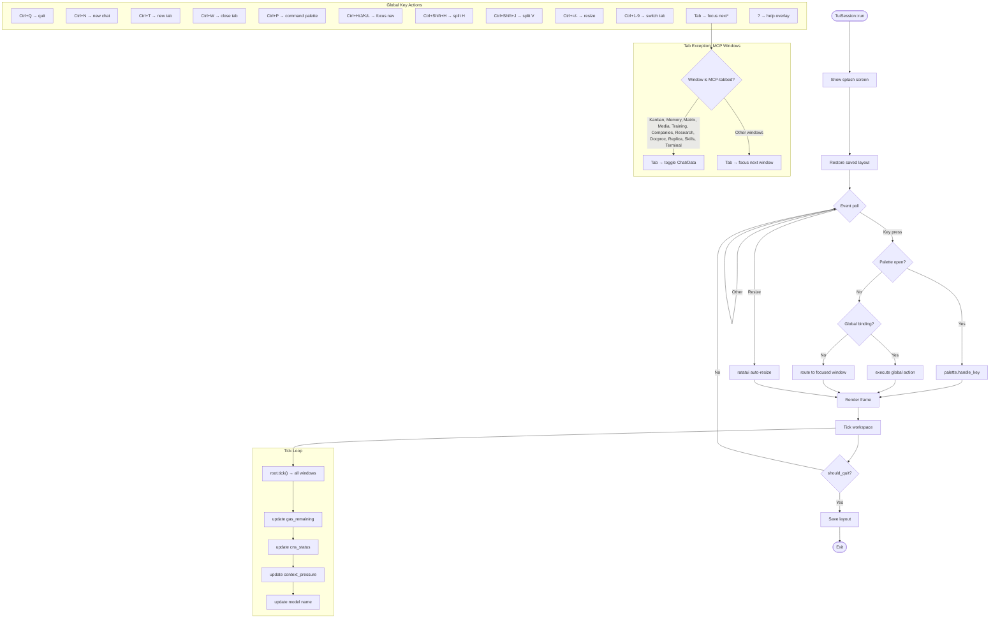
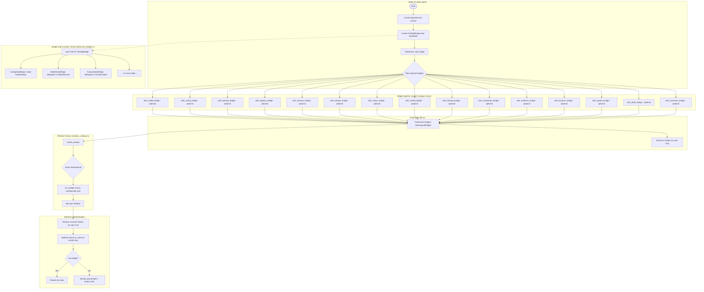

# API Reference

Consolidated public API surface for all 45 hKask crates, organized by category. Every public type, trait, function, and re-export listed here is verified against the crate's `src/lib.rs` and module source files.

**Statement:** This document is the single canonical reference for hKask's public API. **Evidence:** Each crate entry cross-references `Cargo.toml` descriptions, `pub mod` declarations, `pub use` re-exports, and `pub` items from `src/lib.rs` and submodules.

## Crate Category Index

| Category | Crates | Count |
|----------|--------|-------|
| [Foundation](#foundation-crates) | types, storage, storage-core, database, memory, cns, templates, agents, keystore, mcp, cli, api, capability, ports | 14 |
| [Infrastructure](#infrastructure-crates) | inference, communication, improv, condenser, codegraph, acp, adapter, test-harness, mcp-cloud-gateway, guard, repl, forecast, storage-guard | 13 |
| [Service](#service-crates) | services-core, services-context, services-runtime, services-chat, services-compose, services-corpus, services-kata-kanban, services-onboarding, services-skill, services-wallet | 10 |
| [Wallet/Identity/Ledger](#walletidentityledger) | wallet, wallet-types, ledger | 3 |
| [Ontology/Interface](#ontologyinterface) | bridge-dublincore, bridge-pko, federation, tui | 4 |

---

## Foundation Crates

Foundation crates provide the type system, storage, database, memory, CNS, templates, agents, keystore, MCP, CLI, API, capability, and port abstractions that all downstream crates depend on. Per the Authority DAG, domain crates depend on port traits (hkask-ports) rather than on each other.

### hkask-types

ID types, nu-event, and visibility types for hKask.

**Public Modules (27 — 26 unconditional + 1 feature-gated):**

| Module | Description |
|--------|-------------|
| `agent` | Agent kind and persona constraint types |
| `agent_paths` | Filesystem path conventions for agent storage |
| `agent_registry` | Agent registration records: `AgentDefinition`, `Charter`, `Contact`, `RegisteredAgent`, `Responsibility`, `Right`, `ScheduledTask`, `UserProfile` |
| `cns` | CNS span types (`CnsSpan`) and circuit state (`CircuitState`) |
| `crypto` | Cryptographic primitives including `Ed25519PublicKey` |
| `curation` | Sovereignty boundary types: `BoundaryClassification`, `DataCategory`, `DataSovereigntyBoundary`, `UserSovereigntyState` |
| `curator` | Curation configuration: `CurationThresholdConfig`, `CuratorDirective`, `CuratorHandle`, `EscalationSeverity` |
| `error` | Cross-cutting error types: `InfrastructureError`, `McpErrorKind`, `DatabaseErrorKind`, `NotFound`, `CapabilityDenied`, `DimensionMismatch` |
| `event` | Event primitives: `NuEvent`, `NuEventSink`, `Span`, `SpanKind`, `SpanNamespace`, `SpanCategory`, `CyclePhase` |
| `fusion` | Fusion types |
| `goal` | Goal state tracking: `GoalState` |
| `id` | Type-safe UUID identifier system: `Id<T>`, `IdKind`, `WebID`, and all concrete ID type aliases |
| `identity` | Agent identity types |
| `keychain_keys` | Keychain key storage |
| `loops` | Loop type system: `LoopId`, `LoopAction`, `LoopActionParams`, `ActionType`, `ActionDecision`, `ImpactReport`, `LoopQuality`, `Signal`, `SignalMetric`, `Deviation`, `DeviationDirection`, `BudgetOption`, `RegulationData`, `TriggerOrigin`, `ExperienceClassification` (15 types) |
| `macros` | Shared macros: `enum_str_ops!` |
| `observable_span` | `ObservableSpan` trait for decoupled CNS observability |
| `retry` | Retry policy types |
| `secret` | Secret reference handling |
| `server_config` | Server configuration types |
| `skill` | Skill polarity: `SkillPolarity` |
| `template` | LLM parameter types: `LLMParameters` |
| `template_type` | Template type classification: `TemplateType` |
| `time` | Time utilities |
| `transcript` | Transcript primitives: `TimedWord`, `TranscriptBundle`, `TranscriptSegment` |
| `visibility` | Access-control visibility types: `Visibility`, `Confidence`, `Dimension`, `AccessControl` |
| `sql_impls` | SQL support (feature-gated behind `sql`) |

**Key Public Types:**

`Id<T: IdKind>` — Generic UUID-based identifier with phantom type parameter. Methods: `new()`, `from_uuid()`, `from_name()`, `as_uuid()`. Implements `Clone`, `Copy`, `Debug`, `PartialEq`, `Eq`, `Hash`, `Serialize`, `Deserialize`, `FromStr`, `Default`, `Display`.

`IdKind` — Sealed marker trait for ID kind discrimination. Implemented by 17 empty enum types: `TemplateKind`, `BotKind`, `TripleKind`, `EventKind`, `GoalKind`, `EmbeddingKind`, `UserKind`, `SovereigntyKind`, `PodIdKind`, `WalletKind`, `ApiKeyKind`, `EscalationKind`, `PhaseKind`, `CommentKind`, `BoardKind`, `ColumnKind`, `TaskKind`.

**Concrete ID Type Aliases (17):**

| Alias | Kind |
|-------|------|
| `TemplateID` | `Id<TemplateKind>` |
| `BotID` | `Id<BotKind>` |
| `HMemId` | `Id<TripleKind>` |
| `EventID` | `Id<EventKind>` |
| `GoalID` | `Id<GoalKind>` |
| `EmbeddingID` | `Id<EmbeddingKind>` |
| `UserID` | `Id<UserKind>` |
| `SovereigntyId` | `Id<SovereigntyKind>` |
| `PodID` | `Id<PodIdKind>` |
| `WalletId` | `Id<WalletKind>` |
| `ApiKeyId` | `Id<ApiKeyKind>` |
| `EscalationID` | `Id<EscalationKind>` |
| `PhaseId` | `Id<PhaseKind>` |
| `CommentId` | `Id<CommentKind>` |
| `BoardId` | `Id<BoardKind>` |
| `ColumnId` | `Id<ColumnKind>` |
| `TaskId` | `Id<TaskKind>` |

`WebID` — Unique identifier for agents. Newtype over `Uuid`. Methods: `new()`, `from_uuid()`, `as_uuid()`, `for_agent_name()`, `from_persona()`, `from_persona_with_namespace()`, `redacted_display()`. Implements `From<BotID>`, `FromStr`, `Default`, `Display`.

`NuEvent` — The canonical ν-event. Fields: `id`, `timestamp`, `observer_webid`, `span`, `phase`, `observation`, `regulation`, `outcome`, `recursion_depth`, `parent_event`, `visibility`. Constructors: `new()`, with builder methods `with_outcome()`, `with_regulation()`, `with_parent()`, `with_visibility()`.

`NuEventSink` — Trait for persisting NuEvents. Single method: `fn persist(&self, event: &NuEvent)`.

`ObservableSpan` — Trait for typed observability spans. Dyn-compatible (`Display + Debug + Send + Sync + 'static`). **4 methods:**

| Method | Signature | Description |
|--------|-----------|-------------|
| `as_str` | `(&self) -> &'static str` | Canonical dot-separated namespace string. Required. |
| `emit` | `(&self, operation: &str)` | Log-only tracing event with `target = "cns"`. Default impl. |
| `to_event` | `(&self, operation, observer, phase, observation) -> Option<NuEvent>` | Produces a NuEvent without persisting. Returns `None` on namespace miss. Default impl. |
| `emit_to` | `(&self, sink, operation, observer, phase, observation)` | Produces a NuEvent via `to_event()`, persists through sink, and logs. Degrades to `emit()` on failure. Default impl. |

`SpanKind` — Enum of CNS span kinds: `ToolInvoked`, `ToolCompleted`, `ToolError`, `GasReserved`, `GasSettled`, `GasDepleted`, `CurationDirectiveAcknowledged`, `CurationEscalation`, `AgentPodRegistered`, `AgentPodActivated`, `AgentPodDeactivated`, `VarietyAlgedonicAlert`, `DepositCredited`, `ImpactVerified`, `ActionSubstituted`, `ActionBlocked`, `RegulatoryPlateauDetected`, `LoopQualityTelemetry`.

`SpanNamespace` — Validated string wrapper for canonical CNS span namespaces. Constructed via `new()` (fallible) or `parse()`.

`CyclePhase` — Loop cycle phase enum: `Sense`, `Compute`, `Compare`, `Act`, `Verify`.

`Visibility` — Three-tier access classification: `Private` (default), `Shared`, `Public`. Methods: `as_str()`, `parse_str()`.

`Confidence` — Newtype over `f64` clamped to `[0.0, 1.0]`. Methods: `new()`, `full()`, `value()`, `memory_decay()`.

`Dimension` — 5W1H dimension enum: `Who`, `What`, `Where`, `When`, `Why`, `How`.

`AccessControl` — Value object bundling perspective, visibility, and owner WebID. Fields: `perspective: Option<WebID>`, `visibility: Visibility`, `owner_webid: WebID`. Constructors: `new()`, `episodic()`, `semantic()`, `public()`.

`InfrastructureError` — Cross-cutting transport-layer error enum (`#[non_exhaustive]`): `Database`, `Serialization`, `LockPoisoned`, `NotFound`, `Io`.

`McpErrorKind` — Semantic MCP tool error taxonomy (`#[non_exhaustive]`): `Internal`, `Unavailable`, `Timeout`, `NotFound`, `InvalidArgument`, `PermissionDenied`, `RateLimited`, `FailedPrecondition`. Methods: `is_retryable()`, `requires_intervention()`.

`DatabaseErrorKind` — Recovery-path discrimination: `Connection`, `Query`, `Constraint`, `Migration`, `Other`.

**Re-exports at Crate Root:** `AgentKind`, `PersonaConstraints`, `AgentDefinition`, `Charter`, `Contact`, `RegisteredAgent`, `Responsibility`, `Right`, `ScheduledTask`, `UserProfile`, `CircuitState`, `Ed25519PublicKey`, `BoundaryClassification`, `DataCategory`, `DataSovereigntyBoundary`, `UserSovereigntyState`, `CurationThresholdConfig`, `CuratorDirective`, `CuratorHandle`, `EscalationSeverity`, `InfrastructureError`, `McpErrorKind`, `NuEvent`, `NuEventSink`, `GoalState`, all 17 ID type aliases, `WebID`, `LoopId`, `ActionDecision`, `ActionType`, `BudgetOption`, `Deviation`, `DeviationDirection`, `ExperienceClassification`, `ImpactReport`, `LoopAction`, `LoopActionParams`, `LoopQuality`, `RegulationData`, `Signal`, `SignalMetric`, `TriggerOrigin`, `ObservableSpan`, `SkillPolarity`, `LLMParameters`, `TemplateType`, `TimedWord`, `TranscriptBundle`, `TranscriptSegment`, `Confidence`, `Dimension`, `Visibility`.

**Feature Flags:** `sql` — enables `sql_impls` module and `From<rusqlite::Error> for InfrastructureError`.

---

### hkask-storage

SQLite + SQLCipher storage for hKask.

**Public Modules:**

| Module | Purpose |
|--------|---------|
| `agent_registry` | `AgentRegistryStore` — agent identity and registration records |
| `embeddings` | `EmbeddingStore` — vector embeddings with similarity search |
| `goals` | `SqliteGoalRepository` — OCAP-gated goal records with quarantine |
| `nu_event_store` | `NuEventStore` — weighted event log with `DecayConfig` |
| `user_store` | User identity and authentication records |
| `wallet` | `WalletStore` — wallet data persistence |

**Re-exports from hkask-storage-core:** `Database`, `DatabaseError`, `open_database`, `open_or_repair`, `check_passphrase`, `define_driver_store` (macro), `impl_from_db_error` (macro), `sanitize_path`.

**Key Types:** `HMemStore` (episodic memory store, `HMemError`), `NuEventStore` (weighted event log), `EmbeddingStore` / `StoredEmbedding` / `SimilarityResult` / `EmbeddingError`, `ConsentStore` / `StoredConsentRecord` / `ConsentStoreError`, `EscalationQueue` / `EscalationEntry` / `EscalationBatch` / `EscalationStats` / `EscalationStatus` / `EscalationError`, `GalleryStore` / `GalleryRecord` / `ImageRecord` / `TagRecord` / `GalleryMode` / `GalleryStoreError`, `KataHistoryStore` / `KataHistoryEntry` / `KataHistoryError`, `SovereigntyBoundaryStore` / `SovereigntyBoundaryEntry` / `SovereigntyStoreError`, `BackupArchive` / `BackupMeta` / `MigrationReceipt` / `ArchiveError`, `AgentRegistryStore` / `AgentRegistryError`, `SqliteGoalRepository` / `QuarantinedGoal` / `GoalRepositoryError`, `TokenRegistryStore`, `WalletStore`.

**Feature Flags:** None. Core dependency.

---

### hkask-storage-core

hKask storage foundation — Database, Store trait, lock helpers, path sanitization.

**Public Modules:**

| Module | Purpose |
|--------|---------|
| `store_macros` | `DatabaseDriverTrait` macro for defining store types |
| `database` | `Database`, `DatabaseError`, `open_database`, `open_or_repair`, `check_passphrase` |
| `security` | `sanitize_path` — filesystem path sanitization |

**Re-exports at Crate Root:** `Database`, `DatabaseError`, `check_passphrase`, `open_database`, `open_or_repair`, `sanitize_path`, `DatabaseDriverTrait`.

**Feature Flags:** None. Core dependency.

---

### hkask-database

Database driver abstraction — provider-agnostic SQL execution for hKask storage.

**Public Modules:**

| Module | Purpose |
|--------|---------|
| `driver` | `DatabaseDriver` trait — the port stores code against |
| `encrypt` | Encryption support for database-level protections |
| `postgres` | `PostgresDriver` — sqlx-based PostgreSQL implementation |
| `sqlite` | `SqliteDriver` — r2d2-pooled rusqlite with WAL + SQLCipher |
| `transaction` | `TransactionHandle` — RAII transaction guard |
| `types` | `DbProvider` enum, `DbError`, and supporting types |
| `value` | `DbRow`, `DbValue` — database value abstraction layer |

**Key Public Types:**

`DatabaseDriver` (trait) — Dyn-compatible trait that stores code against using `&dyn DatabaseDriver` or `Arc<dyn DatabaseDriver>`.

| Method | Signature | Purpose |
|--------|-----------|---------|
| `execute` | `(sql, params) -> Result<usize, DbError>` | INSERT/UPDATE/DELETE/DDL |
| `execute_batch` | `(sql) -> Result<(), DbError>` | Batch SQL (schema creation) |
| `query` | `(sql, params) -> Result<Vec<DbRow>, DbError>` | Query returning all rows |
| `query_optional` | `(sql, params) -> Result<Option<DbRow>, DbError>` | Query single optional row |
| `provider` | `() -> DbProvider` | Which provider backs this driver |
| `commit_tx` | `() -> Result<(), DbError>` | Commit current transaction (internal, `#[doc(hidden)]`) |
| `rollback_tx` | `() -> Result<(), DbError>` | Rollback current transaction (internal, `#[doc(hidden)]`) |
| `sqlite_pool` | `() -> Option<&r2d2::Pool<...>>` | Access SQLite pool if `SqliteDriver` (default: `None`) |
| `postgres_pool` | `() -> Option<&sqlx::PgPool>` | Access PostgreSQL pool if `PostgresDriver` (default: `None`) |
| `transaction` | `() -> Result<TransactionHandle<'_>, DbError>` | Start a transaction; auto-rollback on drop |

`SqliteDriver` — rusqlite-backed SQLite driver in an `r2d2::Pool` with WAL and SQLCipher.

`PostgresDriver` — sqlx-backed PostgreSQL driver with pgvector and pgcrypto.

`DbProvider` — Enum: `Sqlite`, `Postgres`.

`TransactionHandle` — RAII guard for database transactions. Auto-rollbacks on drop if not explicitly committed.

**Feature Flags:** None. Core dependency.

---

### hkask-memory

Semantic and episodic memory pipelines for hKask.

**Public Modules:**

| Module | Description |
|--------|-------------|
| `consolidation` | Episodic → Semantic bridge. Type: `ConsolidationBridge` |
| `consolidation_auth` | Consolidation authorization, re-exported via `pub use consolidation_auth::*` |
| `consolidation_service` | Consolidation service. Type: `ConsolidationService` |
| `episodic` | Episodic memory pipeline (Loop 2a). Types: `EpisodicMemory`, `EpisodicMemoryError` |
| `episodic_loop` | Episodic loop wrapper with budget regulation. Type: `EpisodicLoop` |
| `error` | Memory port error. Type: `MemoryPortError` |
| `ports` | Port trait re-exports from `hkask_agents::ports` |
| `ranking` | Memory ranking algorithms |
| `recall_dedup` | Layer 1 dedup: entity-attribute-value hash-based recall deduplication |
| `salience` | Salience scoring for memory importance |
| `semantic` | Semantic memory pipeline (Loop 2b). Types: `SemanticMemory`, `SemanticMemoryError` |
| `semantic_loop` | Semantic loop wrapper with regulatory triggers. Type: `SemanticLoop` |

**Key Public Types:**

`EpisodicMemory` — First-person experience memory (Loop 2a). Subloops: experience encoding, temporal attention, confidence decay (Wozniak-Gorzelanczyk forgetting curve), episodic storage budget, context assembly. Requires a perspective (agent WebID). Backed by `HMemStore`.

`SemanticMemory` — Shared knowledge graph memory (Loop 2b). Subloops: storage budget, similarity-augmented recall, corpus centroid, prefix purge. Backed by `HMemStore` and `EmbeddingStore`.

`ConsolidationBridge` — One-way episodic → semantic consolidation bridge. Constructor: `new(episodic, semantic)`. Method: `consolidate(perspective, request) -> Result<ConsolidationOutcome, String>`.

`ConsolidationService` — Higher-level consolidation service for scheduled/triggered consolidation.

`EpisodicLoop` — Loop wrapper for `EpisodicMemory` with budget regulation. Implements `HkaskLoop`.

`SemanticLoop` — Loop wrapper for `SemanticMemory` with two regulatory triggers. Constants: `DEFAULT_SEMANTIC_STORAGE_BUDGET` (25,000), `DEFAULT_LOW_CONFIDENCE_THRESHOLD` (0.33), `DEFAULT_CONDENSATION_WINDOW_DAYS` (30), `CONDENSED_SUMMARY_CONFIDENCE` (0.6). Implements `HkaskLoop`.

`CentroidResult` — Result of computing a style centroid. Fields: `centroid: Vec<f32>`, `passage_count: usize`, `stored: bool`.

`EpisodicMemoryError` — Enum: `HMem(HMemError)`, `InvalidVisibility(String)`, `MissingPerspective`.

`SemanticMemoryError` — Enum: `HMem(HMemError)`, `Embedding(EmbeddingError)`, `InvalidVisibility(String)`, `NoEmbeddingsForCentroid(String)`, `HasPerspective`.

`MemoryPortError` — Error type for memory port operations.

**Re-exports at Crate Root:** `ConsolidationBridge`, `ConsolidationService`, `EpisodicMemory`, `EpisodicMemoryError`, `EpisodicLoop`, `MemoryPortError`, `EpisodicStoragePort`, `RecallRequest`, `RecalledEpisode`, `RecalledSemantic`, `SemanticStoragePort`, `StorageRequest`, `SemanticMemory`, `SemanticMemoryError`, `SemanticLoop`. All symbols from `consolidation_auth` re-exported via glob.

**Feature Flags:** None. Core dependency.

---

### hkask-cns

Cybernetic Nervous System for hKask.

**Public Modules:**

| Module | Description |
|--------|-------------|
| `acp_span` | ACP span types |
| `api_metering` | API key metering: `ApiMeter`, `ApiMeteringAlert`, `ApiRequestSpan`, `EndpointWeight`, `RateLimitStatus`, `endpoint_weight()` |
| `calibrated_energy_estimator` | Self-regulating per-server gas estimator: `CalibratedEnergyEstimator` |
| `circuit_breaker` | `CircuitBreaker` (implements `CircuitBreakerPort`) |
| `classify_span` | `ClassifySpan` |
| `composite_energy_estimator` | `CompositeEnergyEstimator` |
| `contract_events` | Contract lifecycle event emitters |
| `contract_span` | `ContractSpan` |
| `cybernetics_loop` | Core regulation loop (Loop 6): `CyberneticsLoop` |
| `dynamic_gas_table` | `DynamicGasTable` |
| `energy` | `GasBudget`, `GasCost`, `GasDelta`, `GasError`, `AgentGasStatus` |
| `energy_budget_management` | `GasBudgetManager` |
| `gas_report` | `AgentGasReport`, `AgentGasSummary`, `GasReport`, `GasTotals`, `ToolGasBreakdown` |
| `governed_inference` | `GovernedInference` (implements `InferencePort`) |
| `governed_tool` | `GovernedTool` (implements `ToolPort`), `EnergyEstimator` trait |
| `infra_span` | `InfraSpan` |
| `qa_span` | `QaSpan` |
| `runtime` | `CnsRuntime`, `NoopEventSink` |
| `seam_span` | `SeamSpan` |
| `seam_types` | `SeamInventory`, `SeamCoverage` |
| `seam_watcher` | `SeamWatcher`, `SeamDrift`, `SeamSummary` |
| `set_points` | `SetPoints`, `SetPointsConfig`, `InferenceThrottleMode`, `load_set_points()` |
| `slo_manager` | `SloManager`, `SloDataProvider`, `SloDataPoint`, `SloManagerError` |
| `slo_span` | `SloSpan` |
| `slo_types` | `SloDefinition`, `SloEvaluation`, `SloSeverity`, `seed_slos()` |
| `storage_guard` | Moved to `hkask-storage-guard` crate |
| `types` | Loop core types: re-exports from `hkask_types::loops` |
| `wallet_budget` | `WalletBackedBudget` |
| `wallet_energy_estimator` | `WalletEnergyEstimator` |
| `wallet_gas_calibrator` | `WalletGasCalibrator` |
| `wallet_manager` | Wallet manager |
| `well` | Well management |

**Key Public Types:**

`CnsRuntime` — Single entry point for all CNS operations. Provides variety counting (Ashby's Law) and algedonic alerting. Internally composes `AlgedonicManager`, `VarietyTracker`, and `SloManager`.

`CyberneticsLoop` — Closed-loop homeostatic controller (Loop 6). Functional contract: Sense → Compare → Compute → Act. Key internals: `Dampener`, `StagnationDetector`, `SensorRegistry`, `SystemSimulator`, `StrategyEvaluator`.

`GovernedTool` — Capability-gated, gas-accounted, observability-emitting membrane around `ToolPort`. Implements `ToolPort`. Hold-settle pattern: gas reserved before invocation, settled after with actual cost.

`GovernedInference` — Energy-budget-gated, observability-emitting membrane around `InferencePort`. Implements `InferencePort`. Cost estimation: 1 token ≈ 1 gas unit.

`SetPoints` — Homeostatic set-points. Fields include `gas_min_remaining`, `variety_max_deficit`, `error_rate_max`, `connector_latency_max_secs`, `communication_backpressure_threshold`, `seam_coverage_min`, federation thresholds, `dampen_window_secs`, `metacognitive_window_secs`, `override_cooldown_secs`, `outcome_warning_threshold`, `outcome_critical_threshold`, `guard_violation_rate_max`, `max_iterations`, `stagnation_thresholds`.

`InferenceThrottleMode` — Enum: `Off`, `Autonomous`, `CuratorMediated { curator_timeout_secs: u64 }`.

`SloManager` — SLO manager. Methods: `new()`, `new_with_seeds()`, `register(slo)`, `evaluate(provider)`.

`SloDataProvider` (trait) — ν-event data queries: `fn query(&self, span_namespace: &str, window_seconds: u64) -> Result<SloDataPoint, SloManagerError>`.

`SeamWatcher` — Public seam watcher for API contract health. Loads embedded JSON inventory at compile time, detects drift via snapshot comparison.

`EnergyEstimator` (trait) — Gas cost estimation: `fn estimate(&self, server: &str, tool: &str) -> u64`.

`CircuitBreaker` — Implements `CircuitBreakerPort`. States: `Closed`, `Open`, `HalfOpen`.

**Re-exports at Crate Root:** `RuntimeAlert`, `ApiMeter`, `ApiMeteringAlert`, `ApiRequestSpan`, `EndpointWeight`, `RateLimitStatus`, `endpoint_weight()`, `CalibratedEnergyEstimator`, `CompositeEnergyEstimator`, `CircuitBreaker`, `AcpSpan`, `ClassifySpan`, contract event emitters, `ContractSpan`, `CyberneticsLoop`, `DynamicGasTable`, `GasBudget`, `GasCost`, `GasDelta`, `GasError`, `AgentGasStatus`, `GasBudgetManager`, gas report types, `GovernedInference`, `GovernedTool`, `EnergyEstimator`, `QueueDepth`, `CurationThresholdConfig`, `InfraSpan`, `QaSpan`, `CnsRuntime`, `NoopEventSink`, `SeamSpan`, `SeamCoverage`, `SeamInventory`, `SeamDrift`, `SeamSummary`, `SeamWatcher`, `SetPoints`, `SetPointsConfig`, `InferenceThrottleMode`, `load_set_points()`, 7 `DEFAULT_*` constants, SLO types, `WalletBackedBudget`, `WalletEnergyEstimator`, `WalletGasCalibrator`, loop types from `hkask_types::loops`.

**Feature Flags:** None. Core dependency.

---

### hkask-templates

Registry, vocabulary, and template execution for hKask.

**Public Modules:**

| Module | Purpose |
|--------|---------|
| `bundle` | `BundleManifest`, `BundleRegistryIndex` — composed skill bundles |
| `capability_validator` | Validates capability requirements in manifests |
| `crate_loader` | `TemplateCrateLoader` — loads templates from crate directories |
| `executor` | `ManifestExecutor` — deterministic multi-step cascade execution |
| `manifest_loader` | `load_manifest_from_yaml`, `resolve_manifest` |
| `ports` | `McpPort`, `TemplateError`, `Result` |
| `prompt_strategy` | `PromptStrategy` for template-driven prompt construction |
| `registry` | In-memory `Registry` (read-through cache over `SqliteRegistry`) |
| `registry_sqlite` | `SqliteRegistry` — persistent SQLite-backed registry |
| `skill_loader` | `SkillLoader`, `SkillFrontMatter`, `SkillLoadResult` — two-zone skill discovery |
| `vocabulary` | Known vocabulary terms bootstrapped from manifest `lexicon_terms` |

**Key Public Types:**

`Registry` — Thin in-memory wrapper (read-through cache) around `SqliteRegistry`. Implements `RegistryIndex`, `SkillRegistryIndex`, `BundleRegistryIndex`.

`SqliteRegistry` — Persistent SQLite-backed registry implementing `RegistryIndex`, `SkillRegistryIndex`, `BundleRegistryIndex`.

`ManifestExecutor` — Deterministic multi-step orchestrator executing `BundleManifest` cascades: select → populate → execute → choice → loop → abort → escalate. Respects iterative convergence, gas budgets, timeout constraints, and conditional step execution.

`SkillLoader` — Discovers, parses, and registers SKILL.md files from two zones (private `.agents/skills/` and public `skills/`).

`BundleManifest` — Composed skill bundle manifest supporting recursive composition via `BundleManifestStep` entries.

`TemplateError` — Error type for template operations (in `ports` module).

`ManifestLoadError` — Error from `load_manifest_from_yaml` when YAML parsing or validation fails.

**Re-exports:** `InferencePort` (from `hkask_ports`), `Skill` (from `hkask_ports`), `SkillZone` (from `hkask_ports`), `SkillPolarity` (from `hkask_types`), `PromptStrategy`, `TemplateError`, `McpPort`.

**Feature Flags:** None. Core dependency.

---

### hkask-agents

Agent pods, ACP, and bot/replicant management for hKask.

**Public Modules:**

| Module | Description |
|--------|-------------|
| `a2a` | Agent-to-Agent protocol runtime. Types: `A2AAgent`, `A2AError`, `A2AMessage`, `A2ARuntime`. Sub-modules: `audit`, `root_authority` |
| `adapters` | Adapter implementations bridging ports to concrete backends |
| `consent` | User consent tracking: `ConsentManager`, `ConsentError` |
| `curator` | Curation machinery. Sub-modules: `context`, `curation_loop`. Types: `CuratorSync`, `SemanticIndex` |
| `curator_agent` | Curator persona layer (Loop 5). Sub-module: `metacognition`. Type: `CuratorAgent` |
| `error` | `CoreError`, `MemoryError` |
| `inference_loop` | Inference loop (Loop 1). Type: `InferenceLoop` |
| `loop_system` | Loop orchestration system. Type: `LoopSystem` |
| `pod` | Agent pod lifecycle: `AgentPod`, `AgentPersona`, `PodDeployment`, `PodFactory`, `PodKind`, `PodID`, `PodRegistry`, `ActivePods`, `AgentMode` |
| `ports` | Hexagonal port traits: `EpisodicStoragePort`, `SemanticStoragePort`, `RecallRequest`, `RecalledEpisode`, `RecalledSemantic`, `StorageRequest` |
| `registry_loader` | Agent registry loading |
| `sovereignty` | `SovereigntyChecker`, `SovereigntyConsent`, `AllowAllConsent`, `DenyAllConsent` |
| `types` | Agent-specific types. Sub-module: `voice` (`VoiceDesign`) |
| `yaml_parser` | YAML parsing for agent personas |
| `yaml_types` | YAML type definitions |

**Key Public Types:**

`CuratorAgent` — The persona layer of Curation (Loop 5). Fields: `curation_loop: Arc<CurationLoop>`, `metacognition: Arc<MetacognitionLoop>`, `context: Arc<CuratorContext>`, `link_manager: Option<Arc<dyn FederationDispatch>>`. Singleton invariant.

`ConsentManager` — User consent tracking for sovereignty boundaries. Manages grant, revoke, audit, check. Persisted via `ConsentPort`.

`A2ARuntime` — Agent-to-Agent message runtime. Handles agent registration, capability-gated message routing, audit logging, and response delivery.

`InferenceLoop` — Inference loop (Loop 1). Wraps inference logic with loop-level regulation.

`LoopSystem` — Loop orchestration system managing all hKask loops.

`SovereigntyConsent` (trait) — Consent decision-making during sovereignty enforcement. Implementations: `AllowAllConsent`, `DenyAllConsent`.

`EpisodicStoragePort` / `SemanticStoragePort` (traits) — Port traits for memory storage operations.

**Re-exports at Crate Root:** `AgentDefinition`, `Charter`, `A2AAgent`, `A2AError`, `A2AMessage`, `A2ARuntime`, `ConsentError`, `ConsentManager`, `CuratorContext`, `CurationLoop`, `CuratorSync`, `SemanticIndex`, `CuratorAgent`, `CoreError`, `MemoryError`, `InferenceLoop`, `LoopSystem`, `ActivePods`, `AgentMode`, `AgentPersona`, `PodDeployment`, `PodFactory`, `PodID`, `PodKind`, `PodRegistry`, `EpisodicStoragePort`, `RecallRequest`, `RecalledEpisode`, `RecalledSemantic`, `SemanticStoragePort`, `StorageRequest`, `AllowAllConsent`, `DenyAllConsent`, `SovereigntyChecker`, `SovereigntyConsent`, `VoiceDesign`.

**Feature Flags:** None. Core dependency.

---

### hkask-keystore

OS keychain integration and AES-256-GCM encryption for hKask.

**Public Modules:**

| Module | Purpose |
|--------|---------|
| `encryption` | `derive_key` — AES-256-GCM encryption with Argon2id key derivation |
| `error` | `KeystoreError` — unified keystore error type |
| `keychain` | `Keychain`, `KeychainError`, `resolve` — OS keychain integration |
| `master_key` | `derive_all_internal_secrets_with_version` — master key derivation via HKDF |
| `version_file` | Keystore version file management |

**Key Public Types:**

`Keychain` — OS keychain service. Methods: `new(service_name)`, `store(webid, secret)`. Uses `keyring` crate (macOS Keychain, Linux Secret Service, Windows Credential Manager).

`KeychainError` — Enum: `Platform(String)`, `NotFound(String)`. Implements `From<KeyringError>`.

`EncryptionError` — Non-exhaustive enum: `KeyDerivation(String)`, `Encryption(String)`, `Decryption(String)`, `InvalidPassphrase`.

`derive_key` — Derives AES-256 key using Argon2id (64 MiB memory, 3 iterations, 4 lanes, 16-byte salt, 12-byte nonce). All secret key material uses `Zeroizing` wrappers.

`derive_all_internal_secrets_with_version` — Derives all internal secrets from master key using HKDF-SHA256.

**Known Keychain Entries** (from `hkask_types::keychain_keys`): `KEY_A2A_SECRET`, `KEY_DB_PASSPHRASE`, `KEY_OCAP_SECRET`.

**Feature Flags:** None. Core dependency.

---

### hkask-mcp

MCP runtime and dispatch for hKask.

**Public Modules:**

| Module | Description |
|--------|-------------|
| `daemon` | Unix socket transport: `DaemonClient`, `DaemonHandler`, `DaemonListener`, `DaemonRequest`, `DaemonResponse` |
| `dispatch` | Tool dispatch through GovernedTool membrane: `McpDispatcher`, `RawMcpToolPort` |
| `git_cas` | Git CAS adapter: `GixCasAdapter` |
| `runtime` | MCP server runtime: `McpRuntime`, `McpServer`, `McpTool`, `ServerStartError` |
| `server` | Server scaffolding: `CapabilityTier`, `CredentialRequirement`, `ExperienceCallback`, `McpError`, `ServerContext`, `ToolContext` |
| `startup` | P4 Gate 1/2/3 startup verification: `StartupGateResult`, `verify_startup_gates()` |

**Key Public Types:**

`MCPBootstrap` — Result of standard MCP server daemon bootstrap. Fields: `replicant: String`, `daemon_client: Option<DaemonClient>`.

`ToolContext` (trait) — Implemented by all 15 hKask MCP server structs. Methods: `webid() -> &WebID`, `record_tool_outcome(tool, outcome)`.

`McpDispatcher` — Tool dispatcher through the GovernedTool membrane. Implements `ToolPort`.

`McpRuntime` / `McpServer` / `McpTool` — Runtime managing MCP server lifecycles.

**BUILTIN_SERVERS (15 servers):**

| Server ID | Binary Name |
|-----------|-------------|
| `memory` | `hkask-mcp-memory` |
| `condenser` | `hkask-mcp-condenser` |
| `research` | `hkask-mcp-research` |
| `companies` | `hkask-mcp-companies` |
| `communication` | `hkask-mcp-communication` |
| `curator` | `hkask-mcp-curator` |
| `media` | `hkask-mcp-media` |
| `docproc` | `hkask-mcp-docproc` |
| `training` | `hkask-mcp-training` |
| `replica` | `hkask-mcp-replica` |
| `kanban` | `hkask-mcp-kata-kanban` |
| `skill` | `hkask-mcp-skill` |
| `filesystem` | `hkask-mcp-filesystem` |
| `codegraph` | `hkask-mcp-codegraph` |
| `scenarios` | `hkask-mcp-scenarios` |

**Public Functions:** `bootstrap_mcp_server(server_name, target, host_env_var) -> Result<MCPBootstrap, McpError>`, `run_server(name, version, factory, credentials)`, `run_server_with_preloaded(name, version, factory, credentials, preloaded)`, `validate_identifier()`, `api_get()`, `api_put()`, `execute_tool()`, `load_dotenv()`, `record_via_daemon()`, `run_stdio_server()`, `run_stdio_server_with_preloaded()`, `resolve_credential()`, `tool_internal_error()`.

**Macros:** `mcp_server!` (defines MCP server struct with standard fields + `new()` + `ToolContext` impl), `impl_tool_context!` (generates `ToolContext` impl), `validate_field!` (validates identifier field with early return).

**Re-exports:** `DaemonClient`, `DaemonHandler`, `DaemonListener`, `DaemonRequest`, `DaemonResponse`, `McpDispatcher`, `RawMcpToolPort`, `GixCasAdapter`, `ToolInfo` (from `hkask_ports`), `McpRuntime`, `McpServer`, `McpTool`, `ServerStartError`, `CapabilityTier`, `CredentialRequirement`, `ExperienceCallback`, `McpError`, `ServerContext`, `ToolContext`, helper functions, `StartupGateResult`, `verify_startup_gates()`.

**Feature Flags:** None. Core dependency.

---

### hkask-cli

CLI commands for hKask.

**Public Modules:**

| Module | Purpose |
|--------|---------|
| `archival` | Tarball/compression archiver for backup and export |
| `cli` | Top-level `Cli` parser, `Commands` enum, action types, markdown generator |
| `cloud` | Cloud gateway client support |
| `commands` | All subcommand handler modules (37 subcommands) |
| `experience` | User experience utilities |
| `onboarding` | Interactive replicant onboarding flow |
| `onboarding_session` | Onboarding session state management |
| `repl_host` | REPL host infrastructure |
| `transcript_viewer` | TUI transcript viewer (feature-gated: `tui`) |

**Global Flags:** `--verbose`/`-v`, `--json-logs`, `--registry`/`-r` (Optional PathBuf).

**Subcommands (36+ variants in `Commands` enum):** `Chat`, `Template`, `Bot`, `Pod`, `Mcp`, `Cns`, `Sovereignty`, `Goal`, `Git`, `Backup`, `Docs`, `Agent`, `Curator`, `Federation`, `Token`, `Replicant`, `Keystore`, `Bundle`, `Skill`, `Style`, `Kata`, `Kanban`, `Adapter`, `Models`, `Doctor`, `Onboard`, `Settings`, `Consolidate`, `Loops`, `Daemon`, `Test`, `WebSearch`, `Serve` (`api` feature), `Init`, `Export`, `Wallet`, `List`, `Rm`, `Transcript` (`tui` feature), `Matrix`, `Repair`, `Qa`.

**Environment Variables:** `HKASK_DB_PATH`, `HKASK_DB_PASSPHRASE`, `HKASK_FUSION_JUDGE_MODEL`, `HKASK_FUSION_PANEL_MODELS`, `HKASK_MCP_HOST`, `HKASK_GUARD_TOKEN_LIMIT`.

**Feature Flags:**

| Feature | Default | Purpose |
|---------|---------|---------|
| `tui` | Yes | Enables `TranscripterViewer` (TUI) and `Transcript` subcommand |
| `api` | Yes | Enables `Serve` subcommand and HTTP API server |

**Macros:** `block_on!` — blocks on a tokio `Runtime`, exiting with code 1 on failure.

---

### hkask-api

HTTP API with utoipa OpenAPI for hKask.

**Public Modules:**

| Module | Purpose |
|--------|---------|
| `error` | `ApiError` — API error type |
| `middleware` | Auth, session, CNS, admin, and API key auth middleware |
| `openapi` | `ApiDoc` — OpenAPI schema definition |
| `routes` | All route modules comprising the API surface |
| `git_cas` | Git CAS initialization (`init_git_cas`, `GitCasBundle`) |

**Key Public Types:**

`ApiState` — Composes `AgentService` for all shared infrastructure.

| Field | Type | Purpose |
|-------|------|---------|
| `agent_service` | `Arc<AgentService>` | Single source of truth for all shared infrastructure |
| `template_adapter` | `Arc<TemplateCrateLoader>` | Template-loading adapter (surface-specific) |
| `git_cas_port` | `Arc<dyn GitCASPort>` | Git CAS port (surface-specific) |
| `gix_cas` | `Arc<GixCasAdapter>` | Gix CAS adapter for admin operations (surface-specific) |
| `wallet_service` | `Option<Arc<WalletService>>` | Wallet service for rJoule payments and API keys |
| `api_key_auth_service` | `Option<Arc<ApiKeyAuthService>>` | API key authentication for Bearer token verification |

Constructors: `with_defaults()`, `from_service_context(ctx)`, `with_wallet_service(svc)`, `start_loops()`, `shutdown_loops()`.

**Route Groups (21+):** `auth_router`, `landing_page`, `health_check`, `templates_router`, `terminal_router`, `pods_router`, `mcp_router`, `replicant_router`, `cns_router`, `sovereignty_router`, `chat_router`, `models_router`, `a2a_router`, `bundles_router`, `curator_router`, `episodic_router`, `export_router`, `consolidation_router`, `git_router`, `goal_router`, `settings_router`, `wallet_router`, `admin`.

**Middleware Stack (applied in order):** CNS span middleware → Session cookie middleware → Capability token middleware → Admin role-gating middleware → API key auth middleware.

**Feature Flags:** None on this crate. Pulled in by `hkask-cli` `api` feature.

---

### hkask-capability

OCAP delegation token system with Ed25519-signed cryptographic attenuation.

**Public Modules:**

| Module | Purpose |
|--------|---------|
| `auth` | `AuthContext`, `derive_signing_key` |
| `resources` | `DelegationResource`, `DelegationAction`, `CapabilitySpec`, `CapabilityParseError`, `capabilities_match`, `capability_from_server_id` |
| `token_types` | `DelegationToken`, `DelegationTokenBuilder`, `CapabilityError`, `TokenRegistry`, `NoOpTokenRegistry`, `TokenRegistryError`, `SYSTEM_MAX_ATTENUATION`, `SYSTEM_MAX_RECURSION` |
| `tokens` | ZST loop authority tokens for internal loop-authorized operations |
| `verification` | `CapabilityChecker`, `VerificationOutcome`, `require_read_access`, `require_write_access`, `verify_delegation_token`, `verify_delegation_token_now` |

**Key Public Types:**

`DelegationToken` — Ed25519-signed OCAP token. Fields: `id`, `resource`, `resource_id`, `action`, `delegated_from`, `delegated_to`, `signature` (64-byte Ed25519), `public_key`, `expires_at`, `attenuation_level`, `max_attenuation`, `context_nonce`, `caveats`.

`DelegationTokenBuilder` — Builder pattern for constructing and signing tokens.

`TokenRegistry` (trait) — Token storage and lifecycle. `NoOpTokenRegistry` is the pass-through implementation.

`CapabilityChecker` — Token verification facility. Validates signature, expiry, and attenuation constraints.

`AuthContext` — Verified authentication context. Fields: `token: Option<DelegationToken>`, `webid: WebID`. Constructors: `from_session(webid)`, `from_token(token, webid)`.

**Constants:** `SYSTEM_MAX_RECURSION` (7), `SYSTEM_MAX_ATTENUATION` (7).

**Feature Flags:** None. Core dependency.

---

### hkask-ports

Hexagonal port traits — InferencePort, ToolPort, CircuitBreakerPort, and registries.

**Public Modules (17):**

| Module | Description |
|--------|-------------|
| `cns` | CNS port traits: `CircuitBreakerPort`, `CnsObserver`, `CnsStoragePort` + types (`ConsolidationRequest`, `ConsolidationOutcome`, `DepletionSignal`, `BackpressureSignal`, `WeightedEvent`, `DecayConfig`) |
| `consent_port` | `ConsentPort`, `StoredConsentRecord` |
| `embedding` | `EmbeddingGenerationError` |
| `embedding_port` | `EmbeddingPort`, `StoredEmbedding` |
| `escalation` | `EscalationPort`, `EscalationEntry`, `EscalationBatch` |
| `federation` | `FederationDispatch`, `FederationTransport`, `FederationSyncPort`, `FederationMessage`, `FederationDelta`, `FederatedTriple`, `ReplicaId` |
| `flowdef_validation` | `FlowDefValidationFinding`, `FlowDefValidationReport`, `validate_convergence_field()`, `validate_step_input_mapping()` |
| `pipeline_manifest` | Pipeline manifest types |
| `pipeline_runner` | `StepExecutor` trait, `PipelineStep` |
| `pipeline_state` | Pipeline state types |
| `git_cas` | `GitCASPort` trait, `RepoId`, `ContentHash`, `GitCasError` |
| `inference_port` | `InferencePort`, `InferenceStreamChunk` |
| `inference_types` | `InferenceResult`, `InferenceError`, `InferenceUsage`, `ChatToolDefinition`, `ChatToolFunction`, `StructuredToolCall`, `TokenProb`, `TokenProbability`, `compute_confidence()` |
| `registry` | `RegistryEntry`, `RegistryError`, `RegistryIndex` (trait), `Skill`, `SkillRegistryIndex` (trait), `SkillZone` |
| `registry_port` | `RegistryPort` trait |
| `tool` | `ToolPort`, `ToolPortError`, `ToolInfo` |
| `wallet_budget_port` | `WalletBudgetPort`, `WalletBudgetError` |

**Key Public Traits (17 total):**

| # | Trait | Module | Purpose |
|---|-------|--------|---------|
| 1 | `CircuitBreakerPort` | `cns` | Circuit breaker boundary: `allow_request()`, `record_success()`, `record_failure()`, `state()` |
| 2 | `CnsObserver` | `cns` | CNS event subscription: `interest_mask()`, `on_event()`, `on_depletion()`, `on_backpressure()` |
| 3 | `CnsStoragePort` | `cns` | CNS event queries: `query_algedonic()`, `replay_weighted()`, `persist_cursor()`, `load_cursor()` |
| 4 | `ConsentPort` | `consent_port` | Consent record persistence: `initialize_schema()`, `store()`, `list_active()` |
| 5 | `EmbeddingPort` | `embedding_port` | Embedding storage: `store()`, `get()`, `search()`, `delete()` |
| 6 | `EscalationPort` | `escalation` | Escalation lifecycle: `list_pending()`, `get()`, `resolve()`, `dismiss()`, `persist_batch()` |
| 7 | `FederationTransport` | `federation` | Federation networking: `send()`, `recv()`, `simulate_partition()`, `heal_partition()` |
| 8 | `FederationSyncPort` | `federation` | Federation sync: `query_public_since()`, `cursor_for()`, `advance_cursor()` |
| 9 | `FederationDispatch` | `federation` | Federation lifecycle: `register_peer()`, `invite()`, `accept()`, `reject()`, `pause()`, `resume()`, `revoke()`, `leave()`, `dissolve()`, `linked_peers()`, `link_state()` |
| 10 | `GitCASPort` | `git_cas` | Git content-addressable storage: `put_blob()`, `get_blob()`, `delete_blob()`, snapshot commits |
| 11 | `InferencePort` | `inference_port` | LLM invocation boundary: `generate()`, `generate_with_model()`, `generate_n()`, `generate_stream()`, `generate_stream_with_model()`, `generate_vision()` |
| 12 | `StepExecutor` | `pipeline_runner` | Pipeline step execution: `execute(step)` |
| 13 | `SkillRegistryIndex` | `registry` | Skill registry: `register_skill()`, `get_skill()`, `list_skills()`, `list_skills_by_visibility()`, `skills_by_domain()`, `skills_referencing_template()`, `remove_skill()`, `list_skills_visible_to()` |
| 14 | `RegistryIndex` | `registry` | Registry index: `list()`, `list_with_capabilities()` |
| 15 | `RegistryPort` | `registry_port` | Registry persistence: `initialize_schema()`, `list()`, `insert()` |
| 16 | `ToolPort` | `tool` | Tool governance: `invoke()` (requires `DelegationToken`), `discover_tools()`, `get_tool_info()` |
| 17 | `WalletBudgetPort` | `wallet_budget_port` | Wallet-backed energy: `gas_to_rjoules()`, `get_encumbrance()`, `emit_key_alert()`, affordability check |

**Key Public Types:** `InferenceStreamChunk`, `ToolInfo`, `ToolPortError` (`CapabilityDenied`, `EnergyBudgetExceeded`, `NotFound`, `InvocationFailed`), `ConsolidationRequest` / `ConsolidationOutcome`, `DepletionSignal`, `BackpressureSignal`, `DecayConfig`, `FederationMessage`, `FederatedTriple`, `EmbeddingGenerationError`, `StoredEmbedding`.

**Re-exports at Crate Root:** `BackpressureSignal`, `CircuitBreakerPort`, `CnsObserver`, `CnsStoragePort`, `ConsolidationOutcome`, `ConsolidationRequest`, `DecayConfig`, `DepletionSignal`, `WeightedEvent`, `EmbeddingGenerationError`, `FlowDefValidationFinding`, `FlowDefValidationReport`, `validate_convergence_field()`, `validate_step_input_mapping()`, `InferencePort`, `InferenceStreamChunk`, `ChatToolDefinition`, `ChatToolFunction`, `InferenceError`, `InferenceResult`, `InferenceUsage`, `StructuredToolCall`, `TokenProb`, `TokenProbability`, `compute_confidence()`, `RegistryEntry`, `RegistryError`, `RegistryIndex`, `Skill`, `SkillRegistryIndex`, `SkillZone`, `ToolInfo`, `ToolPort`, `ToolPortError`, `ReplicaId`, `WalletBudgetError`, `WalletBudgetPort`.

**Feature Flags:** None. Core dependency.

---

## Infrastructure Crates

Infrastructure crates provide inference routing, communication, code analysis, content safety, condensation, and specialized tooling that builds on the foundation layer.

### hkask-inference

Multi-provider inference router for hKask — DeepInfra, Together AI, fal.ai, OpenRouter, KiloCode.

**Public Modules:**

| Module | Description |
|--------|-------------|
| `chat_protocol` | Chat protocol types. Re-exports: `FusionPlugin` |
| `cline_backend` | Cline cloud inference backend (`CL/` prefix) — OpenAI-compatible gateway |
| `config` | `InferenceConfig`, `ProviderConfig`, `ProviderId`, `FusionConfig`, `FusionMode`, `FusionSkill` |
| `deepinfra_backend` | DeepInfra provider backend (`DI/` prefix) |

| `embedding_router` | `EmbeddingRouter` |
| `fal_backend` | fal.ai provider backend (`FA/` prefix) |
| `fal_workflow` | Fal workflow execution engine — DAG parsing, topological sort, multi-node orchestration |
| `fusion_orchestrator` | Multi-model fusion: `orchestrate()` |
| `inference_router` | `InferenceRouter` |
| `kilocode_backend` | KiloCode provider backend (`KC/` prefix) |
| `model_constants` | Model name constants |
| `ollama_backend` | Ollama local inference backend (`OM/` prefix) — no API key required |
| `ollama_registry` | Ollama model/adapter registry — register hKask GGUFs and LoRA adapters as Ollama models |
| `openai_backend` | OpenAI provider backend |
| `openrouter_backend` | OpenRouter provider backend (`OR/` prefix) |
| `runpod_backend` | RunPod serverless backend (`RP/` prefix) |
| `together_backend` | Together AI provider backend (`TG/` prefix) |

**Key Public Types:**

`ProviderId` — Enum: `DeepInfra`, `Fal`, `Together`, `Runpod`, `OpenRouter`, `KiloCode`, `Ollama`, `Cline`. Methods: `parse_from_model()`, `prefix_model()`, `as_str()`.

`InferenceRouter` — Multi-provider inference router. Implements `InferencePort`. Routes requests based on model name prefix.

`EmbeddingRouter` — Multi-provider embedding router.

`FusionMode` — Enum: `BestOfN`, `Synthesis`, `Critique`, `Deliberation`, `PlanImplement`.

`FusionSkill` — Enum: `PragmaticSemantics`, `PragmaticCybernetics`, `PragmaticLaziness`, `CodingGuidelines`, `DeepModule`, `Essentialist`, `Superforecasting`, `MCDA`, `TestDrivenDevelopment`, `RustExpertise`.

`RouterModelEntry` — Unified model entry with provider prefix, family, parameter size, quantization, vision support.

**Public Functions:** `orchestrate(router, prompt, params, tools, fusion) -> Result<InferenceResult, InferenceError>`.

**Model Naming Convention:** `DI/` (DeepInfra), `FA/` (fal.ai), `TG/` (Together AI), `OR/` (OpenRouter), `KC/` (KiloCode), `RP/` (RunPod serverless), `OM/` (Ollama local), `CL/` (Cline), no prefix = default provider.

**Re-exports at Crate Root:** `FusionPlugin`, `FusionConfig`, `FusionMode`, `FusionSkill`, `InferenceConfig`, `ProviderConfig`, `ProviderId`, `EmbeddingRouter`, `InferenceRouter`.

**Feature Flags:** None.

---

### hkask-communication

hKask Communication — core Matrix transport, agent registry, and 7R7 listener.

**Public Modules (feature-gated behind `matrix`):**

| Module | Purpose |
|--------|---------|
| `agent_registration` | Agent registration and discovery on Matrix |
| `listener` | 7R7 message listener for incoming agent messages |
| `matrix` | Matrix protocol integration (homeserver communication) |

**Key Public Types:** `AgentRegistry` (registry mapping agent IDs to Matrix room/user identifiers; supports record, resolve, deregister, monitor), `MatrixTransport` (transport layer for sending/receiving messages via Matrix), `AgentRegistrationError`, `MatrixError`.

**Feature Flags:** `matrix` (default) — enables Matrix protocol integration modules. When disabled, crate provides only type definitions (`RoomId`, `UserId`, `Thread`, `MatrixMessage`).

---

### hkask-improv

Improv interaction skill for hKask agents — Plussing, Yes And, Yes But, Freestyling, Riffing.

**Public Modules:**

| Module | Purpose |
|--------|---------|
| `modes` | `ImprovMode` enum — the five improv modes |
| `protocol` | `ImprovResponse`, `Contribution`, `ConversationContext` |
| `plussing` | Plussing mode: constructive, additive collaboration |
| `riffing` | Riffing mode: exploratory variation on a theme |
| `freestyling` | Freestyling mode: unconstrained creative generation |
| `cascade` | `ImprovCascade` — mode escalation logic |

**Public API (7 items per deep-module discipline):** `ImprovSkill`, `ImprovMode` (enum: `Plussing`, `YesAnd`, `YesBut`, `Freestyling`, `Riffing`), `ImprovCascade`, `ImprovResponse`, `Contribution`, `ConversationContext`, `FreestyleSession`.

**Feature Flags:** None.

---

### hkask-condenser

Context condensation domain logic — compression algorithms, classification, profile management, and inference formatting.

**Public Modules:**

| Module | Purpose |
|--------|---------|
| `engine` | `CondenserEngine` — central compression orchestrator (7 tools) |
| `algorithms` | Compression algorithms: word-rank, RTK-style, FlashRank, LLM summarization. `CondenserAlgorithm` trait |
| `types` | `CompressedOutput`, health signals, compression profiles |
| `inference` | LLM-based summarization via centralized inference router |
| `saliency` | Passage salience scoring and ranking |
| `ontology_graph` | Ontology-aware compression graph |

**Key Public Types:** `CondenserEngine` (7 tools), `CompressedOutput` (compressed text + health signals), `CondenserAlgorithm` (trait).

**7 Tools:** `condenser_ping`, `condenser_compress`, `condenser_set_profile`, `condenser_stats`, `condenser_classify`, `condenser_persist`, `condenser_thread_summary`.

**Health Signals:** `negative_compression`, `low_signal`, `budget_shortfall`, `low_compression_ratio`.

**Feature Flags:** None.

---

### hkask-codegraph

Code understanding engine — tree-sitter based semantic code graph for hKask.

**Public Modules:**

| Module | Description |
|--------|-------------|
| `error` | `CodeGraphError`, `IndexError` |
| `graph` | Graph operations. Sub-modules: `analysis` (impact/risk), `context` (`AssembledContext`, `ContextBudget`, `assemble_context()`), `search` (`search()`), `traversal` (recursive CTE traversal) |
| `indexer` | Indexing pipeline. Sub-module: `pipeline` (`IndexPipeline`, `FileIndexResult`, `IndexStats`) |
| `types` | `Symbol`, `Edge`, `SymbolKind`, `EdgeKind`, `Visibility`, `Complexity`, `Direction` |

**Key Public Types:**

`Symbol` — Fields: `id`, `name`, `kind`, `file`, `start_line`, `end_line`, `signature`, `visibility`, `doc_comment`, `complexity`.

`SymbolKind` — Enum: `Function`, `Method`, `Struct`, `Enum`, `EnumVariant`, `Trait`, `Impl`, `Module`, `Const`, `Static`, `TypeAlias`, `Macro`, `Test`.

`Visibility` — Enum: `Public`, `Crate`, `Private`.

`Complexity` — Type-state enum: `NotComputed`, `Computed { cyclomatic, cognitive }`, `Unparseable`.

`Edge` — Fields: `id`, `from_id`, `to_id`, `kind`, `file`, `line`, `target_name`.

`EdgeKind` — Enum: `Calls`, `Imports`, `Implements`, `Contains`, `References`, `Inherits`.

`Direction` — Enum: `Forward`, `Reverse`.

`AssembledContext` / `ContextBudget` — Token-budgeted context assembly result.

`IndexPipeline` / `IndexStats` / `FileIndexResult` — Indexing pipeline types.

**Public Functions:** `assemble_context()`, `search()`.

**Re-exports at Crate Root:** `CodeGraphError`, `IndexError`, `Result`, `AssembledContext`, `ContextBudget`, `assemble_context()`, `search()`, `FileIndexResult`, `IndexPipeline`, `IndexStats`, `Complexity`, `Direction`, `Edge`, `EdgeKind`, `Symbol`, `SymbolKind`, `Visibility`.

**Feature Flags:** None.

---

### hkask-acp

ACP (Agent Client Protocol) replicant — presents hKask coding agents in IDEs via the Agent Client Protocol.

**Public Modules:**

| Module | Purpose |
|--------|---------|
| `main_impl` | Core ACP agent implementation — session management, tool dispatch, prompt lifecycle |
| `cloud` | Cloud deployment support for ACP agents |

**Key Public Types:** `HkaskAcpAgent` (implements ACP protocol for IDE integration), `AcpError` (error type for ACP operations), `SessionState` (per-session state: conversation history, active tools, model configuration).

**Feature Flags:** None.

---

### hkask-adapter

Trained adapter lifecycle — adapter store, expertise, endpoint lifecycle, provider cost model.

**Public Modules:**

| Module | Purpose |
|--------|---------|
| `adapter_config` | `AdapterConfig` |
| `adapter_port` | `AdapterPort` trait |
| `adapter_router` | `AdapterRouter`, `EndpointGuard` |
| `adapter_store` | `AdapterSource`, `AdapterStore`, `AdapterStoreError`, `TrainedLoRAAdapter` |
| `endpoint_lifecycle` | `EndpointLifecycle`, `EndpointPhase`, `EndpointPhaseError` |
| `expertise` | `Expertise`, `MdsDomain`, `TrainingProvenance` |
| `provider_cost` | `CostModel`, `CostModelError`, `ProviderCapability`, `ProviderInfo` |

**Re-exports at Crate Root:** `AdapterConfig`, `AdapterPort` (and associated types), `AdapterRouter`, `EndpointGuard`, `AdapterSource`, `AdapterStore`, `AdapterStoreError`, `TrainedLoRAAdapter`, `EndpointLifecycle`, `EndpointPhase`, `EndpointPhaseError`, `Expertise`, `MdsDomain`, `TrainingProvenance`, `CostModel`, `CostModelError`, `ProviderCapability`, `ProviderInfo`.

**Feature Flags:** None.

---

### hkask-test-harness

Shared test fixtures and harness for hKask — temp DBs, keystores, WebID factories, CNS mocks.

**Public Modules:**

| Module | Purpose |
|--------|---------|
| `fuzz` | Fuzz testing utilities |
| `prob_contract` | `ProbContractResult`, `ProbContractRunner` |
| `qa_script` | QA script test fixtures |
| `self_heal` | Self-healing test fixtures |
| `strategies` | Test strategies |
| `test_runner` | `ExpectProposal` |

**Key Public Types:** `TestDb`, `TestKeystore`, `TestWebId`, `MockCnsState`, `MockAlgedonicSignal`, `SignalValence` (enum), `MockCnsRuntime`, `MockToolState` (enum).

**Public Functions:** `temp_dir()`, `test_event()`, `test_h_mem()`.

**Re-exports:** `ProbContractResult`, `ProbContractRunner`, `SCHEMA_SQL`.

**Feature Flags:** None.

---

### hkask-mcp-cloud-gateway

mTLS + DelegationToken transport adapter for remote MCP access to hKask.

**Public Modules:**

| Module | Purpose |
|--------|---------|
| `auth` | mTLS authentication and DelegationToken transport |
| `server` | Cloud gateway server implementation |

**Feature Flags:** None.

---

### hkask-guard

hKask content safety guard — mandatory input/output scanning for all LLM boundaries, OWASP LLM Top 10 aligned.

**Public Modules:**

| Module | Purpose |
|--------|---------|
| `pipeline` | `ContentGuard`, `GuardConfig`, `GuardResult`, `GuardViolation`, `GuardOutput` |

**Key Public Types:**

`ContentGuard` — Mandatory content safety guard. Input pipeline: scans before model invocation (prompt injection, role override, token limits). Output pipeline: scans after model response (secret leakage, stripped before storage). Constructed via `ContentGuard::mandatory(config)`.

`GuardConfig` — Configuration controlling scanner parameters. Field: `token_limit: usize` (default 32,000, override via `HKASK_GUARD_TOKEN_LIMIT`).

`GuardResult` — Fields: `passed: bool`, `violations: Vec<GuardViolation>`, `output: GuardOutput`.

`GuardOutput` — Enum: `Clean`, `Sanitized(String)`. Methods: `is_modified()`, `content(original)`.

`GuardViolation` — Fields: `scanner: String`, `description: String`.

**OWASP LLM Risk Alignment:** LLM01 (Prompt Injection) → `BanSubstrings` + `Deobfuscate`, LLM02 (Insecure Output Handling) → `Secrets`, LLM04 (Model DoS) → `TokenLimit`, LLM06 (Sensitive Information Disclosure) → `Secrets` (output).

**Feature Flags:** None. Core dependency.

---

### hkask-repl

hKask REPL — interactive agent session with slash-command dispatch.

**Public Modules:**

| Module | Purpose |
|--------|---------|
| `display` | Display formatting for REPL output |
| `handlers` | Slash-command handler modules |
| `host` | `ReplHost`, `OnboardingError`, `OnboardingOutcome` |

**Key Public Types:** `TalkConfig`, `ManifestState`, `ToolPrompt`, `ReplState`, `ReplHost`, `OnboardingError`, `OnboardingOutcome`.

**Public Functions:** `run()`, `run_tui()`.

**Feature Flags:** `tui` — enables TUI mode via `run_tui()`.

---

### hkask-forecast

Shared superforecasting computation engine — Fermi decomposition, outside/inside view, Bayesian updating, Brier scoring.

**Key Public Types:** `ForecastError` (enum), `FermiQuestion` (struct).

**Public Functions:** `calibrate_from_fermi(questions) -> Result<f64, ForecastError>`, `outside_view_adjustment()`, `bayesian_update(prior, evidence_likelihood, evidence_base_rate) -> f64`, `brier_score(probability, outcome_occurred) -> f64`, `brier_score_multi(probabilities, outcomes) -> Result<f64, ForecastError>`, `brier_interpretation(score) -> &'static str`.

**Feature Flags:** None.

---

### hkask-storage-guard

Autonomous disk space management loop — monitors /data volume, prunes old exports.

**Key Public Types:** `StorageGuardConfig` (struct), `StorageGuardLoop` (struct).

**Public Functions:** `walk_dir(path, total)`.

**Feature Flags:** None.

---

## Service Crates

Service crates provide the consolidated service layer that eliminates duplicated logic across CLI, API, and MCP surfaces. `AgentService` in `hkask-services-context` is the single shared infrastructure context.

### hkask-services-core

hKask service-layer foundation — ServiceError, ServiceConfig, HkaskSettings.

**Public Modules:**

| Module | Purpose |
|--------|---------|
| `config` | `ServiceConfig`, `DEFAULT_DB_PATH` |
| `error` | `ServiceError`, `DomainKind`, `ErrorKind` |
| `goal` | `Goal`, `GoalArtifact`, `GoalCriterion`, `GoalState` |
| `identity` | Identity service types |
| `inference_svc` | `InferenceContext`, `InferenceService`, `ModelInfo` |
| `model_cache` | `ModelCache` |
| `self_heal` | Self-healing service |
| `settings` | `HkaskSettings`, `load_settings()`, `save_settings()`, `settings_path()` |
| `verification` | Verification service |

**Re-exports at Crate Root:** `DEFAULT_DB_PATH`, `ServiceConfig`, `DomainKind`, `ErrorKind`, `ServiceError`, `Goal`, `GoalArtifact`, `GoalCriterion`, `GoalState`, identity types, `InferenceContext`, `InferenceService`, `ModelInfo`, `ModelCache`, `HkaskSettings`, `load_settings()`, `save_settings()`, `settings_path()`.

**Feature Flags:** None.

---

### hkask-services-context

hKask context service — AgentService, PerAgentMemory, loop construction.

**Public Modules:**

| Module | Purpose |
|--------|---------|
| `cns` | `CnsContext` — CNS context (runtime, cybernetics, loops, events, energy, tool_stats) |
| `cns_store_slo_provider` | `CnsStoreSloProvider` — SLO data provider backed by `NuEventStore` |
| `governance` | `GovernanceContext` — OCAP, consent, dispatch, A2A, escalations, curation signals |
| `infra` | `InfraContext` — inference, memory, MCP, pods, wallet, daemon, matrix, seams, gas calibration, federation |
| `mcp_server_guard` | MCP server guard integration |
| `storage` | `StorageContext` — registry, goals, agents, users, sovereignty boundaries, wallet store |

**Key Public Types:**

`AgentService` — Consolidated service context. **9 fields:**

| Field | Type | Purpose |
|-------|------|---------|
| `infra` | `InfraContext` | Infrastructure — inference, memory, MCP, pods, wallet, daemon, matrix, seams, gas, federation |
| `governance` | `GovernanceContext` | Governance — OCAP, consent, dispatch, A2A, escalations |
| `cns` | `CnsContext` | CNS — variety sensing, regulation, loops, events, energy estimation |
| `storage` | `StorageContext` | Storage — registry, goals, agents, users, sovereignty, wallet store |
| `system_webid` | `WebID` | System WebID for signing capabilities |
| `curator_ready` | `Option<oneshot::Receiver<()>>` | Signals CuratorPod activation |
| `config` | `ServiceConfig` | Configuration used to build this context |
| `inference_loop` | `Option<Arc<InferenceLoop>>` | Inference loop for gas budget queries |
| `governed_tool` | `OnceLock<Arc<GovernedTool<RawMcpToolPort>>>` | Lazily-built GovernedTool for surface tool invocations |

**20 pub methods:**

| Method | Signature | Purpose |
|--------|-----------|---------|
| `build` | `async (config: ServiceConfig) -> Result<Self, ServiceError>` | Canonical construction from ServiceConfig |
| `config` | `(&self) -> &ServiceConfig` | Access configuration |
| `webid` | `(&self) -> &WebID` | System WebID |
| `cns` | `(&self) -> &CnsContext` | CNS context |
| `storage` | `(&self) -> &StorageContext` | Storage context |
| `seam_summary` | `async (&self) -> Option<SeamSummary>` | Public seam watcher |
| `governance` | `(&self) -> &GovernanceContext` | Governance context |
| `infra` | `(&self) -> &InfraContext` | Infrastructure context |
| `identity` | `(&self) -> (&WebID, &Arc<A2ARuntime>)` | System WebID + A2A runtime |
| `curator_ready` | `async (&mut self) -> Result<(), String>` | Await CuratorPod activation |
| `build_per_agent_memory` | `(db, cns_event_sink) -> PerAgentMemory` | Build per-agent memory infrastructure |
| `consolidate_agent_memory` | `(&self, agent_name) -> Result<...>` | Trigger episodic→semantic consolidation |
| `consolidation_status_for` | `(&self, agent_name) -> Result<...>` | Check consolidation status |
| `governed_tool` | `(&self, webid) -> Arc<GovernedTool<RawMcpToolPort>>` | Lazily-built governed tool |
| `set_inference_loop` | `(&mut self, il: Arc<InferenceLoop>)` | Wire inference loop for gas queries |
| `inference_loop` | `(&self) -> Option<&Arc<InferenceLoop>>` | Access inference loop |
| `gas_remaining` | `(&self) -> Option<u64>` | Gas budget remaining |
| `gas_cap` | `(&self) -> Option<u64>` | Gas budget cap |
| `inference_port` | `(&self) -> Option<Arc<dyn InferencePort>>` | Access inference port |
| `per_agent_memory` | `(&self, agent_name) -> Result<PerAgentMemory, ServiceError>` | Per-agent memory (opens DB) |

`PerAgentMemory` — Per-agent memory infrastructure. Fields: `episodic_storage: Arc<dyn EpisodicStoragePort>`, `semantic_storage: Arc<dyn SemanticStoragePort>`, `consolidation_service` (all sharing the same DB).

`CnsContext` — CNS context. Methods: `new()`, `health()`, `variety()`.

**Re-exports at Crate Root:** `AgentService`, `PerAgentMemory`.

**Feature Flags:** None.

---

### hkask-services-runtime

hKask runtime services — text classification, provider intelligence, daemon handler.

**Public Modules:**

| Module | Purpose |
|--------|---------|
| `guard` | `ContentGuard`, `GuardResult`, `GuardViolation` |

**Re-exports at Crate Root:** `AdaptiveMonitor`, classify types, `ServiceDaemonHandler`, `merge_extractions`, `build_model_b_config`, `ContentGuard`, `GuardResult`, `GuardViolation`, provider intelligence types.

**Feature Flags:** None.

---

### hkask-services-chat

hKask chat service — chat orchestration, memory recall, turn management.

**Public Modules:**

| Module | Purpose |
|--------|---------|
| `chat` | Chat orchestration and turn management |
| `memory` | `MemoryService` — memory recall for chat context |

**Re-exports at Crate Root:** Chat types, `MemoryService`.

**Feature Flags:** None.

---

### hkask-services-compose

hKask compose service — prompt composition with cognition config.

**Key Public Types:** `CognitionConfig`, `EmbeddingSection`, `RetrievalSection`, `ValidationSection`, `ComposeRequest`, `ComposeResult`, `CentroidValidation`, `ComposeService`.

**Public Functions:** `cosine_distance(a, b) -> f64`.

**Feature Flags:** None.

---

### hkask-services-corpus

hKask corpus services — discovery, embedding pipeline, chunking, OCR, entity extraction.

**Re-exports at Crate Root:** Discovery types, embedding pipeline types.

**Feature Flags:** None.

---

### hkask-services-kata-kanban

hKask Kata-Kanban workflow service — Toyota Kata process engine with Kanban board mechanics.

**Public Modules:**

| Module | Purpose |
|--------|---------|
| `bridge` | Bridge between Kata and Kanban domains |
| `kanban` | Kanban board mechanics |
| `kata` | Toyota Kata process engine |

**Re-exports at Crate Root:** Kanban types, Kata types.

**Feature Flags:** None.

---

### hkask-services-onboarding

hKask onboarding service — secrets, Matrix registration, agent setup.

**Re-exports at Crate Root:** `derive_matrix_localparts()`, onboarding implementation types.

**Feature Flags:** None.

---

### hkask-services-skill

hKask skill service — skill discovery, publishing, hashing.

**Public Modules:**

| Module | Purpose |
|--------|---------|
| `audit` | Skill audit types |
| `bundle` | `BundleComposeResult`, `BundleService` |

**Re-exports at Crate Root:** Skill implementation types, audit types, `BundleComposeResult`, `BundleService`.

**Feature Flags:** None.

---

### hkask-services-wallet

hKask wallet service — gas budgeting, price feeds, CNS integration.

**Re-exports at Crate Root:** `WalletService`.

**Feature Flags:** None.

---

## Wallet/Identity/Ledger

### hkask-wallet

rJoule wallet — self-custody multi-chain deposits, API key issuance, Hinkal privacy integration.

**Public Modules:**

| Module | Purpose |
|--------|---------|
| `chain` | Multi-chain port abstraction (`ChainPort` trait) |
| `issuer` | API key issuance and lifecycle management |
| `manager` | Wallet lifecycle, balance tracking, CNS integration |
| `price_feed` | Exchange rate feeds (CoinGecko, EODHD, composite, static) |
| `signing` | Transaction signing (Ed25519) |
| `types` | Wallet-specific types re-exported from `hkask-wallet-types` |
| `cns_span` | CNS span emission for wallet events |
| `hedera` | Hedera chain integration (behind `hedera` feature) |

**Key Public Types:** `WalletManager` (central wallet coordinator), `ChainPort` (trait for chain-specific operations), `DepositEvent`, `ApiKeyIssuer`, `PriceFeed` (trait: `CoinGeckoPriceFeed`, `EodhdPriceFeed`, `CompositePriceFeed`, `StaticPriceFeed`), `ExchangeRate`, `WithdrawalFee`.

**Public Functions:** `sign_capability()`, `sign_withdrawal()`, `estimate_withdrawal_fee()`, `resolve_price_feed()`.

**Feature Flags:** `hedera` — enables Hedera Hashgraph chain integration.

---

### hkask-wallet-types

Wallet value types — RJoule, WalletConfig, ChainId, API key types.

**Key Public Types:** `ChainId` (enum), `PrivacyMode` (enum), `TxHash` (newtype), `DepositAddress`, `DepositReference`, `RJoule` (newtype over `u64`), `PriceFeedConfig` (enum), `WalletConfig`, `WalletBalance`, `TransactionType` (enum), `WalletTransaction`, `WalletError` (enum), `RateLimitConfig`, `ApiKeyCapability`, `ApiKeyMaterial`, `EncumbranceStatus` (enum), `Encumbrance`.

**Constants:** `GAS_PER_RJOULE: u64 = 250_000`, `RJ_PER_USDC: u64 = 1`.

**Feature Flags:** None.

---

### hkask-ledger

Double-entry accounting ledger — immutable transactions for cost, crypto, and securities tracking.

**Key Public Types:** `Ledger` (persists transactions immutably), `LedgerTransaction` (transaction with timestamp, description, postings), `Posting` (single entry — debits one account, credits another), `AccountBalance`, `DateRange`, `QueryFilter`, `LedgerError`.

**Key Functions:** `Ledger::record` (records transaction, idempotent by content hash), `Ledger::balance` (returns current balance for an account), `Ledger::query` (queries transactions matching a filter), `Ledger::verify` (verifies all postings balance).

**Feature Flags:** None.

---

## Ontology/Interface

### hkask-bridge-dublincore

Dublin Core + BIBO + CiTO vocabulary bridge — shared bibliographic metadata constants.

**Key Public Types:** `DcConcept` (type alias: `&'static str`).

**Constants:** Dublin Core terms (`TITLE`, `CREATOR`, `CONTRIBUTOR`, `PUBLISHER`, `DATE`, `CREATED`, `MODIFIED`, `DESCRIPTION`, `FORMAT`, `IDENTIFIER`, `SOURCE`, `LANGUAGE`, `RIGHTS`, `SUBJECT`, `TYPE`), Dublin Core types (`STILL_IMAGE`, `MOVING_IMAGE`, `SOUND`, `TEXT`, `DATASET`, `SOFTWARE`, `COLLECTION`, `BIBLIOGRAPHIC_RESOURCE`), BIBO types (`ARTICLE`, `ACADEMIC_ARTICLE`, `JOURNAL`, `BOOK`, `BOOK_SECTION`, `THESIS`, `WEBPAGE`, `DOCUMENT`, `PREPRINT`, `PROCEEDINGS`, `REPORT`, `MANUSCRIPT`), CiTO relations (`CITES`, `IS_CITED_BY`, `SUPPORTS`, `REFUTES`).

**Feature Flags:** None.

---

### hkask-bridge-pko

PKO (Procedural Knowledge Ontology) bridge — shared by kanban, docproc, and research servers.

**Key Public Types:** `PkoConcept` (type alias: `&'static str`).

**Constants:** PKO concepts for procedures (`PROCEDURE`, `PROCEDURE_TYPE`, `PROCEDURE_STATUS`, `PROCEDURE_TARGET`, `HAS_STEP`, `NEXT_STEP`, `STEP`, `MULTI_STEP`), actions (`REQUIRES_ACTION`, `ACTION`, `REQUIRES_FUNCTION`, `FUNCTION`, `REQUIRES_TOOL`), executions (`PROCEDURE_EXECUTION`, `STEP_EXECUTION`, `PROCEDURE_EXECUTION_STATUS`), occurrences (`ISSUE_OCCURRENCE`, `USER_FEEDBACK_OCCURRENCE`, `USER_QUESTION_OCCURRENCE`, `ERROR`, `ERROR_CODE`), verification (`STEP_VERIFICATION`), agents/roles (`AGENT`, `ROLE`, `ROLE_IN_TIME`, `EXPERTISE_LEVEL`), resources (`REFERENCES_RESOURCE`, `WAS_EXTRACTED_FROM`), versioning (`HAS_VERSION`, `NEXT_VERSION`, `PREVIOUS_VERSION`).

**Public Functions:** `kanban_status_to_pko_execution(status) -> Option<PkoConcept>`, `docproc_stage_to_pko_step(stage) -> Option<PkoConcept>`, `research_stage_to_pko(stage) -> Option<PkoConcept>`.

**Feature Flags:** None.

---

### hkask-federation

Federation CRDT sync, link lifecycle, and merged registries for hKask.

**Public Modules:**

| Module | Purpose |
|--------|---------|
| `crdt` | CRDT implementation for agent state sync |
| `service` | Federation service — orchestrates link lifecycle and sync operations |
| `sync` | Sync protocol — message exchange and state reconciliation |
| `cns_span` | CNS span emission for federation events |

**Key Public Types:** `FederationDispatch` (trait from `hkask-ports`), `FederationMessage`, `FederationResponse`, `FederationDispatchError`, `FederationLink`, `LinkResolution`, `CrdtSyncResult`, `ReplicaId` (re-exported).

**Link Lifecycle:** Discover → Connect → Sync → Maintain.

**Feature Flags:** None.

---

### hkask-tui

Terminal UI workspace for hKask — multi-window agent interface.

**Public Modules:**

| Module | Purpose |
|--------|---------|
| `bridges` | Bridge types for TUI ↔ REPL integration |
| `command_palette` | Command palette UI |
| `layout` | Layout management |
| `mcp_tabbed` | Tabbed MCP server view |
| `widgets` | Reusable UI widgets |
| `windows` | Window management |

**Key Public Types:** `TuiSession`, `Window`, `WindowId`, `WindowKind`, `Workspace`, `SplitDirection`, `InferenceState`, `ReplBridge`, `SystemBridge`, `TuiTurnResult`, `SplashScreen`.

**Feature Flags:** `tui` — enables TUI rendering with `ratatui` and `crossterm`.

---

## Cross-References

- [CNS Span Registry](cns-spans.md) — Domain-specific `ObservableSpan` enums, emission points, algedonic thresholds
- [Magna Carta Reference](magna-carta.md) — P1-P4 with prohibition levels and enforcement traces
- [MCP Server Reference](mcp-servers/README.md) — All 15 MCP servers with tool tables and capability tiers
- [Skill Registry Index](skills/README.md) — All 43 skills + 2 templates + 1 bundle with FlowDef parameters
- [CLI Reference](../generated/cli-reference.md) — Auto-generated from `kask --help`
- [OpenAPI Specification](../generated/openapi.json) — OpenAPI 3.1.0 spec for the HTTP API
---

## Inlined Diagrams

The following Mermaid diagrams were inlined from the former `docs/diagrams/` directory per DOCUMENTATION_STANDARDS §1.

### CodeGraph Type System — Class Diagram

*Inlined from `docs/diagrams/class-codegraph-types.md`*


# CodeGraph Type System

The `hkask-codegraph` crate provides a native Rust code understanding engine. It uses tree-sitter to parse Rust source into a semantic graph stored in SQLite, with FTS5 keyword search, recursive CTE graph traversal, impact analysis, dead code detection, and token-budgeted context assembly for LLM prompts.

This diagram shows the core type hierarchy and the relationships between the indexing pipeline, graph store, search engine, and MCP server layer.


<!-- DIAGRAM_ALIGNMENT
id: DIAG-REF-001
verified_date: 2026-07-12
verified_against: crates/hkask-types/src/lib.rs, crates/hkask-ports/src/lib.rs, crates/hkask-mcp/src/lib.rs
status: VERIFIED
-->

### Diagram Notes

- **Symbol** and **Edge** are the core data types. Every Rust function, struct, trait, impl, module, etc. becomes a Symbol. Relationships (calls, imports, containment, trait implementations, inheritance) become Edges.
- **GraphStore** wraps a SQLite connection with `code_files`, `symbols`, `edges` tables plus `symbols_fts` (FTS5) and `symbols_vec` (sqlite-vec 0.1 for embeddings).
- **IndexPipeline** coordinates the full indexing flow: walk files → SHA-256 hash → parse with tree-sitter → extract symbols/edges → batch insert → resolve edge targets.
- **CodeGraphServer** is the thin MCP wrapper exposing 11 tools: `codegraph_query`, `codegraph_traverse`, `codegraph_impact`, `codegraph_analysis`, `codegraph_dead_code`, `codegraph_context`, `codegraph_structure`, `codegraph_stats`, `codegraph_reindex`, `codegraph_feedback`, `codegraph_index_embeddings`.
- **ContextBudget** controls token limits for LLM prompt assembly: Minimal (512), Focused (2048), Standard (4096), Full (8192).
- **CodeGraphError** uses `thiserror` with variants for Parse, Index, Database, Traversal, Serialization, Io, and Internal.

### Related Documentation

- [Service Layer Class Diagram](../explanation/architecture-patterns.md#service-layer-class-diagram) — Service layer class diagram (hexagonal ports)
- [MCP Tool Dispatch Sequence](../explanation/architecture-patterns.md#mcp-tool-dispatch-sequence) — MCP tool dispatch sequence
- [`../architecture/hKask-architecture-master.md`](../architecture/hKask-architecture-master.md) — Architecture master (four patterns, crate-to-loop mapping)
- [`hkask-codegraph`](../../crates/hkask-codegraph/) — Implementation crate (original design plan absorbed)


### CodeGraph Indexing Pipeline — Flowchart

*Inlined from `docs/diagrams/flowchart-codegraph-pipeline.md`*


# CodeGraph Indexing Pipeline

The `IndexPipeline` coordinates the end-to-end flow from source files on disk to a searchable code graph in SQLite. It uses incremental BLAKE3 content hashes to skip unchanged files, parses Rust source with tree-sitter, extracts symbols and edges, resolves references by name, and computes PageRank when finalized.

Key design invariants:
- **Incremental skip**: Per-file BLAKE3 hash-on-read before tree-sitter work
- **Sequential directory indexing**: Files are indexed one at a time; each successful file writes symbols and resolvable edges to SQLite
- **Staleness tracking**: `last_full_index_at` is reset by `finalize()` and exposed by `staleness_seconds()`


<!-- DIAGRAM_ALIGNMENT
id: DIAG-REF-002
verified_date: 2026-07-12
verified_against: crates/hkask-types/src/lib.rs, crates/hkask-ports/src/lib.rs, crates/hkask-mcp/src/lib.rs
status: VERIFIED
-->

### Pipeline Stages

| Stage | Component | What Happens |
|-------|-----------|-------------|
| **Walk** | `walkdir` | Discover all `.rs` files in workspace |
| **Hash** | `blake3` | BLAKE3 content hash; compare to `code_files.content_hash` |
| **Parse** | `tree-sitter-rust` | Build Concrete Syntax Tree from source bytes |
| **Extract** | `extractor.rs` | Walk CST, produce `Vec<Symbol>` + `Vec<Edge>` with qualified names |
| **Insert** | `store.rs` | Batch insert symbols (ID assigned), resolve edge targets by name lookup |
| **Rank** | `pagerank` | Compute PageRank across all nodes for importance weighting |
| **Health** | tracing | Emit `cns.codegraph.index_health` after `finalize()` |

### CNS Spans

The pipeline emits tracing events for cybernetic observability:
- `cns.codegraph.file_indexed` — symbols, edges, and elapsed time for a changed file
- `cns.codegraph.index_health` — total files, symbols, edges, and zero staleness after `finalize()`

`staleness_seconds()` exposes elapsed time since `finalize()` for a caller that needs to monitor index freshness.

### Related Documentation

- [CodeGraph Type System](#codegraph-type-system) — Type system class diagram
- [MCP Tool Dispatch Sequence](../explanation/architecture-patterns.md#mcp-tool-dispatch-sequence) — MCP tool dispatch sequence (applies to codegraph tools)
- [`../architecture/hKask-architecture-master.md`](../architecture/hKask-architecture-master.md) — Architecture master (crate-to-loop mapping)
- [`hkask-codegraph`](../../crates/hkask-codegraph/) — Implementation crate (original design plan absorbed)


### CodeGraph Database Schema — ERD

*Inlined from `docs/diagrams/erd-codegraph-schema.md`*


# CodeGraph Database Schema

The codegraph engine stores its semantic graph in SQLite with 3 base tables, 2 virtual tables, 9 indexes, and 3 FTS5 sync triggers. WAL mode enables concurrent readers during write transactions. Foreign keys are enforced at the database level for edge integrity.

The schema follows the same SQLite-native pattern as hKask's storage layer — no external graph database, no in-memory graph. All traversal is done via recursive CTEs in SQL.


<!-- DIAGRAM_ALIGNMENT
id: DIAG-REF-003
verified_date: 2026-07-12
verified_against: crates/hkask-types/src/lib.rs, crates/hkask-ports/src/lib.rs, crates/hkask-mcp/src/lib.rs
status: VERIFIED
-->

### Notable Indexes

| Index | Table | Columns | Purpose |
|-------|-------|---------|---------|
| `idx_symbols_name` | symbols | name | Name-based lookup (`find_symbol_id`) |
| `idx_symbols_kind` | symbols | kind | Filter by symbol type |
| `idx_symbols_file` | symbols | file_id | Per-file symbol queries |
| `idx_symbols_pagerank` | symbols | pagerank DESC | Top-symbols ranking (`codegraph_structure`) |
| `idx_edges_from` | edges | from_id | Forward traversal (dependencies) |
| `idx_edges_to` | edges | to_id | Reverse traversal (callers) |
| `idx_edges_kind` | edges | kind | Filter by relationship type |

### FTS5 Triggers

Three triggers keep `symbols_fts` synchronized with `symbols`:
- `symbols_ai` — AFTER INSERT: copies name, signature, doc_comment into FTS index
- `symbols_ad` — AFTER DELETE: removes from FTS index
- `symbols_au` — AFTER UPDATE: delete old + insert new (no in-place FTS update)

### Design Decisions

- **Recursive CTEs, not in-memory graphs.** Traversal is pure SQL (`WITH RECURSIVE`), bounded by `max_depth`. This avoids loading the entire graph into memory and allows concurrent reads through WAL mode.
- **SHA-256 content hashing.** Every indexed file's hash is stored in `code_files.content_hash`. On re-index, files with matching hashes are skipped — no tree-sitter work for unchanged code.
- **sqlite-vec is optional.** The `symbols_vec` table uses `CREATE VIRTUAL TABLE IF NOT EXISTS`. If sqlite-vec isn't loaded, FTS5 keyword search still works — vector search degrades gracefully.
- **Foreign keys enforced.** `ON DELETE CASCADE` on both `symbols` and `edges` foreign keys ensures referential integrity without manual cleanup.

### Related Documentation

- [CodeGraph Type System](#codegraph-type-system) — Type system class diagram
- [CodeGraph Indexing Pipeline](#codegraph-indexing-pipeline) — Indexing pipeline flowchart
- [`../architecture/hKask-architecture-master.md`](../architecture/hKask-architecture-master.md) — Architecture master


### CodeGraph Agent Workflow — Sequence

*Inlined from `docs/diagrams/sequence-codegraph-agent.md`*


# CodeGraph Agent Workflow

An agent uses the codegraph MCP server to understand the codebase, trace dependencies, assess change impact, and assemble context for LLM prompts. This sequence shows the three most common interaction patterns: search, impact analysis, and context assembly with feedback.

All codegraph tools follow the same OCAP-gated MCP dispatch pattern established by the [MCP Tool Dispatch Sequence](../explanation/architecture-patterns.md#mcp-tool-dispatch-sequence). This diagram focuses on the codegraph-specific logic after the security gateway.


<!-- DIAGRAM_ALIGNMENT
id: DIAG-REF-004
verified_date: 2026-07-12
verified_against: crates/hkask-types/src/lib.rs, crates/hkask-ports/src/lib.rs, crates/hkask-mcp/src/lib.rs
status: VERIFIED
-->

### Tool Summary

| Tool | What it does | Key query |
|------|-------------|-----------|
| `codegraph_query` | FTS5 keyword search with BM25 ranking | `SELECT ... FROM symbols_fts WHERE MATCH ? ORDER BY rank` |
| `codegraph_traverse` | Recursive CTE: forward (deps) or reverse (callers) | `WITH RECURSIVE trav AS (SELECT e.to_id ... UNION SELECT e.to_id ...)` |
| `codegraph_impact` | Reverse traversal + risk classification | Same CTE + `classify_risk(symbol)` per result |
| `codegraph_analysis` | Dead code detection or complexity hotspots | `symbols WHERE id NOT IN (SELECT to_id FROM edges)` |
| `codegraph_context` | Token-budgeted context assembly for LLM prompts | FTS5 search → PageRank sort → budget cap |
| `codegraph_feedback` | Signal-to-noise tracking (G12 feedback loop) | CNS span: `cns.codegraph.context_efficiency` |

### CNS Spans Emitted

| Span | Trigger | Target |
|------|---------|--------|
| `cns.codegraph.file_indexed` | Per-file index complete | G7: file-level observability |
| `cns.codegraph.index_health` | After full re-index | X6: staleness reset to 0 |
| `cns.codegraph.context_efficiency` | After `codegraph_feedback` | G12: ratio of used/provided symbols |
| `cns.codegraph.embeddings` | After `codegraph_index_embeddings` batch | G13: embedding batch complete |

### Related Documentation

- [CodeGraph Database Schema](#codegraph-database-schema) — Database schema ERD
- [CodeGraph Type System](#codegraph-type-system) — Type system class diagram
- [MCP Tool Dispatch Sequence](../explanation/architecture-patterns.md#mcp-tool-dispatch-sequence) — MCP tool dispatch with OCAP enforcement
- [`../architecture/hKask-architecture-master.md`](../architecture/hKask-architecture-master.md) — Architecture master


### CodeGraph IndexPipeline Lifecycle — State

*Inlined from `docs/diagrams/state-codegraph-pipeline.md`*


# Proposed CodeGraph IndexPipeline Lifecycle

> **Status: proposed, not current behavior.** `IndexPipeline` currently exposes `index_file`, `index_directory`, `finalize`, and `staleness_seconds`; it does not hold an explicit lifecycle-state enum, threshold-driven stale transition, snapshot lifecycle, or automatic re-index trigger. The implementation flow is documented in [CodeGraph Indexing Pipeline](#codegraph-indexing-pipeline).

This state model remains as a design reference if hKask later introduces an explicit lifecycle controller around the pipeline. It must not be used to describe current operational behavior.

```mermaid
stateDiagram-v2
    [*] --> Uninitialized : CodeGraphServer::new()
    Uninitialized --> Indexing : first ensure_indexed()

    state Indexing {
        [*] --> Walking : index_directory()
        Walking --> Hashing : per file
        Hashing --> SkipFile : hash matches stored
        Hashing --> Parsing : hash changed
        Parsing --> Extracting : tree-sitter CST → symbols + edges
        Extracting --> Inserting : persist symbols and resolved edges
        Inserting --> Walking : next file
        SkipFile --> Walking : next file
        Walking --> Ranking : all files done
        Ranking --> [*] : compute PageRank
        }

        Indexing --> Ready : finalize() — PageRank computed

    state Ready {
        [*] --> Serving : staleness_seconds < threshold
        Serving --> Serving : query/traverse/impact/context
        --
        note right of Serving : CNS span: cns.codegraph.index_health
    }

    Ready --> Stale : staleness_seconds > threshold OR file changed on disk

    state Stale {
        [*] --> AwaitingTrigger : CNS alert emitted
        AwaitingTrigger --> AwaitingTrigger : queries still served from last snapshot
    }

    Stale --> Indexing : codegraph_reindex() called
    Ready --> Indexing : codegraph_reindex() called (explicit)

    Ready --> [*] : CodeGraphServer dropped
    Stale --> [*] : CodeGraphServer dropped

    note left of Uninitialized : Store opened (file or in-memory)<br/>schema initialized (idempotent)
    note right of Indexing : Proposed controller behavior<br/>Current implementation indexes sequentially<br/>and uses BLAKE3 incremental skip
    note right of Ready : Proposed serving state
    note left of Stale : Proposed CNS-driven re-index trigger
```
<!-- DIAGRAM_ALIGNMENT
id: DIAG-REF-005
verified_date: 2026-07-12
verified_against: crates/hkask-types/src/lib.rs, crates/hkask-ports/src/lib.rs, crates/hkask-mcp/src/lib.rs
status: VERIFIED
-->

### Implementation Gap

The following behavior is shown only as a future design target and requires a lifecycle controller to implement it:

- Explicit `Uninitialized`, `Indexing`, `Ready`, and `Stale` states.
- A staleness threshold and CNS-driven re-index trigger.
- A stable snapshot-serving contract while indexing.
- A documented controller boundary that owns state transitions and synchronization.

Current behavior is limited to call-driven indexing. `finalize()` resets the staleness clock, computes PageRank, and emits `cns.codegraph.index_health`; `staleness_seconds()` merely reports the elapsed time for an external caller.

### Related Documentation

- [CodeGraph Database Schema](#codegraph-database-schema) — Database schema ERD
- [CodeGraph Indexing Pipeline](#codegraph-indexing-pipeline) — Indexing pipeline detail
- [CodeGraph Agent Workflow](#codegraph-agent-workflow) — Agent interaction workflow
- [`../architecture/hKask-architecture-master.md`](../architecture/hKask-architecture-master.md) — Architecture master (CNS feedback loop)


### TUI Window Trait Hierarchy

*Inlined from `docs/diagrams/class-tui-window-hierarchy.md`*

# TUI Window Trait Hierarchy

**Type:** class diagram | **Target:** `hkask-tui` window architecture | **Diataxis quadrant:** Reference

The `hkask-tui` crate uses a single `Window` trait (9 methods) implemented by 22 concrete window types. Windows that connect to an MCP server additionally implement `McpTabbedWindow` for two-tab Chat/Data layout. All data flows through 15 domain-specific bridge traits, each providing a focused surface for one service domain.

## Diagram

```mermaid
classDiagram
    namespace core {
        class Window {
            <<interface>>
            +id() WindowId
            +title() str
            +kind() WindowKind
            +render(Frame, Rect, bool)
            +handle_key(KeyEvent) bool
            +can_close() bool
            +on_focus()
            +on_blur()
            +tick()
        }
        class McpTabbedWindow {
            <<interface>>
            +active_tab() McpTab
            +set_active_tab(McpTab)
            +chat_state_mut() McpChatState
            +mcp_server_name() str
            +render_chat_tab(Frame, Rect)
            +render_data_tab(Frame, Rect)
            +handle_chat_key(KeyEvent) Option~String~
        }
        class WindowId {
            +Uuid
        }
        class WindowKind {
            <<enumeration>>
            Chat
            CnsMonitor
            Backup
            Registry
            Pods
            Kanban
            Wallet
            Memory
            Companies
            Matrix
            Configuration
            Curator
            Terminal
            Editor
            Training
            Media
            Skills
            Research
            Docproc
            Replica
            Logo
            Scenarios
        }
        class WindowBridges {
            +bridge: Arc~dyn ReplBridge~
            +wallet_bridge: Option~Arc~dyn WalletDataBridge~~
            +config_bridge: Option~Arc~dyn ConfigDataBridge~~
            +backup_bridge: Option~Arc~dyn BackupDataBridge~~
            +registry_bridge: Option~Arc~dyn RegistryDataBridge~~
            +memory_bridge: Option~Arc~dyn MemoryDataBridge~~
            +kanban_bridge: Option~Arc~dyn KanbanDataBridge~~
            +matrix_bridge: Option~Arc~dyn MatrixDataBridge~~
            +media_bridge: Option~Arc~dyn MediaDataBridge~~
            +training_bridge: Option~Arc~dyn TrainingDataBridge~~
            +companies_bridge: Option~Arc~dyn CompaniesDataBridge~~
            +research_bridge: Option~Arc~dyn ResearchDataBridge~~
            +docproc_bridge: Option~Arc~dyn DocprocDataBridge~~
            +replica_bridge: Option~Arc~dyn ReplicaDataBridge~~
            +skills_bridge: Option~Arc~dyn SkillsDataBridge~~
            +scenarios_bridge: Option~Arc~dyn ScenariosDataBridge~~
        }
    }
    namespace bridges {
        class ReplBridge {
            <<interface>>
            +start_inference(String)
            +poll_inference() InferenceState
            +streaming_text() String
            +send_message_blocking(str) TuiTurnResult
            +agent_name() str
            +model_name() str
            +gas_remaining() u64
            +gas_cap() u64
            +cns_alert_count() u32
            +context_pressure() f64
            +mcp_status() (usize, usize)
            +pod_counts() (usize, usize, usize)
            +cns_domains() Vec~(String, bool)~
            +send_curator_message(str) String
            +start_scoped_inference(String, str)
        }
        class WalletDataBridge {
            <<interface>>
            +wallet_balance() (u64, u64, u64)
            +wallet_transactions(usize) Vec~WalletTxSummary~
            +gas_per_rjoule() u64
            +transaction_count() u64
        }
    }
    namespace windows {
        class ChatWindow
        class CnsMonitorWindow
        class CuratorWindow
        class KanbanWindow
        class WalletWindow
        class MemoryWindow
        class CompaniesWindow
        class MatrixWindow
        class TrainingWindow
        class MediaWindow
        class SkillsWindow
        class ResearchWindow
        class DocprocWindow
        class ReplicaWindow
        class ScenariosWindow
        class RegistryWindow
        class BackupWindow
        class ConfigurationWindow
        class PodsWindow
        class TerminalWindow
        class EditorWindow
        class LogoWindow
    }
    Window <|-- ChatWindow : implements
    Window <|-- CnsMonitorWindow : implements
    Window <|-- CuratorWindow : implements
    Window <|-- KanbanWindow : implements
    Window <|-- WalletWindow : implements
    Window <|-- MemoryWindow : implements
    Window <|-- CompaniesWindow : implements
    Window <|-- MatrixWindow : implements
    Window <|-- TrainingWindow : implements
    Window <|-- MediaWindow : implements
    Window <|-- SkillsWindow : implements
    Window <|-- ResearchWindow : implements
    Window <|-- DocprocWindow : implements
    Window <|-- ReplicaWindow : implements
    Window <|-- ScenariosWindow : implements
    Window <|-- RegistryWindow : implements
    Window <|-- BackupWindow : implements
    Window <|-- ConfigurationWindow : implements
    Window <|-- PodsWindow : implements
    Window <|-- TerminalWindow : implements
    Window <|-- EditorWindow : implements
    Window <|-- LogoWindow : implements
    Window <|-- McpTabbedWindow : extends
    McpTabbedWindow <|-- KanbanWindow : implements
    McpTabbedWindow <|-- MemoryWindow : implements
    McpTabbedWindow <|-- MatrixWindow : implements
    McpTabbedWindow <|-- TrainingWindow : implements
    McpTabbedWindow <|-- MediaWindow : implements
    McpTabbedWindow <|-- CompaniesWindow : implements
    McpTabbedWindow <|-- ResearchWindow : implements
    McpTabbedWindow <|-- DocprocWindow : implements
    McpTabbedWindow <|-- ReplicaWindow : implements
    McpTabbedWindow <|-- SkillsWindow : implements
    Window o-- WindowKind : kind
    Window ..> WindowBridges : created via
    WindowBridges o-- ReplBridge : 1
    WindowBridges o-- WalletDataBridge : 0..1
    ChatWindow ..> ReplBridge : uses
    KanbanWindow ..> ReplBridge : uses
    KanbanWindow ..> KanbanDataBridge : uses
```


<!-- DIAGRAM_ALIGNMENT
id: DIAG-REF-006
verified_date: 2026-07-12
verified_against: crates/hkask-types/src/lib.rs, crates/hkask-ports/src/lib.rs, crates/hkask-mcp/src/lib.rs
status: VERIFIED
-->

## Key Relationships

| From | To | Cardinality | Notes |
|------|----|------------|-------|
| `Window` trait | 22 concrete windows | 1 implements N | Object-safe trait, `Box<dyn Window>` storage |
| `McpTabbedWindow` trait | 10 MCP-scoped windows | 1 implements N | Two-tab Chat/Data pattern |
| `WindowBridges` | `ReplBridge` | 1:1 | Required — every window needs chat |
| `WindowBridges` | Domain bridges | 1:0..1 each | Optional — wired via builder pattern |
| `ChatWindow` | `ReplBridge` | uses | Async inference + streaming text |

## Bridge Trait Surface

Each of the 15 domain bridge traits exposes ≤7 methods, following deep-module discipline:

| Bridge | Methods | Purpose |
|--------|---------|---------|
| `ReplBridge` | 15 | Chat/inference — the primary interaction bridge; exceeds ≤7 |
| `WalletDataBridge` | 4 | rJoule balance, transactions, conversion rate |
| `ConfigDataBridge` | 1 | Configuration snapshot |
| `BackupDataBridge` | 5 | Snapshots, restore, verify, prune |
| `RegistryDataBridge` | 6 | Templates, skills, styles, bundles |
| `MemoryDataBridge` | 4 | Episodic/semantic memory, consolidation |
| `KanbanDataBridge` | 5 | Task board CRUD + status transitions |
| `MatrixDataBridge` | 4 | Rooms, messages, connection status |
| `MediaDataBridge` | 4 | Gallery status, images, audio, video |
| `TrainingDataBridge` | 4 | Adapters, sessions, deployments |
| `CompaniesDataBridge` | 3 | Profiles, financials, portfolios |
| `ResearchDataBridge` | 4 | Web search, RSS feeds, extraction |
| `DocprocDataBridge` | 4 | Chunking, QA pairs, RDF extraction |
| `ReplicaDataBridge` | 3 | Replica CRUD + generation |
| `SkillsDataBridge` | 4 | Skill list, install, activate, execute |
| `ScenariosDataBridge` | 5 | Event trees, forecasts, calibration |

---

*Generated from `crates/hkask-tui/src/window.rs`, `bridges/mod.rs`, `mcp_tabbed.rs`, `window_catalog.rs` — v0.31.0*


### TUI Event Dispatch Pipeline

*Inlined from `docs/diagrams/flowchart-tui-event-dispatch.md`*

# TUI Event Dispatch Pipeline

**Type:** flowchart | **Target:** `TuiSession::run` + key event routing | **Diataxis quadrant:** Reference

Describes how keyboard input flows from crossterm event polling through the TUI session, global keybindings, command palette, and focused window dispatch. The workspace tick loop handles background state updates (CNS polling, gas tracking).


<!-- DIAGRAM_ALIGNMENT
id: DIAG-REF-007
verified_date: 2026-07-12
verified_against: crates/hkask-types/src/lib.rs, crates/hkask-ports/src/lib.rs, crates/hkask-mcp/src/lib.rs
status: VERIFIED
-->

## Key Decision Points

| Decision | Condition | Action |
|----------|-----------|--------|
| Palette interception | `workspace.palette_open == true` | Route ALL keys to `command_palette.handle_key()` |
| Global vs. window | Key matches global binding table | Execute global action immediately |
| Tab routing | Focused window is MCP-tabbed | Let window handle Tab (Chat/Data toggle) |
| Tab routing | Focused window is not MCP-tabbed | Workspace handles Tab (focus-next) |
| Quit guard | `should_quit == true` | Break event loop, save layout, restore terminal |

## Temporal Properties

| Property | Value | Notes |
|----------|-------|-------|
| Event poll interval | 16ms (~60 FPS) | `tick_rate` from `TuiSession` |
| Tick frequency | Every frame | Background updates: CNS, gas, pressure |
| Splash duration | Configurable | Dismissed by key press or timeout |
| Layout save | On quit | JSON serialized per-agent in `~/.config/hkask/agents/{name}/` |

## Cybernetic Notes

The event dispatch loop is a **negative feedback loop**: input → render → tick (model update) → render. The key routing exception for MCP-tabbed windows (hardcoded list, Finding #5 in architecture review) creates a **variety deficit** — new MCP-tabbed window kinds won't receive Tab key routing unless the list is updated.

---

*Generated from `crates/hkask-tui/src/lib.rs:145-218`, `workspace.rs:543-646`, `mcp_tabbed.rs` — v0.31.0*


### TUI Workspace State Lifecycle

*Inlined from `docs/diagrams/state-tui-workspace-lifecycle.md`*

# TUI Workspace State Lifecycle

**Type:** state diagram | **Target:** `Workspace` struct + `SplitNode` tree management | **Diataxis quadrant:** Reference

Tracks the workspace from initialization through tab, split, and focus management. The `SplitNode` binary tree is the core data structure — windows live in leaf nodes, and splits create internal nodes. Layout persistence serializes the tree structure (without window state) to JSON.

```mermaid
stateDiagram-v2
    [*] --> Init: TuiSession::new
    Init --> Splash: show_splash()
    Splash --> Running: dismiss (key/timeout)
    Splash --> Init: build_logo_buffer (once)

    Running --> PaletteOpen: Ctrl+P
    PaletteOpen --> Running: Esc / Ctrl+P / Enter (select)
    PaletteOpen --> WindowOpened: Enter on window kind

    Running --> HelpVisible: '?'
    HelpVisible --> Running: '?' (toggle)

    state Running {
        [*] --> SinglePane: default layout
        SinglePane --> SplitView: Ctrl+Shift+H / Ctrl+Shift+J
        SplitView --> SinglePane: close all but one

        state SplitView {
            [*] --> FocusedLeaf
            FocusedLeaf --> FocusedLeaf: Tab / Ctrl+HJKL (navigate)
            FocusedLeaf --> Resized: Ctrl+= / Ctrl+- (adjust ratio)
            Resized --> FocusedLeaf
        }

        state "Tab Management" as Tabs {
            [*] --> ActiveTab
            ActiveTab --> SwitchedTab: Ctrl+1-9
            ActiveTab --> NewTab: Ctrl+T
            NewTab --> ActiveTab: auto-focus
            ActiveTab --> TabClosed: Ctrl+W
            TabClosed --> ActiveTab: focus prev/next
            TabClosed --> [*]: empty → quit
        }
    }

    WindowOpened --> Running: new window added to split tree

    Running --> LayoutSaved: Ctrl+Q (quit)
    LayoutSaved --> [*]: ratatui::restore()

    note left of Running
        Event loop: poll (16ms) → render → tick
        Focus routing: palette → global → window
        Tick: root.tick() + status bar updates
    end note

    note right of Splash
        SplashScreen renders half-block
        Unicode pixels from build_logo_buffer.
        Dismisses after configurable duration
        or on any key press.
    end note
```
<!-- DIAGRAM_ALIGNMENT
id: DIAG-REF-008
verified_date: 2026-07-12
verified_against: crates/hkask-types/src/lib.rs, crates/hkask-ports/src/lib.rs, crates/hkask-mcp/src/lib.rs
status: VERIFIED
-->

## Split Tree Structure

```
Workspace
  tabs: Vec<Tab>
  active_tab: usize
  focused_window: Option<WindowId>
  │
  └─ Tab
       name: String
       root: SplitNode
            │
            ├─ Leaf(Option<Box<dyn Window>>)  ← window lives here
            ├─ Horizontal { left, right, ratio }
            └─ Vertical   { top, bottom, ratio }
```

## State Transitions by Operation

| Operation | From | To | Side Effects |
|-----------|------|----|-------------|
| `split_focused` | Leaf | Horizontal/Vertical split | Existing window preserved, new Chat window adjacent |
| `new_tab` | Any | New tab with single Chat leaf | Active tab switches to new tab |
| `close_tab` | Multi-tab | N-1 tabs | Focus moves to first window in remaining tab |
| `focus_next` | Focused leaf | Next leaf in tree* | `on_blur` on old, `on_focus` on new |
| `resize_focused` | Any split | Split with adjusted ratio | Ratio clamped to [0.1, 0.9] |
| `restore_layout` | Any | Reconstructed from JSON | All windows recreated, old tabs/windows dropped |

\* Focus order follows depth-first leaf enumeration (`collect_ids`).

## Layout Persistence

Serialized to `~/.config/hkask/agents/{agent_name}/tui_layout.json`:

```json
{
  "version": 1,
  "tabs": [
    {
      "name": "Chat",
      "root": {
        "Horizontal": {
          "left": { "Vertical": { "top": { "Leaf": { "kind": "hKask" } }, ... } },
          "right": { "Leaf": { "kind": "Curator" } },
          "ratio": 0.65
        }
      }
    }
  ],
  "active_tab": 0
}
```

Window state (chat messages, input buffers) is NOT persisted — only the structural layout. The `SavedSplit` enum mirrors `SplitNode` but uses `WindowKind` strings instead of live window objects.

---

*Generated from `crates/hkask-tui/src/workspace.rs`, `layout.rs`, `window.rs` — v0.31.0*


### TUI Bridge Wiring Architecture

*Inlined from `docs/diagrams/flowchart-tui-bridge-wiring.md`*

# TUI Bridge Wiring Architecture

**Type:** flowchart | **Target:** Bridge injection from CLI into TUI windows | **Diataxis quadrant:** Reference

The `hkask-tui` crate defines bridge traits; `hkask-repl` implements them on `TuiReplBridge`. The `hkask-cli` crate wires them via the `with_bridges!` macro-generated builder methods. This separation enforces the dependency rule: TUI never depends on CLI.


<!-- DIAGRAM_ALIGNMENT
id: DIAG-REF-009
verified_date: 2026-07-12
verified_against: crates/hkask-types/src/lib.rs, crates/hkask-ports/src/lib.rs, crates/hkask-mcp/src/lib.rs
status: VERIFIED
-->

## Dependency Rule

```
hkask-cli ──→ hkask-tui (uses traits + TuiSession)
hkask-cli ──→ hkask-repl (implements bridges)
hkask-repl ──→ hkask-tui (implements traits)
hkask-tui ──✗→ hkask-cli (PROHIBITED — would be circular)
```

## Bridge Lifecycle

| Phase | Action | Location |
|-------|--------|----------|
| 1. Trait definition | `trait WalletDataBridge { ... }` | `hkask-tui/src/bridges/wallet.rs` |
| 2. Mock implementation | `impl WalletDataBridge for MockWalletBridge` | Same file (tests + dev) |
| 3. Live implementation | `impl WalletDataBridge for TuiReplBridge` | `hkask-repl/src/tui_bridges.rs` |
| 4. Injection | `session.with_wallet_bridge(bridge)` | `hkask-cli` (builder pattern) |
| 5. Window wiring | `mk_bridge!(WalletWindow, ctx.wallet_bridge, ...)` | `window_catalog.rs` |
| 6. Consumption | `self.wallet.as_ref().map(|w| w.wallet_balance())` | Window `render()` |

## Key Architectural Decision

Bridges are `Option<Arc<dyn Trait>>` — windows gracefully degrade when a bridge isn't wired. This means:
- The TUI works in test mode (no services) with mock bridges
- Missing bridges show "No data" / placeholder content, never panic
- Adding a new service requires: bridge trait + mock + live impl + `with_bridges!` macro entry + `create_window` match arm (5 sites)

---

*Generated from `crates/hkask-tui/src/bridges/mod.rs`, `window_catalog.rs`, `crates/hkask-repl/src/tui_bridges.rs` — v0.31.0*

