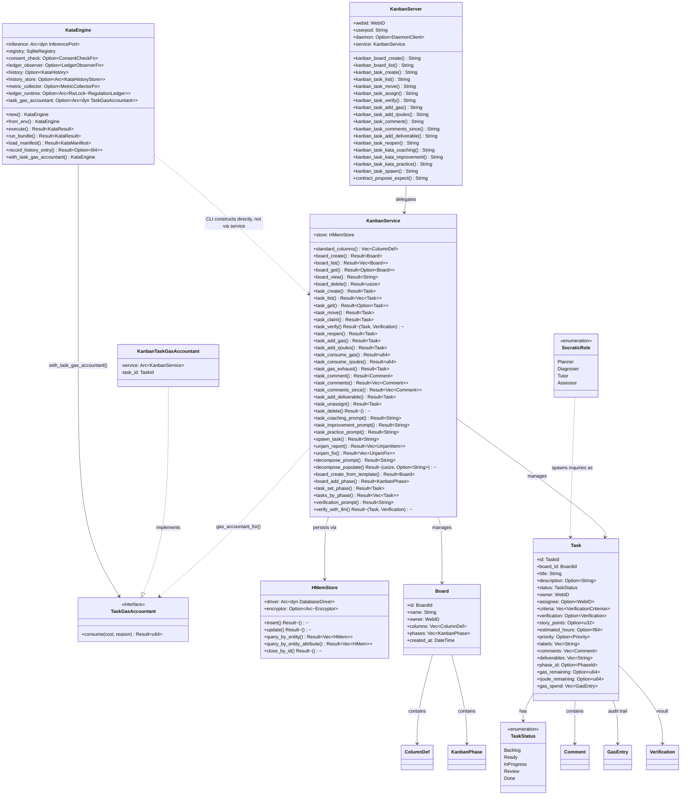

# MCP Server Registry

**Diataxis type:** Reference
**Status:** Current (v0.31.0)

Built-in MCP servers shipped with hKask. Each server is a thin surface over domain crates, following the standard bootstrap path (`hkask_mcp::bootstrap_mcp_server` → `hkask_mcp::run_server`).

## Server Catalog

| Server | Crate | Domain | Tools | Math Engine |
|--------|-------|--------|-------|-------------|
| Scenarios | `mcp-servers/hkask-mcp-scenarios` | Event-tree forecasting (Tetlock/Schwartz/Chermack) | 18 | `hkask-forecast` |
| [Companies](companies.md) | `mcp-servers/hkask-mcp-companies` | FIBO-anchored financial forecasting | 41 | `hkask-forecast` |
| CodeGraph | `mcp-servers/hkask-mcp-codegraph` | Code understanding (query, traverse, impact) | 10 | `hkask-mcp-codegraph` |
| Curator | `mcp-servers/hkask-mcp-curator` | Curator agent metacognition | — | — |
| Memory | `mcp-servers/hkask-mcp-memory` | Episodic and semantic memory | — | — |
| DocProc | `mcp-servers/hkask-mcp-docproc` | Document processing and QA generation | — | — |
| Filesystem | `mcp-servers/hkask-mcp-filesystem` | File access and shell operations (OCAP-sandboxed) | 7 | — |
| Kata Kanban | `mcp-servers/hkask-mcp-kata-kanban` | Toyota Kata task boards | 14 | `hkask-services-kata-kanban` |
| Media | `mcp-servers/hkask-mcp-media` | Fal.ai media generation | — | — |
| Replica | `mcp-servers/hkask-mcp-replica` | UserPod lifecycle | — | — |
| Research | `mcp-servers/hkask-mcp-research` | Web search, extraction, browsing, RSS feeds | 17 | `hkask-mcp-research` |
| [Skill](skill-server.md) | `mcp-servers/hkask-mcp-skill` | Skill registry access (list, execute) | 3 | — |
| Training | `mcp-servers/hkask-mcp-training` | LoRA training pipeline | — | — |
| Condenser | `mcp-servers/hkask-mcp-condenser` | Context condensation | — | — |

## Common Patterns

All servers follow these patterns:
:

1. **Bootstrap:** `hkask_mcp::bootstrap_mcp_server(name, target, host_env_var)` → returns `MCPBootstrap { userpod, daemon_client }`
2. **Struct:** `hkask_mcp::mcp_server!` macro generates the struct with `webid`, `userpod`, `daemon` fields plus domain fields
3. **Tool dispatch:** `execute_tool_semantic(self, tool_name, ontology, async { ... })` wraps each tool with Regulation span + daemon outcome recording
4. **Tool router:** `#[tool_handler(router = Self::...router())]` on the `ServerHandler` impl
5. **Error type:** `McpToolError` for tool-level errors, domain `Error` enums (via `thiserror`) for computation errors
6. **Governance:** OCAP is enforced at the dispatcher `GovernedTool` membrane (`DelegationToken` per call), not at the server. The server is the transport pipe; `shell_exec`-style tools are reachable only by agents holding the relevant capability token. See [`lib.rs` (`GovernedTool`)](../../../crates/hkask-pods/src/lib.rs).

## Testing standard

Every MCP server MUST include **tool-behavior contract tests** that invoke tools through their public `Parameters<T>` seam (e.g. `server.fs_read(Parameters(FsReadRequest { ... }))`), covering at minimum: the happy path, invalid input, boundary/edge cases, and error-specificity. Helper-seam-only tests (testing `sandbox_path`/services/infrastructure in isolation) are necessary but **not sufficient** — a helper-seam-only suite cannot catch tool-contract bugs (slice-index panics on bad input, canonicalize-on-non-existent, silent no-ops, error-swallowing), as the [filesystem review](filesystem.md) demonstrated with three shipped logic bugs that had zero `unwrap()` calls. The [`filesystem_contract.rs`](../../../mcp-servers/hkask-mcp-filesystem/tests/filesystem_contract.rs) and [`kanban_contract.rs`](../../../mcp-servers/hkask-mcp-kata-kanban/tests/kanban_contract.rs) suites are the exemplar patterns. See the fleet test-seam audit for the current coverage gap across all 16 servers.

## Cross-links

- [Skill MCP Server](skill-server.md) — Skill server architecture reference (3 tools, diagram)
- Research MCP Adversarial Review — code smell inventory for the research server
- Research MCP Adversarial Review (Follow-Up 2026-07-20) — 11 new findings: dead CapabilityContext, edit_tags feed-relabeling bug, missing transactions, stored SSRF, stub health checks; 7 follow-up items including panic-safe transactions, permissive SSRF for RSS, and circuit-breaker ADR
- [ADR-055: Per-Provider Circuit Breaker (Deferred)](../../architecture/ADRs/ADR-055-per-provider-circuit-breaker.md) — defers the circuit-breaker enhancement with rationale
- [Filesystem Server Reference](filesystem.md) — sandbox model, 7 tools, Regulation spans, current behavior and known limitations (DIAG-RF-003)
- Scenarios Adversarial Review — code smell inventory for the scenarios server
- [Companies MCP Server Reference](companies.md) — 41 tools, dual-provider routing, forecast store, portfolio ledger (DIAG-RF-004 inline)
- Companies MCP Code Review — adversarial code review of the companies server
- Companies Semantic Graph Audit — internal module dependency graph health
- [Scenario Forecasting Pipeline Diagram](scenarios.md) — scenarios tool flow (DIAG-RF-005 inline)
- [Superforecasting: Layered Model](../../explanation/forecasting-and-scenarios.md) — three-layer architecture
- [Architecture Patterns](../../explanation/architecture-patterns.md) — MCP dispatch sequence
- CodeGraph Adversarial Review — adversarial code review of the codegraph server (17 findings, all fixed)

## Kata-Kanban Server Architecture (DIAG-IC-017)

The `hkask-mcp-kata-kanban` MCP server (`KanbanServer`) is a thin tri-surface wrapper that delegates every tool call to `KanbanService`. The service owns an `HMemStore` (board/task persistence). Full kata execution is available through the CLI `kask kata start` command, which constructs a `KataEngine` directly. The kanban service exposes kata prompt generation (`task_coaching_prompt` / `task_improvement_prompt` / `task_practice_prompt`) for MCP/REPL surfaces.

The `--task <id>` flag on `kask kata start` binds a `TaskGasAccountant` to the engine, closing the per-task gas feedback loop: each inference call's actual token usage is deducted from the bound kanban task's `gas_remaining` budget via `task_consume_gas`.

<!-- DIAGRAM_ALIGNMENT
id: DIAG-IC-017
verified_date: 2026-07-20
verified_against: mcp-servers/hkask-mcp-kata-kanban/src/lib.rs:29-33 (KanbanServer struct — db field deleted), crates/hkask-services-kata-kanban/src/kanban/service_impl/service.rs:34-37 (KanbanService struct — kata_bridge field deleted, pod_manager removed post-pivot), crates/hkask-services-kata-kanban/src/kata/mod.rs:76-94 (KataEngine struct), crates/hkask-storage/src/hmem.rs:134-138 (HMemStore struct), crates/hkask-services-kata-kanban/src/kanban/types/task.rs:9-55 (Task struct), crates/hkask-services-kata-kanban/src/kanban/types/status.rs:16-27 (TaskStatus enum), crates/hkask-services-kata-kanban/src/kanban/socratic.rs:265-270 (SocraticRole enum)
status: VERIFIED (v2 — pod_manager and ActivePods fields removed post-pivot; kanban is human-task coordination)
-->