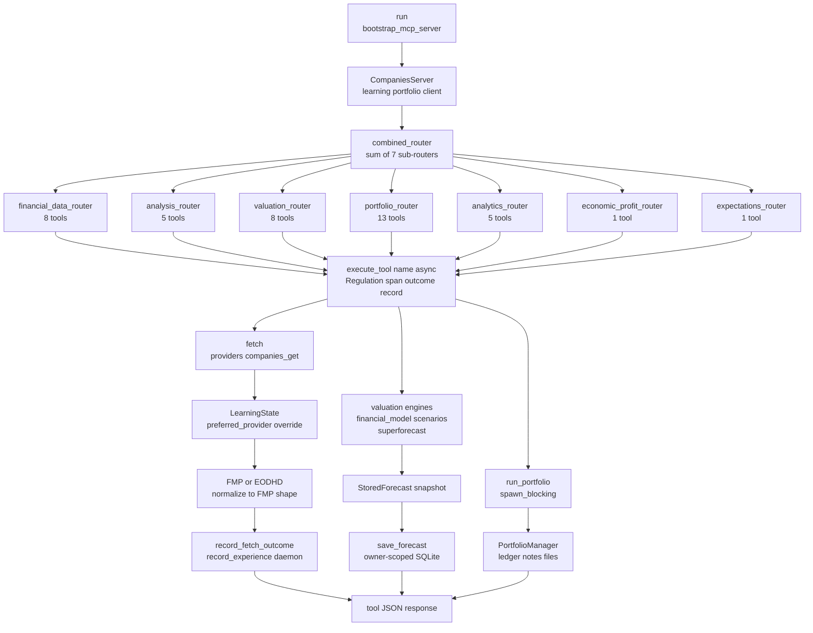

# Companies MCP Server — Reference

**Diataxis type:** Reference · **Crate:** `mcp-servers/hkask-mcp-companies` · **Server id:** `companies`

Company-finance MCP server for provider-routed market data, fundamental analysis, valuation, research retrieval, and local portfolio-ledger operations. Tools are provider-agnostic: each financial-data tool routes to FMP or EODHD based on symbol characteristics, with automatic fallback and EODHD normalization to FMP format. This page documents the current behavior of the shipping code and the standing properties of its design. For task-oriented procedures, see the [Companies User Guide](../../how-to/companies-mcp.md).

## Architecture

| Component | Role |
|-----------|------|
| `CompaniesServer` | Server struct: `webid`, `userpod`, `daemon`, `client`, FMP/EODHD keys, optional research keys, `PortfolioManager`, `LearningState` (Arc<Mutex>), `FermiDefaults` |
| `combined_router` | Sums seven domain sub-routers: `financial_data_router` + `analysis_router` + `portfolio_router` + `analytics_router` + `valuation_router` + `economic_profit_router` + `expectations_router` |
| `execute_tool` | Framework wrapper: Regulation tool span (`reg.tool.companies.*`) + daemon outcome recording |
| `fetch` | Provider-agnostic data access; clones `LearningState` and delegates to `providers::companies_get` |
| `LearningState` | `src/learning.rs` — Beta(α+1, β+1) conjugate prior per (symbol, provider); temporal price snapshots for staleness detection; `preferred_provider` override when a provider is flaky. Chronic-staleness threshold configurable via `with_staleness_days` or `HKASK_CHRONIC_STALENESS_DAYS` |
| `PortfolioManager` | SQLite-backed ledger, notes, file attachments, and durable forecast store; owner-scoped by `webid` |
| `record_experience` | Fire-and-forget daemon `store_experience` for every tool outcome (narrative memory, salience 0.85) |

Two Regulation emission paths run per tool call: the framework-level `execute_tool` span (tool name + outcome) and the server-level experience recording (daemon narrative). Provider routing additionally emits `reg.tool.companies.provider.*` spans via `providers::emit_provider_cns`.

## Tool routing and dispatch flow

The diagram traces the dispatch seam shared by all 41 tools: `combined_router` sums seven sub-routers, every tool funnels through `execute_tool`, then branches into one of three sinks — provider-routed financial data, valuation engines that persist `StoredForecast` snapshots, or `PortfolioManager` ledger operations on `spawn_blocking`. Verified against `mcp-servers/hkask-mcp-companies/src/lib.rs` and `src/tools/mod.rs`.



<!-- DIAGRAM_ALIGNMENT
id: DIAG-RF-004
verified_date: 2026-07-17
verified_against: mcp-servers/hkask-mcp-companies/src/lib.rs:499-509 (combined_router); mcp-servers/hkask-mcp-companies/src/lib.rs:368-495 (fetch, save_forecast, record_experience); mcp-servers/hkask-mcp-companies/src/tools/mod.rs:1-8; mcp-servers/hkask-mcp-companies/src/providers.rs:111-198; mcp-servers/hkask-mcp-companies/src/portfolio.rs:290-340
status: VERIFIED
-->

## Tools (41)

### Financial data (8)

| Tool | Description | Provider routing |
|------|-------------|------------------|
| `company_profile` | Company profile by symbol | FMP primary; EODHD for international symbols |
| `stock_quote` | Real-time stock quote | FMP primary; EODHD fallback |
| `income_statement` | Income statements (default limit 5) | FMP primary; EODHD normalized |
| `balance_sheet` | Balance sheet statements (default limit 5) | FMP primary; EODHD normalized |
| `cash_flow_statement` | Cash flow statements (default limit 5) | FMP primary; EODHD normalized |
| `key_metrics` | Key financial metrics (default limit 5) | FMP primary; EODHD approximated for missing fields |
| `historical_price` | Historical price data | FMP primary; EODHD fallback |
| `symbol_search` | Symbol search | FMP and EODHD search endpoints |

### Analysis and research (5)

| Tool | Description |
|------|-------------|
| `moat_check` | Competitive moat: gross-margin stability + working-capital market-power signals |
| `management_scorecard` | CEO capital allocation scorecard (ROIC vs invested capital) |
| `working_capital_cycle` | Days payable, days sales outstanding, cash-conversion cycle |
| `company_screener` | Screen companies from natural-language criteria using the FMP stock screener (bypasses `fetch`) |
| `research_search` | Search Exa, Tavily, and Brave for company-specific fundamental-research claims (bypasses `fetch`) |

### Portfolio analytics and DCF (5)

| Tool | Description |
|------|-------------|
| `portfolio_attribution` | Rank position contributions to portfolio movement |
| `portfolio_characteristics` | Weighted-average portfolio valuation, profitability, leverage, growth, and composition |
| `dcf_valuation` | Two-stage DCF (Gordon-growth terminal); returns intrinsic value and forecast ID |
| `reverse_dcf` | Solve for the revenue growth implied by the current market price |
| `scenario_analysis` | Four growth-by-margin scenarios; returns intrinsic-value range |

### Valuation and forecasting (8)

| Tool | Description |
|------|-------------|
| `comparable_analysis` | Peer valuation multiples (P/E, P/B, P/S, EV/EBITDA) with DCF overlay |
| `sensitivity_analysis` | Rank DCF inputs by their effect on intrinsic value |
| `monte_carlo_dcf` | N-simulation Monte Carlo; returns intrinsic-value distribution |
| `calibrate_forecast` | Calibrate growth and margin estimates into scenario-weighted intrinsic value (Fermi + Bayesian) |
| `forecast_get` | Retrieve one durable forecast and its recorded outcomes for the authenticated owner |
| `forecast_list` | List an authenticated owner's durable forecasts for a symbol |
| `forecast_record` | Record a forecast outcome, Brier scores, and optional return-gap decomposition |
| `result_feedback` | Rate a previous tool result (1–5); feeds the `LearningState` Beta prior |

### Economic-profit and expectations analysis (2)

| Tool | Description |
|------|-------------|
| `ep_valuation` | Value a company from book value plus discounted future economic profit with competitive fade |
| `expectations_gap` | Compare market-implied growth with management guidance and a supplied estimate |

### Portfolio ledger, notes, and files (13)

| Tool | Description |
|------|-------------|
| `portfolio_list` | List portfolios for the authenticated owner |
| `portfolio_delete` | Delete a portfolio and all its data |
| `ledger_import` | Import CSV or JSON transactions into a portfolio ledger (auto-creates portfolio) |
| `ledger_export` | Export a portfolio ledger as CSV or JSON |
| `transaction_note_append` | Append a note to an existing transaction |
| `portfolio_comparison` | Compare two portfolios' positions, overlap, and unique symbols |
| `portfolio_returns` | Time-weighted and money-weighted returns for a date range |
| `note_add` | Add a dated note to a company or security |
| `note_list` | List notes for a symbol, optionally filtered by date range or tags |
| `note_delete` | Delete a note by ID |
| `file_attach` | Attach a base64-encoded file to a company or security |
| `file_list` | List a portfolio's attached files for a symbol |
| `file_delete` | Delete an attached file by ID |

## Configuration

| Variable | Required | Description |
|----------|----------|-------------|
| `HKASK_FMP_API_KEY` | Yes | Financial Modeling Prep API key |
| `HKASK_EODHD_API_KEY` | Yes | EOD Historical Data API key |
| `HKASK_EXA_API_KEY` | No | Exa research-search provider key |
| `HKASK_TAVILY_API_KEY` | No | Tavily research-search provider key |
| `HKASK_BRAVE_API_KEY` | No | Brave research-search provider key |
| `HKASK_FERMI_DEFAULTS` | No | JSON object with `growth` and `margin` Fermi-question arrays |
| `HKASK_CHRONIC_STALENESS_DAYS` | No | Chronic-staleness threshold in days for the `LearningState` provider-learning loop (default `90`); a provider whose latest filing is older than this is bypassed by `preferred_provider` |

Example Fermi defaults:

```bash
export HKASK_FERMI_DEFAULTS='{"growth":[{"estimate":0.70,"confidence":0.8}],"margin":[{"estimate":0.30,"confidence":0.7}]}'
```

## Behavioral boundaries

- **Provider routing.** Financial-data tools route eligible symbol lookups between FMP and EODHD. `is_international_symbol` (exchange-qualified symbols such as `VOD.L`, `BMW.DE`) selects EODHD as primary. `company_screener` is FMP-specific; `research_search` uses its own research providers and bypasses `fetch`.
- **DCF projection.** The DCF is a two-stage model using a Gordon-growth terminal value. It models revenue, COGS, gross profit, D&A, EBIT, tax, NOPAT, capex, net working-capital change, and free cash flow. It does not model SG&A as a separate line item, an exit-multiple terminal method, or other non-operating assets in the equity bridge.
- **Scenario matrix.** `scenario_analysis` runs a fixed revenue-growth × gross-margin matrix (Schwartz 2×2 framing).
- **Forecast persistence.** DCF and calibrated forecasts persist as owner-scoped structured JSON snapshots. `forecast_get` retrieves one record, `forecast_list` returns a symbol's history, and `revision_of` links a same-symbol revision. `forecast_record` appends outcomes and reloads the stored snapshot for decomposition. The `revision_of` chain has no enforced depth limit — each revision references its predecessor by id, and revisions require the same owner and same symbol (`portfolio.rs` `validate_forecast_revision`). Consumers should treat the chain as an unbounded linked list and cap traversal at the application layer if a bound is required.
- **Provider learning.** `LearningState` tracks a Beta(α+1, β+1) posterior per (symbol, provider). Scores 4–5 from `result_feedback` count as successes; 1–3 count as failures. A provider is flaky when P(success) < 0.70 with at least 5 observations, in which case `preferred_provider` overrides the default routing. Temporal snapshots flag chronically stale data older than the configurable threshold (default 90 days, override via `HKASK_CHRONIC_STALENESS_DAYS` or `LearningState::with_staleness_days`).
- **Beta cold-start.** A new (symbol, provider) pair starts with the Beta(1, 1) uniform prior — α=1, β=1, zero observations. With zero observations `success_probability` returns `None` and `is_flaky` returns `false`, so routing never overrides the default on cold start. The prior is symmetric: the first scored observation moves α or β by one, and at least `FLAKY_MIN_OBSERVATIONS` (5) scored observations are required before the flaky classification can fire.
- **FIBO anchoring.** Some derived responses include a `fibo` map. Raw provider payloads are returned without a FIBO mapping, and emitted identifiers are compact strings rather than a JSON-LD context. Balance-sheet items use `fibo-fbc-pas-fpas`, ratios use `fibo-fbc-fct-ra`, securities use `fibo-sec-sec-ast`, indices use `fibo-ind-ind-ind`.
- **Treasury stock.** hKask non-standard adjustment: treasury stock is treated as committed capital (not a deduction from equity).

## Trust and ownership model

- **Owner scoping.** `PortfolioManager` is constructed with the authenticated `webid`. Ledger, notes, file attachments, and durable forecasts are namespaced by owner; cross-owner access is rejected at the data layer (`portfolio.rs` owner-isolation tests).
- **Local persistence.** The portfolio ledger is a local SQLite database per owner. No portfolio data leaves the host; the server is the sole reader and writer.
- **Import and attachment limits.** `ledger_import` rejects requests above `MAX_IMPORT_REQUEST_BYTES` or more than `MAX_IMPORT_TRANSACTION_COUNT` transactions. `file_attach` rejects encoded payloads above `MAX_ENCODED_ATTACHMENT_BYTES` and decoded payloads above `MAX_DECODED_ATTACHMENT_BYTES`.
- **Governance is at the dispatcher membrane.** OCAP is enforced by the `GovernedTool` membrane in `crates/hkask-mcp/src/dispatch.rs`, which verifies a `DelegationToken` per call before the request reaches this server. The companies server is the transport pipe; it does not re-check capabilities per call.
- **Experience recording is fire-and-forget.** `record_experience` spawns a tokio task that calls `daemon.store_experience` at salience 0.85. A daemon failure is logged at `warn` and does not fail the tool call.

## Regulation observability

| Span | When emitted |
|------|--------------|
| `reg.tool.companies.<tool>` | Every tool call via `execute_tool` (success and error paths) |
| `reg.tool.companies.provider.<provider>` | Provider selection and outcome via `providers::emit_provider_cns` |
| `reg.mcp.companies.memory` | Daemon experience store result (`debug` on success, `warn` on failure) |

## Quick start

```bash
kask mcp start companies
```

The server requires `HKASK_FMP_API_KEY` and `HKASK_EODHD_API_KEY` credentials at launch; optional research keys enable `research_search`.

## Validation

```bash
cargo test -p hkask-mcp-companies
```

The suite covers provider-error handling, EODHD normalization, valuation request validation, portfolio owner isolation, import and attachment limits, forecast snapshot reconstruction, the Gordon-growth contract, attribution weight and contribution math, and the `LearningState` flaky-provider override loop. End-to-end MCP wire-format coverage remains future work.

## Cross-links

- [MCP Server Registry](README.md) — catalog of all 15 built-in servers
- [Companies User Guide](../../how-to/companies-mcp.md) — task-oriented procedures for valuation, forecasting, and portfolio operations
- [Companies Semantic Graph Audit](../../status/companies-mcp-semantic-graph-audit-2026-07-17.md) — internal module dependency graph health
- [Companies MCP Code Review](../../status/companies-mcp-code-review-2026-07-15.md) — adversarial code review of the companies server
- [Diagram Index](../../DIAGRAMS_INDEX.md) — DIAG-RF-004 registration