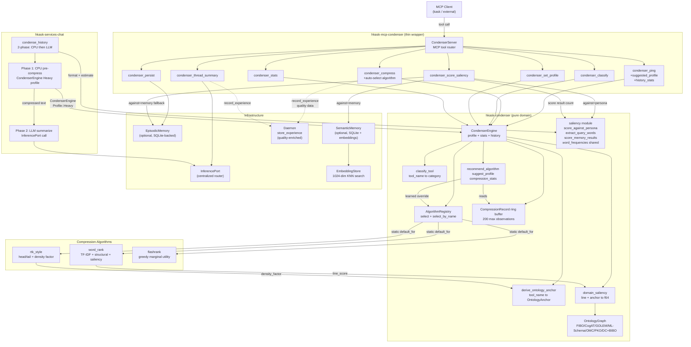

# Condenser MCP Server Reference

**Crate:** `mcp-servers/hkask-mcp-condenser` (MCP wrapper) + `crates/hkask-condenser` (pure domain)
**Tools:** 7 — `condenser_ping`, `condenser_compress`, `condenser_classify`, `condenser_set_profile`, `condenser_stats`, `condenser_persist`, `condenser_thread_summary`, `condenser_score_saliency`
**Auto-start:** Yes (one of the 12 core servers auto-started at REPL boot; not in `CORE_EXCLUDED`)

## Pipeline Architecture (DIAG-RF-006)

The `CondenserServer` (thin MCP wrapper) delegates to `CondenserEngine` (pure domain logic), which dispatches to one of three compression algorithms based on the classified `ContextCategory`. The engine records each compression in a bounded history ring buffer; after 10+ observations per category, it auto-selects the best-performing algorithm (learning). The ChatService's `condense_history` uses two-phase condensation: CPU pre-compress (Phase 1) then LLM summarize (Phase 2).

<!-- DIAGRAM_ALIGNMENT
id: DIAG-RF-006
verified_date: 2026-07-21
verified_against: mcp-servers/hkask-mcp-condenser/src/lib.rs (CondenserServer tool router), crates/hkask-condenser/src/engine.rs (CondenserEngine), crates/hkask-condenser/src/algorithms.rs (AlgorithmRegistry + 3 algorithms), crates/hkask-services-chat/src/chat/condenser.rs (condense_history 2-phase)
status: VERIFIED
-->

## Key paths

- **Compress:** `condenser_compress` → `CondenserEngine` → `AlgorithmRegistry::select` (auto-select after 10+ observations per category) → algorithm (`rtk_style` / `word_rank` / `flashrank`) → `CompressionRecord` appended to ring buffer (200 max)
- **Classify:** `condenser_classify` → `classify_tool` maps tool name → `ContextCategory`
- **Saliency:** `condenser_score_saliency` → `domain_saliency` (line + `OntologyAnchor`) → against persona / memory / memory-fallback
- **Auto-condense (ChatService):** `condense_history` → Phase 1 (CPU pre-compress via `CondenserEngine` Heavy profile) → Phase 2 (LLM summarize via `InferencePort`)
- **Learning loop:** After each compression, `record_experience` is called via the daemon with quality-enriched data; `recommend_algorithm` / `suggest_profile` read the ring buffer to override the static `default_for` selection

## Cross-links

- [MCP Server Registry](README.md) — all 16 built-in MCP servers
- [API Reference: hkask-condenser](../api-reference.md) — full module and type listing
- [Architecture Patterns](../../explanation/architecture-patterns.md) — MCP bootstrap and tool dispatch sequence
- [Diagram Index](../../DIAGRAMS_INDEX.md) — DIAG-RF-006 registration
