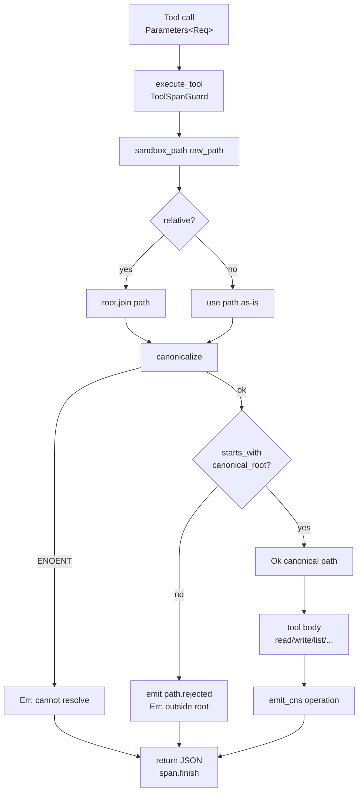

# Filesystem MCP Server — Reference

**Diataxis type:** Reference · **Crate:** `mcp-servers/hkask-mcp-filesystem` · **Server id:** `filesystem`

OCAP-governed filesystem and shell access for AI agents. All file I/O is
sandboxed to a configured `project_root`; paths are canonicalized and verified
against the root before any read or write. This page documents the *current*
behavior of the shipping code, including known limitations that follow from
the present implementation.

## Architecture

| Component | Role |
|-----------|------|
| `FileSystemServer` | Server struct (`mcp_server!` macro): `webid`, `replicant`, `daemon`, `project_root`, `capability_tier` |
| `sandbox_path` | Security boundary: resolve → canonicalize → containment check |
| `execute_tool` | Framework wrapper: CNS tool span (`cns.tool.filesystem.*`) + daemon outcome recording |
| `emit_cns` | Operation-level span emission (`file.read`, `file.written`, …) |

Two distinct CNS emission paths run per tool call: the framework-level
`execute_tool` span (tool name + outcome, via `ToolSpanGuard`) and the
server-level `emit_cns` span (operation verb, via `CnsSpan::Tool`). Both target
`cns.tool.filesystem.*`; the operation span carries the verb.

## Sandbox path resolution and tool dispatch

The diagram below traces `sandbox_path` (the security boundary) and the
common dispatch flow shared by all seven tools. It is verified against
`mcp-servers/hkask-mcp-filesystem/src/lib.rs`.



<!-- DIAGRAM_ALIGNMENT
id: DIAG-RF-003
verified_date: 2026-07-17
verified_against: mcp-servers/hkask-mcp-filesystem/src/lib.rs:55-77 (sandbox_path); mcp-servers/hkask-mcp-filesystem/src/lib.rs:82-127 (fs_read dispatch); crates/hkask-mcp/src/server/tool_span.rs:246-259 (execute_tool)
status: VERIFIED
-->

## Tools (7)

| Tool | Description | CNS operation span |
|------|-------------|--------------------|
| `fs_read` | Read file contents with optional 1-based line ranges + stats | `file.read` |
| `fs_write` | Create or overwrite a file; creates parent dirs if needed | `file.written` |
| `fs_edit` | Apply ordered first-match text replacements | `file.written` |
| `fs_list` | List directory entries (name, path, type, size) | `file.read` |
| `fs_search` | Regex search across files up to `max_depth` (default 3) | `file.read` |
| `fs_delete` | Delete a file or empty directory | `file.deleted` |
| `shell_exec` | `sh -c` command with timeout + output guard | `command.completed` / `command.failed` |

## CNS observability

| Span | When emitted |
|------|--------------|
| `cns.tool.filesystem.file.read` | `fs_read`, `fs_list`, `fs_search` (success path) |
| `cns.tool.filesystem.file.written` | `fs_write`, `fs_edit` (success path) |
| `cns.tool.filesystem.file.deleted` | `fs_delete` (success path) |
| `cns.tool.filesystem.command.completed` | `shell_exec` exit code 0 |
| `cns.tool.filesystem.command.failed` | `shell_exec` non-zero exit or timeout |
| `cns.tool.filesystem.path.rejected` | Path traversal / out-of-root blocked |


## Security model

- **File I/O sandbox.** All file tools resolve `raw_path` against
  `project_root`, canonicalize, and reject paths whose canonical form does not
  start with the canonical root. Path traversal (`../`) is rejected at the
  sandbox boundary.
- **Shell `cwd` sandbox.** `shell_exec` canonicalizes `cwd` through
  `sandbox_path` when provided, defaulting to `project_root`.
- **Shell command string is NOT sandboxed.** The `command` argument is passed
  to `sh -c` without restriction; an agent may `cd` to or reference absolute
  paths outside `project_root` from within the command. The sandbox governs
  only the starting working directory. Callers requiring a confined shell
  must enforce that at the capability/consent layer, not at this tool.

## Security model notes

The following are standing properties of the sandbox design (not defects):

- **TOCTOU boundary.** `sandbox_path` canonicalizes at call time; a path
  component could change between the check and the file operation. Acceptable
  for a single-user agent tool; flagged here for security reviewers who need
  atomic containment.
- **Shell command string is not confined.** Only `cwd` is sandboxed; the
  `command` argument may reference paths outside `project_root`. See
  [Security model](#security-model) above.
- **Operation spans are success-path only.** `emit_cns` fires the operation
  verb (`file.read`, …) on the success path of each tool. The framework
  `execute_tool` span records outcome (`ok`/`error`) for all calls, so failed
  calls remain observable at the tool level even when the operation verb is
  not emitted.

The tool contracts are verified by the contract test suite
(`tests/filesystem_contract.rs`), which exercises both `sandbox_path`
invariants and tool behavior (create-new-file, parent-dir creation, range
inversion rejection, multibyte truncation safety, stderr truncation, skipped-file
reporting, and delete error specificity) through the public tool methods.

## Quick start

```bash
kask mcp start filesystem
```

## Cross-links

- [MCP Server Registry](README.md) — catalog of all 15 built-in servers
- [CNS Span Registry](../cns-spans.md) — `CnsSpan::Tool` and `ToolSubsystem::Filesystem`
- [Architecture Patterns](../../explanation/architecture-patterns.md) — MCP dispatch sequence
- [Diagram Index](../../DIAGRAMS_INDEX.md) — DIAG-RF-003 registration