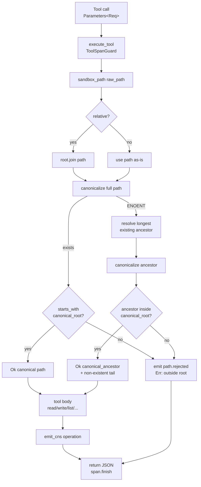

# Filesystem MCP Server — Reference

**Diataxis type:** Reference · **Crate:** `mcp-servers/hkask-mcp-filesystem` · **Server id:** `filesystem`

OCAP-governed filesystem and shell access for AI agents. All file I/O is
sandboxed to a configured `project_root`; paths are canonicalized and verified
against the root before any read or write. This page documents the current
behavior of the shipping code and the standing properties of its sandbox design.

## Architecture

| Component | Role |
|-----------|------|
| `FileSystemServer` | Server struct (`mcp_server!` macro): `webid`, `userpod`, `daemon`, `project_root`, `capability_tier` |
| `sandbox_path` | Security boundary: resolve → canonicalize → containment check |
| `execute_tool` | Framework wrapper: CNS tool span (`cns.tool.filesystem.*`) + daemon outcome recording |
| `emit_cns` | Operation-level span emission (`file.read`, `file.written`, …) |

Two distinct CNS emission paths run per tool call: the framework-level
`execute_tool` span (tool name + outcome, via `ToolSpanGuard`) and the
server-level `emit_cns` span (operation verb, via `CnsSpan::Tool`). Both target
`cns.tool.filesystem.*`; the operation span carries the verb.

## Sandbox path resolution and tool dispatch

The diagram below traces `sandbox_path` (the security boundary) and the
common dispatch flow shared by all seven tools. It is verified against
`mcp-servers/hkask-mcp-filesystem/src/lib.rs`.



<!-- DIAGRAM_ALIGNMENT
id: DIAG-RF-003
verified_date: 2026-07-17
verified_against: mcp-servers/hkask-mcp-filesystem/src/lib.rs:55-109 (sandbox_path two-phase resolution); crates/hkask-mcp/src/server/tool_span.rs:246-259 (execute_tool)
status: VERIFIED
-->

## Tools (7)

| Tool | Description | CNS operation span |
|------|-------------|--------------------|
| `fs_read` | Read file contents with 1-based line ranges + stats; start-only and end-only ranges honored; zero and inverted ranges rejected. Full reads preserve the file's bytes; partial reads normalize line endings to LF | `file.read` |
| `fs_write` | Create or overwrite a file; creates parent dirs if needed (new files supported) — **destructive: consent-gated** | `file.written` |
| `fs_edit` | Apply ordered first-match text replacements sequentially (later edits see earlier edits' output); `file.written` emitted only when an edit matched — **destructive: consent-gated** | `file.written` (on write) |
| `fs_list` | List directory entries (name, path, type, size) | `file.read` |
| `fs_search` | Regex search across files up to `max_depth` (default 3); rejects non-directory roots; oversized/unreadable files reported in `files_skipped` | `file.read` |
| `fs_delete` | Delete a file or empty directory; returns the real OS error on failure — **destructive: consent-gated** | `file.deleted` |
| `shell_exec` | `sh -c` command with timeout + output guard; stdout/stderr truncated at a UTF-8 char boundary (capped at 10 MiB); timed-out commands are killed (`kill_on_drop`) — **destructive: consent-gated** | `command.completed` / `command.failed` |

## CNS observability

| Span | When emitted |
|------|--------------|
| `cns.tool.filesystem.file.read` | `fs_read`, `fs_list`, `fs_search` (success path) |
| `cns.tool.filesystem.file.written` | `fs_write` (success path); `fs_edit` only when at least one edit matched |
| `cns.tool.filesystem.file.deleted` | `fs_delete` (success path) |
| `cns.tool.filesystem.command.completed` | `shell_exec` exit code 0 |
| `cns.tool.filesystem.command.failed` | `shell_exec` non-zero exit or timeout |
| `cns.tool.filesystem.path.rejected` | Path traversal / out-of-root blocked |


## Security model

- **Destructive consent gate (P2 — Affirmative Consent).** The destructive
  tools — `fs_write`, `fs_edit`, `fs_delete`, `shell_exec` — are **denied by
  default** and return `permission_denied` unless the server was launched with
  `HKASK_FILESYSTEM_DESTRUCTIVE_CONSENT=1` (truthy: `1` or `true`). Read tools
  (`fs_read`, `fs_list`, `fs_search`) are **ungated** — reading your own
  workspace is sovereign by default (P1). Consent is an opt-in flag at launch,
  revocable by relaunching without the flag; denials are auditable via CNS.
  This is the **filesystem-scoped (i)** enforcement. Spawned subagents are
  separate processes; they do **not** inherit destructive authority **provided
  the launcher does not propagate the flag to them — this is a launcher
  convention, not enforced by this server**.
- **File I/O sandbox.** All file tools resolve `raw_path` against
  `project_root`, canonicalize, and reject paths whose canonical form does not
  start with the canonical root. Path traversal (`../`) is rejected at the
  sandbox boundary. Empty paths are rejected at the boundary before resolution.
- **Shell `cwd` sandbox.** `shell_exec` canonicalizes `cwd` through
  `sandbox_path` when provided, defaulting to `project_root`.
- **Shell command string is not confined.** The `command` argument is passed
  to `sh -c` without restriction; an agent may `cd` to or reference absolute
  paths outside `project_root` from within the command. This is **consistent
  with OCAP, not a violation**: a capability token grants the authority to run
  a shell, and the holder of that capability is the trusted actor who
  exercises it. The safeguard is consent-gated capability granting (Magna
  Carta P2), not command-string filtering at this tool.
- **Governance is at the dispatcher membrane, not the server.** OCAP is
  enforced by the `GovernedTool` membrane in `crates/hkask-mcp/src/dispatch.rs`,
  which verifies a `DelegationToken` per call before the request reaches this
  server. The filesystem server is the transport pipe; it does not re-check
  capabilities per call. This server is also **excluded from the headless HTTP
  API** (`API_EXCLUDED` in `crates/hkask-cli/src/commands/serve.rs`), so it is
  reachable only via the local stdio path by an agent that already holds a
  filesystem capability token.

## Security model notes

The following are standing properties of the sandbox design (not defects):

- **TOCTOU boundary (single trusting workspace).** `sandbox_path` canonicalizes
  at call time; a path component could change between the check and the file
  operation. This server runs one process per workspace (`project_root` from
  `HKASK_PROJECT_ROOT` at startup) shared by the agents in that workspace. The
  TOCTOU is low-risk under hKask's model — agents in a workspace share one
  user's sovereignty and cooperate — but it is exploitable if agents within a
  workspace are ever mutually adversarial (a symlink swap races the check).
  Flagged here so a future multi-tenant workspace design is not misled.
- **Operation spans are success-path only.** `emit_cns` fires the operation
  verb (`file.read`, …) on the success path of each tool. The framework
  `execute_tool` span records outcome (`ok`/`error`) for all calls, so failed
  calls remain observable at the tool level even when the operation verb is
  not emitted. `fs_edit` additionally suppresses `file.written` when zero edits
  matched (no write occurred).
- **Timed-out shell commands are killed.** `shell_exec` sets `kill_on_drop` so a
  command that exceeds `timeout_ms` is reaped when the wait future is dropped,
  rather than being orphaned to run in the background. The kill uses `SIGKILL`
  (no graceful shutdown).
- **Blocking I/O is offloaded.** `fs_search` runs its `walkdir` + file reads on
  a `spawn_blocking` thread so the async runtime worker is not stalled; the
  1 MiB per-file cap bounds memory on oversized files.
- **Possible generalization (not implemented).** The filesystem-scoped consent
  gate above is the **bounded (i)** enforcement. A more general path — gating
  write/execute at the `GovernedTool` membrane via per-tool blast-radius
  declarations (read → `:read`, write → `:write`, `shell_exec` → `:execute`, via
  the action hierarchy `Execute ≥ Write ≥ Read`) — was considered and **not
  built**; it would require reconciling the pod's single `capability_token` model
  across tool domains (a multi-crate provisioning change in `ChatService` /
  `PodFactory`) plus an in-chat consent UX. Recorded here so a future explorer
  knows it was evaluated and deferred, not forgotten.

The tool contracts are verified by the contract test suite
(`tests/filesystem_contract.rs`), which exercises both `sandbox_path`
invariants (traversal rejection, empty-path rejection, non-existent-leaf
resolution) and tool behavior (create-new-file, parent-dir creation, full and
partial line ranges, zero/inverted-range rejection, multibyte + stderr
truncation, output cap, timeout reaping, non-directory search-root rejection,
skipped-file reporting, no-op edit, delete error specificity, and the
destructive-consent gate) through the public tool methods.

## Quick start

```bash
kask mcp start filesystem
```

## Cross-links

- [MCP Server Registry](README.md) — catalog of all 15 built-in servers
- [CNS Span Registry](../cns-spans.md) — `CnsSpan::Tool` and `ToolSubsystem::Filesystem`
- [Architecture Patterns](../../explanation/architecture-patterns.md) — MCP dispatch sequence
- [Diagram Index](../../DIAGRAMS_INDEX.md) — DIAG-RF-003 registration