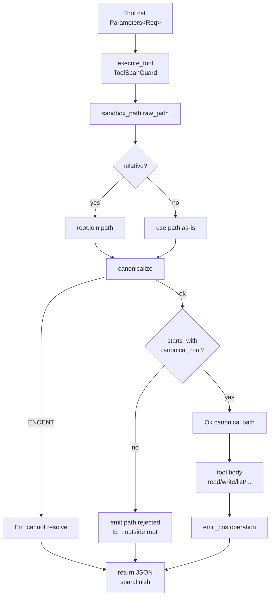

# Filesystem MCP Server — Reference

**Diataxis type:** Reference · **Crate:** `mcp-servers/hkask-mcp-filesystem` · **Server id:** `filesystem`

OCAP-governed filesystem and shell access for AI agents. All file I/O is
sandboxed to a configured `project_root`; paths are canonicalized and verified
against the root before any read or write. This page documents the *current*
behavior of the shipping code, including known limitations that follow from
the present implementation.

## Architecture

| Component | Role |
|-----------|------|
| `FileSystemServer` | Server struct (`mcp_server!` macro): `webid`, `replicant`, `daemon`, `project_root`, `capability_tier` |
| `sandbox_path` | Security boundary: resolve → canonicalize → containment check |
| `execute_tool` | Framework wrapper: CNS tool span (`cns.tool.filesystem.*`) + daemon outcome recording |
| `emit_cns` | Operation-level span emission (`file.read`, `file.written`, …) |

Two distinct CNS emission paths run per tool call: the framework-level
`execute_tool` span (tool name + outcome, via `ToolSpanGuard`) and the
server-level `emit_cns` span (operation verb, via `CnsSpan::Tool`). Both target
`cns.tool.filesystem.*`; the operation span carries the verb.

## Sandbox path resolution and tool dispatch

The diagram below traces `sandbox_path` (the security boundary) and the
common dispatch flow shared by all seven tools. It is verified against
`mcp-servers/hkask-mcp-filesystem/src/lib.rs`.



<!-- DIAGRAM_ALIGNMENT
id: DIAG-RF-003
verified_date: 2026-07-17
verified_against: mcp-servers/hkask-mcp-filesystem/src/lib.rs:55-77 (sandbox_path); mcp-servers/hkask-mcp-filesystem/src/lib.rs:82-127 (fs_read dispatch); crates/hkask-mcp/src/server/tool_span.rs:246-259 (execute_tool)
status: VERIFIED
-->

## Tools (7)

| Tool | Description | CNS operation span |
|------|-------------|--------------------|
| `fs_read` | Read file contents with optional 1-based line ranges + stats | `file.read` |
| `fs_write` | Create or overwrite a file; creates parent dirs if needed | `file.written` |
| `fs_edit` | Apply ordered first-match text replacements | `file.written` |
| `fs_list` | List directory entries (name, path, type, size) | `file.read` |
| `fs_search` | Regex search across files up to `max_depth` (default 3) | `file.read` |
| `fs_delete` | Delete a file or empty directory | `file.deleted` |
| `shell_exec` | `sh -c` command with timeout + output guard | `command.completed` / `command.failed` |

## CNS observability

| Span | When emitted |
|------|--------------|
| `cns.tool.filesystem.file.read` | `fs_read`, `fs_list`, `fs_search` (success path) |
| `cns.tool.filesystem.file.written` | `fs_write`, `fs_edit` (success path) |
| `cns.tool.filesystem.file.deleted` | `fs_delete` (success path) |
| `cns.tool.filesystem.command.completed` | `shell_exec` exit code 0 |
| `cns.tool.filesystem.command.failed` | `shell_exec` non-zero exit or timeout |
| `cns.tool.filesystem.path.rejected` | Path traversal / out-of-root blocked |

> **Note:** Operation spans are emitted on the *success* path of each tool.
> The framework `execute_tool` span records outcome (`ok`/`error`) for all
> calls, so failed calls are still observable at the tool level even when the
> operation verb is not emitted.

## Security model

- **File I/O sandbox.** All file tools resolve `raw_path` against
  `project_root`, canonicalize, and reject paths whose canonical form does not
  start with the canonical root. Path traversal (`../`) is rejected at the
  sandbox boundary.
- **Shell `cwd` sandbox.** `shell_exec` canonicalizes `cwd` through
  `sandbox_path` when provided, defaulting to `project_root`.
- **Shell command string is NOT sandboxed.** The `command` argument is passed
  to `sh -c` without restriction; an agent may `cd` to or reference absolute
  paths outside `project_root` from within the command. The sandbox governs
  only the starting working directory. Callers requiring a confined shell
  must enforce that at the capability/consent layer, not at this tool.

## Current behavior and known limitations

The following are properties of the code as of v0.31.0 (verified by
reproduction). They are recorded here so the documentation reflects the
current status of the code rather than its intended contract.

| # | Tool | Current behavior | Contract says |
|---|------|------------------|---------------|
| L1 | `fs_write` | `sandbox_path` canonicalizes the full target path, which fails with `ENOENT` when the file does not yet exist. **Creating a new file therefore fails** with "Cannot resolve path … No such file or directory" before parent directories are created. Overwriting an existing file works. | "Create or overwrite a file. Creates parent directories if needed." |
| L2 | `fs_read` | When both `start_line` and `end_line` are supplied and `end_line < start_line`, the slice `lines[start..end]` **panics** (`slice index starts at N but ends at M`). | Implied: range is valid. |
| L3 | `shell_exec` | Stdout truncation slices `&str[..max_bytes]` by byte index. If the cut lands inside a multibyte UTF-8 codepoint, this **panics** ("byte index N is not a char boundary"). | "Output truncated at max_output_bytes." |
| L4 | `shell_exec` | Only stdout is truncated; stderr is returned unbounded. | "Output truncated at max_output_bytes" (ambiguous re: stderr). |
| L5 | `fs_search` | Uses blocking `std::fs::read_to_string` and `walkdir` synchronously on the async runtime; unreadable files (binary, permission-denied) are silently skipped. | Implied: async-safe; visible failures. |
| L6 | `fs_delete` | `remove_dir`/`remove_file` results are collapsed via `.is_ok()` into a generic "directory not empty or permission denied" message, discarding the real `io::Error`. | "Returns whether deletion succeeded." |
| L7 | `sandbox_path` | Canonicalize-based check is a TOCTOU boundary: a path component could change between the check and the file operation. Acceptable for a single-user agent tool; documented here for reviewers. | Implied: atomic containment. |

The common root cause of L1–L3 is a **test-seam misalignment**: the contract
test suite (`tests/filesystem_contract.rs`) exercises `sandbox_path` in
isolation (7 tests) and asserts zero tool-behavior contracts. The disturbances
"create new file", "range inversion", and "multibyte truncation" have no
corresponding test variety (Ashby deficit).

## Quick start

```bash
kask mcp start filesystem
```

## Cross-links

- [MCP Server Registry](README.md) — catalog of all 15 built-in servers
- [CNS Span Registry](../cns-spans.md) — `CnsSpan::Tool` and `ToolSubsystem::Filesystem`
- [Architecture Patterns](../../explanation/architecture-patterns.md) — MCP dispatch sequence
- [Diagram Index](../../DIAGRAMS_INDEX.md) — DIAG-RF-003 registration