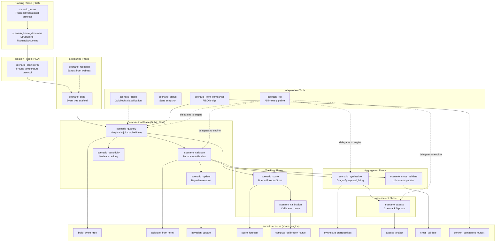

# Scenarios MCP Server Reference

**Crate:** `mcp-servers/hkask-mcp-scenarios`
**Tools:** 18 — `scenario_frame`, `scenario_frame_document`, `scenario_brainstorm`, `scenario_build`, `scenario_research`, `scenario_quantify`, `scenario_calibrate`, `scenario_update`, `scenario_sensitivity`, `scenario_synthesize`, `scenario_cross_validate`, `scenario_score`, `scenario_calibration`, `scenario_assess`, `scenario_triage`, `scenario_status`, `scenario_from_companies`, `scenario_full`
**Auto-start:** No (in `CORE_EXCLUDED` — requires explicit opt-in via `/mcp start`)

## Pipeline Architecture (DIAG-RF-005)

This diagram shows the control flow between the 18 MCP tools in the scenarios server, grouped by pipeline phase. Solid arrows indicate the expected predecessor relationship enforced by `check_sequence` (warn-only, non-blocking). Dashed arrows indicate optional or independent paths. The `scenario_full` tool compresses the entire chain into a single call by delegating to the same engine functions.

<!-- DIAGRAM_ALIGNMENT
id: DIAG-RF-005
verified_date: 2026-07-21
verified_against: mcp-servers/hkask-mcp-scenarios/src/lib.rs (18 tool routers + check_sequence), mcp-servers/hkask-mcp-scenarios/src/superforecast.rs (engine functions: build_event_tree, calibrate_from_fermi, bayesian_update, score_forecast, compute_calibration_curve, synthesize_perspectives, assess_project, cross_validate, convert_companies_output), mcp-servers/hkask-mcp-scenarios/src/types.rs
status: VERIFIED
-->

## Key paths

- **Standard pipeline:** `scenario_frame` → `scenario_frame_document` → `scenario_brainstorm` → `scenario_build` → `scenario_quantify` → `scenario_calibrate` → `scenario_synthesize` → `scenario_score` → `scenario_assess`
- **Research entry:** `scenario_research` → `scenario_build` (skip brainstorming if events are extracted from web text)
- **Companies bridge:** `scenario_from_companies` → `scenario_quantify` (skip framing/brainstorming — events come from DCF model)
- **Single-call:** `scenario_full` delegates to `triage_question`, `build_event_tree`, `sensitivity_ranking`, `calibrate_from_fermi`, `outside_view_adjustment`, `synthesize_perspectives`, `assess_project`
- **Independent:** `scenario_triage`, `scenario_status` callable at any point

## Cross-links

- [Superforecasting: Layered Model](../../explanation/superforecasting-layers.md) — three-layer model (skill, math, servers)
- [Scenarios Adversarial Review](../../status/scenarios-adversarial-review.md) — code smell inventory and action items
- [Scenarios Semantic Graph Audit](../../status/scenarios-semantic-graph-audit.md) — cross-skill/server dependency graph
- [MCP Server Registry](README.md) — built-in server index
- [Diagram Index](../../DIAGRAMS_INDEX.md) — DIAG-RF-005 registration
