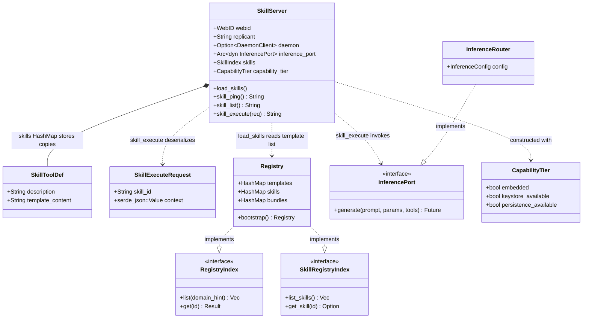

# Skill MCP Server (`hkask-mcp-skill`)

> **Scope-exempt table sections:** the Tool Catalogue and Dependencies sections
> below are pure cross-reference tables. The authoritative design rationale lives
> in the Architecture section and in
> [`mcp-servers/hkask-mcp-skill/src/lib.rs`](../../../mcp-servers/hkask-mcp-skill/src/lib.rs).

Thin MCP surface that exposes the hKask skill registry as three callable tools.
It is an *alternate consumer surface* alongside the CLI and Web servers, and —
per the crate's architectural note — reads the template registry directly rather
than routing through `hkask-services-skill`. Skill *management* (discovery,
publishing, hashing, auditing, bundle composition) lives in
[`hkask-services-skill`](../../../crates/hkask-services-skill); skill *execution*
(template render + inference) is the concern this server owns.

## Tool Catalogue

| Tool | Parameters | Description |
|------|-----------|-------------|
| `skill_ping` | none | Liveness and profile info (`version`, `mode`, `skills_loaded`) |
| `skill_list` | none | List available skill IDs with their descriptions |
| `skill_execute` | `skill_id: String`, `context: JSON object` | Render a skill's Jinja2 template with the context, then run inference |

> The tool count was previously listed as `—` in the
> [MCP Server Registry](README.md); this doc corrects that drift.

## Architecture

The server struct is generated by the `mcp_server!` macro, which adds the
mandatory `webid`, `replicant`, and `daemon` fields and a `ToolContext` impl for
framework-level CNS span emission and semantic-memory recording. Each tool body
is wrapped in `execute_tool(self, name, async { … })`, which handles span
lifecycle, outcome recording, and error serialization.

At startup, `run()` constructs an `InferenceRouter` (the production
`InferencePort`), builds a `SkillServer` with an empty skill index, then calls
`load_skills()` to populate the index from `Registry::bootstrap()`.
`skill_execute` looks up the rendered template content by ID, renders it with
`minijinja` (lenient undefined behaviour), prepends a static system prompt, and
calls `inference_port.generate(...)`.

<!-- DIAGRAM_ALIGNMENT
id: DIAG-MCP-SKILL-001
verified_date: 2026-07-17
verified_against: mcp-servers/hkask-mcp-skill/src/lib.rs:49
reference_sources: crates/hkask-templates/src/registry.rs:400
status: VERIFIED
-->

### Known architectural friction (current status)

The diagram above makes a structural fact visible: `Registry` implements **both**
`RegistryIndex` (the template layer) and `SkillRegistryIndex` (the skill layer),
but `SkillServer::load_skills()` reads only `RegistryIndex::list()` and
re-derives its own `HashMap<String, SkillToolDef>` from template entries — it
never consults `SkillRegistryIndex`. The crate's lib.rs comment documents this as
intentional (no `SkillService::execute()` exists), but it means two parallel
skill indexes exist at runtime: the registry's `skills` map and the server's
`SkillIndex`. A registry hot-reload would leave the server stale, because
`load_skills()` runs once at startup with no feedback loop. This is tracked as a
deepening candidate (see [Adversarial Review](#) in the review notes), not a
blocking defect.

## Dependencies

| Crate | Role |
|-------|------|
| `hkask-mcp` | MCP runtime, `mcp_server!` macro, `execute_tool`, `CapabilityTier` |
| `hkask-templates` | `Registry::bootstrap()`, `RegistryIndex` |
| `hkask-ports` | `InferencePort`, `RegistryIndex` traits |
| `hkask-inference` | `InferenceRouter` (production `InferencePort`) |
| `hkask-types` | `LLMParameters`, `McpErrorKind`, `WebID` |
| `minijinja` | Template rendering (lenient undefined behaviour) |
| `rmcp` | `#[tool]` macro, `tool_router`, `Parameters` |

> The crate README previously listed `hkask-services-skill` as a dependency; it
> is not present in `Cargo.toml` and the server intentionally does not route
> through it. That README entry has been corrected.

## Patterns

1. **Bootstrap:** `hkask_mcp::bootstrap_mcp_server("skill", "hkask.mcp.skill", "HKASK_MCP_HOST")` → `MCPBootstrap { replicant, daemon_client }`[^hexagonal]
2. **Struct:** `mcp_server!` generates `webid`/`replicant`/`daemon` plus domain fields[^rmcp]
3. **Tool dispatch:** `execute_tool(self, tool_name, async { … })` wraps each tool with CNS span + daemon outcome recording
4. **Tool router:** `#[tool_router(server_handler)]` on the `ServerHandler` impl
5. **Error type:** `McpToolError` for tool-level errors; `McpErrorKind::NotFound` / `invalid_argument` / `internal`

## Cross-links

- [Skill, Template, and Bundle Registry](../skills/README.md) — the canonical skill registry reference
- [MCP Server Registry](README.md) — index of all 15 built-in MCP servers
- [Architecture Patterns](../../explanation/architecture-patterns.md) — hexagonal ports, service layer, MCP dispatch
- [`mcp-servers/hkask-mcp-skill/src/lib.rs`](../../../mcp-servers/hkask-mcp-skill/src/lib.rs) — verified source
- [`crates/hkask-services-skill/README.md`](../../../crates/hkask-services-skill/README.md) — skill management service (discovery, audit, bundles)

## References

[^hexagonal]: Cockburn, A. (2005). *Hexagonal Architecture (Ports and Adapters)*. https://alistair.cockburn.us/hexagonal-architecture/. The ports-and-adapters pattern this server follows: domain crates expose ports, surfaces (CLI/API/MCP) are alternate adapters.

[^rmcp]: Model Context Protocol Specification (2024). https://modelcontextprotocol.io/. The `rmcp` crate implements the MCP server protocol; the `#[tool]` macro generates the JSON-schema-bearing tool handlers.

[^diataxis]: Procida, D. (2019). *Diataxis: A Documentation Framework*. https://diataxis.fr/. This document is in the Reference quadrant — austere and factual.