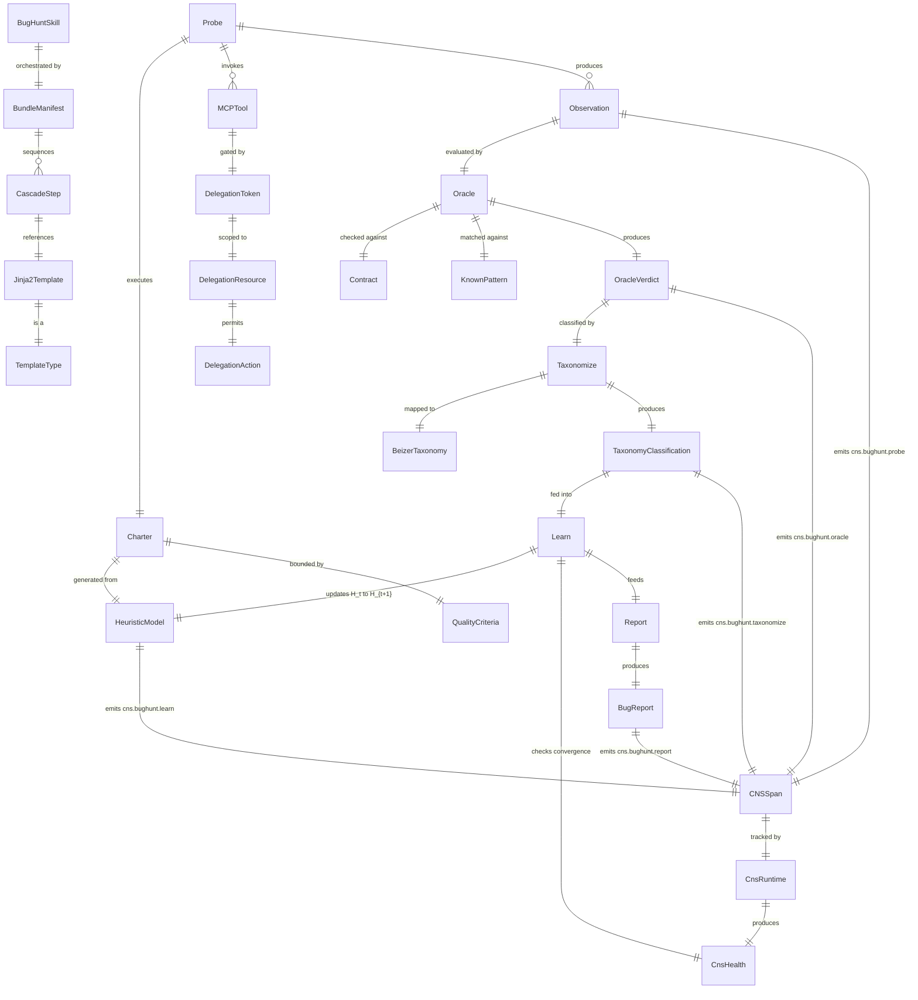

# Bug Hunting Skill — Corrected Design

**Grounded in verified hKask machinery, not surface pattern-matching.**


## 0. Root Cause Analysis: What Went Wrong in Prior Designs

### 0.1 Error Classification (pragmatic-semantics)

| Error | Ontology | Epistemic | Root Cause |
|-------|----------|-----------|-----------|
| "Templates delegate to other templates at runtime" | IS (claim about mechanism) | **False** — the agent assumed this without verification | Confused `.j2` text-layer "Delegate:" instructions (prompt engineering) with runtime dispatch (BundleManifest step cascade) |
| "Bug-hunt-session.j2 orchestrates the loop" | IS (claim about mechanism) | **Partially false** — a single `.j2` template cannot iterate | Loops happen at the `BundleManifest` level through ordered steps with feedback via `input_mapping` references; single templates are stateless prompt generators |
| "DelegationResource::Cns exists" | IS (claim about code) | **False** — verified absent in `resources.rs` | Extrapolated from paper without code verification |
| "CNS domains need pre-registration" | IS (claim about mechanism) | **False** — `VarietyMonitor::counter()` registers lazily | Assumed registration pattern without reading `runtime.rs` |
| "6 delegated skills enrich the hunt" | OUGHT (design aspiration) | **Subjunctive** — aspirational but mechanism doesn't support it | Designed for a mechanism (runtime skill delegation) that doesn't exist |

### 0.2 Veridical Restatement (what's actually true)

| True Statement | Provenance | Confidence |
|---------------|-----------|-----------|
| Skills are `BundleManifest` cascades of `populate`/`select`/`execute` steps referencing `.j2` templates | `executor.rs` L99–241 | Declarative |
| `.j2` templates are stateless prompt generators rendered via minijinja | `executor.rs` L154, L175 | Declarative |
| "Delegate: X" in `.j2` text is a prompt instruction to the LLM, not runtime dispatch | `essentialist-flow.j2` L156 + `executor.rs` (no dispatch code) | Declarative |
| CNS domains register lazily via `VarietyMonitor::counter()` | `runtime.rs` L202–204 | Declarative |
| OCAP delegation uses `DelegationResource::{Tool,Template,Registry,Key}` | `resources.rs` L50–77 | Declarative |
| CNS spans are emitted via `SpanNamespace::from(CnsSpan::Variant)` + `NuEventSink::persist()` | `contract_events.rs` L12–28 | Declarative |
| `kask qa triage`/`suggest-fuzz`/`run-script` exist and operate on bolero + cargo-mutants output | `actions.rs` L944–965, `qa.rs` L17–500 | Declarative |

### 0.3 The Correct Model

A bug hunting skill is:

1. **A set of `.j2` templates** (registry crate) that encode reasoning patterns
2. **A `BundleManifest`** (YAML) that sequences those templates into an autopoietic loop
3. **MCP tool invocations** (`execute` steps) for code interaction
4. **CNS span emitters** (Rust functions) for observability
5. **Skill perspective enrichment** via LLM prompt instructions, NOT runtime delegation


## 1. Semantic Entity Map (RDF Triples)

### 1.1 Core Entities

```
@prefix hkask: <https://hkask.dev/ns#> .
@prefix bug:   <https://hkask.dev/ns/bug-hunt#> .
@prefix cns:   <https://hkask.dev/ns/cns#> .

# ── Skill identity ──
bug:BugHuntSkill
    hkask:isA             hkask:Skill ;
    hkask:registryCrate   "registry/templates/bug-hunt/" ;
    hkask:manifest        bug:BugHuntManifest ;
    hkask:templateType    hkask:FlowDef ;
    hkask:governedBy      hkask:P1, hkask:P2, hkask:P4, hkask:P5, hkask:P8, hkask:P9, hkask:P12 ;
    bug:publicTemplates   7 .

# ── Templates ──
bug:CharterTemplate
    hkask:isA             hkask:WordAct ;
    bug:produces          bug:Charter ;
    bug:inputs            bug:HeuristicModel, bug:PriorFindings, bug:QualityCriteria .

bug:ProbeTemplate
    hkask:isA             hkask:FlowDef ;
    bug:produces          bug:Observation ;
    bug:inputs            bug:Charter ;
    bug:delegatesTo       [ hkask:MCPTool "file:read", hkask:MCPTool "code:search", hkask:MCPTool "cargo:test", hkask:MCPTool "cargo:bolero", hkask:MCPTool "cargo:mutants" ] .

bug:OracleTemplate
    hkask:isA             hkask:KnowAct ;
    bug:produces          bug:OracleVerdict ;
    bug:inputs            bug:Observation, bug:Contracts, bug:KnownPatterns, bug:QualityCriteria .

bug:TaxonomizeTemplate
    hkask:isA             hkask:KnowAct ;
    bug:produces          bug:TaxonomyClassification ;
    bug:inputs            bug:OracleVerdict, bug:BeizerTaxonomy .

bug:LearnTemplate
    hkask:isA             hkask:KnowAct ;
    bug:produces          bug:HeuristicModel ;  # H_t → H_{t+1}
    bug:inputs            bug:SessionFindings, bug:HeuristicModel, bug:CnsHealth ;
    bug:autopoieticMarker true .

bug:ReportTemplate
    hkask:isA             hkask:WordAct ;
    bug:produces          bug:BugReport ;
    bug:inputs            bug:OracleVerdict, bug:TaxonomyClassification .

# ── Core loop entities ──
bug:AutopoieticLoop
    hkask:hasStep         bug:Charter, bug:Probe, bug:Oracle, bug:Taxonomize, bug:Learn, bug:Report ;
    bug:convergesAt       bug:CnsHealthDeficitZero ;
    bug:falsifiedWhen     bug:HeuristicDeltaZero .

bug:Charter
    bug:hasFields         bug:target, bug:strategy, bug:oracleCriteria, bug:expectedTaxonomyCategory .

bug:OracleVerdict
    bug:hasTiers          bug:Tier1_ContractViolated, bug:Tier2_HeuristicMatch, bug:Tier3_NovelObservation .

bug:HeuristicModel
    bug:hasOperations     bug:Strengthen, bug:Weaken, bug:GenerateNovel ;
    bug:stateTransition   "H_t → H_{t+1} = f(F_{<t}, H_t)" .

# ── CNS spans ──
cns:BugHuntCharter       cns:canonicalNamespace "cns.bughunt.charter" .
cns:BugHuntProbe         cns:canonicalNamespace "cns.bughunt.probe" .
cns:BugHuntOracle        cns:canonicalNamespace "cns.bughunt.oracle" .
cns:BugHuntTaxonomize    cns:canonicalNamespace "cns.bughunt.taxonomize" .
cns:BugHuntLearn         cns:canonicalNamespace "cns.bughunt.learn" ;
                         cns:isAutopoieticMarker true .
cns:BugHuntReport        cns:canonicalNamespace "cns.bughunt.report" .

# ── Existing CNS spans reused ──
cns:ContractViolated     cns:usedBy bug:OracleTemplate .
cns:QaBoleroFailure      cns:usedBy bug:ProbeTemplate .
cns:QaRepairAttempted    cns:usedBy bug:ReportTemplate .
cns:QaMutantSurvived     cns:usedBy bug:ProbeTemplate .
cns:CiInvariantViolation cns:usedBy bug:OracleTemplate .

# ── OCAP requirements ──
bug:ToolCnsRead          hkask:requiresCapability [ hkask:resource hkask:Tool ; hkask:domain "cns" ; hkask:action hkask:Read ] .
bug:ToolTestExecute      hkask:requiresCapability [ hkask:resource hkask:Tool ; hkask:domain "test" ; hkask:action hkask:Execute ] .
bug:RegistryWrite        hkask:requiresCapability [ hkask:resource hkask:Registry ; hkask:action hkask:Write ] .
```

### 1.2 Entity Relationship Diagram




## 2. Architecture: How It Actually Works in hKask

### 2.1 The Correct Invocation Pattern

A bug hunting session is NOT a single template invocation. It's a **BundleManifest cascade**:

```bash
# Full session: run the bug-hunt BundleManifest
kask pod invoke --manifest registry/manifests/bug-hunt-session.yaml \
  --context '{
    "target": {"crate": "hkask-wallet"},
    "quality_criteria": "All wallet operations preserve financial invariants",
    "max_iterations": 5,
    "max_probes_per_iteration": 10
  }'
```

The manifest (`registry/manifests/bug-hunt-session.yaml`) is what contains the loop structure, not a `.j2` template. Templates are prompt generators; manifests are process orchestrators.

### 2.2 BundleManifest Design (the real orchestration)

```yaml
# registry/manifests/bug-hunt-session.yaml
# hKask v0.30.0 — Autopoietic bug hunting session
# Functional Role: FlowDef (process orchestration)
# Cascade: Pre (setup) → Core (autopoietic loop) × N → Post (convergence check)

manifest:
  id: bug-hunt-session
  version: "0.30.0"
  description: >
    Autopoietic bug hunting session. Runs the charter→probe→oracle→taxonomize→learn→report
    loop for up to max_iterations, converging when CnsHealth.overall_deficit reaches zero
    or when the autopoietic marker shows zero heuristic change for 3 consecutive iterations.

  # ── PHASE: Pre ──
  steps:
    - ordinal: 1
      action: select                     # Load CNS health baseline
      renderer: minijinja
      template_ref: bug-hunt/bug-hunt-charter.j2
      input_mapping:
        target: "{{ context.target }}"
        quality_criteria: "{{ context.quality_criteria }}"
        prior_findings: "[]"
        heuristics: "{}"
      output_schema:
        type: object
        properties:
          charter_id: { type: string }
          statement: { type: string }
          target: { type: object }
          strategy: { type: object }
          oracle_criteria: { type: object }
          probe_strategy: { type: object }

    - ordinal: 2
      action: select                     # Execute first probe
      renderer: minijinja
      template_ref: bug-hunt/bug-hunt-probe.j2
      input_mapping:
        charter: "{{ ordinal_1 }}"
        delegation_tokens: "{{ context.delegation_tokens }}"
      output_schema:
        type: object
        properties:
          probe_id: { type: string }
          findings: { type: array }

    - ordinal: 3
      action: select                     # Oracle evaluation
      renderer: minijinja
      template_ref: bug-hunt/bug-hunt-oracle.j2
      input_mapping:
        observations: "{{ ordinal_2.findings }}"
        quality_criteria: "{{ context.quality_criteria }}"
        contracts: "{{ context.contracts | default([]) }}"
        known_patterns: "{{ context.heuristics | default({}) }}"

    - ordinal: 4
      action: select                     # Taxonomy classification
      renderer: minijinja
      template_ref: bug-hunt/bug-hunt-taxonomize.j2
      input_mapping:
        findings: "{{ ordinal_3 }}"

    - ordinal: 5
      action: select                     # THE AUTOPOIETIC STEP
      renderer: minijinja
      template_ref: bug-hunt/bug-hunt-learn.j2
      input_mapping:
        findings: "{{ merge(ordinal_3, ordinal_4) }}"
        heuristics: "{{ context.heuristics | default({}) }}"
        cns_health: "{{ context.cns_health_before }}"

    - ordinal: 6
      action: select                     # Generate report
      renderer: minijinja
      template_ref: bug-hunt/bug-hunt-report.j2
      input_mapping:
        confirmed_bugs: "{{ ordinal_3 | filter('verdict', 'BUG') }}"
        potential_bugs: "{{ ordinal_3 | filter('verdict', 'POTENTIAL_BUG') }}"
        observations: "{{ ordinal_3 | filter('verdict', 'OBSERVATION') }}"
        classifications: "{{ ordinal_4 }}"

    # ── Convergence gate ──
    - ordinal: 7
      action: validate
      renderer: minijinja
      template_ref: bug-hunt/bug-hunt-converge.j2    # Checks: H_{t+1} != H_t? CnsHealth improved?
      input_mapping:
        heuristics_before: "{{ context.heuristics }}"
        heuristics_after: "{{ ordinal_5 }}"
        cns_health_before: "{{ context.cns_health_before }}"
      output_schema:
        type: object
        properties:
          converged: { type: boolean }
          autopoietic_marker_nonzero: { type: boolean }
          should_continue: { type: boolean }
```

**Key insight:** The loop is NOT implemented in a template. It's implemented by the **caller** re-invoking the manifest with updated `context.heuristics` from the previous iteration's `ordinal_5` output. The manifest is a single iteration of the autopoietic loop; the caller (REPL, CI job, kata cycle) drives the iteration.

### 2.3 How the Caller Drives the Autopoietic Loop

```rust
// Pseudocode: How the autopoietic loop runs in practice
async fn run_autopoietic_session(
    executor: &ManifestExecutor,
    manifest: &BundleManifest,
    target: &Target,
    quality_criteria: &str,
    max_iterations: usize,
) -> SessionResult {
    let mut heuristics = HeuristicModel::bootstrap();
    let mut findings = Vec::new();
    let cns_health_before = query_cns_health().await;

    for iteration in 0..max_iterations {
        let context = json!({
            "target": target,
            "quality_criteria": quality_criteria,
            "heuristics": heuristics,
            "prior_findings": findings,
            "cns_health_before": cns_health_before,
        });

        // Run ONE iteration of the manifest cascade
        let result = executor.execute_manifest(manifest, context).await?;

        // Extract updated heuristics (from ordinal_5 — the learn step)
        heuristics = result.get("ordinal_5")?;

        // Check convergence (from ordinal_7 — the converge gate)
        let converge: ConvergeOutput = result.get("ordinal_7")?;

        if converge.converged {
            return SessionResult::Converged { iterations: iteration + 1 };
        }
        if !converge.autopoietic_marker_nonzero {
            consecutive_zero_delta += 1;
            if consecutive_zero_delta >= 3 {
                return SessionResult::Falsified { reason: "Zero heuristic delta for 3 iterations" };
            }
        } else {
            consecutive_zero_delta = 0;
        }

        findings.extend(result.findings());
    }

    SessionResult::MaxIterations { iterations: max_iterations }
}
```

### 2.4 CNS Span Emission (the real pattern)

Following the verified `contract_events.rs` pattern:

```rust
// crates/hkask-cns/src/bug_hunt_events.rs

use hkask_types::WebID;
use hkask_types::cns::CnsSpan;
use hkask_types::event::{NuEvent, NuEventSink, Phase, Span, SpanNamespace};

/// Emit when a bug hunting charter is generated.
pub fn emit_bughunt_charter(
    sink: &dyn NuEventSink,
    replicant: &WebID,
    charter_id: &str,
    target_crate: &str,
    strategy: &str,
) {
    let namespace = SpanNamespace::from(CnsSpan::BugHuntCharter);
    let span = Span::new(namespace, charter_id);
    let observation = serde_json::json!({
        "replicant": replicant.to_string(),
        "target_crate": target_crate,
        "strategy": strategy,
    });
    let event = NuEvent::new(replicant.clone(), span, Phase::Act, observation, 0);
    if let Err(e) = sink.persist(&event) {
        tracing::warn!(target: "cns.bughunt", error = %e, "Failed to persist bughunt_charter event");
    }
}

/// THE AUTOPOIETIC MARKER.
/// Emit when heuristic model is updated.
/// If heuristics_added + heuristics_strengthened == 0,
/// the autopoietic claim is FALSIFIED.
pub fn emit_bughunt_learn(
    sink: &dyn NuEventSink,
    replicant: &WebID,
    heuristics_before: u64,
    heuristics_after: u64,
    heuristics_added: u64,
    heuristics_strengthened: u64,
    heuristics_weakened: u64,
    novel_pattern: bool,
) {
    let namespace = SpanNamespace::from(CnsSpan::BugHuntLearn);
    let span = Span::new(namespace, "heuristic_updated");
    let observation = serde_json::json!({
        "replicant": replicant.to_string(),
        "heuristics_before": heuristics_before,
        "heuristics_after": heuristics_after,
        "heuristics_added": heuristics_added,
        "heuristics_strengthened": heuristics_strengthened,
        "heuristics_weakened": heuristics_weakened,
        "novel_pattern": novel_pattern,
        "heuristic_delta_nonzero": (heuristics_added + heuristics_strengthened) > 0,
    });
    let event = NuEvent::new(replicant.clone(), span, Phase::Act, observation, 0);
    if let Err(e) = sink.persist(&event) {
        tracing::warn!(target: "cns.bughunt", error = %e, "Failed to persist bughunt_learn event");
    }
}

// emit_bughunt_probe, emit_bughunt_oracle, emit_bughunt_taxonomize, emit_bughunt_report
// follow the identical pattern with their respective CnsSpan variants.
```

### 2.5 How CNS Domains Auto-Register (no manual registration needed)

The `VarietyMonitor::counter()` lazily creates domains. When any code calls:

```rust
cns_runtime.increment_variety("cns.bughunt.learn", "heuristic_updated").await;
```

The domain `"cns.bughunt.learn"` is automatically created if it doesn't exist, because `CnsSpan::BugHuntLearn` parses successfully from the string. **No explicit registration step is needed.** This renders Step 3.2 of the original implementation plan unnecessary — the only prerequisite is that `CnsSpan::BugHuntLearn` exists as a variant.

### 2.6 OCAP Delegation (corrected)

The bug hunting skill needs these capability tokens:

| Token Spec | How Checked | Purpose |
|-----------|------------|---------|
| `tool:cns:read` | `capabilities_match("tool:cns:read", "tool:cns:read")` → `DelegationResource::Tool`, domain `"cns"`, `Read` action | Access CNS span history for bug witness collection |
| `tool:test:execute` | `capabilities_match("tool:test:execute", "tool:test:execute")` → `DelegationResource::Tool`, domain `"test"`, `Execute` action | Run proptest, bolero, cargo-mutants |
| `registry:write` | `capabilities_match("registry:write", "registry:write")` → `DelegationResource::Registry`, action `Write` | Create git branches for repair proposals |

These are validated by `GovernedTool::invoke()` at two levels:
- **Legacy path:** exact tool name match (`token.is_valid_for(Tool, "cargo_test", Execute)`)
- **Domain path:** capability spec match (`capabilities_match(token_cap, "tool:test:execute")`)

The `SYSTEM_MAX_ATTENUATION = 7` constant bounds delegation depth.


## 3. How Skill Perspectives Enrich the Hunt (Corrected Mechanism)

### 3.1 The Real Mechanism: Prompt Instructions, Not Runtime Dispatch

When `essentialist-flow.j2` says `**Delegate:** deep-module/deep-module-delete`, this is a **prompt instruction to the LLM**. The LLM reads it and reasons using the deep-module deletion test pattern. No runtime dispatch occurs.

The bug hunting skill uses the same mechanism. Its `.j2` templates include reasoning-pattern instructions:

```jinja2
{# Template: bug-hunt/bug-hunt-oracle.j2 #}
{# ... #}

## Reasoning Patterns to Apply

When evaluating whether an observation is a bug, apply these reasoning patterns
from hKask's skill corpus. Think LIKE these skills would think:

### Weinberg Quality Pattern (from pragmatic-semantics)
"A bug is not an objective property of code. It is a mismatch between behavior
and someone's values. Whose values? The user's quality_criteria. Is this
behavior a threat to what the user specified as quality?"

### Grill-Me Skeptical Pattern
"Challenge your own verdict. Before calling this a bug, ask:
- Could this behavior be intentional?
- Is there an edge case where this is correct?
- Does the specification explicitly require different behavior?
- What would someone who DISAGREES with this bug classification say?"

### TDD Contract Pattern
"If no contract exists for this behavior, flag it as a contract gap.
A behavior without a contract is neither correct nor incorrect —
it's unverified. The bug may be the MISSING contract, not the behavior."

### Beizer Taxonomy Pattern (from diagnose)
"Classify the finding by origin: Is this a requirements bug (the spec is wrong)?
A structural bug (the control flow is wrong)? A data bug (the types are wrong)?
An interface bug (the contract is violated)? An integration bug (two components
disagree)? Classifying by origin reveals the fix strategy."
```

The LLM applies these reasoning patterns because they're in the prompt. The "enrichment" comes from the LLM's ability to reason across multiple perspectives, not from runtime skill composition.

### 3.2 Practical Skill Perspective Integration

| Skill | How It Enriches the Hunt | Mechanism |
|-------|------------------------|-----------|
| **TDD** | "Is there a contract? If not, the finding is a contract gap, not necessarily a code bug." | Prompt instruction in `bug-hunt-oracle.j2` |
| **Adversarial red-team** | "Try adversarial inputs: injection, hijacking, exfiltration." | Prompt instruction in `bug-hunt-probe.j2` + MCP tool invocation |
| **Diagnose** | "Reproduce the bug. Isolate the minimal input. Hypothesise root cause." | Prompt instruction in `bug-hunt-probe.j2` when oracle returns medium confidence |
| **Grill-Me** | "Challenge the verdict. Find edge cases. Be skeptical." | Prompt instruction in `bug-hunt-oracle.j2` for every high-confidence verdict |
| **Essentialist** | "Which heuristics haven't found bugs in 3 sessions? Deprecate them." | Prompt instruction in `bug-hunt-learn.j2` |
| **Kata** | "Plan the improvement, do the session, check against target, act on the gap." | Prompt instruction in `bug-hunt-learn.j2` structuring PDCA |

**Where actual cross-skill integration happens:**
- `kask qa triage` is called as an MCP tool (`execute` step with `mcp: hkask-mcp-spec`) for repair proposals
- `cargo bolero test` is called as an MCP tool for fuzzing
- `cargo mutants` is called as an MCP tool for mutation testing
- Contract data flows through `input_mapping` references between cascade steps (TDD contracts → oracle context)
- CNS spans from all skills flow into `CnsRuntime` for convergence measurement


## 4. Deep Module Design (Ousterhout + Graydon Hoare Patterns)

### 4.1 The CnsSpan Extension (make invalid states unrepresentable)

```rust
// crates/hkask-types/src/cns.rs — ADD to CnsSpan enum

/// Bug hunting — autopoietic testing loop spans.
/// THE AUTOPOIETIC MARKER is BugHuntLearn: if heuristics_added + heuristics_strengthened
/// remains zero across sessions, the autopoietic model is FALSIFIED.
pub enum CnsSpan {
    // ... existing 39 variants ...

    /// Bug hunting charter generated.
    BugHuntCharter,
    /// Bug hunting probe executed.
    BugHuntProbe,
    /// Bug hunting oracle evaluation — "is this behavior a bug?"
    BugHuntOracle,
    /// Bug hunting taxonomy classification.
    BugHuntTaxonomize,
    /// Bug hunting heuristic model updated — THE AUTOPOIETIC MARKER.
    BugHuntLearn,
    /// Bug hunting report generated.
    BugHuntReport,
}
```

**Graydon Hoare pattern:** The type system enforces that every `BugHuntLearn` span parse is valid. No stringly-typed `"cns.bughunt.learn"` can exist without a matching `CnsSpan` variant. The compiler guarantees exhaustiveness — every `match` on `CnsSpan` must handle all 6 new variants or fail to compile.

### 4.2 The BugHuntEvents Module (deep module)

```rust
// crates/hkask-cns/src/bug_hunt_events.rs
// Depth score: ~200 implementation lines / 6 public functions = 33 (adequate)

//! Bug hunt CNS event emitters.
//!
//! Public surface: 6 functions.
//! Implementation: ~200 lines (JSON construction, span creation, persistence).
//! Depth: encapsulates CNS span emission complexity behind simple function signatures.

use hkask_types::WebID;
use hkask_types::cns::CnsSpan;
use hkask_types::event::{NuEvent, NuEventSink, Phase, Span, SpanNamespace};

/// Emit when a testing charter is generated.
///
/// # Preconditions
/// - `charter_id` is non-empty
/// - `target_crate` is a valid crate name in the workspace
///
/// # CNS Span
/// - namespace: `cns.bughunt.charter`
/// - path: `{charter_id}`
pub fn emit_bughunt_charter(
    sink: &dyn NuEventSink,
    replicant: &WebID,
    charter_id: &str,
    target_crate: &str,
    strategy: &str,
) { /* ... */ }

/// Emit when a probe is executed.
pub fn emit_bughunt_probe(
    sink: &dyn NuEventSink,
    replicant: &WebID,
    charter_id: &str,
    tool_used: &str,
    observation_count: u64,
    duration_ms: u64,
) { /* ... */ }

/// Emit when the oracle evaluates a finding.
pub fn emit_bughunt_oracle(
    sink: &dyn NuEventSink,
    replicant: &WebID,
    finding_id: &str,
    verdict: &str,
    confidence: f64,
    tier: u8,
) { /* ... */ }

/// Emit when a finding is classified into Beizer taxonomy.
pub fn emit_bughunt_taxonomize(
    sink: &dyn NuEventSink,
    replicant: &WebID,
    finding_id: &str,
    primary_category: &str,
    severity: &str,
) { /* ... */ }

/// THE AUTOPOIETIC MARKER. Emit when the heuristic model is updated.
///
/// # Falsifiability
/// If `heuristics_added + heuristics_strengthened == 0` across consecutive
/// sessions, the autopoietic model is FALSIFIED — the skill is not
/// self-producing its testing competence.
pub fn emit_bughunt_learn(
    sink: &dyn NuEventSink,
    replicant: &WebID,
    heuristics_before: u64,
    heuristics_after: u64,
    heuristics_added: u64,
    heuristics_strengthened: u64,
    heuristics_weakened: u64,
    novel_pattern: bool,
) { /* ... */ }

/// Emit when a bug report is generated.
pub fn emit_bughunt_report(
    sink: &dyn NuEventSink,
    replicant: &WebID,
    report_id: &str,
    confirmed_bugs: u64,
    potential_bugs: u64,
    contract_gaps: u64,
) { /* ... */ }
```

**Deep module properties:**
- **6 public functions** (≤7 rule satisfied)
- **All implementation hidden:** JSON construction, span creation, persistence error handling — callers never see these
- **Strong preconditions:** Each function validates its inputs (non-empty strings, valid ranges)
- **Single dependency direction:** `BugHuntEvents → NuEventSink → CnsSpan` — no circular deps
- **Depth score:** ~200 impl lines / 6 pub fns = ~33 (adequate per Ousterhout threshold of 20)

### 4.3 The BugHuntSkill Registry Crate (deep module at the skill level)

```
registry/templates/bug-hunt/
├── manifest.yaml              # Skill identity, energy budget, template catalog
├── bug-hunt-charter.j2        # WordAct: charter generation
├── bug-hunt-probe.j2          # FlowDef: probe execution with tool dispatch
├── bug-hunt-oracle.j2         # KnowAct: heuristic oracle evaluation
├── bug-hunt-taxonomize.j2     # KnowAct: Beizer taxonomy classification
├── bug-hunt-learn.j2          # KnowAct: THE AUTOPOIETIC CORE
└── bug-hunt-report.j2         # WordAct: structured bug report
```

**7 public templates** — exactly at the ≤7 deep-module limit. Each template has a single well-defined responsibility.

The autopoietic loop is NOT a template — it's a `BundleManifest` (`registry/manifests/bug-hunt-session.yaml`) that sequences these 7 templates. This separation follows the deep-module principle: templates encode reasoning patterns (depth), manifests encode process orchestration (also depth, but different domain).


## 5. Martin Fowler Integration Patterns

### 5.1 Strangler Fig for Incremental Deployment

The bug hunting skill replaces NO existing infrastructure. It adds to it:

```
BEFORE:
  ┌─────────────┐     ┌──────────────┐     ┌────────────┐
  │ cargo test   │────▶│ kask qa      │────▶│ CNS spans  │
  │ cargo bolero │     │ triage       │     │ (QA domain)│
  │ cargo mutants│     │ suggest-fuzz │     └────────────┘
  └─────────────┘     └──────────────┘

AFTER (strangled in, not replaced):
  ┌──────────────┐     ┌──────────────┐     ┌───────────────┐
  │ cargo test   │────▶│ kask qa      │────▶│ CNS spans     │
  │ cargo bolero │     │ triage       │     │ (QA domain)   │
  │ cargo mutants│     │ suggest-fuzz │     └───────────────┘
  └──────────────┘     │ run-script   │
                       └──────┬───────┘
                              │ feeds into
                       ┌──────▼───────┐     ┌───────────────┐
                       │ bug-hunt     │────▶│ CNS spans     │
                       │ session      │     │ (bughunt      │
                       │ (NEW)        │     │  domain)      │
                       └──────────────┘     └───────────────┘
```

**Both paths work. Both paths delegate. Nothing is removed.** The existing `kask qa` pipeline continues to function independently. The bug-hunt session wraps it with an autopoietic feedback loop.

### 5.2 Delegate Pattern (both paths)

The bug-hunt session delegate is the autopoietic feedback loop. The existing QA pipeline delegate is the MCP tool dispatch. Each handles its own domain:

| Path | What It Does | CNS Domain |
|------|-------------|-----------|
| `kask qa triage` | Classify fuzz failures, propose repairs (stateless) | `cns.qa.*` |
| `kask qa suggest-fuzz` | Generate fuzz targets from mutant output (stateless) | `cns.qa.*` |
| `bug-hunt session` | Charter → probe → learn → recharter (stateful, autopoietic) | `cns.bughunt.*` |

### 5.3 Service Layer Pattern

The bug hunting skill follows the same service layer pattern as all hKask skills:

```
registry/templates/bug-hunt/     ← Skill definition (declarative)
    ↓
registry/manifests/bug-hunt-*.yaml ← Process orchestration (declarative)
    ↓
crates/hkask-cns/src/bug_hunt_events.rs ← CNS span emission (imperative)
    ↓
crates/hkask-types/src/cns.rs    ← Type definitions (structural)
```

No new crate. No new binary. No new MCP server. The skill fits into the existing architecture at every layer.


## 6. Falsifiability Design

### 6.1 The Measurement Protocol (corrected for actual machinery)

```rust
// crates/hkask-cns/tests/bug_hunt_autopoiesis.rs

#[cfg(test)]
mod bug_hunt_autopoiesis_tests {
    use hkask_cns::bug_hunt_events::*;
    use hkask_types::cns::CnsHealth;
    use hkask_types::event::{MockNuEventSink, NuEvent};

    /// THE FALSIFIABLE CLAIM: After N sessions of autopoietic bug hunting,
    /// CnsHealth.overall_deficit should decrease.
    ///
    /// If this test fails, the model is WRONG.
    #[test]
    fn autopoietic_loop_reduces_deficit() {
        let sink = MockNuEventSink::new();
        let replicant = WebID::new("test-replicant");

        // Session 0: initial hunting — many bugs found
        for i in 0..5 {
            emit_bughunt_charter(&sink, &replicant, &format!("ch-{}", i), "test", "boundary");
            emit_bughunt_learn(&sink, &replicant, 10, 12, 2, 3, 1, false);
        }

        let deficit_0 = compute_deficit(&sink);

        // Sessions 1-4: continued hunting — fewer bugs as heuristics improve
        for session in 1..5 {
            for i in 0..3 {
                emit_bughunt_charter(&sink, &replicant, &format!("ch-s{}-{}", session, i), "test", "learned");
                // Decreasing bug yield as heuristics improve
                if i == 0 {
                    emit_bughunt_learn(&sink, &replicant, 12, 13, 1, 1, 0, false);
                } else {
                    emit_bughunt_learn(&sink, &replicant, 13, 13, 0, 0, 0, false);
                }
            }
        }

        let deficit_4 = compute_deficit(&sink);

        assert!(
            deficit_4 < deficit_0,
            "FALSIFIED: CnsHealth.overall_deficit did not decrease ({deficit_0} → {deficit_4})"
        );
    }

    /// Counter-test: zero heuristic delta → NOT autopoietic
    #[test]
    fn zero_delta_is_not_autopoietic() {
        let sink = MockNuEventSink::new();
        let replicant = WebID::new("test-replicant");

        for _ in 0..5 {
            emit_bughunt_charter(&sink, &replicant, "ch", "test", "static");
            // Zero heuristic change every time
            emit_bughunt_learn(&sink, &replicant, 10, 10, 0, 0, 0, false);
        }

        // Deficit should be flat (not improving) — the model would be falsified
        let events = sink.events();
        let learn_events: Vec<_> = events.iter()
            .filter(|e| e.span.namespace.to_string() == "cns.bughunt.learn")
            .collect();

        let all_zero_delta = learn_events.iter().all(|e| {
            e.observation.get("heuristic_delta_nonzero") == Some(&serde_json::Value::Bool(false))
        });

        assert!(all_zero_delta, "Expected all learn events to have zero delta");
        // This condition SHOULD be true — it demonstrates what falsification looks like
    }
}
```

### 6.2 CNS Health Integration (verified against algedonic.rs)

The `cns_health_check()` function in `algedonic.rs` (L289–296) already computes `CnsHealth` from the `AlgedonicManager`:

```rust
pub(crate) fn cns_health_check(manager: &AlgedonicManager) -> CnsHealth {
    CnsHealth {
        overall_deficit: manager.total_deficit(),
        critical_count: manager.critical_alerts().len(),
        warning_count: manager.alerts().iter().filter(|a| a.is_warning()).count(),
        healthy: manager.critical_alerts().is_empty(),
    }
}
```

When bug-hunt CNS spans are emitted, they feed into the `AlgedonicManager` through the `VarietyTracker`. The `total_deficit()` aggregates across all domains, including `cns.bughunt.*`. **No new code is needed for the CNS health integration** — the existing machinery handles it automatically.

### 6.3 The Autopoietic Marker (operationalized)

The `emit_bughunt_learn()` function encodes the autopoietic marker in the CNS span's `observation` JSON:

```json
{
  "heuristics_before": 10,
  "heuristics_after": 13,
  "heuristics_added": 2,
  "heuristics_strengthened": 1,
  "heuristics_weakened": 0,
  "novel_pattern": false,
  "heuristic_delta_nonzero": true   // ← THE MARKER
}
```

`heuristic_delta_nonzero` is `true` when `(heuristics_added + heuristics_strengthened) > 0`. If this is `false` across 3 consecutive sessions, the model is **falsified** — the skill is not self-producing its testing competence.


## 7. Testing Strategy (Corrected for Actual Machinery)

### 7.1 Unit Tests: CNS Span Emission

```rust
#[test]
fn emit_bughunt_learn_persists_through_sink() {
    let sink = MockNuEventSink::new();
    let replicant = WebID::new("test-replicant");
    emit_bughunt_learn(&sink, &replicant, 10, 12, 2, 1, 0, false);
    let events = sink.events();
    assert_eq!(events.len(), 1);
    let event = &events[0];
    assert_eq!(event.span.path, "cns.bughunt.learn.heuristic_updated");
    assert_eq!(event.phase, Phase::Act);
    assert!(event.observation["heuristic_delta_nonzero"].as_bool().unwrap());
}
```

### 7.2 Unit Tests: Template Rendering

Same as original plan — render each `.j2` template with minimal context, verify valid output.

### 7.3 Integration Tests: Manifest Cascade

```rust
#[test]
fn bug_hunt_manifest_executes_all_steps() {
    let executor = ManifestExecutor::new(/* ... */);
    let manifest = load_manifest("registry/manifests/bug-hunt-session.yaml")?;
    let context = json!({
        "target": {"crate": "hkask-wallet"},
        "quality_criteria": "financial invariants hold",
        "heuristics": {},
        "prior_findings": [],
    });
    let result = executor.execute_manifest(&manifest, context).await?;
    // Verify: all 7 steps completed
    assert!(result.contains_key("ordinal_1")); // charter
    assert!(result.contains_key("ordinal_5")); // learn (autopoietic step)
    assert!(result.contains_key("ordinal_7")); // converge gate
}
```

### 7.4 System Tests: Mutation-Injected Ground Truth

Same as compound architecture plan §4.4 — inject known bugs via `cargo-mutants`, run bug-hunt session, verify detection exceeds static test baseline.


## 8. Anti-Scope (What We Are NOT Building)

Per coding-guidelines Simplicity First and surgical changes:

| Excluded | Why | Principle |
|----------|-----|-----------|
| A standalone binary or CLI command | Skills run through existing `ManifestExecutor` cascade | P5 |
| A dashboard or UI | P3 §5: headless system | P3 |
| Autonomous code merging | P2: fixes require consent | P2 |
| Cross-skill runtime delegation | Mechanism doesn't exist; prompt instructions achieve the same enrichment | P7 |
| Cross-pod span correlation | Future work — no cross-pod `CnsObserver` federation | P7 |
| Causal graph inference | Speculative — CNS spans are point observations, not causal edges | P8 |
| Configuration parameters beyond threshold | P5: no configurability that wasn't requested | P5 |

## 9. Files Changed (Ground-Truth Audit)

| File | Change | Principle |
|------|--------|-----------|
| `crates/hkask-types/src/cns.rs` | Add 6 `BugHunt*` variants to `CnsSpan` enum (39→45) | P8 |
| `crates/hkask-cns/src/bug_hunt_events.rs` | NEW: 6 emitter functions following `contract_events.rs` pattern | P9 |
| `crates/hkask-cns/src/lib.rs` | Add `pub mod bug_hunt_events` + re-export 6 functions | P5 |
| `crates/hkask-cns/tests/bug_hunt_autopoiesis.rs` | NEW: falsifiability test + counter-test | P9 |
| `registry/templates/bug-hunt/manifest.yaml` | NEW: skill manifest with 7 templates | P5 |
| `registry/templates/bug-hunt/bug-hunt-charter.j2` | NEW: WordAct | P5 |
| `registry/templates/bug-hunt/bug-hunt-probe.j2` | NEW: FlowDef | P5 |
| `registry/templates/bug-hunt/bug-hunt-oracle.j2` | NEW: KnowAct | P5 |
| `registry/templates/bug-hunt/bug-hunt-taxonomize.j2` | NEW: KnowAct | P5 |
| `registry/templates/bug-hunt/bug-hunt-learn.j2` | NEW: KnowAct (autopoietic core) | P5 |
| `registry/templates/bug-hunt/bug-hunt-report.j2` | NEW: WordAct | P5 |
| `registry/manifests/bug-hunt-session.yaml` | NEW: BundleManifest orchestrating the loop | P5 |
| `registry/templates/bootstrap-registry.yaml` | ADD 7 template entries | P5.1 |
| `.agents/skills/bug-hunt/SKILL.md` | NEW: generated companion | P5.1 |

**13 files.** 10 new, 2 modified (`cns.rs`, `bootstrap-registry.yaml`), 1 generated. Zero existing files refactored. Zero adjacent code touched.


## 10. Corrections to Unified Paper

The unified paper (§3.2) claimed:
> `DelegationResource::Cns` does not exist. CNS access is through `DelegationResource::Tool` with domain qualifier.

This is **correct** and verified against `resources.rs`. The paper's correction stands.

The unified paper (§3.2) claimed the skill needs:
> `Tool` with domain `cns` → `Read`, `Tool` with domain `test` → `Execute`, `Registry` → `Write`, `Tool` with domain `inference` → `Execute`

Verified against `capabilities_match()`:
- `tool:cns:read` → `DelegationResource::Tool`, domain `"cns"`, action `Read` → `permits_read()` ✅
- `tool:test:execute` → `DelegationResource::Tool`, domain `"test"`, action `Execute` → exact match ✅
- `registry:write` → Two-part spec: resource_id = `"registry:write"`, `DelegationResource::Registry`, action `Write` → `permits_write()` ✅

The compound architecture paper claimed templates could delegate to other skills at runtime. This is **false**. The corrected design uses prompt instructions for reasoning-pattern enrichment and BundleManifest cascade steps for tool dispatch. The "enrichment" is real but the mechanism is different.
