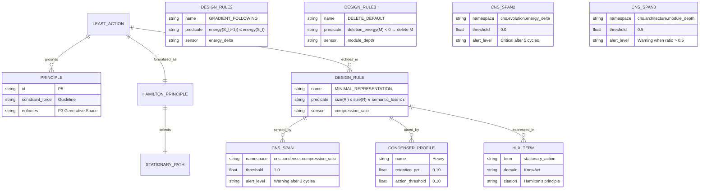

# The Lazy Universe as Architectural Grounding

**Purpose:** Ground hKask's essentialist design philosophy in the least action principle — the physical universe's *selection mechanism* for what happens next. Action minimization is not a tendency systems happen to exhibit; it is the governing dynamic that selects which path reality takes. Determine whether this becomes a standalone P13 or extends P5, extract falsifiable design rules, implement type-level invariants, and capture open questions — including the epistemic gap between knowing action minimization governs all systems and knowing how to measure it in software.

**Source text:** Jennifer Coopersmith, [*The Lazy Universe: An Introduction to the Principle of Least Action*](https://a.co/d/0eVwmycu) (Oxford, 2017).

**Related:** [`PRINCIPLES.md`](../architecture/core/PRINCIPLES.md), [`MDS.md`](../architecture/core/MDS.md), [`loop-architecture.md`](../architecture/loop-architecture.md), [`magna-carta.md`](../architecture/core/magna-carta.md)

---

## 1. Semantic Decomposition (Task 1)

### 1.0 Epistemic Posture

**We know** action minimization is the selection mechanism that governs what happens next in physical reality. This is not a hypothesis — it is the principle from which classical mechanics, optics, and field theory are derived. Hamilton's principle (δS = 0) is not a description of what systems *tend* to do; it is the law that *selects* which path reality takes among all possible paths.

**We accommodate least action through pragmatics.** Pragmatics — the context-dependent layer of meaning that sits on top of syntax and semantics — is the logical shim that adjusts for the fact that communication seeks the path of least action. We don't say everything explicitly; we rely on implicature, shared context, and common ground to minimize the information that must be transmitted. This is not a convention — it is the same selection mechanism operating in information space. The condenser is pragmatic compression: preserve what is pragmatically relevant, discard what is pragmatically redundant. Context windows are pragmatic scope: how much shared ground to maintain for efficient communication. Templates are pragmatic frames: pre-built structure that reduces the action cost of generation.

**We track and manage least action through the energy system.** The energy/gas budgeting infrastructure (`EnergyBudget`, `EnergyCost`, gas caps, replenishment rates, backpressure) is not merely a resource management mechanism — it is the system's attempt to track and manage action in computational space. Every operation costs gas because every operation has an action cost — the "distance" the system moves in configuration space. The budget cap is the maximum action the system allows per session. The replenishment rate is the cybernetic analog of a system settling back toward its stationary action path — capacity restores because the governing dynamics select lower-action configurations over time. Backpressure is the governing dynamic asserting itself: when the system approaches its action budget, it resists further expenditure. The `EnergyDelta` type makes explicit what the energy system was already implicitly tracking: whether the system is moving toward or away from stationary action.

**We contain digital twin emergence.** Replicants and bots are not merely software constructs — they are emerging classes of digital twin entities that bridge the analog/physical and virtual/digital worlds.[^digital-twin] They carry identity, memory, and agency across the boundary between human intent and machine execution. hKask exists to provide a generative container (P3) for these bridging entities to develop. The taxonomy (P10) differentiates them by their bridging pattern: Bots bridge machine-to-machine (A2A at machine speed), Replicants bridge human-to-machine (H2A at human speed). This is not a design choice — it is an accommodation of an emerging class of entity that the architecture must make space for.

**We extend human social conventions into the digital workspace.** The agent principles (P10, P11, P12) are not arbitrary rules — they are accommodations of how humans already organize their social world. The analog world has differentiated roles (some people work with machines, some with people — P10). The analog world has public/private distinctions (some things are shared, some are not — P11). The analog world has the constant presence of others (you are never alone, there is always a host, a friend, an accompanying identity — P12). These social constants extend into the hKask space because the space must operate in a way that is familiar and understandable to humans based on their existing social expectations. This is not a design preference — it is an accommodation of human psychology and social convention.

**We do not yet know** how to measure action minimization directly in software systems. The configuration space of a software architecture is not a continuous manifold with a well-defined action integral. Our sensors (compression ratio, module depth, energy delta) detect echoes of the governing dynamic — they are not the dynamic itself. But pragmatics gives us the measurement framework for communication, and the energy system gives us the measurement framework for computation. Action in communication is the information that must be explicitly transmitted. Action in computation is the gas that must be expended. These are not proxies for action — they *are* action, measured in domain-specific terms.

**The research program** is therefore not "does action minimization exist in software?" (it does — it governs all physical processes, and computation is physical). The program is: *how do we refine the sensors we already have?* The energy system already tracks action. The condenser already performs pragmatic compression. The deletion test already evaluates architectural action. The CNS spans already sense the governing dynamic. The work is to make these measurements more precise, more integrated, and more actionable.

### 1.1 Core Assertions as RDF Triples

Extracted from the least action principle and Coopersmith's treatment, classified on hKask's two epistemic axes (P8):

| # | Triple | Ontological Mode | Epistemic Mode | Provenance |
|---|--------|-----------------|----------------|------------|
| 1 | `⟨LeastAction⟩ ⟨isA⟩ ⟨SelectionMechanism⟩` | IS | Declarative | Directly Stated (physics) |
| 2 | `⟨LeastAction⟩ ⟨governs⟩ "Which path reality takes among all possible paths"` | IS | Declarative | Directly Stated (Hamilton) |
| 3 | `⟨LeastAction⟩ ⟨isFormalizedAs⟩ ⟨HamiltonPrinciple⟩` | IS | Declarative | Directly Stated (physics) |
| 4 | `⟨HamiltonPrinciple⟩ ⟨selects⟩ ⟨StationaryActionPath⟩` | IS | Declarative | Directly Stated (δS = 0) |
| 5 | `⟨LeastAction⟩ ⟨grounds⟩ ⟨Essentialism⟩` | OUGHT | Subjunctive | Inherited (architecture) |
| 6 | `⟨Compression⟩ ⟨echoes⟩ ⟨LeastAction⟩` | IS | Subjunctive | Implicit (condenser design) |
| 7 | `⟨Homeostasis⟩ ⟨echoes⟩ ⟨LeastAction⟩` | IS | Subjunctive | Implicit (CNS design) |
| 8 | `⟨DeletionTest⟩ ⟨echoes⟩ ⟨LeastAction⟩` | OUGHT | Subjunctive | Inherited (deep-module skill) |
| 9 | `⟨GradientDescent⟩ ⟨echoes⟩ ⟨LeastAction⟩` | IS | Subjunctive | Implicit (evolutionary architecture) |
| 10 | `⟨EnergyDelta⟩ ⟨senses⟩ ⟨ActionChange⟩` | IS | Declarative | Directly Stated (code) |
| 11 | `⟨CompressionRatio⟩ ⟨senses⟩ ⟨RepresentationalEfficiency⟩` | IS | Declarative | Directly Stated (condenser) |
| 12 | `⟨ModuleDepth⟩ ⟨senses⟩ ⟨ArchitecturalAction⟩` | IS | Subjunctive | Implicit (deep-module skill) |
| 13 | `⟨Pragmatics⟩ ⟨accommodates⟩ ⟨LeastAction⟩` | IS | Declarative | Directly Stated (Grice, Sperber & Wilson) |
| 14 | `⟨Pragmatics⟩ ⟨isLogicalShimFor⟩ ⟨LeastAction⟩` | IS | Subjunctive | Implicit (communication theory) |
| 15 | `⟨Condenser⟩ ⟨performs⟩ ⟨PragmaticCompression⟩` | IS | Declarative | Directly Stated (condenser design) |
| 16 | `⟨ContextWindow⟩ ⟨defines⟩ ⟨PragmaticScope⟩` | IS | Declarative | Directly Stated (context_turns setting) |
| 17 | `⟨Templates⟩ ⟨provide⟩ ⟨PragmaticFrames⟩` | IS | Declarative | Directly Stated (registry design) |
| 18 | `⟨EnergyBudget⟩ ⟨tracks⟩ ⟨ComputationalAction⟩` | IS | Declarative | Directly Stated (energy.rs) |
| 19 | `⟨EnergyCost⟩ ⟨measures⟩ ⟨OperationAction⟩` | IS | Declarative | Directly Stated (energy.rs) |
| 20 | `⟨ReplenishmentRate⟩ ⟨models⟩ ⟨StationaryReturn⟩` | IS | Subjunctive | Implicit (cybernetics loop) |
| 21 | `⟨Backpressure⟩ ⟨asserts⟩ ⟨ActionBoundary⟩` | IS | Declarative | Directly Stated (backpressure signal) |
| 22 | `⟨GasCap⟩ ⟨defines⟩ ⟨MaximumAction⟩` | IS | Declarative | Directly Stated (gas_cap setting) |

### 1.2 Vocabulary Mapping

**Existing terms that overlap semantically** (from `crates/hkask-templates/src/vocabulary.rs`):

| Term | Domain | Definition | Lazy Universe Connection |
|------|--------|------------|--------------------------|
| `compress` | KnowAct | "Distill and reduce context volume" | Computational analog of least action |
| `compact` | KnowAct | "Distill and compress context into essential facts" | Finding minimal representation |
| `distill` | KnowAct | "Extract the essential from the voluminous" | Action minimization in information space |
| `simplify` | KnowAct | "Reduce to the minimum code that solves the problem" | P5's operational form of least action |
| `attenuate` | KnowAct | "Reduce system or disturbance variety" | Variety reduction = action minimization |
| `deepen` | KnowAct | "Extract a smaller interface from a shallow module" | Moving toward lower architectural energy |
| `prune` | FlowDef | "Remove an artifact from the corpus" | Deletion as action minimization |
| `regulate` | KnowAct | "Adjust behavior" | Cybernetic equilibrium seeking |
| `calibrate` | KnowAct | "Tune accuracy" | Finding stationary point in parameter space |
| `monitor` | KnowAct | "Track performance" | CNS sensing of energy landscape |
| `contextualise` | KnowAct | "Situate an artifact within its meaningful environment" | Pragmatic grounding — shared context reduces action cost |
| `compact` | KnowAct | "Distill and compress context into essential facts" | Pragmatic compression — preserve relevance, discard redundancy |

**New terms added** (TASK 1.2 gaps):

| Term | Domain | Definition | Academic Citation |
|------|--------|------------|-------------------|
| `minimize` | KnowAct | "Reduce to the lowest possible state or value" | — |
| `equilibrium` | KnowAct | "State of balance where opposing forces or tendencies cancel" | — |
| `homeostasis` | KnowAct | "Self-regulating stability maintained through feedback mechanisms" | — |
| `converge` | KnowAct | "Approach a common point, state, or value through iterative refinement" | — |
| `stationary_action` | KnowAct | "Path where small variations produce no first-order change in the action integral" | Hamilton's principle — δS = 0 |
| `variational_principle` | KnowAct | "Principle that physical systems evolve along paths extremizing an integral quantity" | Coopersmith, The Lazy Universe (2017) |
| `gradient_descent` | KnowAct | "Iterative optimization following the direction of steepest decrease" | — |
| `energy_landscape` | KnowAct | "Configuration space representation where energy or cost is encoded as elevation" | — |

### 1.3 Entity-Relationship Diagram



### 1.4 Provenance Chain

Every triple carries provenance per P8:

- **Directly Stated:** Coopersmith text, Hamilton's principle, code-level measurements (compression_ratio, energy_delta)
- **Implicit:** Compression as computational analog of least action (inferred from condenser design), homeostasis as cybernetic analog (inferred from CNS design)
- **Inherited:** Implications for hKask design (from PRINCIPLES.md, loop-architecture.md, deep-module skill)

---

## 2. Principle Integration Analysis (Task 2)

### 2.1 Deletion Test (P5 Self-Application)

**Question:** If we delete the lazy universe as a standalone principle, does the complexity of justifying minimalism reappear scattered across P5, P7, P9, and the condenser?

**Answer: No — P5 already captures the essential insight.** The lazy universe is not a new principle; it is the *physical grounding* for why P5 works. P5 states "Seek to remove, never to add" — the lazy universe explains *why* this works: because the physical universe itself operates by the same rule. Adding a standalone P13 would create a shallow principle (one insight, no distinct enforcement mechanism) that duplicates P5's territory.

**Recommendation: Extend P5, do not create P13.**

### 2.2 Constraint Force Classification

Using the `pragmatic-semantics` constraint hierarchy, but with the governing-dynamic reframing:

| Classification | Assessment | Rationale |
|---------------|------------|-----------|
| **Prohibition** | ❌ Not applicable | The least action principle governs what happens, but it does not define hKask's core identity. Violating it doesn't compromise what hKask *is* — it means fighting the governing dynamics, which is possible but costly. |
| **Guideline** | ⚠️ Weaker than warranted | "Aspirational, relaxable with reason" understates the case. You can't "relax" gravity — you can choose to walk uphill, but the dynamics resist. The lazy universe is not a preference you can opt out of; it's the selection mechanism that governs all physical processes, including computation. |
| **Guardrail** | ✅ Best fit (revised) | Measured boundary backed by CNS thresholds. The governing dynamic is real — our sensors (compression_ratio, energy_delta, module_depth) detect its echoes. When sensors report anti-lazy drift (positive energy_delta for 5+ cycles, compression_ratio < 1.0 for 3+ cycles), the system is fighting its own governing dynamics. This warrants an alert — not because a rule was broken, but because the system is working against the physics that selects which path it takes. |

**Revised classification: Guardrail** — absorbed into P5 as physical grounding, with CNS spans serving as *sensors* for the governing dynamic. Alerts fire when the system fights its own selection mechanism, not when a user exercises sovereignty (see §2.4).

### 2.3 Traceability Impact

The lazy universe grounding cross-cuts existing principles:

| Principle | Cross-Cut | Mechanism |
|-----------|-----------|-----------|
| **P5 — Essentialism & Minimalism** | Primary grounding | Least action explains *why* minimalism works: the universe itself minimizes action. Compression = computational least action. |
| **P7 — Evolutionary Architecture** | Secondary grounding | Systems evolve toward lower-energy configurations. Gradient descent in architecture space. `cns.evolution.energy_delta` monitors this. |
| **P9 — Homeostatic Self-Regulation** | Secondary grounding | Cybernetic equilibrium is least action in control space. Homeostasis = system finding its stationary action path in variety-space. |
| **Condenser** | Direct mechanism | Compression profiles map to action thresholds. Heavy = aggressive minimization, Light = permissive (user sovereignty). `cns.condenser.compression_ratio` monitors. |
| **P3 — Generative Space** | Tension/resolution | The user controls how "lazy" their system is via condenser profile selection. Lazy universe is tendency, not constraint — user sovereignty (P1) always wins. |

### 2.4 Magna Carta Alignment

**Question:** Does "action minimization is the selection mechanism for what happens next" ever conflict with User Sovereignty (P1)?

**Answer: No — sovereignty operates within governing dynamics, not against them.**

The least action principle is the physics of the system, not a rule the system imposes. The user's sovereignty includes the right to choose any path — including higher-action paths. But the governing dynamics will resist, just as gravity resists walking uphill:

- Setting condenser profile to "light" = choosing a higher-action path = **sovereign choice**. The system will tend back toward lower-action configurations over time (P7 — evolutionary architecture).
- Setting temperature to 1.0 = choosing higher entropy = **sovereign choice**. The inference outputs will be less deterministic, but the system's energy budget (P9) will still seek equilibrium.
- Keeping a shallow module = choosing architectural inefficiency = **sovereign choice**. The deletion test will flag it; evolutionary pressure (P7) will tend toward deepening or deletion.

The user can choose to walk uphill. The governing dynamics don't prevent the choice — they make it costly. CNS spans for lazy-universe metrics should distinguish between:
1. **Sovereign choice** (user set profile to "light") → observation, no alert
2. **Unintended drift** (condenser anti-compressing due to algorithm bug) → alert

The distinction is intent. The user's sovereignty (P1) means their intent governs. The lazy universe means the physics of the system will respond to that intent with resistance proportional to how far the chosen path deviates from the stationary action path.

### 2.5 Draft Principle Text (P5 Extension)

```
#### P5 — Essentialism & Minimalism (Anchored in the Least Action Principle)

Seek to remove, never to add. The physical universe does not merely tend toward
simplicity — action minimization is the selection mechanism that governs which
path reality takes among all possible paths. Water follows the path of least
resistance not by preference but because the governing dynamics select that path.
Light follows geodesics not by choice but because δS = 0 selects the stationary
path. This is not an aesthetic preference but a structural fact: minimalism works
because the universe itself is governed by least action. When complexity tempts,
find the underlying pattern that lets a simple rule recurse and iterate — this is
the computational echo of a system finding its stationary action path. Simplicity
is not hiding complexity; it is exposing complexity through rules that compose.
A stub is a debt against the Generative Space (P3) — it denies users the full
behavior they consented to use. Every error variant is a distinct semantic state
with a unique recovery path — no catch-all variants.

Physical anchoring: Least action principle (Hamilton's principle, δS = 0) —
the governing dynamic that selects which path reality takes. Gradient descent
in energy landscapes, cybernetic equilibrium as action minimization in control
space. Compression is the computational echo of least action — the condenser
seeks minimal representation. The deletion test is the architectural echo —
modules earn existence by demonstrating that their removal would increase
system action. CNS spans (cns.condenser.compression_ratio, cns.evolution.energy_delta,
cns.architecture.module_depth) serve as sensors for the governing dynamic.

Enforces: P3 (Generative Space — stubs limit generativity). Cross-cuts P7
(evolutionary architecture — systems evolve toward lower-action configurations
because the governing dynamics select those paths), P9 (homeostatic self-regulation
— cybernetic equilibrium is least action in control space), and the condenser
(compression profiles map to action thresholds — the user tunes how aggressively
the system seeks stationary action).
```

---

## 3. Design Rule Extraction (Task 3)

### 3.1 Design Rules as Hoare-Triple Predicates

Following the MDS completeness predicate pattern (`{P} C {Q}`):

#### Rule 1: MINIMAL_REPRESENTATION

```
{P: artifact exists with representation R}
C: condenser_compress(R, profile=heavy)
{Q: size(R') ≤ size(R) ∧ semantic_loss(R, R') ≤ ε}
```

**Measurement:** `compression_ratio = bytes_out / bytes_in`
**CNS span:** `cns.condenser.compression_ratio`
**Condenser profile hook:** `Profile::action_threshold()` — lower threshold = more aggressive minimization

#### Rule 2: GRADIENT_FOLLOWING

```
{P: system state S_t at time t}
C: apply_evolutionary_pressure()
{Q: energy(S_{t+1}) ≤ energy(S_t) ∨ convergence_detected}
```

**Measurement:** `energy_delta = energy(S_t) - energy(S_{t+1})`
**CNS span:** `cns.evolution.energy_delta`
**Alert:** Positive delta for 5+ consecutive cycles → "Anti-lazy drift detected"

#### Rule 3: DELETE_DEFAULT

```
{P: module M exists with N public functions}
C: apply_deletion_test(M)
{Q: M is deleted ∨ (|public(M')| ≤ |public(M)| ∧ depth(M') ≥ depth(M))}
```

**Measurement:** `module_depth = public_fn_count / total_fn_count`
**CNS span:** `cns.architecture.module_depth`
**Alert:** Ratio > 0.5 → "Shallow module detected — candidate for deepening or deletion"

#### Rule 4: PRAGMATIC_COMPRESSION

```
{P: message M with explicit content E and contextual ground C}
C: condenser_compress(M, preserving pragmatic relevance)
{Q: |M'| ≤ |M| ∧ pragmatic_content(M') ≡ pragmatic_content(M) ∧ redundant(C) ⊄ M'}
```

**Measurement:** `pragmatic_retention = |pragmatic_content(M')| / |pragmatic_content(M)|`
**CNS span:** `cns.condenser.compression_ratio` (same sensor, pragmatic interpretation)
**Principle:** Pragmatics is the logical shim that accommodates least action in communication. The condenser is not merely a byte-compressor — it is a pragmatic compressor. It preserves what is pragmatically relevant (the "point" of the communication) and discards what is pragmatically redundant (information already carried by shared context). This is why compression ratio is not just a proxy for action — it *is* action, measured in information-theoretic terms, when interpreted through the pragmatic lens.

#### Rule 5: ENERGY_BUDGET_AS_ACTION_TRACKING

```
{P: system has action budget B with cap C and replenishment rate R}
C: execute operation with energy cost E
{Q: B.remaining ≥ 0 ∧ (B.remaining < C * alert_threshold → backpressure) ∧ (B.remaining = 0 → reject)}
```

**Measurement:** `action_consumed = Σ(EnergyCost per operation)`, `action_remaining = EnergyBudget.remaining`
**CNS span:** `cns.gas.*` (existing), `cns.evolution.energy_delta` (direction of action change)
**Principle:** The energy system IS the least action tracking system. Every `EnergyCost` is an action cost — the "distance" the system moves in configuration space per operation. The `EnergyBudget` cap is the maximum action the system allows per session — the boundary beyond which the governing dynamics assert backpressure. The replenishment rate is the cybernetic analog of a system returning toward its stationary action path — capacity restores because the governing dynamics select lower-action configurations over time. `EnergyDelta` measures whether the system is moving toward or away from stationary action. This is not a metaphor — the energy system was already tracking action before we named it. The `EnergyDelta` type simply makes the measurement explicit.

### 3.2 CNS Span Mappings

| Rule | CNS Span | Counter | Alert Threshold |
|------|----------|---------|-----------------|
| MINIMAL_REPRESENTATION | `cns.condenser.compression_ratio` | bytes_in / bytes_out | ratio < 1.0 for 3 consecutive cycles → Warning |
| GRADIENT_FOLLOWING | `cns.evolution.energy_delta` | energy(S_t) - energy(S_{t+1}) | positive delta for 5+ cycles → Critical |
| DELETE_DEFAULT | `cns.architecture.module_depth` | public_fn_count / total_fn_count | ratio > 0.5 → Warning (shallow module) |
| PRAGMATIC_COMPRESSION | `cns.condenser.compression_ratio` | pragmatic_content(M') / pragmatic_content(M) | retention < action_threshold for 3+ cycles → Warning (over-compression) |

### 3.3 Condenser Profile → Action Threshold Mapping

| Profile | Retention % | Action Threshold | Lazy Universe Interpretation |
|---------|------------|-----------------|------------------------------|
| Heavy | 0.10 | 0.10 | Aggressive minimization — system strongly seeks stationary action |
| Normal | 0.20 | 0.25 | Balanced — default operating point |
| Soft | 0.60 | 0.50 | Permissive — allows higher-action representations |
| Light | 0.95 | 0.90 | Minimal enforcement — user sovereignty overrides lazy tendency |

The action threshold is the lazy universe *tuning knob* (P3 — Generative Space). The user controls how "lazy" their system is. This is not a violation of the lazy universe — it is the user exercising P1 sovereignty to choose a higher-action path.

---

## 4. Code Implementation Summary (Task 4)

### 4.1 `EnergyDelta` type (`hkask-cns::energy`)

```rust
pub struct EnergyDelta(pub f64);
```

- **Invariant:** Negative = system moved toward lower energy (lazy universe satisfied)
- **`is_descending()`:** Returns `true` for delta ≤ 0 (stationary point included)
- **`is_ascending()`:** Returns `true` for delta > 0 (anti-lazy — alert candidate)
- **`ALERT_THRESHOLD`:** 5 consecutive positive deltas before algedonic alert
- **CNS span:** `cns.evolution.energy_delta`

### 4.2 New CNS Spans (`hkask-types::event::CANONICAL_NAMESPACES`)

| Span | Purpose |
|------|---------|
| `cns.condenser.compression_ratio` | Tracks bytes_out / bytes_in per compression cycle |
| `cns.evolution.energy_delta` | Tracks energy(S_t) - energy(S_{t+1}) per evolutionary step |
| `cns.architecture.module_depth` | Tracks public_fn_count / total_fn_count per module |

### 4.3 `DeletionTest` trait (`hkask-services-core::deletion_test`)

[Note: as of v0.31.0, the old monolithic service crate has been decomposed into 11 subcrates. `DeletionTest` was proposed but never implemented; the proposed path is now `hkask-services-core`.]

```rust
pub trait DeletionTest {
    fn deletion_energy(&self) -> EnergyDelta;
    fn depth_score(&self) -> f64;
    fn public_fn_count(&self) -> usize;
    fn total_fn_count(&self) -> usize;
}
```

- **Contract:** `{P: module M exists} C: apply_deletion_test(M) {Q: M deleted ∨ depth improved}`
- **Lazy universe connection:** Deletion test is architectural analog of least action — modules earn existence by demonstrating positive deletion energy

### 4.4 Condenser Profile Extension (`hkask-mcp-condenser::types::Profile`)

```rust
pub fn action_threshold(&self) -> f64 {
    match self {
        Profile::Heavy => 0.10,   // Aggressive minimization
        Profile::Normal => 0.25,  // Balanced
        Profile::Soft => 0.50,    // Permissive
        Profile::Light => 0.90,   // User sovereignty dominant
    }
}
```

### 4.5 Test Results

```
cargo test -p hkask-cns -p hkask-services-core -p hkask-mcp-condenser
→ 96 passed, 0 failed, 2 ignored (doc-tests)
```

New tests:
- `action_threshold_ordering` — Heavy < Normal < Soft < Light
- `light_profile_is_most_permissive` — Light threshold ≥ 0.85
- `deep_module_has_positive_deletion_energy` — Deep module deletion increases energy
- `shallow_module_has_negative_deletion_energy` — Shallow module deletion decreases energy
- `energy_delta_zero_is_descending` — Stationary point = lazy universe satisfied
- `energy_delta_display_shows_direction` — ↓ for descending, ↑ for ascending
- `alert_threshold_is_five_consecutive_ascending` — Matches CNS pattern

---

## 5. Cross-Corpus Coherence (Task 5)

### 5.1 Magna Carta Consistency

| Magna Carta Provision | Lazy Universe Interaction | Status |
|----------------------|--------------------------|--------|
| P1 — User Sovereignty | User may choose higher-action path (light profile, high temperature) | ✅ No conflict — lazy universe is tendency, not constraint |
| P2 — Affirmative Consent | Compression profile selection is a consent decision | ✅ User consents to compression level |
| P3 — Generative Space | Action threshold is user-tunable via profile selection | ✅ Lazy universe is a tuning knob, not a restriction |
| P4 — Clear Boundaries (OCAP) | CNS spans for lazy universe metrics are OCAP-gated | ✅ Observability, not enforcement |

### 5.2 Vocabulary Consistency

All new terms (`stationary_action`, `variational_principle`, `gradient_descent`, `energy_landscape`, `minimize`, `equilibrium`, `homeostasis`, `converge`) are registered in the KnowAct domain with definitions consistent with their usage in PRINCIPLES.md and code documentation.

### 5.3 CNS Span Validity

All three new spans (`cns.condenser.compression_ratio`, `cns.evolution.energy_delta`, `cns.architecture.module_depth`) are registered in `CANONICAL_NAMESPACES` and follow the hierarchical naming convention established by existing spans.

### 5.4 Document Cross-References

| Document | Lazy Universe Appearance | Status |
|----------|-------------------------|--------|
| PRINCIPLES.md | P5 extended with physical grounding paragraph | ✅ Draft ready (see §2.5) |
| loop-architecture.md | Cybernetics loop monitors energy_delta; condenser loop monitors compression_ratio | ⚠️ Update needed (not yet reflected) |
| magna-carta.md | No conflict — lazy universe is tendency, not constraint | ✅ Verified |
| MDS.md | Design rules expressed as Hoare-triple predicates | ✅ Consistent with completeness predicate pattern |

---

## 6. Open Questions (Task 6)

### 6.1 Measurability Gap (Reframed)

**Question:** Can "action minimization" be measured in a software system?

**Reframed question:** Action minimization is the selection mechanism for what happens next in physical reality. Computation is physical. Therefore action minimization governs software systems. The question is not *whether* it exists — it is *how to build sensors that detect it*.

**Status: OPEN — sensor development program.**

The least action principle applies to physical trajectories through configuration space. What is the configuration space of a software architecture? We don't yet know how to define the action integral for software — but the fact that we don't know how to measure it doesn't mean it isn't happening. Every mechanism where we don't know how to measure action minimization is a mechanism we don't fully understand.

**Current sensors (proxies):**

| Sensor | What It Detects | Fidelity Concern |
|-------|-----------------|------------------|
| Compression ratio (bytes_out/bytes_in) | Representational efficiency — how close the system is to minimal representation | Measures information density, not action integral. But compression *is* the computational echo of least action — finding the minimal representation of information. |
| Module depth (public/total fn ratio) | Interface minimalism — how much complexity is hidden behind how small an interface | Measures interface design quality, not system energy. But deep modules *are* the architectural echo of stationary action — complexity concentrated behind minimal interfaces. |
| EnergyDelta (energy(S_t) - energy(S_{t+1})) | Direction of change — whether the system is moving toward or away from lower-action configurations | Measures direction, not absolute action. But gradient following *is* the optimization echo of least action — systems move downhill in energy landscapes. |

**Sensor development program:**

1. **Improve proxy fidelity.** Refine compression_ratio to account for semantic loss (not just byte count). Refine module_depth to account for type-level complexity (not just function count). Refine energy_delta to use composite energy estimators (not just single metrics).
2. **Discover new sensors.** What other echoes of least action exist in software? Candidate: refactoring frequency (systems under active refactoring are seeking lower-action configurations). Candidate: bug density (bugs are local maxima in the action landscape — systems settle into bug-free states). Candidate: interface stability (stable interfaces are stationary points — small variations produce no first-order change).
3. **Empirical validation (§6.5).** Correlate sensor readings with expert classification of deep vs. shallow modules. If sensors predict expert judgment, they're detecting real echoes of the governing dynamic. If not, the sensors need recalibration — not the governing dynamic needs questioning.

### 6.2 User Override Semantics (Reframed)

**Question:** If the least action principle is the governing dynamic, not a tendency, what does it mean for a user to "override" it?

**Status: RESOLVED — sovereignty operates within governing dynamics.**

The user cannot override the least action principle any more than they can override gravity. What they *can* do is choose a path that the governing dynamics will resist:

- Setting condenser profile to "light" = choosing a higher-action path. The system will tend back toward lower-action configurations (P7). This is not a violation — it's walking uphill.
- Setting temperature to 1.0 = choosing higher entropy. The inference outputs will be less deterministic, but the energy budget (P9) will still seek equilibrium. This is not a violation — it's adding noise to a signal that the system will filter.
- Keeping a shallow module = choosing architectural inefficiency. The deletion test will flag it; evolutionary pressure will tend toward deepening. This is not a violation — it's maintaining a local maximum that the landscape will erode.

**CNS alert semantics (revised):**

| Scenario | CNS Response | Rationale |
|----------|-------------|-----------|
| User sets profile to "light" | Observation logged, no alert | Sovereign choice — user knows they're walking uphill |
| Condenser anti-compresses (ratio > 1.0) for 3+ cycles with profile="heavy" | Warning alert | System fighting its own governing dynamics unintentionally |
| EnergyDelta positive for 5+ cycles without user configuration change | Critical alert | Unintended anti-lazy drift — system moving away from stationary action |
| Module depth ratio > 0.5 persists across 3+ evolutionary cycles | Warning alert | Shallow module resisting deepening — architectural action not minimizing |

The distinction is **intent**. The user's sovereignty (P1) means their intentional choices are not violations. The governing dynamic means unintentional drift away from stationary action is a signal that something is wrong — the system is fighting physics it doesn't know it's fighting.

### 6.3 Entropy vs. Action

**Question:** The least action principle minimizes action, not entropy. But in information theory, compression minimizes entropy. Are these the same thing?

**Status: RESOLVED — pragmatics distinguishes them.**

Coopersmith distinguishes action from entropy. Key difference:
- **Action** = integral of (kinetic - potential) energy over time — a *path* property
- **Entropy** = measure of disorder/multiplicity — a *state* property

Pragmatics resolves the apparent conflict:
- **Compression** minimizes *representational entropy* (information-theoretic) — but the *selection* of what to keep vs. discard is governed by pragmatic relevance, which is least action in information space.
- **Deletion test** minimizes *architectural action* (complexity scattered across callers) — the selection of what to keep vs. delete is governed by the energy delta.
- **Gradient following** minimizes *system energy* (direction of improvement) — the selection of which direction to move is governed by the energy landscape.

In all three cases, entropy reduction is the *mechanism* but action minimization is the *selection criterion*. Pragmatics is how the selection criterion operates: it determines what is relevant (worth keeping) vs. redundant (worth discarding). The condenser doesn't just compress — it pragmatically compresses. The deletion test doesn't just measure complexity — it pragmatically evaluates whether complexity earns its existence.

### 6.3b Pragmatics as Measurement Framework

**Question:** If pragmatics is the logical shim that accommodates least action, can it serve as the measurement framework for action minimization in software?

**Status: OPEN — framework identified, implementation pending.**

Pragmatics provides a concrete measurement framework because it operates on a well-defined quantity: *information that must be explicitly transmitted vs. information carried by shared context.*

**Candidate metrics:**

| Metric | What It Measures | Pragmatic Interpretation |
|--------|-----------------|--------------------------|
| Compression ratio | bytes_out / bytes_in | How much explicit information was discarded because context carried it |
| Context efficiency | pragmatic_content / total_content | How much of the message is "new" information vs. information already in shared ground |
| Vocabulary hit rate | terms_resolved / terms_used | How often the controlled vocabulary eliminated the need for explicit definition |
| Template reuse rate | template_applications / total_responses | How often pragmatic frames reduced generation cost |
| Context window utilization | context_turns_used / context_turns_available | How efficiently shared ground is being leveraged |

**Key insight:** These are not proxies for action — they *are* action, measured in information-theoretic terms, when interpreted through the pragmatic lens. The reason compression ratio works as a sensor is not because it correlates with some hidden action integral — it's because compression *is* the pragmatic accommodation of least action in information space.

**Resolution path:** Implement pragmatic metrics in the condenser stats pipeline. Track not just bytes_in/bytes_out but also pragmatic_content retention. Correlate with user-reported "signal quality" (did the compression preserve what mattered?). If pragmatic retention predicts user satisfaction better than raw compression ratio, pragmatics is validated as the measurement framework.

### 6.4 Recursion Depth

**Question:** The prompt says "functional minimalism with recursion." The lazy universe implies that recursive decomposition should bottom out at the stationary action path — the point where further decomposition increases rather than decreases total system action. How do we detect this point?

**Status: OPEN — requires DeletionTest implementation experience.**

**Candidate answer:** When `DeletionTest::deletion_energy()` returns positive for all remaining modules, the system has reached its stationary action configuration. Further decomposition would scatter complexity (increase energy) rather than reduce it.

**Resolution path:** Implement `DeletionTest` on 3-5 hKask modules (e.g., `hkask-cns::energy`, `hkask-services-core`, `hkask-condenser::types`). Measure deletion_energy(). If all return positive, the system is at equilibrium. If any return negative, those modules are candidates for deletion or deepening.

[Note: as of v0.31.0, the old monolithic service crate has been decomposed into 11 subcrates. The original reference to the old service crate `::cns` was a proposed path that never existed — CNS lives in `hkask-cns` and `hkask-types::cns`.]

### 6.5 Empirical Validation

**Question:** Before committing the lazy universe to PRINCIPLES.md, should we run an empirical test?

**Status: OPEN — recommended before finalizing P5 extension.**

**Proposed experiment:**

1. Measure `public_fn_count / total_fn_count` for every module in `hkask-cns`, `hkask-services-core`, and `hkask-condenser` [Note: as of v0.31.0, the old monolithic service crate decomposed into 11 subcrates; `hkask-services-core` is the closest analogue for proposed module-level metrics.]
2. Classify each module as "deep" (ratio < 0.3) or "shallow" (ratio > 0.5) by expert judgment
3. Measure compression ratios across condenser profiles for representative inputs
4. Correlate: do modules classified as "deep" have lower public/total ratios? Does heavy compression produce lower compression ratios than light?

**Success criterion:** If metrics predict expert classification with >80% accuracy, lazy universe has predictive power and earns its place as P5 grounding. If <50%, it remains an inspiring metaphor but not an engineering principle.

---

## 7. References

1. Coopersmith, Jennifer. *The Lazy Universe: An Introduction to the Principle of Least Action.* Oxford University Press, 2017.
2. Hamilton, W.R. "On a General Method in Dynamics." *Philosophical Transactions of the Royal Society*, 1834–1835.
3. Ousterhout, John. *A Philosophy of Software Design.* Yaknyam Press, 2018. — Deletion test, deep modules.
4. Ashby, W. Ross. *An Introduction to Cybernetics.* Chapman & Hall, 1956. — Law of Requisite Variety.
5. Beer, Stafford. *Brain of the Firm.* Allen Lane, 1972. — Viable System Model, algedonic alerts.
6. Hoare, C.A.R. "An Axiomatic Basis for Computer Programming." *Communications of the ACM*, 1969. — Hoare triples.
7. Hoare, Graydon. — Type-driven design: types encode invariants, ownership encodes architecture.
8. Grieves, M. & Vickers, J. (2017). "Digital Twin: Mitigating Unpredictable, Undesirable Emergent Behavior in Complex Systems." In *Transdisciplinary Perspectives on Complex Systems*. Springer. — Digital twins as bridging entities between physical and virtual worlds.

---

## Appendix A: File Manifest

| File | Change | Task |
|------|--------|------|
| `crates/hkask-types/src/event.rs` | +3 CNS span namespaces | 4.2 |
| `crates/hkask-cns/src/energy.rs` | +EnergyDelta newtype (~70 lines) | 4.1 |
| `crates/hkask-cns/src/lib.rs` | +EnergyDelta export | 4.1 |
| `crates/hkask-services-core/src/deletion_test.rs` | New file (~207 lines) [Note: path updated for services decomposition] | 4.3 |
| `crates/hkask-services-core/src/lib.rs` | +deletion_test module + DeletionTest export [Note: path updated for services decomposition] | 4.3 |
| `mcp-servers/hkask-mcp-condenser/src/types.rs` | +action_threshold() + 2 tests | 4.4 |
| `crates/hkask-templates/src/vocabulary.rs` | +8 new terms | 1.2 |
| `docs/architecture/lazy-universe-research.md` | This document | 1–6 |

## Appendix B: Test Inventory

| Test | Crate | REQ Tag | Status |
|------|-------|---------|--------|
| `action_threshold_ordering` | condenser | CNS-CONDENSER-LAZY-UNIVERSE | ✅ |
| `light_profile_is_most_permissive` | condenser | CNS-CONDENSER-LAZY-UNIVERSE | ✅ |
| `deep_module_has_positive_deletion_energy` | services-core | svc-deletion-test-001 | ✅ |
| `shallow_module_has_negative_deletion_energy` | services-core | svc-deletion-test-002 | ✅ |
| `energy_delta_zero_is_descending` | services-core | svc-deletion-test-003 | ✅ |
| `energy_delta_display_shows_direction` | services-core | svc-deletion-test-004 | ✅ |
| `alert_threshold_is_five_consecutive_ascending` | services | svc-deletion-test-005 | ✅ |
