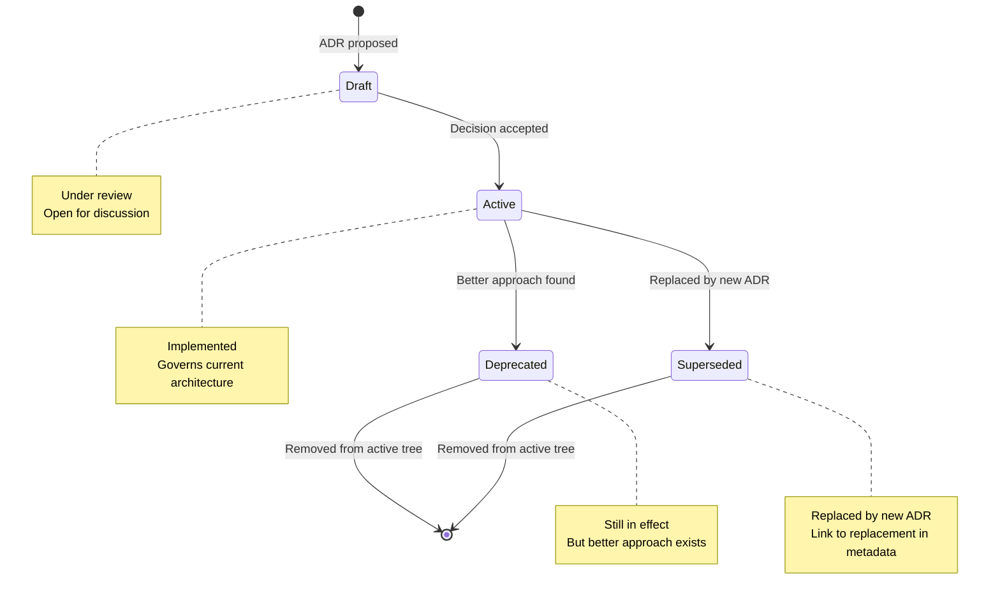

# ADR Template

**Purpose:** Standard template for Architecture Decision Records in hKask.

**Usage:** Copy this template to `docs/architecture/ADR-NNN-kebab-case-title.md` and fill in sections.

---

## Template

```markdown
---
title: "ADR-NNN: Title"
audience: [architects, developers, <domain-specific roles>]
last_updated: YYYY-MM-DD
version: "MAJOR.MINOR.PATCH"
status: "Draft | Active | Deprecated | Superseded"
domain: "Cross-cutting | Business | Data | Application | Technology"
---

# ADR-NNN: Title

**Date:** YYYY-MM-DD  
**Status:** Draft | Active | Deprecated | Superseded  
**Supersedes:** ADR-XXX (if applicable)

## Context

[Describe the forces at play, including technological, political, social, and project constraints. What is the issue that motivated this decision?]

**Problem Statement:** [One-sentence description of the problem]

**Stakeholders:** [List of affected parties]

**Constraints:** [Technical, organizational, or temporal constraints]

## Decision

[The response to those forces. The decision should be stated clearly and concisely.]

**Chosen Approach:** [Description of the solution]

**Alternatives Considered:**
1. [Alternative 1] — [Why rejected]
2. [Alternative 2] — [Why rejected]

**Rationale:** [Why this approach was chosen over alternatives]

## Consequences

### Positive

- [Benefit 1]
- [Benefit 2]
- [Benefit 3]

### Negative

- [Drawback 1]
- [Drawback 2]
- [Drawback 3]

### Neutral

- [Side effect 1]
- [Side effect 2]

## Compliance

### Constraint-Driven Design Principles

| Principle | Compliance | Evidence |
|-----------|-----------|----------|
| **P1** (No trait without two consumers) | ✅/❌ | [Evidence] |
| **P2** (No generic without two instantiations) | ✅/❌ | [Evidence] |
| **P3** (No module directory without encapsulation) | ✅/❌ | [Evidence] |
| **P4** (No builder without fallibility) | ✅/❌ | [Evidence] |
| **P5** (No feature flag without activator) | ✅/❌ | [Evidence] |
| **P6** (Delete stubs, don't publish) | ✅/❌ | [Evidence] |
| **P7** (Prefer deletion over deprecation) | ✅/❌ | [Evidence] |

### Constraints

| Constraint | Compliance | Evidence |
|-----------|-----------|----------|
| **C1** (Type worn before tailored) | ✅/❌ | [Evidence] |
| **C2** (Distinguish dead from unwired) | ✅/❌ | [Evidence] |
| **C3** (Unwired code has shelf life) | ✅/❌ | [Evidence] |
| **C4** (Repetition is missing primitive) | ✅/❌ | [Evidence] |
| **C5** (Every error variant is unique recovery path) | ✅/❌ | [Evidence] |
| **C6** (Stub is debt receipt) | ✅/❌ | [Evidence] |
| **C7** (Divergence must yield) | ✅/❌ | [Evidence] |

## Verification

[Commands to verify the decision was implemented correctly]

```bash
# Example verification commands
cargo check --workspace
cargo test --workspace
grep -r "pattern" crates/ | wc -l
```

**Expected Results:**
- [Result 1]
- [Result 2]

## Related Documents

- [Link to related ADR]
- [Link to architecture document]
- [Link to implementation plan]

## References

[^key]: Author, A. (Year). *Title*. Publisher. URL

---

*ℏKask — Planck's Constant of Agent Systems — v0.21.0*
```

---

## Guidelines

### When to Write an ADR

Write an ADR when:
- Making a significant architectural decision
- Changing an existing architectural decision
- Adopting a new technology or framework
- Establishing a new convention or pattern
- Resolving a major technical debate

Do not write an ADR for:
- Bug fixes
- Minor refactoring
- Documentation updates
- Dependency updates (unless breaking changes)

### ADR Numbering

ADRs are numbered sequentially with three-digit zero-padding:
- `ADR-001-first-decision.md`
- `ADR-002-second-decision.md`
- `ADR-022-comprehensive-security-hardening.md`

### ADR Lifecycle



<!-- DIAGRAM_ALIGNMENT
id: DIAG-ADR-001
verified_date: 2026-05-24
verified_against: docs/standards/DOCUMENTATION_STANDARDS.md §3 (Lifecycle)
status: VERIFIED
-->

### Writing Quality

ADRs must pass the Writing Excellence Protocol (3 of 4 tests):

| Test | Question | ADR Focus |
|------|----------|-----------|
| **Hopper** (Accessibility) | Can a zero-context reader understand the decision? | Clear problem statement, jargon-free |
| **Lovelace** (Precision) | Can a reader write a test from the decision? | Specific, verifiable consequences |
| **Schriver** (Findability) | Can a reader find the decision in 30 seconds? | Clear title, structured sections |
| **Gentle** (Agent-correctness) | Would an AI agent implement this correctly? | Unambiguous decision statement |

### Citation Requirements

ADRs must include at least one external citation per major section:
- **Context:** Cite the problem domain (e.g., security threat model, performance research)
- **Decision:** Cite the chosen approach (e.g., design pattern, framework documentation)
- **Consequences:** Cite trade-off analysis (e.g., academic papers, industry case studies)

See [`../standards/DOCUMENTATION_STANDARDS.md`](../standards/DOCUMENTATION_STANDARDS.md) §5 for citation format.

---

## Examples

### Good ADR Title
- `ADR-022-comprehensive-security-hardening.md` ✅
- `ADR-015-unified-capability-primitive.md` ✅
- `ADR-008-hexagonal-architecture.md` ✅

### Bad ADR Title
- `ADR-022-security.md` ❌ (too vague)
- `ADR-015-capabilities.md` ❌ (not specific)
- `ADR-008-architecture.md` ❌ (meaningless)

### Good Decision Statement
> Implement all 22 remediation tasks to establish a zero-trust, capability-based security model with comprehensive observability and federation support.

### Bad Decision Statement
> We decided to improve security. (too vague, no specifics)

### Good Consequence
> **Positive:** Zero-trust defaults enforced at all boundaries. No ambient authority. Every operation requires explicit capability presentation.

### Bad Consequence
> **Positive:** Better security. (no specifics, not verifiable)

---

## References

[^nygard-adr]: Nygard, M. (2011). *Documenting architecture decisions*. Relevance. http://thinkrelevance.com/blog/2011/11/15/documenting-architecture-decisions
[^kruchten-4plus1]: Kruchten, P. (1995). *The 4+1 View Model of Architecture*. IEEE Software.
[^togaf-adm]: The Open Group. (2022). *TOGAF Standard, 10th Edition — Architecture Development Method*.

---

*ℏKask — Planck's Constant of Agent Systems — v0.21.0*
*Decisions are the atoms of architecture.*
