## 1. Purpose

This standard governs every markdown document under `docs/`. It
operationalises the MDS taxonomy[^mds] and enforces the
non-negotiable biases of this project:

1. **Mermaid-First Visualization Mandate** — diagrams live inline in
   the documents they describe.
2. **Sourced-Ideas Mandate** — no claim presents itself as
   team-originated; every significant design choice carries a footnoted
   citation with a URL.
3. **Writing Excellence Mandate** — every document must pass at least
   three of the four perspective tests defined in the companion
   [`WRITING_EXCELLENCE.md`](WRITING_EXCELLENCE.md) protocol (Hopper,
   Lovelace, Schriver, Gentle).
4. **Stewardship Mandate** — documents that introduce, describe, or
   modify a context of participant collaboration honour the
   stewardship principles in [`PRINCIPLES.md`](../architecture/core/PRINCIPLES.md) §4.
    Specifically: declare the shared goal of the context (PS-01),
    document the bounded lexicon of its domain (PS-02), name the mode
    of play it supports (PS-03), and prefer invitational over
    imperative voice (PS-12). ADRs additionally include a Procedural
    Rhetoric section per PS-05.

The Writing Excellence protocol defines the voice, style, structural
discipline, and quality rubric for the corpus. It grounds itself in the work
of four women whose contributions to technical communication define
excellence: Grace Hopper (clarity as access), Ada Lovelace (precision as
vision), Karen Schriver (design for the reader), and Anne Gentle
(documentation as living system). The protocol is not aspirational — it
is the operational quality standard that governs publication decisions.

The metadata, diagram, citation, and writing excellence conventions below implement these biases. Violations block publication.

**Role:** This document is the verification gate. It confirms that documentation is correct and complete. [`MDS_SCAFFOLD.md`](MDS_SCAFFOLD.md) governs what to create and where to put it.

---

## 2. Metadata header (mandatory)

Every document directly under `docs/**` (excluding `archive/`) MUST
begin with YAML frontmatter delimited by `---` containing the following
six fields. The header format shown below uses the 5-category MDS taxonomy
per [`../architecture/MDS.md`](../architecture/core/MDS.md) §1:

```yaml
---
title: "Document Title"
audience: [role, list]
last_updated: YYYY-MM-DD
version: "MAJOR.MINOR.PATCH"
status: "Active"
domain: "Cross-cutting"
mds_categories: [domain, composition, trust, lifecycle, curation]
---
```

Conventions:

| Field | Rule |
|-------|------|
| Version | Semantic versioning[^semver]. MAJOR = breaking restructure; MINOR = substantive new content; PATCH = typo/correction. |
| Last-Updated | ISO 8601 date on every content-bearing edit[^iso8601]. |
| Status | Exactly one of the four values. `Deprecated` and `Superseded` documents are removed from the active tree (`git rm`) at the next review; git history is the canonical archive of record. A local `docs/archive/` snapshot may be kept on a maintainer's disk for personal reference but is gitignored. |
| Audience | Named roles; avoid "everyone." |
| MDS Categories | One or more of the 5 MDS categories defined in [`../architecture/MDS.md`](../architecture/core/MDS.md) §1: `domain`, `composition`, `trust`, `lifecycle`, `curation`. See [`MDS_SCAFFOLD.md`](MDS_SCAFFOLD.md) for category → directory mapping. Documents that spanned the deprecated 9-category DDMVSS taxonomy have been migrated; the old categories map as: `capability`→`trust`, `interface`→`composition`, `observability`→`lifecycle`, `persistence`→`lifecycle`. |
| Domain | Optional for cross-cutting documents; mandatory for domain-specific documents. |

## 3. Lifecycle

```mermaid
stateDiagram-v2
    [*] --> Draft
    Draft --> Active: first merged revision
    Active --> Active: content edits (PATCH/MINOR)
    Active --> Deprecated: replacement written
    Active --> Superseded: wholesale rewrite at new path
    Deprecated --> Removed: git rm in follow-up commit
    Superseded --> Removed: git rm; replacement carries Replaces: header
    Removed --> [*]
    note right of Removed
        Recoverable via
        git log --diff-filter=D
        + git show <sha>:<path>
    end note
```



<!-- DIAGRAM_ALIGNMENT
id: DIAG-STD-001
verified_date: 2026-05-24
verified_against: docs/standards/DOCUMENTATION_STANDARDS.md; .gitignore; docs/archive/
status: VERIFIED
-->

**Git history is the archive of record.** No archive index or migration guide is required. Superseded documents are removed from the active tree via lifecycle policy; their content is recoverable from git history. No active-tree document may include backward-compatibility references, migration notes, or `formerly`/`previously known as` annotations — git history serves this purpose permanently.

Git history is the project's Architecture Repository[^archrepo]. Retired
documents are recoverable through `git log --all --diff-filter=D -- <path>`
followed by `git show <sha>:<path>`. The `docs/archive/` directory is
gitignored and kept on disk for personal reference, organized by date
(`docs/archive/YYYY-MM-DD-<label>/`). Archived documents must not be
linked from the active tree. No active-tree document may describe retired
or removed subsystems — per [`AGENTS.md`](../../AGENTS.md) §2.4.

## 4. Mermaid diagrams

### 4.1 When a diagram is required

A Mermaid diagram[^mermaid] is required whenever the text describes any of:

| Concept | Preferred diagram type |
|---------|----------------------|
| Component relationships | `graph TD` / `flowchart` / C4 container |
| Sequence of interactions | `sequenceDiagram` |
| Lifecycle or state transitions | `stateDiagram-v2` |
| Data model | `erDiagram` |
| Class/type hierarchies | `classDiagram` |
| Project timeline | `gantt` |
| Decision branches | `flowchart LR` with diamonds |

The Mermaid specification is published at <https://mermaid.js.org/>.

### 4.2 DIAGRAM_ALIGNMENT metadata (required)

Every Mermaid block MUST be followed by an HTML comment of this form:

```html
<!-- DIAGRAM_ALIGNMENT
id: DIAG-<AREA>-<NNN>
verified_date: YYYY-MM-DD
verified_against: path/to/evidence[:line]
reference_sources: optional citation keys
status: VERIFIED | STALE | DEPRECATED
-->
```

The `id` is globally unique across the corpus and is registered in the diagram registry.
The `verified_against` field MUST cite a code file, a shipping
configuration, or an external canonical reference — not another prose
document. This convention is imported verbatim from the Peripheral
project's practice[^peripheral-diagrams], where it successfully prevented
diagram drift across a 3 290-line architecture specification.

### 4.3 Styling conventions

- Prefer `TD` (top-down) for component graphs, `LR` (left-right) for
  linear pipelines.
- Use GitHub-safe rendering — avoid experimental Mermaid features.
- Node labels: `[Type<br/>detail]` for two-line clarity.
- Subgraphs when logical grouping improves readability; otherwise avoid.
- Colours via Mermaid `style` statements, not CSS.

## 5. Sourced-Ideas Mandate

### 5.1 Rule

Every `##`-level section in any architecture, specifications, or
standards document that introduces a **design choice, convention,
pattern, or architectural claim** MUST reference at least one external
source via an APA 7th-edition footnote[^apa7]. Internal cross-references
do **not** satisfy this rule.

Sections that are **pure cross-reference tables** (traceability matrices,
phase-alignment tables, internal index-of-index sections) are scope-exempt
— they describe, not decide. A scope-exempt `##` section SHOULD include a
one-line annotation naming the authoritative sections it indexes, so the
exemption is visible to reviewers.

The rule codifies the Sourced-Ideas Mandate set out in the user prompt
that commissioned this corpus: *"No design choice, best practice, pattern,
or process is treated as originating from the team. Every significant
design choice, structure, abstraction, or convention must carry footnotes,
source citations, and web links…"* The "significant design choice" gate
is narrower than "every section"; this rule enforces the narrower gate.

### 5.2 Citation format

Footnote references use `[^key]` inline and definitions at the bottom of
the document:

```markdown
[^key]: Author, A. (Year). *Title* (edition). Publisher. https://url/path.
    Optional one-line annotation explaining why this source is cited here.
```

Acceptable source classes, in order of preference:

1. Peer-reviewed publications, standards documents (RFCs, ISO, IETF, W3C).
2. Primary-source books and academic papers with DOIs or stable URLs.
3. Reference implementations and specifications of named open-source projects.
4. Official documentation sites of named open-source projects.
5. Named authors' technical blog posts — acceptable for pattern-naming
   conventions (e.g., ADRs per Nygard).

Unacceptable:

- Marketing pages with no technical content.
- Wikipedia as the sole source for a claim.
- "Team convention" — every convention must trace to prior art.

### 5.3 Enforcement

The Portal README ([`../../README.md`](../../README.md)) lists the minimum
citation density per directory. Reviewers check by running
`grep -c '\[\^' <document>.md` and confirming ≥ 1 citation per `##`-level
section.

## 6. Document location policy

### 6.1 Rule

All specifications, reports, plans, decisions, and architectural documentation
MUST reside under `docs/` at the repository root. The only documentation
permitted inside crate directories (`crates/*/`)
is a `README.md` providing context to coding agents working in that crate.

This ensures:

- Centralised management of the specification corpus.
- No hidden or orphaned documentation scattered across workspace subtrees.
- A single search path for architectural decisions and design rationale.
- No duplication between crate-local docs and root docs.

### 6.2 What belongs where

For the authoritative MDS category → directory mapping, see [`MDS_SCAFFOLD.md`](MDS_SCAFFOLD.md) §2. The table below is a simplified content-type view:

| Content | Location |
|---------|----------|
| Specifications, design docs | `docs/specifications/` |
| Architecture Decision Records | `docs/architecture/` |
| Plans, roadmaps | `docs/plans/` |
| Standards, policies | `docs/specifications/` |
| Status reports, inventories | `docs/status/` |
| Crate coding context (brief) | `<workspace>/crates/<crate>/README.md` |

### 6.3 Enforcement

Any `docs/` directory found inside a crate (other than containing solely a
`README.md`) is a violation. Agents discovering such directories MUST relocate
the documents to the appropriate `docs/` subtree at the repository root and
remove the crate-level directory.

## 7. Naming conventions

Naming conventions below align with POSIX portable filename rules[^posix-filename] and with the Rust API Guidelines naming conventions[^rust-api-guidelines-naming] where applicable.

| Artifact | Naming rule |
|----------|-------------|
| Directory | Lowercase, singular or plural as semantically natural (`architecture/`, `plans/`, `archive/`) |
| Document | UPPER_SNAKE_CASE for canonical specifications; `README.md` per directory |
| ADR | `ADR-NNN-kebab-case-title.md`, three-digit zero-padded numbering |
| Diagram id | `DIAG-<AREA>-<NNN>` — area is a 3–10 letter scope tag (`STD`, `VISION`, `APP`, `DATA`, etc.) |
| Local archive snapshot | `docs/archive/YYYY-MM-DD-<label>/` — gitignored, kept on disk for personal reference |

## 8. Cross-references

Relative-path cross-referencing is the docs-as-code norm[^gentle-code]: portable across hosts, survives repository moves, and is machine-checkable.

Links are always relative. Use the forms shown below — `text` followed by
`(relative/path)` for files and `(relative/path:line)` for precise code
references. Absolute URLs are reserved for external citations (§5.2). Broken links fail the
verification gate. The active corpus must not link to `docs/archive/`
paths because that directory is gitignored — references to retired
content should either describe the content inline (with date and reason)
or point to git history (`git log --diff-filter=D -- <path>`).

```markdown
[Docs Like Code](https://www.docslikecode.com/)
<!-- Example relative links (update for your repository structure) -->
<!-- [REQUIREMENTS.md](../specifications/REQUIREMENTS.md) -->
<!-- [stack-domain-types](../../crates/hkask-types/src/lib.rs) -->
```

(Example paths above resolve against the `docs/standards/` directory. External
URLs like the first example are not checked by the link gate — only relative
cross-references within the repository are verified.)


## 9. Writing Excellence

The voice, style, and quality discipline for this corpus is defined in the
companion [`WRITING_EXCELLENCE.md`](WRITING_EXCELLENCE.md) protocol. That
document operationalizes four independent dimensions of documentation
quality — each grounded in the work of a woman who shaped the field:

| Dimension | Exemplar | Test |
|-----------|----------|------|
| Accessibility | Grace Hopper | Can a zero-context reader accomplish the task? |
| Precision | Ada Lovelace | Can a reader write a correct test from the spec alone? |
| Findability | Karen Schriver | Can a reader find their answer within 30 seconds? |
| Agent-correctness | Anne Gentle | Would an AI agent consuming this doc behave correctly? |

The publication standard is **3 of 4 dimensions passing**. Different
document types naturally emphasize different dimensions. Passing only 1 is
poor quality and blocks publication. See `WRITING_EXCELLENCE.md` §3 for
the full rubric, scoring guidance, and strongest-fit mappings per document
type.

Writing Excellence is integrated into the MDS curation process via two
mechanisms:

1. **`spec/curate/writing-excellence`** — Standalone assessment tool that
   evaluates a specification document against the 4-perspective test and
   returns `meets_publication_standard` and `blocks_publication` flags.
2. **`spec/curate/evaluate`** — When `writing_excellence` scores are provided
   in the request, the curation decision accounts for the publication
   standard. A document passing only 1 of 4 dimensions forces a `Discard`
   decision regardless of spec completeness.

## 10. Verification checklist

This checklist is the publication quality gate per Hackos's Information Process Maturity Model[^hackos-ipmm] Level 3 (Organised/Repeatable).

Before a document is merged:

- [ ] Six-field metadata header present and correct
- [ ] `MDS Categories` field present with ≥1 category
- [ ] Every `##` section has ≥ 1 footnoted citation with URL
- [ ] Every Mermaid block has a `DIAGRAM_ALIGNMENT` metadata comment
- [ ] All internal links resolve
- [ ] No aspirational content (if document is in `architecture/` or `status/`)
- [ ] `Last-Updated` date reflects the date of the final edit
- [ ] Writing Excellence: document passes ≥ 3 of 4 perspective tests (see [`WRITING_EXCELLENCE.md`](WRITING_EXCELLENCE.md) §3)
    - [ ] Hopper (accessibility) — zero-context reader can accomplish the task
    - [ ] Lovelace (precision) — reader can write a test from spec alone
    - [ ] Schriver (findability) — answer found within 30 seconds
    - [ ] Gentle (agent-correctness) — AI agent consuming doc would behave correctly
- [ ] No stale workspace/project names remain (grep for "Slate", "Discourse", old counts)

---

## 11. MDS Alignment

All architecture documents MUST map to at least one of the 5 MDS categories defined in [`../architecture/MDS.md`](../architecture/core/MDS.md) §1:

1. **Domain** — Bounded context, ν-events, entities, hLexicon terms
2. **Composition** — Registry, cascade rules, template types, MCP/CLI/API surfaces, equivalence matrix
3. **Trust** — Threat model, OCAP boundaries, keystore, capability tokens, attenuation policy
4. **Lifecycle** — Bootstrap, evolution, deprecation, CNS spans, variety counters, storage schema, memory pipelines, encryption
5. **Curation** — Evaluation gradient, coherence metric, curator authority, writing quality

These 5 categories consolidate the previous 9-category DDMVSS taxonomy. The mapping is: `capability`→`trust`, `interface`→`composition`, `observability`→`lifecycle`, `persistence`→`lifecycle`. Documents that used the 9-category taxonomy have been migrated.

### 11.1 Metadata Extension

Documents spanning multiple categories list all applicable categories in the metadata header using the `mds_categories` field:

```yaml
---
title: "Documentation Standards"
audience: [all contributors authoring or editing documentation in `docs/`]
last_updated: 2026-06-12
version: "0.27.0"
status: "Active"
domain: "Cross-cutting"
mds_categories: [domain, composition, trust, lifecycle, curation]
---
```

### 11.2 Verification

The verification checklist (§10) is extended with MDS alignment checks:

- [ ] Document maps to ≥1 MDS category
- [ ] `mds_categories` field present in metadata
- [ ] Category-specific completeness criteria addressed (see [`MDS.md`](../architecture/core/MDS.md) §2)

### 11.3 Category-Specific Requirements

| Category | Required Content | Verification |
|----------|-----------------|--------------|
| **Domain** | Bounded context, ν-event types, entity definitions | hLexicon terms allocated |
| **Composition** | Registry schema, cascade rules, template types, surface definitions, equivalence matrix | Template types documented; MCP ≡ CLI ≡ API verified |
| **Trust** | Threat model, mitigations, keystore config, OCAP policy, attenuation rules | STRIDE-lite analysis complete; capability grant table present |
| **Lifecycle** | Bootstrap sequence, evolution rules, deprecation policy, CNS span registry, storage schema, encryption config | All operations emit spans; bitemporal semantics documented |
| **Curation** | Decision gradient, coherence metric, writing quality assessment | Curator authority bounded; ≥3/4 writing dimensions passing |

### 11.4 Self-Application

This documentation standard itself maps to the 5 MDS categories:

- **Domain:** Documentation corpus, metadata schema, lifecycle states
- **Composition:** Cross-references, ADR template, diagram registry, markdown format, Mermaid diagrams, relative links
- **Trust:** Sourced-ideas mandate, citation density requirements, publication gates, verification commands
- **Lifecycle:** Git history, archive directory, lifecycle states (Draft → Active → Deprecated → Superseded → Removed), DIAGRAM_ALIGNMENT metadata, verification checklist
- **Curation:** Writing Excellence protocol (Hopper, Lovelace, Schriver, Gentle tests)

**Completeness:** 5/5 categories satisfied. This standard is MDS-complete.

---

## References

[^mds]: hKask Project. (2026). *MDS — Minimal Domain Specification*. <../architecture/MDS.md>. The 5-category structural taxonomy that classifies every document by its MDS category.

[^semver]: Preston-Werner, T. (2013). *Semantic Versioning 2.0.0*. <https://semver.org/>. The MAJOR.MINOR.PATCH convention adapted here for documentation.

[^iso8601]: International Organization for Standardization. (2019). *ISO 8601-1:2019 — Date and time — Representations for information interchange*. <https://www.iso.org/standard/70907.html>.

[^archrepo]: The Open Group. (2022). *TOGAF Standard, 10th Edition — Architecture Repository*. <https://pubs.opengroup.org/togaf-standard/adm-techniques/chap33.html>. Defines the Architecture Repository concept that `docs/archive/` implements.

[^mermaid]: Mermaid Contributors. (2024). *Mermaid — JavaScript-based diagramming and charting tool*. <https://mermaid.js.org/>. The diagramming DSL used throughout this corpus.

[^peripheral-diagrams]: Peripheral Project. (2026). *Mermaid Code Alignment Process*. Documented at `docs/MERMAID_CODE_ALIGNMENT_PROCESS.md` in the Peripheral repository. The origin of the DIAGRAM_ALIGNMENT metadata block adopted here.

[^apa7]: American Psychological Association. (2020). *Publication Manual of the American Psychological Association, 7th Edition*. APA. <https://apastyle.apa.org/products/publication-manual-7th-edition>. The citation style enforced throughout the corpus.


[^posix-filename]: IEEE & The Open Group. (2018). *POSIX.1-2017 — Portable Filename Character Set*. <https://pubs.opengroup.org/onlinepubs/9699919799/basedefs/V1_chap03.html#tag_03_282>.

[^rust-api-guidelines-naming]: The Rust Project. (2024). *Rust API Guidelines — Naming*. <https://rust-lang.github.io/api-guidelines/naming.html>.

[^gentle-code]: Gentle, A. (2017). *Docs Like Code*. Just Write Click. <https://www.docslikecode.com/>.

[^hackos-ipmm]: Hackos, J. (2006). *Information Development: Managing Your Documentation Projects, Portfolio, and People*. Wiley. Introduces the Information Process Maturity Model (IPMM) used as the publication-gate reference.
