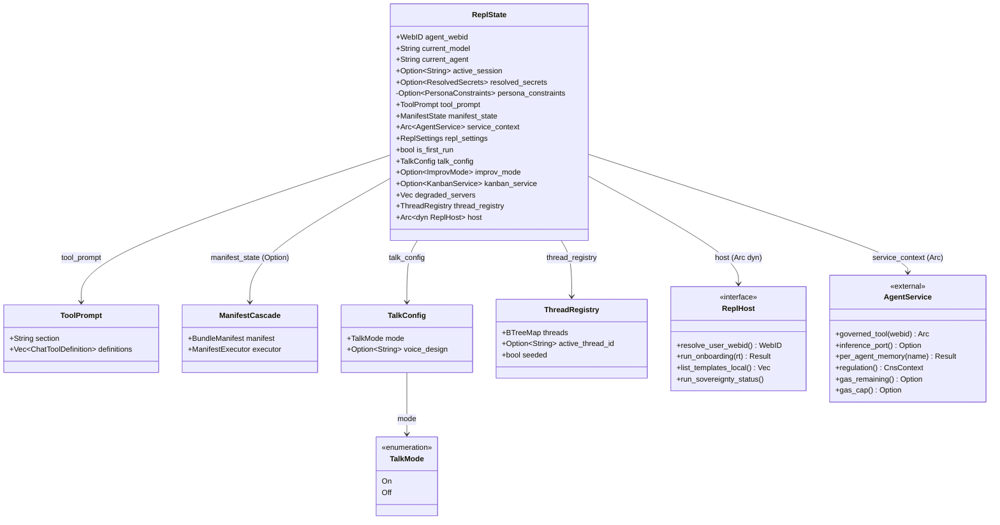
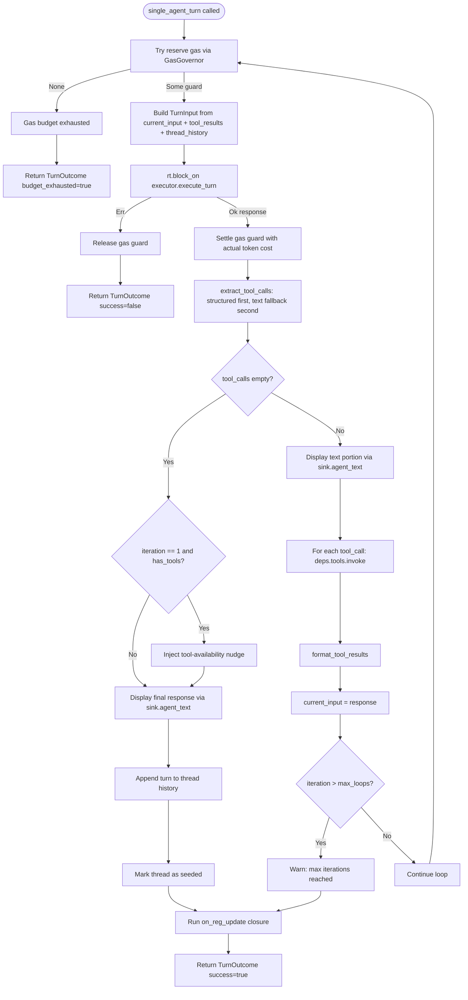
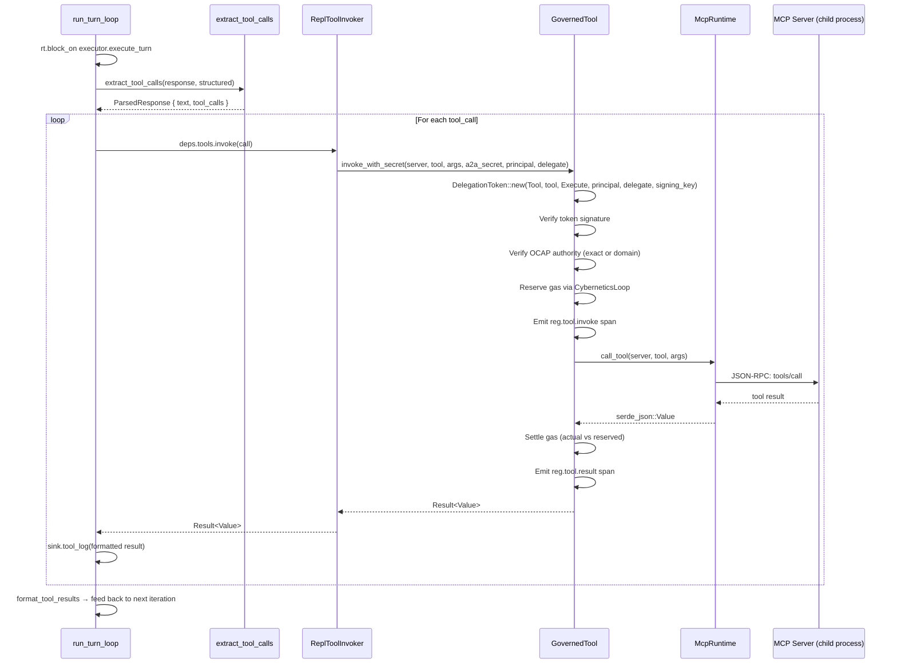

# hKask REPL Specification — `kask chat`

## 1. Purpose and Scope

This document is the authoritative specification for the hKask interactive REPL (Read-Eval-Print Loop). The REPL is accessed through a browser terminal (xterm.js + WebSocket) or optionally via SSH. The hKask server spawns `kask chat --webid <user>` on a PTY per authenticated user session, providing the human user's primary conversational interface — chat with LLMs, skills, and MCP tools — all governed by the Magna Carta's four principles of User Sovereignty, Affirmative Consent, Generative Space, and Clear Boundaries (OCAP). The project defers multi-agent ensemble sessions (2026-06-14) as a future mode evolving from the dual-presence pattern.

**Audience:** Architects, developers, users, and agents interacting with hKask.

**Scope:** Covers the REPL loop, slash command registry, single-agent turn pipeline, memory infrastructure, gas governance, inference configuration, tool-augmented execution, and future features toward parity with leading AI REPL providers (primarily Zed). Does NOT cover the HTTP API surface (`hkask-api`) or standalone CLI commands (`kask bundle`, `kask sovereignty`, etc.) except where they are directly invoked from the REPL. Multi-agent ensemble turn pipeline is deferred (2026-06-14); see §7 for forward-looking design notes.

**Alternative surface:** The WSS chat endpoint (`GET /api/v1/chat/ws`) provides a browser-compatible WebSocket-based streaming chat interface with MCP tool auto-discovery. See `docs/plans/wss-chat-endpoint.md` for the design and `crates/hkask-api/src/routes/chat_ws.rs` for the implementation.

## 2. Design Principles

### 2.1 User Sovereignty First (Magna Carta P1–P4)

Every design decision in the REPL grounds itself in the Magna Carta:

| Principle | REPL Implementation |
|-----------|-------------------|
| **P1: User Sovereignty** | Agent-specific SQLCipher-encrypted memory, WebID-scoped access, `/sovereignty` verification command |
| **P2: Affirmative Consent** | OCAP capability tokens minted per operation; GovernedTool membrane blocks unauthorized access |
| **P3: Generative Space** | `/repl` command exposes every inference parameter (temperature, top-p, top-k, min-p, typical-p, seed, max_tokens, gas limits, auto-condense). No hidden settings. No engineer-only options. |
| **P4: Clear Boundaries (OCAP)** | All tool invocations route through `GovernedTool` verifying unforgeable capability tokens; dual enforcement gate (`require_capability` + `require_sovereignty`) |

### 2.2 Familiarity Through Parity

The REPL adopts behavioral patterns from leading AI REPL systems so the interaction model feels natural:

- **Slash commands** (`/model`, `/agent`, `/help`) follow the convention established by ChatGPT, Claude, and others.
- **Tab completion** for slash commands via `rustyline`.
- **Fuzzy matching** on unknown commands (suggests "did you mean /model?") — pattern from Claude CLI.
- **Streaming output** on first inference iteration, with tokens rendered incrementally — pattern from Zed, Aider, GPT CLI.
- **History persistence** in `$XDG_DATA_HOME/hkask/kask_history.txt` — standard readline behavior.
- **Color-coded output** with ANSI escape codes for agent names, model info, Regulation alerts, gas budget, and tool results.

### 2.3 Self-Documenting

Every capability is discoverable from `/help`, which displays a categorized command menu. Each command has a detailed `/help <command>` page. Unknown commands trigger fuzzy-match suggestions.

### 2.4 Headless Constraint

Per PRINCIPLES.md P6, the REPL is strictly terminal-based. The browser terminal (xterm.js rendering a PTY over WebSocket) is a terminal emulator, not a visual web application. No dashboards, no Grafana/Prometheus stacks, no graphical UI. Output is rendered with ANSI codes and structured text. Code execution output (Phase 2+) uses terminal-appropriate MIME ranking, not GUI rendering.

## 3. Architecture

### 3.1 Crate Location

```
crates/hkask-repl/src/
├── lib.rs              # ReplState struct, main loop
├── commands.rs         # Slash command registry (SLASH_COMMANDS table)
├── display.rs          # Banner, help, command help
├── helper.rs           # KaskHelper (Completer, Highlighter, Hinter, Validator)
├── init.rs             # Dependency injection — wires Regulation, loops, memory, tools
├── turn.rs             # run_turn_loop() + TurnSink trait (CLI/TUI unified), single_agent_turn() wrapper
├── energy.rs           # EnergyGuard (hold-settle gas pattern, settle/release/Drop)
├── reg_display.rs      # Regulation algedonic alert display, loop system tick (read-only)
├── tool_augmented.rs   # Tool call parsing (extract_tool_calls), invocation, result formatting
├── builtin_servers.rs  # MCP server startup at REPL boot
└── handlers/
    ├── mod.rs          # Re-exports
    ├── agent.rs        # /agent, /agents
    ├── ask.rs          # /ask (session-aware agent query)
    ├── consolidation.rs # /consolidate
    ├── ensemble.rs     # /ensemble, /filter, /mode, /into — Deferred (2026-06-14)
    ├── escalation.rs   # /escalations, /resolve, /dismiss
    ├── info.rs         # /history, /pods, /templates, /tools
    ├── invoke.rs       # /invoke (OCAP-gated tool invocation)
    ├── model.rs        # /model (list, switch, fuzzy search)
    ├── repl_settings.rs # /repl (ReplSettings, to_llm_params)
    └── status.rs       # /status (agent, model, gas, Regulation, loops)
```

### 3.2 ReplState — Central State Object

All infrastructure (inference port, inference loop, episodic/semantic storage, governed tool) is accessed through `service_context: Arc<AgentService>` — the canonical assembly point. The REPL no longer holds these as direct fields. Three sub-structs group paired state:

- `TalkConfig { mode: TalkMode, voice_design: Option<String> }` — `mode` is an enum (`On`/`Off`), not a `bool`, so the on/off decision is explicit at the type level. Set together via `/talk`.
- `ManifestState = Option<ManifestCascade>` — a type alias. `ManifestCascade { manifest, executor }` bundles both fields so the "both present" invariant is enforced by construction: the invalid state `Some(manifest) + None(executor)` is unrepresentable.
- `ToolPrompt { section: String, definitions: Vec<ChatToolDefinition> }` — refreshed together during MCP discovery.

```rust
pub struct ReplState {
    pub agent_webid: WebID,                              // Derived from agent name
    pub current_model: String,                           // Active model name
    pub current_agent: String,                           // Active agent name (from onboarding)
    pub active_session: Option<String>,                  // Future multi-agent session ID
    pub resolved_secrets: Option<ResolvedSecrets>,       // From onboarding (redacted in Debug)
    persona_constraints: Option<PersonaConstraints>,     // Private — loaded from agent YAML
    pub tool_prompt: ToolPrompt,                         // MCP-discovered tool section + definitions (cache)
    pub manifest_state: ManifestState,                   // Option<ManifestCascade> — None or both present
    pub service_context: Arc<AgentService>,              // Canonical infrastructure assembly
    pub repl_settings: ReplSettings,                     // User-configurable parameters (P3)
    pub is_first_run: bool,                              // Onboarding gate
    pub talk_config: TalkConfig,                         // /talk on|off|voice
    pub improv_mode: Option<ImprovMode>,                 // /improv posture
    pub kanban_service: Option<KanbanService>,           // Lazy /kanban
    pub degraded_servers: Vec<(String, String)>,         // Failed auto-start servers
    pub thread_registry: ThreadRegistry,                 // /thread management
    pub host: Arc<dyn ReplHost>,                         // CLI bridge (WebID, onboarding, templates)
}
```

**Design Intent:** `init::init_repl_state()` initializes `ReplState` once at REPL boot and mutates it in place across turns. One field remains private: `persona_constraints` (loaded from agent YAML, not mutated after init). A manual `Debug` impl redacts `resolved_secrets`, `manifest_state`, `service_context`, and `host` so the central state object can be inspected in diagnostics without leaking secrets or hitting non-Debug trait-object bounds. History access routes through OCAP-gated episodic storage via `ChatService::recall_recent_turns()`. `is_first_run` gates the First Steps guide shown in the welcome banner. The `tool_prompt` cache exists because `ToolPort` uses `impl Trait` returns (not dyn-compatible); re-derive when MCP servers start/stop.

#### ReplState Type Hierarchy (DIAG-REPL-002)



<!-- DIAGRAM_ALIGNMENT
id: DIAG-REPL-002
verified_date: 2026-07-20
verified_against: crates/hkask-repl/src/lib.rs:100-159; crates/hkask-services-context/src/context_impl.rs:103-474
status: VERIFIED
-->

**Design notes:**

- **`ManifestState` is a type alias** for `Option<ManifestCascade>`, not a struct. This enforces the "both present or both absent" invariant at the type level — the invalid state `Some(manifest) + None(executor)` is unrepresentable.
- **`TalkMode` is an enum**, not a `bool`. The `enabled: bool` field was replaced with `mode: TalkMode` so the on/off decision is explicit at the type level.
- **`tool_prompt` is a cache.** It exists because `ToolPort` uses `impl Trait` returns, making `Arc<dyn ToolPort>` infeasible. The cache is refreshed during MCP server start/stop.
- **`host: Arc<dyn ReplHost>`** bridges the REPL crate to the CLI binary. The REPL crate cannot depend on `hkask-cli` (dependency direction violation), so `ReplHost` is a trait implemented by `CliHost` in `hkask-cli`.

### 3.3 Dependency Injection (init.rs)

The `init_repl_state()` function assembles the REPL's dependency graph in order:

1. **Phase 1 — Onboarding:** `host.run_onboarding(rt)` — interactive userpod creation and model selection. Sets `is_first_run`, `resolved_secrets`, `signed_in_agent`, `selected_model`.
2. **Phase 2 — Settings + Condensation Env:** Load persisted `ReplSettings` from per-user config. Propagate `condense_pressure_threshold` and `condense_saliency_window` to env vars (`HKASK_CONDENSE_*`) so both condensation paths (auto-condense in `ChatService` and agent-initiated condenser tools) share the same thresholds.
3. **Phase 4 — Service Config:** Build `ServiceConfig` from onboarding secrets (propagating `HKASK_MASTER_KEY` and `HKASK_DB_PASSPHRASE` to env) or fall back to `from_env()` / `in_memory()`.
4. **Phase 5 — WebID + Skills:** Derive `agent_webid` from the onboarding persona via `WebID::from_persona_with_namespace`. Load skills from `.agents/skills/` and `skills/` into the registry.
5. **Phase 6 — Shared Infrastructure:** `AgentService::build(service_config)` — creates Regulation, loop system, governed tool, pod manager, MCP runtime, storage. Wait for CuratorPod readiness (non-fatal on failure).
6. **Phase 6 (cont.) — InferenceLoop:** Build `InferenceLoop` with energy budget and model. Register on loop system. Wire into `AgentService` via `set_inference_loop`.
7. **Phase 7 — UserPod Env:** Propagate `HKASK_PROJECT_ROOT`, `HKASK_MCP_HOST`, `HKASK_USERPOD_PERSONA` to env for child MCP processes.
8. **Phase 7.5 — Daemon Auto-Start:** Probe the daemon socket; spawn `kask daemon start` as a detached child if no live listener. Non-fatal on failure — MCP servers fall back to direct mode.
9. **Phase 8 — Core MCP Server Auto-Start:** Start all `BUILTIN_SERVERS` except those in `CORE_EXCLUDED` (currently `companies`, `communication`, `training`, `replica` — 4 servers requiring explicit opt-in via `/mcp start`). 12 servers auto-start. A `debug_assert!` verifies every `CORE_EXCLUDED` entry exists in `BUILTIN_SERVERS` to prevent phantom exclusions.
10. **Phase 10 — Energy Budget + Well + Wallet:** Register gas budget with `CyberneticsLoop`. Create default Well if none exists. Create gas wallet for the userpod if none exists.
11. **Phase 12 — Assemble ReplState:** Construct the `ReplState` struct with all fields. `manifest_state` starts as `None`.
12. **Phase 13 — Tool Discovery:** Query `GovernedTool::discover_tools()` and populate `tool_prompt` (section + definitions).
13. **Phase 14 — Agent Definition + Process Manifest:** Load agent YAML from storage or disk. Extract `persona_constraints`. If a `process_manifest` is defined, resolve it and build a `ManifestCascade` (manifest + executor).
14. **Phase 15 — Model Metadata:** Populate `model_meta` from the model catalog.

**Note:** The WebID is derived from the onboarding persona (not a `--webid` flag). Onboarding uses the configured inference providers. All state (config, memory, history) is scoped to the authenticated WebID.

## 4. Input Loop

### 4.1 Readline Configuration

```
- History: $XDG_DATA_HOME/hkask/kask_history.txt
- Ignore duplicates: true
- Ignore space-prefixed lines: true
- Completion type: List (inline)
- Prompt format: ℏKask [agent_name]>  (default)
```

### 4.2 Slash Command Detection

Inputs starting with `/` are intercepted before inference. The dispatch logic in `commands::handle_slash_command()`:

1. Strip leading `/`
2. Split into `cmd arg1 arg2` (max 3 parts)
3. Match against `SLASH_COMMANDS` table
4. On no match → fuzzy search across primary names, aliases, and descriptions → "did you mean:"

### 4.3 Natural Language → Inference

Inputs not starting with `/` and not matching `"quit"` / `"exit"` are treated as natural language prompts. These route to either:
- `turn::single_agent_turn()` — always (ensemble turn pipeline deferred 2026-06-14)

### 4.4 SIGINT / EOF / Error Handling

| Signal | Behavior |
|--------|----------|
| `Ctrl+C` (SIGINT) | Print hint: "(Ctrl+C — type /quit to exit)" |
| `Ctrl+D` (EOF) | Print "Goodbye!", save history, exit |
| Readline error | Print error, save history, exit |

## 5. Slash Command Registry

All 28 slash commands with aliases, categorized as shown in `/help`:

### 5.1 Session Commands

| Command | Aliases | Args | Description |
|---------|---------|------|-------------|
| `/help` | `/h`, `/?` | `[COMMAND]` | Show help, or details for a specific command |
| `/quit` | `/q`, `/exit` | | End the session |
| `/clear` | `/cls` | | Clear the screen |
| `/history` | `/hist` | | Show session history (turn count + response previews) |

### 5.2 Agent Commands

| Command | Aliases | Args | Description |
|---------|---------|------|-------------|
| `/agent` | `/a` | `[NAME]` | Switch agent (loads persona constraints), or show current |
| `/agents` | `/ls` | | List registered agents (name, kind, capabilities) |
| `/pods` | | | List agent pods (pod ID, state, WebID) |

### 5.3 Model Commands

| Command | Aliases | Args | Description |
|---------|---------|------|-------------|
| `/model` | `/m` | `[NAME\|QUERY]` | Switch model, fuzzy search, or show current. Populates model metadata (context window, thinking support, capabilities) |

**Sub-behaviors:**
- `/model` (no args) → show current model name
- `/model list` → list all available models (name, family, params, size)
- `/model qwen3:8b` → exact match → switch to that model, show metadata
- `/model qwen` → fuzzy match → list all models containing "qwen"
- `/model foobar` → no match → store name anyway (Okapi may be unreachable)

### 5.4 Ensemble Commands — Deferred (2026-06-14)

Ensemble multi-agent commands are deferred. The dual-presence pattern (§7) is the active multi-agent path. Ensemble will evolve from dual-presence learnings when N≥3 stable sessions with distinct ACP agents are achieved.

**Original specification (preserved for future reference):**

| Command | Aliases | Args | Description |
|---------|---------|------|-------------|
| ~~`/into`~~ | ~~`/i`~~ | ~~`[SESSION]`~~ | ~~Enter ensemble session, or leave it (no args = leave)~~ |
| ~~`/ensemble`~~ | ~~`/ens`~~ | ~~`sessions\|create\|join\|send\|invite\|participants`~~ | ~~Multi-agent ensemble operations~~ |
| ~~`/filter`~~ | ~~`/thresh`~~ | ~~`[0.0-1.0]`~~ | ~~Set/show participation threshold (default: 0.75)~~ |
| ~~`/mode`~~ | | ~~`[freeform\|curator_led\|round_robin]`~~ | ~~Set/show ensemble orchestration mode~~ |
| `/ask` | | `<AGENT> <MESSAGE>` | Force a specific agent to respond (bypasses relevance filter) |

**Deferred (2026-06-14):** ensemble removed. Future multi-agent mode will evolve from dual-presence.

~~**Ensemble subcommands:**~~
~~- `/ensemble sessions` — list active ensemble sessions~~
~~- `/ensemble create <id>` — create a new ensemble chat session~~
~~- `/ensemble join <session> <bot> <role>` — register a bot with role (memory_bot, spandrel_bot, okapi_bot, scholar_bot)~~
~~- `/ensemble invite <bot> [role]` — invite agent into current session~~
~~- `/ensemble participants` — show participants in current session~~
~~- `/ensemble send <session> <message>` — send message to a session~~

~~**Orchestration modes:**~~
~~- `freeform` (default) — agents self-select by relevance confidence~~
~~- `curator_led` — Curator picks which agents speak~~
~~- `round_robin` — all agents speak in turn~~

### 5.5 System Commands

| Command | Aliases | Args | Description |
|---------|---------|------|-------------|
| `/status` | `/st` | | System status: agent, model, template, gas, Regulation health, loop count, turns |
| `/tools` | | | List MCP tools with descriptions (discovered via GovernedTool) |
| `/templates` | `/tpl` | | List registered templates (ID + type) |
| `/sovereignty` | `/sov` | | Show sovereignty status (Magna Carta compliance) |
| `/invoke` | `/inv` | `<server>/<tool> [args]` | Invoke MCP tool through GovernedTool membrane |
| `/bundle` | `/b` | `[SKILLS]\|list\|off\|skills` | Compose, apply, or manage skill bundles |
| `/repl` | | `[SETTING] [VALUE]` | Show or set REPL inference settings |
| `/thread` | `/th` | `list\|switch <id>\|new [title]\|archive <id>` | Manage chat threads — short-term memory across sessions |

### 5.6 Governance Commands

| Command | Aliases | Args | Description |
|---------|---------|------|-------------|
| `/escalations` | `/esc` | | List pending escalations (ID, bot, confidence, context) |
| `/resolve` | | `<ID>` | Resolve an escalation |
| `/dismiss` | | `<ID>` | Dismiss an escalation |
| `/metacognition` | `/meta` | | Run a metacognition cycle (Curator self-reflection) |

### 5.7 Alignment Commands

| Command | Aliases | Args | Description |
|---------|---------|------|-------------|
| `/consolidate` | `/cons` | `[LIMIT] [--floor CONFIDENCE] [--max MAX_TRIPLES]` | Trigger episodic→semantic consolidation |

### 5.8 Onboarding and Feedback Commands

| Command | Aliases | Args | Description |
|---------|---------|------|-------------|
| `/start` | `/tour`, `/onboarding` | | Interactive step-by-step guided tour (9 steps, press Enter to advance, type `skip` to exit) |
| `/feedback` | | | Prompt for a free-text usability note; appended with UTC timestamp + userpod name to `~/.local/share/hkask/feedback.md` |

**`/start` detail:** Each step covers one capability domain: Chat, Commands, Models, Status, Tools, Settings, Memory, Done. Always available — not only on first sign-in. `/tour` and `/onboarding` are aliases. The interactive tour is the same flow that runs automatically on first OAuth sign-in; it can be re-run at any time.

**`/feedback` scope:** REPL-only. Not exposed via CLI subcommand or HTTP API. The file is append-only; each entry is a Markdown `##` heading with ISO-8601 UTC timestamp and a blockquote body. Nothing is transmitted anywhere. Feedback is stored per-user under the authenticated WebID's data directory.

## 6. Single-Agent Turn Pipeline

The turn pipeline is now split between the service layer and the CLI:

- **`ChatService::execute_turn()`** (in `hkask-services-chat`) handles: manifest cascade,
  history suffix, inference via `ChatService::chat()`, and persona filter.
- **CLI (`turn::run_turn_loop()` via `TurnSink`)** handles: gas guard reservation/settlement,
  response display (stdout for CLI, capture buffer for TUI), tool execution through `GovernedTool`,
  token usage display, gas budget warnings, and Regulation updates. `single_agent_turn()` and
  `single_agent_turn_captured()` are thin wrappers that select the sink implementation.

### 6.1 Pipeline Overview



<!-- DIAGRAM_ALIGNMENT
id: DIAG-REPL-001
verified_date: 2026-07-20
verified_against: crates/hkask-repl/src/turn.rs:130-307
status: VERIFIED
-->

**Key properties:**

- **Gas regulation:** Every iteration reserves a heuristic estimate, then settles with the actual token cost. On inference error, the reservation is released (no cost incurred). The `EnergyGuard` logs a warning if dropped without settle/release (panic recovery).
- **Tool call priority:** Structured native function calls (`InferenceResult.tool_calls`) are checked first; `<<tool:...>>` text directives are the fallback. This supports both modern models (native function calling) and legacy models (text directives).
- **Thread seeding:** The thread is marked seeded only on successful (non-error) turns. Subsequent turns skip thread history injection — episodic recall handles conversation context.
- **Regulation update:** The `on_reg_update` closure runs after the loop exits, checking algedonic alerts and ticking the LoopScheduler. This is the cybernetic feedback path from the turn back to the regulator.
- **Max iterations:** When `max_loops` is exceeded, the loop yields the current response (not an error). This prevents infinite tool-call loops from blocking the REPL indefinitely.

**Pipeline stages (text summary):**

1. **Manifest Cascade (optional)** — Execute agent's `process_manifest` → enrich prompt with `step_*` ctx
2. **History Injection (suffix pattern)** — Append recent N turns via OCAP-gated `recall_recent_turns()`; suffix placement preserves KV cache hits for system prompt
3. **Inference via `ChatService::chat()`** — Agent lookup, system prompt, semantic recall, LLM call; returns text + token usage + structured tool calls
4. **Persona Filter** — `apply_persona_filter()` strips forbidden patterns
5. **Gas Guard (per-iteration)** — `EnergyGuard::try_reserve()` → inference → settle(actual); on inference error, `release()` returns reservation to budget
6. **Tool Execution (via GovernedTool + OCAP)** — Parse structured tool calls from `TurnResult`; execute through `GovernedTool` membrane; if tool calls found → feed results back to `execute_turn()`; if no tool calls → final response, exit loop
7. **Token Usage Display** — `N tokens (P prompt + C completion) across M iterations`
8. **Gas Budget Warning** — If < 20%: yellow warning. If 0: red exhausted warning.
9. **Regulation Update (read-only)** — Algedonic alert check, `LoopScheduler` tick
10. **Episodic Storage** — Handled by `ChatService::chat()` automatically; stores `(user_input, agent_name, response)` as episodic hMem

**Note:** Auto-condense (87.5% threshold) is implemented in `ChatService::execute_turn()` via direct condenser library call. When context exceeds 87.5% of the model window, the oldest half of history is condensed and replaced with a summary.

### 6.2 Tool Call Parsing (Two Priority Levels)

The REPL supports two tool call formats, checked in priority order:

**Priority 1 — Structured Native Function Calling:**
When `InferenceResult.finish_reason == "tool_calls"`, the structured `tool_calls` list is used directly. No text parsing required.

**Priority 2 — Text Directive Fallback:**
```
<<tool:server/tool_name
{"key": "value"}
>>
```

The parser (`tool_augmented::parse_tool_calls()`) is forgiving:
- If a directive is malformed (invalid JSON, missing tool name), it is treated as plain text
- Multiple tool calls in a single response are supported
- Server is optional (parsed from `server/tool_name` syntax or empty string for discovery)

### 6.3 Tool Call Invocation

All tool calls route through `GovernedTool`, which provides:

1. **OCAP Authorization:** A `DelegationToken` is minted from the session's ACP secret
2. **Energy Budget:** Gas is charged for tool execution
3. **Regulation Observability:** Tool invocations emit `reg.tool.*` spans

The invocation chain: `ReplToolInvoker::invoke()` → `GovernedTool::invoke_with_secret()` → `RawMcpToolPort` (implements `ToolPort` for `McpRuntime`) → `McpRuntime::call_tool()` → MCP server (JSON-RPC). The `GovernedTool::invoke_with_secret` method mints the `DelegationToken` internally from the A2A secret — the previous `tool_augmented::invoke_tool_call` free function was inlined to collapse the chain.



<!-- DIAGRAM_ALIGNMENT
id: DIAG-REPL-003
verified_date: 2026-07-20
verified_against: crates/hkask-repl/src/deps.rs:262-293, crates/hkask-regulation/src/governed_tool.rs:199-230, crates/hkask-mcp/src/dispatch.rs:52-107
status: VERIFIED
-->

**Security properties:**

- **OCAP Authorization:** `GovernedTool::invoke_with_secret` mints the `DelegationToken` internally from the A2A secret. The token binds the resource (`DelegationResource::Tool`), the tool name, the action (`DelegationAction::Execute`), the principal WebID (user), and the delegate WebID (agent). The token is signed with `derive_signing_key(a2a_secret)`.
- **A2A Secret Handling:** The secret is stored as `ZeroizingSecret` in `ReplToolInvoker` and passed as `&[u8]` to `invoke_with_secret` — no secret bytes are copied into the token-minting path.
- **Gas Charging:** `GovernedTool` reserves gas before invocation and settles with the actual cost after. This is separate from the inference gas reservation — tool calls have their own energy accounting.
- **Regulation Observability:** Every tool invocation emits `reg.tool.invoke` and `reg.tool.result` spans.
- **Two Parse Paths:** `extract_tool_calls` checks structured native function calls first, then falls back to `<<tool:...>>` text directives.

**What was removed:** The previous invocation chain had 6 Rust-side layers: `ReplToolInvoker` → `tool_augmented::invoke_tool_call` → `GovernedTool::invoke` → `RawMcpToolPort` → `McpRuntime` → MCP server. The `tool_augmented::invoke_tool_call` free function (21 lines of token-minting) was inlined into `GovernedTool::invoke_with_secret`, collapsing the chain to 4 layers. The `RawMcpToolPort` adapter remains (it implements the `ToolPort` trait for `McpRuntime`), but could be eliminated in a future refactor by having `McpRuntime` implement `ToolPort` directly.

### 6.4 Tool Results → Followup

When tool calls are found:
```
[text portion of response]

The following tool calls were executed:

✓ tool_name → {result JSON}
✗ tool_name → ERROR: {message}

Based on these results, provide your response.
```

This followup prompt is fed back into the next loop iteration.

### 6.5 Streaming Behavior

The REPL turn loop uses `ChatService::execute_turn()` uniformly across all iterations — there is no longer a split between streaming (iteration 1) and non-streaming (iteration 2+). The previous `chat_with_agent_streaming_with_params()` path has been removed.

- **CLI (stdout):** The full response text is printed after each iteration via `TurnSink::agent_text()`. There is no incremental token streaming to the terminal.
- **TUI:** `start_inference()` spawns a background thread that runs `single_agent_turn_captured()`. The full response text is published to the `streaming_text` buffer once the turn completes — the TUI polls this buffer each frame. The previous implementation faked streaming by chunking the text 3 chars at a time with an 8ms sleep; this was removed because it added latency without value. Real incremental streaming would require wiring `InferencePort::generate_stream_with_model()` through the turn loop.
- **Tool loop followups:** Each iteration's response is displayed via the sink before tool calls are invoked. The final response (no tool calls) is the one persisted to thread history.

## 7. Ensemble (Multi-Agent) Turn Pipeline — Deferred (2026-06-14)

Ensemble multi-agent turn pipeline is deferred. The dual-presence pattern (see `docs/specifications/dual-presence-pattern.md`) is the active multi-agent path. Ensemble will evolve from dual-presence learnings.

**Original specification (preserved for future reference):**

~~When `active_session` is set, user messages route through `turn::ensemble_turn()`:~~

~~1. Calls `ensemble_improv_turn()` — agents self-select by relevance confidence (freeform mode) or follow the configured mode~~
~~2. For each agent that chose to speak, tool-augmented processing is applied~~
~~3. Responses display with confidence score: `AgentName (conf. 0.85): response text`~~
~~4. Agents that were silent display a dim footnote: `AgentName: silent (0.42 — below threshold)`~~
~~5. If a Curator synthesis is produced, it is displayed in gold: `Curator: synthesis`~~
~~6. All responses (including silent judgments) are recorded in session history~~

**Reactivation criterion:** When dual-presence has produced N≥3 stable sessions with distinct ACP agents.

## 8. REPL Settings (`/repl` command)

Per Magna Carta P3 (Generative Space), every inference parameter is user-exposed. The `/repl` command surfaces and mutates all settings.

### 8.1 Settings Table

| Setting | Flag | Type | Default | Valid Range | Description |
|---------|------|------|---------|-------------|-------------|
| `tool_loop_limit` | `loops` | u64 | 21 | 1+ | Max tool-call loop iterations per turn |
| `condense_saliency_window` | `saliency`, `context` | usize | 5 | 1–50 | Short-term memory recency window (thread history, episodic recall, condensation anchor) |
| `condense_pressure_threshold` | `pressure` | f32 | 0.875 | 0.5–0.99 | Context fill fraction that triggers auto-condensation |
| `short_term_memory_life` | `stm_life` | u32 | 60 | 0+ (0 = never) | Days before inactive threads auto-archive |
| `temperature` | `temp` | f32 | 0.7 | 0.0–2.0 | LLM sampling temperature |
| `top_p` | `top_p` | f32 | 0.9 | 0.0–1.0 | Nucleus sampling threshold |
| `top_k` | `top_k` | u32 | 40 | 1+ | Top-k token filter |
| `min_p` | `min_p` | f32 | 0.0 (disabled) | 0.0–1.0 | Min-p threshold |
| `typical_p` | `typical_p` | f32 | 0.0 (disabled) | 0.0–1.0 | Typical-p (locally typical sampling) |
| `max_tokens` | `max_tokens` | u32 | 512 | 1+ | Maximum completion tokens |
| `seed` | `seed` | Option<u32> | None (random) | u32 or "off" | Deterministic seed |
| `gas_heuristic` | `gas_heuristic` | u64 | 500 | 1+ | Per-turn gas reservation estimate |
| `gas_cap` | `gas_cap` | u64 | 10,000 | 1+ | Total session gas budget |
| `auto_condense` | `auto_condense` | bool | true | on/off | Auto-condense when context pressure exceeds threshold |

`condense_saliency_window` and `condense_pressure_threshold` also propagate to the condenser MCP server via `HKASK_CONDENSE_*` env vars, so agent-initiated condensation tools respect the same user-configured thresholds.

### 8.2 Model Metadata (Read-Only)

Populated automatically when switching models via `/model`:

| Field | Source | Description |
|-------|--------|-------------|
| `context_length` | Okapi `/api/show` | Model's context window in tokens |
| `supports_thinking` | Okapi `/api/show` | Whether model supports `<thinking>` tags |
| `capabilities` | Okapi `/api/show` | Model capability flags (e.g., vision, tools) |

### 8.3 Persistence

Settings are persisted to `~/.config/hkask/settings.json` whenever a valid setting is changed. This ensures CLI and API surfaces share the same configuration. The file is JSON-serialized from `ReplSettings` (via serde).

### 8.4 Usage Examples

```
/repl                     # Show all settings
/repl temp 0.3            # Set temperature to 0.3
/repl context 5           # Keep 5 turns of history
/repl seed 42             # Deterministic output
/repl seed off            # Random seed
/repl auto_condense off    # Manual condensation only
/repl reset               # Reset all to defaults
```

## 9. Memory Infrastructure

### 9.1 Memory Architecture

Agents have three memory layers, structurally invariant:

| Layer | Scope | Storage | Purpose |
|--------|-------|---------|---------|
| **Thread (short-term)** | Per-thread, per-agent | `agents/{name}/threads/{uuid}.json` | Active conversation stream — the agent's immediate context |
| **Episodic (long-term)** | Private, agent-scoped | SQLCipher `memory.db` | First-person process memory — all sessions, all threads |
| **Semantic (long-term)** | Public, shared | SQLCipher `memory.db` | Third-person facts — consolidated knowledge hMems |

Context assembly order (invariant):
```
[Thread history] → [Semantic facts] → [Episodic history] → [User input]
```

Thread history is injected only on cold starts (session restart or thread switch).
After the first turn, episodic recall provides conversation context. The short-term
memory recency window is controlled by `condense_saliency_window` (default 5).

### 9.2 Thread Management (`/thread`)

Threads persist across sessions in `agents/{name}/threads/`. Each thread is a
self-contained JSON file with metadata and conversation turns (capped at 200).

```
/thread list              — Show all threads with status (active/archived)
/thread switch <prefix>   — Resume a thread by UUID prefix
/thread new [title]       — Start a fresh thread
/thread archive <prefix>  — Toggle archive/activate
```

Auto-archival runs on session start based on `short_term_memory_life` (default
60 days). Threads inactive longer than this are automatically archived.

### 9.3 Memory Flow Per Turn

1. **Before inference:** Thread history (cold starts only), semantic recall, episodic recall
2. **During inference:** Retrieved context is incorporated into the prompt
3. **After inference:** Exchange stored in episodic memory (long-term) AND appended to active thread (short-term)

### 9.4 Consolidation (`/consolidate`)

User-triggered episodic→semantic consolidation via `ConsolidationService`:

```
/consolidate                           # Show status (candidates, h_mem counts, low-confidence)
/consolidate run                       # Execute with defaults (limit 100)
/consolidate 50                        # Limit 50 hMems
/consolidate run --floor 0.5           # Confidence floor 0.5
/consolidate run --max 500             # Max 500 semantic hMems
/consolidate run -f 0.33 -m 200 -l 50 # All flags combined
```

The service shares the same underlying DB connection as the storage ports, so consolidation operates on the agent's actual hMems.

### 9.5 Fallback

If the per-agent DB cannot be opened (e.g., wrong passphrase), the REPL falls back to an in-memory database with a warning message. Consolidation works on the in-memory DB.

## 10. Gas Governance (EnergyGuard)

### 10.1 Hold-Settle Pattern

Every inference turn and tool invocation follows a two-phase gas accounting pattern:

1. **Hold (Reserve):** Before starting work, reserve a heuristic estimate of gas
2. **Settle:** After work completes, reconcile with the actual token cost

This is encapsulated in `EnergyGuard`, an RAII guard that:
- Checks `can_proceed()` before reserving
- Stores the heuristic amount
- Settles actual cost after successful inference (`settle(actual)`)
- Releases the reservation on inference failure (`release()`) — no actual cost incurred
- Syncs `InferenceLoop` from the L6 CyberneticsLoop budget (on settle only)
- Logs a warning via `Drop` if neither `settle()` nor `release()` was called (e.g., panic)

### 10.2 Energy Budget Configuration

Each agent gets an gas budget registered with the `CyberneticsLoop` at REPL init:

```
Budget:    gas_cap (default 10,000)
Replenish: gas_cap / 10 per replenishment cycle
Alert:     80% usage → yellow Regulation alert
Hard limit: true (blocks operations when exhausted)
```

### 10.3 User-Visible Gas Display

```
/status → Gas: ■ 7500/10000 (75%)
After turn → [Gas budget low: 1500/10000 (15%)]  (yellow warning)
After turn → [Gas budget exhausted — some operations may be throttled]  (red)
```

## 11. Model Management

### 11.1 Model Discovery

Models are discovered through Okapi (the inference gateway, built on llama.cpp). The `/model` command queries Okapi's model registry.

### 11.2 Model Switching

Switching models via `/model <name>`:
1. Searches Okapi for the model name (exact or fuzzy match)
2. Updates `state.current_model`
3. Fetches model metadata (context window, thinking support, capabilities)
4. Populates `state.repl_settings.model_meta` for auto-condense threshold calculation
5. The `InferencePort` is NOT recreated — Okapi handles model routing internally

### 11.3 Model Metadata

```rust
struct ModelMeta {
    context_length: u32,      // Model's maximum context window
    supports_thinking: bool,  // Whether model supports <thinking> tags
    capabilities: Vec<String>, // e.g., ["vision", "tools", "json_mode"]
}
```

This metadata feeds into:
- Auto-condense threshold (87.5% of `context_length`)
- Future: thinking mode toggle, JSON mode selection

## 12. Tool-Augmented Inference

### 12.1 Tool Discovery

At REPL init, `GovernedTool::discover_tools()` queries the MCP runtime for all registered tools. Results are formatted into a system prompt section:

```
## Tool Calls
You have access to MCP tools. When you need to invoke a tool, use:

<<tool:server/tool_name
{"key": "value"}
>>

**memory:**
- memory_store — Store memories
- memory_recall — Recall memories
...

You may include multiple tool calls in a single response.
```

### 12.2 Built-in MCP Servers (16)

The canonical registry is `hkask_mcp::BUILTIN_SERVERS` — 16 servers total. 12 auto-start at REPL boot; 4 require explicit opt-in via `/mcp start` (P2: Affirmative Consent).

| Server ID | Binary | Auto-start? | Purpose |
|-----------|--------|-------------|---------|
| `memory` | `hkask-mcp-memory` | yes | Semantic + episodic memory operations |
| `condenser` | `hkask-mcp-condenser` | yes | Context condensation (compress, thread_summary). Respects `HKASK_CONDENSE_*` env vars. |
| `research` | `hkask-mcp-research` | yes | Web search, extraction, and feed-based research |
| `curator` | `hkask-mcp-curator` | yes | Curator daemon — metacognition, curation |
| `media` | `hkask-mcp-media` | yes | Media generation (image, video, audio, 3D) |
| `docproc` | `hkask-mcp-docproc` | yes | Unified document processing (format conversion, OCR, chunking, parsing) |
| `kanban` | `hkask-mcp-kata-kanban` | yes | Kanban board coordination |
| `skill` | `hkask-mcp-skill` | yes | Skill discovery, status, publishing, auditing |
| `filesystem` | `hkask-mcp-filesystem` | yes | Filesystem read/write/search + shell command execution |
| `codegraph` | `hkask-mcp-codegraph` | yes | Code graph query, traverse, impact analysis |
| `scenarios` | `hkask-mcp-scenarios` | yes | Scenario planning and forecasting |
| `regulation` | `hkask-mcp-regulation` | yes | Regulation observability and alerting |
| `companies` | `hkask-mcp-companies` | **no** | Company financial data (FMP + EODHD dual-provider) |
| `communication` | `hkask-mcp-communication` | **no** | Thin MCP wrapper over core communication crate |
| `training` | `hkask-mcp-training` | **no** | Model training data ingestion |
| `replica` | `hkask-mcp-replica` | **no** | Style embedding and prose composition |

Servers that fail to start are logged and skipped — their tools simply won't be available. Failed servers appear in the session banner as degraded capabilities.

**Auto-start policy:** The `CORE_EXCLUDED` list in `init.rs` defines the 4 opt-in servers: `companies`, `communication`, `training`, `replica`. A `debug_assert!` verifies every `CORE_EXCLUDED` entry exists in `BUILTIN_SERVERS` to prevent phantom exclusions (a previous version referenced `fal` and `fal-workflow`, which do not exist in `BUILTIN_SERVERS`).

Condensation configuration (`condense_saliency_window`, `condense_pressure_threshold`)
is set via `/repl` and propagated to the condenser MCP server at REPL init via
`HKASK_CONDENSE_SALIENCY_WINDOW` and `HKASK_CONDENSE_PRESSURE_THRESHOLD` env vars.
This ensures agent-initiated condenser tools and automatic context condensation
share the same user-configured thresholds rather than diverging silently.

### 12.3 Direct Tool Invocation (`/invoke`)

Users can bypass agent-mediated tool calls and invoke tools directly:

```
/invoke web_search '{"query": "Rust async patterns"}'
/invoke condenser/condenser_compress '{"output": "..."}'
/invoke memory_store
```

All invocations route through `GovernedTool` with OCAP token minting and Regulation observability.

## 14. Regulation Integration

After each turn, `reg_display::update_reg_and_display()` executes:

1. **Prompt Variety Sensing:**
   - Depth bucket (shallow/medium/deep) → `reg.inference.prompt_depth`
   - Structure (question/imperative/declarative/conditional) → `reg.inference.prompt_structure`
   - Topic keywords → `reg.inference.prompt_domain`

2. **Algedonic Alert Check:**
   - Queries `RegulationLedger::critical_alerts()`
   - Displays alerts with deficit/threshold values
   - Deficits > threshold/2 (50) → escalate to Curator
   - Deficits > threshold (100) → escalate to human

3. **LoopScheduler Tick:**
   - Runs `LoopScheduler::tick()` — sense→compare→compute→act cycle
   - `CyberneticsLoop` reads Regulation variety + gas budgets → produces regulatory actions
   - Regulatory actions are logged via tracing (visible with `RUST_LOG=reg.cybernetics=debug`)

## 15. Welcome Banner

The REPL displays an animated Kask amphora logo on startup:

```
  __              ___________    __
 /  \            /  \  .:::.  /  \
|    |          |    |           |    |
 \__/           |    |    KASK   |    |
                |    |           |    |
                 \__/~~~~~~~~~~~\__/
  shadow           hKask v0.31.0

     A Sovereign Chat Client for Human Users
```

The eyes animate through center → right → center → left gaze positions over ~1.4 seconds.

**Info row (returning user):**
```
Agent: {name}  Model: {model}  Template: {template}
/help for commands  <TAB> autocomplete  /quit exit
```

**First Steps guide (first sign-in only):** When `ReplState.is_first_run` is `true` (set on first OAuth sign-in when a new WebID and default userpod are provisioned), the compact one-liner is replaced with an expanded guide:

```
  ━━ First Steps ━━━━━━━━━━━━━━━━━━━━━━━━━━━━━━━━━━
  Getting started:
  • Just type to chat — your userpod is ready
  • /help    — see all available commands
  • /model   — switch models anytime
  • /tools   — discover available MCP tools
  • /status  — check system health and energy
  • /repl    — customize inference settings

  Try: "What can you help me with?"
  Type /start for a guided tour.
  ━━━━━━━━━━━━━━━━━━━━━━━━━━━━━━━━━━━━━━━━━━━━━━━━━
```

Returning users see the compact one-liner only. `is_first_run` is `false` for all returning sessions.

## 16. Autocomplete and Help System

### 16.1 Tab Completion (`KaskHelper`)

- Slash commands: Tab-completes from the `SLASH_COMMANDS` table (primary names + aliases)
- Dimmed hint text shows the remainder of the matched command
- Highlights completed slash commands in cyan

### 16.2 Help System

**`/help` (no args):** Categorized menu:
```
Session    — help, quit, clear, history
Agent      — agent, agents, pods
Model      — model
System     — status, tools, templates, sovereignty
Governance — escalations, resolve, dismiss, metacognition
Onboarding — start, feedback
```

**`/help <command>`:** Detailed page with usage examples, subcommands, and tips.

**Fuzzy fallback:** Unknown commands trigger fuzzy matching across primary names, aliases, and descriptions. Suggests up to 5 matches.

## 17. Session History

Session history is no longer stored in-memory. Instead, all history access routes
through OCAP-gated episodic storage:

- **Storage:** Each chat exchange is persisted as an episodic hMem via `ChatService::store_episodic()` after inference
- **Recall:** History is retrieved via `ChatService::recall_recent_turns()`, which queries
  `EpisodicStoragePort` with a `DelegationToken` bearing `Read` on `Manifest`
- **Display:** `/history` calls `recall_recent_turns()` with `usize::MAX` to retrieve all turns
- **Context:** The per-turn pipeline appends recent turns as a suffix after the current input
  (preserving system prompt KV-cache hits)

This replaces the previous `SessionHistory` / `Turn` in-memory ring buffer.
The correct fix was deletion, not patching: `SessionHistory` duplicated data
already persisted in `EpisodicStoragePort`.

## 18. Auto-Condense

Auto-condense triggers at configurable pressure threshold during `ChatService::execute_turn()`. After appending recent conversation history as a suffix via `recall_recent_turns()`, the pipeline checks if the approximate token count exceeds `condense_pressure_threshold` (default 87.5%) of `context_window`. When triggered, it fetches raw episodes via `recall_raw_episodes()`, splits them by `condense_saliency_window` (keep most recent N exchanges verbatim), and calls `InferencePort::generate_with_model()` directly to condense the oldest half into a structured summary. The history suffix is replaced with `[Condensed history]` + `[Recent conversation]` blocks. Graceful degradation: if the condenser call fails or returns empty, the full uncondensed context is used with no error surfaced to the user.

Enabled by default (`auto_condense: on`). Toggle via `/repl auto_condense off` or the API settings endpoint. Configure pressure threshold (`/repl pressure 0.9`) and saliency window (`/repl saliency 10`).

**Path unification (v0.31.0):** The same `condense_saliency_window` and `condense_pressure_threshold` settings propagate to the condenser MCP server via `HKASK_CONDENSE_*` env vars at REPL init. This means agent-initiated `condenser_thread_summary` and `condenser_compress` tools use the same user-configured thresholds as automatic condensation, eliminating the silent divergence between the two condensation paths. The MCP condenser uses `condense_saliency_window` as a multiplier for its default `max_tokens` (clamped to [150, 2000]), so higher saliency → longer summaries → more verbatim context preserved.

## 19. Key Design Decisions

### 19.1 History as Suffix (Not Prefix)

System prompt + tool section form a stable prefix that stays cacheable across turns (KV-cache hits). History changes each turn and must be placed after the cache breakpoint. This is a deliberate optimization for Okapi/llama.cpp KV-cache reuse.

### 19.2 InferencePort Lifetime

The `InferencePort` is created once at REPL init, not per-turn. This enables connection reuse (HTTP keep-alive) and allows Okapi to manage model loading/unloading internally.

### 19.3 Shared Infrastructure via AgentService

The REPL routes all infrastructure through `AgentService::build()`, which creates Regulation, loop system, governed tool, pod manager, and MCP runtime as a single assembly. The REPL adds surface-specific concerns (inference port, per-agent memory, onboarding) on top.

### 19.4 GovernedTool as Singular Boundary

Every tool invocation — whether from agent tool-use loops, direct `/invoke` commands, or auto-condense — routes through a single `GovernedTool` instance. This is intentional: it means OCAP authorization, gas budgets, and Regulation observability are enforced at a single choke point with no bypass paths.

### 19.5 Per-Agent Memory Isolation

Each agent gets its own SQLCipher-encrypted database (`hkask-memory-{agent}.db`). No cross-agent memory access. The `WebID` is deterministically derived from the agent name, ensuring consistent identity across sessions.

## 20. Future Features (Zed Parity Roadmap)

The following features are drawn from Zed's REPL implementation (`crates/repl/`) and represent the leading edge of AI REPL capabilities. Each is assessed for hKask's headless terminal context.

### 20.1 Code Execution via Jupyter Kernel Protocol

**Status:** Planned

Jupyter kernel integration enables agents to write code, execute it, inspect results, and self-correct — closing the agentic loop. The Jupyter wire protocol over ZMQ sockets provides structured output (typed messages for stdout, stderr, errors, display data, input requests) rather than fragile PTY/ANSI parsing.

**Key sub-features:**
- Kernel lifecycle state machine (Starting → Running(idle|busy) → ShuttingDown → Shutdown)
- Multi-source kernel discovery (Jupyter kernelspec, Python venv/conda/poetry/uv/pyenv)
- 3-socket concurrent message loop (iopub, shell, stdin)
- Energy-budget metering per kernel execution
- Regulation spans: `reg.repl.kernel.{started,busy,idle,dead,errored}`

### 20.2 Code Cell Detection (`runnable_ranges()`)

Detect what code to execute from cursor position in the input buffer:
- Markdown fenced code blocks with supported language tags
- Jupytext markers (`# %%` with any language's comment prefix)
- Contiguous non-blank code block around/after cursor
- Blank-line skip (if cursor is on blank line, skip forward)
- Trailing blank trim

**Value for hKask:** Agents often generate code blocks. Cell detection means "just run what makes sense" — users don't need to manually select code.

### 20.3 Output Rendering with MIME Ranking

When a kernel returns a MIME bundle (one result with multiple formats), rank by display quality for the terminal medium:

| MIME Type | Terminal Behavior |
|-----------|-------------------|
| `text/plain` | Print directly |
| `text/markdown` | Render with ANSI formatting (bold, code fences) |
| `application/json` | Pretty-print with optional syntax coloring |
| `text/html` | Strip tags, extract text |
| `image/png`, `image/jpeg` | Save to `$XDG_DATA_HOME/hkask/kernel-output/`, print path |
| `DataTable` | Render as ASCII table |

### 20.4 Stream Output Merging

Consecutive `StreamContent(stdout)` messages append to a single output block rather than creating separate entries. Prevents visual fragmentation for code like `for i in range(100): print(i)`.

### 20.5 ClearOutput Protocol

Jupyter's `ClearOutput` message with `wait` flag: `wait: false` clears immediately, `wait: true` defers until next output arrives (prevents flicker). Useful for progress indicators and live-updating displays.

### 20.6 Execution View Keyed by `parent_message_id`

Each execution tracks a view identified by the originating request's `msg_id`. Incoming messages are routed to the correct view. Enables concurrent agent-triggered tool calls without output interleaving.

### 20.7 Input Request (`input()`) Support

When kernel sends `InputRequest`, REPL enters a sub-prompt (using existing `rustyline`), collects input, and sends `InputReply` via the stdin ZMQ socket. Password masking supported. If kernel goes idle before input arrives, pending input is discarded.

### 20.8 Kernel Session Persistence

Kernel sessions survive across chat turns — variables, imports, and state persist. Slash commands for kernel management:
```
/kernel restart           # Reset kernel state
/kernel switch python3.12 # Change kernel
/kernel status            # Show kernel info and state
```

### 20.9 Agent Output Loop (Self-Correcting Agents)

Agent writes code → executes → sees error traceback → rewrites → re-executes → verifies. The output feedback loop is structured: error tracebacks are formatted for LLM consumption, enabling self-correction without human intervention.

### 20.10 Additional Leading-Edge Features

| Feature | Source | Description |
|---------|--------|-------------|
| Thinking mode toggle | Zed, Claude | `/thinking on/off` to show/hide model reasoning chains |
| JSON mode enforcement | OpenAI | `/json on` to enforce structured JSON output |
| Prompt diffing | Aider | Show what changed in the system prompt between turns |
| Multi-model responses | ChatGPT, Claude | `/compare` to run same prompt against multiple models |
| Session export/import | All leading REPLs | Save/load conversation to file (Markdown, JSON, or hKask format) |
| Undo last turn | Claude | `/undo` to remove last exchange from context |
| Context window visualization | Zed, Claude | Visual gauge showing context window fill percentage |
| Tool approval mode | Claude | `/tools ask` to require user confirmation before each tool call |
| Custom slash commands | Aider | User-defined slash commands via config file |
| MCP server hot-reload | — | Start/stop MCP servers without restarting REPL |

## 21. Constraint Compliance

| Constraint | Compliance |
|-----------|------------|
| Headless only (P6) | ✓ Terminal-based (browser terminal renders PTY); no GUI, web app, or dashboard |
| No external MCP deps (P1.2) | ✓ All 16 servers are `hkask-mcp-*` crates |
| No `todo!()`, `unimplemented!()` (P7) | ✓ No stubs in REPL code |
| No deprecated code (P7) | ✓ No `#[deprecated]` annotations |
| No monitoring stacks (P6) | ✓ Regulation provides programmatic observability; no Prometheus/Grafana |
| Test depth matches module depth (C8) | ✓ Handlers are shallow (integration-tested via CLI); turn.rs is deep (gas, tool-loop) |
| User sovereignty (P1) | ✓ OCAP tokens, SQLCipher per-agent DBs, `/sovereignty` verification |
| Generative Space (P3) | ✓ `/repl` exposes all parameters; no hidden settings |

## 22. References

- [`PRINCIPLES.md`](../architecture/core/PRINCIPLES.md) — Architecture principles (P1–P11)
- [`magna-carta.md`](../architecture/core/magna-carta.md) — User sovereignty charter
- [`hKask-architecture-master.md`](../architecture/core/hKask-architecture-master.md) — Architecture index
- [Zed REPL crate](https://github.com/zed-industries/zed/tree/main/crates/repl) — Reference implementation for code execution patterns
- [Jupyter Messaging Protocol](https://jupyter-client.readthedocs.io/en/stable/messaging.html) — Wire protocol specification
- [`Cargo.toml`](../../crates/hkask-cli/Cargo.toml) — Dependencies and feature flags
