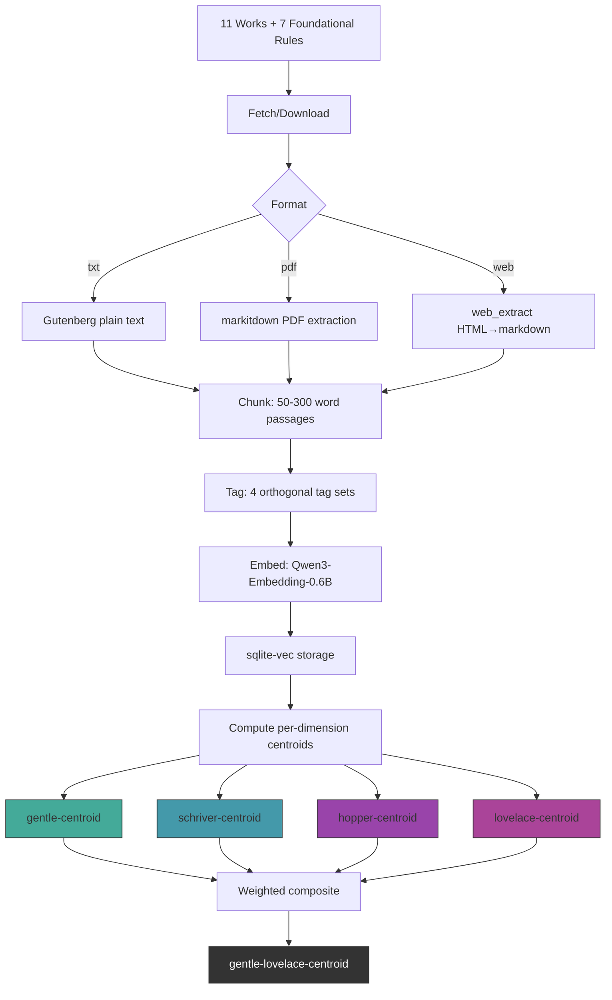
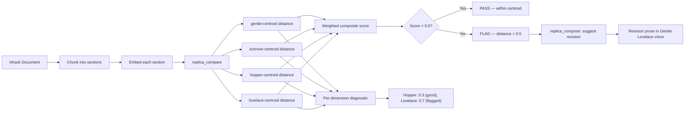
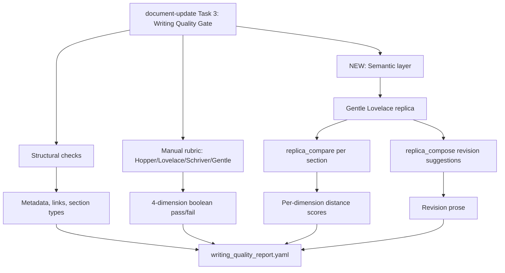

# Gentle Lovelace — Document Excellence Replica Specification

**Purpose:** Specification for the Gentle Lovelace mashup replica persona — a composite embedding space that evaluates technical documentation against four dimensions of excellence, each grounded in the work of a woman who shaped the field.

**Related:** [`WRITING_EXCELLENCE.md`](../standards/WRITING_EXCELLENCE.md), [`MDS.md`](../../architecture/core/MDS.md), [`document-update` SKILL.md](../../../.agents/skills/document-update/SKILL.md)

---

## 1. Statement — What Gentle Lovelace Is

Gentle Lovelace is a mashup replica persona that combines the four canonical exemplars of technical documentation excellence — Ada Lovelace, Grace Hopper, Karen Schriver, and Anne Gentle — into a single evaluative embedding space. It computes per-dimension centroids and a weighted composite centroid, enabling both holistic documentation quality scoring and dimension-level diagnostic through the existing `replica_compare` and `replica_compose` infrastructure.

The persona is named for the two women whose contributions bookend the field: **Ada Lovelace** (1815–1852), who published the first algorithm and demonstrated that a specification could be precise enough to be independently verifiable 180 years later; and **Anne Gentle** (contemporary), who codified that documentation shares code's lifecycle and that in an agent-native system, stale documentation is a functional defect. The name "Gentle Lovelace" honors both the precision of the first specification and the agent-correctness of the last — the full arc of technical documentation excellence.

All four exemplars are women. This is not incidental. Technical documentation as a discipline was founded by a woman (Hopper wrote the first computer manual), its first algorithm was published by a woman (Lovelace's Notes), its quality was made measurable by a woman (Schriver proved reader outcomes matter), and its modern form — docs-as-code, CI/CD for documentation, agent-correctness — was codified by a woman (Gentle's Docs Like Code). The Gentle Lovelace persona honors this lineage.

[^hopper-manual]: Hopper, G. M., & Aiken, H. H. (1946). *A Manual of Operation for the Automatic Sequence Controlled Calculator.* Harvard University Press. — The first computer programming textbook, written for operators with zero prior computing experience.

[^lovelace-notes]: Lovelace, A. A. (1843). Notes on Menabrea's "Sketch of the Analytical Engine." *Scientific Memoirs*, 3. — The first published algorithm, specifying a machine that did not exist with sufficient precision that the specification remains independently verifiable.

[^schriver-dynamics]: Schriver, K. A. (1997). *Dynamics in Document Design: Creating Text for Readers.* Wiley. — Proved that documentation quality is measurable by reader outcomes, not author intent.

[^gentle-docs]: Gentle, A. (2017). *Docs Like Code: Collaborate and Automate to Improve Technical Documentation.* Just Write Click. — Codified that documentation shares code's lifecycle, CI, review, and contributor workflows.

---

## 2. Evidence — The Four Dimensions

### 2.1 Gentle Dimension — Agent-Correctness (Weight: 0.50)

**Exemplar:** Anne Gentle
**Primary work:** *Docs Like Code* (2017, 3rd edition 2022)
**Supporting works:** OpenStack Documentation Contributor Guide, OpenStack API Documentation Guidelines, OpenStack General Writing Guidelines, docslikecode.com, Microsoft Writing Style Guide (welcome page)

**Principle:** Documentation lives in the same repository and shares the same review process as code. Automate quality gates — link checking, stale-name detection, diagram metadata — rather than relying on human vigilance. Broken docs block the build. A stale package count carries the same severity as a compilation error.

**Why 50%:** In an agent-native system, markdown specifications *are* the code. The documentation does not describe the system — it *is* the system's operational knowledge. An agent reading a specification document behaves based on what it reads. Stale documentation produces incorrect agent behavior. This is not a documentation quality issue — it is a functional defect. Gentle anticipated this in 2017 when she wrote that documentation should share code's lifecycle. In 2026, with agent-native systems consuming documentation as their primary source of truth, her principle has become the dominant concern.

**Corpus works (5):** OpenStack Contributor Guide, OpenStack API Guidelines, OpenStack Writing Style, Docs Like Code website, Microsoft Style Guide welcome page

[^gentle-openstack]: OpenStack Documentation Team. (2024). *OpenStack Documentation Contributor Guide.* https://docs.openstack.org/doc-contrib-guide/ — The canonical Gentle test in production: documentation shares code's lifecycle, CI, review, and contributor workflows across 300+ repositories.

[^gentle-site]: Gentle, A. (2024). *Docs Like Code.* https://www.docslikecode.com/ — The companion site to the book, with lessons, articles, and case studies.

[^microsoft-style]: Microsoft. (2024). *Microsoft Writing Style Guide.* https://learn.microsoft.com/en-us/style-guide/welcome/ — Industry adoption of docs-as-code principles at enterprise scale.

### 2.2 Schriver Dimension — Findability (Weight: 0.30)

**Exemplar:** Karen A. Schriver
**Primary work:** *Dynamics in Document Design* (1997)
**Supporting works:** Protocol-Aided Revision (1991), Document Design 1980–1990 (1990), Information Design for Technical Communicators (2013), Write the Docs Software Documentation Guide

**Principle:** Design for how readers actually read. Every document must have scannable headings, a navigation table, and diagrams at the point of use. Integrate word and image as a single communication unit. Measure quality by reader outcomes — if the answer is not findable in 30 seconds, the document has failed.

**Why 30%:** Findability is the bridge between human and agent readers. A human scanning headings and an agent traversing the link graph both need the answer within 30 seconds. Schriver's three-phase heuristic (group content rhetorically, organize visually, signal structure) applies equally to markdown documents consumed by agents — the structure IS the findability surface. At 30%, Schriver ensures that Gentle's agent-correctness is grounded in actual findable structure, not just automation.

**Corpus works (4):** Protocol-Aided Revision, Document Design 1980–1990, Information Design for Technical Communicators, Write the Docs Guide

[^schriver-protocol]: Schriver, K. A. (1991). *Plain Language for Expert or Lay Audiences: Designing Text Using Protocol-Aided Revision.* Technical Report No. 46, Carnegie Mellon University. — Demonstrates the Schriver test in action: measuring document quality by reader outcomes through think-aloud protocols.

[^schriver-1990]: Schriver, K. A. (1990). *Document Design from 1980 to 1990: Challenges that Remain.* Technical Report No. 39, Center for the Study of Writing. — Defines document design as a research discipline with five interacting clusters.

[^schriver-2013]: Schriver, K. A. (2013). What Do Technical Communicators Need to Know about Information Design? In Johnson-Eilola & Selber (Eds.), *Solving Problems in Technical Communication.* University of Chicago Press. — The three-phase heuristic: grouping, organizing, signaling.

[^writethedocs]: Write the Docs Community. (2024). *Software Documentation Guide.* https://www.writethedocs.org/guide/ — Community-vetted documentation patterns operationalizing Schriver's principles.

### 2.3 Hopper Dimension — Accessibility (Weight: 0.10)

**Exemplar:** Rear Admiral Grace Murray Hopper
**Primary work:** *A Manual of Operation for the Automatic Sequence Controlled Calculator* (1946)
**Supporting works:** None (the Mark I Manual is a singular comprehensive work)

**Principle:** Build the bridge others called impossible. Concepts deemed "too complex to document" are precisely where documentation matters most. If the audience cannot understand it, the writer has failed. Write for the reader's vocabulary — agent-facing docs use MCP tool names and JSON schemas; operator docs use CLI paths.

**Why 10%:** Hopper's principle is foundational but secondary in an agent-native system. The primary consumer of hKask documentation is an agent, not a human operator with zero prior context. Accessibility still matters — an agent consuming a document should not encounter unnecessary complexity — but it whispers rather than dominates. At 10%, Hopper ensures that no document becomes so agent-optimized that it loses human comprehensibility.

**Corpus works (1):** Mark I Manual of Operation (561 pages, PDF)

[^hopper-mark1]: Hopper, G. M., & Aiken, H. H. (1946). *A Manual of Operation for the Automatic Sequence Controlled Calculator.* Harvard University Press. Available at Internet Archive: https://archive.org/details/marki_operman_1946 — The first computer programming textbook. Chapters 1–3 and appendices by Hopper.

### 2.4 Lovelace Dimension — Precision (Weight: 0.10)

**Exemplar:** Augusta Ada Byron King, Countess of Lovelace
**Primary work:** *Notes on the Analytical Engine* (1843)
**Supporting works:** None (the Notes are a singular comprehensive work)

**Principle:** Document with enough precision that the specification is independently verifiable. A reader must be able to write a test from documentation alone. Annotate with more depth than the original — an ADR's context and consequences must exceed its decision statement. See beyond immediate implementation; articulate *why* a design exists, not merely *what* it does.

**Why 10%:** Lovelace's principle is the foundation of all specification — without precision, no other dimension matters. But in an agent-native system, precision is assumed. An agent will not hallucinate a missing parameter because the spec was imprecise — it will behave incorrectly because the spec was *stale* (Gentle) or *unfindable* (Schriver). At 10%, Lovelace whispers the eternal truth: be precise enough that your specification could be implemented by someone who has never seen the system. This is the test that the Notes on the Analytical Engine pass 180 years later.

**Corpus works (1):** Notes on the Analytical Engine (68 pages, Gutenberg text)

[^lovelace-gutenberg]: Menabrea, L. F., trans. Lovelace, A. A. (1843). *Sketch of the Analytical Engine invented by Charles Babbage, Esq.* Project Gutenberg eBook #75107. https://www.gutenberg.org/ebooks/75107 — Full text of the Notes, including Notes A through G with the Bernoulli Numbers computation diagram.

---

## 3. Diagram — Architecture and Data Flow

### 3.1 Corpus → Centroid Pipeline



### 3.2 Evaluation Flow — How Gentle Lovelace Scores a Document



### 3.3 Integration with document-update Skill



### 3.4 Integration with spec/require/writing-quality

```mermaid
flowchart LR
    A[spec/require/writing-quality] --> B{doc_id}
    B --> C[Existing 4-dimension rubric]
    B --> D[NEW: replica_persona param]
    C --> E[{hopper, lovelace, schriver, gentle} booleans]
    D --> F[replica_compare against gentle-lovelace centroids]
    F --> G[Per-dimension distances]
    F --> H[Composite distance]
    E --> I[Response]
    G --> I
    H --> I
    I --> J["{dimensions_passing, meets_publication_standard, semantic_scores: {composite, hopper, lovelace, schriver, gentle}}"]
```

### 3.5 Orthogonal Tag Sets

Each passage in the embedding space carries four independent tags:

```
Passage: "The Analytical Engine weaves algebraical patterns..."
  ├── section_type: Statement
  ├── mds_category: domain
  ├── document_type: specification
  └── dimension: Lovelace

Passage: "Write a file, commit it, and it publishes automatically."
  ├── section_type: Statement
  ├── mds_category: composition
  ├── document_type: guide
  └── dimension: Gentle
```

These enable multi-axis queries: "show me all Evidence sections from Trust-category ADRs that score high on Lovelace precision but low on Hopper accessibility."

---

## 4. Implications — What This Enables

### 4.1 For the document-update Skill

The Gentle Lovelace replica adds a **semantic layer** to Task 3 (Writing Quality Gate) that currently only performs structural checks and manual rubric assessment. Specifically:

1. **Per-section centroid distance** — every `##` section of every hKask document can be compared against the Gentle Lovelace centroids. Sections with distance > 0.5 from their expected dimension centroid are flagged.

2. **Missing section-type detection** — if a document has Statement and Evidence sections but no Implications, the replica can retrieve the nearest Implications exemplars from the corpus and suggest structural additions.

3. **Revision prose generation** — `replica_compose` with the Gentle Lovelace persona can generate revision suggestions in a voice that blends all four dimensions: precise enough to be independently verifiable (Lovelace), accessible on first reading (Hopper), findable in 30 seconds (Schriver), and correct for agent consumption (Gentle).

4. **Per-dimension diagnostics** — instead of a single pass/fail, the skill can report: "This ADR scores 0.3 from Hopper (good accessibility), 0.7 from Lovelace (flagged — missing code-path verification), 0.4 from Schriver (acceptable findability), 0.2 from Gentle (excellent agent-correctness)."

### 4.2 For the spec Server

The `spec/require/writing-quality` tool gains an optional `replica_persona` parameter. When `replica_persona: "gentle-lovelace"` is passed:

- The response includes `semantic_scores` alongside the existing `dimensions_passing` booleans
- The `meets_publication_standard` threshold can incorporate semantic distance
- The server can invoke `replica_compose` to generate revision suggestions for flagged documents

### 4.3 For the Curation Loop

The Gentle Lovelace centroid becomes a **curation anchor** — a stable reference point against which the entire document corpus can be measured over time. As documents evolve, their distance from the centroid can be tracked, detecting drift before it becomes spec-code misalignment. This closes the MDS self-application loop: the spec server can use the replica to evaluate the spec corpus itself.

### 4.4 For Future Replicas

The orthogonal tag set architecture (section_type × mds_category × document_type × dimension) is a **generalization hook**. Future replicas can use the same tag taxonomy with different corpora. A "security-documentation" replica could use the same section_type and mds_category tags but weight the Trust dimension at 0.50. A "user-guide" replica could weight Hopper at 0.50. The tag sets are the semantic anchor — the MDS framework IS the domain ontology.

---

## 5. Implementation Status

| Component | Status | Location |
|-----------|--------|----------|
| Corpus manifest | ✅ Complete | `registry/styles/gentle-lovelace/corpus.yaml` |
| Works downloaded | ✅ Complete | Lovelace (Gutenberg), Hopper (PDF, 50MB), Schriver (3 PDFs), Gentle (3 web + Docs Like Code + Microsoft) |
| Foundational rules | ✅ Complete | 7 rules across all 4 dimensions |
| Orthogonal tag sets | ✅ Defined | section_type, mds_category, document_type, dimension |
| Weighting architecture | ✅ Defined | Gentle 0.50, Schriver 0.30, Hopper 0.10, Lovelace 0.10 |
| Per-type weights | ✅ Defined | 6 document types with context-sensitive weighting |
| Embedding pipeline | 🔧 Needs extension | `CorpusConfig`, `Work`, `FoundationalRule` structs need new fields |
| Per-dimension centroids | 🔧 Needs implementation | `EmbedService` needs multi-centroid computation |
| replica_compare integration | 🔧 Needs implementation | Weighted comparison with document type parameter |
| spec server integration | 🔧 Needs implementation | `replica_persona` parameter on `spec/require/writing-quality` |
| document-update integration | 🔧 Needs implementation | 5th quality dimension in Task 3 |

---

## 6. Open Questions

### GENTLE-1 — Embedding Model Selection

The manifest specifies `DI/Qwen/Qwen3-Embedding-0.6B` (1024-dim). Is this the right model for technical documentation embeddings, or would a model trained on scientific/technical text produce better centroids? The current model is general-purpose.

### GENTLE-2 — Centroid Stability

How many passages are needed for a stable centroid? The Hopper and Lovelace dimensions each have one large work — will the centroid be stable with passages from a single source, or do we need additional works in those dimensions?

### GENTLE-3 — Distance Threshold Calibration

The current flag threshold of 0.5 is arbitrary. Should it be calibrated empirically by computing distances for known-good and known-poor documents and finding the separation point? This mirrors the coherence threshold calibration question (FUT-DOC-2).

### GENTLE-4 — Microsoft Style Guide Deep Pages

The Microsoft Style Guide welcome page is accessible, but the Top 10 Tips, bias-free communication, and global communications sections require authentication. Should we pursue access, or is the welcome page sufficient as an exemplar?

### GENTLE-5 — Replica Persona Registration

Should Gentle Lovelace be registered as a formal persona in the replica registry alongside Jane Wilde, Ulysses S. Twain, and Agatha Eliot, or should it remain a corpus configuration used exclusively by the document-update skill and spec server?

---

## References

[^hopper-manual]: Hopper, G. M., & Aiken, H. H. (1946). *A Manual of Operation for the Automatic Sequence Controlled Calculator.* Harvard University Press. https://archive.org/details/marki_operman_1946

[^lovelace-notes]: Lovelace, A. A. (1843). Notes on Menabrea's "Sketch of the Analytical Engine." *Scientific Memoirs*, 3.

[^lovelace-gutenberg]: Menabrea, L. F., trans. Lovelace, A. A. (1843). *Sketch of the Analytical Engine.* Project Gutenberg #75107. https://www.gutenberg.org/ebooks/75107

[^schriver-dynamics]: Schriver, K. A. (1997). *Dynamics in Document Design: Creating Text for Readers.* Wiley. https://archive.org/details/dynamicsindocume0000schr

[^schriver-protocol]: Schriver, K. A. (1991). *Plain Language for Expert or Lay Audiences.* Technical Report No. 46, Carnegie Mellon University.

[^schriver-1990]: Schriver, K. A. (1990). *Document Design from 1980 to 1990: Challenges that Remain.* Technical Report No. 39. ERIC #ED320143.

[^schriver-2013]: Schriver, K. A. (2013). What Do Technical Communicators Need to Know about Information Design? In *Solving Problems in Technical Communication.* U. Chicago Press.

[^gentle-docs]: Gentle, A. (2017, 3rd ed. 2022). *Docs Like Code: Collaborate and Automate to Improve Technical Documentation.* Just Write Click.

[^gentle-openstack]: OpenStack Documentation Team. (2024). *OpenStack Documentation Contributor Guide.* https://docs.openstack.org/doc-contrib-guide/

[^gentle-site]: Gentle, A. (2024). *Docs Like Code.* https://www.docslikecode.com/

[^microsoft-style]: Microsoft. (2024). *Microsoft Writing Style Guide.* https://learn.microsoft.com/en-us/style-guide/welcome/

[^writethedocs]: Write the Docs Community. (2024). *Software Documentation Guide.* https://www.writethedocs.org/guide/

[^hopper-yale]: Office of the President, Yale University. (2017). *Biography of Grace Murray Hopper.* https://president.yale.edu/biography-grace-murray-hopper

[^hopper-britannica]: Britannica, T. Editors. (2024). *Grace Hopper.* https://www.britannica.com/biography/Grace-Hopper

[^lovelace-babbage]: Babbage, C. (1864). *Passages from the Life of a Philosopher.* Longman, Green.

[^schriver-attw]: Association of Teachers of Technical Writing. (2015). *2015 ATTW Fellow: Karen Schriver.* https://attw.org/about-attw/attw-fellows/2015-karen-schriver/

[^gentle-openstack]: Gentle, A. (2016). Git and GitHub for open source documentation. *OpenSource.com.* https://opensource.com/article/16/4/git-and-github-open-source-documentation

[^gentle-about]: Gentle, A. (2024). About Docs Like Code. https://www.docslikecode.com/about/

[^matc-women]: Bogue, M. (2025). Women Who Shaped Technical Writing. MATC Group. https://www.matcgroup.com/technical-writing/women-who-shaped-technical-writing-a-history-of-progress-struggles-and-successes/

*ℏKask - A Minimal Viable Container for Agents — v0.27.0*
