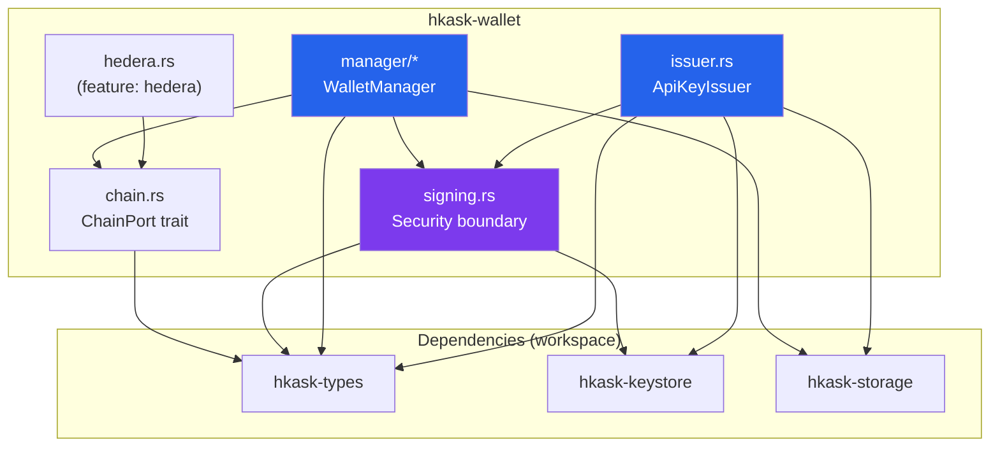
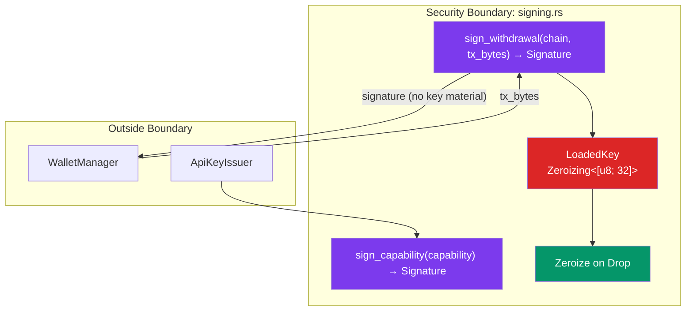
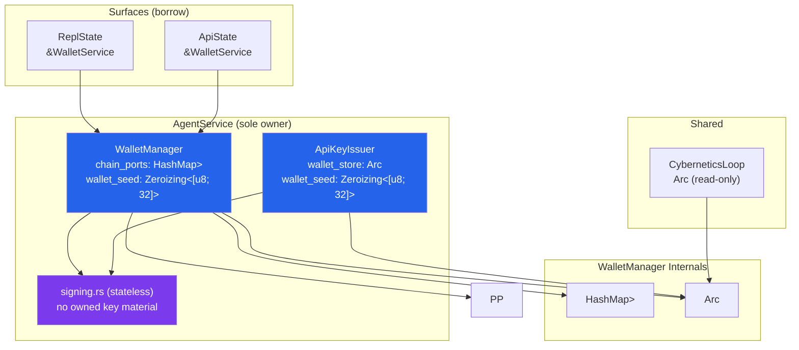

# hKask Wallet Crate — Architectural Specification

**Date:** 2026-06-28
**Project:** hKask v0.31.0
**Status:** Phases 1–8 complete ✅ — Full wallet subsystem (types, storage, keystore, wallet crate, CNS, services, CLI, API) built and tested
**Skills applied:** idiomatic-rust, essentialist, pragmatic-semantics, pragmatic-cybernetics, coding-guidelines

---

## 0. Epistemic Frame

Every statement is classified per pragmatic-semantics:

| Tag | Meaning |
|-----|---------|
| `[IS-DECL]` | Direct measurement or self-evident fact |
| `[IS-PROB]` | Probabilistic inference from data |
| `[IS-SUBJ]` | What-if projection |
| `[OUGHT-DECL]` | Prescriptive rule or requirement |

---

## 1. Purpose & Scope

### 1.1 What hKask Wallet Is `[OUGHT-DECL]`

The hKask wallet is a **specialized sub-wallet** — one of several crypto wallets the user holds. It only does what hKask needs:

- Receive deposits (USDC → rJoules) on Hedera
- Track rJoule balances in SQLite (SQLCipher-encrypted)
- Issue Ed25519-signed API key capability tokens
- Process withdrawals (rJoules → USDC) back to user's primary wallet
- Shielded deposits/withdrawals are deferred (no privacy port implemented in code yet)

### 1.2 What hKask Wallet Is NOT `[OUGHT-DECL]`

- NOT a general-purpose crypto wallet — user's primary wallet (Phantom, HashPack, MetaMask) handles key storage, multi-chain asset management, DeFi
- NOT a key generator for users — treasury keys are derived from hKask's master passphrase, not user keys
- NOT a KYC/AML platform — headless constraint, P1 sovereignty
- NOT a zkSNARK proof generator — privacy/zk integrations are deferred
- NOT an on-chain rJoule token — rJoule is an internal accounting unit in SQLite

---

## 2. Crate Architecture

### 2.1 Crate Map

```
hkask-wallet/
├── Cargo.toml              — Feature gates: hedera
├── src/
│   ├── lib.rs              — Crate docs, module declarations, re-exports
│   ├── chain.rs            — ChainPort trait + DepositEvent
│   ├── signing.rs          — Isolated security boundary (2 public functions)
│   ├── manager/
│   │   ├── mod.rs           — WalletManager + deposit reference logic
│   │   ├── budget.rs        — gas↔rJoule conversion
│   │   ├── deposits.rs      — deposit monitoring
│   │   ├── encumbrance.rs   — encumbrance lifecycle
│   │   └── withdrawals.rs   — withdrawal pipeline
│   ├── issuer.rs           — ApiKeyIssuer + ApiKeyMaterial re-export
│   ├── price_feed.rs       — PriceFeed + fee estimation
│   └── hedera.rs           — HederaPort (feature-gated: "hedera")
```

### 2.2 Module Dependency Graph



### 2.3 Essentialist Review Summary

| Gate | Result |
|------|--------|
| **G1 — Exist** | 3 items pruned: `error.rs` (pass-through), `deposit_ref.rs` (merged into manager.rs), `TxHash` (moved to hkask-types). All surviving components encode behavior beyond direct calls. |
| **G2 — Surface** | `chain.rs`: 7 (at threshold). `manager.rs`: 13 (justified — each method has distinct caller). `issuer.rs`: 6. `signing.rs`: 2. |
| **G3 — Contract** | 0 pass-through abstractions. All traits add behavior beyond direct dependency calls. |

---

## 3. Type System

### 3.1 Types in `hkask-wallet-types` (Phase 1)

| Type | Kind | Security Constraints |
|------|------|---------------------|
| `RJoule(u64)` | Newtype | Copy, Clone — value unit, not secret |
| `ChainId` | Enum (Hedera) | Copy, Clone |
| `PrivacyMode` | Enum (Transparent) | Copy, Clone |
| `Ed25519PublicKey([u8; 32])` | Newtype | Copy, Clone — public key |
| `DepositAddress` | Struct | Clone — no secrets |
| `WalletConfig` | Struct | Clone — configuration |
| `WalletBalance` | Struct | Clone — public state |
| `ApiKeyCapability` | Struct | Clone — public metadata |
| `ApiKeyMaterial` | Struct | **NO Clone** — contains `private_key_hex` |
| `TransactionType` | Enum | Clone |
| `WalletTransaction` | Struct | Clone |
| `DepositReference` | Struct | Clone |
| `TxHash(String)` | Newtype | Clone — public tx hash |
| `WalletError` (10 variants) | thiserror::Error | Typed errors with context |

### 3.2 Key Material Types — Internal to signing.rs

| Type | Copy? | Clone? | Zeroize? | Rationale |
|------|-------|--------|----------|-----------|
| `LoadedKey` (internal) | ❌ | ❌ | ✅ `Zeroizing<[u8; 32]>` | Secret — MUST zeroize (MUST-8) |
| Treasury key (internal) | ❌ | ❌ | ✅ `Zeroizing<Vec<u8>>` | Secret — MUST zeroize |
| Wallet seed (internal) | ❌ | ❌ | ✅ `Zeroizing<[u8; 32]>` | Secret — MUST zeroize |
| API key private key | ❌ | ❌ | N/A (user-held) | Returned once, never stored (MUST-5) |
| Signature (public output) | ✅ Copy | ✅ Clone | ❌ | Public output |

### 3.3 Debug Redaction (MUST-2)

```rust
impl std::fmt::Debug for LoadedKey {
    fn fmt(&self, f: &mut std::fmt::Formatter<'_>) -> std::fmt::Result {
        f.debug_struct("LoadedKey")
            .field("bytes", &"[REDACTED]")
            .finish()
    }
}
```

### 3.4 Configuration (Environment)

| Variable | Default | Description |
|---|---|---|
| `HKASK_DEPOSIT_REPAIR_MAX_INDEX` | `5` | Max derivation index scanned when repairing corrupted deposit address mappings (bounded to 100). |
| `HKASK_EODHD_API_KEY` | _none_ | EODHD API key required for the EODHD price feed source (including composite sources). |
| `HEDERA_TREASURY_ACCOUNT` | _none_ | Enables Hedera chain execution when set (treasury account ID). If unset, Hedera chain port is not initialized. |
| `HEDERA_MIRROR_NODE_URL` | `https://mainnet-public.mirrornode.hedera.com` | Hedera mirror node URL (used only when `HEDERA_TREASURY_ACCOUNT` is set). |
| `HEDERA_CONSENSUS_NODE_URL` | `https://35.232.244.145:50211` | Hedera consensus node gRPC URL (used only when `HEDERA_TREASURY_ACCOUNT` is set). |

_Test-only:_ `HEDERA_TEST_DESTINATION` is used in wallet integration tests to set the recipient account for live Hedera testnet withdrawals.

---

## 4. Security Architecture

### 4.1 Signing Module — The Security Boundary



**Invariant `[OUGHT-DECL]`:** No un-zeroized key material ever leaves `signing.rs`. Keys are loaded per-operation via HKDF, wrapped in `LoadedKey` (redacted Debug), used for signing, and zeroized on drop. The caller receives only the signature.

### 4.2 Key Material Lifecycle

```mermaid
sequenceDiagram
    participant Caller
    participant Signing as signing.rs
    participant Keystore as hkask-keystore
    participant Memory

    Caller->>Signing: sign_withdrawal(Hedera, tx_bytes)
    Signing->>Keystore: resolve_treasury_key(Hedera)
    Keystore-->>Signing: Zeroizing<Vec<u8>> (32 bytes)
    Note over Signing,Memory: Key material exists in memory
    Signing->>Signing: LoadedKey::from_zeroizing → Zeroizing<[u8; 32]>
    Signing->>Signing: Ed25519 signing
    Signing-->>Caller: Signature (64 bytes)
    Note over Memory: LoadedKey drops → Zeroizing zeroes
    Note over Memory: Key material gone from memory
```

### 4.3 Defense in Depth

| Layer | Mechanism | Protects Against |
|-------|-----------|-----------------|
| **Type system** | `Zeroizing<[u8; 32]>` — no Copy, no Clone, zeroize on drop | Memory dumps, use-after-free, accidental copies |
| **Module boundary** | `signing.rs` — only module that loads key material | Scattered key handling, audit difficulty |
| **Per-operation loading** | Keys loaded per call via HKDF, not held long-term | Long-lived key material in memory |
| **Debug redaction** | `LoadedKey` Debug shows `[REDACTED]` | Key leakage in logs, error messages |
| **Constant-time ops** | `subtle` crate for sensitive comparisons | Timing side channels |
| **Feature gates** | Chain SDKs behind Cargo features | Reduced compile-time attack surface |
| **Mock ports** | Chain interactions testable without real keys | Test coverage of security-critical paths |

### 4.4 Security Invariant Checklist

#### MUST (Inviolable) `[OUGHT-DECL]`

| # | Invariant | Status |
|---|-----------|--------|
| MUST-1 | Seed never in plain memory beyond Zeroizing scope | ✅ `Zeroizing<Vec<u8>>` on all derived key material |
| MUST-2 | Seed never in logs, error messages, or Debug output | ✅ `LoadedKey` Debug shows `[REDACTED]` |
| MUST-3 | Seed derivation always uses domain-separated HKDF contexts | ✅ `TREASURY_HEDERA`, `WALLET_SEED` |
| MUST-4 | Signing requires user consent (P2 Affirmative Consent) | 🔶 Deferred to Phase 6 (ConsentManager gate) |
| MUST-5 | Private keys never serialized to disk unencrypted | ✅ API key private keys returned once, never stored |
| MUST-6 | All cryptographic comparisons use constant-time equality | 🔶 Deferred (subtle crate available, not yet wired) |
| MUST-7 | No branching on secret data | ✅ Signing path is linear, no secret-dependent branches |
| MUST-8 | Zeroize on drop for all types containing key material | ✅ `Zeroizing` on `LoadedKey`, treasury key, wallet seed |
| MUST-9 | No Clone on secret-bearing types | ✅ `LoadedKey` has no Clone; `Zeroizing` prevents Copy |
| MUST-10 | Balance invariant: sum(ledger deltas) == current_balance | 🔶 Deferred to property test (proptest) |
| MUST-11 | No key material leaves signing.rs | ✅ API returns `Vec<u8>` (signature), never key bytes |

#### SHOULD (Strongly Recommended) `[OUGHT-DECL]`

| # | Invariant | Status |
|---|-----------|--------|
| SHOULD-1 | `mlock()` on in-memory key material | 🔶 Deferred (platform-specific) |
| SHOULD-2 | Subprocess isolation for signing | 🔶 Deferred (defense-in-depth) |
| SHOULD-3 | Anti-ptrace / anti-coredump | 🔶 Deferred (platform-specific) |
| SHOULD-4 | Key material cache with ≤30s TTL | 🔶 Deferred (performance optimization) |
| SHOULD-5 | `cargo-deny` in CI | 🔶 Deferred (CI configuration) |
| SHOULD-6 | Pinned dependency versions in `Cargo.lock` | ✅ Committed to repository |
| SHOULD-7 | No proc-macro deps beyond thiserror/serde | ✅ Only thiserror, serde, async-trait |

### 4.5 Supply-Chain Attack Mitigation

**Forbidden dependencies `[OUGHT-DECL]`:**
- ❌ No `openssl` (use `rustls` for TLS)
- ❌ No `libsodium` (use Rust-native crypto: ed25519-dalek + sha2 + hmac)
- ❌ No `ring` (use ed25519-dalek + sha2 + hmac)
- ❌ No proc-macro crates beyond `thiserror`, `serde`, `async-trait` (already vetted)

**Dependency footprint `[IS-DECL]`:**

| Dependency | Justification | Risk |
|-----------|---------------|------|
| `hkask-types` | Domain types (workspace) | None — internal |
| `hkask-keystore` | Key derivation (workspace) | None — internal |
| `hkask-storage` | Persistence (workspace) | None — internal |
| `reqwest` | HTTP for Hedera mirror node (feature-gated) | Medium — TLS dep (rustls) |
| `ed25519-dalek` | Key construction from seed bytes | Low — already in keystore |
| `zeroize` | Memory protection | Low — already in keystore |
| `subtle` | Constant-time comparison | Low — well-audited |
| `thiserror` | Error derive | Low — already in types |
| `serde` / `serde_json` | Serialization | Low — already in types |
| `tokio` | Async runtime | Low — already in agents |

---

## 5. Privacy Integration (Deferred)

Privacy/shielded flows are not implemented in the current codebase. The wallet
runs in transparent mode only and exposes no `PrivacyPort` or Hinkal adapter.
This section is intentionally minimal until privacy ports are introduced.

---

## 6. CNS Integration (Phase 5 — Built ✅)

### 6.1 Span Emission Checklist

All namespaces registered in `CANONICAL_NAMESPACES` (`hkask-types::event`).

**Self-healing note:** wallet-level repairs are intentionally conservative and
local to `WalletManager`. Cross-domain or backoff-based healing should be
centralized in a service-layer `SelfHealer` so it can coordinate across
storage, chain ports, and curator escalation. Deposit address repair scans are
bounded by `HKASK_DEPOSIT_REPAIR_MAX_INDEX` (default: 5, max: 100).

| Operation | Module | Span Namespace | Verb | Phase | Status |
|-----------|--------|---------------|------|-------|--------|
| Deposit address derived | `manager.rs` | `cns.wallet.deposit` | `derived` | Act | ✅ |
| Deposit detected (transparent) | `chain.rs` → `manager.rs` | `cns.wallet.deposit` | `detected` | Sense | ✅ |

| Deposit credited | `manager.rs` | `cns.wallet.balance` | `credited` | Act | ✅ |
| Deposit address unresolvable | `manager.rs` | `cns.heal` | `wallet_deposit_address_unresolvable` | Sense | ✅ |
| Deposit address repair (single-wallet) | `manager.rs` | `cns.heal` | `wallet_deposit_address_repaired` | Act | ✅ |
| Withdrawal built | `chain.rs` | `cns.wallet.withdrawal` | `built` | Act | ✅ |
| Withdrawal signed | `signing.rs` | `cns.wallet.withdrawal` | `signed` | Act | ✅ |
| Withdrawal submitted | `chain.rs` | `cns.wallet.withdrawal` | `submitted` | Act | ✅ |
| USDC ↔ rJoule conversion | `manager.rs` | `cns.wallet.conversion` | `converted` | Act | ✅ |
| API key issued | `issuer.rs` | `cns.wallet.key_issued` | `issued` | Act | ✅ |
| API key revoked | `issuer.rs` | `cns.wallet.key_revoked` | `revoked` | Act | ✅ |
| API key expired | `issuer.rs` | `cns.wallet.key_expired` | `expired` | Sense | 🔶 CNS algedonic |
| API key exhausted | `issuer.rs` | `cns.wallet.key_exhausted` | `exhausted` | Sense | 🔶 CNS algedonic |
| Treasury key loaded | `signing.rs` | `cns.wallet.treasury` | `loaded` | Act | 🔶 Covered by withdrawal.signed |
| Chain error | `chain.rs` | `cns.wallet.chain_error` | `error` | Sense | ⬜ Deferred (needs chain ports) |


### 6.2 CNS Error Threshold Mapping

| Error Variant | CNS Alert | Threshold |
|---------------|-----------|-----------|
| `InsufficientBalance` | `cns.wallet.balance` — depleted | Warning |
| `SpendingLimitExceeded` | `cns.wallet.key_exhausted` | Warning |
| `KeyExpired` | `cns.wallet.key_expired` | Info |
| `KeyRevoked` | `cns.wallet.key_revoked` | Info |
| `ChainNotEnabled` | `cns.wallet.chain_error` | Warning |
| `DepositReferenceInvalid` | `cns.wallet.deposit` — invalid_ref | Warning |
| `DepositAddressUnresolvable` | `cns.wallet.deposit` — unresolvable_address | Warning |
| `ChainError` | `cns.wallet.chain_error` | Critical (chain RPC down) |
| `Infra` | `cns.wallet.*` (context-dependent) | Critical |

---

## 7. Ownership Architecture



**Key decisions `[OUGHT-DECL]`:**
- `WalletManager` sole-owns `ChainPort` implementations
- `WalletStore` is `Arc<>` — shared with CNS for algedonic monitoring (justified)
- `signing.rs` is stateless — no owned data, no long-lived keys
- Treasury keys NEVER held long-term — loaded per signing operation, zeroized on drop
- Surfaces borrow `&WalletService`, never own wallet components
- `ApiKeyIssuer` shares `Arc<WalletStore>` with WalletManager (both need write access to API key tables)

---

## 8. Implementation Status

### 8.1 Completed Phases

| Phase | Crate | Status | Tests | Key Deliverables |
|-------|-------|--------|-------|-----------------|
| 1 | `hkask-wallet-types` | ✅ | 11 | `RJoule`, `ChainId`, `PrivacyMode`, `ApiKeyCapability`, `WalletError` (15 variants), `TxHash`, 14 CNS spans, 3 wallet SignalMetrics |
| 2 | `hkask-storage` | ✅ | 34 | `WalletStore` — 5 tables, 16 methods, deposit addresses keyed by (wallet, chain, privacy) with unique (chain, privacy, address), anti-replay deposit references, MUST-10 property test |
| 3 | `hkask-keystore` | ✅ | 6 | `resolve_treasury_key(chain)`, `resolve_wallet_seed()`, `sign_api_key_capability()` |
| 4 | `hkask-wallet` | ✅ | 13 | `ChainPort`, `signing.rs` (LoadedKey + redacted Debug), `WalletManager` (13 methods + CNS span emission), `ApiKeyIssuer` (CNS span emission) |
| 5 | `hkask-cns` | ✅ | 11 | `WalletBackedBudget`, `WalletEnergyEstimator`, `GasBudgetManager` dual-map, algedonic alerts (balance + key health), CNS span emission wired |
| 6 | `hkask-services-wallet` | ✅ | 35 | `WalletService` — 13 methods composing WalletManager + ApiKeyIssuer + CNS budget registration |
| 7 | `hkask-cli` | ✅ | 25 | `kask wallet` — 8 subcommands (balance, deposit-address, deposit-reference, history, key create/list/revoke, withdraw) |
| 8 | `hkask-api` | ✅ | 2 | 8 wallet REST endpoints + `ApiKeyAuthService` middleware (Ed25519 Bearer token verification) |

### 8.2 Remaining Phases

| Phase | Scope | Dependencies |
|-------|-------|-------------|
| 4 (chain ports) | `hedera.rs` — feature-gated implementation | reqwest |

### 8.3 Test Inventory

| Crate | Tests | REQ Tags |
|-------|-------|----------|
| `hkask-wallet-types` | 11 (7 wallet) | `P1-wallet-types` |
| `hkask-storage` | 34 (11 wallet_store) | `P2-wallet-store`, `MUST-10` |
| `hkask-keystore` | 6 (6 wallet) | `P3-keystore` |
| `hkask-wallet` | 13 | `P4-signing`, `P4-manager`, `P4-issuer` |
| `hkask-cns` | 11 (1 wallet_budget) | `P5-cns-wallet` |
| `hkask-services-wallet` | 35 (6 wallet) | `svc-wallet-001`–`006` |
| `hkask-cli` | 25 (0 wallet-specific) | (existing CLI tests) |
| `hkask-api` | 2 (0 wallet-specific) | (existing API tests) |
| **Total** | **137** (44 wallet-specific) | |

---

## 9. Open Questions & Resolved Decisions

| Question | Decision | Rationale |
|----------|----------|-----------|
| Q1: Per-operation vs long-lived keys | **Per-operation** ✅ | Research consensus (Turnkey, 1Password). 1μs HKDF overhead negligible. |
| Q2: Privacy integration scope | **Deferred** | No privacy ports are implemented yet; revisit once a shielded flow is planned. |
| Q3: hKask wallet scope | **Specialized sub-wallet** ✅ | User's primary wallet handles key storage, multi-chain, DeFi. hKask wallet only does deposits, rJoule tracking, API keys, withdrawals. |
| Q4: Deposit detection strategy | **Polling at 30s intervals** | Low-frequency polling avoids persistent RPC connections. Multiple fallback endpoints. |
| Q5: Multi-chain address format | **Chain-specific native formats** | Hedera: `0.0.XXXXX` account ID. |
| Q6: Gas pre-funding (bootstrapping) | **Deferred** | Initial treasury funded by hKask operator. Users deposit USDC → rJoules credited. |
| Q7: Key revocation — on-chain vs off-chain | **Off-chain (database flag)** | `revoked_at` timestamp in `api_keys` table. Unspent rJoules returned to wallet. |
| Q8: Recovery from seed (P1 sovereignty) | **Deterministic derivation** | All keys derived from master passphrase via HKDF. Same passphrase → same keys. OCAP signing key fails closed if master key is unavailable. |
| Q9: Hinkal support | **Deferred** | Current code is Hedera-only (`ChainId::Hedera`). Privacy ports are not implemented yet. |

---

## 10. Verification Commands

```bash
# Per-crate verification
cargo check -p hkask-wallet-types -p hkask-storage -p hkask-keystore -p hkask-wallet
cargo test -p hkask-wallet-types -p hkask-storage -p hkask-keystore -p hkask-wallet
cargo clippy -p hkask-wallet -- -D warnings

# Full workspace (after all phases)
cargo check --workspace
cargo test --workspace
cargo clippy --workspace -- -D warnings

# Constraint verification
grep -r "todo!\|unimplemented!\|#\[deprecated\]" crates/hkask-wallet/ && echo "VIOLATION" || echo "CLEAN"
grep -r "\.unwrap()" crates/hkask-wallet/src/ && echo "VIOLATION: unwrap in library code" || echo "CLEAN"
```

---

*ℏKask - A Minimal Viable Container for Replicants — v0.28.0 — Wallet Specification 2026-06-12*
