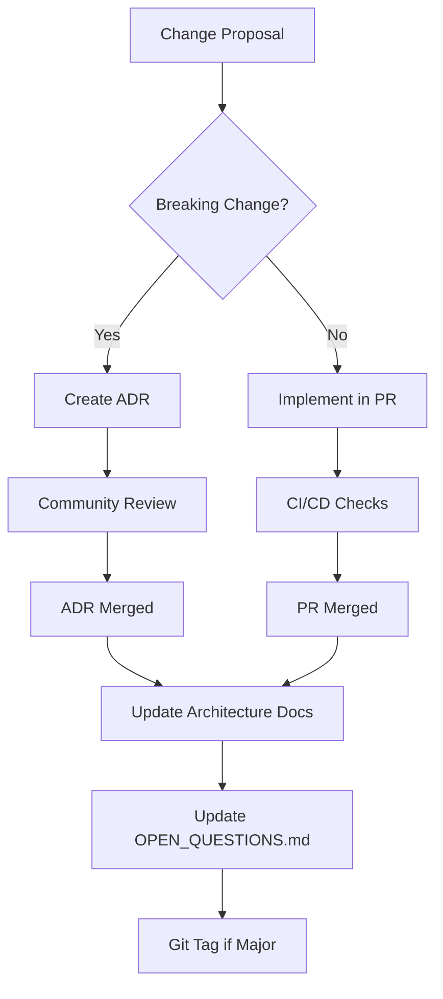

<!-- TOGAF_DOMAIN: Technology -->
<!-- VERSION: 1.0.0 -->
<!-- STATUS: Active -->
<!-- LAST_UPDATED: 2026-05-20 -->

# hKask Governance & Change Management

**Purpose:** Implementation governance, CNS monitoring, publication quality gates, and change management procedures.

**Related:** [`PRINCIPLES.md`](PRINCIPLES.md), [`DOCUMENTATION_STANDARDS.md`](../standards/DOCUMENTATION_STANDARDS.md)  
**TOGAF Phase:** G — Implementation Governance, H — Change Management[^togaf-gh]

---

## 1. Executive Summary

hKask governance model ensures architectural integrity through CNS monitoring, publication quality gates, and Git-based change management.

**Key Mechanisms:**
- **CNS Monitoring** — Variety counters, algedonic alerts, cns.* spans
- **Quality Gates** — Six-field headers, citation density, diagram alignment
- **Git Governance** — History as architecture repository, document lifecycle
- **Security Configuration** — Path traversal, Jinja2 injection, capability attenuation

**Verification:** `cargo test --workspace && cargo fmt --check && cargo clippy -- -D warnings`

---

## 2. CNS Monitoring

### 2.1 Variety Counters

**Purpose:** Monitor system health by tracking environmental vs internal state variety.[^beer-variety]

```rust
pub struct VarietyCounter {
    environmental_states: usize,  // Distinct inputs from environment
    internal_states: usize,       // Distinct internal responses
    deficit_threshold: u64,       // Default: 100
    last_check: Timestamp,
}

impl VarietyCounter {
    pub fn check(&self) -> Option<AlgedonicAlert> {
        let deficit = self.environmental_states.saturating_sub(self.internal_states);
        if deficit > self.deficit_threshold as usize {
            Some(AlgedonicAlert::VarietyDeficit(deficit))
        } else {
            None
        }
    }
}
```

**Algedonic Alert Thresholds:**
| Deficit | Severity | Action |
|---------|----------|--------|
| 0–50 | Normal | No action |
| 51–100 | Warning | Log to CNS dashboard |
| >100 | Critical | Escalate to Curator/human |

### 2.2 CNS Span Taxonomy

| Span Namespace | Purpose | Examples |
|----------------|---------|----------|
| `cns.tool.*` | Tool governance | `cns.tool.validate`, `cns.tool.execute`, `cns.tool.outcome` |
| `cns.prompt.*` | Prompt lifecycle | `cns.prompt.render`, `cns.prompt.validate`, `cns.prompt.outcome` |
| `cns.agent_pod.*` | Agent lifecycle | `cns.agent_pod.init`, `cns.agent_pod.delegate`, `cns.agent_pod.complete` |
| `cns.connector.*` | External I/O | `cns.connector.llm`, `cns.connector.embedding`, `cns.connector.web` |

### 2.3 Algedonic Alert Routing

**Deferred (v1.0):** Alert routing mechanism (email, webhook, dashboard) deferred to v1.1.

**v1.0 Implementation:** Algedonic alerts logged to CNS spans, visible via `kask cns alerts` CLI command.

**v1.1 Candidates:**
- Email notifications to sysadmin
- Webhook to monitoring system (PagerDuty, Slack)
- CNS dashboard with real-time variety counters

---

## 3. Publication Quality Gate

### 3.1 Document Quality Checklist

Every document in `docs/` must pass the following quality gate before publication:[^doc-standards]

| Check | Requirement | Verification |
|-------|-------------|--------------|
| **Six-field header** | Version, Last-Updated, Status, Audience, TOGAF Phase, Domain | `grep -q "^Version:" file` |
| **TOGAF alignment** | Phase matches directory | See §4 Phase Directory Table |
| **Citation density** | ≥1 external citation per ## section | `grep -c '\[\^' file` ≥ `grep -c '^## ' file` |
| **Diagram alignment** | Every Mermaid block has DIAGRAM_ALIGNMENT | `grep -A5 '```mermaid' file \| grep -q DIAGRAM_ALIGNMENT` |
| **Link integrity** | All internal links resolve | Manual check or link checker |
| **No aspirational content** | Architecture/status docs describe current state only | Review for future tense |
| **Terminology consistency** | No deprecated terms (νKask, OKH, three registries) | `grep -r "νKask\|OKH\|three registries" docs/` |
| **Writing Excellence** | ≥2 of 4 dimensions pass (Hopper/Lovelace/Schriver/Gentle) | See [`WRITING_EXCELLENCE_AUDIT.md`](../standards/WRITING_EXCELLENCE_AUDIT.md) |

### 3.2 Automated Checks

```bash
#!/bin/bash
# docs/quality-gate.sh

echo "=== Documentation Quality Gate ==="

# Check metadata header presence
echo "Checking metadata headers..."
for f in docs/**/*.md; do
  if ! grep -q "^Version:" "$f"; then
    echo "MISSING HEADER: $f"
    exit 1
  fi
done

# Check citation density
echo "Checking citation density..."
for f in docs/architecture/*.md docs/specifications/*.md; do
  citations=$(grep -c '\[\^' "$f")
  sections=$(grep -c '^## ' "$f")
  if [ "$citations" -lt "$sections" ]; then
    echo "INSUFFICIENT CITATIONS: $f ($citations < $sections)"
    exit 1
  fi
done

# Check deprecated terminology
echo "Checking deprecated terminology..."
deprecated=$(grep -r "νKask\|OKH\|three registries" docs/ --include="*.md" --exclude-dir=archive | wc -l)
if [ "$deprecated" -gt 0 ]; then
  echo "DEPRECATED TERMINOLOGY FOUND ($deprecated occurrences)"
  exit 1
fi

# Check diagram alignment
echo "Checking diagram alignment..."
for f in docs/**/*.md; do
  if grep -q '```mermaid' "$f"; then
    if ! grep -A10 '```mermaid' "$f" | grep -q 'DIAGRAM_ALIGNMENT'; then
      echo "MISSING DIAGRAM_ALIGNMENT: $f"
      exit 1
    fi
  fi
done

echo "✅ All quality gates passed"
```

---

## 4. TOGAF Phase Directory Structure

| TOGAF Phase | Directory | Canonical Documents |
|-------------|-----------|---------------------|
| **Preliminary** | `docs/standards/` | `PRINCIPLES.md`, `DOCUMENTATION_STANDARDS.md`, `WRITING_EXCELLENCE.md` |
| **A — Vision** | `docs/architecture/` | `vision.md`, `hKask-architecture-master.md` |
| **B — Business** | `docs/architecture/` | `business-architecture.md`, `hKask-hLexicon.md` |
| **C — Data** | `docs/architecture/` | `data-architecture.md`, `hKask-erd.md` |
| **C — Application** | `docs/architecture/` | `application-architecture.md`, `OPEN_QUESTIONS.md` |
| **D — Technology** | `docs/architecture/`, `docs/specifications/` | `security-architecture.md`, chaos/metrics specs |
| **E — Opportunities** | `docs/plans/` | `roadmap.md` (to be created) |
| **F — Migration** | `docs/migration/` | `strategy.md` (to be created), `migration_inventory.md` |
| **G — Implementation** | `docs/standards/` | `GOVERNANCE.md` (this document) |
| **H — Change** | `docs/progress/`, `docs/remediation/` | Progress reports, remediation plans |
| **Requirements Mgmt** | `docs/` | Traceability matrix (deferred) |

---

## 5. Document Lifecycle

### 5.1 Lifecycle States

```mermaid
stateDiagram-v2
    [*] --> Draft: Author creates document
    Draft --> Active: PR merged
    Active --> Active: Content edits (PATCH/MINOR)
    Active --> Deprecated: Replacement written
    Active --> Superseded: Wholesale rewrite at new path
    Deprecated --> Removed: Git rm in follow-up commit
    Superseded --> Removed: Git rm; replacement carries Replaces: header
    Removed --> [*]
    
    note right of Removed
        Recoverable via:
        git log --diff-filter=D
        git show <sha>:<path>
    end note
```



<!-- DIAGRAM_ALIGNMENT
id: DIAG-GOV-001
verified_date: 2026-05-20
verified_against: docs/standards/DOCUMENTATION_STANDARDS.md:93-108
status: VERIFIED
-->

### 5.2 Versioning Convention

**Semantic Versioning for Documents:**[^semver]
- **MAJOR** — Breaking restructure (e.g., TOGAF phase change)
- **MINOR** — Substantive new content (e.g., new sections, diagrams)
- **PATCH** — Typo corrections, clarifications

**Git-Only Versioning:** No SemVer tags for releases. Git SHA is the canonical version identifier.

### 5.3 Supersession Process

When a document requires fundamental rework:

1. **Create replacement** at new path (e.g., `security-architecture-v2.md`)
2. **Add Replaces header**: `Replaces: <old-path>`
3. **Git rm old document**: `git rm docs/architecture/old-doc.md`
4. **Update cross-references**: Fix links in remaining documents
5. **Commit both changes** in single commit (or paired commits)

**Example:**
```bash
# Supersede vKask-cybernetic-constant.md with CNS documentation
git rm docs/architecture/vKask-cybernetic-constant.md
git rm docs/architecture/vKask-erd.md
# New CNS documentation already in place (security-architecture.md, data-architecture.md)
```

---

## 6. Security Adapter Configuration

### 6.1 Current State (v1.0)

**Hardcoded Policies:**
- Path traversal patterns: `..`, `/`, `\0`
- Jinja2 dangerous patterns: `{{ config }}`, `{{ __class__ }}`, ``
- Max attenuation: 7 levels
- Capability expiration: Configurable per token

### 6.2 Deferred Configuration (v1.1)

**Per-Deployment Policies:**
```yaml
# security-policy.yaml (deferred)
path_patterns:
  blocked:
    - ".."
    - "/etc/*"
    - "/proc/*"
    
jinja2_patterns:
  blocked:
    - "{{ config }}"
    - "{{ __class__ }}"
    - ""
    
capability_policy:
  max_attenuation: 7
  default_expiration_hours: 24
  revocation_enabled: false  # Deferred
```

**Environment Variable Overrides:**
```bash
HKASK_SECURITY_PATH_PATTERNS="..,/etc/*,/proc/*"
HKASK_SECURITY_MAX_ATTENUATION=7
HKASK_CAPABILITY_EXPIRATION_HOURS=24
```

---

## 7. Change Management Procedures

### 7.1 Architecture Change Process



<!-- DIAGRAM_ALIGNMENT
id: DIAG-GOV-002
verified_date: 2026-05-20
verified_against: docs/decisions/pragmatic-composition-adr.md
status: VERIFIED
-->

### 7.2 ADR Template

```markdown
# ADR-NNN: <Title>

## Status
Proposed | Accepted | Deprecated | Superseded

## Context
What is the issue that we're seeing that is motivating this decision?

## Decision
What is the change that we're proposing and/or doing?

## Consequences
- Positive outcomes
- Negative outcomes
- Constraints imposed

## Compliance
- [ ] P1-P7 constraints satisfied
- [ ] C1-C7 constraints satisfied
- [ ] Writing Excellence: 3 of 4 dimensions pass
```

---

## 8. References

[^togaf-gh]: The Open Group. (2011). *TOGAF Standard, Version 9.1*. Phases G & H. <https://pubs.opengroup.org/architecture/togaf9-doc/arch/chap17.html>.
[^beer-variety]: Beer, S. (1972). *Brain of the Firm*. Penguin Books. Chapter 11: Variety.
[^doc-standards]: hKask Project. (2026). *DOCUMENTATION_STANDARDS.md*. `/home/mdz-axolotl/Clones/hKask/docs/standards/DOCUMENTATION_STANDARDS.md`.
[^semver]: Semantic Versioning. (2026). *Semantic Versioning 2.0.0*. <https://semver.org/>.

---

*This document governs implementation and change management. For migration strategy, see [`migration/strategy.md`](migration/strategy.md).*

**Governance Complete:** 2026-05-20
