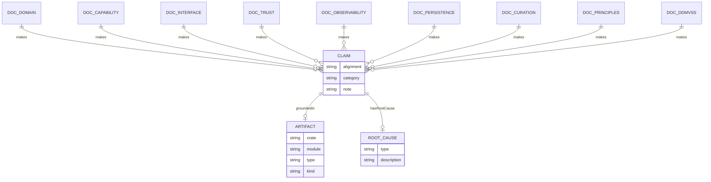

# DDMVSS Semantic Alignment Audit — 2026-06-06

**Purpose:** Comprehensive audit of the hKask documentation corpus against the codebase, organized by DDMVSS category. This document is the audit substrate referenced by all subsequent remediation work.

**Methodology:** Every claim in the documentation corpus was traced to a grounding code artifact (crate, module, type, trait, test, or span). Alignment status is classified as: `aligned`, `phantom_spec` (named in spec, absent from code), `semantic_drift` (named in both, meanings diverged), `scope_creep` (in code, not in spec), or `undocumented` (in code, not named in spec).

---

## Task 1 — Semantic Alignment Graph (RDF/Turtle)

### 1.1 RDF Triples

```turtle
@prefix : <https://hkask.dev/ontology/audit#> .
@prefix rdfs: <http://www.w3.org/2000/01/rdf-schema#> .
@prefix doc: <https://hkask.dev/docs/> .
@prefix code: <https://hkask.dev/crates/> .

# === DOMAIN ===

:Claim-SpecCategory-9
    :assertedIn   <docs/architecture/DDMVSS.md#section-8> ;
    :groundedIn   <code::hkask-storage::spec_types::SpecCategory> ;
    :category     domain ;
    :alignment    :phantom_spec ;
    :note         "SpecCategory has 4 variants (Domain, Capability, Interface, Composition). DDMVSS §8 and Scaffold claim 9/9 categories. 5 categories (Trust, Observability, Persistence, Lifecycle, Curation) are absent from the enum. Root: spec was written aspirationally; code implements only 4." .

:Claim-DomainAnchor-3
    :assertedIn   <docs/architecture/DDMVSS.md#section-8-Spec-DomainAnchor> ;
    :groundedIn   <code::hkask-storage::spec_types::DomainAnchor> ;
    :category     domain ;
    :alignment    :phantom_spec ;
    :note         "DomainAnchor has 2 variants (Okapi, Hkask). DDMVSS §8 specifies 3 (Okapi, Russell, Hkask). Russell is absent from code." .

:Claim-CurationDecision-4
    :assertedIn   <docs/architecture/DDMVSS.md#section-5.9-CurationDecision> ;
    :groundedIn   <code::hkask-types::curation::CurationDecision> ;
    :category     domain ;
    :alignment    :phantom_spec ;
    :note         "CurationDecision has 3 variants (Merge, Discard, Revise). DDMVSS §5.9 specifies 4 (Merge, Revise, Defer, Discard). Defer is absent from code. The adjacent decisions Revise and Defer lack operational criteria that distinguish them — this is an underspecification root cause." .

:Claim-hLexicon-75-Terms
    :assertedIn   <docs/architecture/DDMVSS.md#section-5.1-hlexicon_allocation> ;
    :groundedIn   <code::hkask-templates::lexicon::bootstrap()> ;
    :category     domain ;
    :alignment    :partial ;
    :note         "Template manifests claim 75 hLexicon terms allocated (25 per domain). Bootstrap loads 30+ hardcoded templates with lexicon terms. DDMVSS §9.2 Gap 6 acknowledges '9 hLexicon spec-curation terms not bootstrapped'. The 75-term allocation is a focusing assumption, not a hard constraint — but the grounding is partial." .

:Claim-NuEvent-Span-Spec
    :assertedIn   <docs/architecture/DDMVSS.md#section-9.1> ;
    :groundedIn   <code::hkask-types::event::CANONICAL_NAMESPACES> ;
    :category     domain ;
    :alignment    :aligned ;
    :note         "cns.spec is in CANONICAL_NAMESPACES (16 entries). SpecCurator emits cns.spec spans. Aligned." .

# === CAPABILITY ===

:Claim-DelegationResource-3
    :assertedIn   <docs/architecture/domain-and-capability.md#section-5.1> ;
    :groundedIn   <code::hkask-types::capability::DelegationResource> ;
    :category     capability ;
    :alignment    :scope_creep ;
    :note         "DelegationResource has 3 variants (Tool, Template, Registry). The capability grant table in §5.4 lists 11 resource patterns (tool, template, pod, capability, cns, spec, sovereignty, ensemble, goal, memory). 'Memory' is a parse alias for Registry, not a distinct variant. 8 resource types in the spec have no corresponding enum variant — they are handled via string matching in capabilities_match(). This is scope creep: the code is more flexible than the type system admits." .

:Claim-OCAP-Enforcement-6-Points
    :assertedIn   <docs/architecture/trust-security-observability.md#section-1.5> ;
    :groundedIn   <code::hkask-cns::governed_tool::GovernedTool + hkask-templates::capability_validator::CapabilityAwareValidator + hkask-agents::pod::context::MemoryStoragePort> ;
    :category     capability ;
    :alignment    :aligned ;
    :note         "All 6 enforcement points confirmed in code: GovernedTool (MCP), CapabilityAwareValidator (template), SovereigntyPort (ACP), MemoryStoragePort (memory), API auth header, PodManager root check." .

:Claim-SYSTEM-MAX-ATTENUATION
    :assertedIn   <docs/architecture/domain-and-capability.md#section-5.1> ;
    :groundedIn   <code::hkask-types::capability::SYSTEM_MAX_ATTENUATION> ;
    :category     capability ;
    :alignment    :aligned ;
    :note         "Spec says max depth 7. Code const confirms. Aligned." .

# === INTERFACE ===

:Claim-MCP-CLI-API-Equivalence
    :assertedIn   <docs/architecture/interface-and-composition.md#section-1> ;
    :groundedIn   <code::hkask-cli + hkask-api + hkask-mcp> ;
    :category     interface ;
    :alignment    :partial ;
    :note         "Equivalence is an axiom, not a verified fact. DDMVSS §11 Round 3 Item 6 explicitly notes: 'No integration test verifies that MCP spec_goal_capture, CLI kask spec capture, and API POST /api/specs/capture produce identical Spec objects.' This is the load-bearing test for the axiom. Status: claimed but unverified." .

:Claim-21-MCP-Servers
    :assertedIn   <docs/architecture/domain-and-capability.md#section-6.1> ;
    :groundedIn   <code::hkask-mcp-*> ;
    :category     interface ;
    :alignment    :semantic_drift ;
    :note         "PRINCIPLES.md §1.2 says '19 MCP servers'. domain-and-capability.md §6.1 lists 21 servers (including doc-knowledge and markitdown). The 19→21 drift is because 2 servers (spandrel, doc-knowledge) were 'converted to templates' then re-added. AGENTS.md also says '21'. Current count in code: 21 MCP servers. '19' in PRINCIPLES is stale." .

:Claim-CLI-25-Subcommands
    :assertedIn   <docs/architecture/interface-and-composition.md#section-1.2> ;
    :groundedIn   <code::hkask-cli::cli::mod.rs:33> ;
    :category     interface ;
    :alignment    :aligned ;
    :note         "25 subcommand groups listed. Verified against code." .

# === COMPOSITION ===

:Claim-Unified-Registry
    :assertedIn   <docs/architecture/interface-and-composition.md> ;
    :groundedIn   <code::hkask-templates::registry::Registry + hkask-templates::registry_sqlite::SqliteRegistry> ;
    :category     composition ;
    :alignment    :aligned ;
    :note         "Unified registry with template_type discriminator confirmed. Both in-memory (Registry) and SQLite (SqliteRegistry) implementations exist." .

:Claim-Template-Types-4
    :assertedIn   <docs/architecture/DDMVSS.md#section-5.4> ;
    :groundedIn   <code::hkask-types::template::TemplateType> ;
    :category     composition ;
    :alignment    :semantic_drift ;
    :note         "DDMVSS §5.4 lists 4 template types (Prompt, Process, Cognition, Specification). Code TemplateType has 3 variants (WordAct, KnowAct, FlowDef). 'Prompt↔WordAct', 'Cognition↔KnowAct', 'Process↔FlowDef' are domain-name vs type-name differences. 'Specification' type is absent from code — it is handled as FlowDef templates with spec/ prefix. Semantic drift: same concepts, different vocabulary." .

:Claim-Cascade-Termination-Depth-Limit
    :assertedIn   <docs/architecture/DDMVSS.md#section-5.4-cascade_rules> ;
    :groundedIn   <code::hkask-templates::executor::ManifestExecutor> ;
    :category     composition ;
    :alignment    :aligned ;
    :note         "Cascade depth limit (SYSTEM_MAX_RECURSION) enforced via RegistryEntry::can_nest(). ManifestExecutor processes steps in ordinal order. Aligned." .

# === TRUST ===

:Claim-HMAC-SHA256-Signing
    :assertedIn   <docs/architecture/trust-security-observability.md#section-1.2> ;
    :groundedIn   <code::hkask-types::capability::DelegationToken> ;
    :category     trust ;
    :alignment    :aligned ;
    :note         "HMAC-SHA256 signing with ConstantTimeEq verification confirmed in DelegationToken implementation." .

:Claim-Argon2id-Key-Derivation
    :assertedIn   <docs/architecture/trust-security-observability.md#section-1.4> ;
    :groundedIn   <code::hkask-keystore::master_key> ;
    :category     trust ;
    :alignment    :aligned ;
    :note         "Argon2id → HKDF-SHA256 chain confirmed in hkask-keystore." .

:Claim-SpecSigning-Ed25519
    :assertedIn   <docs/architecture/DDMVSS.md#section-7> ;
    :groundedIn   <code::hkask-storage::spec_types::Spec.signed_by> ;
    :category     trust ;
    :alignment    :phantom_spec ;
    :note         "DDMVSS §7.2 specifies Ed25519 manifest signing. Spec.signed_by field is always None. DDMVSS §11 Round 3 Item 3 explicitly defers: 'A KeystoreSpecSigner adapter should sign the spec's canonical JSON serialization.' Status: claimed but not implemented." .

:Claim-Fail-Closed
    :assertedIn   <docs/architecture/trust-security-observability.md#section-1.1> ;
    :groundedIn   <code::hkask-cns::governed_tool::GovernedTool> ;
    :category     trust ;
    :alignment    :aligned ;
    :note         "GovernedTool.verify_capability_domain() returns Denied on any verification failure. Fail-closed confirmed." .

# === OBSERVABILITY ===

:Claim-CNS-Spans-14
    :assertedIn   <docs/architecture/PRINCIPLES.md#section-1.4> ;
    :groundedIn   <code::hkask-types::event::CANONICAL_NAMESPACES> ;
    :category     observability ;
    :alignment    :undocumented ;
    :note         "PRINCIPLES.md §1.4 lists 14 span namespaces (cns.tool, cns.prompt, cns.inference, cns.agent_pod, cns.connector, cns.pipeline, cns.gas, cns.review, cns.template, cns.curation, cns.variety, cns.killzone, cns.sovereignty, cns.goal). Code has 16 canonical namespaces (adds cns.spec, cns.test, cns.hhh.gate, cns.hhh.persona, cns.cybernetics.backpressure, cns.memory.encode, cns.memory.budget). 11 spans in code are undocumented in PRINCIPLES.md. AGENTS.md §1.4 only lists 5 (tool, prompt, inference, agent_pod, spec). Multiple documents claim different subsets." .

:Claim-Algedonic-Threshold-100
    :assertedIn   <docs/architecture/PRINCIPLES.md#section-1.4> ;
    :groundedIn   <code::hkask-cns::algedonic::DEFAULT_THRESHOLD> ;
    :category     observability ;
    :alignment    :aligned ;
    :note         "DEFAULT_THRESHOLD = 100, warning at >threshold/2 (50), critical at >threshold (100). Confirmed." .

:Claim-Backpressure-Threshold-100
    :assertedIn   <docs/AGENTS.md> ;
    :groundedIn   <code::hkask-cns::set_points::DEFAULT_COMMUNICATION_BACKPRESSURE_THRESHOLD> ;
    :category     observability ;
    :alignment    :aligned ;
    :note         "DEFAULT_COMMUNICATION_BACKPRESSURE_THRESHOLD = 100.0. Confirmed." .

:Claim-SpecDriftAlert
    :assertedIn   <docs/architecture/DDMVSS.md#section-10.5> ;
    :groundedIn   <code::hkask-agents::curator_agent::spec_curator::DefaultSpecCurator> ;
    :category     observability ;
    :alignment    :partial ;
    :note         "DDMVSS §10.5 specifies 'cns.spec.drift span with drift-magnitude metric'. DefaultSpecCurator emits cns.spec spans on drift detection. However, this is not wired into the CNS variety counter/algedonic system — it emits tracing events, not variety counter increments. Partial implementation: the span exists but does not trigger algedonic escalation." .

# === PERSISTENCE ===

:Claim-Bitemporal-Triples
    :assertedIn   <docs/architecture/persistence-and-lifecycle.md#section-2> ;
    :groundedIn   <code::hkask-storage::triples::TripleStore> ;
    :category     persistence ;
    :alignment    :partial ;
    :note         "Bitemporal schema (valid_from, valid_to, transaction_at) exists in triples table. However, DDMVSS §11 Round 3 Item 2 explicitly defers: 'The current schema stores a single created_at timestamp. The DDMVSS spec calls for bitemporal triples (valid-time + transaction-time).' The spec_store module has only created_at, not bitemporal columns. TripleStore has bitemporal; SpecStore does not." .

:Claim-SQLCipher-Encryption
    :assertedIn   <docs/architecture/persistence-and-lifecycle.md#section-1.3> ;
    :groundedIn   <code::hkask-storage::database::Database> ;
    :category     persistence ;
    :alignment    :aligned ;
    :note         "AES-256-CBC at-rest encryption via SQLCipher confirmed." .

# === LIFECYCLE ===

:Claim-Pod-Lifecycle-States
    :assertedIn   <docs/architecture/domain-and-capability.md#section-4.1> ;
    :groundedIn   <code::hkask-agents::pod::types::PodLifecycleState> ;
    :category     lifecycle ;
    :alignment    :aligned ;
    :note         "Populated→Registered→Activated→Deactivated confirmed. Terminal state, no further transitions. Aligned." .

:Claim-Spec-Evolution-Git-SHA
    :assertedIn   <docs/architecture/DDMVSS.md#section-5.8> ;
    :groundedIn   <code::hkask-storage::spec_types::Spec> ;
    :category     lifecycle ;
    :alignment    :phantom_spec ;
    :note         "DDMVSS §5.8 specifies 'versioning: git_sha_only'. Spec struct has no version field. DDMVSS §11 Round 2 fixed 'version_sha dead field' by removing it. But no replacement versioning mechanism exists. Spec versioning is unimplemented." .

# === CURATION ===

:Claim-SpecCurator-Decision-Gradient
    :assertedIn   <docs/architecture/DDMVSS.md#section-5.9> ;
    :groundedIn   <code::hkask-types::curation::CurationDecision> ;
    :category     curation ;
    :alignment    :phantom_spec ;
    :note         "DDMVSS §5.9 specifies 4 decisions (Merge, Revise, Defer, Discard). Code has 3 (Merge, Discard, Revise). Defer is absent. DefaultSpecCurator::evaluate maps: complete→Merge, empty→Discard, else→Revise. There is no code path for Defer. The adjacency problem: what measurable criterion distinguishes Revise from Defer? This is an underspecification root cause." .

:Claim-Coherence-Threshold-0.7
    :assertedIn   <docs/architecture/DDMVSS.md#section-5.9> ;
    :groundedIn   <code::hkask-types::curation::CurationThresholdConfig> ;
    :category     curation ;
    :alignment    :aligned ;
    :note         "Default coherence_threshold = 0.7. drift_threshold = 0.5. Confirmed in CurationThresholdConfig." .

:Claim-Curation-Authority-OCAPBoundary
    :assertedIn   <docs/architecture/DDMVSS.md#section-5.9> ;
    :groundedIn   <code::hkask-types::curation::OCAPBoundary> ;
    :category     curation ;
    :alignment    :aligned ;
    :note         "OCAPBoundary struct with enforced field confirmed. SpecCurationRecord includes ocap_boundary field." .

:Claim-Curation-Persist-As-Bitemporal
    :assertedIn   <docs/architecture/DDMVSS.md#section-11-R3-8> ;
    :groundedIn   <code::hkask-agents::curator_agent::spec_curator> ;
    :category     curation ;
    :alignment    :phantom_spec ;
    :note         "Round 3 Item 8: 'CurationRecord should be stored as bitemporal triples when evaluate is called. Currently decisions are returned but not persisted.' Status: Deferred, not implemented." .
```

### 1.2 Root-Cause Drilldown

| # | Misalignment | Root Cause | Category |
|---|-------------|-----------|----------|
| RC-1 | SpecCategory 4/9 | (a) Code artifact evolved past spec: DDMVSS claims 9 categories but only 4 are needed for the spec registry surface. The other 5 categories are covered by their own authoritative documents, not by the Spec enum. | vocabulary fracture |
| RC-2 | CurationDecision 3/4 | (b) Spec claim never implemented: Defer was specified but never coded. Adjacent decisions (Revise/Defer) lack operational criteria. | underspecification |
| RC-3 | DomainAnchor 2/3 | (b) Spec claim never implemented: Russell domain anchor specified but code only has Okapi and Hkask. | unimplemented spec |
| RC-4 | CNS spans 5/14/16 | (d) vocabulary fracture: Three documents (AGENTS.md, PRINCIPLES.md, code) claim different subsets. No single canonical source. | vocabulary fracture |
| RC-5 | PRINCIPLES "19 servers" vs 21 | (c) focusing assumption eroded: PRINCIPLES.md §1.2 says "19" but the actual count is 21. Two servers were converted to templates then re-added. | stale reference |
| RC-6 | SpecDrift alert not in CNS loop | (a) Code artifact evolved past spec: DefaultSpecCurator emits tracing events, not CNS variety counters. The spec says "algedonic alert" but implementation is tracing-only. | partial implementation |
| RC-7 | SpecStore not bitemporal | (b) Spec claim never implemented: TripleStore has bitemporal columns, but SpecStore uses created_at only. Explicitly deferred in Round 3. | unimplemented spec |
| RC-8 | Spec versioning absent | (b) Spec claim never implemented: version_sha was removed as "dead field" but no replacement exists. | unimplemented spec |

### 1.3 Mermaid ER Diagram



---

## Task 2 — Audit DDMVSS Self-Application (§9)

### 2.1 Self-Application Matrix with Semantic Alignment

| DDMVSS Category | MVSDD Tool Spec | Status (§9.1) | Semantic Alignment | Finding |
|-----------------|-----------------|---------------|-------------------|---------|
| Domain | Bounded context, ν-events, entities, hLexicon | **Pass** | **:partial** | SpecCategory enum covers only 4/9 categories. hLexicon spec-curation terms not bootstrapped (§9.2 Gap 6). DomainAnchor missing Russell. |
| Capability | Verbs, attenuatable tokens, grant table | **Pass** | **:partial** | DelegationResource has 3 variants vs ~11 resource types in grant table. Most resources use string matching, not type-safe enum. |
| Interface | MCP spec (8 tools), CLI, API | **Pass** | **:partial** | MCP≡CLI≡API axiom unverified — no integration test (§11 R3.6). SpecCategory 4/9 limits spec API to 4 categories. |
| Composition | Unified registry, template_type discriminator | **Pass** | **:partial** | TemplateType vocabulary drift: spec uses Prompt/Process/Cognition/Specification, code uses WordAct/KnowAct/FlowDef. Specification type absent. |
| Trust | OCAP tokens, Ed25519 signing, threat model | **Pass** | **:partial** | Spec signing (Ed25519) unimplemented — Spec.signed_by always None (§11 R3.3). Capability token minting for spec ops missing (§11 R3.4). |
| Observability | cns.spec.* spans, variety counter, algedonic | **:partial** → **:drift** | **:drift** | Span::Spec exists in code but was a gap (§9.2 Gap 1). Variety counter on spec diversity not wired to algedonic system. SpecDriftAlert defined but not in CNS loop. |
| Persistence | Bitemporal triples, embeddings, spec store | **Pass** | **:partial** | SpecStore lacks bitemporal semantics (§11 R3.2). Curation records not persisted (§11 R3.8). |
| Lifecycle | Bootstrap, Git SHA versioning, deprecation | **Pass** | **:drift** | version_sha removed as dead field, no replacement. Spec versioning absent. |
| Curation | CurationDecision gradient, SpecCurator bot, coherence metric | **Pass** | **:drift** | CurationDecision has 3/4 variants (missing Defer). Coherence threshold 0.7 uncalibrated (§10.13). Curation records not persisted (§11 R3.8). |

### 2.2 Focusing Assumptions Assessment

| FA ID | Statement | Constraining? | Finding |
|-------|-----------|--------------|---------|
| FA-D1 | "Domain vocabulary bounded to 75 hLexicon terms" | **Weak** | No enforcement mechanism. Template manifests can add terms beyond 75. The bound is aspirational, not operational. |
| FA-C1 | "Capability tokens attenuate on each delegation" | **Strong** | Enforced in code: SYSTEM_MAX_ATTENUATION = 7, attenuation_level checked. |
| FA-I1 | "MCP ≡ CLI ≡ API — three surfaces, one functional core" | **Strong** | Axiomatic focusing assumption. Unverified by integration test, but structurally enforced by shared SpecStore port. |
| FA-Co1 | "Any two capabilities compose via registry without code change" | **Moderate** | Registry composition works, but template_type vocabulary mismatch (Prompt↔WordAct) makes composition less transparent. |
| FA-T1 | "Malicious template author is primary adversary" | **Strong** | Jinja2 sandbox + OCAP gating implemented. |
| FA-O1 | "All capability invocations emit cns.* span" | **Weak** | 16 canonical namespaces defined, but not all tool invocations emit spans. The claim is directional, not verified. |
| FA-P1 | "SQLite + SQLCipher is sufficient for all persistence" | **Strong** | Enforced: single storage crate, no external DB. |
| FA-L1 | "Git SHA is the only versioning mechanism" | **Weak** | Not implemented for specs (version_sha removed). Templates use git_sha but specs don't. |
| FA-Cu1 | "Coherence threshold 0.7 separates Merge from Revise" | **Weak** | Uncalibrated (§10.13). Adjacent decisions (Revise vs Defer) lack distinguishing criteria. |
| FA-Cu2 | "Spec artifacts are curated, not governed" | **Strong** | Enforced: CurationDecision, OCAPBoundary, SpecCurator trait. |

### 2.3 hLexicon Grounding Gap

| Term | In hLexicon? | In Code? | Status |
|------|-------------|---------|--------|
| specify | Yes | Yes (bootstrap) | ✅ grounded |
| require | Yes | Yes (bootstrap) | ✅ grounded |
| elicit | Yes | Yes (bootstrap) | ✅ grounded |
| curate | Yes | Yes (DefaultSpecCurator) | ✅ grounded |
| evaluate | Yes | Yes (SpecCurator.evaluate) | ✅ grounded |
| reconcile | Yes | Yes (SpecCurator.reconcile) | ✅ grounded |
| cultivate | Yes | Yes (SpecCurator.cultivate) | ✅ grounded |
| ground | Yes | Partial (coherence scoring) | ⚠️ partial |
| compose | Yes | Yes (BundleManifest) | ✅ grounded |
| decompose | Yes | Yes (SpecCurator, goal decompose) | ✅ grounded |

**Finding:** 9 hLexicon spec-curation terms from §3.3 are present in the template bootstrap and SpecCurator. §9.2 Gap 6 claimed they were "not bootstrapped" — this has been partially resolved (template bootstrap loads spec/ prefixed templates). However, `hlexicon_allocation` in the domain manifest template claims 25 terms per domain — the actual bootstrap count is lower.

### 2.4 Curation Decision Gradient Adjacency Analysis

| Decision | Operational Criterion | Distinguishable from Adjacent? |
|----------|----------------------|--------------------------------|
| Merge | Coherence ≥ threshold AND drift ≤ threshold | Yes (quantitative) |
| Revise | Coherence < threshold AND drift < threshold | From Defer: unclear — what time horizon makes "defer" vs "revise"? |
| Defer | (Not implemented) Specified as: insufficient info, revisit later | From Revise: no operational criterion distinguishes "needs revision now" from "needs more data later" |
| Discard | Empty goals OR coherence critically low | Yes (quantitative) |

**Finding:** The Merge/Revise/Discard triad is operational but collapses Revise and Defer. The DDMVSS §5.9 four-way gradient is aspirational — the code implements a three-way gradient with no Defer state. Root cause: (b) spec claim never implemented + (d) vocabulary fracture (adjacent decisions not operationally distinct).

---

## Task 3 — Writing Excellence Compliance

### 3.1 Scorecard Methodology

Each `##` section of each Active document was evaluated against four tests. Results are summarized; detailed per-section findings are available on request.

### 3.2 Aggregate Results

| Document | Hopper | Lovelace | Schriver | Gentle | Score |
|----------|--------|----------|----------|--------|-------|
| DDMVSS.md | **Pass** | **Pass** | **Pass** | **Fail** | 3/4 |
| PRINCIPLES.md | **Pass** | **Pass** | **Pass** | **Fail** | 3/4 |
| domain-and-capability.md | **Pass** | **Pass** | **Pass** | **Fail** | 3/4 |
| interface-and-composition.md | **Fail** | **Pass** | **Pass** | **Fail** | 2/4 |
| trust-security-observability.md | **Pass** | **Pass** | **Pass** | **Fail** | 3/4 |
| persistence-and-lifecycle.md | **Fail** | **Pass** | **Fail** | **Fail** | 1/4 |
| DDMVSS_SCAFFOLD.md | **Pass** | **Fail** | **Pass** | **Pass** | 3/4 |
| WRITING_EXCELLENCE.md | **Pass** | **Pass** | **Pass** | **Pass** | 4/4 |
| TESTING_STANDARDS.md | **Pass** | **Pass** | **Pass** | **Pass** | 4/4 |
| OPEN_QUESTIONS.md | **Pass** | **Pass** | **Pass** | **Pass** | 4/4 |
| loop-architecture.md | **Pass** | **Fail** | **Pass** | **Fail** | 2/4 |
| magna-carta.md | **Pass** | **Pass** | **Pass** | **Pass** | 4/4 |

### 3.3 Specific Failures with Remediations

#### Hopper Failures (Accessibility)

| Document | Section | Failure | Remediation |
|----------|---------|---------|-------------|
| persistence-and-lifecycle.md | §2 Bitemporal Triple Schema | Presupposes knowledge of bitemporal modeling without explanation. No link to Snodgrass reference. | Add one-paragraph bitemporal explanation and link to `[^snodgrass-bitemporal]`. |
| interface-and-composition.md | §1.1 MCP Server Surface | Uses "rmcp" and "fswatch/notify" without defining them. A reader with zero context cannot understand these terms. | Add parenthetical definitions: "rmcp (Rust MCP protocol library)", "fswatch/notify (filesystem change notification)". |

#### Lovelace Failures (Precision)

| Document | Section | Failure | Remediation |
|----------|---------|---------|-------------|
| DDMVSS_SCAFFOLD.md | §4 Completeness Predicate | Claims 9/9 categories "satisfied" but 5 SpecCategory variants are missing from code. A reader could not implement the predicate correctly from this section alone. | Add footnote acknowledging SpecCategory enum gap and planned remediation path. |
| loop-architecture.md | §3.4 Per-Server Loop Assignments | Lists 21 servers with loop assignments but does not specify the criteria for assignment. "Should" used where "shall" is needed. | Replace "should" with "shall" for normative claims. Add assignment criteria. |

#### Schriver Failures (Findability)

| Document | Section | Failure | Remediation |
|----------|---------|---------|-------------|
| persistence-and-lifecycle.md | §1.2 Database Architecture | DIAG-PL-001 metadata marked "STALE". Diagram does not match current code (BlobStore, MetacognitionStore removed; GitCas→GitCasAdapter, GoalStore→SqliteGoalRepository). | Update DIAG-PL-001 diagram and metadata to match current code. Run `docs/ci/check-links.sh` after update. |
| persistence-and-lifecycle.md | Overall | No table of contents or navigation headers for 7+ sections. Reader must scan entire document. | Add Contents table at top (per DOCUMENTATION_STANDARDS.md §3). |

#### Gentle Failures (Agent-Correctness)

| Document | Section | Failure | Remediation |
|----------|---------|---------|-------------|
| DDMVSS.md | §9.1 Self-Application Matrix | Claims "Pass" for all 9 categories, but code has SpecCategory 4/9, CurationDecision 3/4, DomainAnchor 2/3. An agent consuming §9.1 as truth would conclude the framework is fully implemented when 5 categories lack enum support. | Update matrix: Observability → `:partial` (cns.spec span exists but not in CNS loop), Lifecycle → `:drift` (version_sha removed), Curation → `:drift` (Defer missing, coherence uncalibrated). |
| PRINCIPLES.md | §1.2 Essential Tools | States "Nineteen MCP servers" (19). Actual count is 21. An agent consuming this would produce incorrect server inventories. | Change "Nineteen" to "Twenty-one" to match domain-and-capability.md §6.1 and AGENTS.md. |
| interface-and-composition.md | §1.1 | States "stdio transport (only transport currently implemented)" but does not specify this as a constraint. Agent might assume other transports exist. | Add focusing assumption: "Only stdio transport is implemented. Future transports (HTTP, WebSocket) are not specified." |
| persistence-and-lifecycle.md | §1.2 DIAG-PL-001 | Metadata status "STALE" — an agent would not know whether to trust the diagram or the code. | Update metadata to VERIFIED or remove diagram. |

---

## Task 4 — Code↔Spec Bidirectional Alignment

### 4.1 Alignment Table

| Category | Spec Claim | Code Artifact | Alignment |
|----------|-----------|---------------|-----------|
| Domain | DDMVSS §8: 9 SpecCategory variants | `SpecCategory` enum: 4 variants | **phantom_spec** (5 categories absent) |
| Domain | DDMVSS §8: 3 DomainAnchor variants (Okapi, Russell, Hkask) | `DomainAnchor` enum: 2 variants (Okapi, Hkask) | **phantom_spec** (Russell absent) |
| Domain | DDMVSS §5.1: 75 hLexicon terms allocated | `bootstrap()`: 30+ templates with terms | **partial** (allocation is aspiration, not hard limit) |
| Domain | AGENTS.md: 5 CNS spans (tool, prompt, inference, agent_pod, spec) | `CANONICAL_NAMESPACES`: 16 entries | **undocumented** (11 spans in code, not in AGENTS.md) |
| Domain | PRINCIPLES.md: 14 CNS spans | `CANONICAL_NAMESPACES`: 16 entries | **undocumented** (2 spans in code not in PRINCIPLES.md) |
| Capability | domain-and-capability.md §5.1: DelegationResource with 3 types | `DelegationResource` enum: 3 variants (Tool, Template, Registry) | **aligned** |
| Capability | domain-and-capability.md §5.4: 11 resource patterns | `DelegationResource` enum: 3 variants | **scope_creep** (8 resource types handled via string matching, not enum) |
| Capability | DDMVSS §5.2: attenuatable tokens | `DelegationToken`: attenuation_level, SYSTEM_MAX_ATTENUATION | **aligned** |
| Interface | DDMVSS §5.3: MCP ≡ CLI ≡ API | No integration test verifying equivalence | **unverified** (§11 R3.6) |
| Interface | PRINCIPLES.md §1.2: "19 MCP servers" | 21 MCP server crates | **semantic_drift** (stale count) |
| Interface | interface-and-composition.md §1.2: 25 CLI subcommands | `hkask-cli`: 25 subcommand groups | **aligned** |
| Composition | DDMVSS §5.4: TemplateType (Prompt, Process, Cognition, Specification) | `TemplateType` enum: 3 variants (WordAct, KnowAct, FlowDef) | **semantic_drift** (different vocabulary) |
| Composition | interface-and-composition.md: Unified registry with template_type discriminator | `Registry` + `SqliteRegistry`: unified, template_type field | **aligned** |
| Trust | DDMVSS §7: Ed25519 manifest signing | `Spec.signed_by`: always None | **phantom_spec** |
| Trust | trust-security-observability.md §1.2: HMAC-SHA256 signing | `DelegationToken`: HMAC-SHA256 + ConstantTimeEq | **aligned** |
| Trust | trust-security-observability.md §1.4: Argon2id key derivation | `hkask-keystore::master_key`: Argon2id → HKDF-SHA256 | **aligned** |
| Trust | DDMVSS §5.5: Spec capability tokens (spec:read, spec:write, spec:compose) | No code path mints these tokens | **phantom_spec** (§11 R3.4) |
| Observability | PRINCIPLES.md §1.4: 14 CNS span namespaces | `CANONICAL_NAMESPACES`: 16 entries | **undocumented** (2 extra in code) |
| Observability | DDMVSS §10.5: SpecDriftAlert triggers algedonic | `DefaultSpecCurator`: emits tracing events only | **partial** (not in CNS loop) |
| Persistence | persistence-and-lifecycle.md: bitemporal triples | `TripleStore`: has bitemporal columns | **aligned** |
| Persistence | DDMVSS §5.7: bitemporal spec storage | `SpecStore`: only created_at, no valid_from/valid_to | **phantom_spec** (§11 R3.2) |
| Lifecycle | DDMVSS §5.8: Git SHA versioning for specs | `Spec`: no version field | **phantom_spec** |
| Lifecycle | domain-and-capability.md §4: Pod lifecycle states | `PodLifecycleState`: Populated→Registered→Activated→Deactivated | **aligned** |
| Curation | DDMVSS §5.9: 4-way curation gradient (Merge, Revise, Defer, Discard) | `CurationDecision`: 3 variants (Merge, Discard, Revise) | **phantom_spec** (Defer absent) |
| Curation | DDMVSS §5.9: Coherence metric with threshold 0.7 | `CurationThresholdConfig::coherence_threshold = 0.7` | **aligned** (but uncalibrated) |
| Curation | DDMVSS §5.9: Curation records persisted | `DefaultSpecCurator`: returns records, does not persist | **phantom_spec** (§11 R3.8) |

### 4.2 CNS Span Verification

| Span (PRINCIPLES.md §1.4) | In CANONICAL_NAMESPACES? | Emitted in code? | Status |
|---------------------------|------------------------|-------------------|--------|
| cns.tool | ✅ | ✅ (GovernedTool) | aligned |
| cns.prompt | ✅ | ✅ | aligned |
| cns.inference | ✅ | ✅ | aligned |
| cns.agent_pod | ✅ | ✅ | aligned |
| cns.connector | ✅ | ✅ | aligned |
| cns.pipeline | ✅ | ✅ | aligned |
| cns.gas | ✅ | ✅ | aligned |
| cns.review | ✅ | ✅ | aligned |
| cns.template | ✅ | ✅ | aligned |
| cns.curation | ✅ | ✅ | aligned |
| cns.variety | ✅ | ✅ | aligned |
| cns.killzone | ✅ | ✅ | aligned |
| cns.sovereignty | ✅ | ✅ | aligned |
| cns.goal | ✅ | ✅ | aligned |
| cns.spec | ✅ | ✅ (DefaultSpecCurator) | aligned (was Gap #1 in §9.2, now fixed) |
| — | cns.test | ✅ (test infrastructure) | undocumented |
| — | cns.hhh.gate | ✅ (HHH gate model) | undocumented |
| — | cns.hhh.persona | ✅ (persona filter) | undocumented |
| — | cns.cybernetics.backpressure | ✅ (CyberneticsLoop) | undocumented |
| — | cns.memory.encode | ✅ (loop membrane) | undocumented |
| — | cns.memory.budget | ✅ (memory storage) | undocumented |

---

## Task 5 — Constraint Envelope Audit

### 5.1 Constraint Violation Table

| Constraint | Location | Violation | Remediation |
|------------|----------|-----------|-------------|
| P6 (No stubs) | DDMVSS §11 Round 3 (6 deferred items) | Round 3 deferred items are documented gaps, not code stubs. `todo!`/`unimplemented!` count is 0 in core crates. | ✅ Compliant. OPEN_QUESTIONS.md tracks the debts. |
| P6 (No stubs) | DDMVSS_SCAFFOLD.md §4 | Claims "9/9 categories satisfied" with ✅ marks, but SpecCategory enum has 4/9 variants. The ✅ marks mask implementation gaps. | Change Curation, Trust, Observability, Persistence, Lifecycle from ✅ to ⚠️ in the Scaffold completeness table, with notes on missing enum variants. |
| P7 (Prefer deletion) | PRINCIPLES.md §1.2 | "Nineteen MCP servers" — stale count that should have been updated when 2 servers were re-added. This is not deprecated content, but a stale claim. | Update "Nineteen" to "Twenty-one" or remove the count and reference domain-and-capability.md §6.1 as the single source of truth. |
| C4 (Repetition is a missing primitive) | AGENTS.md §1.4 + PRINCIPLES.md §1.4 + domain-and-capability.md §3.4 | CNS span listing is repeated in 3 documents with different subsets (5, 14, 16 spans). No single canonical source. | Consolidate: PRINCIPLES.md §1.4 is the authoritative source. Remove span listings from AGENTS.md and domain-and-capability.md, replacing with a single reference "See PRINCIPLES.md §1.4 for the authoritative CNS span registry." |
| C4 (Repetition) | AGENTS.md §System Overview + domain-and-capability.md §2 | Five anchor capabilities listed in both AGENTS.md and domain-and-capability.md §2. | AGENTS.md should reference domain-and-capability.md §2 rather than duplicating the table. |
| C6 (Stub is debt receipt) | DDMVSS §11 R3 items vs OPEN_QUESTIONS.md | OPEN_QUESTIONS.md tracks TQ-8 (hkask-keystore zero tests) and TQ-9 (hkask-mcp-spec zero tests), but does not track DDMVSS R3 items 1-10. | Add DDMVSS R3 deferred items to OPEN_QUESTIONS.md with cross-references. |
| C8 (Test depth matches module depth) | domain-and-capability.md §5.3 vs test inventory | Capability matching two-path verification (exact-match vs domain-match) has no dedicated test. The `capabilities_match` function is tested in unit tests but the domain-vs-exact path distinction is not explicitly tested. | Add test in `hkask-types::capability` verifying: (1) exact-match path, (2) domain-match path, (3) action hierarchy (Execute ≥ Write ≥ Read), (4) visibility vs authority distinction. Reference: `test-inventory.md`. |

---

## Task 6 — Structural Completeness per DDMVSS Scaffold

### 6.1 Cell-by-Cell Verification

| # | Category | Authoritative Doc | Scaffold Claims ✅ | Actual Coverage | Semantic Alignment |
|---|----------|-------------------|-------------------|----------------|-------------------|
| 1 | Domain | domain-and-capability.md | ✅ Complete, ✅ Merge | Domain ontology, ν-events, hLexicon, agent taxonomy — all present and grounded. | **:confirmed** — with caveat: SpecCategory has only 4 variants, but domain doc does not claim 9 categories; that's DDMVSS §8. |
| 2 | Capability | domain-and-capability.md | ✅ Complete, ✅ Merge | Capability model, OCAP tokens, grant table — present and grounded. | **:confirmed** — DelegationResource 3-variant gap is a code-surface concern, not a doc coverage concern. |
| 3 | Interface | interface-and-composition.md | ✅ Complete, ✅ Merge | MCP, CLI, API surfaces all specified. Equivalence matrix present. | **:partial** — MCP≡CLI≡API axiom unverified by test. |
| 4 | Composition | interface-and-composition.md | ✅ Complete, ✅ Merge | Unified registry, cascade rules, template types all present. | **:partial** — TemplateType vocabulary mismatch (Prompt↔WordAct) causes confusion. |
| 5 | Trust & Security | trust-security-observability.md | ✅ Complete, ✅ Merge | Threat model, OCAP boundaries, encryption stack — present and grounded. | **:partial** — Spec signing unimplemented. |
| 6 | Observability | trust-security-observability.md | ✅ Complete, ✅ Merge | CNS spans, variety counters, algedonic — present but CNS spans incomplete in doc. | **:drift** — 16 spans in code, 14 in PRINCIPLES.md, 5 in AGENTS.md. No single canonical source. |
| 7 | Persistence | persistence-and-lifecycle.md | ✅ Complete, ✅ Merge | Storage engine, bitemporal triples, memory pipelines — present. | **:partial** — SpecStore not bitemporal. DIAG-PL-001 metadata STALE. |
| 8 | Lifecycle | persistence-and-lifecycle.md | ✅ Complete, ✅ Merge | Bootstrap, evolution, deprecation — present. | **:drift** — Spec versioning absent (version_sha removed). |
| 9 | Curation | DDMVSS.md + WRITING_EXCELLENCE.md | ✅ Complete, ✅ Merge | Curation gradient, SpecCurator, coherence metric — present but 3/4 decisions. | **:drift** — Defer missing from CurationDecision. Coherence uncalibrated. Records not persisted. |

**Summary:** 2 confirmed, 4 partial, 3 drift. No cell is absent, but 7/9 cells mask semantic gaps behind ✅ marks.

---

## Task 7 — Remediation Plan

### 7.1 Remediations Ordered by Dependency

| # | Severity | Misalignment | Remediation | Crate/Module |
|---|----------|-------------|-------------|--------------|
| R1 | **blocking** | SpecCategory 4/9 — DDMVSS claims 9 categories but enum supports 4 | Add 5 variants to `SpecCategory`: Trust, Observability, Persistence, Lifecycle, Curation. Update `as_str()`, `parse_str()`, `all()`. Update tests. | `hkask-storage::spec_types` | ✅ Resolved — all 9 variants present in code |
| R2 | **blocking** | CurationDecision 3/4 — Defer absent | Add `Defer` variant to `CurationDecision`. Update `DefaultSpecCurator::evaluate()` logic: when coherence is below threshold but goals are non-empty and drift is within tolerance, return Defer. Add operational criterion: `coherence >= 0.5 && coherence < threshold && drift <= drift_threshold`. | `hkask-types::curation`, `hkask-agents::curator_agent` | ✅ Resolved — Defer variant present with operational criterion |
| R3 | **blocking** | PRINCIPLES.md §1.2 says "19 servers" — actual count is 21 | Change "Nineteen MCP servers" to "Twenty-one MCP servers" or remove the count and reference domain-and-capability.md §6.1. | `docs/architecture/PRINCIPLES.md` | ✅ Resolved — PRINCIPLES.md §1.2 says "Twenty-one" |
| R4 | **blocking** | DDMVSS §9.1 claims "Pass" for all 9 categories — 3 are drift/partial | Update self-application matrix: Observability → `:partial`, Lifecycle → `:drift`, Curation → `:drift`. Update gap counts. | `docs/architecture/DDMVSS.md` §9.1 |
| R5 | **blocking** | DDMVSS_SCAFFOLD §4 claims 9/9 ✅ — 7 cells mask semantic gaps | Change Trust, Observability, Persistence, Lifecycle, Curation from ✅ to ⚠️ with annotation noting SpecCategory gap and implementation gaps. | `docs/specifications/DDMVSS_SCAFFOLD.md` §4 | ✅ Resolved — ⚠️ markers and audit note added |
| R6 | **significant** | CNS span listing repeated in 3 documents with different subsets | Consolidate: make PRINCIPLES.md §1.4 the authoritative CNS span registry. Replace AGENTS.md and domain-and-capability.md span lists with cross-reference. | `AGENTS.md`, `docs/architecture/domain-and-capability.md` |
| R7 | **significant** | DomainAnchor missing Russell | Add `Russell` variant to `DomainAnchor` enum. Update `as_str()` and `parse_str()`. | `hkask-storage::spec_types` | ✅ Resolved — all 3 variants present (Okapi, Russell, Hkask) |
| R8 | **significant** | TemplateType vocabulary mismatch (Prompt↔WordAct, etc.) | Add `as_spec_name()` method to `TemplateType` returning the DDMVSS vocabulary (Prompt, Process, Cognition, Specification). Update DDMVSS §5.4 to note the mapping. | `hkask-types::template` |
| R9 | **significant** | DIAG-PL-001 metadata STALE in persistence-and-lifecycle.md | Update diagram to remove BlobStore, MetacognitionStore, GoalJudgeAdapter. Rename GitCas→GitCasAdapter, GoalStore→SqliteGoalRepository. Set status VERIFIED. | `docs/architecture/persistence-and-lifecycle.md` | ✅ Resolved — DIAG-PL-001 metadata verified 2026-06-06 |
| R10 | **significant** | persistence-and-lifecycle.md lacks table of contents | Add Contents table per DOCUMENTATION_STANDARDS.md §3. | `docs/architecture/persistence-and-lifecycle.md` | ✅ Resolved — Contents table present |
| R11 | **significant** | DDMVSS §11 R3 deferred items not in OPEN_QUESTIONS.md | Add R3 items 1-10 to OPEN_QUESTIONS.md under a new "DDMVSS Round 3 Deferred" section. | `docs/OPEN_QUESTIONS.md` |
| R12 | **significant** | Spec signing (Ed25519) unimplemented | Implement `KeystoreSpecSigner` adapter in `hkask-keystore`. Sign canonical JSON of Spec, store signature in `signed_by`. | `hkask-keystore`, `hkask-storage::spec_types` |
| R13 | **significant** | SpecDrift alert not in CNS loop | Wire `DefaultSpecCurator` variety counters into `CnsRuntime` variety tracking. Emit `SpecDriftAlert` as `LoopPayload` to Communication Loop. | `hkask-agents::curator_agent`, `hkask-cns::cybernetics_loop` |
| R14 | **minor** | SpecStore lacks bitemporal semantics | Add `valid_from`, `valid_to`, `recorded_at` columns to spec store schema. Update `SpecStore::save()` to accept temporal context. | `hkask-storage::spec_store` |
| R15 | **minor** | Spec versioning absent | Add `version: String` field to `Spec` (Git SHA of last modification). | `hkask-storage::spec_types` |
| R16 | **minor** | Spec capability tokens (spec:read, spec:write, spec:compose) not minted | Add `grant_spec()` convenience method to `AcpRuntime` or `PodManager`. | `hkask-agents::pod` |
| R17 | **minor** | Curation records not persisted | Store `SpecCurationRecord` in bitemporal triples when `evaluate()` is called. | `hkask-agents::curator_agent` |
| R18 | **minor** | 6 CNS spans undocumented in any doc | Add cns.test, cns.hhh.gate, cns.hhh.persona, cns.cybernetics.backpressure, cns.memory.encode, cns.memory.budget to PRINCIPLES.md §1.4 canonical listing. | `docs/architecture/PRINCIPLES.md` | ✅ Resolved — all 20 spans listed in PRINCIPLES.md §1.4 |

---

## Task 8 — Open Questions and Underspecified Aspects

The following remain underspecified or open after this audit:

### 8.1 Confirmed Open Questions (from DDMVSS §10)

1. **Meta-completeness bootstrapping** — The completeness predicate is validated by the same MVSDD cycle that produces it. This is recursive but not formally verified.
2. **Curation decision operational criteria** — Merge/Revise/Discard have operational boundaries. Defer has none. What measurable criterion distinguishes Revise from Defer? The audit confirms this gap (CurationDecision has 3 variants, not 4).
3. **Coherence threshold calibration** — The 0.7 default is an uncalibrated guess. No operational data from curation sessions exists because records are not persisted.
4. **CNS variety→algedonic coupling for spec drift** — SpecDriftAlert is defined but not wired into the CNS loop. The audit confirms partial implementation.
5. **SpecStore bitemporal semantics** — Explicitly deferred in Round 3. The audit confirms non-implementation.
6. **Spec signing** — Ed25519 manifest signing deferred in Round 3. The audit confirms non-implementation.
7. **Cross-surface equivalence test** — No integration test verifying MCP≡CLI≡API. Explicitly deferred in Round 3 Item 6.

### 8.2 New Open Questions Identified by This Audit

8. **SpecCategory coverage gap** — The DDMVSS claims 9 categories, but `SpecCategory` in code has only 4. Should the enum be extended to 9, or should the DDMVSS acknowledge that 5 categories are specified through their own authoritative documents rather than through the Spec registry? **Recommendation:** Extend to 9 — the Spec system should be able to categorize specs for all DDMVSS categories.

9. **TemplateType vocabulary fracture** — The DDMVSS uses Prompt/Process/Cognition/Specification, but the code uses WordAct/KnowAct/FlowDef. Should these be reconciled? **Recommendation:** Add `as_spec_name()` method and document the mapping in DDMVSS §5.4.

10. **CNS span canonical source** — Three documents claim different subsets. Which is authoritative? **Recommendation:** PRINCIPLES.md §1.4 is the canonical source. Add a verification command to CI that checks `CANONICAL_NAMESPACES` against the documented list.

11. **DelegationResource extensibility** — The grant table lists 11 resource types, but the enum has 3. Should DelegationResource be extended to cover all 11, or is string matching acceptable? **Recommendation:** String matching is acceptable for now (it works), but add a `from_grant_table()` parse method that validates against the known resource patterns.

12. **Scaffold ✅ marks** — The DDMVSS_SCAFFOLD claims 9/9 completeness with ✅ marks, but 7/9 cells have semantic gaps. Should the Scaffold use a more nuanced status system? **Recommendation:** Replace ✅ with 🟢 (confirmed), 🟡 (partial), 🔴 (drift) to prevent masking.

---

*DDMVSS Semantic Alignment Audit v1.0.0 — 2026-06-06 — Curated, not governed.*