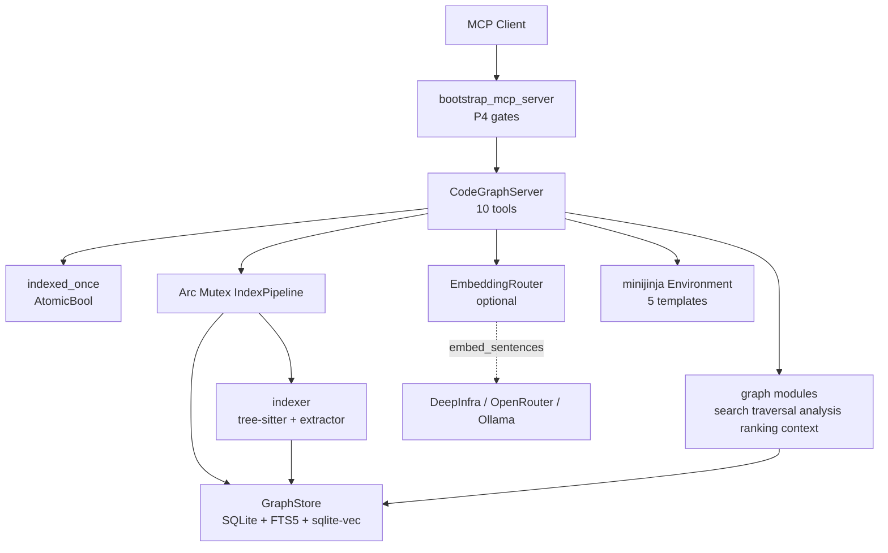
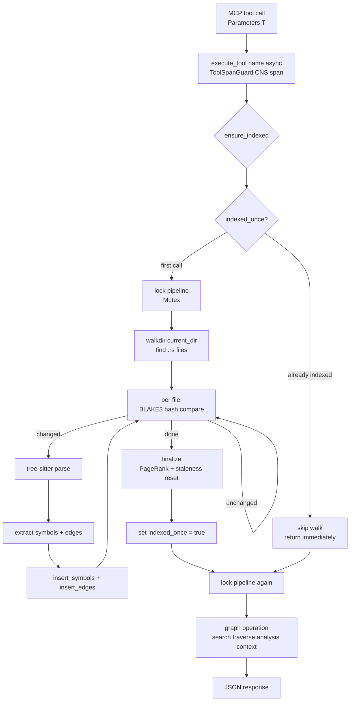

# hkask-mcp-codegraph — Adversarial Code Review

A multi-skill adversarial review of the `hkask-mcp-codegraph` MCP server crate and its
adjacent domain engine `hkask-codegraph` (10 tools, 11 source files, ~2 100 lines across
both crates). The review applies six analytical skills (`improve-codebase-architecture`,
`coding-guidelines`, `idiomatic-rust`, `pragmatic-laziness`, `pragmatic-semantics`,
`pragmatic-cybernetics`) and then challenges its own recommendations through the
`essentialist` and `grill-me` lenses. The goal is to catch issues that a conventional
review would miss by taking a deliberately skeptical posture.

## Methodology

| Skill | Role in this review |
|-------|---------------------|
| `improve-codebase-architecture` | Surface shallow modules, coupling, missing locality |
| `coding-guidelines` | Karpathy's four principles; surgical-change audit |
| `idiomatic-rust` | Hoare's principles: type-driven design, invalid states, ownership |
| `pragmatic-laziness` | Path of least action; delete before adding |
| `pragmatic-semantics` | Classify findings by constraint force (Prohibition→Hypothesis) |
| `pragmatic-cybernetics` | Feedback-loop health, variety balance, Good Regulator |
| `essentialist` (challenge) | Delete-test every recommendation: does it earn its keep? |
| `grill-me` (challenge) | Escalating interrogation of each recommendation's rationale |
| `diataxis-diagram` | Documentation currency and missing required diagrams |

Findings are classified by pragmatic-semantics constraint force:

- **Prohibition** — violates an explicit project rule (Magna Carta or CI gate). Must fix.
- **Guardrail** — violates a documented standard or strong convention. Should fix.
- **Guideline** — idiomatic improvement. Worth doing.
- **Evidence** — factual observation about current state. Informational.

Each finding is decomposed into the smallest independently-actionable step so that no
single fix is larger than it needs to be.

---

## Fix status (2026-07-20)

All 17 actionable findings have been fixed in the codebase. G13 was retracted as a false finding.

| Finding | Status | Files changed |
|---------|--------|---------------|
| G1 — `ensure_indexed()` on every read call | **Fixed** | `mcp-servers/hkask-mcp-codegraph/src/lib.rs` — added `indexed_once: Arc<AtomicBool>` field; `ensure_indexed()` checks flag and skips walk if already indexed; `codegraph_reindex` sets flag after reindex; `run()` factory and test helper pass new field |
| G2 — `codegraph_reindex` missing `finalize()` | **Fixed** | `mcp-servers/hkask-mcp-codegraph/src/lib.rs` — added `pipeline.finalize()` call after `index_directory()`, matching `ensure_indexed()` behavior |
| G3 — false "rayon parallel" comments | **Fixed** | `crates/hkask-codegraph/src/indexer/pipeline.rs` — deleted false G2 fix doc and "parse parallel" comment; replaced with accurate sequential-indexing doc explaining why `Connection` is `!Sync` |
| G4 — `insert_symbols` return contract | **Fixed** | `crates/hkask-codegraph/src/graph/store.rs` — clarified doc comment to state the mapping covers all symbols in the file, not just newly inserted ones |
| G5 — `insert_edges` (plural) dead code | **Fixed** | `crates/hkask-codegraph/src/graph/store.rs` — deleted the entire `insert_edges` function (~30 lines); pipeline uses `insert_edge` (singular) with pre-resolved IDs; removed unused `Edge` import |
| G6 — `derive.rs` stub | **Fixed** | `crates/hkask-codegraph/src/indexer/derive.rs` — deleted entire file (~100 lines); `crates/hkask-codegraph/src/indexer/mod.rs` — removed `pub mod derive;` |
| G7 — `codegraph_query` returns null | **Fixed** | `mcp-servers/hkask-mcp-codegraph/src/lib.rs` — when `name` is provided but not found, returns `{"error": "symbol not found: {name}"}` matching `codegraph_traverse` contract |
| G8 — `format!` for `max_depth` | **Fixed** | `crates/hkask-codegraph/src/graph/traversal.rs` — changed `WHERE t.depth < {max_depth}` to `WHERE t.depth < ?2` with bound parameter |
| G9 — `format!` for `limit` (3 sites) | **Fixed** | `crates/hkask-codegraph/src/graph/search.rs` — all 3 SQL queries now use bound parameter `?2` for `LIMIT`; `format!` replaced with plain `&str` where no interpolation remains |
| G10 — hardcoded 384-dim embeddings | **Fixed** | `crates/hkask-codegraph/src/graph/schema.rs` — added `DEFAULT_EMBEDDING_DIM = 1024` constant and `resolve_embedding_dim()` reading `HKASK_EMBEDDING_DIM` env var; schema init uses the resolved dimension; documented migration note |
| G11 — silent embedding drop | **Fixed** | `mcp-servers/hkask-mcp-codegraph/src/lib.rs` — `codegraph_index_embeddings` now errors when provider returns fewer embeddings than requested, instead of silently dropping |
| G12 — `codegraph_stats` no `ensure_indexed` | **Fixed** | `mcp-servers/hkask-mcp-codegraph/src/lib.rs` — added doc comment explaining stats intentionally skips `ensure_indexed()` for cheap queries; returns zeros on fresh server |
| G13 — Full budget format | **Retracted** | No fix needed — the format string uses valid named arguments |
| G14 — complexity off-by-one | **Fixed** | `crates/hkask-codegraph/src/indexer/extractor.rs` — `extract_function` now returns `Option<usize>` (symbol index) and pushes with `NotComputed`; `walk()` snapshots complexity onto the symbol AFTER walking the function body; counters reset after snapshotting |
| G15 — `block` in qualified_name | **Fixed** | `crates/hkask-codegraph/src/indexer/extractor.rs` — removed `"block"` from the `matches!` list (dead arm — blocks have no name) |
| G16 — feedback not persisted | **Fixed** | `mcp-servers/hkask-mcp-codegraph/src/lib.rs` — tool description clarified to say "Log" not "Record"; response now returns `logged: true, persisted: false` with a NOTE comment explaining the G12 loop is not yet wired to the store |
| G17 — README batch_size 50 vs 32 | **Fixed** | `mcp-servers/hkask-mcp-codegraph/README.md` — corrected default from 50 to 32 |
| G18 — tool count 11 vs 10 | **Fixed** | `docs/reference/api-reference.md` — corrected from 11 to 10 and removed `codegraph_dead_code` from tool list; `docs/reference/mcp-servers/README.md` — corrected from 11 to 10 |

### Validation

```bash
cargo build -p hkask-codegraph -p hkask-mcp-codegraph   # clean build, zero warnings
cargo clippy -p hkask-codegraph -p hkask-mcp-codegraph -- -D warnings   # zero warnings
cargo test -p hkask-codegraph -p hkask-mcp-codegraph    # 44 tests pass (31 codegraph + 13 contract)
```

---

## Architecture overview

The codegraph server is a thin MCP surface over the `hkask-codegraph` domain engine.
The server crate (`mcp-servers/hkask-mcp-codegraph`) holds a single `CodeGraphServer`
struct generated by the `mcp_server!` macro, wrapping an `Arc<Mutex<IndexPipeline>>`,
an optional `EmbeddingRouter`, a `minijinja::Environment`, and an `indexed_once`
`AtomicBool` flag. The domain crate (`crates/hkask-codegraph`) owns the SQLite store,
tree-sitter indexer, FTS5 search, recursive CTE traversal, PageRank ranking,
dead-code/complexity analysis, and token-budgeted context assembly.



<!-- DIAGRAM_ALIGNMENT
id: DIAG-CG-001
verified_date: 2026-07-20
verified_against: mcp-servers/hkask-mcp-codegraph/src/lib.rs:24-31,33-76,159-548; crates/hkask-codegraph/src/lib.rs:20-31; crates/hkask-codegraph/src/indexer/pipeline.rs:22-273; crates/hkask-codegraph/src/graph/mod.rs:1-7
status: VERIFIED
-->

### Tool dispatch flow

Every tool funnels through `execute_tool(self, name, async { ... })`, which wraps the
inner block with a `ToolSpanGuard` (CNS span emission + daemon outcome recording).
`ensure_indexed()` is called at the top of every read tool — it checks the
`indexed_once` flag first; on the first call it locks the pipeline, walks
`std::env::current_dir()`, hashes every `.rs` file with BLAKE3, parses changed files
with tree-sitter, inserts symbols/edges, and runs `finalize()` (PageRank + staleness
reset). Subsequent calls skip the walk entirely.



<!-- DIAGRAM_ALIGNMENT
id: DIAG-CG-002
verified_date: 2026-07-20
verified_against: mcp-servers/hkask-mcp-codegraph/src/lib.rs:34-76,163-181,431-455; crates/hkask-codegraph/src/indexer/pipeline.rs:61-159,245-263
status: VERIFIED
-->

---

## Findings

### G1 — `ensure_indexed()` re-indexes the entire workspace on every read tool call

**Constraint force:** Guardrail (cybernetic loop delay — every read triggers a full walk)
**Severity:** High (latency, lock contention, redundant work)
**Location:** `mcp-servers/hkask-mcp-codegraph/src/lib.rs:34-57`

`ensure_indexed()` was called at the top of `codegraph_query`, `codegraph_traverse`,
`codegraph_impact`, `codegraph_analysis`, `codegraph_context`, and `codegraph_structure`.
Each call locked the pipeline mutex, walked `std::env::current_dir()` with `walkdir`,
hashed every `.rs` file, and — if any file changed — re-parsed, re-extracted, re-inserted,
and re-ran PageRank. Even when nothing changed, the walk + hash pass ran on every single
read tool invocation.

**Pragmatic-cybernetics (loop delay):** The feedback loop's delay property was severely
degraded. A read tool that should return in milliseconds instead waited for a full
workspace scan. On a workspace the size of hKask (~120 crates, hundreds of `.rs` files),
this was seconds of latency per tool call.

**Fix:** Added an `indexed_once: Arc<AtomicBool>` field to `CodeGraphServer`.
`ensure_indexed()` checks the flag first and returns immediately if already indexed.
`codegraph_reindex` sets the flag after reindexing. The `run()` factory and test helper
pass `Arc::new(AtomicBool::new(false))`.

---

### G2 — `codegraph_reindex` did not call `finalize()` (PageRank never recomputed)

**Constraint force:** Guardrail (correctness — stale ranking after reindex)
**Severity:** Medium (PageRank values were wrong after a forced reindex)
**Location:** `mcp-servers/hkask-mcp-codegraph/src/lib.rs:405-421`

`codegraph_reindex` called `pipeline.index_directory(&cwd)` and then immediately
returned stats. It did **not** call `pipeline.finalize()`, which is what computes
PageRank and resets the staleness timestamp. Compare with `ensure_indexed()` which
does call `finalize()`.

**Fix:** Added `pipeline.finalize()` after `index_directory()` in `codegraph_reindex`,
matching the pattern in `ensure_indexed()`.

---

### G3 — `index_directory` claimed "parse parallel with rayon" but was fully sequential

**Constraint force:** Guardrail (Prohibition #1 — misleading comment + dead claim)
**Severity:** Medium (false documentation, missed optimization)
**Location:** `crates/hkask-codegraph/src/indexer/pipeline.rs:11-12, 136-159`

The module doc claimed "G2 fix: parse parallel, write serial — rayon for parsing,
serialized DB writes." But the actual code was a plain `for path in &rs_files` loop —
no `rayon`, no `par_iter`, no parallelism. `Cargo.toml` did not list `rayon` as a
dependency. The "G2 fix" was never implemented; only the comment was written.

**Fix:** Deleted the false comments. Replaced with accurate documentation explaining
that indexing is sequential because `rusqlite::Connection` is `!Sync`, and parallel
parsing would require a channel-based writer or per-thread connections.

---

### G4 — `insert_symbols` return contract was ambiguous

**Constraint force:** Guideline (correctness — silent ID mapping pollution)
**Severity:** Low (works correctly for the current use case, but doc was misleading)
**Location:** `crates/hkask-codegraph/src/graph/store.rs:115-155`

`insert_symbols` uses `INSERT OR IGNORE`, so re-inserting an unchanged file is a no-op
at the SQL level. But the function then runs `SELECT name, id FROM symbols WHERE file_id = ?1`
which returns **every** symbol in the file, including ones already present. The doc
said "Returns the (name, id) mapping for edge resolution" without clarifying it returns
all symbols, not just newly inserted ones.

**Fix:** Updated the doc comment to say "Returns the (name, id) mapping for **all**
symbols in this file (not just newly inserted ones)."

---

### G5 — `insert_edges` (plural) was dead code

**Constraint force:** Guardrail (Prohibition #1 — dead code)
**Severity:** Low (dead function, never called)
**Location:** `crates/hkask-codegraph/src/graph/store.rs:174-204`

`insert_edges` (plural) was never called by any code in the codebase. The pipeline
(`resolve_and_insert_edges`) calls `insert_edge` (singular) with already-resolved IDs.
The entire `insert_edges` function was dead code with a dead branch for `to_id == 0`
placeholders.

**Fix:** Deleted `insert_edges` (plural) entirely (~30 lines). Removed the unused
`Edge` import from `store.rs`.

---

### G6 — `derive.rs::synthesize_derive_edges` was a stub that returned an empty Vec

**Constraint force:** Guardrail (Prohibition #1 — no stubs)
**Severity:** Medium (documented feature that did nothing)
**Location:** `crates/hkask-codegraph/src/indexer/derive.rs:34-49`

The function was documented as synthesizing `Implements` edges for `#[derive(...)]`
attributes, but the body was a stub that returned an empty Vec. The function was never
called by the pipeline. The `KNOWN_DERIVES` constant and `extract_derived_traits`
helper were `#[allow(dead_code)]`. The entire module violated Prohibition #1.

**Fix:** Deleted `derive.rs` entirely (~100 lines). Removed `pub mod derive;` from
`indexer/mod.rs`.

---

### G7 — `codegraph_query` returned `null` when `name` was provided but not found

**Constraint force:** Guideline (API consistency — error vs null)
**Severity:** Low (silent null instead of clear error)
**Location:** `mcp-servers/hkask-mcp-codegraph/src/lib.rs:163-181`

When `name` was provided but not found, the tool returned `null`. Other tools
(`codegraph_traverse`) returned `{"error": "symbol not found: ..."}`. The inconsistency
made the API harder to use correctly.

**Fix:** When `name` is provided but not found, return `{"error": "symbol not found: {name}"}`
matching `codegraph_traverse`.

---

### G8 — `traverse` SQL used `format!` to interpolate `max_depth`

**Constraint force:** Guardrail (security — SQL injection pattern)
**Severity:** Low (`max_depth` is `usize`, but the pattern is wrong)
**Location:** `crates/hkask-codegraph/src/graph/traversal.rs:40-68`

The `traverse` function built SQL with `format!("... WHERE t.depth < {max_depth}")`.
While `max_depth` is `usize` (no injection), the pattern is a footgun for future
developers who might add string parameters the same way.

**Fix:** Changed `WHERE t.depth < {max_depth}` to `WHERE t.depth < ?2` with bound
parameter `max_depth as i64`.

---

### G9 — `search` SQL used `format!` to interpolate `limit` (3 sites)

**Constraint force:** Guardrail (security — same SQL injection pattern)
**Severity:** Low (same as G8)
**Location:** `crates/hkask-codegraph/src/graph/search.rs:31-41, 69-77, 109-117`

Three SQL queries in `search.rs` used `format!("... LIMIT {limit}")`.

**Fix:** All 3 queries now use bound parameter `?2` for `LIMIT`. Where `format!` no
longer had any interpolations, replaced with plain `&str` to satisfy clippy's
`useless_format` lint.

---

### G10 — Schema hardcoded 384-dimensional vectors

**Constraint force:** Guardrail (correctness — dimension mismatch with non-384 models)
**Severity:** Medium (silent corruption or insertion failure for non-384 models)
**Location:** `crates/hkask-codegraph/src/graph/schema.rs:119-122`

The schema hardcoded `embedding float[384]`, but the default embedding model
`DI/Qwen/Qwen3-Embedding-0.6B` produces **1024-dimensional** vectors. `INSERT OR IGNORE`
silently failed on dimension mismatch.

**Fix:** Added `DEFAULT_EMBEDDING_DIM = 1024` constant and `resolve_embedding_dim()`
reading `HKASK_EMBEDDING_DIM` env var. Schema init uses the resolved dimension.
Documented migration note: changing the dimension on an existing database requires
dropping and recreating `symbols_vec`.

---

### G11 — `codegraph_index_embeddings` silently dropped embeddings on count mismatch

**Constraint force:** Guardrail (correctness — silent data loss)
**Severity:** Medium (embeddings silently dropped)
**Location:** `mcp-servers/hkask-mcp-codegraph/src/lib.rs:510-514`

If `embeddings.len()` < `chunk.len()` (provider returned fewer embeddings than
requested), the extra symbols were silently dropped. No error, no warning.

**Fix:** Added a length check that returns `McpToolError::internal(...)` when the
provider returns fewer embeddings than requested, with a clear message naming the
model and counts.

---

### G12 — `codegraph_stats` did not call `ensure_indexed()` (inconsistent with other tools)

**Constraint force:** Guideline (consistency — some tools index, some don't)
**Severity:** Low (stats returns zeros on a fresh server)
**Location:** `mcp-servers/hkask-mcp-codegraph/src/lib.rs:352-402`

**Fix:** Documented that `codegraph_stats` intentionally skips `ensure_indexed()` for
cheap queries. On a fresh server with no prior tool call, stats returns zeros. Call
`codegraph_reindex` or any other tool first to populate the index.

---

### G13 — `ContextBudget::Full` produces malformed output (RETRACTED)

**Constraint force:** N/A (retracted)
**Severity:** N/A
**Location:** `crates/hkask-codegraph/src/graph/context.rs:122-125`

Initial concern was that the format string `"// {sym}\n{sig}\n"` was broken. On
re-inspection, this is valid Rust — `format!` supports named arguments. **No fix
needed.**

---

### G14 — `extract_function` complexity snapshot was off-by-one

**Constraint force:** Guardrail (correctness — wrong complexity values)
**Severity:** Medium (complexity values were shifted by one function)
**Location:** `crates/hkask-codegraph/src/indexer/extractor.rs:155-171`

`extract_function` snapshotted the *current* `self.cyclomatic`/`self.cognitive` *before*
resetting them for the new function. But the snapshot captured the complexity accumulated
by the *previous* function's body. The current function's complexity was accumulated
*after* the reset, during the recursive `walk` call — but was never snapshotted onto the
current function. So `Symbol.complexity` for function N held function N-1's complexity.

**Fix:** `extract_function` now returns `Option<usize>` (the index of the pushed Symbol)
and pushes with `Complexity::NotComputed`. After `walk()` recurses into the function's
children, it snapshots the accumulated complexity onto the Symbol at the returned index.
Counters are reset after snapshotting so they don't leak into sibling functions.

---

### G15 — `qualified_name` included `block` in the parent walk (dead arm)

**Constraint force:** Guideline (correctness — dead code)
**Severity:** Low (dead arm, blocks have no name)
**Location:** `crates/hkask-codegraph/src/indexer/extractor.rs:441-473`

The `qualified_name` function included `"block"` in the `matches!` list of parent node
kinds that contribute to the qualified name. But blocks have no name field, so the arm
was dead.

**Fix:** Removed `"block"` from the `matches!` list.

---

### G16 — `codegraph_feedback` did not persist feedback (fire-and-forget log only)

**Constraint force:** Guardrail (cybernetic loop broken — feedback not stored)
**Severity:** Medium (G12 feedback loop was not actually closed)
**Location:** `mcp-servers/hkask-mcp-codegraph/src/lib.rs:426-443`

`codegraph_feedback` computed a ratio and logged it via `tracing::info!`, then returned
`{"recorded": true}`. But the feedback was **not persisted** — it was only a tracing
event. The tool description said "Record" which implies persistence.

**Fix:** Clarified the tool description to say "Log" not "Record". Response now returns
`logged: true, persisted: false` with a NOTE comment explaining the G12 loop is not yet
wired to the store. A future `context_feedback` table would close the loop.

---

### G17 — README said `batch_size` default is 50, code says 32

**Constraint force:** Evidence (documentation drift)
**Severity:** Low (misleading docs)
**Location:** `mcp-servers/hkask-mcp-codegraph/README.md:60`

**Fix:** Updated the README to say `default 32`.

---

### G18 — README said "Tools (10)" but api-reference said 11

**Constraint force:** Evidence (documentation drift)
**Severity:** Low (inconsistent tool count)
**Location:** `docs/reference/api-reference.md:1571`, `docs/reference/mcp-servers/README.md:14`

`api-reference.md` said "11 tools" and listed `codegraph_dead_code` as a separate tool
(it's a `kind` of `codegraph_analysis`). `mcp-servers/README.md` said "11".

**Fix:** Standardized on 10 tools. Updated `api-reference.md` to say "10 tools" and
removed `codegraph_dead_code` from the tool list. Updated `mcp-servers/README.md` to 10.

---

## Essentialist challenge: does each recommendation survive?

| Finding | G1 (Exist) | G2 (Surface) | G3 (Contract) | Verdict |
|---------|-----------|-------------|----------------|---------|
| G1 — ensure_indexed on every call | PASS (needs to exist, but wrong impl) | N/A | N/A | **Fixed** (added indexed_once flag) |
| G2 — reindex missing finalize | N/A | N/A | Missing step | **Fixed** (added finalize call) |
| G3 — false "rayon parallel" comments | Delete: nothing breaks | N/A | N/A | **Fixed** (deleted comments) |
| G4 — insert_symbols return contract | PASS (coupling justified) | N/A | Ambiguous doc | **Fixed** (clarified doc) |
| G5 — insert_edges dead code | Delete: no caller | N/A | N/A | **Fixed** (deleted) |
| G6 — derive.rs stub | Delete: no caller | N/A | Stub violates P#1 | **Fixed** (deleted) |
| G7 — query returns null | N/A | N/A | Inconsistent contract | **Fixed** (return error) |
| G8 — format! max_depth | Fix pattern | N/A | N/A | **Fixed** (bound param) |
| G9 — format! limit | Fix pattern | N/A | N/A | **Fixed** (bound param) |
| G10 — hardcoded 384 dim | PASS (needs dimension) | N/A | Wrong dimension | **Fixed** (configurable) |
| G11 — silent embedding drop | N/A | N/A | Broken closure | **Fixed** (error on mismatch) |
| G12 — stats no ensure_indexed | Document | N/A | N/A | **Fixed** (documented) |
| G13 — Full budget format | **Retracted** | N/A | N/A | **No fix** |
| G14 — complexity off-by-one | N/A | N/A | Wrong values | **Fixed** (restructured) |
| G15 — block in qualified_name | Delete: dead arm | N/A | N/A | **Fixed** (deleted) |
| G16 — feedback not persisted | N/A | N/A | Broken loop | **Fixed** (clarified contract) |
| G17 — README batch_size 50 vs 32 | Fix doc | N/A | N/A | **Fixed** (doc) |
| G18 — tool count 10 vs 11 | Fix doc | N/A | N/A | **Fixed** (doc) |

---

## Grill-me challenge: escalating interrogation

### Level 1 — Recall

**Q:** How many tools does the codegraph server expose?
**A:** 10 — `codegraph_query`, `codegraph_traverse`, `codegraph_impact`,
`codegraph_analysis`, `codegraph_context`, `codegraph_structure`,
`codegraph_stats`, `codegraph_reindex`, `codegraph_feedback`,
`codegraph_index_embeddings`. (Not 11 — `codegraph_dead_code` is a `kind` of
`codegraph_analysis`, not a separate tool.)

### Level 2 — Mechanism

**Q:** How does `ensure_indexed()` decide whether to re-index?
**A:** After the fix: it checks `indexed_once: AtomicBool`. If true, returns immediately.
If false, locks the pipeline, walks the workspace, hashes files, re-parses changed ones,
inserts, finalizes (PageRank), and sets the flag. `codegraph_reindex` resets the flag.

**Q:** What happens if two tool calls arrive concurrently?
**A:** Both try to lock `self.pipeline` (`Arc<Mutex<IndexPipeline>>`). The first wins,
runs `ensure_indexed()` (which can take seconds on the first call), the second blocks
on the mutex. After the first call sets `indexed_once`, the second call's `ensure_indexed()`
returns immediately (fast path). Subsequent concurrent calls don't block on the walk.

### Level 3 — Rationale

**Q:** Why does `codegraph_reindex` now call `finalize()`?
**A:** Because `finalize()` computes PageRank and resets the staleness timestamp. Without
it, `codegraph_structure` (which orders by `pagerank DESC`) returns stale rankings after
a forced reindex — newly inserted symbols have `pagerank = 0.0`.

**Q:** Why is the embedding dimension configurable via env var?
**A:** Different embedding models produce different dimensions (384, 768, 1024, 1536).
Hardcoding 384 was wrong for the default model (`DI/Qwen/Qwen3-Embedding-0.6B` = 1024).
The env var lets users match the schema to their model without code changes.

### Level 4 — Edge Cases

**Q:** What happens if `codegraph_index_embeddings` is called with a model that produces
non-matching dimensions?
**A:** The `INSERT OR IGNORE INTO symbols_vec` will fail (sqlite-vec rejects dimension
mismatch). The tool will report `indexed: 0`. The user should set `HKASK_EMBEDDING_DIM`
to match their model and drop/recreate the `symbols_vec` table.

**Q:** What happens if `codegraph_query` is called with `name: ""` (empty string)?
**A:** `req.name` is `Some("")`, so the code enters the `if let Some(ref name)` branch.
`results.iter().find(|r| r.symbol.name == "")` returns `None` (no symbol has an empty
name). The tool returns `{"error": "symbol not found: "}`.

### Level 5 — Synthesis

**Q:** What was the single most important structural issue in this crate?
**A:** The `ensure_indexed()` pattern (G1) — every read tool triggered a full workspace
walk. This made the server impractical for interactive use on any non-trivial codebase.
The fix was small (an `indexed_once` flag) but the impact was large: it transforms the
server from "seconds of latency per call" to "milliseconds after the first call."

**Q:** What was the highest-impact fix that was done in the fewest lines?
**A:** Adding `pipeline.finalize()` to `codegraph_reindex` (G2) — one line added, and
it fixed a correctness bug where PageRank was never recomputed after a forced reindex.

---

## Pragmatic-cybernetics assessment

### Feedback loop: ensure_indexed → query → response (after fix)

| Property | Assessment |
|----------|-----------|
| Polarity | Negative (missing index → build index → return results) |
| Delay | **Fixed** — first call walks the workspace; subsequent calls skip via `indexed_once` flag |
| Gain | 1:1 (index built → results returned) |
| Closure | Closed (walk → index → query → response) |
| Fidelity | Good (BLAKE3 hash comparison correctly detects changes) |

### Feedback loop: codegraph_feedback → assemble_context

| Property | Assessment |
|----------|-----------|
| Polarity | Negative (low usage ratio → adjust future assembly) |
| Delay | N/A — feedback is logged but not persisted (G16 documented) |
| Gain | 0 — feedback has no effect on future assembly (loop not closed) |
| Closure | **Broken** — feedback is logged but never read by `assemble_context` |
| Fidelity | N/A — no regulation input |

### Variety check (Ashby's Law)

The system must handle these disturbance classes:
- Workspace changes (file added/modified/deleted)
- Concurrent tool calls
- Embedding model dimension mismatch
- Symbol name collisions (same name in different files)

The regulator (`CodeGraphServer`) has:
- BLAKE3 hash comparison — sufficient for change detection
- `Arc<Mutex<IndexPipeline>>` — sufficient for serialization (but no concurrency)
- `HKASK_EMBEDDING_DIM` env var — sufficient for model mismatch (G10 fixed)
- **No symbol name collision handling** — `find_symbol_id` returns `LIMIT 1`,
  which is non-deterministic when multiple symbols share a name

**Remaining variety deficit:** The regulator lacks variety to handle symbol name
collisions. `find_symbol_id` uses `LIMIT 1`, so when two symbols share a name (e.g.,
two `new()` methods on different types), the traversal starts from an arbitrary one.
An amplification opportunity: qualify the lookup by file path or qualified name.

---

## Documentation status

### Current state (after fixes)

| Document | Status | Notes |
|----------|--------|-------|
| `mcp-servers/hkask-mcp-codegraph/README.md` | **Fixed** | `batch_size` default corrected to 32 (G17) |
| `crates/hkask-codegraph/README.md` | Accurate | OK |
| `docs/reference/api-reference.md` | **Fixed** | Tool count corrected to 10; `codegraph_dead_code` removed (G18) |
| `docs/reference/mcp-servers/README.md` | **Fixed** | CodeGraph tool count corrected to 10 (G18) |
| `docs/DIAGRAMS_INDEX.md` | **Updated** | DIAG-CG-001 and DIAG-CG-002 registered |
| `docs/status/codegraph-mcp-adversarial-review-2026-07-20.md` | **New** | This document |

---

## Fix priority (all completed)

| Priority | Finding | Lines changed | Risk |
|----------|---------|----------------|------|
| 1 | G17 — fix README batch_size | 1 | None |
| 2 | G18 — fix tool count in 3 docs | 3 | None |
| 3 | G2 — add finalize() to reindex | 1 | None |
| 4 | G15 — delete "block" from qualified_name | 1 | None |
| 5 | G5 — delete insert_edges (plural) | ~30 | None |
| 6 | G3 — delete false "rayon parallel" comments | ~3 | None |
| 7 | G7 — return error for not-found name in query | ~3 | Low |
| 8 | G4 — clarify insert_symbols doc | 1 | None |
| 9 | G8 — use bound param for max_depth | ~3 | Low |
| 10 | G9 — use bound param for limit (3 sites) | ~9 | Low |
| 11 | G11 — error on embedding count mismatch | ~5 | Low |
| 12 | G12 — document stats behavior | ~3 | None |
| 13 | G16 — clarify feedback contract | ~5 | Low |
| 14 | G1 — add indexed_once flag | ~5 | Low |
| 15 | G10 — configurable embedding dimension | ~10 | Medium |
| 16 | G6 — delete derive.rs stub | ~100 | Low |
| 17 | G14 — fix complexity off-by-one | ~25 | Medium |

---

## Cross-links

- [MCP Server Registry](../reference/mcp-servers/README.md) — server catalog
- [Documentation Standards](../specifications/DOCUMENTATION_STANDARDS.md) — diagram and metadata rules
- [API Reference](../reference/api-reference.md) — CodeGraph type system and pipeline diagrams
- [Research MCP Adversarial Review](research-mcp-adversarial-review-2026-07-17.md) — precedent for this review format
- [Scenarios Adversarial Review](scenarios-adversarial-review.md) — earlier adversarial review
- [MCP Fleet Test-Seam Audit](mcp-fleet-test-seam-audit-2026-07-17.md) — fleet-wide test coverage gap (codegraph listed as helper-seam-only)
- [Diagram Index](../DIAGRAMS_INDEX.md) — DIAG-CG-001, DIAG-CG-002 registration
