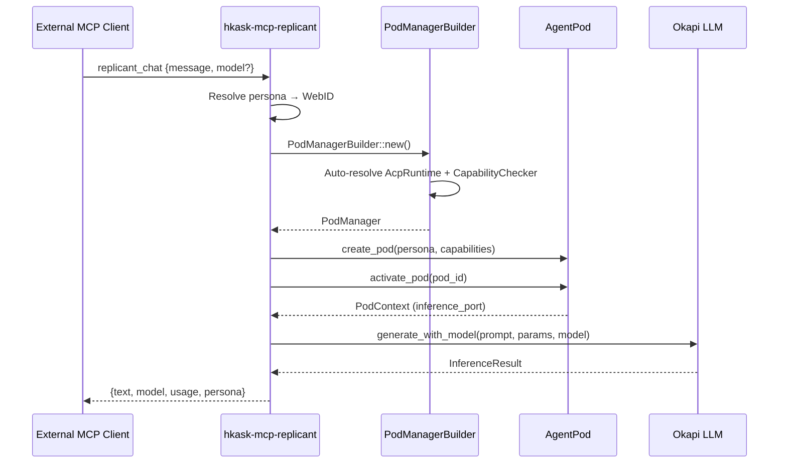

# MCP Server Completeness Audit

**Date:** 2026-05-29
**Version:** hKask v0.23.0
**Total servers:** 21
**Total tools:** 123+

---

## Summary Table

| Server | LOC | Tools | Status | Notes |
|--------|-----|-------|--------|-------|
| `hkask-mcp-inference` | 391 | 3 | **Full** | generate, metrics, models — real Okapi calls, failover, rate limiting |
| `hkask-mcp-rss-reader` | 1,443 | 12 | **Full** | Complete RSS feed management with SQLite persistence |
| `hkask-mcp-spec` | 853 | 8 | **Full** | 8 DDMVSS spec tools (capture, decompose, curate, validate) |
| `hkask-mcp-goal` | ~235 | 3 | **Full** | Goal coordination substrate (OCAP-gated, CNS-observed); CLI/API/MCP parity |
| `hkask-mcp-condenser` | 761 | 5 | **Full** | Context condensation (reranking and compression of the active conversation window) |
| `hkask-mcp-web` | 3,389 | 5 | **Full** | Search, scrape, extract with SSRF protection |
| `hkask-mcp-keystore` | 529 | 6 | **Full** | OS keychain with AES-256-GCM vault persistence |
| `hkask-mcp-github` | 459 | 8 | **Full** | GitHub API integration |
| `hkask-mcp-fal` | 434 | 10 | **Full** | FAL image generation service |
| `hkask-mcp-git` | 412 | 6 | **Full** | Git CAS (content-addressed storage) operations |
| `hkask-mcp-fmp` | 369 | 11 | **Full** | Financial Modeling Prep API integration |
| `hkask-mcp-ocap` | 319 | 5 | **Full** | Capability grant, verify, revoke, list operations |
| `hkask-mcp-registry` | 310 | 6 | **Full** | Template registry CRUD and search operations |
| `hkask-mcp-cns` | 280 | 6 | **Full** | CNS health, variety, alerts, metrics operations |
| `hkask-mcp-telnyx` | 244 | 8 | **Full** | Telnyx SMS/voice API integration |
| `hkask-mcp-ensemble` | 295 | 5 | **Full** | Multi-agent chat coordination |
| `hkask-mcp-episodic` | 190 | 4 | **Full** | Episodic memory (private, perspective-bound) |
| `hkask-mcp-semantic` | 290 | 6 | **Full** | Semantic memory (public, shared) |
| `hkask-mcp-replicant` | ~310 | 3 | **Full** | Replicant chat — MCP bridge for external integrations (Zed, etc.) |
| `hkask-mcp-doc-knowledge` | 747 | 4 | **Full** | Document parsing and chunking (HTML/text extraction, multi-tier chunking) |
| `hkask-mcp-markitdown` | 724 | 3 | **Full** | Document format conversion and OCR (PDF/MD/HTML/TXT + vision OCR fallback) |

---

## Status Distribution

| Status | Count | Servers |
|--------|-------|---------|
| **Full** | 21 | All servers |
| **Partial** | 0 | — |
| **Shell** | 0 | — |

---

## Per-Server Detail

### `hkask-mcp-inference` (391 LOC, 3 tools)
- **Status:** Full
- **Tools:** `inference:generate`, `inference:metrics`, `inference:models`
- **Notes:** Real Okapi LLM calls with failover, per-caller rate limiting (token bucket), metrics tracking with atomic counters. Primary model + automatic fallback chain.

### `hkask-mcp-rss-reader` (1,443 LOC, 12 tools)
- **Status:** Full
- **Tools:** 12 feed management tools with SQLite-backed persistence
- **Notes:** Most feature-rich server. Includes feed subscription management, article retrieval, import/export, database-backed state.

### `hkask-mcp-spec` (853 LOC, 8 tools)
- **Status:** Full
- **Tools:** spec/goal/capture, spec/goal/decompose, spec/require/bind, spec/curate/evaluate, spec/curate/reconcile, spec/curate/cultivate, spec/graph/query, spec/graph/validate
- **Notes:** DDMVSS specification tools. 2 goal operations + 1 require-bind + 3 curation operations + 2 graph operations.

### `hkask-mcp-goal` (~235 LOC, 3 tools)
- **Status:** Full
- **Tools:** goal_create, goal_list, goal_set_state
- **Notes:** Goal coordination substrate. OCAP-gated with CNS-observed NuEvent emissions. Mirrors the CLI (`kask goal`) and HTTP API (`/api/goals`) surfaces, satisfying MCP ≡ CLI ≡ API (REQ-IFC-001).

### `hkask-mcp-condenser` (761 LOC, 5 tools)
- **Status:** Full
- **Tools:** Context condensation (reranking, compression, deduplication of the active conversation window)
- **Notes:** Multiple condensation strategies (rank, compress, deduplicate). Configurable via parameters. Context is ephemeral; memory is consolidated separately via the consolidation bridge.

### `hkask-mcp-web` (3,389 LOC, 5 tools)
- **Status:** Full
- **Tools:** Web search, scrape, extract operations
- **Notes:** SSRF protection (private IP/loopback rejection), URL validation, strip-html utilities. Multiple search providers.

### `hkask-mcp-keystore` (529 LOC, 6 tools)
- **Status:** Full
- **Tools:** store, retrieve, list, delete, import, export
- **Notes:** AES-256-GCM encryption per entry, atomic file writes (temp + rename), `~/.hkask/keystore/vault.json` persistence with schema versioning.

### `hkask-mcp-github` (459 LOC, 8 tools)
- **Status:** Full
- **Tools:** Repository, issue, PR, and code search operations
- **Notes:** GitHub API integration with OAuth token management.

### `hkask-mcp-fal` (434 LOC, 10 tools)
- **Status:** Full
- **Tools:** Image generation with FAL API, model selection, parameter control
- **Notes:** Ten distinct generation pipelines. Model-specific parameter schemas.

### `hkask-mcp-git` (412 LOC, 6 tools)
- **Status:** Full
- **Tools:** clone, fetch, commit, push, log, status operations
- **Notes:** Git CAS integration via `gix` crate. Content-addressed storage for templates and specs.

### `hkask-mcp-fmp` (369 LOC, 11 tools)
- **Status:** Full
- **Tools:** Financial data queries — company profiles, quotes, ratios, statements
- **Notes:** Financial Modeling Prep API wrapper. Eleven distinct query endpoints.

### `hkask-mcp-ocap` (319 LOC, 5 tools)
- **Status:** Full
- **Tools:** grant, verify, revoke, list, inspect capability tokens
- **Notes:** OCAP capability management. Grant with caveats, verify chains, persistent revocation.

### `hkask-mcp-registry` (310 LOC, 6 tools)
- **Status:** Full
- **Tools:** list, get, register, search, validate, delete template operations
- **Notes:** Template registry CRUD with contract validation and lexicon-term search.

### `hkask-mcp-cns` (280 LOC, 6 tools)
- **Status:** Full
- **Tools:** health, variety, alerts, metrics, reset, clear operations
- **Notes:** CNS monitoring surface. Exposes variety counters, algedonic alerts, runtime health.

### `hkask-mcp-telnyx` (244 LOC, 8 tools)
- **Status:** Full
- **Tools:** SMS send, voice call, message status, number lookup operations
- **Notes:** Telnyx API integration for SMS and voice capabilities. Compact but feature-complete.

### `hkask-mcp-ensemble` (295 LOC, 5 tools)
- **Status:** Full
- **Tools:** `coordinate_session`, `register_participant`, `send_message`, `get_status`, `improv_turn`
- **Notes:** MCP surface for `hkask-ensemble` crate. Manages standing sessions, participant registration, message passing, and improvisation turns with confidence routing.

### `hkask-mcp-episodic` (190 LOC, 4 tools)
- **Status:** Full
- **Tools:** `episodic_ping`, `episodic_store`, `episodic_recall`, `episodic_budget`
- **Notes:** Episodic memory MCP server. Sovereignty boundary: episodic memories are private by design, scoped to caller's WebID.

### `hkask-mcp-semantic` (290 LOC, 6 tools)
- **Status:** Full
- **Tools:** `semantic_ping`, `semantic_store`, `semantic_recall`, `semantic_embed`, `semantic_search`, `semantic_count`
- **Notes:** Semantic memory MCP server. Public/shared visibility boundary. Embedding storage and KNN similarity search.

### `hkask-mcp-replicant` (~310 LOC, 3 tools)
- **Status:** Full
- **Tools:** `replicant_chat`, `replicant_status`, `replicant_history`
- **Notes:** Replicant chat MCP server — bridges external MCP clients (e.g., Zed Agent Panel) with hKask's pod-mediated inference flow. Resolves a replicant persona name → WebID, creates a pod via `PodManagerBuilder` (same flow as `kask chat`), and sends messages through pod-mediated inference via `InferencePort`. Follow-up features implemented: (1) ACP runtime initialized with the same secret derivation chain as the CLI (master key → env → keychain → insecure dev), ensuring compatible capability tokens across all surfaces; (2) Full agent definition loading from the YAML registry for rich system prompts (charter, responsibilities, rights, voice/tone); (3) In-memory session persistence for conversation continuity across MCP tool invocations (bounded to 20 turns). See §6.3 below for architecture details.

---

## Architecture Spotlight: `hkask-mcp-replicant`

### Purpose

`hkask-mcp-replicant` is the **external integration bridge** for hKask. It enables external MCP clients (Zed, VS Code, custom toolchains) to chat with a hKask replicant without running `kask chat` directly. This server is the mechanism by which a replicant like "Jacques" becomes accessible from Zed's Agent Panel.

### How It Differs from Other MCP Servers

| Dimension | Standard MCP Servers | `hkask-mcp-replicant` |
|-----------|----------------------|----------------------|
| **Purpose** | Expose infrastructure capabilities (search, storage, inference) | Expose a replicant persona for conversation |
| **Input** | Structured tool parameters | Natural language message |
| **Output** | Structured JSON result | LLM-generated response text |
| **State** | Stateless (per-call) | Pod-mediated (creates + activates pod per chat) |
| **Inference** | Not involved | Core function — routes through `InferencePort` |
| **Client** | Internal agents (via `McpRuntime` dispatch) | External MCP clients (Zed, VS Code, etc.) |

### Architecture



The server follows the same pod-mediated inference flow as `kask chat` (`crates/hkask-cli/src/commands/chat.rs`), with three follow-up enhancements over the initial implementation:

1. **Resolve persona** — `HKASK_AGENT_PERSONA` env var → `WebID::from_persona()`
2. **Load agent definition** — Try registry database → YAML files → minimal fallback (Follow-up #2: system prompt richness)
3. **Build pod** — `PodManagerBuilder` with ACP runtime and capability checker resolved from the same secret derivation chain as the CLI (Follow-up #1: ACP integration)
4. **Create + activate pod** — Persona YAML with `tool:inference:call` capability
5. **Compose system prompt** — Full agent definition (charter, responsibilities, rights, voice/tone) when available, minimal fallback otherwise (Follow-up #2)
6. **Append conversation history** — Recent turns from in-memory session state for context continuity (Follow-up #3: session persistence)
7. **Inference** — `PodContext::inference_port()` → `generate_with_model()` with model override
8. **Record turn** — Append user message and response to session history, bounded to 20 turns
9. **Return response** — JSON with `text`, `model`, `usage`, `persona`, `finish_reason`

### Configuration

| Environment Variable | Default | Purpose |
|---------------------|---------|---------|
| `HKASK_AGENT_PERSONA` | `Curator` | Replicant persona name (resolves to deterministic WebID) |
| `HKASK_DEFAULT_MODEL` | `deepseek-v4-pro` | Default LLM model for inference |
| `OKAPI_BASE_URL` | `http://127.0.0.1:11435` | Okapi API endpoint |
| `HKASK_ACP_SECRET` | *(derived)* | ACP secret (or `HKASK_MASTER_KEY` for derivation) |
| `HKASK_REGISTRY_PATH` | `registry/bots` | Path to agent YAML registry |
| `HKASK_DB_PATH` | `hkask.db` | Agent registry database path |
| `HKASK_DB_PASSPHRASE` | *(keychain)* | Database passphrase |
| `HKASK_MASTER_KEY` | *(required)* | Master key for HKDF derivation (secrets fail closed without it) |

### Zed Integration

To register a replicant (e.g., "Jacques") in Zed's `settings.json`:

```json
{
  "context_servers": {
    "hkask-jacques": {
      "command": "/path/to/hkask-mcp-replicant",
      "args": [],
      "env": {
        "HKASK_AGENT_PERSONA": "Jacques",
        "HKASK_DEFAULT_MODEL": "deepseek-v4-pro",
        "OKAPI_BASE_URL": "http://127.0.0.1:11435"
      }
    }
  }
}
```

### CNS Gas Budget

Registered in `table_gas_estimator.rs` with gas cost **5** (internal LLM-mediated tool, same tier as episodic/semantic memory servers). Inference gas is further governed by the `InferenceGasEstimator` via the `GovernedTool` membrane.

---

## Recommendations

1. **No shell servers.** All 21 MCP servers register real tools with implementations. Zero stubs remain (P6 compliance).

2. **Per-crate README:** Create individual `README.md` files in each `mcp-servers/hkask-mcp-*/README.md` documenting the tool surface, configuration, and any external service dependencies.

3. **Tool count outliers:** `hkask-mcp-telnyx` (244 LOC, 8 tools — high tool density) vs `hkask-mcp-rss-reader` (1,443 LOC, 12 tools — high LOC per tool). Consider whether `telnyx` tools are thin wrappers around API endpoints.

4. **Dependency hygiene:** Several servers (github, fmp, telnyx, fal) depend on external API services. Document API key requirements and rate limits in per-crate READMEs.

5. **OQ-3 resolved:** This audit satisfies option 2 of OQ-3 — catalog approach with common pattern description and per-crate README for implemented servers.

---

*ℏKask MCP Arsenal — 21 servers, ~123 tools, 0 stubs — v0.23.0*
