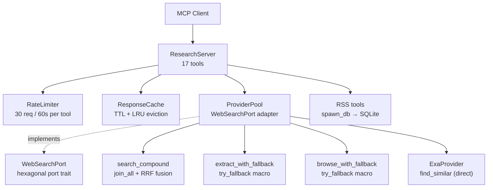
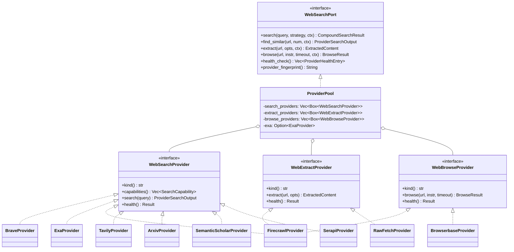
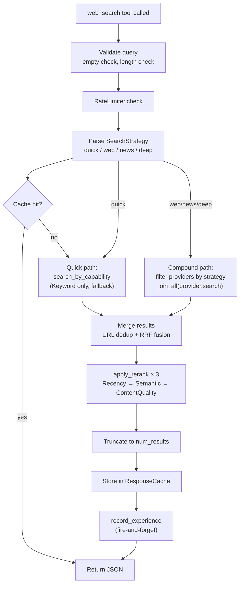

# hkask-mcp-research — Adversarial Code Review

A multi-skill adversarial review of the `hkask-mcp-research` MCP server crate
(17 tools, 15 source files, ~2 100 lines). The review applies six analytical
skills (`improve-codebase-architecture`, `coding-guidelines`, `idiomatic-rust`,
`pragmatic-laziness`, `pragmatic-semantics`, `pragmatic-cybernetics`) and then
challenges its own recommendations through the `essentialist` and `grill-me`
lenses. The goal is to catch issues that a conventional review would miss by
taking a deliberately skeptical posture.

## Methodology

| Skill | Role in this review |
|-------|---------------------|
| `improve-codebase-architecture` | Surface shallow modules, coupling, missing locality |
| `coding-guidelines` | Karpathy's four principles; surgical-change audit |
| `idiomatic-rust` | Hoare's principles: type-driven design, invalid states, ownership |
| `pragmatic-laziness` | Path of least action; delete before adding |
| `pragmatic-semantics` | Classify findings by constraint force (Prohibition→Hypothesis) |
| `pragmatic-cybernetics` | Feedback-loop health, variety balance, Good Regulator |
| `essentialist` (challenge) | Delete-test every recommendation: does it earn its keep? |
| `grill-me` (challenge) | Escalating interrogation of each recommendation's rationale |
| `diataxis-diagram` | Documentation currency and missing required diagrams |

Findings are classified by pragmatic-semantics constraint force:

- **Prohibition** — violates an explicit project rule (Magna Carta or CI gate). Must fix.
- **Guardrail** — violates a documented standard or strong convention. Should fix.
- **Guideline** — idiomatic improvement. Worth doing.
- **Evidence** — factual observation about current state. Informational.

Each finding is decomposed into the smallest independently-actionable step so
that no single fix is larger than it needs to be.

---

## Fix status (2026-07-17)

All 15 findings have been fixed in the codebase.

| Finding | Status | Files changed |
|---------|--------|---------------|
| G1 — Duplicate `#[async_trait]` | **Fixed** | 7 provider files — 1 line deleted per file (duplicate attribute removed) |
| G2 — `ProviderFilter::matches()` dead code | **Fixed** | `src/types/mod.rs` — method deleted (~9 lines removed) |
| G3 — `COMPOUND_PROVIDER_TIMEOUT_SECS` unused | **Fixed** | `src/providers/mod.rs` — each provider future wrapped in `tokio::time::timeout`; timed-out providers recorded as failed |
| G4 — `SearchDepth` dead state | **Fixed** | `src/types/mod.rs` — `SearchDepth` enum + `SearchQuery.depth` field deleted; `src/providers/mod.rs` — depth-setting code removed; `src/lib.rs` — `depth: SearchDepth::Basic` removed |
| G5 — Duplicate `ExaProvider` instances | **Fixed** | `src/providers/exa.rs` — `#[derive(Clone)]` added; `src/lib.rs` — single instance cloned for `search_providers` |
| G6 — Triple `FirecrawlProvider` instances | **Fixed** | `src/providers/firecrawl.rs` — `#[derive(Clone)]` added; `src/lib.rs` — single instance cloned for all 3 provider vectors |
| G7 — `total_before_dedup: 0` | **Fixed** | `src/providers/mod.rs` — captured `total = results.len()` before `into_iter` consumes the vector |
| G8 — `ExaProvider::health()` stub | **Fixed** | `src/providers/exa.rs` — implemented minimal search-based health check (429 treated as healthy, 401/403 as unhealthy) |
| G9 — Double `require_rss_db!` | **Fixed** | `src/lib.rs` — consolidated to single `require_rss_db!` call with `db.clone()` for the lookup closure |
| G10 — Manual `spawn_blocking` | **Fixed** | `src/db.rs` — `resolve_feed_with_headers` function extracted; `src/lib.rs` — `rss_fetch` now uses `spawn_db` helper |
| G11 — Parameter shadow | **Fixed** | `src/db.rs` — `feed_text(feed_text: ...)` renamed to `feed_text(text: ...)` |
| G12 — N+1 query pattern | **Fixed** | `src/db.rs` — `SELECT COUNT(*)` + conditional `INSERT` replaced with `INSERT OR IGNORE` + `conn.changes() > 0` |
| G13 — Discarded rate-limit error | **Fixed** | `src/lib.rs` — `web_ping` now returns the original `McpToolError` from `rate_limiter.check()` |
| G14 — Inconsistent indentation | **Fixed** | `src/lib.rs` — `rss_subscribe` async block re-indented to 12 spaces throughout |
| G15 — Dead `SearchDepth::Basic` init | **Fixed** | Subsumed by G4 — `SearchDepth` enum deleted entirely |

### Pre-existing issues resolved (2026-07-17)

| Finding | Status | Files changed |
|---------|--------|---------------|
| B1 — `SearchStrategy::Deep` == `Web` | **Fixed** | `providers/mod.rs` — Deep now requests 2x results from each provider (broader RRF candidate pool, capped at 50) AND extracts content from top 3 results after fusion, populating `content_preview` (previously always `None` in compound search). Tool description updated. |
| B2 — `ProviderFilter::Kinds` dead code | **Fixed** | `types/mod.rs` — `Kinds` variant deleted; `providers/mod.rs` — `Kinds` match arm in `search_compound` deleted |
| B3 — Cache eviction not true LRU | **Fixed** | `cache.rs` — Added `last_accessed` field to `CacheEntry`; `get()` now uses write lock and updates `last_accessed`; `insert()` evicts by `last_accessed` instead of `inserted_at` |
| B4 — `record_experience` fire-and-forget | **By design** | No change — fire-and-forget avoids blocking tool responses on daemon availability. Failures are logged but never block. |
| B5 — RSS tool indentation | **Fixed** | `lib.rs` — `rss_unsubscribe`, `rss_fetch`, `rss_get_entries` async blocks re-indented to 12 spaces throughout (matching `rss_subscribe` G14 fix) |

### Service crate extraction (2026-07-17)

**A1 — No service crate** — **Fixed**. Extracted `hkask-services-research` service crate
containing all business logic (provider pool, RRF fusion, RSS management, caching, rate
limiting). The MCP server crate was reduced from ~2,100 lines to 880 lines (58% reduction)
and is now a thin tool surface that delegates to the service crate.

| Moved to service crate | Stays in MCP server |
|-----------------------|---------------------|
| `providers/` (pool, all 9 providers, `WebSearchPort`) | `ResearchServer` struct (tool dispatch) |
| `types/` (request/response types, ranking, rate limiter, validation) | 17 `#[tool]` methods (thin wrappers) |
| `cache.rs` (TTL + LRU cache) | `run()` (bootstrap + credential parsing) |
| `db.rs` (RSS schema + operations) | `credential_requirements()` |
| `feed.rs` (fetch_feed, discover_feeds) | `spawn_db`, `handle_db_result!`, `require_rss_db!` macros |
| `rss_types.rs`, `strip_html.rs` | `record_experience()` (daemon client) |
| `build_provider_pool()` factory | `From<WebError> for McpToolError` (removed — now in service crate) |

---

## Architecture overview

The research server is a hexagonal-architecture MCP server providing 17 tools
across two domains: web search/extraction (5 tools) and RSS feed management
(12 tools). The server struct (`ResearchServer`) is generated by the
`mcp_server!` macro and holds a `ProviderPool` (adapter), `ResponseCache`,
`RateLimiter`, and an optional RSS SQLite database pool.



<!-- DIAGRAM_ALIGNMENT
id: DIAG-IC-013
verified_date: 2026-07-17
verified_against: mcp-servers/hkask-mcp-research/src/lib.rs:41-48; crates/hkask-services-research/src/providers/mod.rs:130-135,494-620
status: VERIFIED
-->

### Provider trait hierarchy



<!-- DIAGRAM_ALIGNMENT
id: DIAG-IC-014
verified_date: 2026-07-17
verified_against: crates/hkask-services-research/src/providers/mod.rs:50-135; crates/hkask-services-research/src/providers/brave.rs:18; crates/hkask-services-research/src/providers/firecrawl.rs:28,100,181
status: VERIFIED
-->

---

## Compound search flow



<!-- DIAGRAM_ALIGNMENT
id: DIAG-DC-012
verified_date: 2026-07-17
verified_against: crates/hkask-services-research/src/providers/mod.rs:213-410,516-620; mcp-servers/hkask-mcp-research/src/lib.rs:265-375
status: VERIFIED
-->

---

## Findings

### G1 — Duplicate `#[async_trait]` attributes in all 7 search providers

**Constraint force:** Guardrail (Prohibition #1 — no unused traits/stubs)
**Severity:** Low (harmless but indicates copy-paste origin)
**Location:** `src/providers/{arxiv,brave,exa,firecrawl,semantic_scholar,serapi,tavily}.rs`

Every `impl WebSearchProvider` block has the `#[async_trait]` attribute applied
twice consecutively. The macro is idempotent so the duplicate is harmless at
compile time, but it is dead code that fails the essentialist deletion test.

**Essentialist challenge (G1 — Exist):** Delete the duplicate line. Complexity
vanishes — no behavior changes. The artifact (second attribute) is a
pass-through that adds nothing. **FAIL → delete.**

**Grill-me (Mechanism):** Why does the duplicate exist? Most likely a
copy-paste from one provider to all others during initial implementation. No
provider has a reason for two attributes — the trait has no special lifetime
requirements that would require a second expansion.

**Fix:** Remove the second `#[async_trait]` line in each of the 7 files.
One-line deletion per file.

| File | Line(s) |
|------|---------|
| `arxiv.rs` | 30 |
| `brave.rs` | 19 |
| `exa.rs` | 95 |
| `firecrawl.rs` | 29 |
| `semantic_scholar.rs` | 29 |
| `serapi.rs` | 153 |
| `tavily.rs` | 19 |

---

### G2 — `ProviderFilter::matches()` is dead code with a latent bug

**Constraint force:** Guardrail (Prohibition #4 — no pass-through abstractions)
**Severity:** Medium (latent bug: `Capabilities(_)` always returns `true`)
**Location:** `src/types/mod.rs:262-270`

```rust
impl ProviderFilter {
    pub fn matches(&self, provider_kind: &str) -> bool {
        match self {
            Self::All => true,
            Self::Capabilities(_) => true,  // ← always true, ignores caps
            Self::Kinds(kinds) => kinds.contains(&provider_kind),
        }
    }
}
```

The method is never called — `search_compound` inlines its own filter logic
that correctly checks capabilities. But if a future developer calls
`ProviderFilter::matches()`, capability filtering will be silently bypassed.

**Essentialist challenge (G1 — Exist):** Delete the method. No caller exists.
Complexity vanishes. **FAIL → delete.**

**Grill-me (Rationale):** Why does this method exist if `search_compound`
inlines the filter? It appears to be a speculative API surface that was
superseded by inline filtering before it was ever used. The `Capabilities(_) =>
true` arm is particularly dangerous because it looks like it should filter by
capability but doesn't — it's a stub that was never completed.

**Pragmatic-cybernetics (variety):** The `ProviderFilter` enum has three
variants but only `Kinds` is actually exercised through `matches()`. The
`Capabilities` and `All` variants are handled exclusively through the inline
match in `search_compound`. This means the enum's `matches()` method has
insufficient variety to handle its own variant set — a Good Regulator
violation.

**Fix:** Delete `impl ProviderFilter { pub fn matches(...) }` entirely.
If filtering by capability is needed in the future, extract the inline logic
from `search_compound` into a correct method.

---

### G3 — `COMPOUND_PROVIDER_TIMEOUT_SECS` defined but never used

**Constraint force:** Guardrail (dead code + missing safety mechanism)
**Severity:** Medium (no compound-level timeout exists)
**Location:** `src/types/validation.rs:9`

```rust
// --- Task 6: Compound provider timeout (shorter than client timeout) ---
pub const COMPOUND_PROVIDER_TIMEOUT_SECS: u64 = 10;
```

The constant is exported (`src/types/mod.rs:44`) and documented as a compound
provider timeout, but `search_compound` uses `futures_util::future::join_all`
with no timeout wrapper. Each provider has the HTTP client timeout (30s), but
`join_all` waits for ALL providers — a single slow provider delays the entire
response up to 30s.

**Pragmatic-cybernetics (loop delay):** The compound search feedback loop has
excessive delay when one provider hangs. The intended 10s compound timeout
would cap this, but it was never wired. The feedback loop's delay property is
degraded — the user waits up to 30s instead of 10s for a compound search where
some providers may already have returned.

**Essentialist challenge (G1 — Exist):** Two options:
1. Delete the constant (it's dead code).
2. Wire it into `search_compound` (it was intended to be used).

The constant's comment ("Task 6") suggests it was planned but not completed.
Wiring it is the correct action — it adds a real safety mechanism.

**Fix (smallest step):** Wrap each provider future in
`tokio::time::timeout(Duration::from_secs(COMPOUND_PROVIDER_TIMEOUT_SECS), ...)`
inside `search_compound`'s future list. Providers that time out are recorded
as failed rather than blocking the entire compound search.

---

### G4 — `SearchDepth` / `query.depth` is dead state

**Constraint force:** Guardrail (Prohibition #1 — unused traits/state)
**Severity:** Medium (misleading API: `Deep` strategy is identical to `Web`)
**Location:** `src/types/mod.rs:123-128`, `src/lib.rs:358`, `src/providers/mod.rs:516-519`

`SearchDepth` has two variants (`Basic`, `Advanced`). The pool's `search` method
sets `depth: SearchDepth::Advanced` for `Deep` strategy and `Basic` for
everything else. But **no provider reads `query.depth`** — verified across all
9 provider files. `SearchStrategy::Deep` is functionally identical to
`SearchStrategy::Web`: same `ProviderFilter::All`, same providers, same
behavior. The only difference is the strategy label string in the output.

**Grill-me (Synthesis):** If `Deep` does nothing different from `Web`, why
does it exist? The `web_search` tool description says "deep (all + rerank)"
but the rerank signals (`Recency`, `Semantic`, `ContentQuality`) are applied
identically to all non-quick strategies (line 570-572). The `Deep` strategy
is a phantom — it promises depth but delivers equivalence.

**Pragmatic-semantics (IS vs OUGHT):**
- IS: `Deep` strategy sets `SearchDepth::Advanced` which no provider reads.
- OUGHT: `Deep` should either trigger deeper search (more results, advanced
  API modes) or be removed as a strategy option.

**Fix options (smallest first):**
1. **Delete `SearchDepth`** — remove the field from `SearchQuery`, remove the
   enum, remove the depth-setting code. `Deep` becomes identical to `Web` at
   the type level (already true at the behavior level).
2. **Wire `SearchDepth`** — have providers check `query.depth` and use
   advanced API modes (e.g., Tavily's `search_depth: "advanced"`).

Option 1 is the essentialist path. Option 2 requires provider-specific
changes across 9 files.

---

### G5 — Duplicate `ExaProvider` instances

**Constraint force:** Guardrail (Prohibition #4 — pass-through/duplicated state)
**Severity:** Medium (wasted resources, ownership confusion)
**Location:** `src/lib.rs:961-980`

```rust
let exa_provider = exa_api_key
    .as_ref()
    .map(|key| ExaProvider::new(key.clone()));     // Instance 1 → pool.exa

// ...
if let Some(ref key) = exa_api_key {
    search_providers.push(Box::new(ExaProvider::new(key.clone())));  // Instance 2
}
```

Two `ExaProvider` instances are created with the same API key. Instance 1 goes
to `pool.exa` (used for `find_similar`). Instance 2 goes to `search_providers`
(used for compound search). Each has its own `reqwest::Client` with its own
connection pool.

**Idiomatic-rust (ownership graph):** The `ExaProvider` should have a single
owner. The `ProviderPool` stores it in two places: `search_providers` (as
`Box<dyn WebSearchProvider>`) and `exa` (as `Option<ExaProvider>`). This
duplicates state and creates an ownership ambiguity — which instance is
canonical?

**Essentialist challenge (G3 — Contract):** The `exa` field on `ProviderPool`
is a pass-through for `find_similar`. If `find_similar` were a method on
`WebSearchPort` (it's close — it already takes `ctx`), the `exa` field could be
removed and `find_similar` could route through `search_providers` with a
capability filter. **The `exa` field is a special case that breaks the
hexagonal boundary.**

**Fix (smallest step):** Change `exa` to `Option<Arc<ExaProvider>>` and share
the same instance between `search_providers` and `exa`. This requires
`ExaProvider` to be `Clone` or wrapped in `Arc`. The `Box<dyn
WebSearchProvider>` in `search_providers` would hold `Arc<ExaProvider>` (via a
newtype wrapper or by making `ExaProvider` cheaply cloneable).

---

### G6 — Triple `FirecrawlProvider` instances

**Constraint force:** Guideline (resource waste, ownership confusion)
**Severity:** Low (three HTTP clients with separate connection pools)
**Location:** `src/lib.rs:969-971`

```rust
if let Some(ref key) = firecrawl_api_key {
    search_providers.push(Box::new(FirecrawlProvider::new(Some(key.clone()))));
    extract_providers.push(Box::new(FirecrawlProvider::new(Some(key.clone()))));
    browse_providers.push(Box::new(FirecrawlProvider::new(Some(key.clone()))));
}
```

`FirecrawlProvider` implements all three provider traits (`WebSearchProvider`,
`WebExtractProvider`, `WebBrowseProvider`). Three separate instances are
created, each with its own `reqwest::Client`. The `health()` method is
implemented three times identically (all check `api_key.is_none()`).

**Pragmatic-laziness (least action):** One `Arc<FirecrawlProvider>` instance
could serve all three roles. The three trait impls already exist on the same
struct. The only barrier is that `search_providers`, `extract_providers`, and
`browse_providers` store `Box<dyn Trait>` — but `Arc<FirecrawlProvider>` can be
cloned cheaply and boxed per trait.

**Fix (smallest step):** Create one `Arc<FirecrawlProvider>`, then push
`Box::new(Arc::clone(&fc))` into each provider vector. This requires no trait
changes — `Arc<T>` implements all traits that `T` implements via auto-deref.
Remove the duplicate `health()` implementations? No — each trait requires its
own `health()` method. But they can delegate to a shared private method.

---

### G7 — `total_before_dedup: 0` in Quick path is incorrect

**Constraint force:** Guideline (data integrity)
**Severity:** Low (metadata only, results are correct)
**Location:** `src/providers/mod.rs:563`

```rust
CompoundSearchResult {
    // ...
    total_before_dedup: 0,  // ← should be results.len()
    duplicates_removed: 0,
}
```

The Quick strategy path returns raw results from a single provider via
`search_by_capability` (which uses `search_fallback`). No dedup occurs, but
`total_before_dedup` should reflect the actual result count, not 0.

**Grill-me (Edge Cases):** What happens when a consumer reads
`total_before_dedup`? The `SearchMetadata` is logged via `tracing::info!` and
the `duplicates_removed` count is computed as `total_before_dedup -
ranked.len()`. In the Quick path, this is hardcoded to 0, so the metadata is
simply wrong — it reports 0 results before dedup when there may be 10.

**Fix:** Change `total_before_dedup: 0` to `total_before_dedup: results.len()`.

---

### G8 — `ExaProvider::health()` is a stub

**Constraint force:** Guideline (cybernetic fidelity)
**Severity:** Medium (health check has zero fidelity for Exa)
**Location:** `src/providers/exa.rs:179-181`

```rust
async fn health(&self) -> Result<(), WebError> {
    Ok(())
}
```

The health check always succeeds without making any request. The `web_ping`
tool will report Exa as healthy even if the API key is invalid or the Exa
service is down. This degrades the health feedback loop's fidelity to zero for
this provider.

**Pragmatic-cybernetics (fidelity):** A health check that always returns Ok is
not a sensor — it's a constant. The feedback loop cannot detect Exa outages
because the sensor produces no signal. The Good Regulator condition is
violated: the regulator (health check) does not model the system (Exa
availability).

**Fix:** Implement a lightweight health check (e.g., a HEAD request to the Exa
API base, or a minimal search with `numResults: 1`). Follow the pattern in
`BraveProvider::health()`.

---

### G9 — `rss_fetch` calls `require_rss_db!` twice

**Constraint force:** Evidence (redundant code)
**Severity:** Low
**Location:** `src/lib.rs:694, 728`

The macro is evaluated twice (`db1` and `db2`), producing the same cloned pool.
The second call is unnecessary — `db1` is still in scope and the pool is
`Clone` (internally `Arc`).

**Fix:** Use `db1` for both `spawn_blocking` calls. Remove line 728 and change
`spawn_db(db2, ...)` to `spawn_db(db1, ...)`.

---

### G10 — `rss_fetch` uses manual `spawn_blocking` instead of `spawn_db`

**Constraint force:** Guideline (consistency, DRY)
**Severity:** Low
**Location:** `src/lib.rs:696-716`

All other RSS tools use the `spawn_db` helper, but `rss_fetch` manually calls
`tokio::task::spawn_blocking` with inline pool acquisition and error mapping.
This duplicates the error handling pattern that `spawn_db` centralizes.

**Fix:** Refactor the lookup query into a `db.rs` function (e.g.,
`resolve_feed_with_headers(conn, stream_id) -> Result<(String, Option<String>,
Option<String>), anyhow::Error>`) and call it via `spawn_db`.

---

### G11 — `feed_text` parameter shadows function name

**Constraint force:** Evidence (confusing naming)
**Severity:** Low
**Location:** `src/db.rs:95`

```rust
fn feed_text(feed_text: &Option<feed_rs::model::Text>) -> &str {
    feed_text.as_ref().map(|t| t.content.as_str()).unwrap_or("")
}
```

The parameter `feed_text` shadows the function name `feed_text`. Harmless but
confusing for readers.

**Fix:** Rename the parameter to `text` or `content`.

---

### G12 — `insert_entries` uses N+1 query pattern

**Constraint force:** Guideline (performance)
**Severity:** Medium for large feeds
**Location:** `src/db.rs:134-189`

Each entry triggers a `SELECT COUNT(*)` before INSERT. A feed with 100 entries
produces 100 SELECTs + up to 100 INSERTs.

**Fix (smallest step):** Replace the `SELECT COUNT(*)` + conditional `INSERT`
with `INSERT OR IGNORE INTO entries ...` which atomically handles the
uniqueness constraint (`UNIQUE(feed_id, entry_id)`). Use
`conn.changes() > 0` to count new entries.

---

### G13 — `web_ping` discards rate-limiter error

**Constraint force:** Evidence (information loss)
**Severity:** Low
**Location:** `src/lib.rs:283-290`

```rust
if let Err(e) = self.rate_limiter.check("web_ping") {
    tracing::warn!(target: "reg.web", message = %e.message, "web_ping rate limited");
    return Err(McpToolError::rate_limited("web_ping rate limited"));
}
```

`self.rate_limiter.check()` returns an `McpToolError` with the actual limit and
window details, but the code discards it and creates a generic
`McpToolError::rate_limited("web_ping rate limited")`. The original error
message (which includes "30 requests per 60s") is lost.

**Fix:** Return the original error: `return Err(e);`

---

### G14 — Inconsistent indentation in `rss_subscribe`

**Constraint force:** Evidence (style)
**Severity:** Low
**Location:** `src/lib.rs:626-648`

The closure body inside `execute_tool` is not indented relative to the
`execute_tool` call, unlike all other tool methods which properly indent the
inner async block.

**Fix:** Re-indent lines 626-648 to match the pattern in other RSS tools.

---

### G15 — `depth: SearchDepth::Basic` in lib.rs is always overwritten

**Constraint force:** Evidence (dead initialization)
**Severity:** Low
**Location:** `src/lib.rs:358`

The tool handler sets `depth: SearchDepth::Basic` but the pool's `search()`
method always creates a new `SearchQuery` with `..query.clone()`, overwriting
the depth field. The `SearchDepth::Basic` initialization is dead.

**Fix:** If G4 is resolved by deleting `SearchDepth`, this is resolved
automatically. If `SearchDepth` is kept, the tool handler should not set it
(since the pool overwrites it anyway).

---

## Essentialist challenge: does each recommendation survive?

| Finding | G1 (Exist) | G2 (Surface) | G3 (Contract) | Verdict |
|---------|-----------|-------------|----------------|---------|
| G1 — duplicate `#[async_trait]` | Delete: nothing breaks | N/A | N/A | **Delete** |
| G2 — `ProviderFilter::matches()` | Delete: no caller exists | N/A | N/A | **Delete** |
| G3 — `COMPOUND_PROVIDER_TIMEOUT_SECS` | Delete OR wire | If wired: 1 method | Adds real behavior | **Wire** (safety mechanism) |
| G4 — `SearchDepth` | Delete: behavior unchanged | N/A | N/A | **Delete** (or wire if depth is wanted) |
| G5 — duplicate ExaProvider | Merge to 1 instance | `exa` field is special-case | Breaks hexagonal boundary | **Merge** |
| G6 — triple FirecrawlProvider | Merge to 1 `Arc` | No new public surface | Same trait impls | **Merge** |
| G7 — `total_before_dedup: 0` | Fix value | N/A | N/A | **Fix** |
| G8 — Exa health stub | Implement check | 1 method | Real behavior | **Implement** |
| G9 — double `require_rss_db!` | Remove duplicate | N/A | N/A | **Remove** |
| G10 — manual `spawn_blocking` | Extract to `db.rs` | 1 function | Centralizes error handling | **Refactor** |
| G11 — parameter shadow | Rename | N/A | N/A | **Rename** |
| G12 — N+1 queries | `INSERT OR IGNORE` | N/A | Real behavior | **Fix** |
| G13 — discarded error | Return original | N/A | N/A | **Fix** |
| G14 — indentation | Re-indent | N/A | N/A | **Fix** |
| G15 — dead depth init | Subsumed by G4 | N/A | N/A | **Subsumed** |

---

## Grill-me challenge: escalating interrogation

### Level 1 — Recall

**Q:** How many tools does the research server expose?
**A:** 17 — 5 web tools (ping, search, find_similar, extract, browse) and 12
RSS tools.

### Level 2 — Mechanism

**Q:** How does the compound search fuse results from multiple providers?
**A:** `search_compound` calls `join_all` on all filtered providers, collects
results into `(provider, rank, SearchResult)` tuples, groups by lowercase URL
into a `HashMap<String, UrlEntry>`, computes RRF scores from rank positions,
sorts by RRF score descending, then applies three rerank signals.

**Q:** What happens if one provider in `join_all` hangs for 30 seconds?
**A:** The entire `join_all` future blocks for 30 seconds. There is no
per-provider or compound-level timeout (the `COMPOUND_PROVIDER_TIMEOUT_SECS`
constant was never wired — finding G3).

### Level 3 — Rationale

**Q:** Why does `ExaProvider` have a direct field on `ProviderPool` instead of
going through `search_providers`?
**A:** `find_similar` is Exa-specific — no other provider implements it. The
`WebSearchPort::find_similar` method needs direct access to the Exa provider
because it's not a general search operation. However, this breaks the
hexagonal boundary by leaking provider-specific knowledge into the pool.

**Q:** Why does `SearchStrategy::Deep` exist if it's identical to `Web`?
**A:** It was intended to trigger advanced search modes (via `SearchDepth`),
but no provider ever read the depth field. The strategy remains as a UI
affordance — callers can request "deep" search, but the server treats it the
same as "web". This is a phantom feature (finding G4).

### Level 4 — Edge Cases

**Q:** What happens if `rss_db` is `None` and an RSS tool is called?
**A:** The `require_rss_db!` macro returns `McpToolError::unavailable` with a
message directing the user to set `HKASK_RSS_DB` and `HKASK_DB_PASSPHRASE`.

**Q:** What happens if `web_search` is called with `strategy: "deep"` and no
providers have API keys configured?
**A:** The free providers (SemanticScholar, arXiv) are always registered. The
`Deep` strategy uses `ProviderFilter::All`, so these two providers will be
queried. The search succeeds with academic-only results. This is correct but
may surprise users expecting "deep" to mean broader coverage.

**Q:** What happens if the cache is full and a new entry is inserted?
**A:** The `insert` method finds the oldest entry by `inserted_at` and removes
it. This is LRU eviction by timestamp, not by access frequency — entries that
are frequently read but were inserted early will be evicted. This is actually
"oldest insertion" eviction, not true LRU.

### Level 5 — Synthesis

**Q:** What is the single most important structural issue in this crate?
**A:** The `ProviderPool` leaks provider-specific knowledge through the `exa`
field. The hexagonal port (`WebSearchPort`) is meant to abstract away provider
details, but `find_similar` bypasses this by storing a concrete `ExaProvider`
directly. This is the root cause of G5 (duplicate instances) and limits the
pool's extensibility — adding a new `find_similar` provider requires modifying
`ProviderPool`'s struct definition rather than just adding to a provider vector.

**Q:** What is the highest-impact fix that can be done in the fewest lines?
**A:** Wiring `COMPOUND_PROVIDER_TIMEOUT_SECS` (G3) — wrapping each provider
future in `tokio::time::timeout` inside `search_compound`. This is ~5 lines
changed in one function, and it prevents a single slow provider from blocking
the entire compound search for 30 seconds.

---

## Pragmatic-cybernetics assessment

### Feedback loop: health check → `web_ping` → user

| Property | Assessment |
|----------|-----------|
| Polarity | Negative (error → unhealthy → user notified) |
| Delay | Low (async HTTP request, sub-second) |
| Gain | 1:1 (health status directly reported) |
| Closure | Closed (ping → health → report → user sees status) |
| Fidelity | **Degraded** — `ExaProvider::health()` always returns Ok (G8) |

### Feedback loop: compound search → provider failure → metadata

| Property | Assessment |
|----------|-----------|
| Polarity | Negative (failure → recorded in `providers_failed`) |
| Delay | **Degraded** — no compound timeout, waits up to 30s for slow providers (G3) |
| Gain | 1:1 (each failure recorded) |
| Closure | Closed (search → failures recorded → metadata returned) |
| Fidelity | Good (per-provider errors captured with messages) |

### Variety check (Ashby's Law)

The system must handle these disturbance classes:
- Provider outage (N providers → N failure modes)
- Rate limiting (per-provider, per-tool)
- Cache staleness (TTL-based eviction)
- RSS database unavailability

The regulator (ResearchServer) has:
- `RateLimiter` (30 req/60s per tool) — sufficient for external DoS
- `ResponseCache` (TTL + LRU) — sufficient for cache staleness
- `require_rss_db!` macro — sufficient for RSS unavailability
- **No compound timeout** — insufficient for slow-provider disturbance (G3)
- **No per-provider circuit breaker** — a provider that fails repeatedly is
  retried on every compound search with no backoff

**Variety deficit:** The regulator lacks variety to handle chronic provider
failure. A provider that returns errors on every call is retried on every
`web_search` with no circuit breaker or exponential backoff. This is an
amplification opportunity: add a per-provider failure counter that skips
providers with > N consecutive failures for a cooldown period.

---

## Documentation status

### Current state

| Document | Status | Issue |
|----------|--------|-------|
| `mcp-servers/hkask-mcp-research/README.md` | Exists, lists 17 tools | Accurate |
| `docs/reference/mcp-servers/README.md` | Lists "Research" with "Tools: —" and domain "Research paper search and reading" | **Stale** — tools count empty, domain description inaccurate |
| `DIAGRAMS_INDEX.md` | No entry for research server | **Missing** — no diagram registered |

### Required updates

1. **`docs/reference/mcp-servers/README.md`**: Update the Research row to
   show "17" tools and domain "Web search, extraction, browsing, RSS feeds"
   (not "Research paper search and reading").

2. **`DIAGRAMS_INDEX.md`**: Register DIAG-IC-013 (architecture overview) and
   DIAG-IC-014 (provider trait hierarchy) and DIAG-DC-012 (compound search
   flow) as new entries.

3. **This document** is the first architecture documentation for the research
   server. It should be linked from `docs/reference/mcp-servers/README.md`.

---

## Fix priority (smallest step first)

| Priority | Finding | Lines changed | Risk |
|----------|---------|----------------|------|
| 1 | G1 — delete duplicate `#[async_trait]` | 7 (1 per file) | None |
| 2 | G2 — delete `ProviderFilter::matches()` | ~9 | None |
| 3 | G7 — fix `total_before_dedup: 0` | 1 | None |
| 4 | G13 — return original rate-limit error | 2 | None |
| 5 | G9 — remove double `require_rss_db!` | 2 | None |
| 6 | G11 — rename shadowed parameter | 1 | None |
| 7 | G14 — re-indent `rss_subscribe` | ~20 (indentation only) | None |
| 8 | G15 — subsumed by G4 | 0 | — |
| 9 | G3 — wire compound timeout | ~5 | Low (timeout behavior) |
| 10 | G4 — delete or wire `SearchDepth` | ~15 if delete | Medium (API change) |
| 11 | G8 — implement Exa health check | ~10 | Low |
| 12 | G12 — `INSERT OR IGNORE` | ~10 | Low (behavioral) |
| 13 | G10 — extract `rss_fetch` lookup to `db.rs` | ~25 | Low |
| 14 | G5 — merge ExaProvider instances | ~15 | Medium (ownership change) |
| 15 | G6 — merge FirecrawlProvider instances | ~10 | Low |

---

## Cross-links

- [MCP Server Registry](../reference/mcp-servers/README.md) — server catalog
- [Documentation Standards](../specifications/DOCUMENTATION_STANDARDS.md) — diagram and metadata rules
- [Architecture Patterns](../explanation/architecture-patterns.md) — hexagonal ports, MCP dispatch
- [Companies MCP Code Review](companies-mcp-code-review-2026-07-15.md) — precedent for this review format
- [Scenarios Adversarial Review](scenarios-adversarial-review.md) — earlier adversarial review