# Test Program Inventory — Seam Depth & Behavioral Coverage

## 1. Overview

This document maps every public interface (seam) in hKask's 11 core crates and 20 MCP servers, annotating test existence, seam depth, and invariant coverage. It follows the DDMVSS test program specification (`docs/specifications/test-program.md`).

**Key terms:**

| Term | Definition |
|------|-----------|
| **Seam** | A public interface (`pub` trait, `pub` fn, `pub` struct with `pub` methods) that is the test surface |
| **Deep seam** | Small interface, high leverage — few methods, many behaviors behind them |
| **Shallow seam** | Interface as complex as implementation — many methods, low leverage |
| **Behavioral test** | Tests public interface; survives refactors; verifies *what* not *how* |
| **Structural test** | Tests internal detail; fragile under refactors; verifies *how* not *what* |
| **Tracer-bullet** | Vertical RED→GREEN cycle: one invariant, one test, one implementation |

## 2. Crate Inventory

```mermaid
graph TD
    subgraph Core["Core Crates (11)"]
        TYPES[hkask-types<br/>10 test modules]
        STORAGE[hkask-storage<br/>3 test modules]
        CNS[hkask-cns<br/>10 test modules]
        MEMORY[hkask-memory<br/>1 test module]
        TEMPLATES[hkask-templates<br/>4 test modules]
        AGENTS[hkask-agents<br/>8 test modules]
        ENSEMBLE[hkask-ensemble<br/>7 test modules]
        KEYSTORE[hkask-keystore<br/>4 test modules ✅]
        CLI[hkask-cli<br/>5 test modules]
        MCP[hkask-mcp<br/>0 test modules ❌]
        API[hkask-api<br/>1 test module]
    end

    subgraph MCP["MCP Servers (20)"]
        SPEC[hkask-mcp-spec<br/>1 test module ✅]
        MARKITDOWN[hkask-mcp-markitdown<br/>2 test modules]
        GOAL[hkask-mcp-goal<br/>1 test module]
        WEB[hkask-mcp-web<br/>0 test modules ❌]
        INFERENCE[hkask-mcp-inference<br/>0 test modules ❌]
        OCAP[hkask-mcp-ocap<br/>0 test modules ❌]
        CNS_MCP[hkask-mcp-cns<br/>0 test modules ❌]
        KEYSTORE_MCP[hkask-mcp-keystore<br/>0 test modules ❌]
        GIT[hkask-mcp-git<br/>0 test modules ❌]
        REGISTRY[hkask-mcp-registry<br/>0 test modules ❌]
        CONDENSER[hkask-mcp-condenser<br/>0 test modules ❌]
        ENSEMBLE_MCP[hkask-mcp-ensemble<br/>0 test modules ❌]
        EPISODIC[hkask-mcp-episodic<br/>0 test modules ❌]
        SEMANTIC[hkask-mcp-semantic<br/>0 test modules ❌]
        REPLICANT[hkask-mcp-replicant<br/>0 test modules ❌]
        FAL[hkask-mcp-fal<br/>0 test modules ❌]
        FMP[hkask-mcp-fmp<br/>0 test modules ❌]
        GITHUB[hkask-mcp-github<br/>0 test modules ❌]
        TELNYX[hkask-mcp-telnyx<br/>0 test modules ❌]
        RSS[hkask-mcp-rss-reader<br/>0 test modules ❌]
        DOCKNOWLEDGE[hkask-mcp-doc-knowledge<br/>0 test modules ❌]
    end
```

## 3. Deep Seam Inventory — Priority 1 (hkask-types + hkask-storage/spec_types)

### 3.1 `SpecCategory` — hkask-storage/src/spec_types.rs

| Seam | Depth | Test? | Invariant | Behavioral? |
|------|-------|-------|-----------|-------------|
| `SpecCategory::as_str()` | Deep | ✅ | ∀ variant, `parse_str(as_str(v)) == Some(v)` | `spec_types.rs` |
| `SpecCategory::parse_str()` | Deep | ✅ | `parse_str("domain") == Domain`, invalid returns `None` | `spec_types.rs` |
| `SpecCategory::all()` | Deep | ✅ | `all().len() == 4` | `spec_types.rs` |

### 3.2 `CurationDecision` — hkask-types/src/curation.rs

| Seam | Depth | Test? | Invariant | Behavioral? |
|------|-------|-------|-----------|-------------|
| `CurationDecision` enum variants | Deep | ✅ | Exactly 3 variants: `Merge`, `Discard`, `Revise` | `spec_types.rs` |
| `CurationDecision::fmt::Display` | Deep | ✅ | `Merge.to_string() == "merge"` | `spec_types.rs` |

### 3.3 `GoalSpec` — hkask-storage/src/spec_types.rs

| Seam | Depth | Test? | Invariant | Behavioral? |
|------|-------|-------|-----------|-------------|
| `GoalSpec::new(text)` | Deep | ✅ | New spec has empty criteria, no constraints, depth 0 | `spec_types.rs` |
| `GoalSpec::is_complete()` | Deep | ✅ | Empty criteria → false; all satisfied + sub-goals complete → true | `spec_types.rs` |
| `GoalSpec::coherence()` | Deep | ✅ | Empty criteria → 0.0; all satisfied → 1.0; partial → ratio | `spec_types.rs` |
| `GoalSpec::can_have_subgoals()` | Deep | ✅ | depth < 7 → true; depth ≥ 7 → false | `spec_types.rs` |

### 3.4 `Spec` — hkask-storage/src/spec_types.rs

| Seam | Depth | Test? | Invariant | Behavioral? |
|------|-------|-------|-----------|-------------|
| `Spec::new(name, category, domain_anchor)` | Deep | ✅ | New spec has empty goals, no verbs, no signature | `spec_types.rs` |
| `Spec::is_complete()` | Deep | ✅ | Empty goals → false; all goals complete → true | `spec_types.rs` |
| `Spec::coherence()` | Deep | ✅ | Empty goals → 0.0; all complete → 1.0 | `spec_types.rs` |
| `Spec::collection_coherence(specs)` | Deep | ✅ | Empty → 0.0; all categories covered + all complete → high | `spec_types.rs` |
| `Spec::drift(registered_verbs)` | Deep | ✅ | No declared or registered verbs → 0.0 drift; disjoint sets → 1.0 | `spec_types.rs` |

### 3.5 `SpecStore` trait — hkask-storage/src/spec_types.rs

| Seam | Depth | Test? | Invariant | Behavioral? |
|------|-------|-------|-----------|-------------|
| `SpecStore::load(id)` | Deep | ✅ | Non-existent ID → `NotFound`; saved then loaded → roundtrip | `spec_types.rs` |
| `SpecStore::save(spec)` | Deep | ✅ | Save then load preserves all fields | `spec_types.rs` |
| `SpecStore::delete(id)` | Deep | ✅ | Delete then load → `NotFound`; delete non-existent → `NotFound` | `spec_types.rs` |
| `SpecStore::list_all()` | Deep | ✅ | Empty store → `[]`; save N → list N | `spec_types.rs` |
| `SpecStore::list_by_category(cat)` | Deep | ✅ | Filters by category correctly | `spec_types.rs` |

### 3.6 `SpecCurator` trait — hkask-storage/src/spec_types.rs

| Seam | Depth | Test? | Invariant | Behavioral? |
|------|-------|-------|-----------|-------------|
| `SpecCurator::evaluate(spec, verbs)` | Deep | ✅ | Complete → Merge, empty goals → Discard, partial → Revise; rationale non-empty | `spec_curator.rs` |
| `SpecCurator::reconcile(specs, verbs)` | Deep | ✅ | Returns one record per spec; decisions match evaluate | `spec_curator.rs` |
| `SpecCurator::cultivate(specs)` | Deep | ✅ | Coherent collection → Ok; depth exceeded → CurationDepthExceeded | `spec_curator.rs` |

### 3.7 `CompletenessCheck` — DDMVSS §3.2

| Seam | Depth | Test? | Invariant | Behavioral? |
|------|-------|-------|-----------|-------------|
| `GoalSpec::is_complete()` (impl) | Deepest | ✅ | ∀ criteria: `satisfied == true` ∧ ∀ sub_goals: `is_complete()` | `spec_types.rs` |
| `Spec::is_complete()` (impl) | Deepest | ✅ | `!goals.is_empty()` ∧ `∀ g ∈ goals: g.is_complete()` | `spec_types.rs` |
| `Spec::collection_coherence()` | Deepest | ✅ | `∀ cat ∈ SpecCategory::all(): ∃ spec s.t. spec.category == cat` → coverage ≥ 0.5 | `spec_types.rs` |

## 4. Deep Seam Inventory — Priority 2 (hkask-cns)

### 4.1 Algedonic Alerts — hkask-cns/src/algedonic.rs

| Seam | Depth | Test? | Invariant |
|------|-------|-------|-----------|
| Algedonic threshold: deficit > threshold/2 → Warning | Deep | ✅ (existing) | Verified in test module |
| Algedonic threshold: deficit > threshold → Critical | Deep | ✅ (existing) | Verified in test module |

### 4.2 Dampener — hkask-cns/src/dampener.rs

| Seam | Depth | Test? | Invariant |
|------|-------|-------|-----------|
| `Dampener::override_cooldown` (120s) | Deep | ✅ (existing) | Override suppressed within cooldown |
| Cooldown prevents oscillation | Deep | ✅ (existing) | Two overrides within cooldown: second suppressed |

### 4.3 Gas Budget — hkask-cns/src/gas_budget_management.rs

| Seam | Depth | Test? | Invariant |
|------|-------|-------|------------|
| Gas allocation/depletion | Deep | ✅ (existing) | Cannot exceed budget |
| Gas estimation | Deep | ✅ (existing) | Estimation bounds |

### 4.4 SnapshotLoop — hkask-agents/src/loop_system.rs

| Seam | Depth | Test? | Invariant |
|------|-------|-------|------------|
| SnapshotLoop registered in AUTHORITY_ORDER | Deep | ✅ (existing) | LoopSystem registers Snapshot after Cybernetics |
| SnapshotLoop tick interval (60s) | Deep | ✅ (existing) | Less frequent than Cybernetics (2s) |
| SnapshotLoop uses GitCASPort | Deep | ✅ (existing) | Calls `snapshot()` via hexagonal port |

**Assessment:** hkask-cns has good behavioral test coverage. Review for alignment with DDMVSS invariants needed.

## 5. Deep Seam Inventory — Priority 0 (hkask-keystore)

### 5.1 `EncryptionService` — hkask-keystore/src/encryption.rs

| Seam | Depth | Test? | Invariant | Behavioral? |
|------|-------|-------|-----------|-------------|
| `EncryptionService::new("", salt)` | Deep | ✅ | Empty passphrase → `EncryptionError::InvalidPassphrase` | ✅
| `EncryptionService` roundtrip | Deep | ✅ | encrypt → decrypt recovers plaintext | ✅
| `EncryptionService` random nonce | Deep | ✅ | Same plaintext encrypted twice → different ciphertexts | ✅
| Wrong passphrase decrypt | Deep | ✅ | Different passphrase → `Decryption` error | ✅
| Truncated ciphertext | Deep | ✅ | Ciphertext < `NONCE_SIZE` → `Decryption` error | ✅
| `derive_key` determinism | Deepest | ✅ | Same passphrase + same salt → same 32-byte key | ✅
| `derive_key` differentiation (passphrase) | Deep | ✅ | Different passphrase → different key | ✅
| `derive_key` differentiation (salt) | Deep | ✅ | Different salt → different key | ✅
| `derive_key` output length | Deep | ✅ | Always 32 bytes | ✅
| `generate_salt()` non-zero | Deep | ✅ | Generated salt ≠ all zeros | ✅

### 5.2 `MasterKey` — hkask-keystore/src/master_key.rs

| Seam | Depth | Test? | Invariant | Behavioral? |
|------|-------|-------|-----------|-------------|
| `derive_sub_key` determinism | Deepest | ✅ | Same master key + same context → same sub-key | ✅
| `derive_sub_key` domain separation | Deepest | ✅ | Same master key + different context → different sub-keys | ✅
| `derive_sub_key` output length | Deep | ✅ | Always 32 bytes | ✅
| `derive_all_internal_secrets` determinism | Deep | ✅ | Same passphrase → identical secrets | ✅
| `derive_all_internal_secrets` field independence | Deep | ✅ | All 4 secret fields are pairwise distinct | ✅
| `InternalSecrets` hex encoding | Deep | ✅ | Each field is a valid 64-char hex string (256 bits) | ✅

### 5.3 `KeystoreError` — hkask-keystore/src/error.rs

| Seam | Depth | Test? | Invariant | Behavioral? |
|------|-------|-------|-----------|-------------|
| `From<KeychainError::Platform>` | Deep | ✅ | Maps to `KeystoreError::Platform` preserving message | ✅
| `From<KeychainError::NotFound>` | Deep | ✅ | Maps to `KeystoreError::NotFound` preserving message | ✅
| `From<EncryptionError::KeyDerivation>` | Deep | ✅ | Maps to `KeystoreError::KeyDerivation` | ✅
| `From<EncryptionError::Encryption>` | Deep | ✅ | Maps to `KeystoreError::Encryption` | ✅
| `From<EncryptionError::Decryption>` | Deep | ✅ | Maps to `KeystoreError::Encryption` (not Decryption) | ✅
| `From<EncryptionError::InvalidPassphrase>` | Deep | ✅ | Maps to `KeystoreError::Encryption("Invalid passphrase")` | ✅
| `KeystoreError` Display format | Deep | ✅ | Each variant formats correctly | ✅

### 5.4 `Keychain` — hkask-keystore/src/keychain.rs

| Seam | Depth | Test? | Invariant | Behavioral? |
|------|-------|-------|-----------|-------------|
| `Keychain::new(service_name)` | Deep | ✅ | Stores the given service name | ✅
| `Keychain::default()` | Deep | ✅ | Default service name is "hkask" | ✅
| `KeychainError::Platform` display | Deep | ✅ | Displays as "Platform keychain error: {msg}" | ✅
| `KeychainError::NotFound` display | Deep | ✅ | Displays as "Secret not found: {msg}" | ✅
| `From<KeyringError::NoEntry>` | Deep | ✅ | Converts to `KeychainError` (currently maps to Platform) | ✅
| `resolve(SecretRef::Env)` missing var | Deep | ✅ | Missing env var → `NotFound` | ✅
| `resolve(SecretRef::Env)` set var | Deep | ✅ | Set env var → resolves to exact value | ✅
| `resolve(SecretRef::Derived)` no master key | Deep | ✅ | No master key in env → `NotFound` | ✅

### 5.5 SpecCurator — hkask-agents/src/curator_agent/spec_curator.rs

| Seam | Depth | Test? | Invariant | Behavioral? |
|------|-------|-------|-----------|-------------|
| `DefaultSpecCurator::evaluate(complete_spec, [])` | Deep | ✅ | Complete spec → Merge decision | ✅
| `DefaultSpecCurator::evaluate(empty_spec, [])` | Deep | ✅ | Empty goals → Discard decision | ✅
| `DefaultSpecCurator::evaluate(partial_spec, [])` | Deep | ✅ | Partial spec → Revise decision | ✅
| `evaluate` coherence matches `spec.coherence()` | Deepest | ✅ | Record coherence equals spec coherence | ✅
| `evaluate` spec_id matches | Deep | ✅ | Record spec_id equals spec.id | ✅
| Coherence threshold clamping | Deep | ✅ | >1.0 clamped; <0.0 clamped | ✅
| `reconcile` one record per spec | Deep | ✅ | N specs → N records | ✅
| `reconcile` decisions match `evaluate` | Deep | ✅ | Each record's decision matches individual evaluate | ✅
| `cultivate` coherent collection | Deep | ✅ | Coherent specs → Ok(coherence) | ✅
| `cultivate` removes Discard specs | Deep | ✅ | Empty specs are discarded during cultivation | ✅
| `cultivate` depth exceeded | Deep | ✅ | Unreachable threshold → `CurationDepthExceeded` | ✅
| `DefaultSpecCurator::default()` threshold | Deep | ✅ | Default threshold 0.7 applied behaviorally | ✅

### 5.6 MCP Spec Types — mcp-servers/hkask-mcp-spec/src/types.rs

| Seam | Depth | Test? | Invariant | Behavioral? |
|------|-------|-------|-----------|-------------|
| `TestClassification` 3 variants | Deep | ✅ | Exactly 3: PublicInterface, SeamIntegration, ImplementationCoupled | ✅
| `TestClassification` JSON roundtrip | Deep | ✅ | Serialize → Deserialize preserves value | ✅
| `TestClassification::PublicInterface` serialization | Deep | ✅ | Serializes to exact JSON string | ✅
| `TestTraceability` full construction | Deep | ✅ | All fields present in serialized form | ✅
| `TestTraceability` gap semantics | Deep | ✅ | Gap = no classification, no test path | ✅
| `TestVerifyResponse` complete | Deep | ✅ | tested == total → complete=true | ✅
| `TestVerifyResponse` gaps | Deep | ✅ | gaps > 0 → complete=false | ✅
| `TestVerifyResponse` serialization | Deep | ✅ | All fields present in JSON | ✅
| Request type deserialization | Deep | ✅ | GoalCaptureRequest, CurateEvaluateRequest roundtrip | ✅
| Response type construction | Deep | ✅ | GoalCaptureResponse, CurateEvaluateResponse decisions | ✅
| TensionReport construction | Deep | ✅ | Fields preserved, Jaccard score exact | ✅
| CultivateResponse above/below threshold | Deep | ✅ | Coherence vs threshold determines above_threshold | ✅
| GraphValidateResponse valid/invalid | Deep | ✅ | Violations present → valid=false | ✅

## 6. Deep Seam Inventory — hkask-types/ports (Git CAS)

### 6.1 `GitCASPort` — hkask-types/src/ports/git_cas.rs

| Seam | Depth | Test? | Invariant |
|------|-------|-------|------------|
| `GitCasError` 7 variants distinct prefixes | Deep | ✅ (existing) | C5: every variant = unique recovery path |
| `MockGitCas` put/get roundtrip | Deep | ✅ (existing) | Port contract: write → read identity |
| `MockGitCas` snapshot history | Deep | ✅ (existing) | Snapshot records commit history |
| `MockGitCas` verify integrity | Deep | ✅ (existing) | Verify reports correct blob count |
| `ContentHash` roundtrip | Deep | ✅ (existing) | Blake3 hash serializes/deserializes |
| `CommitHash` roundtrip | Deep | ✅ (existing) | SHA-1 hash display/parse roundtrip |
| `RepoId::all` returns 7 variants | Deep | ✅ (existing) | All repos enumerated |
| `RetentionPolicy` defaults | Deep | ✅ (existing) | 4 tiers, ordered by age |
| `RepoSnapshotPolicy` default/disabled | Deep | ✅ (existing) | Policy controls enablement |
| `SnapshotTrigger` serialization | Deep | ✅ (existing) | Trigger enum roundtrips through serde |

### 6.2 AdapterContainer — hkask-agents/src/adapter_container.rs

| Seam | Depth | Test? | Invariant |
|------|-------|-------|------------|
| `AdapterContainer` stores `git_cas_port` | Deep | ✅ (existing) | Field accessible as `Arc<dyn GitCASPort>` |
| `AdapterContainer::new` requires port | Deep | ✅ (existing) | Cannot construct without CAS port |

### 6.3 Stores::init CAS wiring — hkask-api/src/lib.rs

| Seam | Depth | Test? | Invariant |
|------|-------|-------|------------|
| `Stores::init` receives `GitCASPort` | Deep | ✅ (existing) | ConsentStore, GoalRepo, StandingSession wired with CAS |
| `build_loop_system` receives `GitCASPort` | Deep | ✅ (existing) | SnapshotLoop created with CAS port |

## 7. Unverified Seams — Zero Test Modules

| Crate/MCP | Public Seams | Test Modules | Gap |
|-----------|--------------|--------------|-----|
| `hkask-keystore` | `Keychain`, `MasterKey`, `Encryption`, `KeystoreError` | 4 | ✅ CRITICAL resolved — 31 behavioral tests covering encryption roundtrip, key derivation, HKDF domain separation, OS keychain error mapping |
| `hkask-mcp` (runtime) | `McpServer`, tool dispatch, `GixCasAdapter` | 0 | **CRITICAL** — all MCP servers depend on this |
| `hkask-mcp-spec` | 8 tool surfaces + 4 new tools + request/response types | 1 | ✅ Types tested (20 tests) — tool handler tests are P3 |
| `hkask-mcp-web` | `WebSearchPort`, multiple providers | 0 | **HIGH** — external API integration |
| `hkask-mcp-ocap` | `OcapPolicy`, capability verification | 0 | **HIGH** — security boundary |
| `hkask-mcp-cns` | CNS span emission MCP | 0 | MEDIUM |
| `hkask-mcp-keystore` | Keystore MCP | 0 | MEDIUM |
| `hkask-mcp-git` | Git operations MCP | 0 | MEDIUM |
| `hkask-mcp-registry` | Registry MCP | 0 | MEDIUM |
| `hkask-mcp-condenser` | Condenser MCP | 0 | MEDIUM |
| `hkask-mcp-ensemble` | Ensemble MCP | 0 | MEDIUM |
| `hkask-mcp-episodic` | Episodic memory MCP | 0 | MEDIUM |
| `hkask-mcp-semantic` | Semantic memory MCP | 0 | MEDIUM |
| `hkask-mcp-replicant` | Replicant agent MCP | 0 | MEDIUM |
| `hkask-mcp-fal` | FAL image gen MCP | 0 | LOW |
| `hkask-mcp-fmp` | FMP MCP | 0 | LOW |
| `hkask-mcp-github` | GitHub MCP | 0 | LOW |
| `hkask-mcp-telnyx` | Telnyx MCP | 0 | LOW |
| `hkask-mcp-rss-reader` | RSS MCP | 0 | LOW |
| `hkask-mcp-doc-knowledge` | Doc parsing MCP | 0 | LOW |

## 8. DDMVSS Category → Test Invariant Mapping

| Category | Invariant | Seam | Priority |
|----------|-----------|------|----------|
| **Domain** | ∀ `NuEventType` variant, `lexicon.resolve(variant_name()).is_some()` | `HLexicon::bootstrap()` | P1 |
| **Domain** | ∀ `SpecCategory` variant, `parse_str(as_str(v)) == Some(v)` | `SpecCategory` | P1 |
| **Domain** | ∀ `CurationDecision` variant, `to_string()` produces valid roundtrip | `CurationDecision` | P1 |
| **Capability** | ∀ `OcapTokenKind`, attenuation produces a bounded token | `CapabilityToken` | P2 |
| **Capability** | ∀ spec verb, ∃ MCP tool exercising it | `SpecServer` | P2 |
| **Interface** | MCP tool ↔ CLI ↔ API produce identical `Spec` objects | `SpecStore` port | P3 |
| **Composition** | Specs compose via `GoalSpec.sub_goals` without exceeding depth 7 | `GoalSpec` | P1 |
| **Composition** | Registry cascade depth ≤ 7 (matroshka) | `TemplateType` | P2 |
| **Trust** | `CapabilityToken` verification rejects forged tokens | `verify_capability` | P2 |
| **Trust** | `OCAPBoundary` enforcement prevents unauthorized operations | `OCAPBoundary` | P2 |
| **Observability** | ∀ `cns.*` namespace in `CANONICAL_NAMESPACES`, ∃ `SpanNamespace::new()` that doesn't panic | `SpanNamespace` | P4 ✅ |
| **Observability** | `cns.test` is a valid canonical namespace for test span emission | `SpanNamespace` | P4 ✅ |
| **Observability** | `Phase` roundtrips through `as_str()` / `from_str()` with backward compat | `Phase` | P4 ✅ |
| **Persistence** | `SpecStore::save` → `load` roundtrip preserves all fields | `SpecStore` | P1 |
| **Persistence** | Bitemporal queries return correct time-slices | `NuEventStore` | P2 |
| **Lifecycle** | `GoalState::can_transition_to` enforces state machine | `GoalState` | P5 ✅ |
| **Lifecycle** | `Goal::transition` sets `completed_at` on terminal state | `Goal` | P5 ✅ |
| **Lifecycle** | `Goal::new` starts in Pending with no parent and depth 0 | `Goal` | P5 ✅ |
| **Lifecycle** | Bootstrap sequence initializes all required components | Integration | P3 |
| **Curation** | ∀ `SpecCurationRecord`, `decision ∈ {Merge, Discard, Revise}` ∧ `rationale ≠ ∅` | `SpecCurator` | P1 |
| **Curation** | `coherence_score ∈ [0.0, 1.0]` for all curation results | `SpecCurator` | P1 |

## 9. Test Classification — Behavioral vs. Structural

Classification complete. Structural tests removed per Testing Standards §2.2 (no backward compatibility).

| Crate | Module | Verdict | Action Taken |
|-------|--------|---------|-------------|
| hkask-types | `bundle.rs` tests | ✅ Behavioral | Kept — roundtrip tests exercise public API |
| hkask-types | `capability/mod.rs` tests | ✅ Behavioral | Kept — capability token verification at port boundary |
| hkask-types | `capability/hmac_ops.rs` tests | ✅ Behavioral | Kept — HMAC operations are deep seam |
| hkask-types | `capability/tokens.rs` tests | ❌ Structural | **Removed** — `pub(crate)` constructor bypass; compile-time visibility check with no runtime assertion |
| hkask-types | `sql_impls.rs` tests | ✅ Behavioral | Kept — SQL serialization roundtrips through public traits |
| hkask-types | `allosteric/mwc.rs` tests | ✅ Behavioral | Kept — MWC model is deep science seam |
| hkask-types | `allosteric/gate.rs` tests | 🔀 Mixed | **Removed 4 structural** (internal state fields); kept 5 behavioral |
| hkask-types | `goal.rs` tests | ✅ Behavioral | New — GoalState lifecycle, state machine transitions, Goal construction |
| hkask-types | `event.rs` tests | ✅ Behavioral | New — SpanNamespace validation, Phase roundtrip, cns.test namespace |
| hkask-storage | `nu_event_store.rs` tests | 🔀 Mixed | **Removed 2 structural** (`decay_config_default_values`, `lambda_for_category_mapping`); kept 2 behavioral |
| hkask-storage | `embeddings.rs` tests | 🔀 Mixed | **Removed 1 structural** (`encode_decode_roundtrip`); kept 9 behavioral |
| hkask-storage | `goals.rs` tests | 🔀 Mixed | **Removed 2 structural** (raw SQL, `try_goal_from_row`); kept 5 behavioral |
| hkask-storage | `spec_types.rs` tests | 🔀 Mixed | **Removed 3 structural** (variant count, magic number, depth=7); kept 27 behavioral |
| hkask-cns | All 10 test modules | 🔀 Mostly behavioral | **Removed 5 structural** (1 smoke test, 4 cross-module config tests); kept 88 behavioral |
| hkask-memory | `bayesian.rs` tests | ✅ Behavioral | Kept — public decay API |
| hkask-templates | `lexicon.rs` tests | ✅ Behavioral | Kept — lexicon bootstrap is deep seam |
| hkask-templates | `registry.rs` tests | 🔀 Mixed | **Removed 3 structural** (serde roundtrip, default state, `skill_minimal_fields`); kept 10 behavioral |
| hkask-templates | `embedding_port.rs` tests | 🔀 Mixed | **Removed 5 structural** (private fn/field assertions); kept 1 behavioral |
| hkask-templates | `prompt_strategy.rs` tests | ✅ Behavioral | Kept — public enum API tests |
| hkask-agents | 7 test modules | 🔀 Mixed | **Removed 7 structural** (Arc pointer, private fns); kept 93 behavioral |
| hkask-ensemble | 7 test modules | 🔀 Mixed | **Removed 8 structural** (mock call-count, private fns); kept 86 behavioral |
| hkask-cli | 5 test modules | 🔀 Mixed | **Removed 11 structural** (private fns, env var, config deserialization); kept 15 behavioral |
| hkask-api | `cns.rs` tests | 🔀 Mixed | **Removed 9 structural** (private type serialization, internal dispatch); kept 1 behavioral |
| hkask-mcp-goal | `main.rs` tests | ✅ Behavioral | Kept — public tool contract tests |
| hkask-mcp-markitdown | `convert.rs` tests | ✅ Behavioral | Kept — public fn tests |
| hkask-mcp-markitdown | `tools.rs` tests | 🔀 Mixed | **Removed 1 structural** (private `do_ocr` bypass); kept 6 behavioral |

## 10. Priority-Ordered Test Writing Plan

### Phase 0: Security-Critical (hkask-keystore) — ✅ COMPLETED

0. `EncryptionService` roundtrip, rejection, key derivation invariants (10 tests)
0. `MasterKey` HKDF determinism, domain separation, hex encoding (6 tests)
0. `KeystoreError` `From` conversions and Display format (7 tests)
0. `Keychain` construction, error display, `resolve()` env/derived (7 tests)

### Phase 0.5: SpecCurator Behavioral (hkask-agents) — ✅ COMPLETED

0. `DefaultSpecCurator::evaluate` — Merge/Discard/Revise decisions, coherence, spec_id (5 tests)
0. `DefaultSpecCurator::reconcile` — one record per spec, decisions match (2 tests)
0. `DefaultSpecCurator::cultivate` — coherent collection, discard removal, depth exceeded (3 tests)
0. Coherence threshold clamping, default threshold (2 tests)

### Phase 0.6: MCP Spec Types (hkask-mcp-spec) — ✅ COMPLETED

0. `TestClassification` 3 variants, JSON roundtrip, serialization (3 tests)
0. `TestTraceability` construction, gap semantics (2 tests)
0. `TestVerifyResponse` complete/incomplete/serialization (3 tests)
0. Request type deserialization (3 tests)
0. Response type construction — decisions, thresholds, validation (7 tests)
0. `TensionReport` construction (1 test)
0. `CurateCultivateResponse` above/below threshold (2 tests)
0. `GraphValidateResponse` valid/invalid (2 tests)

### Phase 1: Deepest Seams (hkask-storage/spec_types + hkask-types/curation) — ✅ COMPLETED

1. `SpecCategory` roundtrip invariant — `parse_str(as_str(v)) == Some(v)` for all variants ✅
2. `CurationDecision` display invariant — all variants produce valid display strings ✅
3. `GoalSpec::is_complete()` — empty criteria → false, all satisfied → true, recursive sub-goals ✅
4. `GoalSpec::coherence()` — boundary conditions and ratios ✅
5. `Spec::is_complete()` — empty goals → false, all complete → true ✅
6. `Spec::collection_coherence()` — coverage + completeness formula ✅
7. `Spec::drift()` — Jaccard distance correctness ✅
8. `SpecStore` roundtrip — save → load → field equality ✅
9. `SpecCurator` behavioral — evaluate returns valid decision, cultivate returns bounded score ✅
10. `SpecId::from_string()` — valid UUID, invalid UUID ✅

### Phase 2: hkask-cns Alignment — ✅ COMPLETED

11. Verify existing tests verify DDMVSS invariants (algedonic thresholds, gas budgets) ✅
12. Add `cns.test` to `CANONICAL_NAMESPACES` ✅

### Phase 2.5: GoalState Behavioral (hkask-types) — ✅ COMPLETED

- `GoalState` 5 variants, as_str/parse_str roundtrip, case-insensitive, invalid → None
- `GoalState::is_terminal()` for terminal/non-terminal states
- `GoalState::can_transition_to()` full state machine: Pending, Active, Blocked, Completed, Abandoned transitions
- `IllegalGoalTransition` Display format and Error impl
- `Goal::new` starts Pending, no parent, depth 0
- `Goal::transition` legal/illegal, terminal state rejection, completed_at setting
- `Goal::can_have_subgoals` for active/terminal states

### Phase 2.6: CNS Event Types (hkask-types) — ✅ COMPLETED

- `SpanNamespace::new()` for all 16 canonical namespaces (including cns.test)
- `SpanNamespace::parse()` short/full form, invalid → None
- `SpanNamespace` Display, short_name, from_str roundtrip
- `Phase` roundtrip through as_str/from_str with backward compat
- `Span::new()` constructs full path
- `cns.test` namespace validated as canonical

### Phase 3: Integration Tests

13. `SpecServer` tool surfaces — test each of 8+4 tools via `InMemorySpecStore`
14. `MCP ≡ CLI ≡ API` equivalence test for spec operations

### Phase 4: MCP Server Integration

15. Extract shared `McpTestServer` pattern if 3+ servers need it (currently 2 — below C4 threshold)
16. Per-MCP integration tests at tool boundary for priority servers

---

*Test Inventory v0.1.0 — DDMVSS-observable, TDD-governed, tracer-bullet disciplined.*