# Test Program Inventory — Seam Depth & Behavioral Coverage

## 1. Overview

This document maps every public interface (seam) in hKask's 11 core crates and 20 MCP servers, annotating test existence, seam depth, and invariant coverage. It follows the DDMVSS test program specification (`docs/specifications/test-program.md`).

**Key terms:**

| Term | Definition |
|------|-----------|
| **Seam** | A public interface (`pub` trait, `pub` fn, `pub` struct with `pub` methods) that is the test surface |
| **Deep seam** | Small interface, high leverage — few methods, many behaviors behind them |
| **Shallow seam** | Interface as complex as implementation — many methods, low leverage |
| **Behavioral test** | Tests public interface; survives refactors; verifies *what* not *how* |
| **Structural test** | Tests internal detail; fragile under refactors; verifies *how* not *what* |
| **Tracer-bullet** | Vertical RED→GREEN cycle: one invariant, one test, one implementation |

## 2. Crate Inventory

```mermaid
graph TD
    subgraph Core["Core Crates (11)"]
        TYPES[hkask-types<br/>8 test modules]
        STORAGE[hkask-storage<br/>3 test modules]
        CNS[hkask-cns<br/>10 test modules]
        MEMORY[hkask-memory<br/>1 test module]
        TEMPLATES[hkask-templates<br/>4 test modules]
        AGENTS[hkask-agents<br/>7 test modules]
        ENSEMBLE[hkask-ensemble<br/>7 test modules]
        KEYSTORE[hkask-keystore<br/>0 test modules ❌]
        CLI[hkask-cli<br/>5 test modules]
        MCP[hkask-mcp<br/>0 test modules ❌]
        API[hkask-api<br/>1 test module]
    end

    subgraph MCP["MCP Servers (20)"]
        SPEC[hkask-mcp-spec<br/>0 test modules ❌]
        MARKITDOWN[hkask-mcp-markitdown<br/>2 test modules]
        GOAL[hkask-mcp-goal<br/>1 test module]
        WEB[hkask-mcp-web<br/>0 test modules ❌]
        INFERENCE[hkask-mcp-inference<br/>0 test modules ❌]
        OCAP[hkask-mcp-ocap<br/>0 test modules ❌]
        CNS_MCP[hkask-mcp-cns<br/>0 test modules ❌]
        KEYSTORE_MCP[hkask-mcp-keystore<br/>0 test modules ❌]
        GIT[hkask-mcp-git<br/>0 test modules ❌]
        REGISTRY[hkask-mcp-registry<br/>0 test modules ❌]
        CONDENSER[hkask-mcp-condenser<br/>0 test modules ❌]
        ENSEMBLE_MCP[hkask-mcp-ensemble<br/>0 test modules ❌]
        EPISODIC[hkask-mcp-episodic<br/>0 test modules ❌]
        SEMANTIC[hkask-mcp-semantic<br/>0 test modules ❌]
        REPLICANT[hkask-mcp-replicant<br/>0 test modules ❌]
        FAL[hkask-mcp-fal<br/>0 test modules ❌]
        FMP[hkask-mcp-fmp<br/>0 test modules ❌]
        GITHUB[hkask-mcp-github<br/>0 test modules ❌]
        TELNYX[hkask-mcp-telnyx<br/>0 test modules ❌]
        RSS[hkask-mcp-rss-reader<br/>0 test modules ❌]
        DOCKNOWLEDGE[hkask-mcp-doc-knowledge<br/>0 test modules ❌]
    end
```

## 3. Deep Seam Inventory — Priority 1 (hkask-types + hkask-storage/spec_types)

### 3.1 `SpecCategory` — hkask-storage/src/spec_types.rs

| Seam | Depth | Test? | Invariant | Behavioral? |
|------|-------|-------|-----------|-------------|
| `SpecCategory::as_str()` | Deep | ❌ | ∀ variant, `parse_str(as_str(v)) == Some(v)` | N/A |
| `SpecCategory::parse_str()` | Deep | ❌ | `parse_str("domain") == Domain`, invalid returns `None` | N/A |
| `SpecCategory::all()` | Deep | ❌ | `all().len() == 4` | N/A |

### 3.2 `CurationDecision` — hkask-types/src/curation.rs

| Seam | Depth | Test? | Invariant | Behavioral? |
|------|-------|-------|-----------|-------------|
| `CurationDecision` enum variants | Deep | ❌ | Exactly 3 variants: `Merge`, `Discard`, `Revise` | N/A |
| `CurationDecision::fmt::Display` | Deep | ❌ | `Merge.to_string() == "merge"` | N/A |

### 3.3 `GoalSpec` — hkask-storage/src/spec_types.rs

| Seam | Depth | Test? | Invariant | Behavioral? |
|------|-------|-------|-----------|-------------|
| `GoalSpec::new(text)` | Deep | ❌ | New spec has empty criteria, no constraints, depth 0 | N/A |
| `GoalSpec::is_complete()` | Deep | ❌ | Empty criteria → false; all satisfied + sub-goals complete → true | N/A |
| `GoalSpec::coherence()` | Deep | ❌ | Empty criteria → 0.0; all satisfied → 1.0; partial → ratio | N/A |
| `GoalSpec::can_have_subgoals()` | Deep | ❌ | depth < 7 → true; depth ≥ 7 → false | N/A |

### 3.4 `Spec` — hkask-storage/src/spec_types.rs

| Seam | Depth | Test? | Invariant | Behavioral? |
|------|-------|-------|-----------|-------------|
| `Spec::new(name, category, domain_anchor)` | Deep | ❌ | New spec has empty goals, no verbs, no signature | N/A |
| `Spec::is_complete()` | Deep | ❌ | Empty goals → false; all goals complete → true | N/A |
| `Spec::coherence()` | Deep | ❌ | Empty goals → 0.0; all complete → 1.0 | N/A |
| `Spec::collection_coherence(specs)` | Deep | ❌ | Empty → 0.0; all categories covered + all complete → high | N/A |
| `Spec::drift(registered_verbs)` | Deep | ❌ | No declared or registered verbs → 0.0 drift; disjoint sets → 1.0 | N/A |

### 3.5 `SpecStore` trait — hkask-storage/src/spec_types.rs

| Seam | Depth | Test? | Invariant | Behavioral? |
|------|-------|-------|-----------|-------------|
| `SpecStore::load(id)` | Deep | ❌ | Non-existent ID → `NotFound`; saved then loaded → roundtrip | N/A |
| `SpecStore::save(spec)` | Deep | ❌ | Save then load preserves all fields | N/A |
| `SpecStore::delete(id)` | Deep | ❌ | Delete then load → `NotFound`; delete non-existent → `NotFound` | N/A |
| `SpecStore::list_all()` | Deep | ❌ | Empty store → `[]`; save N → list N | N/A |
| `SpecStore::list_by_category(cat)` | Deep | ❌ | Filters by category correctly | N/A |

### 3.6 `SpecCurator` trait — hkask-storage/src/spec_types.rs

| Seam | Depth | Test? | Invariant | Behavioral? |
|------|-------|-------|-----------|-------------|
| `SpecCurator::evaluate(spec, verbs)` | Deep | ❌ | Returns `SpecCurationRecord` with `decision ∈ {Merge, Discard, Revise}` | N/A |
| `SpecCurator::reconcile(specs, verbs)` | Deep | ❌ | Returns one record per spec | N/A |
| `SpecCurator::cultivate(specs)` | Deep | ❌ | Returns coherence score ∈ [0.0, 1.0] | N/A |

### 3.7 `CompletenessCheck` — DDMVSS §3.2

| Seam | Depth | Test? | Invariant | Behavioral? |
|------|-------|-------|-----------|-------------|
| `GoalSpec::is_complete()` (impl) | Deepest | ❌ | ∀ criteria: `satisfied == true` ∧ ∀ sub_goals: `is_complete()` | N/A |
| `Spec::is_complete()` (impl) | Deepest | ❌ | `!goals.is_empty()` ∧ `∀ g ∈ goals: g.is_complete()` | N/A |
| `Spec::collection_coherence()` | Deepest | ❌ | `∀ cat ∈ SpecCategory::all(): ∃ spec s.t. spec.category == cat` → coverage ≥ 0.5 | N/A |

## 4. Deep Seam Inventory — Priority 2 (hkask-cns)

### 4.1 Algedonic Alerts — hkask-cns/src/algedonic.rs

| Seam | Depth | Test? | Invariant |
|------|-------|-------|-----------|
| Algedonic threshold: deficit > threshold/2 → Warning | Deep | ✅ (existing) | Verified in test module |
| Algedonic threshold: deficit > threshold → Critical | Deep | ✅ (existing) | Verified in test module |

### 4.2 Dampener — hkask-cns/src/dampener.rs

| Seam | Depth | Test? | Invariant |
|------|-------|-------|-----------|
| `Dampener::override_cooldown` (120s) | Deep | ✅ (existing) | Override suppressed within cooldown |
| Cooldown prevents oscillation | Deep | ✅ (existing) | Two overrides within cooldown: second suppressed |

### 4.3 Gas Budget — hkask-cns/src/gas_budget_management.rs

| Seam | Depth | Test? | Invariant |
|------|-------|-------|-----------|
| Gas allocation/depletion | Deep | ✅ (existing) | Cannot exceed budget |
| Gas estimation | Deep | ✅ (existing) | Estimation bounds |

**Assessment:** hkask-cns has good behavioral test coverage. Review for alignment with DDMVSS invariants needed.

## 5. Unverified Seams — Zero Test Modules

| Crate/MCP | Public Seams | Test Modules | Gap |
|-----------|--------------|--------------|-----|
| `hkask-keystore` | `Keychain`, `MasterKey`, `Encryption` | 0 | **CRITICAL** — security-critical, zero tests |
| `hkask-mcp` (runtime) | `McpServer`, tool dispatch | 0 | **CRITICAL** — all MCP servers depend on this |
| `hkask-mcp-spec` | 8 tool surfaces + 4 new tools | 0 | **HIGH** — DDMVSS governance surface |
| `hkask-mcp-web` | `WebSearchPort`, multiple providers | 0 | **HIGH** — external API integration |
| `hkask-mcp-ocap` | `OcapPolicy`, capability verification | 0 | **HIGH** — security boundary |
| `hkask-mcp-cns` | CNS span emission MCP | 0 | MEDIUM |
| `hkask-mcp-keystore` | Keystore MCP | 0 | MEDIUM |
| `hkask-mcp-git` | Git operations MCP | 0 | MEDIUM |
| `hkask-mcp-registry` | Registry MCP | 0 | MEDIUM |
| `hkask-mcp-condenser` | Condenser MCP | 0 | MEDIUM |
| `hkask-mcp-ensemble` | Ensemble MCP | 0 | MEDIUM |
| `hkask-mcp-episodic` | Episodic memory MCP | 0 | MEDIUM |
| `hkask-mcp-semantic` | Semantic memory MCP | 0 | MEDIUM |
| `hkask-mcp-replicant` | Replicant agent MCP | 0 | MEDIUM |
| `hkask-mcp-fal` | FAL image gen MCP | 0 | LOW |
| `hkask-mcp-fmp` | FMP MCP | 0 | LOW |
| `hkask-mcp-github` | GitHub MCP | 0 | LOW |
| `hkask-mcp-telnyx` | Telnyx MCP | 0 | LOW |
| `hkask-mcp-rss-reader` | RSS MCP | 0 | LOW |
| `hkask-mcp-doc-knowledge` | Doc parsing MCP | 0 | LOW |

## 6. DDMVSS Category → Test Invariant Mapping

| Category | Invariant | Seam | Priority |
|----------|-----------|------|----------|
| **Domain** | ∀ `NuEventType` variant, `lexicon.resolve(variant_name()).is_some()` | `HLexicon::bootstrap()` | P1 |
| **Domain** | ∀ `SpecCategory` variant, `parse_str(as_str(v)) == Some(v)` | `SpecCategory` | P1 |
| **Domain** | ∀ `CurationDecision` variant, `to_string()` produces valid roundtrip | `CurationDecision` | P1 |
| **Capability** | ∀ `OcapTokenKind`, attenuation produces a bounded token | `CapabilityToken` | P2 |
| **Capability** | ∀ spec verb, ∃ MCP tool exercising it | `SpecServer` | P2 |
| **Interface** | MCP tool ↔ CLI ↔ API produce identical `Spec` objects | `SpecStore` port | P3 |
| **Composition** | Specs compose via `GoalSpec.sub_goals` without exceeding depth 7 | `GoalSpec` | P1 |
| **Composition** | Registry cascade depth ≤ 7 (matroshka) | `TemplateType` | P2 |
| **Trust** | `CapabilityToken` verification rejects forged tokens | `verify_capability` | P2 |
| **Trust** | `OCAPBoundary` enforcement prevents unauthorized operations | `OCAPBoundary` | P2 |
| **Observability** | ∀ `cns.*` namespace in `CANONICAL_NAMESPACES`, ∃ `tracing::instrument` annotation | `SpanNamespace` | P3 |
| **Persistence** | `SpecStore::save` → `load` roundtrip preserves all fields | `SpecStore` | P1 |
| **Persistence** | Bitemporal queries return correct time-slices | `NuEventStore` | P2 |
| **Lifecycle** | `GoalState::can_transition_to` enforces state machine | `GoalState` | P1 |
| **Lifecycle** | Bootstrap sequence initializes all required components | Integration | P3 |
| **Curation** | ∀ `SpecCurationRecord`, `decision ∈ {Merge, Discard, Revise}` ∧ `rationale ≠ ∅` | `SpecCurator` | P1 |
| **Curation** | `coherence_score ∈ [0.0, 1.0]` for all curation results | `SpecCurator` | P1 |

## 7. Test Classification — Behavioral vs. Structural

Existing test modules will be classified during tracer-bullet rewriting (Task 5). Initial assessment:

| Crate | Module | Verdict | Reason |
|-------|--------|---------|--------|
| hkask-types | `bundle.rs` tests | ⚠️ Review | Bundle serialization — likely behavioral |
| hkask-types | `capability/mod.rs` tests | ✅ Behavioral | Capability token verification at port boundary |
| hkask-types | `capability/hmac_ops.rs` tests | ✅ Behavioral | HMAC operations are deep seam |
| hkask-types | `capability/tokens.rs` tests | ✅ Behavioral | Token creation/verification |
| hkask-types | `sql_impls.rs` tests | ⚠️ Review | SQL serialization — may be structural |
| hkask-types | `allosteric/mwc.rs` tests | ✅ Behavioral | MWC model is deep science seam |
| hkask-types | `allosteric/gate.rs` tests | ✅ Behavioral | Allosteric gate is deep seam |
| hkask-types | `loops/curation.rs` test | ⚠️ Review | Curation loop — needs behavioral alignment |
| hkask-storage | `nu_event_store.rs` tests | ⚠️ Review | Persistence roundtrip |
| hkask-storage | `embeddings.rs` tests | ⚠️ Review | Embedding operations |
| hkask-storage | `goals.rs` tests | ✅ Behavioral | Goal state machine is deep seam |
| hkask-cns | All 10 test modules | ✅ Mostly behavioral | Well-tested cybernetic system |
| hkask-memory | `bayesian.rs` tests | ⚠️ Review | Bayesian reasoning |
| hkask-templates | `lexicon.rs` tests | ✅ Behavioral | Lexicon bootstrap is deep seam |
| hkask-templates | `registry.rs` tests | ✅ Behavioral | Registry is deep seam |
| hkask-templates | `embedding_port.rs` tests | ⚠️ Review | Port boundary test |
| hkask-templates | `prompt_strategy.rs` tests | ⚠️ Review | Strategy pattern |
| hkask-agents | 7 test modules | ⚠️ Mixed | Need individual review |
| hkask-ensemble | 7 test modules | ⚠️ Mixed | Need individual review |
| hkask-cli | 5 test modules | ⚠️ Mixed | Need individual review |

## 8. Priority-Ordered Test Writing Plan

### Phase 1: Deepest Seams (hkask-storage/spec_types + hkask-types/curation)

1. `SpecCategory` roundtrip invariant — `parse_str(as_str(v)) == Some(v)` for all variants
2. `CurationDecision` display invariant — all variants produce valid display strings
3. `GoalSpec::is_complete()` — empty criteria → false, all satisfied → true, recursive sub-goals
4. `GoalSpec::coherence()` — boundary conditions and ratios
5. `Spec::is_complete()` — empty goals → false, all complete → true
6. `Spec::collection_coherence()` — coverage + completeness formula
7. `Spec::drift()` — Jaccard distance correctness
8. `SpecStore` roundtrip — save → load → field equality
9. `SpecCurator` behavioral — evaluate returns valid decision, cultivate returns bounded score
10. `SpecId::from_string()` — valid UUID, invalid UUID

### Phase 2: hkask-cns Alignment

11. Verify existing tests verify DDMVSS invariants (algedonic thresholds, gas budgets)
12. Add `cns.spec.*` span emission tests if missing

### Phase 3: Integration Tests

13. `SpecServer` tool surfaces — test each of 8+4 tools via `InMemorySpecStore`
14. `MCP ≡ CLI ≡ API` equivalence test for spec operations

### Phase 4: MCP Server Integration

15. Extract shared `McpTestServer` pattern if 3+ servers need it (currently 2 — below C4 threshold)
16. Per-MCP integration tests at tool boundary for priority servers

---

*Test Inventory v0.1.0 — DDMVSS-observable, TDD-governed, tracer-bullet disciplined.*