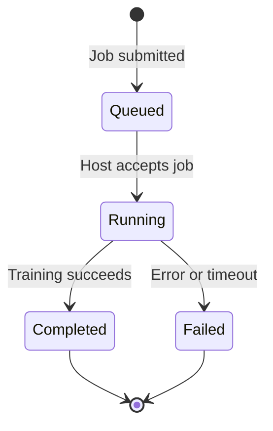

# LoRA Training Guide — End-to-End Dataset Prep to CNS-Verified Deployment

This guide walks through the complete training pipeline: preparing a dataset, submitting a training job, publishing the trained adapter to HuggingFace, storing it in the `AdapterStore`, and deploying it for inference — all verified through CNS spans. By the end, you will have a deployed LoRA adapter serving inference with cost tracking and budget enforcement.

**Key components:** `hkask-mcp-training` (MCP server), `hkask-adapter` (lifecycle + routing), `hkask-types` (CNS spans).

---

## 1. Dataset Preparation

Before training, you need a dataset of decomposition traces in ChatML format. The `hkask-mcp-training` server provides tools to ingest, validate, and normalize datasets.

### 1.1 Supported Formats

The `DatasetPipeline` (`mcp-servers/hkask-mcp-training/src/dataset.rs`) auto-detects and normalizes four formats:

| Format | Description | File Extension |
|--------|-------------|----------------|
| **ChatML** | Standard fine-tuning format. Each record is `{"messages": [{"role": "...", "content": "..."}]}` | `.jsonl` |
| **ShareGPT** | Conversation format with `{"conversations": [{"from": "...", "value": "..."}]}` | `.jsonl` |
| **Alpaca** | Instruction-following format: `{"instruction": "...", "input": "...", "output": "..."}` | `.jsonl` |
| **RawText** | Plain text, one record per line | `.txt` |

### 1.2 ChatML Format (Recommended)

The recommended format for hKask skill training is ChatML — each record is a full conversation with system prompt, user query, and assistant reasoning:

```json
{
  "messages": [
    {
      "role": "system",
      "content": "You are an hKask agent trained in pragmatic-semantics classification..."
    },
    {
      "role": "user",
      "content": "Classify: 'The database must use AES-256-GCM encryption for all data at rest.'"
    },
    {
      "role": "assistant",
      "content": "Decision tree:\n\n**Step 1: Statement about the system?** Yes — it prescribes a specific behavior for the database.\n**Step 2: Can it be relaxed?** No — AES-256-GCM is specific and isn't qualified with 'should' or 'preferably'.\n**Step 3: Explicitly inviolable?** Yes — 'must' is a Prohibition keyword.\n**Step 4: Classification: Prohibition (Rank 1).**"
    }
  ]
}
```

Each trace teaches the model **how to think** through the decision process, not just the final answer.

### 1.3 Ingesting a Dataset

Use the `DatasetPipeline` to ingest and normalize a dataset:

```rust
use hkask_mcp_training::dataset::{DatasetPipeline, DatasetFormat};

let pipeline = DatasetPipeline::new("/cache/training")?;

// Ingest auto-detects the format
let (records, format) = pipeline.ingest("/data/traces/pragmatic-semantics.jsonl").await?;

println!("Ingested {} records in {:?} format", records.len(), format);
// Output: Ingested 150 records in ChatML format
```

The pipeline handles:
- **Auto-detection:** Checks the first record to determine `ChatML`, `ShareGPT`, `Alpaca`, or `RawText`
- **Normalization:** Converts all formats to the internal `ChatConversation` representation
- **Validation:** Rejects malformed records, empty datasets, and unsupported formats
- **Caching:** Caches normalized datasets by content hash for fast re-ingestion

### 1.4 Converting to Training Frameworks

The pipeline exports to framework-specific formats for cloud dispatch:

```rust
use hkask_mcp_training::dataset::{to_axolotl_format, to_unsloth_format};

// Axolotl → Together AI / Runpod (cloud-only, no local training)
let axolotl_path = to_axolotl_format(&records, "/output/axolotl")?;

// Unsloth → Baseten (cloud-only, no local training)
let unsloth_path = to_unsloth_format(&records, "/output/unsloth")?;
```

### 1.5 Dataset Validation

The pipeline validates every record during ingestion:

```rust
// The validate() step checks:
// - Non-empty messages array
// - Valid roles (system, user, assistant)
// - Non-empty content fields
// - Consistent message structure

// Errors are reported per-line:
// DatasetError::Validation { line: 42, message: "empty assistant content" }
```

---

## 2. Adapter Training

The training pipeline is managed by the `hkask-mcp-training` MCP server, which wraps provider-specific APIs behind a common `TrainingProvider` trait.

### 2.1 Training Architecture

The training system separates three concerns. All training is cloud-only — there is no local training path.

```
┌─────────────────────────────────────────────────────────┐
│                     Training Job                          │
│                                                          │
│  Harness (how):    Axolotl              │  Unsloth      │
│  Host (where):   Together  │  Runpod   │  Baseten       │
│  Base Model:      Qwen  │  Gemma  │  Llama  │  Mistral  │
└─────────────────────────────────────────────────────────┘
```

| Layer | Variants | Cloud Host | Description |
|-------|----------|-----------|-------------|
| **Harness** | `Axolotl` | Together AI, Runpod | YAML-based training framework |
| **Harness** | `Unsloth` | Baseten | Memory-efficient Python training framework |
| **Base Model** | `llama-3.3-70b`, `qwen2.5-72b`, etc. | — | What model is fine-tuned |

### 2.2 Training Parameters

Configure LoRA hyperparameters via `LoraParams`:

```rust
use hkask_mcp_training::providers::LoraParams;

let lora = LoraParams {
    r: 16,                          // LoRA rank
    alpha: 32,                      // Scaling factor
    dropout: 0.0,                   // Dropout (0.0 optimized by Unsloth)
    target_modules: vec![
        "q_proj".into(),
        "v_proj".into(),
        "k_proj".into(),
        "o_proj".into(),
    ],
    modules_to_save: vec![],        // Extra modules saved fully
    use_rslora: false,              // Rank-stabilized LoRA
};
```

Optional QLoRA quantization (4-bit):

```rust
use hkask_mcp_training::providers::QuantizationParams;

let quant = QuantizationParams {
    load_in_4bit: true,
    load_in_8bit: false,
    bnb_4bit_compute_dtype: Some("bf16".into()),
    bnb_4bit_quant_type: Some("nf4".into()),
    bnb_4bit_use_double_quant: true,
};
```

### 2.3 Submitting a Training Job

Create and submit a `TrainingJob`:

```rust
use hkask_mcp_training::providers::{
    TrainingJob, TrainingHostId, TrainingHarnessId,
};

let job = TrainingJob::new(
    PathBuf::from("/data/traces/pragmatic-semantics.jsonl"),
    "OM/qwen3:8b".into(),              // Base model (provider-prefixed)
    training_params,
    TrainingHostId::Together,           // Where to run
    TrainingHarnessId::Axolotl,         // Which framework
);
// job.id is auto-generated UUIDv4
// job.status starts as TrainingJobStatus::Queued
```

The job is stored in `JobStore` for persistence:

```rust
let job_store = JobStore::new("training.db")?;
job_store.store(&job)?;

// Track progress
job_store.update_status(&job.id, TrainingJobStatus::Running)?;
job_store.update_status(&job.id, TrainingJobStatus::Completed)?;
```

### 2.4 Training Job Lifecycle



Status transitions are persisted via `job_store.update_status()`. Each status change is queryable — no polling of external APIs required after submission.

### 2.5 Adapter Output

On completion, the training host produces:
- `adapter_model.safetensors` — LoRA weight deltas
- `adapter_config.json` — PEFT configuration (rank, alpha, base model, target modules)

The training MCP wraps these in a `LoRAAdapter` metadata struct:

```rust
// After training completes (in training MCP)
pub struct LoRAAdapter {
    pub id: String,             // UUIDv4
    pub name: String,           // Human-readable
    pub base_model: String,     // Provider-prefixed (e.g. "OM/qwen3:8b")
    pub dataset_hash: String,   // Content hash of training data
    pub training_job_id: String, // Links back to the TrainingJob
    pub skill_name: String,     // e.g. "pragmatic-semantics"
    pub version: u32,           // Incremented on retrain
    pub size_bytes: u64,        // Weight file size
    pub metrics: Option<AdapterMetrics>,  // loss, perplexity, etc.
}

pub struct AdapterMetrics {
    pub loss: Option<f32>,
    pub perplexity: Option<f32>,
    pub training_duration_secs: Option<u64>,
    pub tokens_processed: Option<u64>,
}
```

The `LoRAAdapter::to_canonical()` method converts training MCP metadata into a `TrainedLoRAAdapter` ready for the `AdapterStore`.

---

## 3. HuggingFace Integration

Trained adapters are published to HuggingFace Hub for distribution to inference providers.

### 3.1 Model Registry — Resolving Base Models

Base models are identified with provider prefixes (`OM/qwen3:8b`, `TG/llama-3.3-70b`). The `ModelRegistry` trait strips these to raw HF model IDs:

```rust
use hkask_mcp_training::huggingface::resolve_model_id;

// Provider-prefixed → raw HF ID
assert_eq!(resolve_model_id("OM/qwen3:8b"), "qwen3:8b");
assert_eq!(resolve_model_id("TG/llama-3.3-70b"), "llama-3.3-70b");

// Known prefixes: DI/ (DeepInfra), FA/ (fal.ai), TG/ (Together), OR/ (OpenRouter)
```

### 3.2 Adapter Registry — Publishing Adapters

The `AdapterRegistry` trait handles publishing trained adapters to HuggingFace:

```rust
#[async_trait::async_trait]
pub trait AdapterRegistry: Send + Sync {
    /// Publish a LoRA adapter to a HuggingFace repository.
    /// Uploads adapter weights + adapter_config.json.
    /// Creates the repo if it doesn't exist. Requires HF_TOKEN with write access.
    async fn publish_adapter(
        &self,
        adapter_id: &str,
        weight_path: &Path,
        hf_repo: &str,
    ) -> Result<String, HuggingFaceError>;

    /// Pull/download a LoRA adapter from HuggingFace to local cache.
    async fn pull_adapter(
        &self,
        hf_repo: &str,
        revision: Option<&str>,
        cache_dir: &Path,
    ) -> Result<PathBuf, HuggingFaceError>;
}
```

**Workflow:**

1. Training completes → adapter weights on local disk
2. Publish via `publish_adapter()` → adapter on HuggingFace Hub
3. The published repo path becomes the `AdapterSource::HuggingFace { repo }` field
4. Providers (Together, Runpod, Baseten) pull from this repo during endpoint provisioning

### 3.3 Dataset Registry — Remote Datasets

The `DatasetRegistry` trait supports datasets hosted on HuggingFace:

```rust
#[async_trait::async_trait]
pub trait DatasetRegistry: Send + Sync {
    fn resolve_dataset(&self, dataset_id: &str) -> Result<String, HuggingFaceError>;
    async fn download_dataset(
        &self,
        dataset_id: &str,
        cache_dir: &Path,
    ) -> Result<PathBuf, HuggingFaceError>;
}
```

Datasets can be referenced as `hf://datasets/username/dataset-name` or bare HF dataset IDs.

### 3.4 Authentication

All HuggingFace operations require `HF_TOKEN` set in the environment for gated models and private repos. The system returns `HuggingFaceError::AuthRequired` if the token is missing.

---

## 4. CNS-Verified Deployment

After training and publishing, deploy the adapter through the CNS-verified pipeline.

### 4.1 Step-by-Step Deployment

```mermaid
flowchart TD
    A[Training Complete] --> B[Publish to HuggingFace]
    B --> C[Store in AdapterStore]
    C --> D{AdapterStored span}
    D --> E[Select Provider]
    E --> F{User Confirms (P2)}
    F --> G[create_endpoint]
    G --> H{EndpointCreateStarted span}
    G --> I{EndpointCreateConfirmed span}
    I --> J[Endpoint Ready]
    J --> K[Run Inference]
    K --> L{EndpointInference span}
    L --> M{EndpointCostAccrued span}
    M --> N[Teardown]
    N --> O{EndpointDraining span}
    O --> P{EndpointTerminated span}
```

### 4.2 Store the Adapter

```rust
use hkask_adapter::{AdapterStore, AdapterSource, TrainedLoRAAdapter};

let store = AdapterStore::open("hkask.db")?;
store.migrate()?;

// Convert training MCP adapter to canonical form
let canonical = lora_adapter.to_canonical(
    "https://my-domain.org/profile#me".into(),  // owner WebID (P12)
    "/data/adapters/pragmatic-semantics-v1",
    "mdz-axolotl/pragmatic-semantics-v1",          // HF repo
)?;

store.store(&canonical)?;
// ✅ CNS: cns.adapter.stored

// Verify
let stored = store.get_by_id(&canonical.id)?;
// ✅ CNS: cns.adapter.retrieved
assert_eq!(stored.owner.as_str(), "https://my-domain.org/profile#me");
```

### 4.3 Deploy to an Inference Endpoint

```rust
use hkask_adapter::{AdapterRouter, AdapterPort};

let router = AdapterRouter::new(store)?;

// Step 1: Select a provider (P2 — user must confirm)
let selection = router.select_provider(
    adapter_id,
    Some(2.00), // Budget: max $2.00/hr
    &token,
)?;

// selection.providers is sorted cheapest first:
// [Runpod($0.79), Baseten($0.85), Together($1.10)]
// selection.within_budget_count = 3

// Step 2: User confirms provider choice, then:
let handle = router.create_endpoint(
    adapter_id,
    ProviderId::Runpod,
    &token,
)?;
// ✅ CNS: cns.endpoint.create.started
// (Provider provisions → ✅ CNS: cns.endpoint.create.confirmed)

println!("Endpoint ready: {}", handle.endpoint_url);
println!("Phase: {:?}", handle.phase());     // Ready
println!("Cost so far: ${:.2}", handle.cost_accrued());
```

### 4.4 Run Inference

```rust
use hkask_types::template::LLMParameters;

let result = router.infer(
    handle.endpoint_id,
    "Classify: 'The database must use AES-256-GCM encryption for all data at rest.'",
    LLMParameters::default(),
    &token,
)?;
// ✅ CNS: cns.endpoint.inference
// ✅ CNS: cns.endpoint.cost.accrued

println!("Response: {}", result.content);
println!("Cost accrued: ${:.2}", handle.cost_accrued());
```

### 4.5 Monitor Budget

```rust
// Check budget health
let status = router.endpoint_status(handle.endpoint_id, &token)?;
if status.cost_accrued > 45.0 {
    // Approaching the $50.00 budget
    eprintln!("⚠️  Endpoint cost ${:.2} approaching budget", status.cost_accrued);
    // CNS: cns.endpoint.cost.budget_warning (if is_over_budget)
}
```

### 4.6 Teardown

Two paths to teardown:

**Explicit teardown:**
```rust
router.teardown_endpoint(handle.endpoint_id, &token)?;
// ✅ CNS: cns.endpoint.draining
// → in-flight requests complete
// ✅ CNS: cns.endpoint.terminated
```

**RAII guard (automatic):**
```rust
// EndpointGuard::drop() calls teardown automatically
// on scope exit, panic, or session termination
{
    let _guard = EndpointGuard::new(endpoint_id, router.clone());
    // ... use endpoint ...
} // ← teardown happens here, guaranteed
```

No dangling endpoints. No leaked GPU billing (P5).

### 4.7 Verify with CNS

```bash
# Check all adapter and endpoint spans
kask cns health

# Filter for adapter lifecycle
kask cns health --filter adapter

# Filter for endpoint cost
kask cns health --filter endpoint.cost
```

---

## 5. Provider Configuration

### 5.1 Provider Capabilities

| Provider | Harness | Training Host | Inference LoRA Compose | Hourly Rate | Base Models |
|----------|---------|-------------|----------------------|-------------|-------------|
| **Together AI** | Axolotl | ✅ (`Together`) | ✅ Real HTTP upload + inference | $1.10/hr | llama-3.3-70b, llama-3.1-70b, qwen2.5-72b |
| **Runpod** | Axolotl | ✅ (`Runpod`) | ✅ vLLM skeleton | $0.79/hr | llama-3.3-70b, llama-3.1-70b, qwen2.5-72b, mixtral-8x7b |
| **Baseten** | Unsloth | ✅ (`Baseten`) | ✅ vLLM skeleton | $0.85/hr | llama-3.3-70b, qwen2.5-72b |

### 5.2 Together AI

Together AI is the most complete integration — both training host and inference provider with real HTTP upload.

**Training:**
```rust
let job = TrainingJob::new(
    dataset_path,
    "TG/llama-3.3-70b".into(),
    params,
    TrainingHostId::Together,
    TrainingHarnessId::Axolotl,
);
```

**Inference (via AdapterRouter):**
- Uploads `adapter_model.safetensors` + `adapter_config.json` directly to Together AI
- Polls until the fine-tuning job completes
- Returns endpoint URL for inference
- Full `EndpointLifecycle` with cost tracking

**Cost:** $1.10/hr GPU, ~3 min setup, 30s teardown grace.

### 5.3 Runpod

**Training:** Pod-based GPU dispatch using Axolotl. Adapter weights are published to HuggingFace after training completes.

**Inference:** vLLM skeleton in the `RunpodAdapterBackend`. Provisions a vLLM endpoint, loads the adapter from HuggingFace, serves inference.

**Cost:** $0.79/hr GPU, ~5 min setup, 30s teardown grace. Broader base model support (includes mixtral-8x7b).

### 5.4 Baseten

**Training:** Managed training infrastructure — "bring your own `train.py`" model. Uses Unsloth for memory-efficient training.

**Inference:** vLLM skeleton in the `BasetenAdapterBackend`. Pulls adapters from HuggingFace for deployment.

**Cost:** $0.85/hr GPU, ~4 min setup, 30s teardown grace. 256 MB max adapter size.

### 5.5 Provider Selection Logic

The `select_provider()` method filters and sorts providers:

1. **Compatibility check:** Only providers whose `ProviderCapability::can_compose(base_model_family)` returns `true`
2. **Cost sort:** Remaining providers sorted by `gpu_hourly_rate`, cheapest first
3. **Budget filter:** If a budget limit is set, counts `within_budget_count`
4. **P2 consent gate:** Returns `ProviderSelection` — the caller MUST present options to the user. Even if only one provider is compatible, `requires_confirmation` is always `true`

### 5.6 API Keys

Provider backends require API keys set in the environment:

| Provider | Environment Variable |
|----------|---------------------|
| Together AI | `TG_API_KEY` |
| Runpod | `RUNPOD_API_KEY` |
| Baseten | `BASETEN_API_KEY` |
| HuggingFace | `HF_TOKEN` |

Missing keys result in authentication errors at the `AdapterProviderBackend` level — the router surfaces these as `AdapterError::Internal`.

---

## Complete End-to-End Example

```rust
// 1. PREPARE DATASET
let pipeline = DatasetPipeline::new("/cache/training")?;
let (records, _format) = pipeline.ingest("traces/pragmatic-semantics.jsonl").await?;
let axolotl_path = to_axolotl_format(&records, "/output/axolotl")?;

// 2. SUBMIT TRAINING JOB
let job_store = JobStore::new("training.db")?;
let job = TrainingJob::new(
    axolotl_path,
    "TG/llama-3.3-70b".into(),
    training_params,
    TrainingHostId::Together,
    TrainingHarnessId::Axolotl,
);
job_store.store(&job)?;
// ... wait for completion ...

// 3. PUBLISH TO HUGGINGFACE
adapter_registry.publish_adapter(
    &adapter.id,
    &weight_path,
    "mdz-axolotl/pragmatic-semantics-v1",
).await?;

// 4. STORE IN ADAPTERSTORE
let store = AdapterStore::open("hkask.db")?;
store.migrate()?;
let canonical = adapter.to_canonical(
    owner_webid,
    "/data/adapters/pragmatic-semantics-v1",
    "mdz-axolotl/pragmatic-semantics-v1",
)?;
store.store(&canonical)?;
// ✅ CNS: AdapterStored

// 5. DEPLOY
let router = AdapterRouter::new(store)?;
let selection = router.select_provider(canonical.id, None, &token)?;
// User sees: Runpod $0.79/hr, Baseten $0.85/hr, Together $1.10/hr
// User selects Runpod

let handle = router.create_endpoint(canonical.id, ProviderId::Runpod, &token)?;
// ✅ CNS: EndpointCreateStarted → EndpointCreateConfirmed

// 6. INFER
let result = router.infer(
    handle.endpoint_id,
    "Classify: 'All API calls must use TLS 1.3 or higher.'",
    LLMParameters::default(),
    &token,
)?;
// ✅ CNS: EndpointInference, EndpointCostAccrued
println!("Classification: {}", result.content);

// 7. TEARDOWN (automatic via EndpointGuard drop)
// ✅ CNS: EndpointDraining → EndpointTerminated
```

---

## Quick Reference

| Step | Tool | Key Type | CNS Span |
|------|------|----------|----------|
| Ingest dataset | `DatasetPipeline::ingest()` | `Vec<ChatConversation>` | — |
| Submit training | `JobStore::store()` | `TrainingJob` | — |
| Publish to HF | `AdapterRegistry::publish_adapter()` | `String` (repo URL) | — |
| Store adapter | `AdapterStore::store()` | `TrainedLoRAAdapter` | `AdapterStored` |
| Select provider | `AdapterRouter::select_provider()` | `ProviderSelection` | — |
| Deploy endpoint | `AdapterRouter::create_endpoint()` | `InferenceEndpointHandle` | `EndpointCreateStarted`, `EndpointCreateConfirmed` |
| Run inference | `AdapterRouter::infer()` | `InferenceResult` | `EndpointInference`, `EndpointCostAccrued` |
| Teardown | `EndpointGuard::drop()` or `teardown_endpoint()` | — | `EndpointDraining`, `EndpointTerminated` |

---

## References

- [`mcp-servers/hkask-mcp-training/src/dataset.rs`](../../mcp-servers/hkask-mcp-training/src/dataset.rs) — `DatasetPipeline`, format detection, normalization
- [`mcp-servers/hkask-mcp-training/src/adapters.rs`](../../mcp-servers/hkask-mcp-training/src/adapters.rs) — `LoRAAdapter`, `AdapterStore` (training MCP), `JobStore`
- [`mcp-servers/hkask-mcp-training/src/huggingface.rs`](../../mcp-servers/hkask-mcp-training/src/huggingface.rs) — `ModelRegistry`, `AdapterRegistry`, `DatasetRegistry`
- [`mcp-servers/hkask-mcp-training/src/providers.rs`](../../mcp-servers/hkask-mcp-training/src/providers.rs) — `TrainingJob`, `TrainingHostId`, `TrainingHarnessId`, `LoraParams`
- [`crates/hkask-adapter/src/adapter_store.rs`](../../crates/hkask-adapter/src/adapter_store.rs) — `AdapterStore` CRUD, `TrainedLoRAAdapter`
- [`crates/hkask-adapter/src/adapter_router.rs`](../../crates/hkask-adapter/src/adapter_router.rs) — `AdapterRouter`, `EndpointGuard`
- [`crates/hkask-adapter/src/endpoint_lifecycle.rs`](../../crates/hkask-adapter/src/endpoint_lifecycle.rs) — 5-phase state machine
- [`crates/hkask-adapter/src/provider_cost.rs`](../../crates/hkask-adapter/src/provider_cost.rs) — `CostModel`, `ProviderCapability`
- [`docs/user-guides/lora-adapter-store-guide.md`](../user-guides/lora-adapter-store-guide.md) — Adapter store + lifecycle reference

---

## 6. Production Hardening

### 6.1 Database Encryption

```bash
# Generate a strong passphrase
openssl rand -base64 32

# Set in environment
HKASK_DB_PASSPHRASE=<generated-passphrase>
HKASK_MEMORY_DB=/var/lib/hkask/training.db
```

The database uses SQLCipher with AES-256-CBC encryption. Passphrases are derived using Argon2id to produce 256-bit encryption keys.

### 6.2 Orphaned Endpoint Detection

On startup, the `AdapterRouter` queries the `active_endpoints` table for endpoints that were active when the system last shut down. Each orphaned endpoint is logged with:

```
WARN  Orphaned endpoint — may need manual teardown via provider console
      endpoint_id=<uuid> provider=Together model=adapter-<id>
      expertise=solidity-audit phase=active cost=3.45
```

**Action required:** Check the corresponding provider console and manually delete any endpoints that should no longer be running.

### 6.3 Security Considerations

| Concern | Mitigation |
|---------|-----------|
| API keys in environment | Load from OS keychain where available; `.env` for development |
| Adapter access control | `AdapterPort` trait methods are OCAP-gated via `DelegationToken` |
| Endpoint resource leaks | `EndpointGuard` (RAII) + orphan detection on startup |
| Cross-user adapter access | Sovereign-scoped by WebID owner; sharing requires explicit consent |
| Provider API key exposure | Keys used only in-memory via `reqwest::Client`; never logged |

### 6.4 Systemd Service

```ini
# /etc/systemd/system/hkask-mcp-training.service
[Unit]
Description=hKask Training MCP Server
After=network.target

[Service]
Type=simple
User=hkask
WorkingDirectory=/opt/hkask
EnvironmentFile=/etc/hkask/training.env
ExecStart=/opt/hkask/target/release/hkask-mcp-training
Restart=on-failure
RestartSec=5

[Install]
WantedBy=multi-user.target
```

### 6.5 Docker

```dockerfile
FROM rust:1.85-slim-bookworm AS builder
WORKDIR /app
COPY . .
RUN cargo build --release -p hkask-mcp-training

FROM debian:bookworm-slim
RUN apt-get update && apt-get install -y libssl3 ca-certificates && rm -rf /var/lib/apt/lists/*
COPY --from=builder /app/target/release/hkask-mcp-training /usr/local/bin/
ENV HKASK_MEMORY_DB=/data/training.db
VOLUME /data
ENTRYPOINT ["hkask-mcp-training"]
```

---

## 7. Troubleshooting

| Symptom | Likely Cause | Resolution |
|---------|-------------|------------|
| "TG_API_KEY not set" | Missing environment variable | `export TG_API_KEY=<key>` or add to `.env` |
| "Adapter not found by ID or skill name" | Adapter not registered | Run `training_list_adapters` to see available adapters |
| "Provider unavailable for adapter composition" | Provider not in backend registry | Verify provider is configured (Together/Runpod/Baseten) |
| "Base model incompatibility" | Adapter trained on unsupported model | Check `ProviderCapability::supported_base_model_families` |
| "No huggingface_repo — skipping upload" | Adapter source not set | Set `AdapterSource::HuggingFace { repo }` on the adapter |
| "Together AI upload returned 401" | Invalid or expired API key | Regenerate at [together.ai](https://together.ai) |
| "Runpod teardown failed (may require console deletion)" | Runpod teardown is console-only | Delete manually at [console.runpod.io/serverless](https://console.runpod.io/serverless) |
| Orphaned endpoint warning on startup | Previous session ended without teardown | Check provider console, manually delete if needed |
| Upload job stuck polling for 5+ minutes | Provider is slow or unreachable | Check provider status page; increase poll timeout |

---

*"The Analytical Engine weaves algebraical patterns just as the Jacquard loom weaves flowers and leaves." — Ada Lovelace, 1843*

*The adapter system weaves trained expertise into inference endpoints. Each adapter is a pattern. Each endpoint is a loom. The composition is the weaving.*
