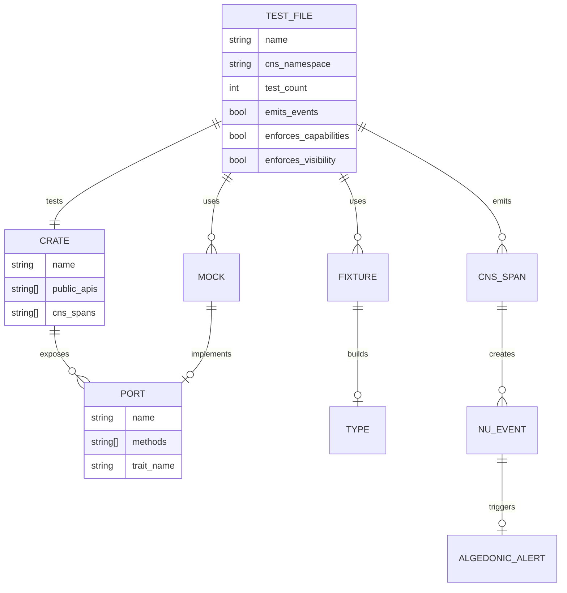

# hKask Test Architecture Semantic Map

## Overview

This document maps the test architecture to hKask's ontological structure, aligning tests with CNS span namespaces and ν-event semantics.

---

## Test-to-Crate Semantic Mapping

### hkask-types
**CNS Spans:** `cns.test.types.*`
**Test File:** `unit-tests/hkask_types_tests.rs`
**Coverage:**
- `CapabilityToken` → `cns.test.types.capability`
- `NuEvent` → `cns.test.types.event`
- `WebID` → `cns.test.types.webid`
- `TemplateType` → `cns.test.types.template_type`
- `Visibility` → `cns.test.types.visibility`
- `HLexicon` → `cns.test.types.lexicon`

**Gap:** No ν-event emission from tests to CNS observer

---

### hkask-storage
**CNS Spans:** `cns.test.storage.*`
**Test File:** `unit-tests/hkask_storage_tests.rs`
**Coverage:**
- `Blob` → `cns.test.storage.blob`

**Gaps:**
- No `BlobStore` tests
- No `TripleStore` tests
- No `EmbeddingStore` tests
- No `GitCas` tests
- No CNS span emission

---

### hkask-memory
**CNS Spans:** `cns.test.memory.*`
**Test File:** `unit-tests/hkask_memory_tests.rs`
**Coverage:**
- `BayesianOps` → `cns.test.memory.bayesian`

**Gaps:**
- No `SemanticMemory` tests
- No `EpisodicMemory` tests
- No CNS span emission

---

### hkask-cns
**CNS Spans:** `cns.test.cns.*`
**Test File:** `unit-tests/hkask_cns_tests.rs`
**Coverage:**
- `AlgedonicManager` → `cns.test.cns.algedonic`
- `EnergyBudget` → `cns.test.cns.energy`
- `RateLimiter` → `cns.test.cns.rate_limit`
- `SpanCategory` → `cns.test.cns.spans`
- `VarietyCounter/Monitor` → `cns.test.cns.variety`

**Gaps:**
- Tests don't emit ν-events to parent CNS
- No algedonic alert integration tests
- No energy tracking integration

---

### hkask-templates
**CNS Spans:** `cns.test.templates.*`
**Test File:** `unit-tests/hkask_templates_tests.rs`
**Coverage:**
- `TemplateType` → `cns.test.templates.type`

**Gaps:**
- No registry tests (`GitRegistry`, `SqliteRegistry`)
- No cascade executor tests
- No template rendering tests
- No CNS span emission

---

### hkask-ensemble
**CNS Spans:** `cns.test.ensemble.*`
**Test File:** `unit-tests/hkask_ensemble_tests.rs`
**Coverage:** Stub only

**Gaps:**
- No `MultiOkapiClient` tests
- No `ConfidenceRouter` tests
- No `LoadBalancer` tests
- No `CircuitBreaker` tests

---

### hkask-keystore
**CNS Spans:** `cns.test.keystore.*`
**Test File:** `unit-tests/hkask_keystore_tests.rs`
**Coverage:** Stub only

**Gaps:**
- No `KeyStore` tests
- No `Keychain` tests
- No encryption tests

---

### hkask-mcp
**CNS Spans:** `cns.test.mcp.*`
**Test File:** `unit-tests/hkask_mcp_tests.rs`
**Coverage:** Stub only

**Gaps:**
- No `McpRuntime` tests
- No `Dispatcher` tests
- No `SecurityPolicy` tests

---

## Integration Test Semantic Map

### storage_memory_integration
**CNS Spans:** `cns.test.integration.storage_memory`
**Test File:** `integration-tests/storage_memory_integration.rs`
**Coverage:** Basic storage + memory interaction

**Gaps:**
- No bitemporal tests
- No embedding + semantic memory tests
- No blob + episodic memory tests

### chaos_integration
**CNS Spans:** `cns.test.integration.chaos`
**Test File:** `integration-tests/chaos_integration.rs`
**Coverage:** Okapi failover (stub)

**Gaps:**
- No actual Okapi instance tests
- No circuit breaker tests
- No retry logic tests

---

## Test Harness Semantic Map

### test-harnesses/fixtures.rs
**Purpose:** Test data builders
**Missing:** Semantic alignment with hKask types
**Remediation:** Convert to port-based fixture builders

### test-harnesses/mocks.rs
**Purpose:** Mock implementations
**Missing:** Port trait implementations
**Remediation:** Implement production port traits

### test-harnesses/temp_dirs.rs
**Purpose:** Temporary directory helpers
**Missing:** Storage port alignment
**Remediation:** Implement `StoragePort` trait

---

## CNS ν-Event Emission Gaps

| Test File | Should Emit | Currently Emits |
|-----------|-------------|-----------------|
| hkask_types_tests.rs | `cns.test.types.*` | ❌ None |
| hkask_storage_tests.rs | `cns.test.storage.*` | ❌ None |
| hkask_memory_tests.rs | `cns.test.memory.*` | ❌ None |
| hkask_cns_tests.rs | `cns.test.cns.*` | ❌ None |
| hkask_templates_tests.rs | `cns.test.templates.*` | ❌ None |
| All integration tests | `cns.test.integration.*` | ❌ None |

---

## Capability Enforcement Gaps

| Test File | Requires Capability | Currently Enforces |
|-----------|--------------------|--------------------|
| hkask_storage_tests.rs | Storage access | ❌ No |
| hkask_memory_tests.rs | Memory access | ❌ No |
| hkask_cns_tests.rs | CNS access | ❌ No |
| All tests | Test execution | ❌ No |

---

## Visibility Enforcement Gaps

| Test Category | Visibility Type | Currently Enforced |
|--------------|-----------------|--------------------|
| Unit tests | Private (default) | ❌ No |
| Integration tests | Shared | ❌ No |
| Security tests | Private | ❌ No |

---

## Remediation Priority Matrix

| Priority | Phase | Tasks | Estimated Effort |
|----------|-------|-------|------------------|
| P1 | Phase 2 | Refactor test harnesses as ports | 2 days |
| P1 | Phase 4 | Expand test coverage | 5 days |
| P1 | Phase 8 | Standardize fixtures/mocks | 2 days |
| P2 | Phase 3 | Implement test capabilities | 3 days |
| P2 | Phase 5 | Integration tests | 3 days |
| P2 | Phase 6 | Security tests | 2 days |
| P3 | Phase 7 | CNS instrumentation | 2 days |
| P3 | Phase 9 | Documentation | 1 day |
| P3 | Phase 10 | Future work | 1 day |

**Total Estimated Effort:** 21 days

---

## Entity Relationship Diagram

---

## Next Steps

1. **Immediate:** Refactor `test-harnesses/` to implement port traits (Phase 2)
2. **Short-term:** Expand test coverage for storage, memory, cns, templates (Phase 4)
3. **Medium-term:** Implement capability tokens and OCAP enforcement (Phase 3, 6)
4. **Long-term:** CNS ν-event emission from all tests (Phase 7)
