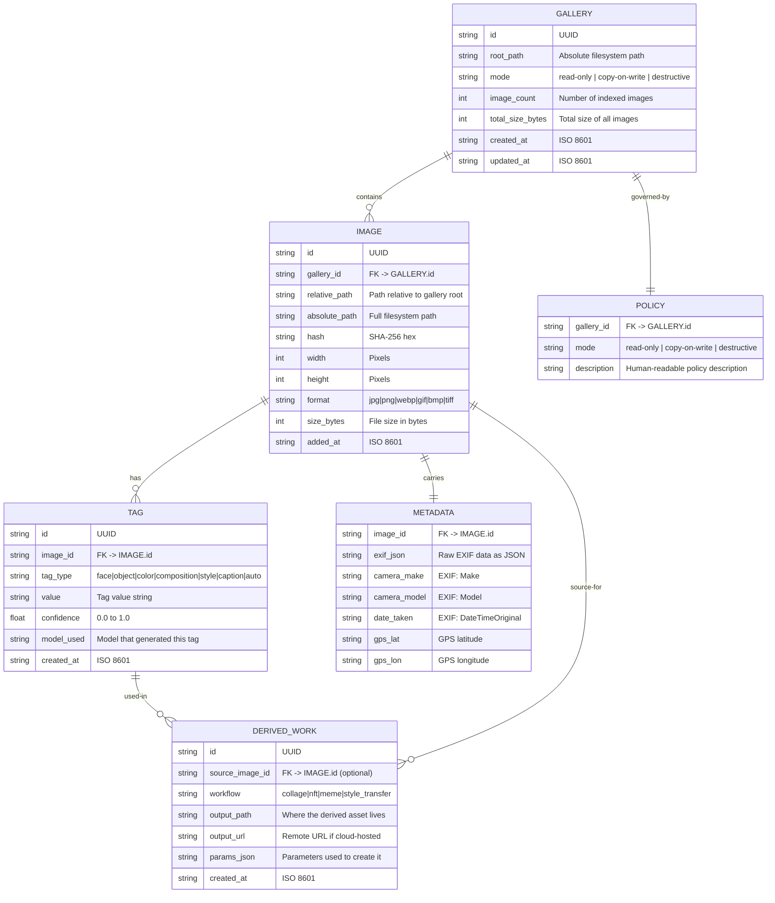

# Media Gallery Schema & Tool Design
## Design Phase: T4–T5

---

## T4 — Gallery Abstraction ERD



### POLICY State Machine

```
┌──────────────┐      ┌──────────────────┐      ┌──────────────┐
│  READ-ONLY   │      │  COPY-ON-WRITE   │      │ DESTRUCTIVE  │
│              │      │                  │      │              │
│ • Files are  │      │ • Files can be   │      │ • Files may  │
│   immutable  │      │   edited; copies  │      │   be edited  │
│ • Source of  │      │   written as new  │      │   in-place   │
│   truth for  │      │   images          │      │ • Original  │
│   originals  │      │ • Originals       │      │   data may  │
│              │      │   preserved       │      │   be lost    │
└──────────────┘      └──────────────────┘      └──────────────┘
     default              user selects               user selects
                                                       (with warning)
```

Three states, no gray zone. Mode set at init, persists as policy discriminator.

---

## T5 — Tool Signature Map

### Tool Families and Delegation Points

#### GalleryTools

```rust
// REQ: media-gallery-set-root-01
#[tool(description = "Initialize or reconfigure an image gallery with a root path and policy mode")]
async fn gallery_set_root(
    &mut self,
    Parameters(GallerySetRootRequest { path, mode }): Parameters<GallerySetRootRequest>,
) -> String {}
// Delegates to: std::fs (validate path) + SQLite (create gallery record)

// REQ: media-gallery-scan-01
#[tool(description = "Scan gallery directory for images, compute hashes and dimensions")]
async fn gallery_scan(
    &mut self,
    Parameters(GalleryScanRequest { recursive, extensions }): Parameters<GalleryScanRequest>,
) -> String {}
// Delegates to: walkdir (filesystem walk) + sha2 (hashing) + image crate (dimensions)

// REQ: media-gallery-get-image-01
#[tool(description = "Get a reference to a gallery image by index or hash")]
async fn gallery_get_image(
    &self,
    Parameters(GalleryGetImageRequest { index, hash, format }): Parameters<GalleryGetImageRequest>,
) -> String {}
// Delegates to: SQLite (lookup) + std::fs (read file) + base64 (encode if requested)

// REQ: media-gallery-get-metadata-01
#[tool(description = "Get metadata for a gallery image including EXIF and AI tags")]
async fn gallery_get_metadata(
    &self,
    Parameters(GalleryGetMetadataRequest { index, hash }): Parameters<GalleryGetMetadataRequest>,
) -> String {}
// Delegates to: SQLite (lookup image + tags)
```

#### TaggingTools

```rust
// REQ: media-tag-faces-01
#[tool(description = "Detect and describe faces in a gallery image")]
async fn tag_faces(
    &self,
    Parameters(TagFacesRequest { image_index, detail_level }): Parameters<TagFacesRequest>,
) -> String {}
// Delegates to: InferenceRouter.generate_vision() with media_detect_faces template

// REQ: media-tag-objects-01
#[tool(description = "Detect and label objects in a gallery image")]
async fn tag_objects(
    &self,
    Parameters(TagObjectsRequest { image_index, detail_level, max_objects }): Parameters<TagObjectsRequest>,
) -> String {}
// Delegates to: InferenceRouter.generate_vision() with media_detect_objects template

// REQ: media-tag-colors-01
#[tool(description = "Analyze dominant colors and palette in a gallery image")]
async fn tag_colors(
    &self,
    Parameters(TagColorsRequest { image_index }): Parameters<TagColorsRequest>,
) -> String {}
// Delegates to: InferenceRouter.generate_vision() with media_tag template (colors taxonomy)

// REQ: media-tag-composition-01
#[tool(description = "Analyze composition: focal point, rule-of-thirds, depth, perspective")]
async fn tag_composition(
    &self,
    Parameters(TagCompositionRequest { image_index }): Parameters<TagCompositionRequest>,
) -> String {}
// Delegates to: InferenceRouter.generate_vision() with media_classify template
```

#### AbstractionTools

```rust
// REQ: media-image-caption-01 (exists as fal_caption)
// Delegates to: fal.ai any-llm or DeepInfra Llama 3.2 Vision

// REQ: media-image-describe-scene-01
#[tool(description = "Describe the full scene: subject, setting, lighting, mood")]
async fn image_describe_scene(
    &self,
    Parameters(DescribeSceneRequest { image_index, style }): Parameters<DescribeSceneRequest>,
) -> String {}
// Delegates to: InferenceRouter.generate_vision() with media_caption template (descriptive)

// REQ: media-image-classify-style-01
#[tool(description = "Classify image style: photographic style, genre, era")]
async fn image_classify_style(
    &self,
    Parameters(ClassifyStyleRequest { image_index, categories }): Parameters<ClassifyStyleRequest>,
) -> String {}
// Delegates to: InferenceRouter.generate_vision() with media_classify template
```

#### DerivationTools

```rust
// REQ: media-remove-background-01
#[tool(description = "Remove background from image, return transparent or new background")]
async fn image_remove_background(
    &self,
    Parameters(RemoveBackgroundRequest { image_index, new_bg_color }): Parameters<RemoveBackgroundRequest>,
) -> String {}
// Delegates to: DeepInfra Bria/remove_background or fal.ai birefnet

// REQ: media-apply-style-01
#[tool(description = "Apply style transfer to an image")]
async fn image_apply_style(
    &self,
    Parameters(ApplyStyleRequest { image_index, style_prompt, strength }): Parameters<ApplyStyleRequest>,
) -> String {}
// Delegates to: fal.ai flux/dev/image-to-image or DI Qwen/Qwen-Image-Edit

// REQ: media-create-collage-01
#[tool(description = "Create a collage from multiple gallery images")]
async fn image_create_collage(
    &self,
    Parameters(CreateCollageRequest { image_indices, layout, spacing, canvas_size }): Parameters<CreateCollageRequest>,
) -> String {}
// Delegates to: Bria/remove_background (per image) + image crate (composition)

// REQ: media-upscale-01 (exists as fal_upscale)
// Delegates to: fal.ai seedvr2 or DeepInfra clarity-upscaler

// REQ: media-image-to-image-01 (exists as fal_image_to_image)
// Delegates to: fal.ai flux/dev/image-to-image
```

#### VideoTools

```rust
// REQ: media-video-clip-01
#[tool(description = "Trim a video to specified start/end times")]
async fn video_clip(
    &self,
    Parameters(VideoClipRequest { video_url, start_sec, end_sec }): Parameters<VideoClipRequest>,
) -> String {}
// Delegates to: local ffmpeg subprocess

// REQ: media-video-to-gif-01
#[tool(description = "Convert a video segment to GIF format")]
async fn video_to_gif(
    &self,
    Parameters(VideoToGifRequest { video_url, start_sec, duration_sec, width, fps }): Parameters<VideoToGifRequest>,
) -> String {}
// Delegates to: local ffmpeg subprocess

// REQ: media-image-to-video-01
#[tool(description = "Animate an image into a short video clip")]
async fn image_to_video(
    &self,
    Parameters(ImageToVideoRequest { image_index, prompt, duration, model }): Parameters<ImageToVideoRequest>,
) -> String {}
// Delegates to: fal.ai seedance-2.0/image-to-video or kling/image-to-video

// REQ: media-video-add-caption-01
#[tool(description = "Add text caption overlay to a video")]
async fn video_add_caption(
    &self,
    Parameters(VideoAddCaptionRequest { video_url, text, position, font_size }): Parameters<VideoAddCaptionRequest>,
) -> String {}
// Delegates to: local ffmpeg drawtext filter

// REQ: media-video-remix-01
#[tool(description = "Generate a remix: clip, add caption, convert to GIF")]
async fn video_remix(
    &self,
    Parameters(VideoRemixRequest { video_url, start_sec, end_sec, caption_text }): Parameters<VideoRemixRequest>,
) -> String {}
// Delegates to: video_clip + video_add_caption + video_to_gif (composition)
```

### Request Structs (full type signatures)

```rust
// ── Gallery ──
#[derive(Debug, Deserialize, JsonSchema)]
pub struct GallerySetRootRequest {
    pub path: String,           // Absolute path
    #[serde(default = "default_mode")]
    pub mode: String,           // "read-only" | "copy-on-write" | "destructive"
}

#[derive(Debug, Deserialize, JsonSchema)]
pub struct GalleryScanRequest {
    #[serde(default = "default_true")]
    pub recursive: bool,
    pub extensions: Option<Vec<String>>,
}

#[derive(Debug, Deserialize, JsonSchema)]
pub struct GalleryGetImageRequest {
    pub index: Option<usize>,   // 0-based index in gallery
    pub hash: Option<String>,   // SHA-256 lookup
    pub format: Option<String>, // "path" (default) | "base64" | "url"
}

#[derive(Debug, Deserialize, JsonSchema)]
pub struct GalleryGetMetadataRequest {
    pub index: Option<usize>,
    pub hash: Option<String>,
}

// ── Tagging ──
#[derive(Debug, Deserialize, JsonSchema)]
pub struct TagFacesRequest {
    pub image_index: usize,
    pub detail_level: Option<String>, // "basic" | "detailed"
}

#[derive(Debug, Deserialize, JsonSchema)]
pub struct TagObjectsRequest {
    pub image_index: usize,
    pub detail_level: Option<String>, // "basic" | "detailed"
    pub max_objects: Option<usize>,   // default 20
}

#[derive(Debug, Deserialize, JsonSchema)]
pub struct TagColorsRequest {
    pub image_index: usize,
}

#[derive(Debug, Deserialize, JsonSchema)]
pub struct TagCompositionRequest {
    pub image_index: usize,
}

// ── Abstraction ──
#[derive(Debug, Deserialize, JsonSchema)]
pub struct DescribeSceneRequest {
    pub image_index: usize,
    pub style: Option<String>,  // "descriptive" | "artistic" | "technical" | "alt_text"
}

#[derive(Debug, Deserialize, JsonSchema)]
pub struct ClassifyStyleRequest {
    pub image_index: usize,
    pub categories: Option<String>,
}

// ── Derivation ──
#[derive(Debug, Deserialize, JsonSchema)]
pub struct RemoveBackgroundRequest {
    pub image_index: usize,
    pub new_bg_color: Option<String>, // e.g. "#FFFFFF" or "transparent"
}

#[derive(Debug, Deserialize, JsonSchema)]
pub struct ApplyStyleRequest {
    pub image_index: usize,
    pub style_prompt: String,
    pub strength: Option<f32>,  // 0.0–1.0, default 0.75
}

#[derive(Debug, Deserialize, JsonSchema)]
pub struct CreateCollageRequest {
    pub image_indices: Vec<usize>,
    pub layout: Option<String>,  // "grid" | "horizontal" | "vertical" | "masonry"
    pub spacing: Option<u32>,    // pixels between images, default 8
    pub canvas_size: Option<String>, // "1920x1080" etc.
}

// ── Video ──
#[derive(Debug, Deserialize, JsonSchema)]
pub struct VideoClipRequest {
    pub video_url: String,
    pub start_sec: f32,
    pub end_sec: f32,
}

#[derive(Debug, Deserialize, JsonSchema)]
pub struct VideoToGifRequest {
    pub video_url: String,
    pub start_sec: Option<f32>,
    pub duration_sec: Option<f32>,
    pub width: Option<u32>,     // output width, default 480
    pub fps: Option<u32>,       // default 10
}

#[derive(Debug, Deserialize, JsonSchema)]
pub struct ImageToVideoRequest {
    pub image_index: usize,
    pub prompt: Option<String>,  // motion description
    pub duration: Option<f32>,   // seconds, provider-capped
    pub model: Option<String>,   // "seedance" | "kling" | "minimax"
}

#[derive(Debug, Deserialize, JsonSchema)]
pub struct VideoAddCaptionRequest {
    pub video_url: String,
    pub text: String,
    pub position: Option<String>,  // "top" | "bottom" | "center"
    pub font_size: Option<u32>,    // default 24
}

#[derive(Debug, Deserialize, JsonSchema)]
pub struct VideoRemixRequest {
    pub video_url: String,
    pub start_sec: f32,
    pub end_sec: f32,
    pub caption_text: Option<String>,
}
```

### Model Routing Table

| Tool | Primary Model | Fallback | Output Type |
|------|--------------|----------|-------------|
| `tag_faces` | `DI/meta-llama/Llama-3.2-11B-Vision-Instruct` | — | JSON array |
| `tag_objects` | `DI/meta-llama/Llama-3.2-11B-Vision-Instruct` | — | JSON array |
| `tag_colors` | `DI/meta-llama/Llama-3.2-11B-Vision-Instruct` | — | JSON array |
| `tag_composition` | `DI/meta-llama/Llama-3.2-11B-Vision-Instruct` | — | JSON array |
| `image_caption` | `fal-ai/any-llm` | `DI/meta-llama/Llama-3.2-11B-Vision-Instruct` | text |
| `image_describe_scene` | `DI/meta-llama/Llama-3.2-11B-Vision-Instruct` | — | text |
| `image_classify_style` | `DI/meta-llama/Llama-3.2-11B-Vision-Instruct` | — | JSON array |
| `image_remove_background` | `DI/Bria/remove_background` | `fal-ai/birefnet` | image blob |
| `image_apply_style` | `fal-ai/flux/dev/image-to-image` | `DI/Qwen/Qwen-Image-Edit` | image blob |
| `image_create_collage` | Local `image` crate | — | image blob |
| `image_upscale` | `fal-ai/seedvr2` | `DI/philz1337x/clarity-upscaler` | image blob |
| `image_to_image` | `fal-ai/flux/dev/image-to-image` | — | image blob |
| `video_clip` | Local ffmpeg | — | video URL/path |
| `video_to_gif` | Local ffmpeg | — | GIF URL/path |
| `image_to_video` | `fal-ai/seedance-2.0/image-to-video` | `fal-ai/minimax/video-01-live` | video URL |
| `video_add_caption` | Local ffmpeg | — | video URL/path |
| `video_remix` | Composite (clip+caption+gif) | — | GIF URL/path |
