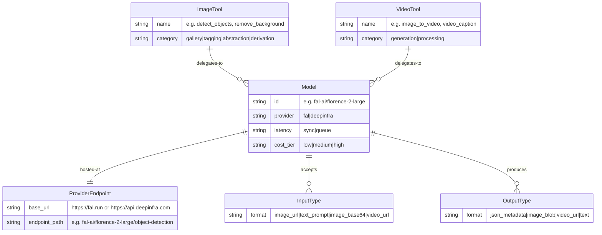

# Media Tool Domain Landscape — hKask Media MCP Server
## Research Phase: T1–T3

---

## T1 — RDF Dependency Graph: Tools → Models → Endpoints



### Dependency Lattice

| Category | Tool | Model | Provider | Endpoint | Latency | Output |
|----------|------|-------|----------|----------|---------|--------|
| Object Detection | `detect_objects` | Florence-2 Large | fal.ai | `fal-ai/florence-2-large/object-detection` | sync | JSON bboxes |
| Object Detection | `detect_objects` | Llama 3.2 Vision | DeepInfra | `meta-llama/Llama-3.2-11B-Vision-Instruct` | sync | JSON text |
| Segmentation | `extract_object` | SAM 2 | fal.ai | `fal-ai/sam2` | queue | image + mask |
| Face Detection | `detect_faces` | Llama 3.2 Vision | DeepInfra | `meta-llama/Llama-3.2-11B-Vision-Instruct` | sync | JSON array |
| Face Detection | `detect_faces` | Florence-2 Large | fal.ai | `fal-ai/florence-2-large/object-detection` | sync | JSON bboxes |
| Background Removal | `remove_background` | Bria RMBG 2.0 | DeepInfra | `Bria/remove_background` | sync | image blob |
| Background Removal | `remove_background` | Birefnet | fal.ai | `fal-ai/birefnet` | sync | image blob |
| Captioning | `image_caption` | Llama 3.2 Vision | DeepInfra | `meta-llama/Llama-3.2-11B-Vision-Instruct` | sync | text |
| Captioning | `image_caption` | Florence-2 Large | fal.ai | `fal-ai/florence-2-large/caption` | sync | text |
| Captioning | `image_caption` | Any LLM (GPT-4o) | fal.ai | `fal-ai/any-llm` | sync | text |
| Style Transfer | `apply_style` | Flux dev img2img | fal.ai | `fal-ai/flux/dev/image-to-image` | sync | image blob |
| Style Transfer | `apply_style` | Qwen Image Edit | DeepInfra | `Qwen/Qwen-Image-Edit` | sync | image blob |
| Image Upscaling | `upscale` | SeedVR2 | fal.ai | `fal-ai/seedvr2` | queue | image blob |
| Image Upscaling | `upscale` | Clarity Upscaler | DeepInfra | `philz1337x/clarity-upscaler` | sync | image blob |
| Text-to-Image | `generate_image` | FLUX Schnell | fal.ai | `fal-ai/flux/schnell` | sync | image blob |
| Image-to-Image | `image_to_image` | Flux dev img2img | fal.ai | `fal-ai/flux/dev/image-to-image` | sync | image blob |
| Text-to-Video | `generate_video` | Seedance 2.0 | fal.ai | `fal-ai/seedance-2.0/text-to-video` | queue | video URL |
| Text-to-Video | `generate_video` | Kling 3.0 Pro | fal.ai | `fal-ai/kling-video/v3/pro/text-to-video` | queue | video URL |
| Text-to-Video | `generate_video` | Veo 3.1 | fal.ai | `fal-ai/veo-3.1` | queue | video URL |
| Image-to-Video | `image_to_video` | Seedance 2.0 | fal.ai | `fal-ai/seedance-2.0/image-to-video` | queue | video URL |
| Image-to-Video | `image_to_video` | Kling 3.0 Pro | fal.ai | `fal-ai/kling-video/v3/pro/image-to-video` | queue | video URL |
| Image-to-Video | `image_to_video` | MiniMax Hailuo | fal.ai | `fal-ai/minimax/video-01-live` | queue | video URL |
| Audio Transcription | `transcribe` | Whisper v3 | DeepInfra | `openai/whisper-large-v3` | sync | text |
| Image Classification | `classify_style` | Llama 3.2 Vision | DeepInfra | `meta-llama/Llama-3.2-11B-Vision-Instruct` | sync | JSON text |
| Image Tagging | `tag_image` | Llama 3.2 Vision | DeepInfra | `meta-llama/Llama-3.2-11B-Vision-Instruct` | sync | JSON array |

---

## T2 — User Story → Capability Traceability Matrix

| User Story | Capability | Atomic LLM Call | Model | Endpoint | ParameterShape |
|-----------|-----------|-----------------|-------|----------|---------------|
| **Gallery Management** — scan/track images | filesystem_hash + metadata_read | Read file bytes → SHA-256 hash | N/A (local) | `std::fs::read` + SHA-256 | `path: PathBuf` |
| **Gallery Management** — get dimensions | image_dimensions | Read image header for dimensions | N/A (local) | `image` crate `image_dimensions` | `path: PathBuf` |
| **Face Tagging** — detect + describe faces | vision_inference(face_detection) | Send image to vision LLM with "detect faces" prompt | Llama 3.2 Vision | `meta-llama/Llama-3.2-11B-Vision-Instruct` | `{image_url, detail_level}` |
| **Object Extraction** — label objects | vision_inference(object_detection) | Send image to vision LLM with "detect objects" prompt | Llama 3.2 Vision | `meta-llama/Llama-3.2-11B-Vision-Instruct` | `{image_url, detail_level, max_objects}` |
| **Object Extraction** — segment objects | segmentation_model | Send image to Florence-2 segmentation | Florence-2 | `fal-ai/florence-2-large/referring-expression-segmentation` | `{image_url, prompt}` |
| **Collage Creation** — remove backgrounds | background_removal_model | Send image to background removal API | Bria RMBG 2.0 | `Bria/remove_background` | `{image_url}` |
| **Collage Creation** — compose layout | image_composition | Local image crate composition | N/A (local) | `image` crate `imageops` | `{images: Vec<Pb>, layout: Layout}` |
| **NFT Derivation** — style transfer | image_to_image_model | Send source + style prompt to img2img | Flux dev img2img | `fal-ai/flux/dev/image-to-image` | `{image_url, prompt, strength}` |
| **NFT Derivation** — upscale | upscale_model | Send image to upscaler | SeedVR2 or Clarity | `fal-ai/seedvr2` | `{image_url, scale}` |
| **NFT Derivation** — caption for metadata | vision_inference(caption) | Send image to vision LLM for caption | Llama 3.2 Vision | `meta-llama/Llama-3.2-11B-Vision-Instruct` | `{image_url, style}` |
| **Meme Video** — select template | filesystem_read | Read template image from gallery | N/A (local) | `std::fs::read` | `{template_name: String}` |
| **Meme Video** — generate caption | text_inference(humor) | Generate meme-style caption via LLM | Llama 3.3 70B | `meta-llama/Llama-3.3-70B-Instruct` | `{context, style, tone}` |
| **Meme Video** — add text to image | image_text_overlay | Overlay text on image | N/A (local) | `imageproc` crate | `{image_url, text, position, size}` |
| **Meme Video** — animate to video | image_to_video_model | Animate static image to short video | Seedance 2.0 | `fal-ai/seedance-2.0/image-to-video` | `{image_url, prompt, duration}` |

### Architecture Principle

Every tool delegates to exactly one of:
1. **Local filesystem** (hash, metadata read, image composition) — zero LLM cost
2. **Vision LLM** (object detection, face detection, caption, tags, classification) — inference cost
3. **Cloud generation endpoint** (remove background, upscale, style transfer, generate video) — compute cost
4. **Composition** (collage = remove backgrounds + compose; meme = caption + animate)

The Rust tool is the coordinator; the LLM is the engine.

---

## T3 — Provider Model Catalogue

### fal.ai — Vision & Generation Models

| Model | Category | Endpoint | Latency | Output |
|-------|----------|----------|---------|--------|
| Florence-2 Large | Object Detection | `fal-ai/florence-2-large/object-detection` | sync | JSON bboxes |
| Florence-2 Large | Captioning | `fal-ai/florence-2-large/caption` | sync | text |
| Florence-2 Large | Segmentation | `fal-ai/florence-2-large/referring-expression-segmentation` | sync | image+mask |
| Birefnet | Background Removal | `fal-ai/birefnet` | sync | image blob |
| NSFW Filter | Content Classification | `fal-ai/nsfw-filter` | sync | probability JSON |
| FLUX Schnell | Text-to-Image | `fal-ai/flux/schnell` | sync | image blob |
| FLUX Pro | Text-to-Image (HQ) | `fal-ai/flux-pro` | queue | image blob |
| FLUX dev img2img | Image-to-Image | `fal-ai/flux/dev/image-to-image` | sync | image blob |
| SeedVR2 | Upscale | `fal-ai/seedvr2` | queue | image blob |
| Seedance 2.0 | Text-to-Video | `fal-ai/seedance-2.0/text-to-video` | queue | video URL |
| Seedance 2.0 | Image-to-Video | `fal-ai/seedance-2.0/image-to-video` | queue | video URL |
| Kling 3.0 Pro | Text-to-Video | `fal-ai/kling-video/v3/pro/text-to-video` | queue | video URL |
| Kling 3.0 Pro | Image-to-Video | `fal-ai/kling-video/v3/pro/image-to-video` | queue | video URL |
| Veo 3.1 | Text-to-Video | `fal-ai/veo-3.1` | queue | video URL |
| MiniMax video-01-live | Text-to-Video | `fal-ai/minimax/video-01-live` | queue | video URL |
| Whisper | Audio Transcription | `fal-ai/whisper` | sync | text |
| Any LLM | Vision (captioning) | `fal-ai/any-llm` | sync | text |

### DeepInfra — Vision & Media Models

| Model | Category | Endpoint | Latency | Output |
|-------|----------|----------|---------|--------|
| Llama 3.2 11B Vision | Vision (multimodal) | `meta-llama/Llama-3.2-11B-Vision-Instruct` | sync | text/JSON |
| Qwen2.5-VL 72B | Vision (multimodal) | `Qwen/Qwen2.5-VL-72B-Instruct` | sync | text/JSON |
| Bria RMBG 2.0 | Background Removal | `Bria/remove_background` | sync | image blob |
| Bria Erase | Object Removal | `Bria/erase` | sync | image blob |
| Bria Replace Background | BG Replacement | `Bria/replace_background` | sync | image blob |
| Bria GenFill | Inpainting | `Bria/gen_fill` | sync | image blob |
| Bria Blur Background | Portrait BG Blur | `Bria/blur_background` | sync | image blob |
| FLUX 2 Klein 4B | Text-to-Image | `black-forest-labs/FLUX-2-klein-4b` | sync | image blob |
| Clarity Upscaler | Upscale | `philz1337x/clarity-upscaler` | sync | image blob |
| Qwen Image Edit | Image Editing/Style | `Qwen/Qwen-Image-Edit` | sync | image blob |
| Whisper Large v3 | Audio Transcription | `openai/whisper-large-v3` | sync | text |
| Bria Video Eraser | Video Object Removal | `Bria/video_eraser` | sync | video |
| Bria Video BG Removal | Video BG Removal | `Bria/video_remove_background` | sync | video |

---

## Voice & Talk Service Architecture

### Talk Service (TTS — Text to Speech)

**Default TTS model:** `hexgrad/Kokoro-82M` on DeepInfra (ElevenLabs-compatible API)
**Fallback:** `fal-ai/elevenlabs/tts/eleven-v3` on fal.ai
**Default voice:** `"Rachel"` (ElevenLabs default, warm feminine)

**API contracts:**

| Provider | Endpoint | Method | Voice Parameter |
|----------|----------|--------|----------------|
| DeepInfra | `POST /v1/text-to-speech/{voice_id}` | `generate_speech(text, voice_id, model_id)` | `voice_id` — preset voice identifier |
| fal.ai | `POST https://fal.run/fal-ai/elevenlabs/tts/eleven-v3` | `generate_speech(text, voice)` | `voice` — preset name (Rachel, Aria, Roger, etc.) |

**VoiceDesign → Voice Preset Mapping:**

The `VoiceDesign` struct maps its characteristics (gender_presentation, age_range, timbre, pitch)
to the closest ElevenLabs voice preset via `to_elevenlabs_voice()`. Available presets:

| Voice | Character |
|-------|----------|
| Rachel | Default warm feminine |
| Aria | Soft feminine |
| Roger | Confident masculine |
| Sarah | Warm feminine, senior |
| Laura | Calm feminine, deep |
| Charlie | Friendly masculine, bright |
| George | Authoritative masculine, deep |
| Callum | Deep masculine |
| River | Gentle androgynous, young |
| Liam | Young masculine, warm |
| Charlotte | Bright feminine |
| Alice | Clear feminine |
| Matilda | Young feminine, warm |
| Will | Warm masculine |
| Jessica | Expressive feminine |
| Eric | Steady masculine |
| Chris | Casual masculine |
| Brian | Deep masculine |
| Daniel | Measured masculine |
| Lily | Soft feminine |
| Bill | Older masculine, deep |

**VoiceDesign JSON constraints for TTS compatibility:**
- `gender_presentation` must be one of: masculine, feminine, androgynous, neutral
- `age_range` must be one of: young, young-adult, middle-aged, senior
- `timbre` must be one of: warm, bright, dark, breathy, clear, resonant, nasal
- `pitch` must be one of: low, medium-low, medium, medium-high, high
- `pace` must be one of: slow, deliberate, moderate, brisk, fast
- These constrained enums ensure the mapping function produces a valid voice preset

### Listen Service (STT — Speech to Text)

**Proposed design — not yet implemented.**

**Default STT model:** `openai/whisper-large-v3` on DeepInfra
**Fallback:** `fal-ai/whisper` on fal.ai

**API contracts:**

| Provider | Endpoint | Input | Output |
|----------|----------|-------|--------|
| DeepInfra | `POST /v1/inference/openai/whisper-large-v3` | `{audio_url, language}` | `{text, segments}` |
| fal.ai | `POST https://fal.run/fal-ai/whisper` | `{audio_url}` | `{text, chunks}` |

**Tool signature:**
```rust
#[tool(description = "Transcribe speech audio to text. Returns transcribed text.")]
async fn transcribe(
    &self,
    Parameters(TranscribeRequest { audio_url, language }): Parameters<TranscribeRequest>,
) -> String {}
// Delegates to: InferenceRouter::transcribe() → DI Whisper → fal Whisper fallback
```

**InferenceRouter dispatch:**
```rust
pub async fn transcribe(
    &self,
    audio_url: &str,
    language: Option<&str>,
) -> Result<serde_json::Value, InferenceError>
```

**Backend methods needed:**
- `DeepInfraBackend::transcribe(audio_url, language)` → `POST /v1/inference/openai/whisper-large-v3`
- `FalBackend::transcribe(audio_url)` → `POST https://fal.run/fal-ai/whisper`

**Flow:** Human speaks → audio captured → `transcribe` tool → text returned → agent processes
